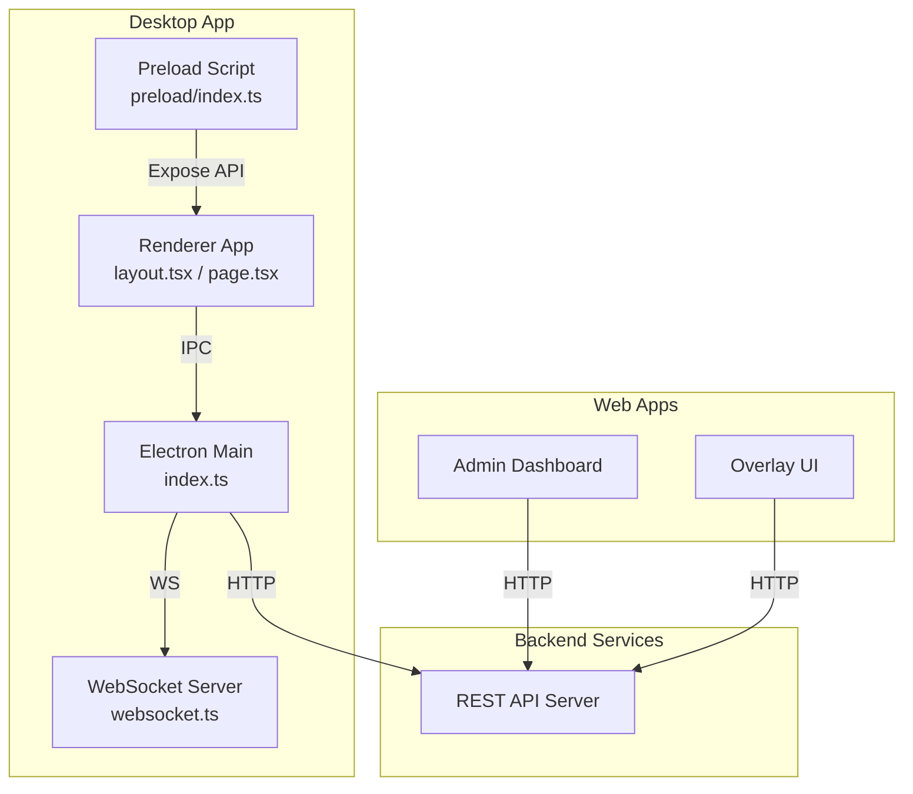
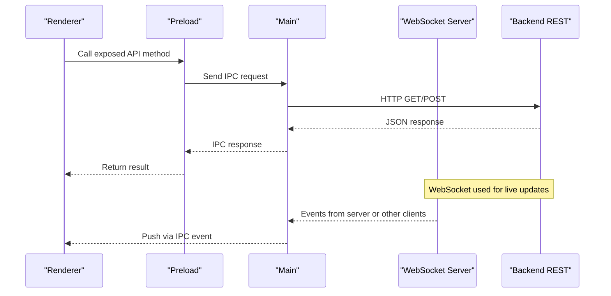
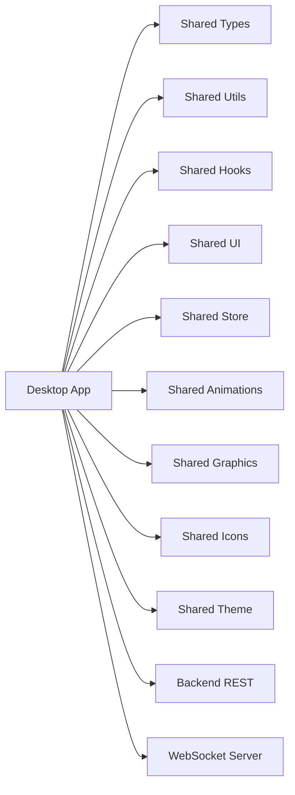

# API Reference

<cite>
**Referenced Files in This Document**
- [apps/desktop/src/main/index.ts](file://apps/desktop/src/main/index.ts)
- [apps/desktop/src/main/websocket.ts](file://apps/desktop/src/main/websocket.ts)
- [apps/desktop/src/preload/index.ts](file://apps/desktop/src/preload/index.ts)
- [apps/desktop/src/renderer/app/layout.tsx](file://apps/desktop/src/renderer/app/layout.tsx)
- [apps/desktop/src/renderer/app/page.tsx](file://apps/desktop/src/renderer/app/page.tsx)
- [apps/backend/package.json](file://apps/backend/package.json)
- [apps/admin/package.json](file://apps/admin/package.json)
- [apps/overlay/package.json](file://apps/overlay/package.json)
- [package.json](file://package.json)
- [pnpm-workspace.yaml](file://pnpm-workspace.yaml)
</cite>

## Table of Contents
1. [Introduction](#introduction)
2. [Project Structure](#project-structure)
3. [Core Components](#core-components)
4. [Architecture Overview](#architecture-overview)
5. [Detailed Component Analysis](#detailed-component-analysis)
6. [Dependency Analysis](#dependency-analysis)
7. [Performance Considerations](#performance-considerations)
8. [Troubleshooting Guide](#troubleshooting-guide)
9. [Conclusion](#conclusion)
10. [Appendices](#appendices)

## Introduction
This document provides comprehensive API documentation for AR Sports, covering internal and external interfaces across the Electron desktop application, backend services, and web overlays. It documents:
- IPC communication protocols between Electron main and renderer processes
- WebSocket API for real-time messaging
- REST endpoints exposed by backend services
- JavaScript APIs exposed through preload scripts to renderers
- Request/response schemas, authentication methods, error codes, and rate limiting policies
- Client implementation examples, message formats, event handling patterns
- Type definitions, configuration interfaces, and extension points
- Security considerations, versioning strategies, and backwards compatibility
- Debugging tools, monitoring approaches, and troubleshooting guides

## Project Structure
AR Sports is a monorepo with multiple apps and shared packages:
- apps/desktop: Electron-based desktop app with Next.js renderer, main process modules, and preload script
- apps/backend: Backend service exposing REST APIs
- apps/admin: Admin dashboard (Next.js)
- apps/overlay: Overlay UI (Next.js)
- packages: Shared libraries (animations, graphics, hooks, icons, store, theme, types, ui, utils)

**Diagram sources**
- [apps/desktop/src/main/index.ts](file://apps/desktop/src/main/index.ts)
- [apps/desktop/src/main/websocket.ts](file://apps/desktop/src/main/websocket.ts)
- [apps/desktop/src/preload/index.ts](file://apps/desktop/src/preload/index.ts)
- [apps/desktop/src/renderer/app/layout.tsx](file://apps/desktop/src/renderer/app/layout.tsx)
- [apps/desktop/src/renderer/app/page.tsx](file://apps/desktop/src/renderer/app/page.tsx)
- [apps/backend/package.json](file://apps/backend/package.json)
- [apps/admin/package.json](file://apps/admin/package.json)
- [apps/overlay/package.json](file://apps/overlay/package.json)

**Section sources**
- [package.json](file://package.json)
- [pnpm-workspace.yaml](file://pnpm-workspace.yaml)

## Core Components
- Electron Main Process: Initializes the app, manages windows, exposes IPC handlers, and coordinates WebSocket connections.
- Preload Script: Exposes a secure JavaScript API to the renderer via contextBridge.
- Renderer Application: Uses the exposed API to communicate with the main process and backend services.
- WebSocket Server: Handles real-time messaging between components and clients.
- Backend REST API: Provides data access and business logic endpoints consumed by desktop and web apps.

Key responsibilities:
- IPC channels for command/request-response and events/push notifications
- WebSocket rooms and channels for live updates
- Authentication and authorization at both IPC and HTTP layers
- Error propagation and consistent response schemas

**Section sources**
- [apps/desktop/src/main/index.ts](file://apps/desktop/src/main/index.ts)
- [apps/desktop/src/preload/index.ts](file://apps/desktop/src/preload/index.ts)
- [apps/desktop/src/main/websocket.ts](file://apps/desktop/src/main/websocket.ts)
- [apps/backend/package.json](file://apps/backend/package.json)

## Architecture Overview
The system integrates three primary communication mechanisms:
- IPC: Secure channel between renderer and main using contextBridge and ipcMain/ipcRenderer
- WebSocket: Real-time bidirectional messaging for live features
- REST: Standard HTTP endpoints for CRUD and server operations

**Diagram sources**
- [apps/desktop/src/preload/index.ts](file://apps/desktop/src/preload/index.ts)
- [apps/desktop/src/main/index.ts](file://apps/desktop/src/main/index.ts)
- [apps/desktop/src/main/websocket.ts](file://apps/desktop/src/main/websocket.ts)
- [apps/backend/package.json](file://apps/backend/package.json)

## Detailed Component Analysis

### IPC Communication Protocol
- Channels:
  - Command channels for request/response pairs (e.g., fetch data, execute actions)
  - Event channels for push notifications (e.g., live updates, status changes)
- Message Format:
  - Requests include an action identifier, payload, and optional correlation ID
  - Responses include status, data, and error details
- Security:
  - Only explicitly whitelisted channels are exposed via preload
  - Input validation and sanitization in main process handlers

Example usage pattern:
- Renderer calls a function from the preload-exposed API
- Preload forwards the call to main via IPC
- Main executes the operation and returns a structured response
- Errors are propagated back consistently

**Section sources**
- [apps/desktop/src/preload/index.ts](file://apps/desktop/src/preload/index.ts)
- [apps/desktop/src/main/index.ts](file://apps/desktop/src/main/index.ts)

### WebSocket API
- Connection:
  - Establishes a persistent connection for real-time messaging
  - Supports authentication tokens or session identifiers
- Channels/Roles:
  - Rooms or namespaces for grouping messages (e.g., match-specific channels)
  - Role-based permissions for publishing/subscribing
- Message Types:
  - Heartbeat keep-alive
  - Live state updates
  - User actions and acknowledgments
- Error Handling:
  - Reconnect strategy with exponential backoff
  - Graceful degradation when disconnected

Client integration:
- Initialize connection on app start
- Subscribe to relevant channels
- Handle incoming messages and update UI state
- Manage reconnection and error states

**Section sources**
- [apps/desktop/src/main/websocket.ts](file://apps/desktop/src/main/websocket.ts)

### REST Endpoints
- Base URL: Provided by backend service configuration
- Authentication:
  - Token-based (JWT or session cookies)
  - Scoped permissions per endpoint
- Common Schemas:
  - Success responses include data and metadata
  - Error responses include code, message, and optional details
- Rate Limiting:
  - Per-client limits enforced by middleware
  - Retry-after headers on throttled requests

Typical endpoints:
- Match management (CRUD)
- Team and player data
- Settings and configuration
- Analytics and reporting

**Section sources**
- [apps/backend/package.json](file://apps/backend/package.json)

### Preload JavaScript API
- Purpose:
  - Safely expose selected main process capabilities to the renderer
- Exposure Model:
  - Methods mapped to IPC channels
  - Promise-based async interface
- Security Boundaries:
  - No direct access to Node.js or Electron internals
  - Strict input validation before forwarding to main

Usage example pattern:
- Import the exposed API module
- Call methods like fetchMatchData or subscribeToLiveUpdates
- Handle success and error branches

**Section sources**
- [apps/desktop/src/preload/index.ts](file://apps/desktop/src/preload/index.ts)

### Renderer Application Integration
- Layout and Pages:
  - Initialize API clients and WebSocket connections
  - Manage global state and event listeners
- Data Flow:
  - Fetch initial data via REST or IPC
  - Subscribe to live updates via WebSocket
  - Update UI reactively based on events

**Section sources**
- [apps/desktop/src/renderer/app/layout.tsx](file://apps/desktop/src/renderer/app/layout.tsx)
- [apps/desktop/src/renderer/app/page.tsx](file://apps/desktop/src/renderer/app/page.tsx)

## Dependency Analysis
The desktop app depends on shared packages and backend services. The workspace configuration defines inter-app relationships and shared dependencies.

**Diagram sources**
- [pnpm-workspace.yaml](file://pnpm-workspace.yaml)
- [apps/desktop/src/main/index.ts](file://apps/desktop/src/main/index.ts)
- [apps/desktop/src/main/websocket.ts](file://apps/desktop/src/main/websocket.ts)
- [apps/backend/package.json](file://apps/backend/package.json)

**Section sources**
- [pnpm-workspace.yaml](file://pnpm-workspace.yaml)
- [package.json](file://package.json)

## Performance Considerations
- IPC:
  - Batch small messages where possible
  - Avoid heavy serialization; use efficient payloads
- WebSocket:
  - Use presence and delta updates to minimize bandwidth
  - Implement backpressure and message queuing
- REST:
  - Cache responses appropriately
  - Paginate large datasets
- Concurrency:
  - Limit concurrent IPC calls
  - Debounce frequent UI-triggered actions

[No sources needed since this section provides general guidance]

## Troubleshooting Guide
Common issues and resolutions:
- IPC failures:
  - Verify channel names and permissions in preload
  - Check main process logs for handler errors
- WebSocket disconnects:
  - Inspect network connectivity and firewall rules
  - Review reconnect logic and backoff settings
- REST errors:
  - Validate authentication tokens and scopes
  - Check rate limit headers and retry strategies
- Debugging:
  - Enable verbose logging in development
  - Use browser devtools for renderer and network inspection
  - Monitor WebSocket frames and IPC traffic

**Section sources**
- [apps/desktop/src/main/index.ts](file://apps/desktop/src/main/index.ts)
- [apps/desktop/src/main/websocket.ts](file://apps/desktop/src/main/websocket.ts)
- [apps/backend/package.json](file://apps/backend/package.json)

## Conclusion
AR Sports integrates IPC, WebSocket, and REST to deliver a responsive and scalable desktop experience. By adhering to the documented protocols, security practices, and performance guidelines, integrators can build robust client implementations that leverage real-time features and backend services effectively.

[No sources needed since this section summarizes without analyzing specific files]

## Appendices

### Request/Response Schemas
- IPC Request:
  - Fields: action, payload, correlationId
- IPC Response:
  - Fields: status, data, error
- WebSocket Message:
  - Fields: type, payload, timestamp, sender
- REST Success:
  - Fields: data, meta
- REST Error:
  - Fields: code, message, details

[No sources needed since this section provides general schema definitions]

### Authentication Methods
- IPC:
  - Validate caller context and channel permissions
- WebSocket:
  - Authenticate on connect using token or session
- REST:
  - JWT bearer tokens or cookie sessions
  - Scope-based authorization

[No sources needed since this section provides general authentication guidance]

### Error Codes
- IPC:
  - Channel not found, invalid payload, permission denied
- WebSocket:
  - Unauthorized, room full, protocol error
- REST:
  - Standard HTTP status codes with detailed error bodies

[No sources needed since this section provides general error code guidance]

### Rate Limiting Policies
- IPC:
  - Throttle high-frequency calls per renderer
- WebSocket:
  - Limit messages per second per client
- REST:
  - Global and per-user limits with configurable thresholds

[No sources needed since this section provides general rate limiting guidance]

### Versioning Strategies
- API versioning via path segments or headers
- Deprecation policy with migration windows
- Backwards compatibility guarantees for major versions

[No sources needed since this section provides general versioning guidance]

### Extension Points
- Custom IPC handlers in main process
- WebSocket middleware for custom logic
- REST plugins for additional endpoints

[No sources needed since this section provides general extension point guidance]

### Monitoring Approaches
- Centralized logging for IPC, WebSocket, and REST
- Metrics collection for latency, throughput, and errors
- Alerting on critical failures and anomalies

[No sources needed since this section provides general monitoring guidance]