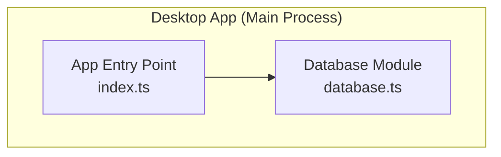
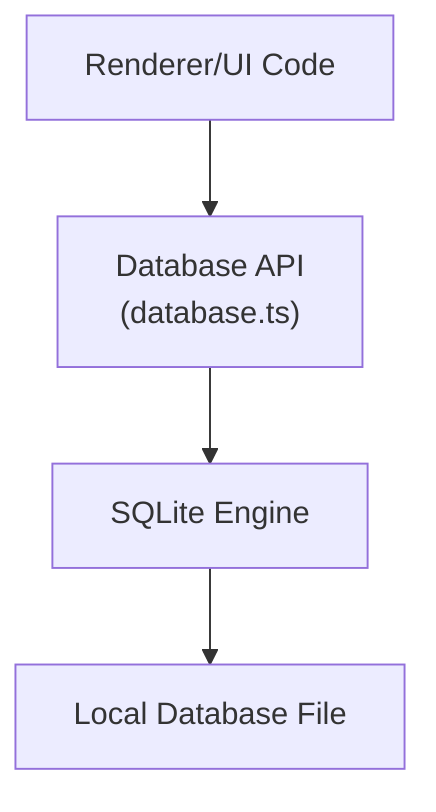
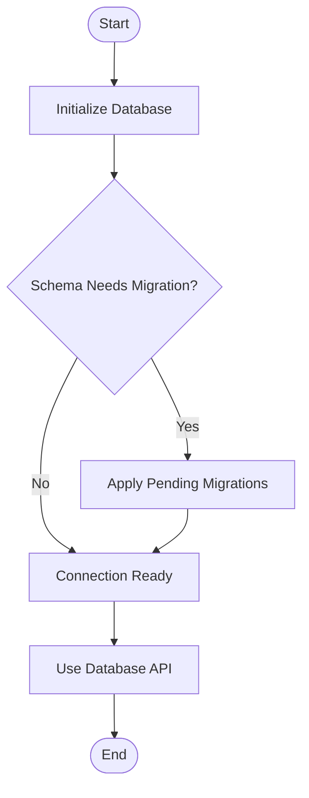
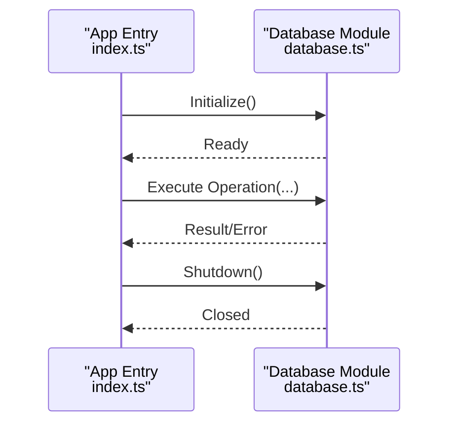
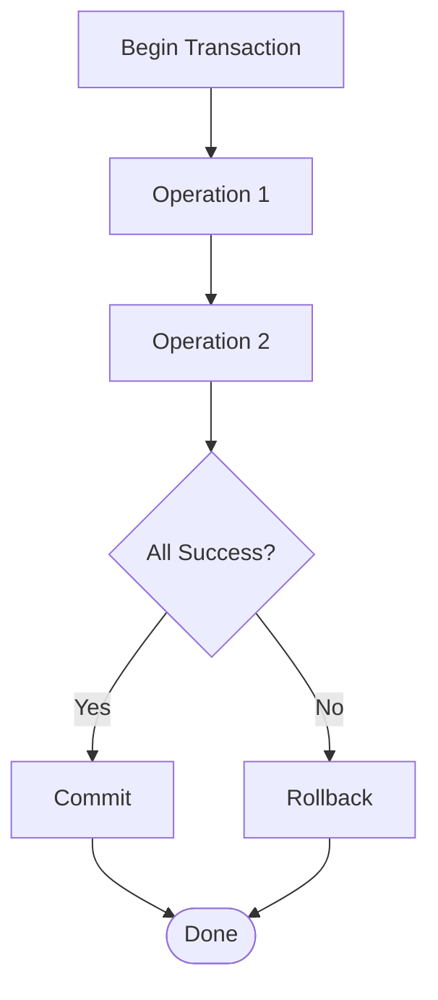
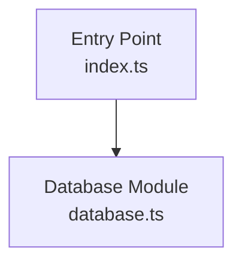

# Database API

<cite>
**Referenced Files in This Document**
- [database.ts](file://apps/desktop/src/main/database.ts)
- [index.ts](file://apps/desktop/src/main/index.ts)
</cite>

## Table of Contents
1. [Introduction](#introduction)
2. [Project Structure](#project-structure)
3. [Core Components](#core-components)
4. [Architecture Overview](#architecture-overview)
5. [Detailed Component Analysis](#detailed-component-analysis)
6. [Dependency Analysis](#dependency-analysis)
7. [Performance Considerations](#performance-considerations)
8. [Troubleshooting Guide](#troubleshooting-guide)
9. [Conclusion](#conclusion)
10. [Appendices](#appendices)

## Introduction
This document describes the local data persistence layer for AR Sports, focusing on the SQLite-based database API exposed by the desktop application’s main process. It explains how the database is initialized, how CRUD operations are performed, and how transactions are managed. It also provides guidance on schema design, query interfaces, backup and restore procedures, validation rules, performance optimization, caching strategies, concurrent access handling, security considerations, and maintenance practices.

## Project Structure
The persistence layer is implemented within the desktop app’s main process. The key files involved are:
- A dedicated database module that encapsulates initialization, connection management, and common operations.
- The main entry point that wires up the database module to the application lifecycle.

**Diagram sources**
- [database.ts](file://apps/desktop/src/main/database.ts)
- [index.ts](file://apps/desktop/src/main/index.ts)

**Section sources**
- [database.ts](file://apps/desktop/src/main/database.ts)
- [index.ts](file://apps/desktop/src/main/index.ts)

## Core Components
- Database Initialization: Responsible for opening or creating the SQLite file, applying schema migrations, and ensuring a healthy connection before use.
- Connection Management: Provides a single shared connection with safe access patterns suitable for Electron’s main process environment.
- Query Interface: Offers typed helpers for executing parameterized queries, running transactions, and performing common read/write operations.
- Transaction Manager: Wraps multiple statements into atomic units with proper commit/rollback semantics.
- Utility Helpers: Includes functions for backup, restore, integrity checks, and basic diagnostics.

Typical responsibilities and boundaries:
- All database interactions should go through the centralized database module to ensure consistent configuration, error handling, and resource cleanup.
- Avoid direct low-level calls from UI code; instead, expose higher-level APIs that encapsulate SQL details.

**Section sources**
- [database.ts](file://apps/desktop/src/main/database.ts)
- [index.ts](file://apps/desktop/src/main/index.ts)

## Architecture Overview
The database API follows a layered approach:
- Application Layer (UI and business logic) calls into the Database API.
- Database API abstracts SQLite specifics and exposes typed methods for reads, writes, and transactions.
- Underneath, SQLite persists data to a local file.

[No sources needed since this diagram shows conceptual workflow, not actual code structure]

## Detailed Component Analysis

### Database Module
Responsibilities:
- Initialize the database connection and apply schema changes.
- Provide high-level methods for CRUD operations.
- Manage transactions and ensure consistency.
- Expose utilities for backup, restore, and integrity checks.

Key areas to review:
- Initialization flow and migration strategy.
- Parameter binding and prepared statements usage.
- Error propagation and logging conventions.
- Resource disposal and graceful shutdown.

**Diagram sources**
- [database.ts](file://apps/desktop/src/main/database.ts)

**Section sources**
- [database.ts](file://apps/desktop/src/main/database.ts)

### Application Entry Point Integration
Responsibilities:
- Import and initialize the database module during app startup.
- Ensure the database is ready before exposing features that depend on it.
- Handle shutdown to close connections cleanly.

**Diagram sources**
- [index.ts](file://apps/desktop/src/main/index.ts)
- [database.ts](file://apps/desktop/src/main/database.ts)

**Section sources**
- [index.ts](file://apps/desktop/src/main/index.ts)
- [database.ts](file://apps/desktop/src/main/database.ts)

### Data Models and Schema
Guidelines:
- Define clear entities and relationships aligned with AR Sports domain concepts (e.g., matches, teams, players).
- Use foreign keys to enforce referential integrity where appropriate.
- Keep indexes minimal but sufficient for frequent query paths.
- Version your schema using a migration system to support upgrades without data loss.

Recommended modeling practices:
- Normalize data to reduce duplication while balancing read performance.
- Prefer surrogate primary keys for stable references.
- Store timestamps consistently (UTC) and include created_at/updated_at fields for auditability.

[No sources needed since this section provides general guidance]

### CRUD Operations
Patterns:
- Create: Insert new records with validated inputs; return identifiers.
- Read: Fetch single or multiple records using parameterized queries; support pagination and filtering.
- Update: Modify existing records with optimistic concurrency checks if necessary.
- Delete: Soft delete when required for audit trails; otherwise hard delete with cascade constraints.

Best practices:
- Always use parameter binding to prevent SQL injection.
- Wrap multi-step writes in transactions to maintain consistency.
- Return structured results with explicit error codes/messages.

[No sources needed since this section provides general guidance]

### Query Interfaces
Recommendations:
- Provide typed wrappers around raw SQL to improve safety and readability.
- Support common query builders for filtering, sorting, and pagination.
- Centralize complex joins and aggregations behind well-named methods.

Example categories:
- Simple selects by ID or unique keys.
- List queries with filters and ordering.
- Aggregations and analytics endpoints.

[No sources needed since this section provides general guidance]

### Transaction Management
Principles:
- Group related writes into a single transaction to ensure all-or-nothing semantics.
- Use savepoints for nested operations when supported.
- Roll back on any failure and propagate errors to callers.
- Keep transactions short to minimize lock contention.

**Diagram sources**
- [database.ts](file://apps/desktop/src/main/database.ts)

**Section sources**
- [database.ts](file://apps/desktop/src/main/database.ts)

### Backup and Restore Procedures
Backup:
- Perform consistent backups by either pausing writes briefly or using WAL mode snapshots.
- Copy the database file atomically or stream it to a secure location.
- Include metadata such as timestamp and version for traceability.

Restore:
- Validate the backup file integrity before restoring.
- Close active connections and replace the live database safely.
- Rebuild indexes if necessary and run integrity checks post-restore.

Operational notes:
- Schedule periodic backups and retain versions according to retention policies.
- Encrypt backups at rest if sensitive data is present.

[No sources needed since this section provides general guidance]

### Data Validation Rules
Rules to enforce:
- Not-null constraints for required fields.
- Unique constraints for identifiers and business keys.
- Range and format validations via CHECK constraints or application-level validators.
- Referential integrity via foreign keys.

Implementation tips:
- Validate inputs before issuing INSERT/UPDATE statements.
- Surface constraint violations as user-friendly errors.

[No sources needed since this section provides general guidance]

### Performance Optimization Techniques
- Index frequently filtered/sorted columns and composite indexes for common query patterns.
- Use EXPLAIN ANALYZE to identify slow queries and optimize them.
- Prefer batched inserts/updates over individual statements.
- Enable WAL mode for better concurrency and checkpointing behavior.
- Tune PRAGMA settings (e.g., cache size, journal mode) based on workload.

[No sources needed since this section provides general guidance]

### Data Access Patterns and Caching Strategies
Patterns:
- Cache hot reference data (e.g., lookup tables) in memory with invalidation hooks.
- Use read replicas or separate connections for heavy analytical queries if applicable.
- Implement request coalescing for bursty read workloads.

Caching guidelines:
- Keep caches small and time-bound.
- Invalidate on write operations or via TTL.
- Monitor cache hit rates and adjust sizes accordingly.

[No sources needed since this section provides general guidance]

### Concurrent Access Handling
Considerations:
- SQLite supports concurrent readers; limit concurrent writers.
- Use WAL mode to allow readers to proceed while a writer holds locks.
- Serialize long-running writes and keep transactions brief.
- Avoid holding connections across event loops or async boundaries longer than necessary.

[No sources needed since this section provides general guidance]

### Security and Encryption Options
Security measures:
- Enforce least privilege for database file permissions.
- Use parameterized queries exclusively.
- Sanitize and validate all inputs.
- Log only non-sensitive information.

Encryption options:
- Use an encrypted SQLite extension or encrypt the database file at rest.
- Protect encryption keys securely (e.g., OS keychain or secure enclave).
- Rotate keys periodically and re-encrypt stored data as needed.

[No sources needed since this section provides general guidance]

### Maintenance Procedures
Routine tasks:
- Run integrity checks regularly (e.g., PRAGMA integrity_check).
- Rebuild indexes after large bulk loads.
- Vacuum periodically to reclaim space.
- Monitor file size growth and set retention policies.

Operational checklist:
- Verify backups succeed and can be restored.
- Review slow query logs and update indexes.
- Plan schema migrations during maintenance windows.

[No sources needed since this section provides general guidance]

## Dependency Analysis
The database module is consumed by the application entry point and potentially other internal modules. The relationship is straightforward: the entry point initializes and uses the database API.

**Diagram sources**
- [index.ts](file://apps/desktop/src/main/index.ts)
- [database.ts](file://apps/desktop/src/main/database.ts)

**Section sources**
- [index.ts](file://apps/desktop/src/main/index.ts)
- [database.ts](file://apps/desktop/src/main/database.ts)

## Performance Considerations
- Prefer prepared statements and reuse them when possible.
- Batch operations to reduce round-trips and transaction overhead.
- Use appropriate isolation levels and keep transactions short.
- Profile queries and add targeted indexes rather than over-indexing.
- Monitor disk I/O and consider SSD-backed storage for responsiveness.

[No sources needed since this section provides general guidance]

## Troubleshooting Guide
Common issues and resolutions:
- Database locked: Reduce concurrent writers, shorten transactions, and enable WAL mode.
- Integrity errors: Run integrity checks, repair or restore from backup, and investigate recent migrations.
- Slow queries: Analyze execution plans, refine indexes, and simplify complex joins.
- Permission errors: Ensure correct file ownership and read/write permissions.

Diagnostic steps:
- Enable verbose logging for database operations.
- Capture stack traces on failures.
- Record timing metrics for critical operations.

[No sources needed since this section provides general guidance]

## Conclusion
The AR Sports local persistence layer centers around a robust SQLite-backed database API that standardizes initialization, CRUD operations, transactions, and maintenance utilities. By following the recommended patterns for schema design, query construction, performance tuning, and security, teams can build reliable, efficient, and maintainable data access layers tailored to AR Sports’ needs.

## Appendices

### Example Operations Reference
- Initialize database and apply migrations.
- Insert a new record and retrieve its identifier.
- Fetch a record by ID with optional includes.
- Update a record with optimistic concurrency check.
- Delete a record and cascade dependent updates.
- Execute a transaction with multiple writes and rollback on failure.
- Run a paginated list query with filters and sorting.
- Perform a backup and verify integrity.
- Restore from a verified backup and rebuild indexes.

[No sources needed since this section provides general guidance]