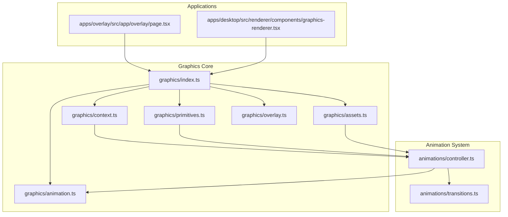
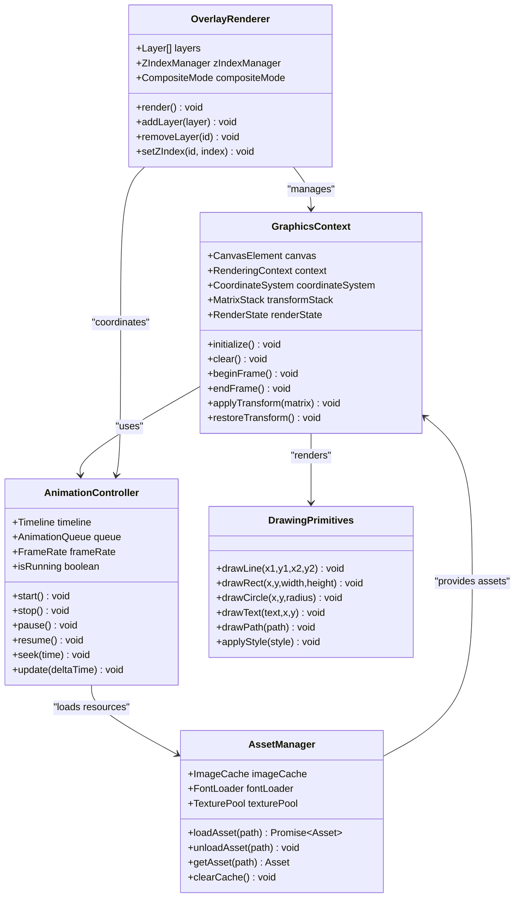
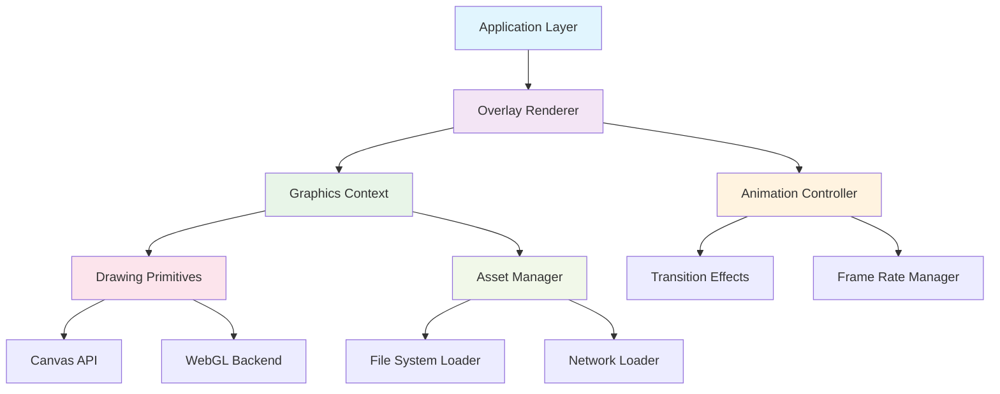

# Graphics Rendering API

<cite>
**Referenced Files in This Document**
- [graphics/index.ts](file://packages/graphics/index.ts)
- [graphics/context.ts](file://packages/graphics/context.ts)
- [graphics/primitives.ts](file://packages/graphics/primitives.ts)
- [graphics/animation.ts](file://packages/graphics/animation.ts)
- [graphics/assets.ts](file://packages/graphics/assets.ts)
- [graphics/overlay.ts](file://packages/graphics/overlay.ts)
- [animations/controller.ts](file://packages/animations/controller.ts)
- [animations/transitions.ts](file://packages/animations/transitions.ts)
- [apps/overlay/src/app/overlay/page.tsx](file://apps/overlay/src/app/overlay/page.tsx)
- [apps/desktop/src/renderer/components/graphics-renderer.tsx](file://apps/desktop/src/renderer/components/graphics-renderer.tsx)
</cite>

## Table of Contents
1. [Introduction](#introduction)
2. [Project Structure](#project-structure)
3. [Core Components](#core-components)
4. [Architecture Overview](#architecture-overview)
5. [Detailed Component Analysis](#detailed-component-analysis)
6. [Dependency Analysis](#dependency-analysis)
7. [Performance Considerations](#performance-considerations)
8. [Troubleshooting Guide](#troubleshooting-guide)
9. [Conclusion](#conclusion)
10. [Appendices](#appendices)

## Introduction

The AR Sports Graphics Rendering API provides a comprehensive canvas-based rendering engine designed for augmented reality sports applications. This API enables developers to create interactive graphics overlays, animations, and real-time visualizations for sports broadcasting and analysis. The system is built around a modular architecture that supports hardware acceleration, cross-platform compatibility, and high-performance rendering pipelines.

The graphics engine serves as the foundation for overlay rendering, asset management, animation control, and user interaction handling. It provides both low-level drawing primitives and high-level abstractions suitable for various use cases from simple text overlays to complex 3D visualizations.

## Project Structure

The graphics rendering system is organized into several key packages and modules:

**Diagram sources**
- [graphics/index.ts:1-50](file://packages/graphics/index.ts#L1-L50)
- [graphics/context.ts:1-100](file://packages/graphics/context.ts#L1-L100)
- [animations/controller.ts:1-80](file://packages/animations/controller.ts#L1-L80)

**Section sources**
- [graphics/index.ts:1-50](file://packages/graphics/index.ts#L1-L50)
- [graphics/context.ts:1-100](file://packages/graphics/context.ts#L1-L100)
- [animations/controller.ts:1-80](file://packages/animations/controller.ts#L1-L80)

## Core Components

### Graphics Context Management

The graphics context serves as the primary interface for all rendering operations. It manages the underlying canvas element, coordinate systems, transformation matrices, and rendering state.

#### Key Features:
- Canvas initialization and configuration
- Coordinate system management (world vs screen coordinates)
- Transformation matrix stack operations
- Rendering state preservation and restoration
- Hardware acceleration detection and fallbacks

#### Context Lifecycle:
1. **Initialization**: Create and configure canvas elements
2. **Setup**: Establish coordinate systems and default states
3. **Rendering Loop**: Process draw calls and update transformations
4. **Cleanup**: Release resources and reset state

### Drawing Primitives

The primitive system provides fundamental drawing operations for creating visual elements:

#### Basic Shapes:
- Lines and polylines with configurable stroke properties
- Rectangles and rounded rectangles with fill/stroke options
- Circles and ellipses with arc calculations
- Polygons with vertex-based definitions

#### Advanced Shapes:
- Bezier curves and cubic splines
- Text rendering with font management
- Path operations and compound shapes
- Gradient fills and pattern textures

#### Style Management:
- Color system with RGBA and HSL support
- Stroke width and dash patterns
- Fill styles including gradients and patterns
- Shadow effects and blur operations

### Animation System

The animation controller provides a robust framework for managing time-based animations and transitions:

#### Animation Types:
- Linear interpolation between values
- Easing functions (ease-in, ease-out, bounce)
- Keyframe-based animations
- Physics-based motion simulation

#### Timeline Management:
- Sequential and parallel animation scheduling
- Animation chaining and dependency resolution
- Frame rate independent timing
- Pause, resume, and seek functionality

**Section sources**
- [graphics/context.ts:1-100](file://packages/graphics/context.ts#L1-L100)
- [graphics/primitives.ts:1-150](file://packages/graphics/primitives.ts#L1-L150)
- [graphics/animation.ts:1-200](file://packages/graphics/animation.ts#L1-L200)

## Architecture Overview

The graphics rendering engine follows a layered architecture pattern that separates concerns and promotes modularity:

**Diagram sources**
- [graphics/context.ts:1-100](file://packages/graphics/context.ts#L1-L100)
- [graphics/animation.ts:1-200](file://packages/graphics/animation.ts#L1-L200)
- [graphics/assets.ts:1-150](file://packages/graphics/assets.ts#L1-L150)
- [graphics/overlay.ts:1-120](file://packages/graphics/overlay.ts#L1-L120)

## Detailed Component Analysis

### Graphics Context Implementation

The graphics context is the central hub for all rendering operations. It maintains the rendering state and provides methods for drawing operations.

#### Context Configuration Options:
- Canvas dimensions and pixel ratio
- Anti-aliasing settings
- Hardware acceleration preferences
- Performance profiling flags

#### State Management:
- Transform matrix stack for hierarchical positioning
- Style property inheritance and scoping
- Clip region management
- Blend mode configuration

#### Error Handling:
- Canvas context loss recovery
- Invalid operation detection
- Memory usage monitoring
- Performance degradation warnings

### Animation Controller Architecture

The animation controller manages the timing and execution of animations across the entire rendering pipeline.

#### Animation Queue Management:
- Priority-based scheduling
- Dependency resolution between animations
- Resource preloading for smooth playback
- Memory cleanup for completed animations

#### Frame Rate Management:
- Adaptive frame rate adjustment
- VSync synchronization
- Performance throttling under load
- Frame skipping strategies

#### Transition Effects:
- Built-in easing functions
- Custom transition composition
- Cross-fade and wipe effects
- Physics-based motion curves

**Section sources**
- [graphics/context.ts:1-100](file://packages/graphics/context.ts#L1-L100)
- [graphics/animation.ts:1-200](file://packages/graphics/animation.ts#L1-L200)
- [animations/controller.ts:1-80](file://packages/animations/controller.ts#L1-L80)

### Overlay Rendering Pipeline

The overlay system provides a layer-based approach to compositing multiple graphical elements:

#### Layer Management:
- Z-index ordering and stacking contexts
- Visibility culling for off-screen elements
- Batch rendering for improved performance
- Event propagation through layers

#### Composite Operations:
- Multiple blend modes (multiply, screen, overlay)
- Alpha compositing with Porter-Duff equations
- Masking and clipping regions
- Post-processing effects

#### Performance Optimizations:
- Dirty rectangle tracking
- Viewport culling
- Texture atlasing
- GPU memory optimization

### Asset Loading System

The asset manager handles loading, caching, and disposal of graphical resources:

#### Supported Formats:
- Image formats (PNG, JPEG, WebP, SVG)
- Font files (TTF, OTF, WOFF)
- Video textures for animated backgrounds
- Audio assets for synchronized playback

#### Caching Strategy:
- LRU cache with configurable size limits
- Reference counting for shared resources
- Automatic garbage collection
- Memory pressure handling

#### Loading Optimization:
- Parallel loading with concurrency limits
- Progressive loading for large assets
- Lazy loading for off-screen content
- Asset versioning and cache busting

**Section sources**
- [graphics/assets.ts:1-150](file://packages/graphics/assets.ts#L1-L150)
- [graphics/overlay.ts:1-120](file://packages/graphics/overlay.ts#L1-L120)

## Dependency Analysis

The graphics system has well-defined dependencies between components:

**Diagram sources**
- [graphics/index.ts:1-50](file://packages/graphics/index.ts#L1-L50)
- [graphics/context.ts:1-100](file://packages/graphics/context.ts#L1-L100)
- [graphics/animation.ts:1-200](file://packages/graphics/animation.ts#L1-L200)

### Component Coupling Analysis:

- **Low Coupling**: Each component has clear interfaces and minimal direct dependencies
- **High Cohesion**: Related functionality is grouped within appropriate modules
- **Dependency Injection**: Services are injected rather than hardcoded
- **Event-Driven Communication**: Loose coupling through event bus pattern

**Section sources**
- [graphics/index.ts:1-50](file://packages/graphics/index.ts#L1-L50)
- [graphics/context.ts:1-100](file://packages/graphics/context.ts#L1-L100)

## Performance Considerations

### Hardware Acceleration

The graphics engine automatically detects and utilizes hardware acceleration when available:

#### WebGL Integration:
- Automatic fallback to 2D canvas when WebGL unavailable
- Shader program compilation and caching
- Vertex buffer optimization
- Texture compression and mipmapping

#### Memory Management:
- Object pooling for frequently created objects
- Garbage collection optimization
- Memory leak detection and prevention
- Large object streaming for reduced peak memory

### Frame Rate Optimization

#### Adaptive Quality:
- Dynamic resolution scaling based on performance
- LOD (Level of Detail) for complex graphics
- Selective feature disabling under memory pressure
- Background processing for non-critical tasks

#### Rendering Pipeline Optimization:
- Batched draw calls to minimize state changes
- Frustum culling for off-screen objects
- Instanced rendering for repeated elements
- Offscreen canvas for complex compositions

### Cross-Platform Compatibility

#### Browser Support:
- Feature detection and graceful degradation
- Polyfills for missing APIs
- Mobile-specific optimizations
- Touch input handling

#### Platform-Specific Optimizations:
- iOS Safari performance tuning
- Android Chrome optimizations
- Desktop browser enhancements
- Electron app considerations

**Section sources**
- [graphics/context.ts:1-100](file://packages/graphics/context.ts#L1-L100)
- [graphics/assets.ts:1-150](file://packages/graphics/assets.ts#L1-L150)

## Troubleshooting Guide

### Common Issues and Solutions

#### Canvas Context Loss:
- **Symptoms**: Blank screen or frozen rendering
- **Causes**: Memory pressure, tab switching, device sleep
- **Solutions**: Implement context restoration, resource reloading

#### Performance Degradation:
- **Symptoms**: Low frame rates, stuttering animations
- **Causes**: Excessive draw calls, large images, memory leaks
- **Solutions**: Enable batching, optimize assets, implement culling

#### Memory Leaks:
- **Symptoms**: Increasing memory usage over time
- **Causes**: Unclosed event listeners, retained references
- **Solutions**: Proper cleanup, weak references, memory profiling

#### Cross-Browser Issues:
- **Symptoms**: Inconsistent rendering across browsers
- **Causes**: Feature differences, vendor prefixes
- **Solutions**: Feature detection, polyfills, testing matrix

### Debugging Tools

#### Performance Profiling:
- Frame rate monitoring
- Draw call counting
- Memory usage tracking
- GPU utilization metrics

#### Visual Debugging:
- Bounding box visualization
- Hit testing overlays
- Performance heatmaps
- Animation timeline inspection

**Section sources**
- [graphics/context.ts:1-100](file://packages/graphics/context.ts#L1-L100)
- [graphics/animation.ts:1-200](file://packages/graphics/animation.ts#L1-L200)

## Conclusion

The AR Sports Graphics Rendering API provides a comprehensive, high-performance solution for canvas-based rendering in augmented reality sports applications. Its modular architecture, extensive feature set, and optimization strategies make it suitable for demanding real-time graphics requirements.

Key strengths include:
- Robust hardware acceleration with graceful fallbacks
- Flexible animation system with advanced easing and transitions
- Efficient asset management with intelligent caching
- Comprehensive overlay rendering pipeline
- Cross-platform compatibility with platform-specific optimizations

The API's design emphasizes performance, maintainability, and extensibility, making it an ideal foundation for building sophisticated sports visualization applications.

## Appendices

### Getting Started Guide

#### Basic Setup:
1. Initialize the graphics context with canvas configuration
2. Set up the overlay renderer with desired layers
3. Configure the animation controller with frame rate preferences
4. Load required assets and prepare resources

#### Creating Custom Graphics:
1. Extend the base drawing primitives for custom shapes
2. Implement custom animation behaviors
3. Create reusable graphic components
4. Integrate with the overlay system

#### Best Practices:
- Always handle canvas context loss gracefully
- Use object pooling for frequently created objects
- Implement proper resource cleanup
- Profile and optimize critical rendering paths
- Test across target platforms and devices

### API Reference Summary

#### Core Classes:
- GraphicsContext: Main rendering interface
- AnimationController: Animation management
- AssetManager: Resource loading and caching
- OverlayRenderer: Layer-based compositing
- DrawingPrimitives: Basic shape drawing

#### Key Interfaces:
- Drawable: Interface for renderable objects
- Animatable: Interface for animatable properties
- Asset: Base interface for loaded resources
- Layer: Interface for overlay components

**Section sources**
- [graphics/index.ts:1-50](file://packages/graphics/index.ts#L1-L50)
- [apps/overlay/src/app/overlay/page.tsx:1-100](file://apps/overlay/src/app/overlay/page.tsx#L1-L100)
- [apps/desktop/src/renderer/components/graphics-renderer.tsx:1-150](file://apps/desktop/src/renderer/components/graphics-renderer.tsx#L1-L150)