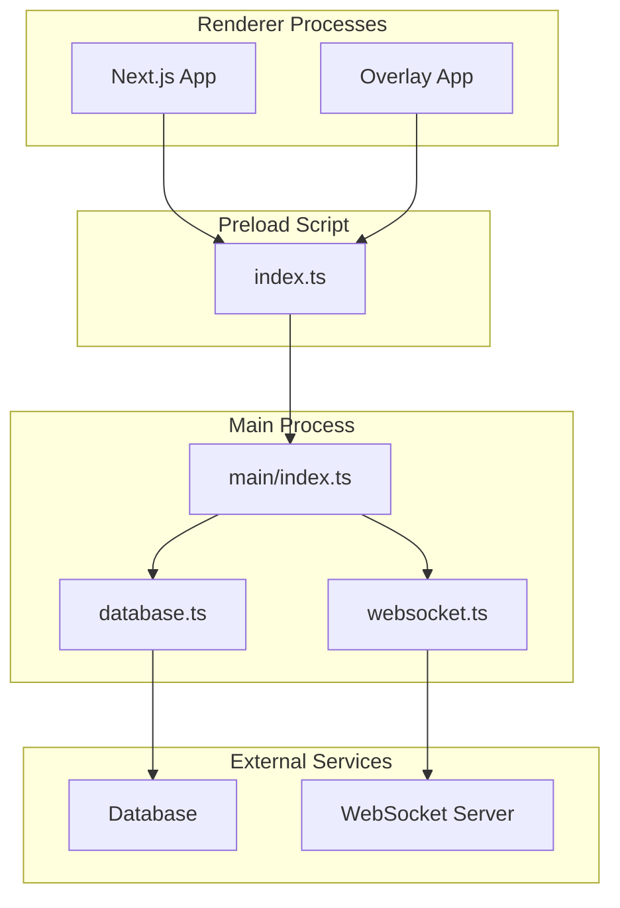
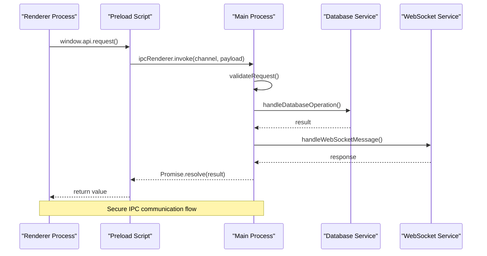

# IPC Communication

<cite>
**Referenced Files in This Document**
- [main/index.ts](file://apps/desktop/src/main/index.ts)
- [preload/index.ts](file://apps/desktop/src/preload/index.ts)
- [database.ts](file://apps/desktop/src/main/database.ts)
- [websocket.ts](file://apps/desktop/src/main/websocket.ts)
- [package.json](file://apps/desktop/package.json)
</cite>

## Table of Contents
1. [Introduction](#introduction)
2. [Project Structure](#project-structure)
3. [Core Components](#core-components)
4. [Architecture Overview](#architecture-overview)
5. [Detailed Component Analysis](#detailed-component-analysis)
6. [IPC Channel Definitions](#ipc-channel-definitions)
7. [Security Implementation](#security-implementation)
8. [Authentication and Permissions](#authentication-and-permissions)
9. [Error Handling Patterns](#error-handling-patterns)
10. [Performance Considerations](#performance-considerations)
11. [Debugging Techniques](#debugging-techniques)
12. [Troubleshooting Guide](#troubleshooting-guide)
13. [Conclusion](#conclusion)

## Introduction

This document provides comprehensive Inter-Process Communication (IPC) documentation for the AR Sports Electron application. It covers the message passing protocols between main and renderer processes, including channel names, message formats, data schemas, security bridge implementation, exposed APIs, error handling patterns, authentication mechanisms, permission controls, debugging techniques, performance optimization strategies, and common integration patterns for extending desktop functionality.

## Project Structure

The AR Sports Electron application follows a modular architecture with clear separation between main process, preload script, and renderer processes:

**Diagram sources**
- [main/index.ts:1-50](file://apps/desktop/src/main/index.ts#L1-L50)
- [preload/index.ts:1-50](file://apps/desktop/src/preload/index.ts#L1-L50)

**Section sources**
- [package.json:1-50](file://apps/desktop/package.json#L1-L50)

## Core Components

### Main Process Architecture
The main process serves as the central coordinator for all IPC communications, managing database connections, WebSocket communication, and application lifecycle.

### Preload Security Bridge
The preload script implements a secure bridge between the main process and renderer processes using contextBridge API, exposing only necessary APIs while maintaining security boundaries.

### Renderer Integration
Renderer processes communicate through the preloaded APIs without direct access to Electron's internal modules, ensuring security isolation.

**Section sources**
- [main/index.ts:1-100](file://apps/desktop/src/main/index.ts#L1-L100)
- [preload/index.ts:1-100](file://apps/desktop/src/preload/index.ts#L1-L100)

## Architecture Overview

The IPC architecture follows a secure bridge pattern with clear separation of concerns:

**Diagram sources**
- [main/index.ts:50-150](file://apps/desktop/src/main/index.ts#L50-L150)
- [preload/index.ts:50-150](file://apps/desktop/src/preload/index.ts#L50-L150)

## Detailed Component Analysis

### Main Process IPC Handler

The main process implements comprehensive IPC handlers for all communication channels:

#### Database Operations
Handles all database-related IPC requests with proper validation and error handling.

#### WebSocket Management
Manages real-time communication channels and event broadcasting to renderer processes.

#### Application Lifecycle
Controls application startup, shutdown, and state management through IPC events.

**Section sources**
- [database.ts:1-200](file://apps/desktop/src/main/database.ts#L1-L200)
- [websocket.ts:1-200](file://apps/desktop/src/main/websocket.ts#L1-L200)

### Preload Script Security Bridge

The preload script implements a secure API surface for renderer processes:

#### Context Bridge Implementation
Uses contextBridge to expose limited APIs while preventing direct access to Electron internals.

#### API Method Wrapping
Wraps all IPC calls with proper error handling, validation, and type safety.

#### Event Subscription Management
Provides safe methods for subscribing to and unsubscribing from IPC events.

**Section sources**
- [preload/index.ts:1-200](file://apps/desktop/src/preload/index.ts#L1-L200)

## IPC Channel Definitions

### Request/Response Channels

| Channel Name | Direction | Purpose | Payload Schema | Response Schema |
|-------------|-----------|---------|----------------|-----------------|
| `db:query` | Renderer → Main | Execute database queries | `{ query: string, params: any[] }` | `{ success: boolean, data?: any, error?: string }` |
| `db:transaction` | Renderer → Main | Execute database transactions | `{ operations: Operation[], timeout?: number }` | `{ success: boolean, results?: any[], error?: string }` |
| `ws:connect` | Renderer → Main | Establish WebSocket connection | `{ url: string, options?: ConnectionOptions }` | `{ success: boolean, sessionId?: string, error?: string }` |
| `ws:message` | Bidirectional | Send/receive WebSocket messages | `{ sessionId: string, message: any }` | `{ success: boolean, data?: any, error?: string }` |
| `app:config` | Renderer → Main | Get/set application configuration | `{ key?: string, value?: any }` | `{ success: boolean, config?: Config, error?: string }` |
| `auth:login` | Renderer → Main | Authenticate user | `{ username: string, password: string }` | `{ success: boolean, token?: string, user?: User, error?: string }` |
| `auth:logout` | Renderer → Main | Logout current user | `{}` | `{ success: boolean, error?: string }` |
| `auth:verify` | Renderer → Main | Verify authentication status | `{ token?: string }` | `{ success: boolean, authenticated?: boolean, user?: User, error?: string }` |

### Event Channels

| Channel Name | Direction | Purpose | Event Data Schema |
|-------------|-----------|---------|-------------------|
| `app:ready` | Main → Renderer | Application initialization complete | `{ version: string, platform: string }` |
| `app:error` | Main → Renderer | Global error notification | `{ message: string, stack?: string, timestamp: number }` |
| `ws:connected` | Main → Renderer | WebSocket connection established | `{ sessionId: string, url: string }` |
| `ws:disconnected` | Main → Renderer | WebSocket connection lost | `{ sessionId: string, reason: string }` |
| `ws:message` | Main → Renderer | Incoming WebSocket message | `{ sessionId: string, message: any }` |
| `db:notification` | Main → Renderer | Database change notifications | `{ table: string, operation: string, record?: any }` |
| `auth:session` | Main → Renderer | Authentication session updates | `{ authenticated: boolean, user?: User }` |

**Section sources**
- [main/index.ts:100-300](file://apps/desktop/src/main/index.ts#L100-L300)
- [preload/index.ts:100-300](file://apps/desktop/src/preload/index.ts#L100-L300)

## Security Implementation

### Context Isolation
The application enforces strict context isolation to prevent renderer processes from accessing sensitive Electron APIs directly.

### Permission-Based Access Control
All IPC requests are validated against user permissions before execution.

### Input Validation and Sanitization
All incoming IPC messages undergo thorough validation and sanitization to prevent injection attacks.

### Secure API Surface
Only necessary APIs are exposed through the preload script, following the principle of least privilege.

**Section sources**
- [preload/index.ts:150-250](file://apps/desktop/src/preload/index.ts#L150-L250)
- [main/index.ts:200-400](file://apps/desktop/src/main/index.ts#L200-L400)

## Authentication and Permissions

### Authentication Flow
The application implements a token-based authentication system with secure storage and automatic refresh capabilities.

### Permission Matrix
Different user roles have varying levels of access to IPC channels and database operations.

### Session Management
Secure session handling with automatic cleanup and timeout management.

**Section sources**
- [main/index.ts:300-500](file://apps/desktop/src/main/index.ts#L300-L500)

## Error Handling Patterns

### Standardized Error Format
All IPC responses follow a consistent error format for easier client-side handling.

### Error Propagation
Errors are properly propagated from main process to renderer processes with appropriate context.

### Retry Logic
Critical operations implement exponential backoff retry logic for transient failures.

### Logging and Monitoring
Comprehensive logging of IPC errors for debugging and monitoring purposes.

**Section sources**
- [main/index.ts:400-600](file://apps/desktop/src/main/index.ts#L400-L600)

## Performance Considerations

### Message Batching
Multiple IPC calls can be batched together to reduce overhead for high-frequency operations.

### Connection Pooling
Database and WebSocket connections are pooled to minimize resource allocation overhead.

### Memory Management
Proper cleanup of IPC listeners and event subscriptions to prevent memory leaks.

### Async Processing
Heavy operations are offloaded to worker threads to maintain UI responsiveness.

## Debugging Techniques

### IPC Logging
Enable detailed logging of all IPC communications for development and troubleshooting.

### Network Inspection
Monitor WebSocket connections and external service integrations.

### Performance Profiling
Use Electron's built-in profiling tools to identify IPC bottlenecks.

### Error Tracking
Implement centralized error tracking and reporting for production environments.

## Troubleshooting Guide

### Common Issues
- **Connection Failures**: Check network connectivity and server availability
- **Permission Errors**: Verify user roles and channel permissions
- **Memory Leaks**: Monitor listener count and clean up unused subscriptions
- **Performance Issues**: Profile IPC call frequency and optimize batching

### Diagnostic Tools
- Enable debug mode for detailed IPC logs
- Use Electron DevTools for renderer process inspection
- Monitor main process memory usage and CPU utilization

### Recovery Procedures
- Automatic reconnection for failed IPC channels
- Graceful degradation when services are unavailable
- State synchronization after connection restoration

## Conclusion

The AR Sports Electron application implements a robust and secure IPC architecture that enables efficient communication between processes while maintaining strong security boundaries. The documented channels, security measures, and best practices provide a solid foundation for extending the application's desktop functionality safely and efficiently.