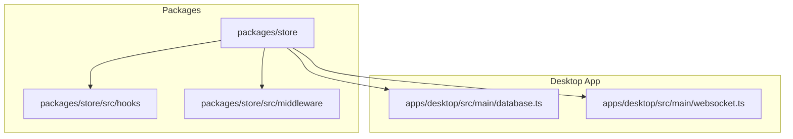
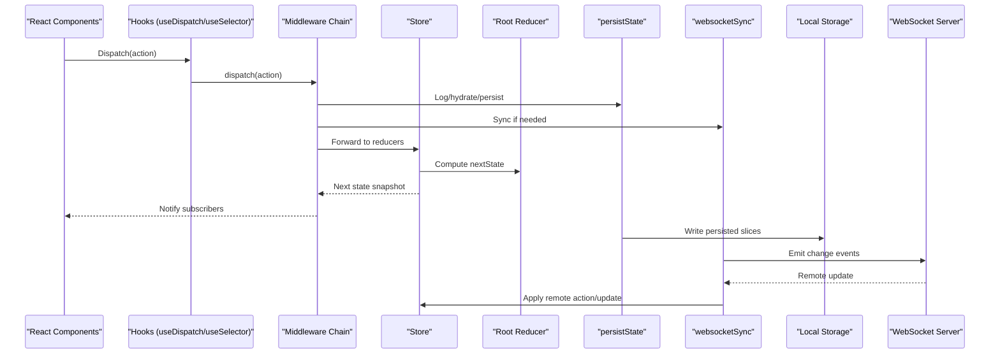
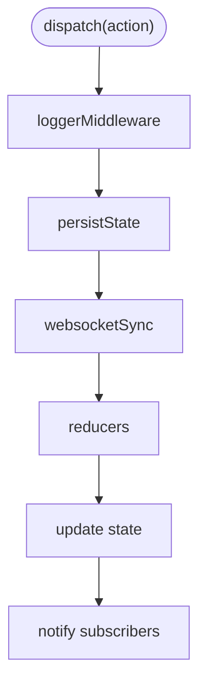
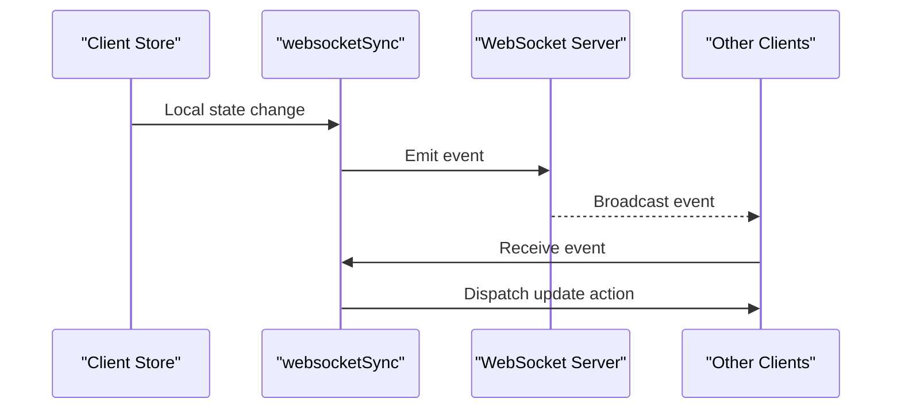
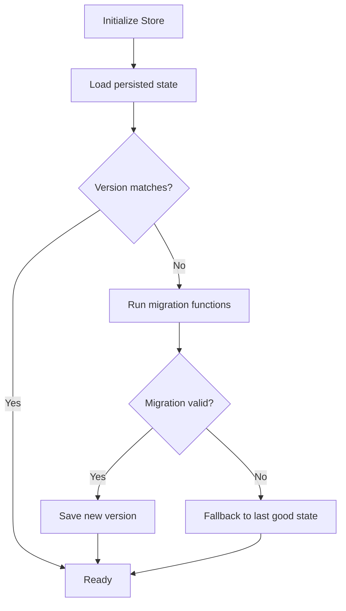
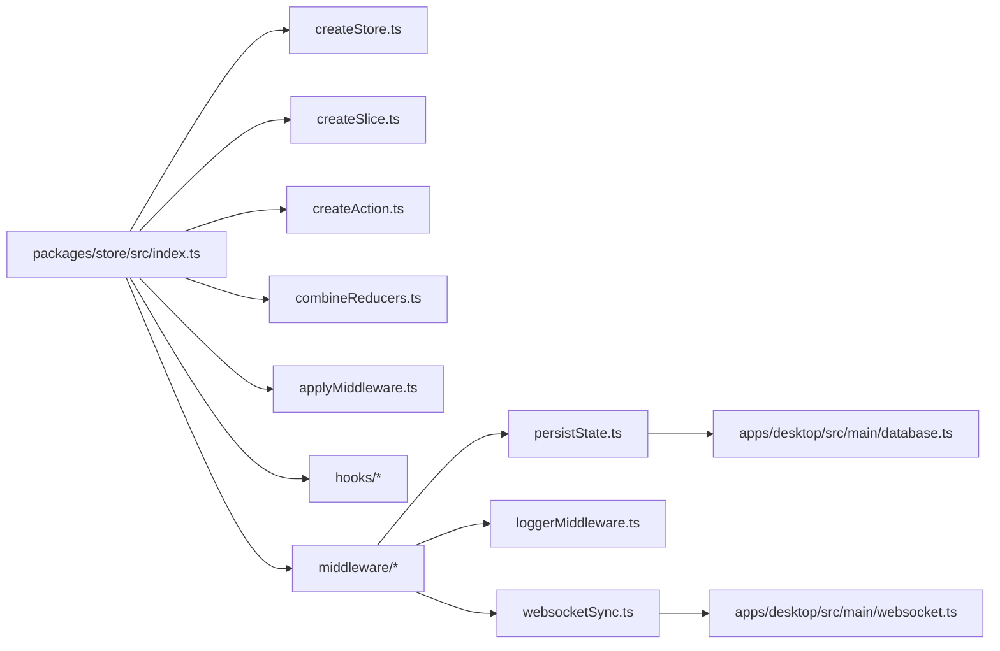

# State Management API

<cite>
**Referenced Files in This Document**
- [package.json](file://packages/store/package.json)
- [index.ts](file://packages/store/src/index.ts)
- [createStore.ts](file://packages/store/src/createStore.ts)
- [createSlice.ts](file://packages/store/src/createSlice.ts)
- [createAction.ts](file://packages/store/src/createAction.ts)
- [combineReducers.ts](file://packages/store/src/combineReducers.ts)
- [applyMiddleware.ts](file://packages/store/src/applyMiddleware.ts)
- [useSelector.ts](file://packages/store/src/hooks/useSelector.ts)
- [useDispatch.ts](file://packages/store/src/hooks/useDispatch.ts)
- [useStore.ts](file://packages/store/src/hooks/useStore.ts)
- [persistState.ts](file://packages/store/src/middleware/persistState.ts)
- [loggerMiddleware.ts](file://packages/store/src/middleware/loggerMiddleware.ts)
- [websocketSync.ts](file://packages/store/src/middleware/websocketSync.ts)
- [database.ts](file://apps/desktop/src/main/database.ts)
- [websocket.ts](file://apps/desktop/src/main/websocket.ts)
</cite>

## Table of Contents
1. [Introduction](#introduction)
2. [Project Structure](#project-structure)
3. [Core Components](#core-components)
4. [Architecture Overview](#architecture-overview)
5. [Detailed Component Analysis](#detailed-component-analysis)
6. [Dependency Analysis](#dependency-analysis)
7. [Performance Considerations](#performance-considerations)
8. [Troubleshooting Guide](#troubleshooting-guide)
9. [Conclusion](#conclusion)
10. [Appendices](#appendices)

## Introduction
This document describes the centralized state management system used across AR Sports applications. It explains the store architecture, action creators, reducers, middleware patterns, and React hooks integration. It also covers state synchronization across components, persistence strategies, real-time updates via WebSocket, performance optimization techniques, debugging tools, state versioning and migration strategies, and testing approaches for stateful components.

The system is designed to be:
- Predictable and unidirectional
- Modular with slices and combined reducers
- Extensible through middleware
- Persisted locally and synchronized in real time
- Easy to test and debug

## Project Structure
The state management implementation lives primarily under packages/store. The desktop app integrates local persistence and WebSocket synchronization.

**Diagram sources**
- [index.ts](file://packages/store/src/index.ts)
- [createStore.ts](file://packages/store/src/createStore.ts)
- [createSlice.ts](file://packages/store/src/createSlice.ts)
- [createAction.ts](file://packages/store/src/createAction.ts)
- [combineReducers.ts](file://packages/store/src/combineReducers.ts)
- [applyMiddleware.ts](file://packages/store/src/applyMiddleware.ts)
- [useSelector.ts](file://packages/store/src/hooks/useSelector.ts)
- [useDispatch.ts](file://packages/store/src/hooks/useDispatch.ts)
- [useStore.ts](file://packages/store/src/hooks/useStore.ts)
- [persistState.ts](file://packages/store/src/middleware/persistState.ts)
- [loggerMiddleware.ts](file://packages/store/src/middleware/loggerMiddleware.ts)
- [websocketSync.ts](file://packages/store/src/middleware/websocketSync.ts)
- [database.ts](file://apps/desktop/src/main/database.ts)
- [websocket.ts](file://apps/desktop/src/main/websocket.ts)

**Section sources**
- [package.json](file://packages/store/package.json)
- [index.ts](file://packages/store/src/index.ts)

## Core Components
This section outlines the core building blocks of the state management system.

- Store creation and lifecycle
  - createStore: Creates a single source of truth store with subscribe, dispatch, getState, replaceReducer, and optional enhancers/middleware.
  - applyMiddleware: Composes middleware around dispatch to intercept actions before they reach reducers.
  - combineReducers: Merges multiple slice reducers into a single root reducer.

- Slices and actions
  - createSlice: Defines a state slice with initial state, reducers, and optionally selectors. Generates action creators from reducer keys.
  - createAction: Utility to build typed action objects with payload and metadata.

- React hooks
  - useSelector: Subscribes to selected parts of the store and re-renders only when the selection changes (with referential equality by default).
  - useDispatch: Returns the store’s dispatch function for triggering actions.
  - useStore: Provides direct access to the store instance for advanced scenarios.

- Middleware
  - persistState: Serializes selected state slices to persistent storage and hydrates on initialization.
  - loggerMiddleware: Logs dispatched actions, previous/next state, and timing for debugging.
  - websocketSync: Publishes relevant state changes over WebSocket and applies remote updates to keep clients in sync.

- Desktop integrations
  - database.ts: Local persistence adapter for Electron main process.
  - websocket.ts: WebSocket client for real-time synchronization between processes or devices.

**Section sources**
- [createStore.ts](file://packages/store/src/createStore.ts)
- [applyMiddleware.ts](file://packages/store/src/applyMiddleware.ts)
- [combineReducers.ts](file://packages/store/src/combineReducers.ts)
- [createSlice.ts](file://packages/store/src/createSlice.ts)
- [createAction.ts](file://packages/store/src/createAction.ts)
- [useSelector.ts](file://packages/store/src/hooks/useSelector.ts)
- [useDispatch.ts](file://packages/store/src/hooks/useDispatch.ts)
- [useStore.ts](file://packages/store/src/hooks/useStore.ts)
- [persistState.ts](file://packages/store/src/middleware/persistState.ts)
- [loggerMiddleware.ts](file://packages/store/src/middleware/loggerMiddleware.ts)
- [websocketSync.ts](file://packages/store/src/middleware/websocketSync.ts)
- [database.ts](file://apps/desktop/src/main/database.ts)
- [websocket.ts](file://apps/desktop/src/main/websocket.ts)

## Architecture Overview
The store follows a unidirectional data flow:
- Components dispatch actions created by action creators or slice-generated functions.
- Middleware intercepts actions for logging, persistence, and network synchronization.
- Reducers compute the next immutable state based on the action type and payload.
- Subscribers (including React hooks) receive updates and re-render accordingly.

**Diagram sources**
- [createStore.ts](file://packages/store/src/createStore.ts)
- [applyMiddleware.ts](file://packages/store/src/applyMiddleware.ts)
- [combineReducers.ts](file://packages/store/src/combineReducers.ts)
- [useDispatch.ts](file://packages/store/src/hooks/useDispatch.ts)
- [useSelector.ts](file://packages/store/src/hooks/useSelector.ts)
- [persistState.ts](file://packages/store/src/middleware/persistState.ts)
- [websocketSync.ts](file://packages/store/src/middleware/websocketSync.ts)
- [database.ts](file://apps/desktop/src/main/database.ts)
- [websocket.ts](file://apps/desktop/src/main/websocket.ts)

## Detailed Component Analysis

### Store Creation and Composition
- createStore builds the store object and composes middleware using applyMiddleware.
- It exposes:
  - getState(): returns current state snapshot
  - dispatch(action): sends an action through middleware chain to reducers
  - subscribe(listener): registers listeners for state changes
  - replaceReducer(nextReducer): hot-swaps the root reducer during development or migrations

Key behaviors:
- Initial state hydration can occur before the first dispatch (e.g., from persisted storage).
- Middleware can short-circuit dispatch or transform actions/state.

**Section sources**
- [createStore.ts](file://packages/store/src/createStore.ts)
- [applyMiddleware.ts](file://packages/store/src/applyMiddleware.ts)

### Slice and Action Creators
- createSlice defines:
  - initialState: the starting shape for this slice
  - reducers: plain functions mapping action types to state transitions
  - optional selectors: derived computations memoized per slice
- It generates action creators for each reducer key, returning typed action objects.

- createAction helps define custom actions with explicit payloads and metadata.

Usage pattern:
- Define one slice per domain feature (e.g., match, teams, settings).
- Combine slices with combineReducers to form the root state tree.

**Section sources**
- [createSlice.ts](file://packages/store/src/createSlice.ts)
- [createAction.ts](file://packages/store/src/createAction.ts)
- [combineReducers.ts](file://packages/store/src/combineReducers.ts)

### React Hooks Integration
- useSelector(selectorFn, equalityFn?): subscribes to store changes and re-renders only when selector output changes.
- useDispatch(): returns the store’s dispatch function bound to the current store instance.
- useStore(): provides direct access to the store for advanced operations like replaceReducer or accessing internal APIs.

Best practices:
- Keep selectors lightweight and return stable references where possible.
- Use equalityFn to customize comparison for complex selections.

**Section sources**
- [useSelector.ts](file://packages/store/src/hooks/useSelector.ts)
- [useDispatch.ts](file://packages/store/src/hooks/useDispatch.ts)
- [useStore.ts](file://packages/store/src/hooks/useStore.ts)

### Middleware Patterns
- applyMiddleware chains middlewares around dispatch. Each middleware receives next and store, enabling:
  - Logging and metrics
  - Side effects (network calls, persistence)
  - Action transformation or filtering

Common built-ins:
- loggerMiddleware: logs action types, payloads, and state diffs.
- persistState: persists selected slices to local storage and hydrates on init.
- websocketSync: publishes state changes and applies remote updates.

**Diagram sources**
- [applyMiddleware.ts](file://packages/store/src/applyMiddleware.ts)
- [loggerMiddleware.ts](file://packages/store/src/middleware/loggerMiddleware.ts)
- [persistState.ts](file://packages/store/src/middleware/persistState.ts)
- [websocketSync.ts](file://packages/store/src/middleware/websocketSync.ts)

**Section sources**
- [applyMiddleware.ts](file://packages/store/src/applyMiddleware.ts)
- [loggerMiddleware.ts](file://packages/store/src/middleware/loggerMiddleware.ts)
- [persistState.ts](file://packages/store/src/middleware/persistState.ts)
- [websocketSync.ts](file://packages/store/src/middleware/websocketSync.ts)

### Persistence Strategy
- persistState serializes configured slices to local storage and hydrates them before the first render.
- Supports:
  - Selective persistence (only specific slices)
  - Custom serializers/deserializers
  - Error handling for corrupted storage entries

Integration points:
- database.ts provides low-level read/write operations for Electron main process.
- Hydration occurs early in store initialization to ensure consistent UI state.

**Section sources**
- [persistState.ts](file://packages/store/src/middleware/persistState.ts)
- [database.ts](file://apps/desktop/src/main/database.ts)

### Real-Time Updates
- websocketSync listens for local state changes and emits normalized events to a server.
- On receiving remote updates, it dispatches corresponding actions to keep all clients in sync.
- Handles connection lifecycle, retries, and conflict resolution strategies.

**Diagram sources**
- [websocketSync.ts](file://packages/store/src/middleware/websocketSync.ts)
- [websocket.ts](file://apps/desktop/src/main/websocket.ts)

**Section sources**
- [websocketSync.ts](file://packages/store/src/middleware/websocketSync.ts)
- [websocket.ts](file://apps/desktop/src/main/websocket.ts)

### Defining State Slices, Actions, and Subscriptions
- Define a slice with createSlice, including initial state and reducers.
- Generate action creators automatically or use createAction for custom actions.
- Subscribe to state changes using useSelector in React components or store.subscribe for non-React contexts.

Example workflow:
- Create a match slice with reducers for score updates and team info.
- Dispatch generated actions from UI interactions.
- Use selectors to derive computed values (e.g., winner status).

**Section sources**
- [createSlice.ts](file://packages/store/src/createSlice.ts)
- [createAction.ts](file://packages/store/src/createAction.ts)
- [useSelector.ts](file://packages/store/src/hooks/useSelector.ts)

### Hooks API Reference
- useSelector(selectorFn, equalityFn?)
  - Purpose: Subscribe to store and select a piece of state.
  - Behavior: Re-renders only when selector output changes.
- useDispatch()
  - Purpose: Access dispatch to trigger actions.
- useStore()
  - Purpose: Access the store instance directly.

**Section sources**
- [useSelector.ts](file://packages/store/src/hooks/useSelector.ts)
- [useDispatch.ts](file://packages/store/src/hooks/useDispatch.ts)
- [useStore.ts](file://packages/store/src/hooks/useStore.ts)

### Performance Optimization Techniques
- Prefer shallow equality in selectors; provide custom equalityFn for deep comparisons when necessary.
- Memoize expensive selectors at the slice level.
- Split large slices into smaller features to reduce re-renders.
- Avoid dispatching actions in render paths; batch updates where possible.
- Use replaceReducer for hot reloading during development without full page refresh.

[No sources needed since this section provides general guidance]

### Debugging Tools
- Enable loggerMiddleware in development to inspect actions and state diffs.
- Use Redux DevTools-compatible snapshots if integrating with external devtools.
- Add timestamps and action IDs for correlating logs across middleware.

**Section sources**
- [loggerMiddleware.ts](file://packages/store/src/middleware/loggerMiddleware.ts)

### State Versioning and Migration Strategies
- Maintain a version field in persisted state.
- On hydration, check version and apply migration functions to upgrade schema.
- Use replaceReducer to swap root reducers during major schema changes.
- Rollback strategy: detect failed migrations and revert to last known good state.

[No sources needed since this diagram shows conceptual workflow, not actual code structure]

### Testing Approaches for Stateful Components
- Unit tests for reducers: assert next state given action and previous state.
- Slice tests: verify generated action creators and selectors.
- Middleware tests: mock dispatch and store to assert side effects (persistence, network).
- Component tests: render with a test store, dispatch actions, and assert UI behavior.
- Snapshot tests: capture serialized state after actions for regression checks.

[No sources needed since this section provides general guidance]

## Dependency Analysis
The store package depends on minimal runtime libraries and exposes a clean public API. The desktop app wires persistence and WebSocket synchronization.

**Diagram sources**
- [index.ts](file://packages/store/src/index.ts)
- [createStore.ts](file://packages/store/src/createStore.ts)
- [createSlice.ts](file://packages/store/src/createSlice.ts)
- [createAction.ts](file://packages/store/src/createAction.ts)
- [combineReducers.ts](file://packages/store/src/combineReducers.ts)
- [applyMiddleware.ts](file://packages/store/src/applyMiddleware.ts)
- [useSelector.ts](file://packages/store/src/hooks/useSelector.ts)
- [useDispatch.ts](file://packages/store/src/hooks/useDispatch.ts)
- [useStore.ts](file://packages/store/src/hooks/useStore.ts)
- [persistState.ts](file://packages/store/src/middleware/persistState.ts)
- [loggerMiddleware.ts](file://packages/store/src/middleware/loggerMiddleware.ts)
- [websocketSync.ts](file://packages/store/src/middleware/websocketSync.ts)
- [database.ts](file://apps/desktop/src/main/database.ts)
- [websocket.ts](file://apps/desktop/src/main/websocket.ts)

**Section sources**
- [index.ts](file://packages/store/src/index.ts)
- [package.json](file://packages/store/package.json)

## Performance Considerations
- Minimize selector complexity and avoid creating new objects on every call.
- Use structural sharing in reducers to prevent unnecessary re-renders.
- Debounce high-frequency actions (e.g., live scores) before dispatching to reduce churn.
- Batch multiple small updates into a single action when appropriate.
- Profile with browser devtools and React Profiler to identify bottlenecks.

[No sources needed since this section provides general guidance]

## Troubleshooting Guide
Common issues and resolutions:
- State not updating in UI
  - Ensure selectors return stable references or implement a proper equalityFn.
  - Verify that actions are dispatched and reducers handle the action type.
- Persistence failures
  - Check storage quotas and serialization errors; add error boundaries around hydration.
  - Validate stored JSON and reset to defaults if corrupted.
- Real-time sync conflicts
  - Implement deterministic conflict resolution (e.g., last-write-wins with vector clocks).
  - Log incoming remote actions and compare with local state to diagnose drift.
- Excessive re-renders
  - Refactor selectors to be more granular.
  - Avoid dispatching actions inside render loops.

**Section sources**
- [loggerMiddleware.ts](file://packages/store/src/middleware/loggerMiddleware.ts)
- [persistState.ts](file://packages/store/src/middleware/persistState.ts)
- [websocketSync.ts](file://packages/store/src/middleware/websocketSync.ts)

## Conclusion
AR Sports’ state management system provides a robust, modular foundation for predictable state handling across applications. With slices, middleware, and React hooks, it supports persistence, real-time synchronization, and efficient rendering. By following best practices for selectors, performance, and testing, teams can maintain scalable and reliable state logic.

[No sources needed since this section summarizes without analyzing specific files]

## Appendices

### Quick Start Examples
- Define a slice:
  - Use createSlice to declare initial state and reducers for a feature.
- Create actions:
  - Use generated action creators or createAction for custom payloads.
- Subscribe to state:
  - Use useSelector to select and react to state changes in components.
- Integrate middleware:
  - Wrap store creation with applyMiddleware to enable logging, persistence, and sync.

**Section sources**
- [createSlice.ts](file://packages/store/src/createSlice.ts)
- [createAction.ts](file://packages/store/src/createAction.ts)
- [useSelector.ts](file://packages/store/src/hooks/useSelector.ts)
- [applyMiddleware.ts](file://packages/store/src/applyMiddleware.ts)