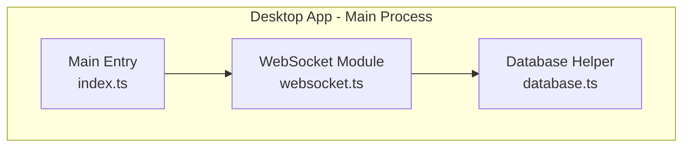
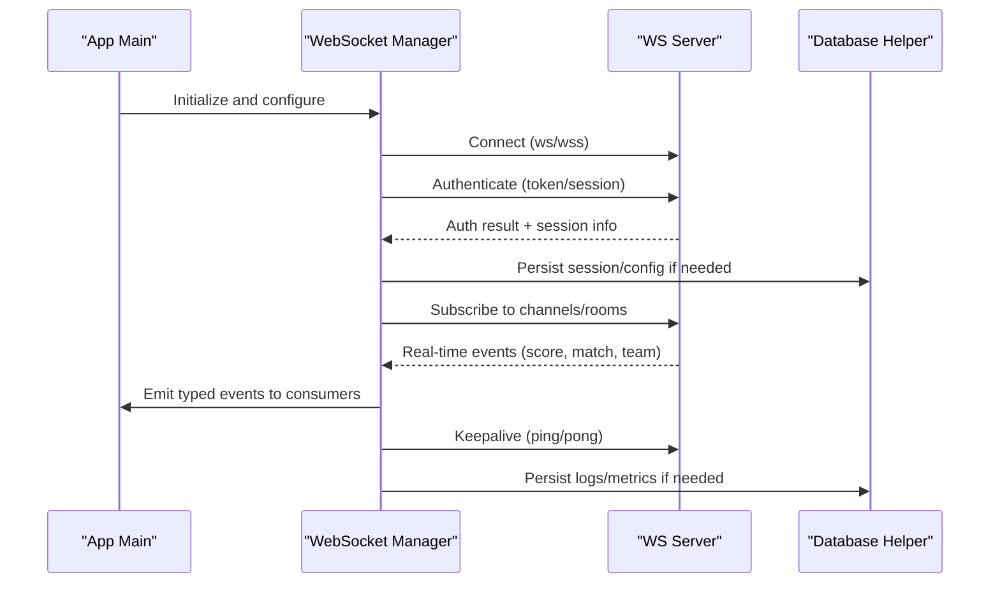
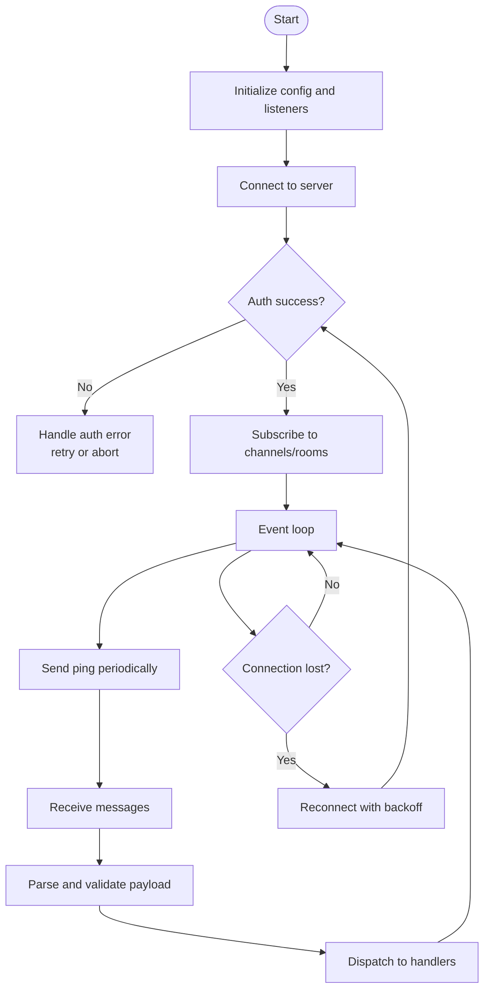
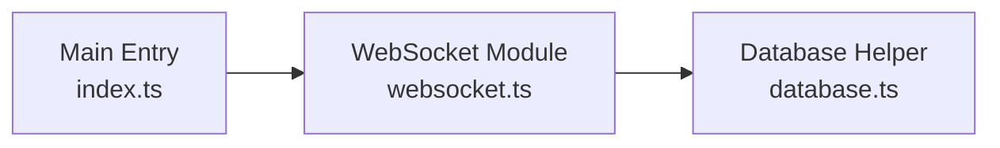

# WebSocket API

<cite>
**Referenced Files in This Document**
- [websocket.ts](file://apps/desktop/src/main/websocket.ts)
- [index.ts](file://apps/desktop/src/main/index.ts)
- [database.ts](file://apps/desktop/src/main/database.ts)
</cite>

## Table of Contents
1. [Introduction](#introduction)
2. [Project Structure](#project-structure)
3. [Core Components](#core-components)
4. [Architecture Overview](#architecture-overview)
5. [Detailed Component Analysis](#detailed-component-analysis)
6. [Dependency Analysis](#dependency-analysis)
7. [Performance Considerations](#performance-considerations)
8. [Troubleshooting Guide](#troubleshooting-guide)
9. [Conclusion](#conclusion)

## Introduction
This document describes the real-time communication layer for AR Sports, focusing on WebSocket-based messaging used by the desktop application. It covers connection establishment, authentication handshake, lifecycle management, event types and message formats, room/channel semantics, broadcasting patterns, client subscription models, and operational guidance such as error handling, reconnection strategies, and monitoring. The goal is to help implementers integrate live features like score updates, match events, and team notifications reliably and efficiently.

## Project Structure
The WebSocket implementation relevant to this documentation resides in the desktop app’s main process:
- A dedicated WebSocket module manages connections, messages, and lifecycle.
- The main entry initializes and wires up the WebSocket subsystem with other services (e.g., database).
- A database helper provides persistence utilities that may be used by the WebSocket layer for storing or retrieving state.

**Diagram sources**
- [websocket.ts](file://apps/desktop/src/main/websocket.ts)
- [index.ts](file://apps/desktop/src/main/index.ts)
- [database.ts](file://apps/desktop/src/main/database.ts)

**Section sources**
- [websocket.ts](file://apps/desktop/src/main/websocket.ts)
- [index.ts](file://apps/desktop/src/main/index.ts)
- [database.ts](file://apps/desktop/src/main/database.ts)

## Core Components
- WebSocket Manager: Responsible for establishing and maintaining a persistent connection to the server, performing authentication handshakes, routing incoming events, and emitting typed events to consumers.
- Message Router: Parses incoming payloads, validates structure, and dispatches to handlers based on event type and channel/room context.
- Lifecycle Controller: Manages connect, reconnect, heartbeat/ping-pong, and graceful shutdown behaviors.
- Persistence Integration: Optionally persists connection state, recent events, or configuration via the database helper.

Key responsibilities:
- Connection lifecycle: connect, authenticate, subscribe/unsubscribe, keepalive, disconnect.
- Event model: define event names, payload schemas, and required fields.
- Room/channel model: join/leave channels, broadcast within rooms, and manage subscriptions.
- Error handling: network errors, auth failures, malformed messages, and recovery strategies.

**Section sources**
- [websocket.ts](file://apps/desktop/src/main/websocket.ts)
- [index.ts](file://apps/desktop/src/main/index.ts)
- [database.ts](file://apps/desktop/src/main/database.ts)

## Architecture Overview
The WebSocket layer integrates into the desktop app’s main process and exposes typed events to UI/renderer processes. It coordinates with the database helper for persistence needs and is initialized from the main entry point.

**Diagram sources**
- [websocket.ts](file://apps/desktop/src/main/websocket.ts)
- [index.ts](file://apps/desktop/src/main/index.ts)
- [database.ts](file://apps/desktop/src/main/database.ts)

## Detailed Component Analysis

### WebSocket Manager
Responsibilities:
- Establish and maintain a single persistent connection.
- Perform an authentication handshake immediately after connect.
- Manage subscriptions to channels/rooms.
- Route incoming messages to appropriate handlers.
- Implement heartbeat/keepalive and automatic reconnection with backoff.
- Provide a stable event bus for consumers.

Operational notes:
- Reconnect strategy: exponential backoff with jitter; max retries configurable; resume subscriptions upon reconnect.
- Heartbeat: periodic ping/pong to detect dead connections early.
- Threading: runs in the main process; emits IPC-safe events to renderer processes.

**Diagram sources**
- [websocket.ts](file://apps/desktop/src/main/websocket.ts)

**Section sources**
- [websocket.ts](file://apps/desktop/src/main/websocket.ts)

### Message Router and Event Model
Responsibilities:
- Define event names and payload schemas.
- Validate incoming messages and reject malformed ones.
- Route events to handlers based on event type and channel/room context.

Common event categories:
- Authentication: handshake request/response, token refresh.
- Channel/Room: join, leave, list, presence updates.
- Match: live score updates, play-by-play events, status changes.
- Team: notifications, roster changes, role updates.
- System: heartbeat acknowledgments, server pings, maintenance notices.

Payload guidelines:
- Each message includes a top-level event name and a data object.
- Required fields are documented per event type.
- Optional fields should be ignored gracefully by consumers.

**Section sources**
- [websocket.ts](file://apps/desktop/src/main/websocket.ts)

### Room/Channel Management and Broadcasting
Responsibilities:
- Join/leave channels/rooms.
- Broadcast messages to all subscribers in a room.
- Maintain presence information where applicable.

Subscription model:
- Clients subscribe to one or more channels/rooms.
- Events are scoped to the channel/room they belong to.
- Consumers can filter by event type and room identifiers.

Broadcasting patterns:
- Server-to-client broadcasts for live updates.
- Client-to-server requests to publish events (with authorization checks).

**Section sources**
- [websocket.ts](file://apps/desktop/src/main/websocket.ts)

### Database Integration
Responsibilities:
- Persist connection state, recent events, or configuration as needed.
- Provide read/write helpers used by the WebSocket layer.

Usage examples:
- Save session metadata after successful authentication.
- Log metrics or last-seen events for diagnostics.

**Section sources**
- [database.ts](file://apps/desktop/src/main/database.ts)
- [websocket.ts](file://apps/desktop/src/main/websocket.ts)

### Initialization and Wiring
Responsibilities:
- Instantiate and configure the WebSocket manager.
- Wire up event listeners and expose APIs to other modules.
- Ensure graceful shutdown and cleanup.

**Section sources**
- [index.ts](file://apps/desktop/src/main/index.ts)
- [websocket.ts](file://apps/desktop/src/main/websocket.ts)

## Dependency Analysis
The WebSocket module depends on the main entry for initialization and may use the database helper for persistence. The following diagram shows these relationships.

**Diagram sources**
- [index.ts](file://apps/desktop/src/main/index.ts)
- [websocket.ts](file://apps/desktop/src/main/websocket.ts)
- [database.ts](file://apps/desktop/src/main/database.ts)

**Section sources**
- [index.ts](file://apps/desktop/src/main/index.ts)
- [websocket.ts](file://apps/desktop/src/main/websocket.ts)
- [database.ts](file://apps/desktop/src/main/database.ts)

## Performance Considerations
- Connection pooling: Maintain a single long-lived connection per logical service to reduce overhead. If multiple services require isolation, pool connections per tenant or feature.
- Backpressure: Buffer incoming events only when necessary; drop non-critical events under high load.
- Serialization: Use compact payloads and avoid unnecessary nesting.
- Heartbeat tuning: Adjust ping intervals based on network conditions to balance responsiveness and bandwidth.
- Scaling limitations: Monitor server-side limits for concurrent connections and per-room throughput. Consider sharding rooms across instances and using a pub/sub backbone for horizontal scaling.
- Monitoring: Track connection uptime, reconnection counts, message rates, latency, and error rates. Persist minimal telemetry for observability.

[No sources needed since this section provides general guidance]

## Troubleshooting Guide
Common issues and resolutions:
- Authentication failures: Verify token validity, expiration handling, and refresh flow. Check server responses and retry with backoff.
- Network interruptions: Enable automatic reconnection with exponential backoff and jitter. Resume subscriptions after reconnect.
- Malformed messages: Validate payloads strictly and log details for debugging. Ignore unknown fields safely.
- Dead connections: Implement ping/pong and timeout detection. Close and reopen connections proactively.
- High memory usage: Limit in-memory buffers, prune old events, and ensure proper cleanup on disconnect.

Operational tips:
- Log connection lifecycle events and key metrics.
- Provide diagnostic endpoints or IPC commands to inspect current state.
- Gracefully handle shutdown signals to flush pending writes and close connections cleanly.

**Section sources**
- [websocket.ts](file://apps/desktop/src/main/websocket.ts)
- [index.ts](file://apps/desktop/src/main/index.ts)

## Conclusion
The WebSocket layer provides a robust foundation for real-time features in AR Sports. By standardizing connection lifecycle, authentication, event schemas, and room/channel semantics, it enables consistent integration of live score updates, match events, and team notifications. Following the recommended practices for error handling, reconnection, performance, and monitoring will ensure reliable operation at scale.

[No sources needed since this section summarizes without analyzing specific files]