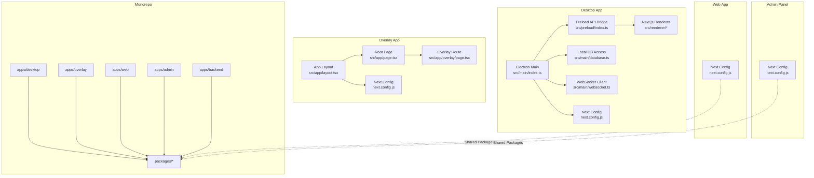
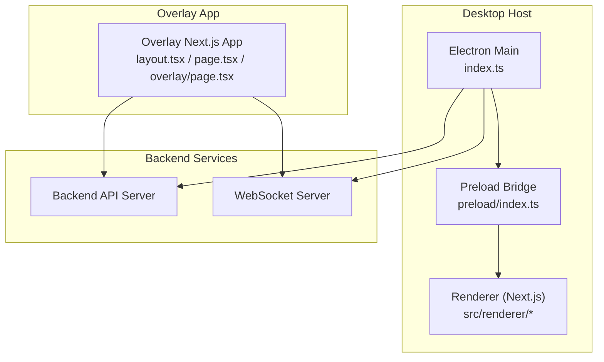
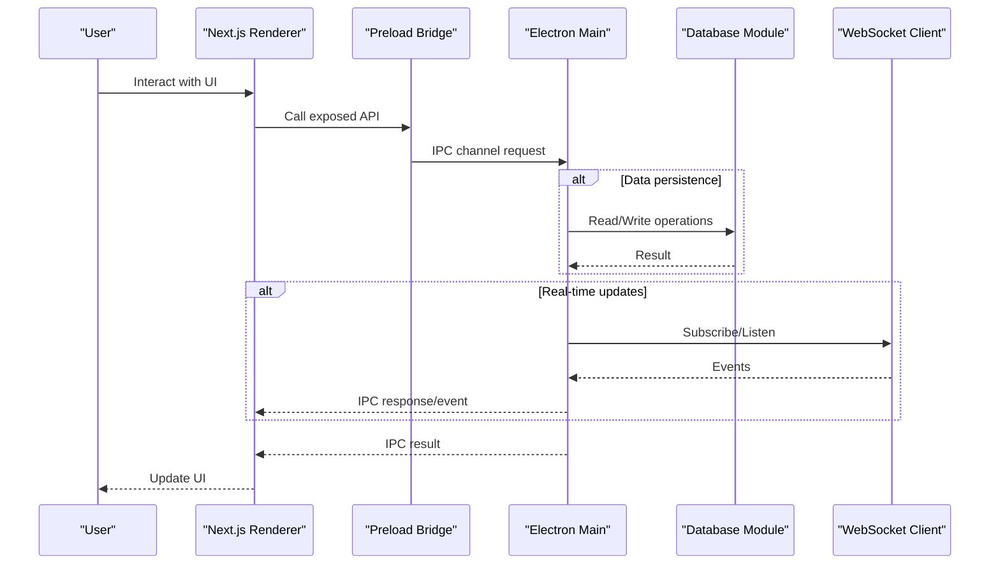
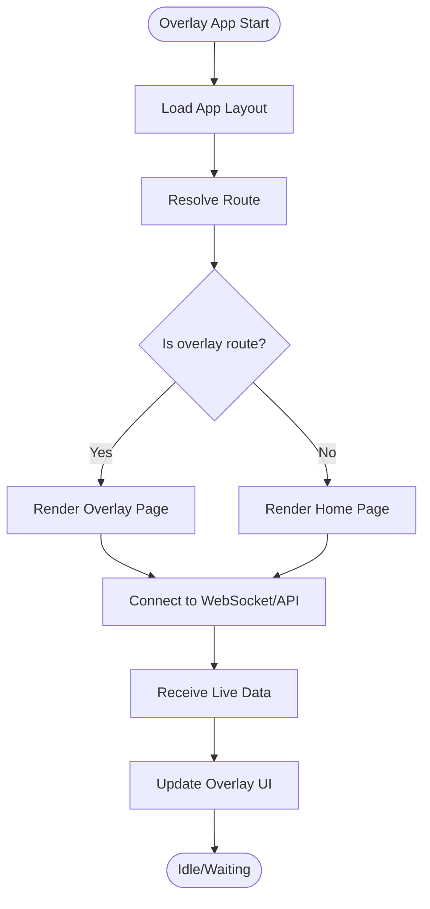
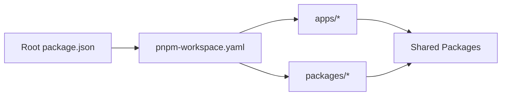

# Application Layers & Components

<cite>
**Referenced Files in This Document**
- [apps/desktop/src/main/index.ts](file://apps/desktop/src/main/index.ts)
- [apps/desktop/src/main/database.ts](file://apps/desktop/src/main/database.ts)
- [apps/desktop/src/main/websocket.ts](file://apps/desktop/src/main/websocket.ts)
- [apps/desktop/src/preload/index.ts](file://apps/desktop/src/preload/index.ts)
- [apps/desktop/next.config.js](file://apps/desktop/next.config.js)
- [apps/desktop/package.json](file://apps/desktop/package.json)
- [apps/overlay/src/app/layout.tsx](file://apps/overlay/src/app/layout.tsx)
- [apps/overlay/src/app/page.tsx](file://apps/overlay/src/app/page.tsx)
- [apps/overlay/src/app/overlay/page.tsx](file://apps/overlay/src/app/overlay/page.tsx)
- [apps/overlay/next.config.js](file://apps/overlay/next.config.js)
- [apps/overlay/package.json](file://apps/overlay/package.json)
- [apps/admin/package.json](file://apps/admin/package.json)
- [apps/backend/package.json](file://apps/backend/package.json)
- [package.json](file://package.json)
- [pnpm-workspace.yaml](file://pnpm-workspace.yaml)
</cite>

## Table of Contents
1. [Introduction](#introduction)
2. [Project Structure](#project-structure)
3. [Core Components](#core-components)
4. [Architecture Overview](#architecture-overview)
5. [Detailed Component Analysis](#detailed-component-analysis)
6. [Dependency Analysis](#dependency-analysis)
7. [Performance Considerations](#performance-considerations)
8. [Troubleshooting Guide](#troubleshooting-guide)
9. [Conclusion](#conclusion)

## Introduction
This document explains the AR Sports application layers and component organization across four primary applications:
- Desktop application (Electron with a Next.js renderer)
- Overlay renderer (Next.js, intended for broadcast overlays)
- Web interface (Next.js-based web app)
- Admin panel (Next.js-based admin UI)

It covers responsibilities, entry points, configuration, inter-application communication (IPC, WebSocket, shared APIs), lifecycle management, window handling in Electron, and server-side rendering setup for overlay and web apps.

## Project Structure
The repository is a monorepo managed by pnpm workspaces and Turbo. Each application lives under apps/:
- apps/desktop: Electron main process plus a Next.js renderer bundled into the desktop app
- apps/overlay: Standalone Next.js app for overlay rendering
- apps/web: Web interface (Next.js)
- apps/admin: Admin panel (Next.js)
- packages: Shared libraries (animations, graphics, hooks, icons, store, theme, types, ui, utils)

**Diagram sources**
- [apps/desktop/src/main/index.ts](file://apps/desktop/src/main/index.ts)
- [apps/desktop/src/preload/index.ts](file://apps/desktop/src/preload/index.ts)
- [apps/desktop/src/main/database.ts](file://apps/desktop/src/main/database.ts)
- [apps/desktop/src/main/websocket.ts](file://apps/desktop/src/main/websocket.ts)
- [apps/desktop/next.config.js](file://apps/desktop/next.config.js)
- [apps/overlay/src/app/layout.tsx](file://apps/overlay/src/app/layout.tsx)
- [apps/overlay/src/app/page.tsx](file://apps/overlay/src/app/page.tsx)
- [apps/overlay/src/app/overlay/page.tsx](file://apps/overlay/src/app/overlay/page.tsx)
- [apps/overlay/next.config.js](file://apps/overlay/next.config.js)

**Section sources**
- [package.json](file://package.json)
- [pnpm-workspace.yaml](file://pnpm-workspace.yaml)
- [apps/desktop/package.json](file://apps/desktop/package.json)
- [apps/overlay/package.json](file://apps/overlay/package.json)
- [apps/admin/package.json](file://apps/admin/package.json)
- [apps/backend/package.json](file://apps/backend/package.json)

## Core Components
- Desktop main process
  - Entry point for Electron, creates BrowserWindow(s), manages lifecycle, wires IPC channels, and connects to local services via WebSocket.
  - Provides database access through a dedicated module.
- Preload bridge
  - Exposes a safe API surface to the renderer using contextBridge-style patterns.
- Next.js renderer (desktop)
  - Served from the desktop app’s Next.js build; routes mirror src/renderer structure.
- Overlay app
  - Next.js app configured for overlay usage; includes layout and overlay route.
- Web app and Admin panel
  - Next.js apps consuming shared packages for UI and logic.

Key responsibilities:
- Desktop main: OS integration, window orchestration, persistent storage, real-time connectivity.
- Preload: Secure IPC boundary between main and renderer.
- Renderers (desktop, overlay, web, admin): UI presentation and user interactions.
- Shared packages: Reusable components, hooks, stores, and utilities.

**Section sources**
- [apps/desktop/src/main/index.ts](file://apps/desktop/src/main/index.ts)
- [apps/desktop/src/main/database.ts](file://apps/desktop/src/main/database.ts)
- [apps/desktop/src/main/websocket.ts](file://apps/desktop/src/main/websocket.ts)
- [apps/desktop/src/preload/index.ts](file://apps/desktop/src/preload/index.ts)
- [apps/desktop/next.config.js](file://apps/desktop/next.config.js)
- [apps/overlay/src/app/layout.tsx](file://apps/overlay/src/app/layout.tsx)
- [apps/overlay/src/app/page.tsx](file://apps/overlay/src/app/page.tsx)
- [apps/overlay/src/app/overlay/page.tsx](file://apps/overlay/src/app/overlay/page.tsx)
- [apps/overlay/next.config.js](file://apps/overlay/next.config.js)

## Architecture Overview
The system comprises multiple Next.js applications and an Electron host. The desktop app hosts one or more windows (e.g., main UI, overlay). Communication occurs via:
- IPC between Electron main and its renderer
- WebSocket for real-time data exchange with backend or other processes
- HTTP APIs for cross-app or external service calls

**Diagram sources**
- [apps/desktop/src/main/index.ts](file://apps/desktop/src/main/index.ts)
- [apps/desktop/src/preload/index.ts](file://apps/desktop/src/preload/index.ts)
- [apps/overlay/src/app/layout.tsx](file://apps/overlay/src/app/layout.tsx)
- [apps/overlay/src/app/page.tsx](file://apps/overlay/src/app/page.tsx)
- [apps/overlay/src/app/overlay/page.tsx](file://apps/overlay/src/app/overlay/page.tsx)

## Detailed Component Analysis

### Desktop Application (Electron + Next.js Renderer)
Responsibilities:
- Initialize Electron main process and create BrowserWindow instances
- Manage window lifecycle (open, close, focus, persist state)
- Provide IPC channels for renderer-to-main communication
- Connect to WebSocket server for live updates
- Persist settings and match data via local database module

Entry points and configuration:
- Main entry: [apps/desktop/src/main/index.ts](file://apps/desktop/src/main/index.ts)
- Database module: [apps/desktop/src/main/database.ts](file://apps/desktop/src/main/database.ts)
- WebSocket client: [apps/desktop/src/main/websocket.ts](file://apps/desktop/src/main/websocket.ts)
- Preload bridge: [apps/desktop/src/preload/index.ts](file://apps/desktop/src/preload/index.ts)
- Next.js config for desktop renderer: [apps/desktop/next.config.js](file://apps/desktop/next.config.js)
- Package manifest: [apps/desktop/package.json](file://apps/desktop/package.json)

**Diagram sources**
- [apps/desktop/src/main/index.ts](file://apps/desktop/src/main/index.ts)
- [apps/desktop/src/preload/index.ts](file://apps/desktop/src/preload/index.ts)
- [apps/desktop/src/main/database.ts](file://apps/desktop/src/main/database.ts)
- [apps/desktop/src/main/websocket.ts](file://apps/desktop/src/main/websocket.ts)

**Section sources**
- [apps/desktop/src/main/index.ts](file://apps/desktop/src/main/index.ts)
- [apps/desktop/src/main/database.ts](file://apps/desktop/src/main/database.ts)
- [apps/desktop/src/main/websocket.ts](file://apps/desktop/src/main/websocket.ts)
- [apps/desktop/src/preload/index.ts](file://apps/desktop/src/preload/index.ts)
- [apps/desktop/next.config.js](file://apps/desktop/next.config.js)
- [apps/desktop/package.json](file://apps/desktop/package.json)

### Overlay Renderer (Next.js)
Responsibilities:
- Provide a lightweight overlay view suitable for broadcasting
- Render dynamic content based on live events
- Optionally communicate with backend via WebSocket or HTTP

Entry points and configuration:
- App layout: [apps/overlay/src/app/layout.tsx](file://apps/overlay/src/app/layout.tsx)
- Root page: [apps/overlay/src/app/page.tsx](file://apps/overlay/src/app/page.tsx)
- Overlay route: [apps/overlay/src/app/overlay/page.tsx](file://apps/overlay/src/app/overlay/page.tsx)
- Next.js config: [apps/overlay/next.config.js](file://apps/overlay/next.config.js)
- Package manifest: [apps/overlay/package.json](file://apps/overlay/package.json)

**Diagram sources**
- [apps/overlay/src/app/layout.tsx](file://apps/overlay/src/app/layout.tsx)
- [apps/overlay/src/app/page.tsx](file://apps/overlay/src/app/page.tsx)
- [apps/overlay/src/app/overlay/page.tsx](file://apps/overlay/src/app/overlay/page.tsx)
- [apps/overlay/next.config.js](file://apps/overlay/next.config.js)

**Section sources**
- [apps/overlay/src/app/layout.tsx](file://apps/overlay/src/app/layout.tsx)
- [apps/overlay/src/app/page.tsx](file://apps/overlay/src/app/page.tsx)
- [apps/overlay/src/app/overlay/page.tsx](file://apps/overlay/src/app/overlay/page.tsx)
- [apps/overlay/next.config.js](file://apps/overlay/next.config.js)
- [apps/overlay/package.json](file://apps/overlay/package.json)

### Web Interface (Next.js)
Responsibilities:
- Serve the public-facing web experience
- Consume shared packages for consistent UI and behavior
- Communicate with backend via HTTP APIs

Configuration:
- Next.js configuration resides in the web app directory (referenced by package scripts)
- Uses shared packages from packages/*

**Section sources**
- [apps/web/package.json](file://apps/web/package.json)

### Admin Panel (Next.js)
Responsibilities:
- Provide administrative controls for managing matches, teams, and settings
- Use shared packages for UI consistency and reusable logic

Configuration:
- Next.js configuration resides in the admin app directory (referenced by package scripts)
- Uses shared packages from packages/*

**Section sources**
- [apps/admin/package.json](file://apps/admin/package.json)

### Backend Integration
Responsibilities:
- Provide REST/GraphQL APIs and WebSocket endpoints consumed by overlay, web, admin, and desktop apps

Configuration:
- Backend package manifest indicates dependencies and scripts

**Section sources**
- [apps/backend/package.json](file://apps/backend/package.json)

## Dependency Analysis
The monorepo uses pnpm workspaces and Turbo to manage builds and scripts across apps and packages.

**Diagram sources**
- [package.json](file://package.json)
- [pnpm-workspace.yaml](file://pnpm-workspace.yaml)

**Section sources**
- [package.json](file://package.json)
- [pnpm-workspace.yaml](file://pnpm-workspace.yaml)

## Performance Considerations
- Prefer server-side rendering where appropriate to reduce initial payload and improve perceived performance.
- Minimize IPC calls by batching requests and debouncing frequent updates.
- Use WebSocket subscriptions selectively to avoid unnecessary re-renders.
- Leverage shared packages to avoid duplicate code and enable tree-shaking.
- Configure Next.js appropriately for each app’s deployment target (desktop vs. browser).

[No sources needed since this section provides general guidance]

## Troubleshooting Guide
Common issues and checks:
- IPC failures
  - Ensure preload exposes correct methods and that main registers matching handlers.
  - Verify channel names and message shapes are consistent.
- WebSocket connection problems
  - Confirm server URL and port; handle reconnection and backoff strategies.
  - Validate authentication tokens if required.
- Window lifecycle issues
  - Check that windows are created after Electron is ready and destroyed properly on exit.
- Next.js build/runtime errors
  - Review next.config.js for environment-specific settings.
  - Ensure package scripts and dependencies align with the app’s role (desktop vs. standalone).

**Section sources**
- [apps/desktop/src/main/index.ts](file://apps/desktop/src/main/index.ts)
- [apps/desktop/src/preload/index.ts](file://apps/desktop/src/preload/index.ts)
- [apps/desktop/src/main/websocket.ts](file://apps/desktop/src/main/websocket.ts)
- [apps/desktop/next.config.js](file://apps/desktop/next.config.js)
- [apps/overlay/next.config.js](file://apps/overlay/next.config.js)

## Conclusion
AR Sports organizes its system into distinct application layers:
- Desktop app orchestrates windows, IPC, persistence, and real-time connectivity
- Overlay app renders broadcast-friendly visuals
- Web and admin apps provide browser-based experiences
All apps share common functionality via packages/* and communicate through IPC, WebSocket, and HTTP APIs. Clear separation of concerns and standardized configurations enable maintainability and scalability.

[No sources needed since this section summarizes without analyzing specific files]