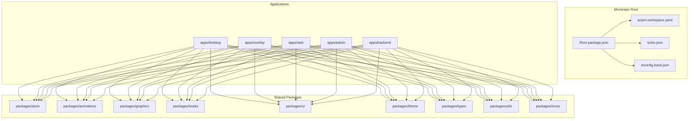
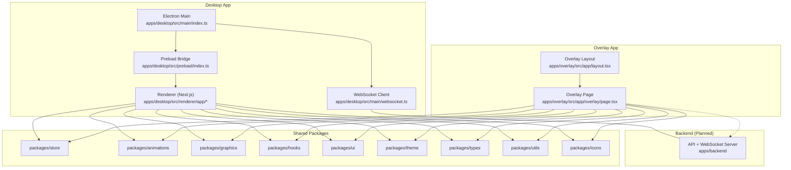
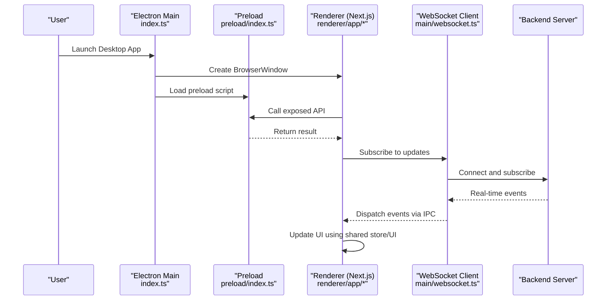
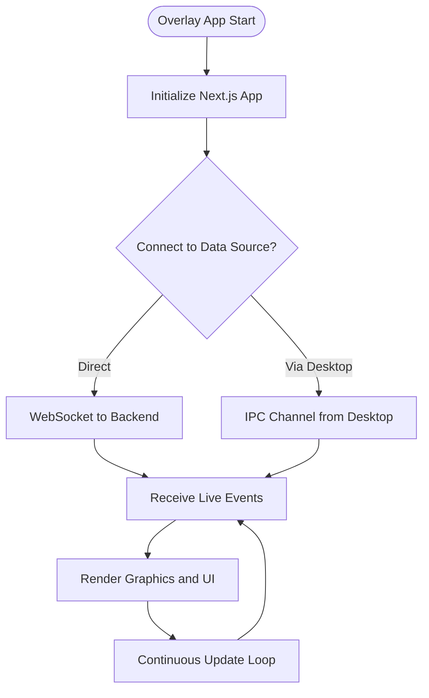
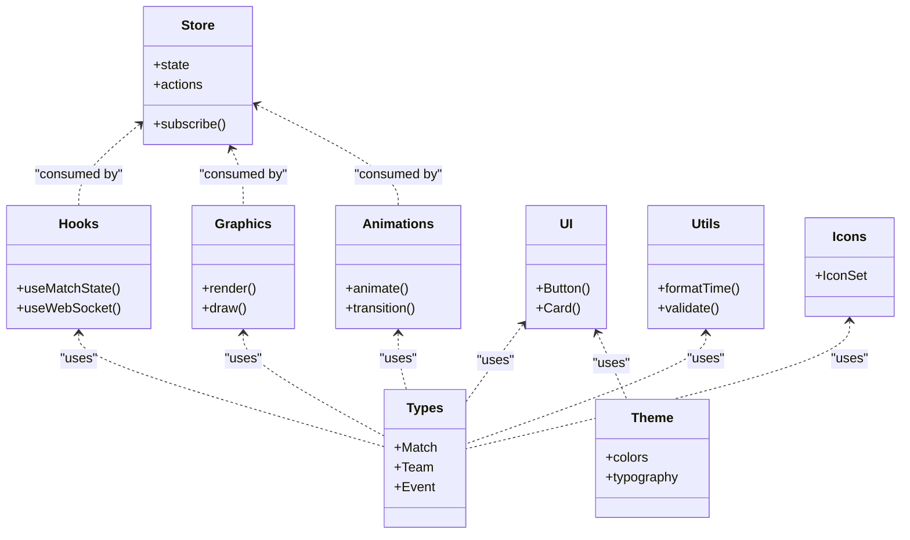
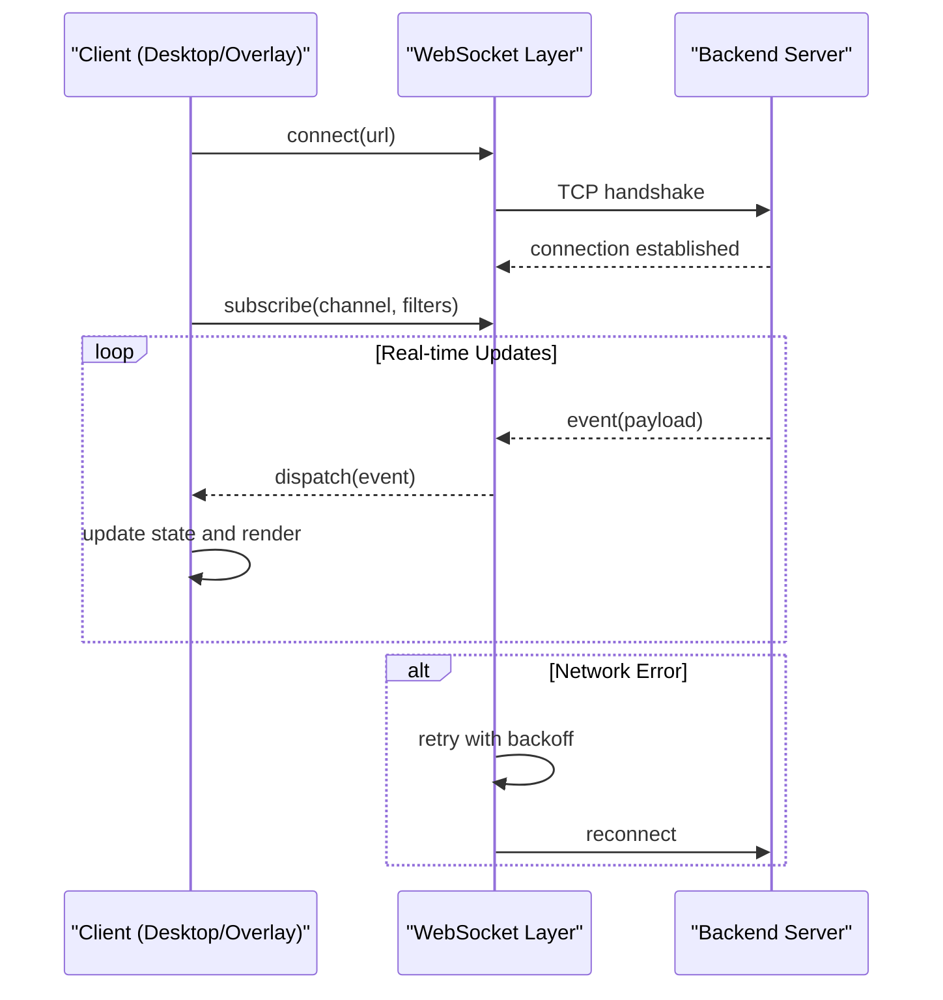
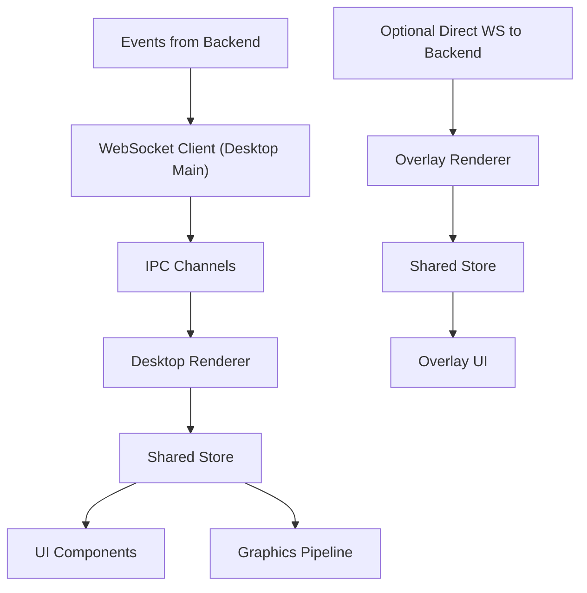
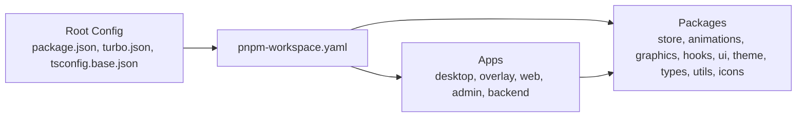

# Architecture Overview

<cite>
**Referenced Files in This Document**
- [package.json](file://package.json)
- [pnpm-workspace.yaml](file://pnpm-workspace.yaml)
- [turbo.json](file://turbo.json)
- [tsconfig.base.json](file://tsconfig.base.json)
- [apps/desktop/package.json](file://apps/desktop/package.json)
- [apps/desktop/next.config.js](file://apps/desktop/next.config.js)
- [apps/desktop/src/main/index.ts](file://apps/desktop/src/main/index.ts)
- [apps/desktop/src/main/websocket.ts](file://apps/desktop/src/main/websocket.ts)
- [apps/desktop/src/preload/index.ts](file://apps/desktop/src/preload/index.ts)
- [apps/desktop/src/renderer/app/layout.tsx](file://apps/desktop/src/renderer/app/layout.tsx)
- [apps/desktop/src/renderer/app/page.tsx](file://apps/desktop/src/renderer/app/page.tsx)
- [apps/overlay/package.json](file://apps/overlay/package.json)
- [apps/overlay/next.config.js](file://apps/overlay/next.config.js)
- [apps/overlay/src/app/layout.tsx](file://apps/overlay/src/app/layout.tsx)
- [apps/overlay/src/app/page.tsx](file://apps/overlay/src/app/page.tsx)
- [apps/overlay/src/app/overlay/page.tsx](file://apps/overlay/src/app/overlay/page.tsx)
- [packages/store/package.json](file://packages/store/package.json)
- [packages/animations/package.json](file://packages/animations/package.json)
- [packages/graphics/package.json](file://packages/graphics/package.json)
- [packages/hooks/package.json](file://packages/hooks/package.json)
- [packages/ui/package.json](file://packages/ui/package.json)
- [packages/theme/package.json](file://packages/theme/package.json)
- [packages/types/package.json](file://packages/types/package.json)
- [packages/utils/package.json](file://packages/utils/package.json)
- [packages/icons/package.json](file://packages/icons/package.json)
</cite>

## Table of Contents
1. [Introduction](#introduction)
2. [Project Structure](#project-structure)
3. [Core Components](#core-components)
4. [Architecture Overview](#architecture-overview)
5. [Detailed Component Analysis](#detailed-component-analysis)
6. [Dependency Analysis](#dependency-analysis)
7. [Performance Considerations](#performance-considerations)
8. [Troubleshooting Guide](#troubleshooting-guide)
9. [Conclusion](#conclusion)

## Introduction
This document describes the architecture of the AR Sports system, a monorepo-based platform that delivers:
- A desktop application built with Electron and Next.js for managing matches, teams, and settings.
- An overlay renderer for on-screen graphics during live events.
- A backend service (planned) to coordinate real-time data across clients.
- Shared packages for UI, state, animations, graphics, hooks, types, and utilities.

The design emphasizes separation of concerns between processes, clear boundaries between applications and shared libraries, and robust real-time synchronization via WebSocket communication.

## Project Structure
The repository is organized as a pnpm workspace with Turborepo orchestration. Applications live under apps/, and reusable code lives under packages/. The root configuration defines workspaces, TypeScript base settings, and build pipelines.

**Diagram sources**
- [package.json](file://package.json)
- [pnpm-workspace.yaml](file://pnpm-workspace.yaml)
- [turbo.json](file://turbo.json)
- [tsconfig.base.json](file://tsconfig.base.json)
- [apps/desktop/package.json](file://apps/desktop/package.json)
- [apps/overlay/package.json](file://apps/overlay/package.json)

**Section sources**
- [package.json](file://package.json)
- [pnpm-workspace.yaml](file://pnpm-workspace.yaml)
- [turbo.json](file://turbo.json)
- [tsconfig.base.json](file://tsconfig.base.json)

## Core Components
- Desktop Application (Electron + Next.js): Provides the primary user interface for match setup, team management, and settings. It runs an Electron main process that hosts a Next.js renderer and manages local resources and inter-process communication.
- Overlay Renderer (Next.js): A lightweight web app designed to render on-screen graphics over broadcast or capture software. It consumes real-time updates from the desktop app or backend.
- Backend Service (planned): Centralizes business logic, persistence, and real-time coordination. It can be integrated later to support multi-client scenarios.
- Shared Libraries: Encapsulate cross-cutting concerns such as state management, UI components, animations, graphics primitives, hooks, theme, types, and utilities.

Key responsibilities:
- Desktop main process: bootstrap Electron, manage windows, expose IPC channels, and host WebSocket client(s).
- Desktop renderer: Next.js pages for admin and control flows.
- Overlay renderer: Next.js page dedicated to overlay rendering.
- Shared packages: Reusable modules consumed by multiple apps.

**Section sources**
- [apps/desktop/package.json](file://apps/desktop/package.json)
- [apps/desktop/next.config.js](file://apps/desktop/next.config.js)
- [apps/desktop/src/main/index.ts](file://apps/desktop/src/main/index.ts)
- [apps/desktop/src/main/websocket.ts](file://apps/desktop/src/main/websocket.ts)
- [apps/desktop/src/preload/index.ts](file://apps/desktop/src/preload/index.ts)
- [apps/desktop/src/renderer/app/layout.tsx](file://apps/desktop/src/renderer/app/layout.tsx)
- [apps/desktop/src/renderer/app/page.tsx](file://apps/desktop/src/renderer/app/page.tsx)
- [apps/overlay/package.json](file://apps/overlay/package.json)
- [apps/overlay/next.config.js](file://apps/overlay/next.config.js)
- [apps/overlay/src/app/layout.tsx](file://apps/overlay/src/app/layout.tsx)
- [apps/overlay/src/app/page.tsx](file://apps/overlay/src/app/page.tsx)
- [apps/overlay/src/app/overlay/page.tsx](file://apps/overlay/src/app/overlay/page.tsx)

## Architecture Overview
The system follows a layered architecture:
- Presentation layer: Desktop renderer and Overlay renderer (both Next.js).
- Process boundary: Electron main process orchestrates window lifecycle and IPC.
- Real-time layer: WebSocket client in the desktop main process communicates with a backend server (or peer-to-peer with overlay).
- Domain layer: Shared packages provide state, UI, animations, graphics, hooks, and utilities.

**Diagram sources**
- [apps/desktop/src/main/index.ts](file://apps/desktop/src/main/index.ts)
- [apps/desktop/src/main/websocket.ts](file://apps/desktop/src/main/websocket.ts)
- [apps/desktop/src/preload/index.ts](file://apps/desktop/src/preload/index.ts)
- [apps/desktop/src/renderer/app/layout.tsx](file://apps/desktop/src/renderer/app/layout.tsx)
- [apps/desktop/src/renderer/app/page.tsx](file://apps/desktop/src/renderer/app/page.tsx)
- [apps/overlay/src/app/layout.tsx](file://apps/overlay/src/app/layout.tsx)
- [apps/overlay/src/app/overlay/page.tsx](file://apps/overlay/src/app/overlay/page.tsx)
- [apps/backend](file://apps/backend)

## Detailed Component Analysis

### Desktop Application (Electron + Next.js)
Responsibilities:
- Bootstrap Electron main process and create browser windows.
- Manage preload scripts to safely expose APIs to the renderer.
- Host a Next.js renderer for UI and business workflows.
- Maintain WebSocket connections for real-time updates.

Key interactions:
- Main process initializes the app and sets up IPC channels.
- Preload script bridges secure APIs to the renderer.
- Renderer uses shared packages for state, UI, and graphics.

**Diagram sources**
- [apps/desktop/src/main/index.ts](file://apps/desktop/src/main/index.ts)
- [apps/desktop/src/preload/index.ts](file://apps/desktop/src/preload/index.ts)
- [apps/desktop/src/renderer/app/layout.tsx](file://apps/desktop/src/renderer/app/layout.tsx)
- [apps/desktop/src/renderer/app/page.tsx](file://apps/desktop/src/renderer/app/page.tsx)
- [apps/desktop/src/main/websocket.ts](file://apps/desktop/src/main/websocket.ts)

**Section sources**
- [apps/desktop/src/main/index.ts](file://apps/desktop/src/main/index.ts)
- [apps/desktop/src/preload/index.ts](file://apps/desktop/src/preload/index.ts)
- [apps/desktop/src/renderer/app/layout.tsx](file://apps/desktop/src/renderer/app/layout.tsx)
- [apps/desktop/src/renderer/app/page.tsx](file://apps/desktop/src/renderer/app/page.tsx)
- [apps/desktop/src/main/websocket.ts](file://apps/desktop/src/main/websocket.ts)

### Overlay Renderer (Next.js)
Responsibilities:
- Render on-screen graphics for live broadcasts.
- Consume real-time updates from the desktop app or backend.
- Use shared packages for animations, graphics, and UI.

Communication patterns:
- Can connect directly to the backend WebSocket server.
- Alternatively, receive data forwarded from the desktop app via IPC if co-located.

**Diagram sources**
- [apps/overlay/src/app/layout.tsx](file://apps/overlay/src/app/layout.tsx)
- [apps/overlay/src/app/overlay/page.tsx](file://apps/overlay/src/app/overlay/page.tsx)

**Section sources**
- [apps/overlay/src/app/layout.tsx](file://apps/overlay/src/app/layout.tsx)
- [apps/overlay/src/app/page.tsx](file://apps/overlay/src/app/page.tsx)
- [apps/overlay/src/app/overlay/page.tsx](file://apps/overlay/src/app/overlay/page.tsx)

### Shared Packages
Purpose:
- Provide reusable functionality across all applications.
- Ensure consistent behavior, styling, and type safety.

Packages overview:
- State: Centralized store for application state.
- Animations: Animation primitives and transitions.
- Graphics: Rendering helpers and canvas/WebGL utilities.
- Hooks: Custom React hooks for common behaviors.
- UI: Reusable UI components.
- Theme: Design tokens and theming.
- Types: Shared TypeScript definitions.
- Utils: Utility functions.
- Icons: Icon assets and helpers.

**Diagram sources**
- [packages/store/package.json](file://packages/store/package.json)
- [packages/animations/package.json](file://packages/animations/package.json)
- [packages/graphics/package.json](file://packages/graphics/package.json)
- [packages/hooks/package.json](file://packages/hooks/package.json)
- [packages/ui/package.json](file://packages/ui/package.json)
- [packages/theme/package.json](file://packages/theme/package.json)
- [packages/types/package.json](file://packages/types/package.json)
- [packages/utils/package.json](file://packages/utils/package.json)
- [packages/icons/package.json](file://packages/icons/package.json)

**Section sources**
- [packages/store/package.json](file://packages/store/package.json)
- [packages/animations/package.json](file://packages/animations/package.json)
- [packages/graphics/package.json](file://packages/graphics/package.json)
- [packages/hooks/package.json](file://packages/hooks/package.json)
- [packages/ui/package.json](file://packages/ui/package.json)
- [packages/theme/package.json](file://packages/theme/package.json)
- [packages/types/package.json](file://packages/types/package.json)
- [packages/utils/package.json](file://packages/utils/package.json)
- [packages/icons/package.json](file://packages/icons/package.json)

### WebSocket Communication Patterns
Patterns:
- Connection lifecycle: connect, subscribe, unsubscribe, reconnect on failure.
- Event-driven updates: push-based model where the server emits events to clients.
- Backpressure handling: throttle or batch updates to avoid overwhelming the renderer.
- Error resilience: exponential backoff and graceful degradation when offline.

**Diagram sources**
- [apps/desktop/src/main/websocket.ts](file://apps/desktop/src/main/websocket.ts)

**Section sources**
- [apps/desktop/src/main/websocket.ts](file://apps/desktop/src/main/websocket.ts)

### Data Flow Architecture
Data flow highlights:
- Desktop main process coordinates WebSocket client and IPC channels.
- Renderer subscribes to IPC channels and updates shared store.
- Overlay renderer either connects directly to the backend or receives forwarded events from the desktop app.
- Shared store ensures consistent state across components and apps.

**Diagram sources**
- [apps/desktop/src/main/websocket.ts](file://apps/desktop/src/main/websocket.ts)
- [apps/desktop/src/renderer/app/layout.tsx](file://apps/desktop/src/renderer/app/layout.tsx)
- [apps/overlay/src/app/overlay/page.tsx](file://apps/overlay/src/app/overlay/page.tsx)

**Section sources**
- [apps/desktop/src/main/websocket.ts](file://apps/desktop/src/main/websocket.ts)
- [apps/desktop/src/renderer/app/layout.tsx](file://apps/desktop/src/renderer/app/layout.tsx)
- [apps/overlay/src/app/overlay/page.tsx](file://apps/overlay/src/app/overlay/page.tsx)

## Dependency Analysis
The monorepo uses pnpm workspaces and Turborepo to manage dependencies and builds. Each app declares its own dependencies while sharing packages through workspace references. TypeScript base configuration standardizes compiler options across the repo.

**Diagram sources**
- [package.json](file://package.json)
- [pnpm-workspace.yaml](file://pnpm-workspace.yaml)
- [turbo.json](file://turbo.json)
- [tsconfig.base.json](file://tsconfig.base.json)

**Section sources**
- [package.json](file://package.json)
- [pnpm-workspace.yaml](file://pnpm-workspace.yaml)
- [turbo.json](file://turbo.json)
- [tsconfig.base.json](file://tsconfig.base.json)

## Performance Considerations
- Minimize IPC overhead: batch updates and use efficient serialization.
- Throttle WebSocket messages: apply debouncing or rate limiting before rendering.
- Leverage GPU acceleration: offload heavy rendering to WebGL or Canvas where possible.
- Code splitting: lazy-load routes and components to reduce initial bundle size.
- Caching: cache static assets and frequently accessed data to reduce network calls.
- Memory management: release unused resources and avoid long-lived closures in event handlers.

[No sources needed since this section provides general guidance]

## Troubleshooting Guide
Common issues and strategies:
- WebSocket connectivity failures: implement reconnection with exponential backoff and log connection states.
- IPC channel errors: validate message schemas and handle missing channels gracefully.
- Overlay rendering lag: profile frame times, reduce draw calls, and simplify animations.
- State inconsistencies: ensure single source of truth in shared store and normalize updates.
- Build and dependency conflicts: verify workspace links and lockfile consistency; run incremental builds via Turborepo.

**Section sources**
- [apps/desktop/src/main/websocket.ts](file://apps/desktop/src/main/websocket.ts)
- [apps/desktop/src/preload/index.ts](file://apps/desktop/src/preload/index.ts)

## Conclusion
The AR Sports system leverages a well-structured monorepo with clear separation between applications and shared libraries. The Electron main process orchestrates real-time communication and IPC, while Next.js renderers deliver responsive UIs. Shared packages encapsulate domain-agnostic functionality, promoting reuse and consistency. The architecture supports scalability through modular services and real-time synchronization, enabling both single-machine and multi-client deployments.

[No sources needed since this section summarizes without analyzing specific files]