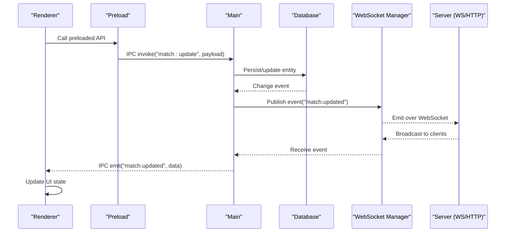
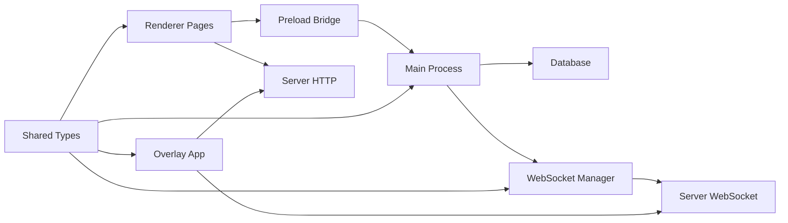

# Communication & Data Flow

<cite>
**Referenced Files in This Document**
- [apps/desktop/src/main/index.ts](file://apps/desktop/src/main/index.ts)
- [apps/desktop/src/main/database.ts](file://apps/desktop/src/main/database.ts)
- [apps/desktop/src/main/websocket.ts](file://apps/desktop/src/main/websocket.ts)
- [apps/desktop/src/preload/index.ts](file://apps/desktop/src/preload/index.ts)
- [apps/desktop/src/renderer/app/layout.tsx](file://apps/desktop/src/renderer/app/layout.tsx)
- [apps/desktop/src/renderer/app/page.tsx](file://apps/desktop/src/renderer/app/page.tsx)
- [apps/desktop/src/renderer/app/match/[id]/page.tsx](file://apps/desktop/src/renderer/app/match/[id]/page.tsx)
- [apps/desktop/src/renderer/app/match/live/page.tsx](file://apps/desktop/src/renderer/app/match/live/page.tsx)
- [apps/desktop/src/renderer/app/teams/page.tsx](file://apps/desktop/src/renderer/app/teams/page.tsx)
- [apps/desktop/src/renderer/app/settings/page.tsx](file://apps/desktop/src/renderer/app/settings/page.tsx)
- [apps/overlay/src/app/overlay/page.tsx](file://apps/overlay/src/app/overlay/page.tsx)
- [apps/backend/package.json](file://apps/backend/package.json)
- [packages/types/src/index.ts](file://packages/types/src/index.ts)
</cite>

## Table of Contents
1. [Introduction](#introduction)
2. [Project Structure](#project-structure)
3. [Core Components](#core-components)
4. [Architecture Overview](#architecture-overview)
5. [Detailed Component Analysis](#detailed-component-analysis)
6. [Dependency Analysis](#dependency-analysis)
7. [Performance Considerations](#performance-considerations)
8. [Troubleshooting Guide](#troubleshooting-guide)
9. [Conclusion](#conclusion)

## Introduction
This document explains the communication patterns and data flow architecture for AR Sports, focusing on:
- Electron IPC between main and renderer processes
- WebSocket real-time communication for live updates
- HTTP API calls for persistent operations
- Event-driven architecture patterns, message formats, and error handling strategies
- State management from database changes to UI updates with real-time synchronization
- Connection management, reconnection strategies, and performance optimization

The goal is to provide a clear mental model of how data moves across layers and how components coordinate to deliver live match experiences.

## Project Structure
AR Sports is organized as a monorepo with multiple apps and shared packages. The desktop app uses Electron with a main process, preload bridge, and Next.js-based renderer. A separate overlay app provides broadcast overlays, while a backend app exposes APIs and real-time channels. Shared types are centralized in a packages/types module.

```mermaid
graph TB
subgraph "Desktop App (Electron)"
Main["Main Process<br/>index.ts"]
DB["Database Layer<br/>database.ts"]
WS["WebSocket Manager<br/>websocket.ts"]
Preload["Preload Bridge<br/>preload/index.ts"]
Renderer["Renderer (Next.js)<br/>renderer/app/*"]
end
subgraph "Overlay App"
Overlay["Overlay Page<br/>overlay/page.tsx"]
end
subgraph "Backend"
API["HTTP API Server"]
WSS["WebSocket Server"]
end
Renderer --> Preload
Preload --> Main
Main --> DB
Main --> WS
WS < --> WSS
Renderer --> API
Overlay --> API
Overlay --> WSS
```

**Diagram sources**
- [apps/desktop/src/main/index.ts](file://apps/desktop/src/main/index.ts)
- [apps/desktop/src/main/database.ts](file://apps/desktop/src/main/database.ts)
- [apps/desktop/src/main/websocket.ts](file://apps/desktop/src/main/websocket.ts)
- [apps/desktop/src/preload/index.ts](file://apps/desktop/src/preload/index.ts)
- [apps/desktop/src/renderer/app/layout.tsx](file://apps/desktop/src/renderer/app/layout.tsx)
- [apps/desktop/src/renderer/app/page.tsx](file://apps/desktop/src/renderer/app/page.tsx)
- [apps/desktop/src/renderer/app/match/[id]/page.tsx](file://apps/desktop/src/renderer/app/match/[id]/page.tsx)
- [apps/desktop/src/renderer/app/match/live/page.tsx](file://apps/desktop/src/renderer/app/match/live/page.tsx)
- [apps/desktop/src/renderer/app/teams/page.tsx](file://apps/desktop/src/renderer/app/teams/page.tsx)
- [apps/desktop/src/renderer/app/settings/page.tsx](file://apps/desktop/src/renderer/app/settings/page.tsx)
- [apps/overlay/src/app/overlay/page.tsx](file://apps/overlay/src/app/overlay/page.tsx)
- [apps/backend/package.json](file://apps/backend/package.json)

**Section sources**
- [apps/desktop/src/main/index.ts](file://apps/desktop/src/main/index.ts)
- [apps/desktop/src/main/database.ts](file://apps/desktop/src/main/database.ts)
- [apps/desktop/src/main/websocket.ts](file://apps/desktop/src/main/websocket.ts)
- [apps/desktop/src/preload/index.ts](file://apps/desktop/src/preload/index.ts)
- [apps/desktop/src/renderer/app/layout.tsx](file://apps/desktop/src/renderer/app/layout.tsx)
- [apps/desktop/src/renderer/app/page.tsx](file://apps/desktop/src/renderer/app/page.tsx)
- [apps/desktop/src/renderer/app/match/[id]/page.tsx](file://apps/desktop/src/renderer/app/match/[id]/page.tsx)
- [apps/desktop/src/renderer/app/match/live/page.tsx](file://apps/desktop/src/renderer/app/match/live/page.tsx)
- [apps/desktop/src/renderer/app/teams/page.tsx](file://apps/desktop/src/renderer/app/teams/page.tsx)
- [apps/desktop/src/renderer/app/settings/page.tsx](file://apps/desktop/src/renderer/app/settings/page.tsx)
- [apps/overlay/src/app/overlay/page.tsx](file://apps/overlay/src/app/overlay/page.tsx)
- [apps/backend/package.json](file://apps/backend/package.json)

## Core Components
- Main process orchestrates IPC handlers, database access, and WebSocket lifecycle. It centralizes persistence and real-time subscriptions.
- Preload exposes a safe API surface to renderers via contextBridge, forwarding IPC calls to the main process.
- Renderer pages subscribe to events and call preloaded APIs to perform actions and consume live updates.
- WebSocket manager maintains connections, handles reconnection, and bridges server events to IPC channels.
- Database layer persists entities such as matches, teams, and settings; it emits change events that propagate through IPC and WebSocket.
- Overlay app consumes HTTP and WebSocket endpoints to display broadcast graphics.

Key responsibilities:
- IPC routing and security boundary (main + preload)
- Real-time event distribution (websocket + IPC)
- Persistence and state synchronization (database + IPC)
- UI integration and user interactions (renderer)

**Section sources**
- [apps/desktop/src/main/index.ts](file://apps/desktop/src/main/index.ts)
- [apps/desktop/src/main/websocket.ts](file://apps/desktop/src/main/websocket.ts)
- [apps/desktop/src/main/database.ts](file://apps/desktop/src/main/database.ts)
- [apps/desktop/src/preload/index.ts](file://apps/desktop/src/preload/index.ts)
- [apps/desktop/src/renderer/app/layout.tsx](file://apps/desktop/src/renderer/app/layout.tsx)
- [apps/desktop/src/renderer/app/page.tsx](file://apps/desktop/src/renderer/app/page.tsx)
- [apps/desktop/src/renderer/app/match/[id]/page.tsx](file://apps/desktop/src/renderer/app/match/[id]/page.tsx)
- [apps/desktop/src/renderer/app/match/live/page.tsx](file://apps/desktop/src/renderer/app/match/live/page.tsx)
- [apps/desktop/src/renderer/app/teams/page.tsx](file://apps/desktop/src/renderer/app/teams/page.tsx)
- [apps/desktop/src/renderer/app/settings/page.tsx](file://apps/desktop/src/renderer/app/settings/page.tsx)
- [apps/overlay/src/app/overlay/page.tsx](file://apps/overlay/src/app/overlay/page.tsx)

## Architecture Overview
The system follows an event-driven architecture with three primary transport layers:
- Electron IPC: Secure channel between main and renderer for commands and queries.
- WebSocket: Bidirectional real-time channel for live updates and broadcasts.
- HTTP: Request/response for persistent operations and initial data loads.



**Diagram sources**
- [apps/desktop/src/preload/index.ts](file://apps/desktop/src/preload/index.ts)
- [apps/desktop/src/main/index.ts](file://apps/desktop/src/main/index.ts)
- [apps/desktop/src/main/database.ts](file://apps/desktop/src/main/database.ts)
- [apps/desktop/src/main/websocket.ts](file://apps/desktop/src/main/websocket.ts)

## Detailed Component Analysis

### Electron IPC Layer (Main + Preload)
Responsibilities:
- Preload exposes typed methods to the renderer using contextBridge.
- Main registers IPC handlers for CRUD and control operations.
- IPC messages carry structured payloads and optional correlation IDs for request-response flows.

Patterns:
- Command pattern for mutations (e.g., createMatch, updateTeam).
- Query pattern for reads (e.g., getMatchById, listTeams).
- Event emission for side effects (e.g., matchUpdated, teamChanged).

Error handling:
- Preload wraps IPC calls and normalizes errors into consistent response shapes.
- Main validates inputs and returns descriptive error codes.

Security:
- Only explicitly whitelisted IPC channels are exposed.
- No direct Node.js or filesystem access from renderer.

**Section sources**
- [apps/desktop/src/preload/index.ts](file://apps/desktop/src/preload/index.ts)
- [apps/desktop/src/main/index.ts](file://apps/desktop/src/main/index.ts)

### WebSocket Manager (Real-time)
Responsibilities:
- Maintain a single connection to the server’s WebSocket endpoint.
- Reconnect with exponential backoff on disconnects.
- Subscribe/unsubscribe to channels (e.g., match.live, broadcast).
- Forward server events to IPC channels for renderer consumption.

Message format:
- Envelope includes type, channel, timestamp, and payload.
- Payloads conform to shared types defined in packages/types.

Connection management:
- Auto-reconnect with jitter.
- Heartbeat/ping-pong to detect liveness.
- Graceful degradation when offline (queue mutations, replay on reconnect).

**Section sources**
- [apps/desktop/src/main/websocket.ts](file://apps/desktop/src/main/websocket.ts)
- [packages/types/src/index.ts](file://packages/types/src/index.ts)

### Database Layer (Persistence)
Responsibilities:
- Provide atomic transactions for related writes.
- Emit change events keyed by entity and operation.
- Serve snapshot queries for fast initialization.

State propagation:
- On write completion, database emits change events.
- Main process publishes these events via IPC and optionally via WebSocket if needed.

Consistency:
- Optimistic UI updates followed by reconciliation with persisted state.
- Conflict resolution based on timestamps or version fields.

**Section sources**
- [apps/desktop/src/main/database.ts](file://apps/desktop/src/main/database.ts)

### Renderer Integration (UI)
Responsibilities:
- Initialize subscriptions to IPC events for live updates.
- Invoke preloaded APIs for user actions.
- Manage local UI state and derive views from normalized store.

Typical pages:
- Match detail page subscribes to match-specific events.
- Live page listens to high-frequency updates and throttles rendering.
- Teams page manages team CRUD via IPC and reflects changes instantly.
- Settings page persists configuration and notifies other modules.

**Section sources**
- [apps/desktop/src/renderer/app/layout.tsx](file://apps/desktop/src/renderer/app/layout.tsx)
- [apps/desktop/src/renderer/app/page.tsx](file://apps/desktop/src/renderer/app/page.tsx)
- [apps/desktop/src/renderer/app/match/[id]/page.tsx](file://apps/desktop/src/renderer/app/match/[id]/page.tsx)
- [apps/desktop/src/renderer/app/match/live/page.tsx](file://apps/desktop/src/renderer/app/match/live/page.tsx)
- [apps/desktop/src/renderer/app/teams/page.tsx](file://apps/desktop/src/renderer/app/teams/page.tsx)
- [apps/desktop/src/renderer/app/settings/page.tsx](file://apps/desktop/src/renderer/app/settings/page.tsx)

### Overlay App (Broadcast)
Responsibilities:
- Connect to HTTP endpoints for initial state.
- Subscribe to WebSocket channels for live overlays.
- Render broadcast graphics based on incoming events.

Integration points:
- Uses the same message envelope schema as the desktop app for consistency.
- Can operate independently of the desktop app.

**Section sources**
- [apps/overlay/src/app/overlay/page.tsx](file://apps/overlay/src/app/overlay/page.tsx)

### Backend Services
Responsibilities:
- Expose REST endpoints for persistent operations.
- Host WebSocket server for broadcasting events.
- Coordinate cross-client synchronization and persistence.

Configuration:
- Package manifest indicates runtime dependencies and scripts.

**Section sources**
- [apps/backend/package.json](file://apps/backend/package.json)

## Dependency Analysis
High-level dependency relationships:
- Renderer depends on Preload for IPC.
- Preload depends on Main for IPC handlers.
- Main depends on Database and WebSocket Manager.
- WebSocket Manager depends on Server WebSocket endpoint.
- Overlay depends on Server HTTP and WebSocket endpoints.
- Shared types are consumed by both desktop and overlay.



**Diagram sources**
- [apps/desktop/src/renderer/app/layout.tsx](file://apps/desktop/src/renderer/app/layout.tsx)
- [apps/desktop/src/preload/index.ts](file://apps/desktop/src/preload/index.ts)
- [apps/desktop/src/main/index.ts](file://apps/desktop/src/main/index.ts)
- [apps/desktop/src/main/database.ts](file://apps/desktop/src/main/database.ts)
- [apps/desktop/src/main/websocket.ts](file://apps/desktop/src/main/websocket.ts)
- [apps/overlay/src/app/overlay/page.tsx](file://apps/overlay/src/app/overlay/page.tsx)
- [packages/types/src/index.ts](file://packages/types/src/index.ts)

**Section sources**
- [apps/desktop/src/renderer/app/layout.tsx](file://apps/desktop/src/renderer/app/layout.tsx)
- [apps/desktop/src/preload/index.ts](file://apps/desktop/src/preload/index.ts)
- [apps/desktop/src/main/index.ts](file://apps/desktop/src/main/index.ts)
- [apps/desktop/src/main/database.ts](file://apps/desktop/src/main/database.ts)
- [apps/desktop/src/main/websocket.ts](file://apps/desktop/src/main/websocket.ts)
- [apps/overlay/src/app/overlay/page.tsx](file://apps/overlay/src/app/overlay/page.tsx)
- [packages/types/src/index.ts](file://packages/types/src/index.ts)

## Performance Considerations
- Throttle and debounce high-frequency events (e.g., live score ticks) before updating UI.
- Use virtualization for large lists (teams, matches).
- Batch IPC messages where possible to reduce overhead.
- Implement optimistic updates with rollback on failure.
- Cache frequently accessed data locally and invalidate on relevant events.
- Prefer server-side filtering and pagination for heavy datasets.
- Monitor WebSocket message size and compress payloads if necessary.

[No sources needed since this section provides general guidance]

## Troubleshooting Guide
Common issues and strategies:
- IPC failures: Validate channel names and payload schemas; log error codes returned by main handlers.
- WebSocket disconnects: Check heartbeat status, inspect reconnection logs, and verify server availability.
- Stale UI state: Ensure events are idempotent and reconcile with persisted snapshots after reconnect.
- Race conditions: Use correlation IDs for request-response pairs and version fields for conflict resolution.
- Memory leaks: Clean up IPC listeners and WebSocket subscriptions on component unmount.

Operational checks:
- Confirm preload exposes only required channels.
- Verify database transaction boundaries and event emissions.
- Inspect server logs for WebSocket errors and HTTP status codes.

**Section sources**
- [apps/desktop/src/preload/index.ts](file://apps/desktop/src/preload/index.ts)
- [apps/desktop/src/main/index.ts](file://apps/desktop/src/main/index.ts)
- [apps/desktop/src/main/websocket.ts](file://apps/desktop/src/main/websocket.ts)
- [apps/desktop/src/main/database.ts](file://apps/desktop/src/main/database.ts)

## Conclusion
AR Sports employs a layered communication architecture combining Electron IPC, WebSocket, and HTTP to deliver responsive and reliable real-time experiences. The event-driven design ensures decoupled components, while robust connection management and error handling maintain stability under varying network conditions. By following the patterns outlined here—structured message envelopes, careful state reconciliation, and performance-conscious rendering—the system scales effectively for live sports scenarios.