# Shared Packages Architecture

<cite>
**Referenced Files in This Document**
- [package.json](file://package.json)
- [pnpm-workspace.yaml](file://pnpm-workspace.yaml)
- [turbo.json](file://turbo.json)
- [tsconfig.base.json](file://tsconfig.base.json)
- [apps/desktop/package.json](file://apps/desktop/package.json)
- [apps/overlay/package.json](file://apps/overlay/package.json)
- [packages/ui/package.json](file://packages/ui/package.json)
- [packages/store/package.json](file://packages/store/package.json)
- [packages/graphics/package.json](file://packages/graphics/package.json)
- [packages/animations/package.json](file://packages/animations/package.json)
- [packages/theme/package.json](file://packages/theme/package.json)
- [packages/hooks/package.json](file://packages/hooks/package.json)
- [packages/icons/package.json](file://packages/icons/package.json)
- [packages/utils/package.json](file://packages/utils/package.json)
- [packages/types/package.json](file://packages/types/package.json)
</cite>

## Table of Contents
1. [Introduction](#introduction)
2. [Project Structure](#project-structure)
3. [Core Components](#core-components)
4. [Architecture Overview](#architecture-overview)
5. [Detailed Component Analysis](#detailed-component-analysis)
6. [Dependency Analysis](#dependency-analysis)
7. [Performance Considerations](#performance-considerations)
8. [Troubleshooting Guide](#troubleshooting-guide)
9. [Conclusion](#conclusion)
10. [Appendices](#appendices)

## Introduction
This document explains the shared packages architecture for AR Sports, focusing on how the monorepo organizes and manages reusable libraries across applications. It covers package organization strategy, dependency management, public APIs, usage patterns, versioning, publishing, and consumption strategies. The goal is to provide a clear mental model for both developers and maintainers working with the shared codebase.

## Project Structure
The repository follows a standard monorepo layout:
- apps: Application targets (e.g., desktop, overlay, web). These consume shared packages but do not export reusable libraries.
- packages: Reusable libraries (UI components, state store, graphics engine, animations, theme, hooks, icons, utilities, types).
- Root configuration: Workspace definition, build orchestration, and base TypeScript settings.

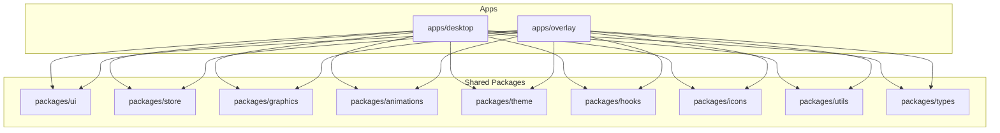

**Diagram sources**
- [pnpm-workspace.yaml](file://pnpm-workspace.yaml)
- [turbo.json](file://turbo.json)

**Section sources**
- [pnpm-workspace.yaml](file://pnpm-workspace.yaml)
- [turbo.json](file://turbo.json)

## Core Components
This section outlines each core shared package, its responsibilities, typical public API surface, and common usage patterns.

- UI components library (packages/ui)
  - Purpose: Cross-app React component primitives and layouts.
  - Typical exports: Buttons, inputs, panels, overlays, data grids, and layout helpers.
  - Usage pattern: Import from the package entry; compose higher-level app screens from these primitives.

- State management store (packages/store)
  - Purpose: Centralized application state, slices/selectors, and persistence integration.
  - Typical exports: Store setup, slice modules, typed selectors, actions, and devtools config.
  - Usage pattern: Provide store at app root; read via typed selectors; dispatch actions from components or services.

- Graphics rendering engine (packages/graphics)
  - Purpose: Canvas/WebGL abstraction layer for drawing game elements, overlays, and visualizations.
  - Typical exports: Renderer initialization, scene graph, draw calls, asset loaders, and performance metrics.
  - Usage pattern: Initialize renderer once per overlay; feed frames from animation system; render into target canvas.

- Animation system (packages/animations)
  - Purpose: Timeline-based and keyframe-driven animations, easing, and composition.
  - Typical exports: Animation controllers, tween functions, timeline builder, and event callbacks.
  - Usage pattern: Create timelines keyed by entity IDs; update per frame; integrate with graphics engine for rendering.

- Theme provider (packages/theme)
  - Purpose: Design tokens, color palettes, typography, spacing, and runtime theme switching.
  - Typical exports: Theme context/provider, token accessors, style utilities, and theming hooks.
  - Usage pattern: Wrap app with theme provider; consume tokens via hooks or styled components.

- Hooks library (packages/hooks)
  - Purpose: Reusable React hooks for cross-cutting concerns (media queries, storage, network, timers).
  - Typical exports: Typed hooks with consistent signatures and error handling.
  - Usage pattern: Import hooks where needed; avoid direct coupling to UI or store internals.

- Icons collection (packages/icons)
  - Purpose: SVG icon set with React components and tree-shakable exports.
  - Typical exports: Icon components, metadata, and optional sprite generation utilities.
  - Usage pattern: Import specific icons; rely on bundler tree-shaking to minimize bundle size.

- Utility functions (packages/utils)
  - Purpose: Pure helpers for formatting, validation, math, and platform abstractions.
  - Typical exports: Small, focused functions with explicit input/output contracts.
  - Usage pattern: Import only what you need; keep side effects out of this package.

- Types (packages/types)
  - Purpose: Shared TypeScript interfaces, enums, and type guards used across packages.
  - Typical exports: Domain models, API payloads, and configuration schemas.
  - Usage pattern: Import types without runtime overhead; use as constraints in other packages.

**Section sources**
- [packages/ui/package.json](file://packages/ui/package.json)
- [packages/store/package.json](file://packages/store/package.json)
- [packages/graphics/package.json](file://packages/graphics/package.json)
- [packages/animations/package.json](file://packages/animations/package.json)
- [packages/theme/package.json](file://packages/theme/package.json)
- [packages/hooks/package.json](file://packages/hooks/package.json)
- [packages/icons/package.json](file://packages/icons/package.json)
- [packages/utils/package.json](file://packages/utils/package.json)
- [packages/types/package.json](file://packages/types/package.json)

## Architecture Overview
The shared packages form a layered dependency graph designed to prevent circular dependencies and enforce clear boundaries. Applications depend on packages; packages may depend on lower-level packages and never on apps.

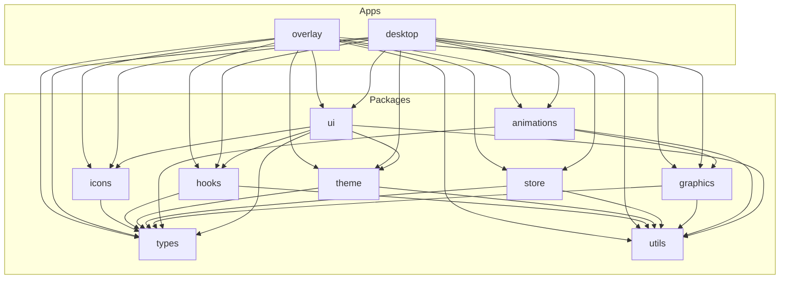

**Diagram sources**
- [packages/ui/package.json](file://packages/ui/package.json)
- [packages/store/package.json](file://packages/store/package.json)
- [packages/graphics/package.json](file://packages/graphics/package.json)
- [packages/animations/package.json](file://packages/animations/package.json)
- [packages/theme/package.json](file://packages/theme/package.json)
- [packages/hooks/package.json](file://packages/hooks/package.json)
- [packages/icons/package.json](file://packages/icons/package.json)
- [packages/utils/package.json](file://packages/utils/package.json)
- [packages/types/package.json](file://packages/types/package.json)
- [apps/desktop/package.json](file://apps/desktop/package.json)
- [apps/overlay/package.json](file://apps/overlay/package.json)

## Detailed Component Analysis

### UI Components Library (packages/ui)
- Responsibilities:
  - Provide accessible, themed, and responsive React components.
  - Compose higher-level UI blocks using primitives.
- Public API surface:
  - Component exports grouped by domain (layout, feedback, navigation, data display).
  - Theming integration via theme provider.
  - Optional variant props for styling customization.
- Usage patterns:
  - Import components directly; avoid importing internal implementation details.
  - Use theme tokens through provided hooks or context when customizing styles.
- Dependency notes:
  - Depends on theme, icons, hooks, utils, and types.
  - Does not depend on store or graphics to remain UI-agnostic.

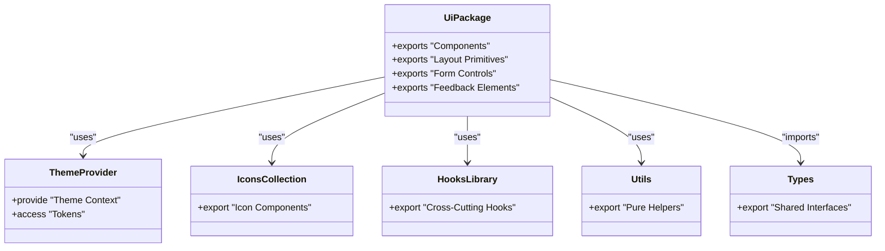

**Diagram sources**
- [packages/ui/package.json](file://packages/ui/package.json)
- [packages/theme/package.json](file://packages/theme/package.json)
- [packages/icons/package.json](file://packages/icons/package.json)
- [packages/hooks/package.json](file://packages/hooks/package.json)
- [packages/utils/package.json](file://packages/utils/package.json)
- [packages/types/package.json](file://packages/types/package.json)

**Section sources**
- [packages/ui/package.json](file://packages/ui/package.json)

### State Management Store (packages/store)
- Responsibilities:
  - Manage global state, derived data, and side effects.
  - Provide typed selectors and actions for predictable updates.
- Public API surface:
  - Store initialization and middleware configuration.
  - Slice modules with actions and reducers.
  - Typed selectors and helper utilities.
- Usage patterns:
  - Configure store once at app bootstrap.
  - Read state via selectors; dispatch actions from components or services.
- Dependency notes:
  - Depends on types and utils; avoids UI-specific imports.

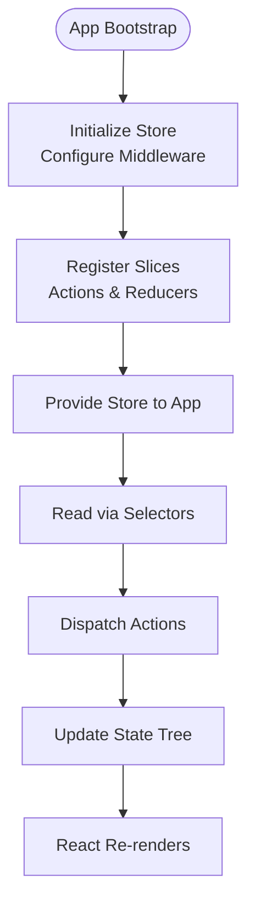

**Diagram sources**
- [packages/store/package.json](file://packages/store/package.json)
- [packages/types/package.json](file://packages/types/package.json)
- [packages/utils/package.json](file://packages/utils/package.json)

**Section sources**
- [packages/store/package.json](file://packages/store/package.json)

### Graphics Rendering Engine (packages/graphics)
- Responsibilities:
  - Abstract rendering backend (Canvas/WebGL), scene management, and asset loading.
  - Expose high-level drawing APIs for overlays and live visuals.
- Public API surface:
  - Renderer lifecycle (init, resize, dispose).
  - Scene graph operations (add/remove/update entities).
  - Batched draw calls and performance metrics.
- Usage patterns:
  - Initialize renderer per overlay window.
  - Feed frames from animation system; render into target canvas.
- Dependency notes:
  - Depends on types and utils; remains independent of UI framework specifics.

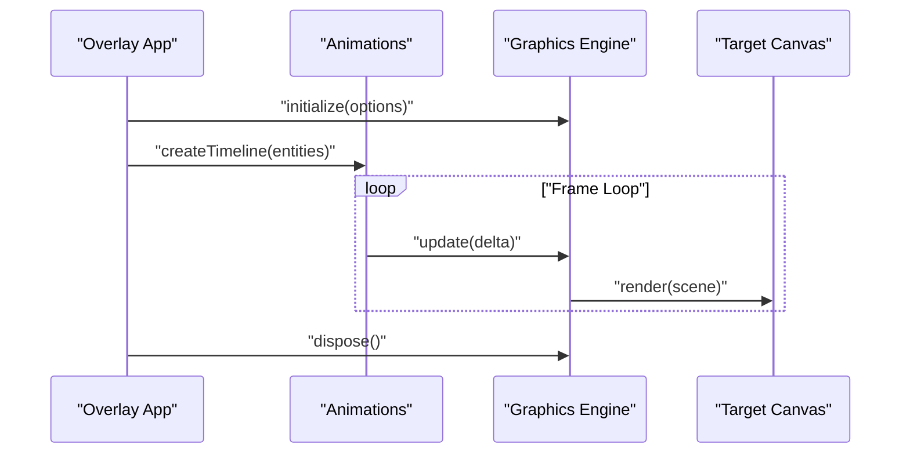

**Diagram sources**
- [packages/graphics/package.json](file://packages/graphics/package.json)
- [packages/animations/package.json](file://packages/animations/package.json)
- [packages/types/package.json](file://packages/types/package.json)
- [packages/utils/package.json](file://packages/utils/package.json)

**Section sources**
- [packages/graphics/package.json](file://packages/graphics/package.json)

### Animation System (packages/animations)
- Responsibilities:
  - Build and manage timelines, tweens, and keyframes.
  - Provide composable animation primitives and events.
- Public API surface:
  - Timeline builder and controller.
  - Tween functions and easing presets.
  - Event hooks for start/end/progress.
- Usage patterns:
  - Create timelines keyed by entity IDs.
  - Update per frame; integrate with graphics engine for rendering.
- Dependency notes:
  - Depends on graphics, types, and utils; does not depend on UI or store.

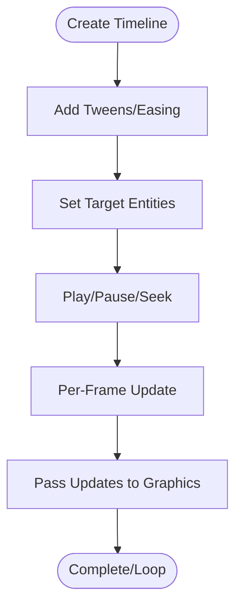

**Diagram sources**
- [packages/animations/package.json](file://packages/animations/package.json)
- [packages/graphics/package.json](file://packages/graphics/package.json)
- [packages/types/package.json](file://packages/types/package.json)
- [packages/utils/package.json](file://packages/utils/package.json)

**Section sources**
- [packages/animations/package.json](file://packages/animations/package.json)

### Theme Provider (packages/theme)
- Responsibilities:
  - Define design tokens, color palettes, typography, and spacing.
  - Provide runtime theme switching and context.
- Public API surface:
  - Theme provider wrapper.
  - Token accessors and utility functions.
  - Themed hook for consuming tokens.
- Usage patterns:
  - Wrap app with provider; consume tokens via hooks or styled components.
- Dependency notes:
  - Depends on types and utils; no UI framework coupling beyond context.

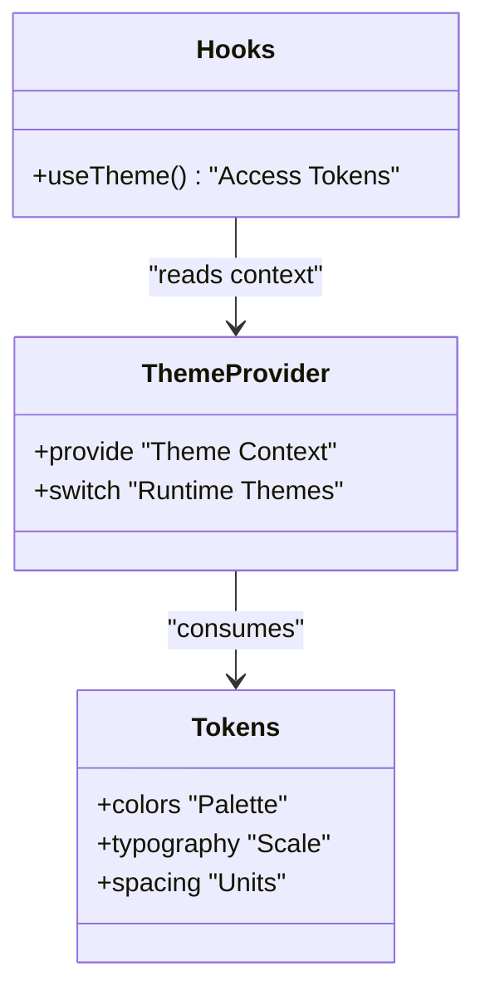

**Diagram sources**
- [packages/theme/package.json](file://packages/theme/package.json)
- [packages/types/package.json](file://packages/types/package.json)
- [packages/utils/package.json](file://packages/utils/package.json)

**Section sources**
- [packages/theme/package.json](file://packages/theme/package.json)

### Hooks Library (packages/hooks)
- Responsibilities:
  - Provide reusable React hooks for media queries, storage, timers, and more.
- Public API surface:
  - Typed hooks with consistent signatures and error handling.
- Usage patterns:
  - Import hooks where needed; avoid direct coupling to UI or store internals.
- Dependency notes:
  - Depends on types and utils; remains framework-agnostic where possible.

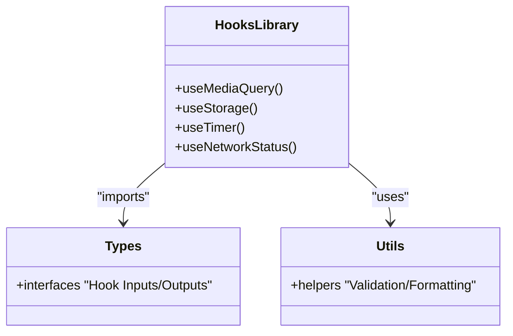

**Diagram sources**
- [packages/hooks/package.json](file://packages/hooks/package.json)
- [packages/types/package.json](file://packages/types/package.json)
- [packages/utils/package.json](file://packages/utils/package.json)

**Section sources**
- [packages/hooks/package.json](file://packages/hooks/package.json)

### Icons Collection (packages/icons)
- Responsibilities:
  - Maintain SVG icon set with React components and tree-shakable exports.
- Public API surface:
  - Icon components and metadata.
- Usage patterns:
  - Import specific icons; rely on bundler tree-shaking.
- Dependency notes:
  - Depends on types; minimal runtime footprint.

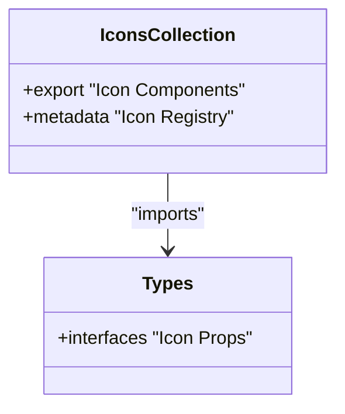

**Diagram sources**
- [packages/icons/package.json](file://packages/icons/package.json)
- [packages/types/package.json](file://packages/types/package.json)

**Section sources**
- [packages/icons/package.json](file://packages/icons/package.json)

### Utility Functions (packages/utils)
- Responsibilities:
  - Provide pure helpers for formatting, validation, math, and platform abstractions.
- Public API surface:
  - Small, focused functions with explicit input/output contracts.
- Usage patterns:
  - Import only what you need; keep side effects out.
- Dependency notes:
  - Depends on types; no external runtime dependencies.

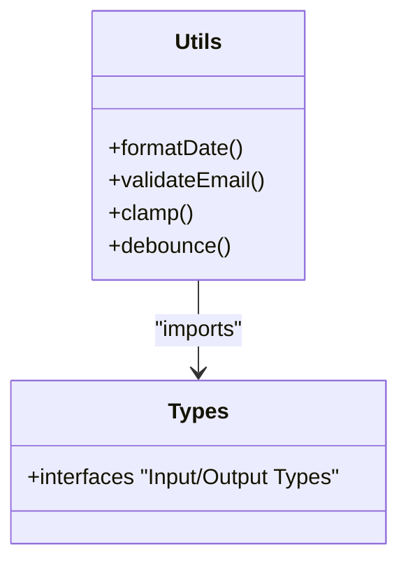

**Diagram sources**
- [packages/utils/package.json](file://packages/utils/package.json)
- [packages/types/package.json](file://packages/types/package.json)

**Section sources**
- [packages/utils/package.json](file://packages/utils/package.json)

### Types (packages/types)
- Responsibilities:
  - Centralize shared TypeScript interfaces, enums, and type guards.
- Public API surface:
  - Domain models, API payloads, and configuration schemas.
- Usage patterns:
  - Import types without runtime overhead; use as constraints in other packages.
- Dependency notes:
  - No runtime dependencies; consumed by all other packages.

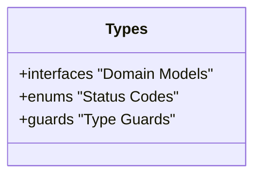

**Diagram sources**
- [packages/types/package.json](file://packages/types/package.json)

**Section sources**
- [packages/types/package.json](file://packages/types/package.json)

## Dependency Analysis
This section maps package relationships and highlights circular dependency prevention strategies.

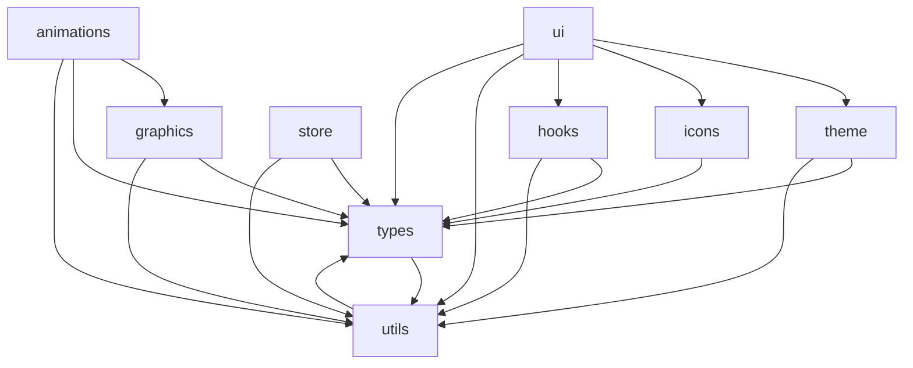

Circular dependency prevention strategies:
- Layered architecture: Lower-level packages (types, utils) have no upward dependencies.
- Explicit contracts: Types define interfaces that decouple implementations.
- Linting rules: Enforce import order and disallow cycles (configured at workspace level).
- Peer dependencies: Avoid bundling duplicate versions across packages.

**Diagram sources**
- [packages/ui/package.json](file://packages/ui/package.json)
- [packages/store/package.json](file://packages/store/package.json)
- [packages/graphics/package.json](file://packages/graphics/package.json)
- [packages/animations/package.json](file://packages/animations/package.json)
- [packages/theme/package.json](file://packages/theme/package.json)
- [packages/hooks/package.json](file://packages/hooks/package.json)
- [packages/icons/package.json](file://packages/icons/package.json)
- [packages/utils/package.json](file://packages/utils/package.json)
- [packages/types/package.json](file://packages/types/package.json)

**Section sources**
- [tsconfig.base.json](file://tsconfig.base.json)
- [turbo.json](file://turbo.json)

## Performance Considerations
- Tree-shaking: Prefer named exports and avoid barrel files that re-export everything.
- Code splitting: Load heavy packages (graphics, animations) lazily in overlays.
- Memoization: Cache expensive computations in utils and selectors.
- Asset optimization: Inline small icons; lazy-load large assets in graphics.
- Bundle analysis: Monitor package sizes and eliminate unused dependencies.

[No sources needed since this section provides general guidance]

## Troubleshooting Guide
Common issues and resolutions:
- Circular dependency detected:
  - Check package.json dependencies and refactor to break cycles using types or interfaces.
- Duplicate package versions:
  - Align peerDependencies and use workspace protocol to ensure single instances.
- Missing types at runtime:
  - Ensure types are declared as exports and imported correctly in consumers.
- Build failures across packages:
  - Validate turbo pipeline and tsconfig paths; run incremental builds to isolate issues.

**Section sources**
- [turbo.json](file://turbo.json)
- [tsconfig.base.json](file://tsconfig.base.json)

## Conclusion
The AR Sports shared packages architecture emphasizes clear boundaries, strong typing, and layered dependencies. By organizing packages around responsibilities and enforcing strict import policies, the monorepo achieves consistency, reusability, and maintainability across applications. Versioning, publishing, and consumption patterns further ensure stable upgrades and efficient builds.

[No sources needed since this section summarizes without analyzing specific files]

## Appendices

### Package Organization Strategy
- Feature-based grouping within packages (components, hooks, utils).
- Clear separation between UI, logic, and infrastructure layers.
- Centralized types to reduce duplication and improve consistency.

**Section sources**
- [pnpm-workspace.yaml](file://pnpm-workspace.yaml)
- [turbo.json](file://turbo.json)

### Dependency Management Across Monorepo
- Workspace protocol for linking local packages.
- Shared tooling via base tsconfig and linting rules.
- Incremental builds and caching with task runner.

**Section sources**
- [pnpm-workspace.yaml](file://pnpm-workspace.yaml)
- [turbo.json](file://turbo.json)
- [tsconfig.base.json](file://tsconfig.base.json)

### Versioning, Publishing, and Consumption
- Versioning:
  - Semantic versioning per package; coordinate changes via changelogs and PR reviews.
- Publishing:
  - Publish artifacts to internal registry; pin versions in apps.
- Consumption:
  - Import from package names; prefer stable APIs and avoid internal paths.
  - Use peerDependencies to align shared runtime versions.

**Section sources**
- [package.json](file://package.json)
- [apps/desktop/package.json](file://apps/desktop/package.json)
- [apps/overlay/package.json](file://apps/overlay/package.json)