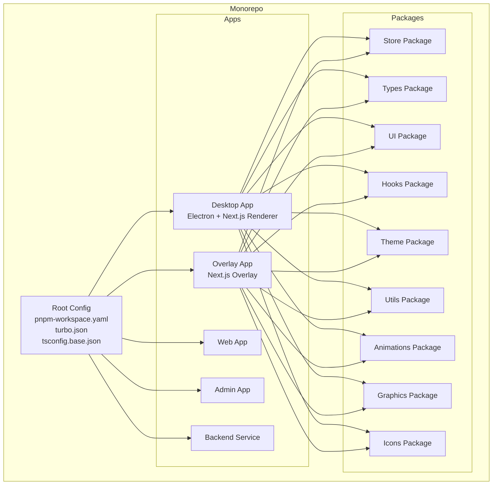
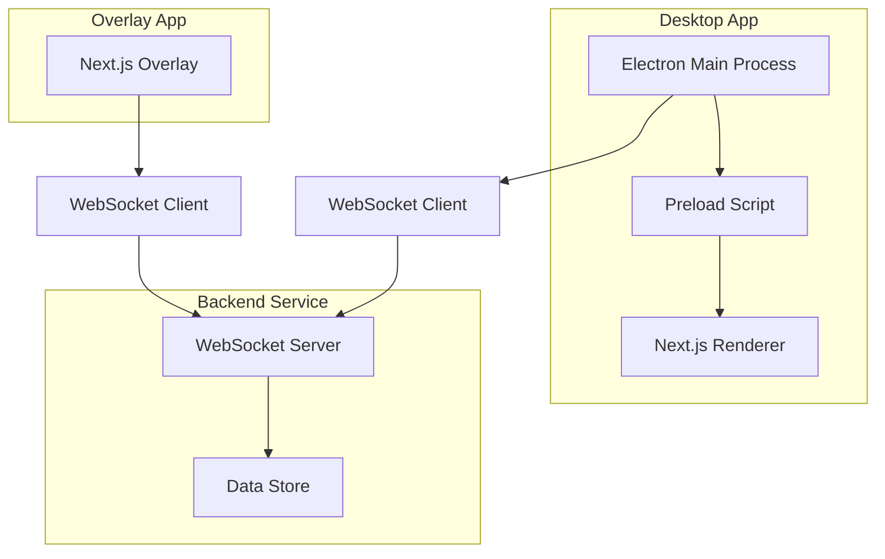
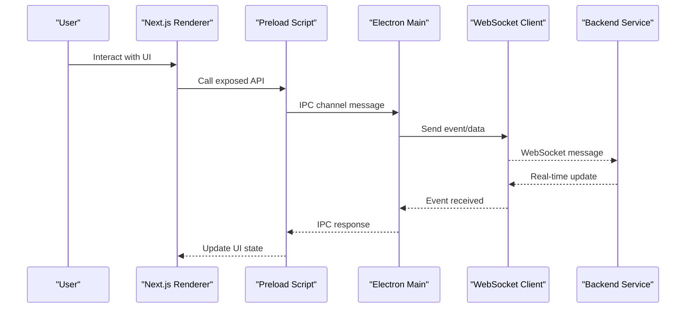
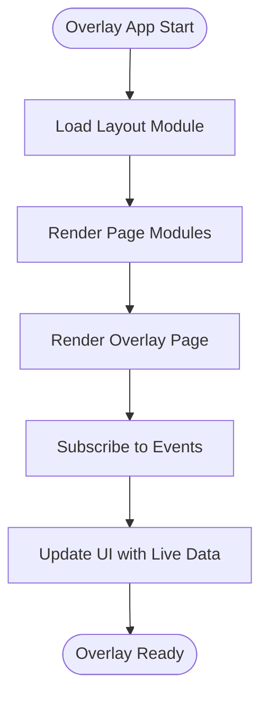
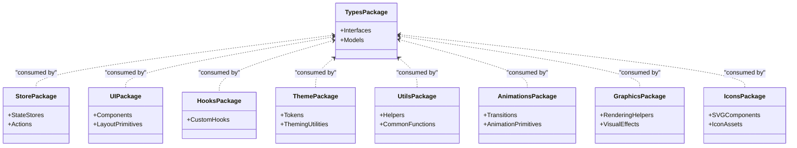
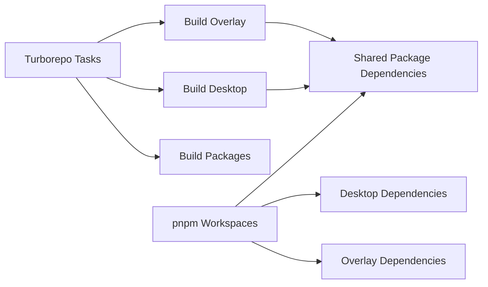

# System Design & Architecture

<cite>
**Referenced Files in This Document**
- [package.json](file://package.json)
- [pnpm-workspace.yaml](file://pnpm-workspace.yaml)
- [turbo.json](file://turbo.json)
- [tsconfig.base.json](file://tsconfig.base.json)
- [apps/desktop/package.json](file://apps/desktop/package.json)
- [apps/desktop/next.config.js](file://apps/desktop/next.config.js)
- [apps/desktop/src/main/index.ts](file://apps/desktop/src/main/index.ts)
- [apps/desktop/src/main/websocket.ts](file://apps/desktop/src/main/websocket.ts)
- [apps/desktop/src/preload/index.ts](file://apps/desktop/src/preload/index.ts)
- [apps/desktop/src/renderer/app/layout.tsx](file://apps/desktop/src/renderer/app/layout.tsx)
- [apps/desktop/src/renderer/app/page.tsx](file://apps/desktop/src/renderer/app/page.tsx)
- [apps/overlay/package.json](file://apps/overlay/package.json)
- [apps/overlay/next.config.js](file://apps/overlay/next.config.js)
- [apps/overlay/src/app/layout.tsx](file://apps/overlay/src/app/layout.tsx)
- [apps/overlay/src/app/page.tsx](file://apps/overlay/src/app/page.tsx)
- [apps/overlay/src/app/overlay/page.tsx](file://apps/overlay/src/app/overlay/page.tsx)
- [packages/store/package.json](file://packages/store/package.json)
- [packages/types/package.json](file://packages/types/package.json)
- [packages/ui/package.json](file://packages/ui/package.json)
- [packages/hooks/package.json](file://packages/hooks/package.json)
- [packages/theme/package.json](file://packages/theme/package.json)
- [packages/utils/package.json](file://packages/utils/package.json)
- [packages/animations/package.json](file://packages/animations/package.json)
- [packages/graphics/package.json](file://packages/graphics/package.json)
- [packages/icons/package.json](file://packages/icons/package.json)
</cite>

## Table of Contents
1. [Introduction](#introduction)
2. [Project Structure](#project-structure)
3. [Core Components](#core-components)
4. [Architecture Overview](#architecture-overview)
5. [Detailed Component Analysis](#detailed-component-analysis)
6. [Dependency Analysis](#dependency-analysis)
7. [Performance Considerations](#performance-considerations)
8. [Troubleshooting Guide](#troubleshooting-guide)
9. [Conclusion](#conclusion)
10. [Appendices](#appendices)

## Introduction
This document describes the system design and architecture for AR Sports, a monorepo-based platform that delivers:
- A desktop application (Electron + Next.js renderer) for match management and control
- An overlay application (Next.js) for on-screen graphics and real-time visualization
- A backend service for data persistence and event distribution
- Shared packages for UI, state, types, animations, graphics, hooks, theme, icons, and utilities

The system uses pnpm workspaces for dependency management and Turborepo for build orchestration. It follows component-based architecture, event-driven communication, and layered design principles to separate concerns across applications and shared packages.

## Project Structure
AR Sports is organized as a monorepo with clear separation between apps and shared packages:
- apps/: Contains standalone applications (desktop, overlay, web, admin, backend)
- packages/: Contains reusable libraries consumed by one or more apps
- Root configuration files define workspace boundaries, TypeScript base config, and Turborepo tasks

**Diagram sources**
- [pnpm-workspace.yaml](file://pnpm-workspace.yaml)
- [turbo.json](file://turbo.json)
- [tsconfig.base.json](file://tsconfig.base.json)
- [apps/desktop/package.json](file://apps/desktop/package.json)
- [apps/overlay/package.json](file://apps/overlay/package.json)
- [packages/store/package.json](file://packages/store/package.json)
- [packages/types/package.json](file://packages/types/package.json)
- [packages/ui/package.json](file://packages/ui/package.json)
- [packages/hooks/package.json](file://packages/hooks/package.json)
- [packages/theme/package.json](file://packages/theme/package.json)
- [packages/utils/package.json](file://packages/utils/package.json)
- [packages/animations/package.json](file://packages/animations/package.json)
- [packages/graphics/package.json](file://packages/graphics/package.json)
- [packages/icons/package.json](file://packages/icons/package.json)

**Section sources**
- [pnpm-workspace.yaml](file://pnpm-workspace.yaml)
- [turbo.json](file://turbo.json)
- [tsconfig.base.json](file://tsconfig.base.json)
- [apps/desktop/package.json](file://apps/desktop/package.json)
- [apps/overlay/package.json](file://apps/overlay/package.json)

## Core Components
- Desktop Application (Electron + Next.js):
  - Main process orchestrates Electron lifecycle and manages IPC channels
  - Preload script exposes secure APIs to the renderer
  - Renderer is a Next.js app providing UI for match setup, live controls, settings, and teams
  - WebSocket client connects to backend services for real-time updates
- Overlay Application (Next.js):
  - Standalone Next.js app rendered as an overlay window
  - Consumes shared packages for UI, animations, and graphics
  - Subscribes to events from the desktop main process via IPC or WebSocket
- Backend Service:
  - Provides persistent storage and event distribution
  - Exposes WebSocket endpoints for real-time synchronization
- Shared Packages:
  - Types: Centralized type definitions used across apps and packages
  - Store: State management logic and stores
  - UI: Reusable components and layout primitives
  - Hooks: Custom React hooks for cross-app behavior
  - Theme: Design tokens and theming utilities
  - Utils: Common utilities and helpers
  - Animations: Animation primitives and transitions
  - Graphics: Rendering helpers and visual effects
  - Icons: Icon assets and SVG components

**Section sources**
- [apps/desktop/src/main/index.ts](file://apps/desktop/src/main/index.ts)
- [apps/desktop/src/main/websocket.ts](file://apps/desktop/src/main/websocket.ts)
- [apps/desktop/src/preload/index.ts](file://apps/desktop/src/preload/index.ts)
- [apps/desktop/src/renderer/app/layout.tsx](file://apps/desktop/src/renderer/app/layout.tsx)
- [apps/desktop/src/renderer/app/page.tsx](file://apps/desktop/src/renderer/app/page.tsx)
- [apps/overlay/src/app/layout.tsx](file://apps/overlay/src/app/layout.tsx)
- [apps/overlay/src/app/page.tsx](file://apps/overlay/src/app/page.tsx)
- [apps/overlay/src/app/overlay/page.tsx](file://apps/overlay/src/app/overlay/page.tsx)
- [packages/store/package.json](file://packages/store/package.json)
- [packages/types/package.json](file://packages/types/package.json)
- [packages/ui/package.json](file://packages/ui/package.json)
- [packages/hooks/package.json](file://packages/hooks/package.json)
- [packages/theme/package.json](file://packages/theme/package.json)
- [packages/utils/package.json](file://packages/utils/package.json)
- [packages/animations/package.json](file://packages/animations/package.json)
- [packages/graphics/package.json](file://packages/graphics/package.json)
- [packages/icons/package.json](file://packages/icons/package.json)

## Architecture Overview
The system follows a layered design:
- Presentation Layer: Desktop renderer and overlay UIs built with Next.js and shared UI components
- Application Layer: Desktop main process coordinates workflows, IPC, and WebSocket connections
- Integration Layer: WebSocket client/server for real-time event distribution
- Data Layer: Backend service persists state and serves data

**Diagram sources**
- [apps/desktop/src/main/index.ts](file://apps/desktop/src/main/index.ts)
- [apps/desktop/src/main/websocket.ts](file://apps/desktop/src/main/websocket.ts)
- [apps/desktop/src/preload/index.ts](file://apps/desktop/src/preload/index.ts)
- [apps/desktop/src/renderer/app/layout.tsx](file://apps/desktop/src/renderer/app/layout.tsx)
- [apps/overlay/src/app/overlay/page.tsx](file://apps/overlay/src/app/overlay/page.tsx)

## Detailed Component Analysis

### Desktop Application Architecture
The desktop app combines Electron’s main process with a Next.js renderer:
- Main process initializes Electron, sets up IPC channels, and manages WebSocket connectivity
- Preload script bridges secure APIs to the renderer without exposing Node internals
- Renderer provides user-facing pages for match setup, live controls, settings, and teams

**Diagram sources**
- [apps/desktop/src/main/index.ts](file://apps/desktop/src/main/index.ts)
- [apps/desktop/src/main/websocket.ts](file://apps/desktop/src/main/websocket.ts)
- [apps/desktop/src/preload/index.ts](file://apps/desktop/src/preload/index.ts)
- [apps/desktop/src/renderer/app/layout.tsx](file://apps/desktop/src/renderer/app/layout.tsx)

**Section sources**
- [apps/desktop/src/main/index.ts](file://apps/desktop/src/main/index.ts)
- [apps/desktop/src/main/websocket.ts](file://apps/desktop/src/main/websocket.ts)
- [apps/desktop/src/preload/index.ts](file://apps/desktop/src/preload/index.ts)
- [apps/desktop/src/renderer/app/layout.tsx](file://apps/desktop/src/renderer/app/layout.tsx)
- [apps/desktop/src/renderer/app/page.tsx](file://apps/desktop/src/renderer/app/page.tsx)

### Overlay Application Architecture
The overlay app is a Next.js application designed to render on top of other content:
- Layout and page modules provide structure and entry points
- The overlay-specific page renders real-time graphics and scores
- Uses shared packages for consistent UI and animations

**Diagram sources**
- [apps/overlay/src/app/layout.tsx](file://apps/overlay/src/app/layout.tsx)
- [apps/overlay/src/app/page.tsx](file://apps/overlay/src/app/page.tsx)
- [apps/overlay/src/app/overlay/page.tsx](file://apps/overlay/src/app/overlay/page.tsx)

**Section sources**
- [apps/overlay/src/app/layout.tsx](file://apps/overlay/src/app/layout.tsx)
- [apps/overlay/src/app/page.tsx](file://apps/overlay/src/app/page.tsx)
- [apps/overlay/src/app/overlay/page.tsx](file://apps/overlay/src/app/overlay/page.tsx)

### Shared Packages Composition
Shared packages encapsulate cross-cutting concerns:
- Types package defines interfaces and models used by all apps
- Store package centralizes state logic and synchronization
- UI and theme packages standardize appearance and components
- Hooks and utils provide reusable logic
- Animations and graphics support rich overlays
- Icons supply consistent iconography

**Diagram sources**
- [packages/types/package.json](file://packages/types/package.json)
- [packages/store/package.json](file://packages/store/package.json)
- [packages/ui/package.json](file://packages/ui/package.json)
- [packages/hooks/package.json](file://packages/hooks/package.json)
- [packages/theme/package.json](file://packages/theme/package.json)
- [packages/utils/package.json](file://packages/utils/package.json)
- [packages/animations/package.json](file://packages/animations/package.json)
- [packages/graphics/package.json](file://packages/graphics/package.json)
- [packages/icons/package.json](file://packages/icons/package.json)

**Section sources**
- [packages/types/package.json](file://packages/types/package.json)
- [packages/store/package.json](file://packages/store/package.json)
- [packages/ui/package.json](file://packages/ui/package.json)
- [packages/hooks/package.json](file://packages/hooks/package.json)
- [packages/theme/package.json](file://packages/theme/package.json)
- [packages/utils/package.json](file://packages/utils/package.json)
- [packages/animations/package.json](file://packages/animations/package.json)
- [packages/graphics/package.json](file://packages/graphics/package.json)
- [packages/icons/package.json](file://packages/icons/package.json)

## Dependency Analysis
The monorepo leverages pnpm workspaces to manage dependencies across apps and packages, while Turborepo orchestrates builds and caches outputs.

**Diagram sources**
- [turbo.json](file://turbo.json)
- [pnpm-workspace.yaml](file://pnpm-workspace.yaml)
- [apps/desktop/package.json](file://apps/desktop/package.json)
- [apps/overlay/package.json](file://apps/overlay/package.json)

**Section sources**
- [turbo.json](file://turbo.json)
- [pnpm-workspace.yaml](file://pnpm-workspace.yaml)
- [apps/desktop/package.json](file://apps/desktop/package.json)
- [apps/overlay/package.json](file://apps/overlay/package.json)

## Performance Considerations
- Build performance: Use Turborepo caching to avoid redundant builds across apps and packages
- Bundle size: Leverage shared packages to deduplicate dependencies and reduce bundle sizes
- Real-time updates: Optimize WebSocket message payloads and batching to minimize network overhead
- Rendering efficiency: Use efficient animation primitives and graphics helpers for smooth overlays
- Memory usage: Avoid retaining large objects in stores; implement cleanup on unmount

## Troubleshooting Guide
- IPC issues: Verify preload scripts expose correct APIs and main process handles messages properly
- WebSocket connectivity: Check connection establishment, reconnection logic, and error handling
- Overlay rendering: Ensure overlay app loads layout and page modules correctly
- Shared package imports: Confirm package exports and TypeScript paths are configured consistently

**Section sources**
- [apps/desktop/src/main/index.ts](file://apps/desktop/src/main/index.ts)
- [apps/desktop/src/main/websocket.ts](file://apps/desktop/src/main/websocket.ts)
- [apps/desktop/src/preload/index.ts](file://apps/desktop/src/preload/index.ts)
- [apps/overlay/src/app/layout.tsx](file://apps/overlay/src/app/layout.tsx)
- [apps/overlay/src/app/page.tsx](file://apps/overlay/src/app/page.tsx)

## Conclusion
AR Sports employs a well-structured monorepo with clear separation of concerns across applications and shared packages. The desktop app coordinates with the overlay and backend through robust IPC and WebSocket communication. Shared packages promote consistency and reuse, while Turborepo and pnpm workspaces streamline development and deployment. This architecture supports scalability, maintainability, and high-performance real-time experiences.

## Appendices

### Technology Stack Decisions
- pnpm workspaces for fast, disk-efficient dependency management
- Turborepo for parallelized builds and caching
- Electron for desktop capabilities and IPC
- Next.js for both desktop renderer and overlay UI
- WebSocket for real-time event-driven communication
- Shared packages for types, state, UI, hooks, theme, utilities, animations, graphics, and icons

**Section sources**
- [package.json](file://package.json)
- [pnpm-workspace.yaml](file://pnpm-workspace.yaml)
- [turbo.json](file://turbo.json)
- [tsconfig.base.json](file://tsconfig.base.json)
- [apps/desktop/package.json](file://apps/desktop/package.json)
- [apps/desktop/next.config.js](file://apps/desktop/next.config.js)
- [apps/overlay/package.json](file://apps/overlay/package.json)
- [apps/overlay/next.config.js](file://apps/overlay/next.config.js)