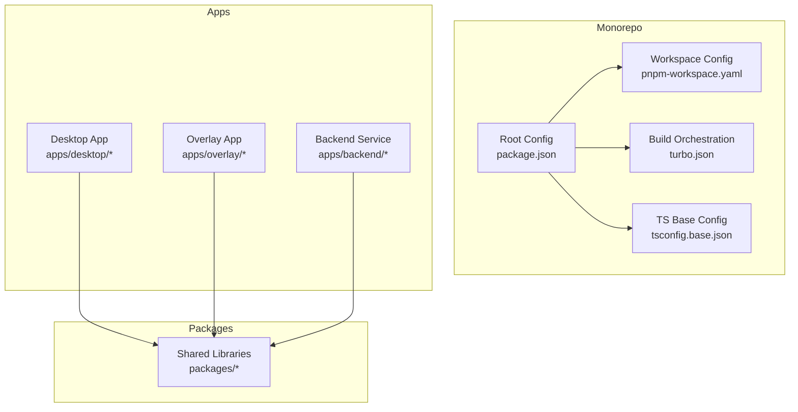
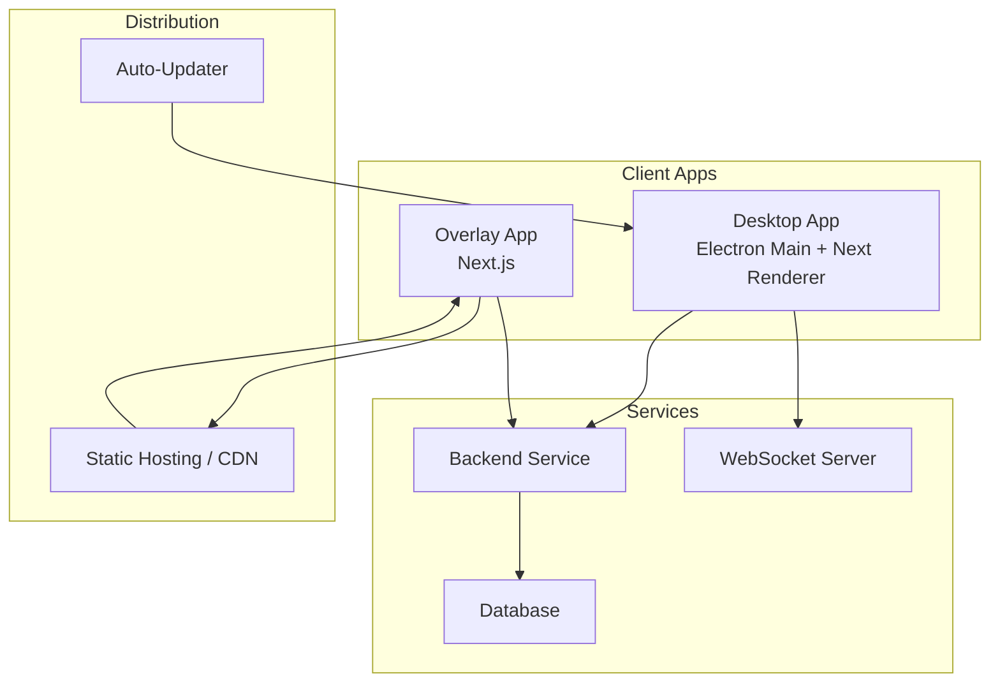
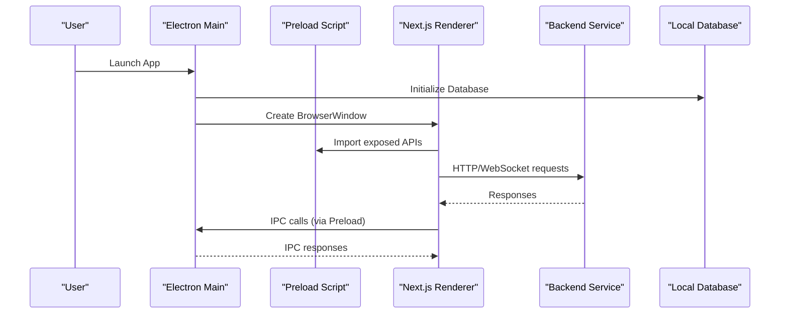
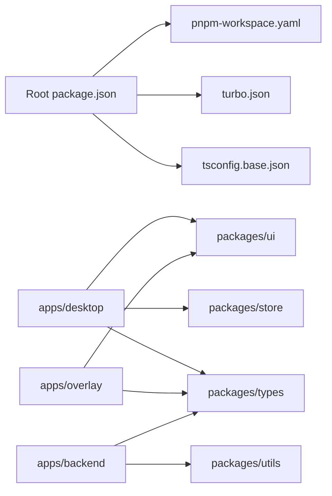

# Deployment and Production

<cite>
**Referenced Files in This Document**
- [package.json](file://package.json)
- [pnpm-workspace.yaml](file://pnpm-workspace.yaml)
- [turbo.json](file://turbo.json)
- [tsconfig.base.json](file://tsconfig.base.json)
- [apps/desktop/package.json](file://apps/desktop/package.json)
- [apps/desktop/next.config.js](file://apps/desktop/next.config.js)
- [apps/desktop/src/main/index.ts](file://apps/desktop/src/main/index.ts)
- [apps/desktop/src/preload/index.ts](file://apps/desktop/src/preload/index.ts)
- [apps/desktop/src/main/database.ts](file://apps/desktop/src/main/database.ts)
- [apps/desktop/src/main/websocket.ts](file://apps/desktop/src/main/websocket.ts)
- [apps/overlay/package.json](file://apps/overlay/package.json)
- [apps/overlay/next.config.js](file://apps/overlay/next.config.js)
- [apps/backend/package.json](file://apps/backend/package.json)
</cite>

## Table of Contents
1. [Introduction](#introduction)
2. [Project Structure](#project-structure)
3. [Core Components](#core-components)
4. [Architecture Overview](#architecture-overview)
5. [Detailed Component Analysis](#detailed-component-analysis)
6. [Dependency Analysis](#dependency-analysis)
7. [Performance Considerations](#performance-considerations)
8. [Troubleshooting Guide](#troubleshooting-guide)
9. [Conclusion](#conclusion)
10. [Appendices](#appendices)

## Introduction
This document provides comprehensive deployment and production guidance for AR Sports applications across desktop, overlay, web, and backend components. It covers build pipeline configuration, asset optimization, bundling strategies, packaging and distribution (including code signing and auto-updates), overlay deployment for broadcast environments, hosting strategies, environment configuration, monitoring, error tracking, performance logging, scaling, load balancing, disaster recovery, CI/CD examples, automated testing in production-like environments, and rollback strategies.

## Project Structure
AR Sports is a monorepo with multiple apps and shared packages:
- apps/desktop: Electron-based desktop application using Next.js renderer and Node/Electron main process
- apps/overlay: Next.js overlay app intended for broadcast overlays
- apps/backend: Backend service package
- apps/admin: Admin application (not analyzed in detail here)
- apps/web: Web application (not analyzed in detail here)
- packages: Shared libraries (animations, graphics, hooks, icons, store, theme, types, ui, utils)

**Diagram sources**
- [package.json](file://package.json)
- [pnpm-workspace.yaml](file://pnpm-workspace.yaml)
- [turbo.json](file://turbo.json)
- [tsconfig.base.json](file://tsconfig.base.json)

**Section sources**
- [package.json](file://package.json)
- [pnpm-workspace.yaml](file://pnpm-workspace.yaml)
- [turbo.json](file://turbo.json)
- [tsconfig.base.json](file://tsconfig.base.json)

## Core Components
- Desktop app: Combines an Electron main process with a Next.js renderer. The main process manages the window lifecycle, IPC, database access, and WebSocket connectivity. The preload script exposes safe APIs to the renderer.
- Overlay app: A lightweight Next.js app designed to be embedded or streamed as an overlay in broadcast workflows.
- Backend service: Provides APIs and data services consumed by desktop and overlay clients.

Key responsibilities:
- Build orchestration via Turborepo
- Workspace management via pnpm
- TypeScript base configuration for consistent builds
- Desktop packaging and update mechanisms
- Overlay hosting and streaming integration
- Backend API serving and data persistence

**Section sources**
- [apps/desktop/package.json](file://apps/desktop/package.json)
- [apps/desktop/next.config.js](file://apps/desktop/next.config.js)
- [apps/desktop/src/main/index.ts](file://apps/desktop/src/main/index.ts)
- [apps/desktop/src/preload/index.ts](file://apps/desktop/src/preload/index.ts)
- [apps/desktop/src/main/database.ts](file://apps/desktop/src/main/database.ts)
- [apps/desktop/src/main/websocket.ts](file://apps/desktop/src/main/websocket.ts)
- [apps/overlay/package.json](file://apps/overlay/package.json)
- [apps/overlay/next.config.js](file://apps/overlay/next.config.js)
- [apps/backend/package.json](file://apps/backend/package.json)

## Architecture Overview
The system comprises four primary runtime surfaces:
- Desktop client (Electron + Next.js renderer)
- Overlay client (Next.js)
- Backend service
- Shared packages used by all apps

[No sources needed since this diagram shows conceptual architecture]

## Detailed Component Analysis

### Desktop Application (Electron + Next.js)
Production build and packaging considerations:
- Use the desktop package scripts to build the Next.js renderer and then package the Electron app.
- Configure Next.js for production optimizations (static exports if applicable, asset minification, tree-shaking).
- Ensure the preload script is bundled securely and only exposes necessary IPC channels.
- Database initialization should occur in the main process after ready events.
- WebSocket connections should be resilient with reconnection logic and backoff.

**Diagram sources**
- [apps/desktop/src/main/index.ts](file://apps/desktop/src/main/index.ts)
- [apps/desktop/src/preload/index.ts](file://apps/desktop/src/preload/index.ts)
- [apps/desktop/src/main/database.ts](file://apps/desktop/src/main/database.ts)
- [apps/desktop/src/main/websocket.ts](file://apps/desktop/src/main/websocket.ts)

**Section sources**
- [apps/desktop/package.json](file://apps/desktop/package.json)
- [apps/desktop/next.config.js](file://apps/desktop/next.config.js)
- [apps/desktop/src/main/index.ts](file://apps/desktop/src/main/index.ts)
- [apps/desktop/src/preload/index.ts](file://apps/desktop/src/preload/index.ts)
- [apps/desktop/src/main/database.ts](file://apps/desktop/src/main/database.ts)
- [apps/desktop/src/main/websocket.ts](file://apps/desktop/src/main/websocket.ts)

#### Packaging and Distribution (Desktop)
- Code signing: Configure platform-specific signing for Windows and macOS during packaging.
- Auto-updates: Integrate an updater mechanism that checks remote artifacts and installs updates safely.
- Artifacts: Produce installers or zipped releases per platform; ensure checksums and signatures are published alongside artifacts.

**Section sources**
- [apps/desktop/package.json](file://apps/desktop/package.json)

### Overlay Application (Broadcast Environment)
Deployment targets:
- Stream capture software (OBS, vMix, etc.) via browser source pointing to the overlay app hosted on a local or remote server.
- Containerized deployment for headless rendering and low-latency delivery.
- Static hosting with CDN for global reach when appropriate.

Operational considerations:
- Minimize payload size and optimize assets for real-time rendering.
- Provide configuration endpoints for dynamic content and layout control.
- Ensure CORS and security headers are configured appropriately.

**Section sources**
- [apps/overlay/package.json](file://apps/overlay/package.json)
- [apps/overlay/next.config.js](file://apps/overlay/next.config.js)

### Backend Service
Responsibilities:
- Serve REST/GraphQL APIs consumed by desktop and overlay apps.
- Manage persistent storage and business logic.
- Expose WebSocket endpoints for real-time features.

Deployment options:
- Container orchestration (Kubernetes, Docker Compose) for scalable deployments.
- Managed platforms (cloud providers) with autoscaling and health checks.
- Reverse proxy (Nginx/Traefik) for TLS termination and routing.

**Section sources**
- [apps/backend/package.json](file://apps/backend/package.json)

## Dependency Analysis
The monorepo uses pnpm workspaces and Turborepo for efficient builds and caching. Shared packages reduce duplication and enforce consistent interfaces across apps.

**Diagram sources**
- [package.json](file://package.json)
- [pnpm-workspace.yaml](file://pnpm-workspace.yaml)
- [turbo.json](file://turbo.json)
- [tsconfig.base.json](file://tsconfig.base.json)

**Section sources**
- [package.json](file://package.json)
- [pnpm-workspace.yaml](file://pnpm-workspace.yaml)
- [turbo.json](file://turbo.json)
- [tsconfig.base.json](file://tsconfig.base.json)

## Performance Considerations
- Asset optimization: Enable compression, image optimization, and code splitting in Next.js configurations.
- Bundle analysis: Use bundle analyzers to identify large dependencies and remove unused code.
- Caching: Leverage Turborepo caching for incremental builds; configure CDN cache headers for static assets.
- Runtime performance: Implement WebSocket reconnection with exponential backoff; debounce heavy operations in the renderer.
- Memory usage: Monitor Electron memory footprint; avoid long-lived references in preload and main processes.

[No sources needed since this section provides general guidance]

## Troubleshooting Guide
Common issues and mitigations:
- IPC failures: Validate channel names and payloads; add robust error handling and fallbacks in preload and main.
- Database errors: Wrap initialization in try/catch; log detailed diagnostics and provide graceful degradation.
- WebSocket instability: Implement heartbeat/ping-pong; track connection metrics and alert on prolonged downtime.
- Build failures: Inspect Turborepo logs; clear caches if necessary; verify workspace dependency versions.

**Section sources**
- [apps/desktop/src/main/index.ts](file://apps/desktop/src/main/index.ts)
- [apps/desktop/src/preload/index.ts](file://apps/desktop/src/preload/index.ts)
- [apps/desktop/src/main/database.ts](file://apps/desktop/src/main/database.ts)
- [apps/desktop/src/main/websocket.ts](file://apps/desktop/src/main/websocket.ts)

## Conclusion
This guide outlines production-ready practices for deploying AR Sports across desktop, overlay, and backend surfaces. By leveraging the monorepo’s build orchestration, optimizing assets, securing and distributing the desktop app, and ensuring reliable backend services, teams can achieve stable, scalable, and maintainable deployments.

[No sources needed since this section summarizes without analyzing specific files]

## Appendices

### Build Pipeline Configuration (Production)
- Workspace setup: Define packages and apps in the workspace configuration.
- Task orchestration: Configure Turborepo tasks for building each app and sharing cached outputs.
- TypeScript consistency: Use the base tsconfig to standardize compiler options across apps.

**Section sources**
- [pnpm-workspace.yaml](file://pnpm-workspace.yaml)
- [turbo.json](file://turbo.json)
- [tsconfig.base.json](file://tsconfig.base.json)

### Asset Optimization and Bundling Strategies
- Next.js production settings: Enable minification, image optimization, and static generation where applicable.
- Tree-shaking and code splitting: Ensure library imports are modular to reduce bundle sizes.
- Compression: Serve gzip/brotli-compressed assets via reverse proxies or CDNs.

**Section sources**
- [apps/desktop/next.config.js](file://apps/desktop/next.config.js)
- [apps/overlay/next.config.js](file://apps/overlay/next.config.js)

### Packaging and Distribution Methods (Desktop)
- Platform-specific packaging: Generate installers or archives for Windows and macOS.
- Code signing: Apply certificates and entitlements during packaging.
- Auto-updates: Publish signed artifacts and configure the updater to fetch and apply updates.

**Section sources**
- [apps/desktop/package.json](file://apps/desktop/package.json)

### Overlay Application Deployment for Broadcast Environments
- Local hosting: Run the overlay app on a local server accessible by capture software.
- Remote hosting: Deploy to a containerized environment behind a reverse proxy with TLS.
- Streaming integration: Configure OBS/vMix browser sources with appropriate CORS and security headers.

**Section sources**
- [apps/overlay/package.json](file://apps/overlay/package.json)
- [apps/overlay/next.config.js](file://apps/overlay/next.config.js)

### Web Application Hosting
- Static hosting: Export static assets and serve via CDN for fast global delivery.
- Dynamic hosting: Use serverless functions or managed platforms for SSR and API routes.

[No sources needed since this section provides general guidance]

### Backend Service Deployment
- Containerization: Package the backend into containers with health checks and resource limits.
- Orchestration: Deploy with Kubernetes or Docker Compose; configure autoscaling policies.
- Reverse proxy: Terminate TLS and route traffic to backend instances.

**Section sources**
- [apps/backend/package.json](file://apps/backend/package.json)

### Environment Configuration
- Centralize environment variables per app and environment (dev/staging/prod).
- Validate required variables at startup; fail fast with clear error messages.
- Use secrets management for sensitive values (API keys, signing certificates).

[No sources needed since this section provides general guidance]

### Monitoring Setup, Error Tracking, and Performance Logging
- Metrics collection: Instrument key endpoints and WebSocket connections with latency and error rates.
- Error tracking: Capture unhandled exceptions and user-facing errors with context.
- Structured logging: Emit JSON logs with correlation IDs for distributed tracing.

[No sources needed since this section provides general guidance]

### Scaling Considerations, Load Balancing, and Disaster Recovery
- Horizontal scaling: Add replicas behind a load balancer; use sticky sessions if necessary.
- Health checks: Implement readiness/liveness probes; drain connections gracefully.
- Disaster recovery: Regular backups of databases; define RTO/RPO targets; test failover procedures.

[No sources needed since this section provides general guidance]

### CI/CD Pipeline Configuration Examples
- Build matrix: Parallel builds for desktop, overlay, and backend across platforms.
- Artifact publishing: Upload signed desktop installers and overlay/static assets.
- Integration tests: Run against staging environments; validate API contracts and WebSocket flows.

[No sources needed since this section provides general guidance]

### Automated Testing in Production-Like Environments
- Staging deployments: Mirror production configs and infrastructure.
- Smoke tests: Verify critical paths post-deploy (login, data sync, overlay rendering).
- Canary releases: Gradually roll out changes and monitor metrics before full rollout.

[No sources needed since this section provides general guidance]

### Rollback Strategies
- Versioned artifacts: Maintain previous releases and quick rollback procedures.
- Feature flags: Disable problematic features without redeploying.
- Database migrations: Ensure backward-compatible migrations and rollback scripts.

[No sources needed since this section provides general guidance]