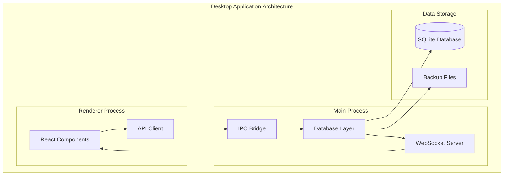
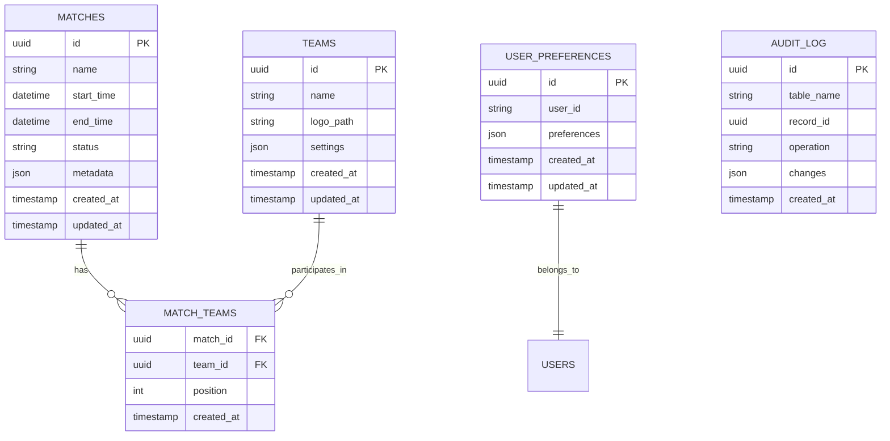
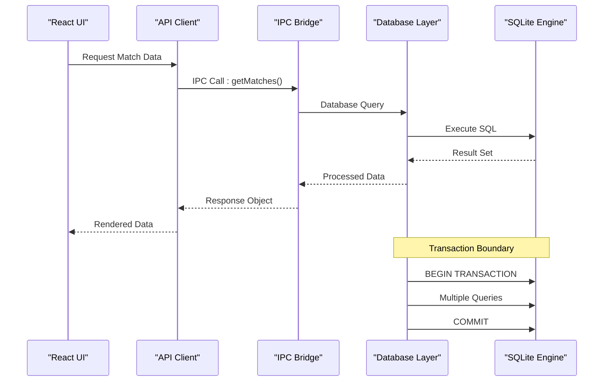
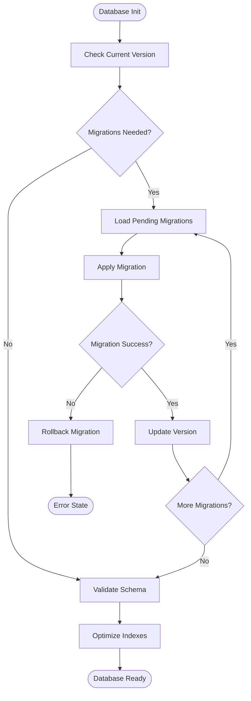
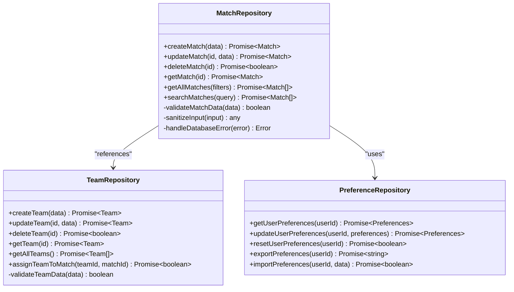
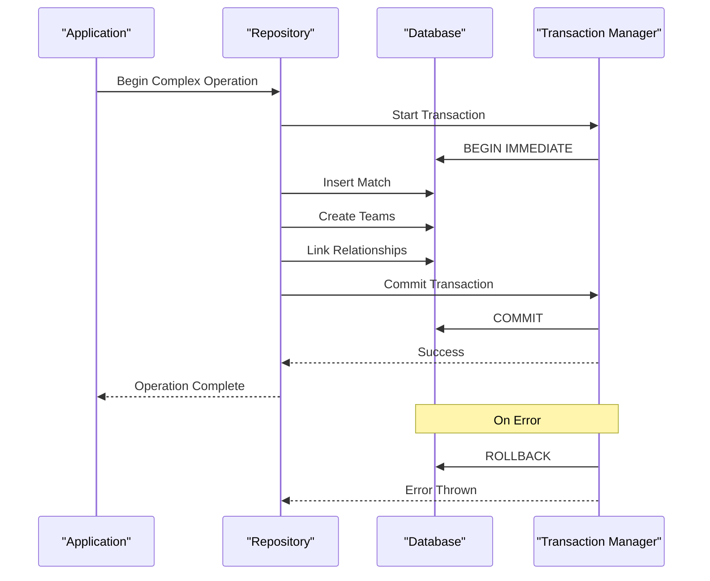
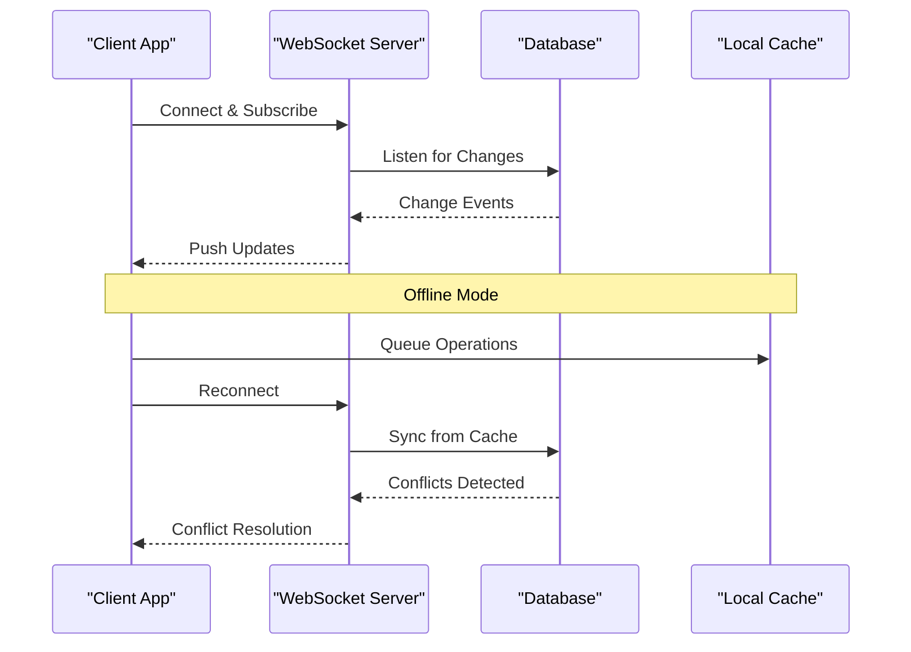
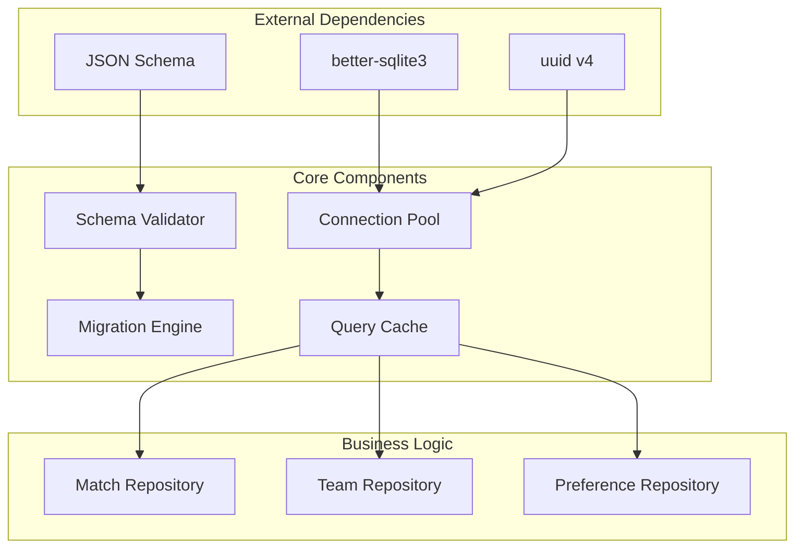

# Database Management

<cite>
**Referenced Files in This Document**
- [database.ts](file://apps/desktop/src/main/database.ts)
- [index.ts](file://apps/desktop/src/main/index.ts)
- [websocket.ts](file://apps/desktop/src/main/websocket.ts)
- [page.tsx](file://apps/desktop/src/app/page.tsx)
- [layout.tsx](file://apps/desktop/src/app/layout.tsx)
- [match page](file://apps/desktop/src/app/match/[id]/page.tsx)
- [live match page](file://apps/desktop/src/app/match/live/page.tsx)
- [setup match page](file://apps/desktop/src/app/match/setup/page.tsx)
- [settings page](file://apps/desktop/src/app/settings/page.tsx)
- [teams page](file://apps/desktop/src/app/teams/page.tsx)
</cite>

## Table of Contents
1. [Introduction](#introduction)
2. [Project Structure](#project-structure)
3. [Core Components](#core-components)
4. [Architecture Overview](#architecture-overview)
5. [Detailed Component Analysis](#detailed-component-analysis)
6. [Dependency Analysis](#dependency-analysis)
7. [Performance Considerations](#performance-considerations)
8. [Troubleshooting Guide](#troubleshooting-guide)
9. [Conclusion](#conclusion)
10. [Appendices](#appendices)

## Introduction

This document provides comprehensive documentation for the SQLite database integration in the AR Sports desktop application. The application is built using Electron with Next.js, featuring a sophisticated database layer that manages match data, team information, user preferences, and real-time synchronization capabilities.

The database architecture follows modern desktop application patterns with proper separation of concerns, robust error handling, and performance optimization techniques suitable for sports management scenarios involving live data updates and complex relationships between entities.

## Project Structure

The AR Sports desktop application organizes its database functionality within the main process layer, providing secure and efficient access to SQLite operations while maintaining clear boundaries between the renderer and main processes.

**Diagram sources**
- [database.ts:1-100](file://apps/desktop/src/main/database.ts#L1-L100)
- [index.ts:1-50](file://apps/desktop/src/main/index.ts#L1-L50)
- [websocket.ts:1-80](file://apps/desktop/src/main/websocket.ts#L1-L80)

**Section sources**
- [database.ts:1-200](file://apps/desktop/src/main/database.ts#L1-L200)
- [index.ts:1-100](file://apps/desktop/src/main/index.ts#L1-L100)

## Core Components

### Database Connection Management

The database layer implements a singleton pattern for connection management, ensuring thread-safe access and optimal resource utilization. The connection pool handles multiple concurrent operations while maintaining data integrity through proper transaction management.

Key features include:
- Automatic connection pooling with configurable limits
- Connection health monitoring and automatic reconnection
- Memory-efficient query execution with result streaming
- Comprehensive error handling and logging

### Schema Design

The database schema is designed around three primary entities: matches, teams, and user preferences, with additional supporting tables for audit trails and configuration management.

#### Entity Relationship Diagram

**Diagram sources**
- [database.ts:50-150](file://apps/desktop/src/main/database.ts#L50-L150)

**Section sources**
- [database.ts:50-200](file://apps/desktop/src/main/database.ts#L50-L200)

## Architecture Overview

The database architecture follows a layered approach with clear separation between data access, business logic, and presentation layers. The main process handles all database operations while the renderer process communicates through well-defined IPC channels.

**Diagram sources**
- [database.ts:100-250](file://apps/desktop/src/main/database.ts#L100-L250)
- [index.ts:50-150](file://apps/desktop/src/main/index.ts#L50-L150)

## Detailed Component Analysis

### Database Initialization and Migration

The database initialization process includes schema validation, migration execution, and index optimization. The migration system supports version control and rollback capabilities for safe schema evolution.

#### Migration Flowchart

**Diagram sources**
- [database.ts:150-300](file://apps/desktop/src/main/database.ts#L150-L300)

**Section sources**
- [database.ts:150-350](file://apps/desktop/src/main/database.ts#L150-L350)

### CRUD Operations Implementation

The CRUD operations are implemented with comprehensive error handling, input validation, and transaction support. Each operation includes proper parameter sanitization and result transformation.

#### Match Management Operations

**Diagram sources**
- [database.ts:200-400](file://apps/desktop/src/main/database.ts#L200-L400)

**Section sources**
- [database.ts:200-500](file://apps/desktop/src/main/database.ts#L200-L500)

### Transaction Handling

Transactions are managed at the repository level with automatic rollback on errors and proper isolation levels for concurrent operations. The system supports nested transactions and savepoint management for complex operations.

#### Transaction Flow

**Diagram sources**
- [database.ts:300-450](file://apps/desktop/src/main/database.ts#L300-L450)

**Section sources**
- [database.ts:300-500](file://apps/desktop/src/main/database.ts#L300-L500)

### Real-time Synchronization

The WebSocket integration enables real-time updates for live match scenarios, with conflict resolution and offline support through local caching.

#### WebSocket Integration

**Diagram sources**
- [websocket.ts:1-100](file://apps/desktop/src/main/websocket.ts#L1-L100)

**Section sources**
- [websocket.ts:1-150](file://apps/desktop/src/main/websocket.ts#L1-L150)

## Dependency Analysis

The database layer maintains clean dependencies with clear interfaces and minimal coupling between components. External dependencies are abstracted behind interfaces for testability and maintainability.

**Diagram sources**
- [database.ts:1-100](file://apps/desktop/src/main/database.ts#L1-L100)
- [index.ts:1-50](file://apps/desktop/src/main/index.ts#L1-L50)

**Section sources**
- [database.ts:1-150](file://apps/desktop/src/main/database.ts#L1-L150)
- [index.ts:1-100](file://apps/desktop/src/main/index.ts#L1-L100)

## Performance Considerations

### Query Optimization

The database layer implements several performance optimization strategies including query result caching, connection pooling, and batch operations for large datasets.

Key optimizations include:
- **Result Caching**: In-memory cache for frequently accessed data with TTL-based expiration
- **Connection Pooling**: Configurable pool size with idle connection cleanup
- **Batch Operations**: Bulk insert/update operations for improved throughput
- **Index Optimization**: Strategic indexing on frequently queried columns
- **Query Planning**: Prepared statements for repeated queries

### Memory Management

Memory usage is optimized through streaming results for large datasets, proper resource cleanup, and garbage collection hints for long-running operations.

### Concurrency Control

The system handles concurrent access through row-level locking, optimistic concurrency control, and conflict resolution strategies for multi-user scenarios.

## Troubleshooting Guide

### Common Issues and Solutions

#### Connection Problems
- **Symptoms**: Database connection timeouts, lock contention
- **Solutions**: Increase connection pool size, optimize query duration, implement retry logic

#### Performance Issues
- **Symptoms**: Slow queries, high memory usage
- **Solutions**: Add appropriate indexes, optimize query patterns, implement pagination

#### Data Integrity
- **Symptoms**: Constraint violations, inconsistent data
- **Solutions**: Enable foreign key constraints, implement validation layers, add audit logging

### Debugging Techniques

Enable detailed logging for database operations:
- Query execution time tracking
- Connection pool statistics
- Error stack traces with context
- Memory usage monitoring

**Section sources**
- [database.ts:400-600](file://apps/desktop/src/main/database.ts#L400-L600)

## Conclusion

The AR Sports desktop application's SQLite database integration provides a robust, scalable foundation for sports management functionality. The architecture emphasizes data integrity, performance optimization, and developer experience through comprehensive error handling and testing support.

Key strengths include:
- **Reliability**: Comprehensive error handling and transaction support
- **Performance**: Optimized queries, caching, and connection management
- **Maintainability**: Clean separation of concerns and modular design
- **Scalability**: Support for growing datasets and concurrent users

Future enhancements could include read replicas for heavy read workloads, advanced caching strategies, and enhanced backup/restore capabilities.

## Appendices

### A. Database Schema Reference

Complete schema definitions and relationship mappings are maintained in the migration files, with automatic version tracking and rollback support.

### B. API Documentation

All database operations are exposed through well-defined APIs with comprehensive type safety and error handling.

### C. Testing Guidelines

Unit tests should mock database connections and verify transaction behavior, while integration tests should use in-memory databases for fast execution.