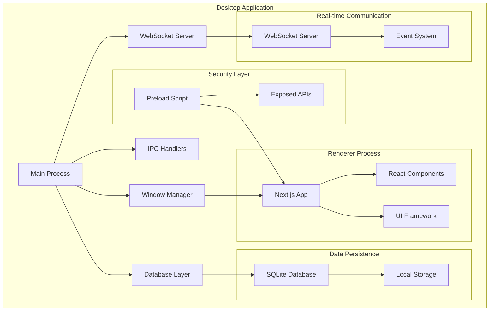
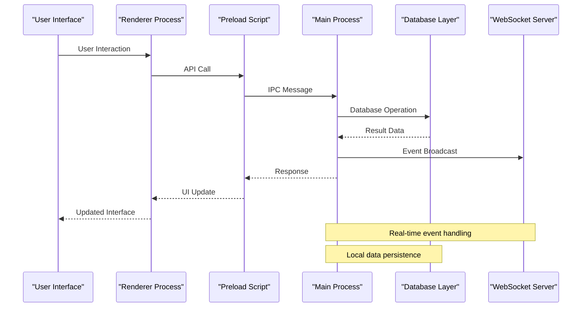
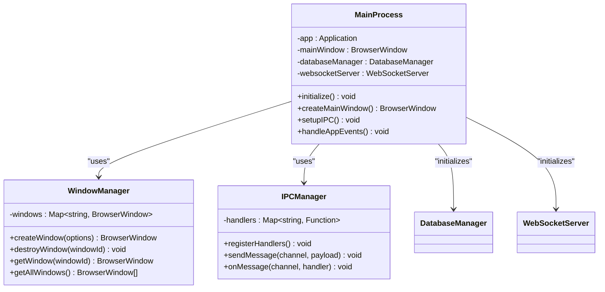
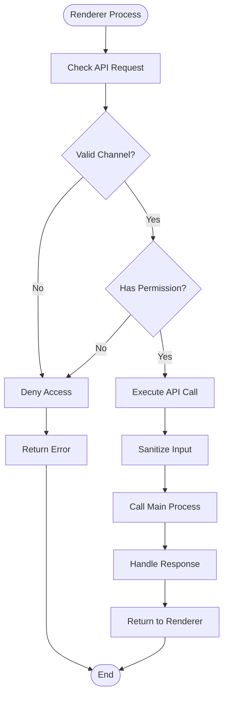
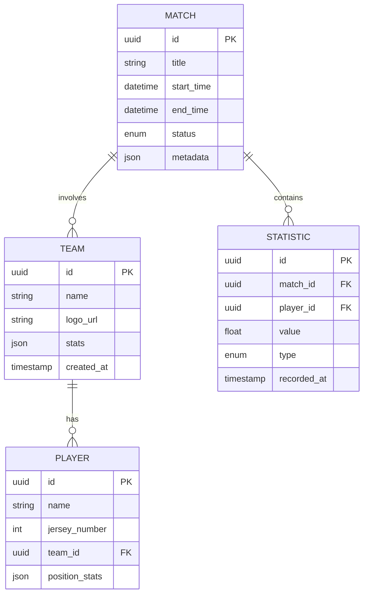
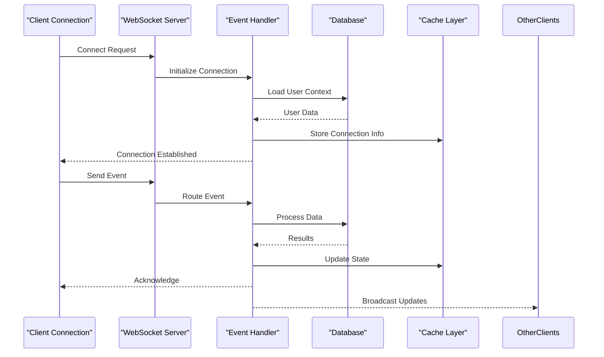
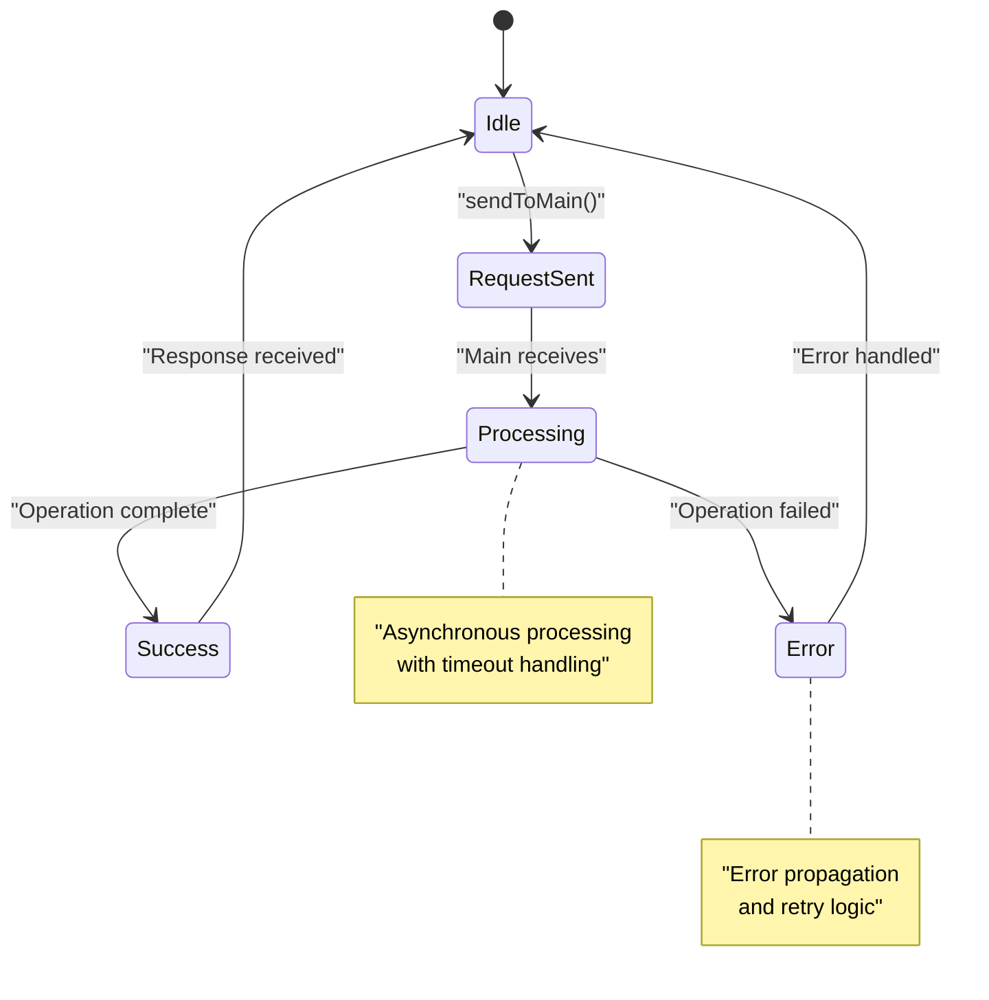
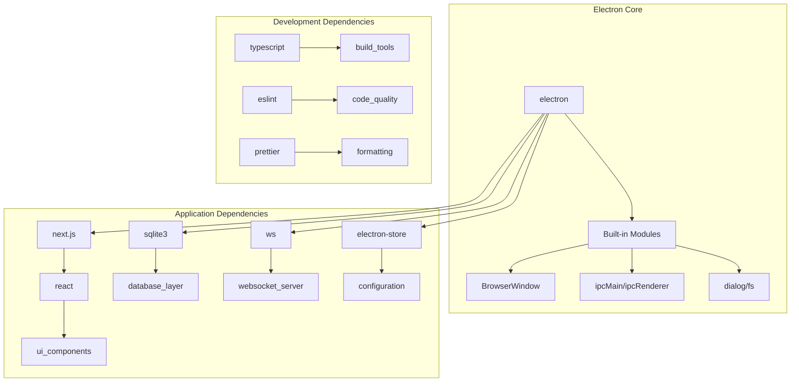

# Desktop Application

<cite>
**Referenced Files in This Document**
- [apps/desktop/src/main/index.ts](file://apps/desktop/src/main/index.ts)
- [apps/desktop/src/preload/index.ts](file://apps/desktop/src/preload/index.ts)
- [apps/desktop/src/main/database.ts](file://apps/desktop/src/main/database.ts)
- [apps/desktop/src/main/websocket.ts](file://apps/desktop/src/main/websocket.ts)
- [apps/desktop/package.json](file://apps/desktop/package.json)
- [apps/desktop/next.config.js](file://apps/desktop/next.config.js)
- [apps/desktop/tsconfig.json](file://apps/desktop/tsconfig.json)
</cite>

## Table of Contents
1. [Introduction](#introduction)
2. [Project Structure](#project-structure)
3. [Core Components](#core-components)
4. [Architecture Overview](#architecture-overview)
5. [Detailed Component Analysis](#detailed-component-analysis)
6. [Dependency Analysis](#dependency-analysis)
7. [Performance Considerations](#performance-considerations)
8. [Troubleshooting Guide](#troubleshooting-guide)
9. [Conclusion](#conclusion)
10. [Appendices](#appendices)

## Introduction

The AR Sports desktop application is a sophisticated Electron-based desktop solution that combines modern web technologies with native desktop capabilities. Built as part of a larger monorepo structure, the desktop application leverages Next.js for the renderer process while maintaining robust main process functionality through Electron's architecture. The application provides real-time sports data management, local database persistence, and seamless integration with operating system features.

This documentation covers the complete architecture of the AR Sports desktop application, including main process management, window handling, inter-process communication (IPC), security models, database integration, WebSocket server implementation, and native OS integrations.

## Project Structure

The AR Sports desktop application follows a well-organized modular architecture within the apps/desktop directory:

**Diagram sources**
- [apps/desktop/src/main/index.ts](file://apps/desktop/src/main/index.ts)
- [apps/desktop/src/preload/index.ts](file://apps/desktop/src/preload/index.ts)
- [apps/desktop/src/main/database.ts](file://apps/desktop/src/main/database.ts)
- [apps/desktop/src/main/websocket.ts](file://apps/desktop/src/main/websocket.ts)

The application structure includes:

- **Main Process**: Core Electron application logic, window management, and system integration
- **Renderer Process**: Next.js-based user interface with React components
- **Preload Script**: Security bridge between main and renderer processes
- **Database Layer**: SQLite integration for local data persistence
- **WebSocket Server**: Real-time communication capabilities
- **Configuration Management**: Application settings and environment configuration

**Section sources**
- [apps/desktop/package.json](file://apps/desktop/package.json)
- [apps/desktop/next.config.js](file://apps/desktop/next.config.js)
- [apps/desktop/tsconfig.json](file://apps/desktop/tsconfig.json)

## Core Components

### Main Process Architecture

The main process serves as the entry point for the Electron application, managing application lifecycle, window creation, and system-level operations. It coordinates between different modules including database management, WebSocket server, and IPC handlers.

### Window Management System

The application implements a sophisticated window management system that handles multiple windows, window states, and cross-window communication. Each window type serves specific purposes within the sports management workflow.

### Preload Script Security Model

The preload script acts as a secure bridge between the main and renderer processes, exposing only necessary APIs to the renderer while maintaining strict security boundaries.

### Database Integration Layer

SQLite database integration provides local data persistence for matches, teams, players, and other sports-related data. The layer abstracts database operations and provides consistent CRUD interfaces.

### WebSocket Server Implementation

A built-in WebSocket server enables real-time features such as live score updates, player notifications, and synchronized data across multiple clients.

**Section sources**
- [apps/desktop/src/main/index.ts](file://apps/desktop/src/main/index.ts)
- [apps/desktop/src/preload/index.ts](file://apps/desktop/src/preload/index.ts)
- [apps/desktop/src/main/database.ts](file://apps/desktop/src/main/database.ts)
- [apps/desktop/src/main/websocket.ts](file://apps/desktop/src/main/websocket.ts)

## Architecture Overview

The AR Sports desktop application follows a layered architecture pattern with clear separation of concerns:

**Diagram sources**
- [apps/desktop/src/main/index.ts](file://apps/desktop/src/main/index.ts)
- [apps/desktop/src/preload/index.ts](file://apps/desktop/src/preload/index.ts)
- [apps/desktop/src/main/database.ts](file://apps/desktop/src/main/database.ts)
- [apps/desktop/src/main/websocket.ts](file://apps/desktop/src/main/websocket.ts)

### Key Architectural Patterns

1. **Layered Architecture**: Clear separation between presentation, business logic, and data access layers
2. **Event-Driven Communication**: Asynchronous communication between components using events
3. **Repository Pattern**: Abstracted data access through repository interfaces
4. **Observer Pattern**: Real-time updates through event subscriptions
5. **Factory Pattern**: Dynamic window and module instantiation

## Detailed Component Analysis

### Main Process Management

The main process orchestrates all core application functionality and manages the application lifecycle:

**Diagram sources**
- [apps/desktop/src/main/index.ts](file://apps/desktop/src/main/index.ts)

#### Window Types and States

The application supports multiple window types:

| Window Type | Purpose | Features | Lifecycle |
|-------------|---------|----------|-----------|
| Main Window | Primary application interface | Full functionality, menu bar | Application lifetime |
| Settings Window | Configuration management | Persistent settings, preferences | On-demand |
| Match Setup Window | Match configuration | Form validation, data binding | Session-based |
| Live Score Window | Real-time score display | Auto-refresh, fullscreen | Event-driven |

**Section sources**
- [apps/desktop/src/main/index.ts](file://apps/desktop/src/main/index.ts)

### Preload Script Security Model

The preload script implements a secure API exposure model:

**Diagram sources**
- [apps/desktop/src/preload/index.ts](file://apps/desktop/src/preload/index.ts)

#### Exposed API Categories

The preload script exposes categorized APIs:

1. **Database APIs**: CRUD operations for local data
2. **System APIs**: File system access, system information
3. **Communication APIs**: WebSocket messaging, IPC calls
4. **Window Management APIs**: Window creation and control
5. **Configuration APIs**: Settings management

**Section sources**
- [apps/desktop/src/preload/index.ts](file://apps/desktop/src/preload/index.ts)

### Database Integration with SQLite

The database layer provides comprehensive data persistence:

**Diagram sources**
- [apps/desktop/src/main/database.ts](file://apps/desktop/src/main/database.ts)

#### Database Schema Design

The schema includes core entities for sports management:

- **Match Management**: Complete match lifecycle tracking
- **Team Administration**: Team profiles and statistics
- **Player Profiles**: Individual player data and performance metrics
- **Statistics Tracking**: Comprehensive statistical analysis
- **Settings Storage**: Application configuration persistence

#### CRUD Operations

The database layer implements standardized CRUD operations:

| Operation | Method | Description | Performance |
|-----------|--------|-------------|-------------|
| Create | `insert()` | Add new records | Optimized batching |
| Read | `find()`, `findById()` | Query with filters | Indexed queries |
| Update | `update()`, `patch()` | Modify existing records | Transaction support |
| Delete | `delete()`, `softDelete()` | Remove or archive records | Cascade handling |

**Section sources**
- [apps/desktop/src/main/database.ts](file://apps/desktop/src/main/database.ts)

### WebSocket Server Implementation

The WebSocket server enables real-time communication:

**Diagram sources**
- [apps/desktop/src/main/websocket.ts](file://apps/desktop/src/main/websocket.ts)

#### Connection Management

The WebSocket server implements robust connection management:

- **Connection Pooling**: Efficient resource utilization
- **Heartbeat Mechanism**: Connection health monitoring
- **Automatic Reconnection**: Resilient client connections
- **Message Queueing**: Reliable message delivery
- **Error Recovery**: Graceful error handling and recovery

#### Event Handling System

The event system supports various real-time scenarios:

| Event Type | Description | Use Case |
|------------|-------------|----------|
| Match Events | Live score updates, game state changes | Real-time scoreboards |
| Player Events | Individual player statistics, substitutions | Player tracking |
| Team Events | Team-wide updates, roster changes | Team management |
| System Events | Application state, configuration changes | System coordination |

**Section sources**
- [apps/desktop/src/main/websocket.ts](file://apps/desktop/src/main/websocket.ts)

### IPC Communication Patterns

Inter-process communication follows established patterns:

**Diagram sources**
- [apps/desktop/src/preload/index.ts](file://apps/desktop/src/preload/index.ts)
- [apps/desktop/src/main/index.ts](file://apps/desktop/src/main/index.ts)

#### IPC Channels

The application defines structured IPC channels:

- **Database Channels**: Data operations and queries
- **System Channels**: File system and OS interactions
- **Window Channels**: Window management and state
- **WebSocket Channels**: Real-time communication
- **Configuration Channels**: Settings and preferences

**Section sources**
- [apps/desktop/src/preload/index.ts](file://apps/desktop/src/preload/index.ts)
- [apps/desktop/src/main/index.ts](file://apps/desktop/src/main/index.ts)

### Configuration Management

The application supports comprehensive configuration options:

| Category | Options | Description | Default |
|----------|---------|-------------|---------|
| Database | `db.path`, `db.backup.enabled` | SQLite database location and backup settings | `./data/app.db` |
| WebSocket | `ws.port`, `ws.maxConnections` | Server port and connection limits | `8080`, `100` |
| Window | `window.width`, `window.height` | Default window dimensions | `1200x800` |
| Security | `security.sandbox`, `security.csp` | Security policy configurations | `true`, `strict` |
| Logging | `log.level`, `log.file` | Logging verbosity and output | `info`, `./logs/app.log` |

### System Tray Functionality

The application integrates with the operating system tray:

- **Context Menu**: Quick access to common actions
- **Notifications**: System notification support
- **Status Indicators**: Visual status feedback
- **Cross-Platform Compatibility**: Consistent behavior across OS platforms

### File System Access

Secure file system operations include:

- **Config File Management**: Application settings persistence
- **Data Export/Import**: Backup and restore functionality
- **Asset Management**: Static resource handling
- **Log File Management**: Structured logging output

### Native OS Integrations

The application provides deep OS integration:

- **File Associations**: Custom file type handling
- **Protocol Handlers**: Custom URL scheme support
- **System Notifications**: Native notification system
- **Auto-start**: Boot-time startup configuration
- **Drag & Drop**: Native drag and drop support

**Section sources**
- [apps/desktop/src/main/index.ts](file://apps/desktop/src/main/index.ts)
- [apps/desktop/package.json](file://apps/desktop/package.json)

## Dependency Analysis

The desktop application maintains clear dependency relationships:

**Diagram sources**
- [apps/desktop/package.json](file://apps/desktop/package.json)

### External Dependencies

Key external dependencies include:

- **Electron**: Core desktop framework
- **Next.js**: React-based rendering framework
- **SQLite3**: Local database engine
- **WebSocket**: Real-time communication library
- **TypeScript**: Type-safe development

### Internal Module Relationships

The application maintains cohesive internal modules:

- **Main Process**: Orchestrates application flow
- **Preload Script**: Security boundary implementation
- **Database Layer**: Data persistence abstraction
- **WebSocket Server**: Real-time communication hub
- **UI Components**: Reusable interface elements

**Section sources**
- [apps/desktop/package.json](file://apps/desktop/package.json)

## Performance Considerations

### Memory Management

- **Window Cleanup**: Proper disposal of unused windows
- **Database Connections**: Connection pooling and cleanup
- **WebSocket Connections**: Efficient connection management
- **Memory Leaks Prevention**: Regular garbage collection optimization

### Database Optimization

- **Index Strategy**: Strategic indexing for query performance
- **Query Optimization**: Efficient SQL query construction
- **Batch Operations**: Bulk data processing capabilities
- **Connection Pooling**: Optimized database connection reuse

### Network Efficiency

- **WebSocket Optimization**: Efficient message serialization
- **Compression Support**: Data compression for large payloads
- **Connection Reuse**: Persistent connections where possible
- **Error Retry Logic**: Intelligent retry mechanisms

### Rendering Performance

- **Component Optimization**: Efficient React component design
- **State Management**: Optimized state updates
- **Virtual Scrolling**: Large dataset rendering optimization
- **Lazy Loading**: On-demand resource loading

## Troubleshooting Guide

### Common Issues and Solutions

#### Database Connection Problems

**Symptoms**: Database errors, connection timeouts, data corruption
**Solutions**: 
- Verify database file permissions
- Check disk space availability
- Validate database integrity
- Review connection pool settings

#### WebSocket Connection Issues

**Symptoms**: Connection drops, message delays, memory leaks
**Solutions**:
- Monitor connection counts and resource usage
- Implement proper heartbeat mechanisms
- Configure appropriate timeout values
- Review network firewall settings

#### IPC Communication Failures

**Symptoms**: Message delivery failures, timeout errors, security violations
**Solutions**:
- Validate channel names and permissions
- Check preload script security context
- Verify main process IPC handlers
- Review security policy configurations

#### Window Management Problems

**Symptoms**: Window crashes, memory leaks, focus issues
**Solutions**:
- Ensure proper window lifecycle management
- Implement error boundaries in renderer processes
- Monitor window memory usage
- Validate window configuration parameters

### Debugging Techniques

#### Main Process Debugging

- Enable Electron debugging flags
- Use Chrome DevTools for main process inspection
- Implement structured logging
- Monitor system resource usage

#### Renderer Process Debugging

- Utilize browser developer tools
- Implement React Developer Tools
- Monitor network requests and responses
- Track JavaScript execution performance

#### Database Debugging

- Enable SQLite query logging
- Analyze query execution plans
- Monitor database file size growth
- Review transaction logs

**Section sources**
- [apps/desktop/src/main/index.ts](file://apps/desktop/src/main/index.ts)
- [apps/desktop/src/main/database.ts](file://apps/desktop/src/main/database.ts)
- [apps/desktop/src/main/websocket.ts](file://apps/desktop/src/main/websocket.ts)

## Conclusion

The AR Sports desktop application demonstrates a well-architected Electron-based solution that effectively combines modern web technologies with native desktop capabilities. The application's modular design, comprehensive security model, and robust data management make it suitable for complex sports management scenarios requiring real-time data synchronization and local persistence.

Key strengths of the architecture include:

- **Scalable Design**: Modular components that can be extended independently
- **Security-First Approach**: Strict security boundaries with minimal privilege exposure
- **Performance Optimization**: Efficient resource management and optimized data operations
- **Real-time Capabilities**: Robust WebSocket implementation for live data updates
- **Cross-platform Compatibility**: Consistent behavior across different operating systems

The application provides a solid foundation for extending functionality through custom modules, additional window types, and enhanced real-time features while maintaining the established architectural patterns and security standards.

## Appendices

### Development Guidelines

#### Adding New IPC Channels

1. Define channel constants in shared types
2. Implement main process handler
3. Add preload script API wrapper
4. Create renderer process utility functions
5. Implement error handling and validation

#### Extending Database Schema

1. Define migration scripts
2. Update TypeScript interfaces
3. Implement repository methods
4. Add validation rules
5. Update API endpoints

#### Creating Custom Windows

1. Define window configuration
2. Implement window controller
3. Add window-specific IPC handlers
4. Configure window lifecycle management
5. Implement window state persistence

### Deployment Considerations

#### Build Configuration

- Optimize bundle sizes
- Configure code splitting
- Set up asset optimization
- Implement version management

#### Distribution Packaging

- Code signing setup
- Automatic updates configuration
- Installer customization
- Platform-specific optimizations

#### Monitoring and Analytics

- Error reporting integration
- Performance monitoring
- Usage analytics
- Crash reporting