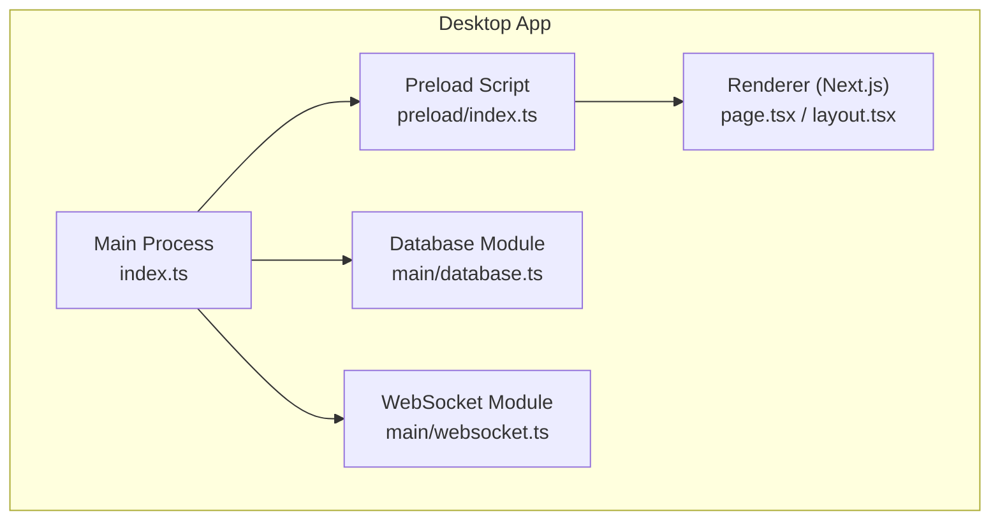
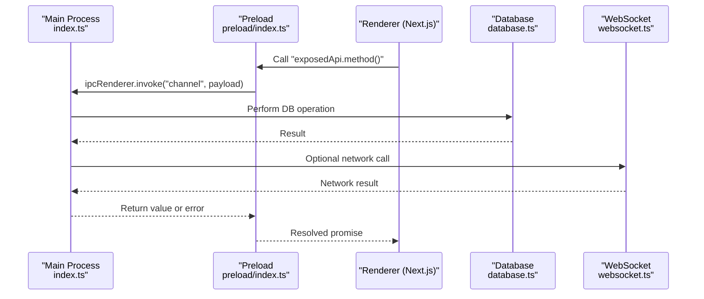
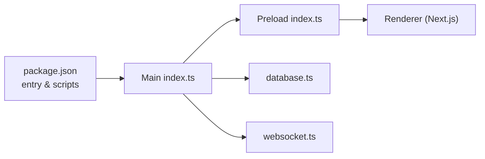

# Electron Architecture

<cite>
**Referenced Files in This Document**
- [apps/desktop/src/main/index.ts](file://apps/desktop/src/main/index.ts)
- [apps/desktop/src/preload/index.ts](file://apps/desktop/src/preload/index.ts)
- [apps/desktop/src/main/database.ts](file://apps/desktop/src/main/database.ts)
- [apps/desktop/src/main/websocket.ts](file://apps/desktop/src/main/websocket.ts)
- [apps/desktop/package.json](file://apps/desktop/package.json)
- [apps/desktop/next.config.js](file://apps/desktop/next.config.js)
</cite>

## Table of Contents
1. [Introduction](#introduction)
2. [Project Structure](#project-structure)
3. [Core Components](#core-components)
4. [Architecture Overview](#architecture-overview)
5. [Detailed Component Analysis](#detailed-component-analysis)
6. [Dependency Analysis](#dependency-analysis)
7. [Performance Considerations](#performance-considerations)
8. [Troubleshooting Guide](#troubleshooting-guide)
9. [Conclusion](#conclusion)

## Introduction
This document explains the Electron architecture for the AR Sports desktop application. It covers main process initialization, window management, and application lifecycle; the preload script security model and secure bridging between main and renderer processes; IPC patterns using contextBridge; examples for creating new windows and handling application events; and best practices for security boundaries and performance optimization.

## Project Structure
The desktop app is implemented under apps/desktop with a clear separation of concerns:
- Main process entrypoint initializes Electron, configures security, creates BrowserWindow instances, and sets up IPC channels.
- Preload script exposes a minimal, typed API to the renderer via contextBridge.
- Renderer uses Next.js (configured via next.config.js) and consumes the exposed APIs through window.* methods.
- Shared utilities include database access and WebSocket integration used by the main process.

**Diagram sources**
- [apps/desktop/src/main/index.ts](file://apps/desktop/src/main/index.ts)
- [apps/desktop/src/preload/index.ts](file://apps/desktop/src/preload/index.ts)
- [apps/desktop/src/main/database.ts](file://apps/desktop/src/main/database.ts)
- [apps/desktop/src/main/websocket.ts](file://apps/desktop/src/main/websocket.ts)

**Section sources**
- [apps/desktop/src/main/index.ts](file://apps/desktop/src/main/index.ts)
- [apps/desktop/src/preload/index.ts](file://apps/desktop/src/preload/index.ts)
- [apps/desktop/src/main/database.ts](file://apps/desktop/src/main/database.ts)
- [apps/desktop/src/main/websocket.ts](file://apps/desktop/src/main/websocket.ts)
- [apps/desktop/next.config.js](file://apps/desktop/next.config.js)

## Core Components
- Main process bootstrap: Initializes Electron, enables sandboxing, disables Node integration in renderers, configures contextIsolation, and registers IPC handlers.
- Window manager: Creates and manages BrowserWindow instances, handles lifecycle events (ready-to-show, closed), and coordinates multiple windows (e.g., overlay).
- Preload bridge: Uses contextBridge to expose a small, explicit API surface to the renderer while keeping Node and Electron APIs isolated.
- IPC channels: Centralized channel names and message schemas ensure consistent communication between main and renderer.
- Database and networking: Main-process-only modules encapsulate persistence and real-time connectivity.

**Section sources**
- [apps/desktop/src/main/index.ts](file://apps/desktop/src/main/index.ts)
- [apps/desktop/src/preload/index.ts](file://apps/desktop/src/preload/index.ts)
- [apps/desktop/src/main/database.ts](file://apps/desktop/src/main/database.ts)
- [apps/desktop/src/main/websocket.ts](file://apps/desktop/src/main/websocket.ts)

## Architecture Overview
The desktop app follows a strict isolation model:
- The main process owns system resources and privileged operations.
- The preload script acts as a secure bridge, exposing only necessary functions.
- The renderer runs untrusted UI code with no direct access to Node/Electron.

**Diagram sources**
- [apps/desktop/src/main/index.ts](file://apps/desktop/src/main/index.ts)
- [apps/desktop/src/preload/index.ts](file://apps/desktop/src/preload/index.ts)
- [apps/desktop/src/main/database.ts](file://apps/desktop/src/main/database.ts)
- [apps/desktop/src/main/websocket.ts](file://apps/desktop/src/main/websocket.ts)

## Detailed Component Analysis

### Main Process Initialization and Lifecycle
Responsibilities:
- Bootstrap Electron and guard against multiple instances.
- Configure security: enable sandbox, disable nodeIntegration, enable contextIsolation.
- Create primary BrowserWindow(s) and handle ready-to-show and close events.
- Register IPC handlers for all required channels.
- Manage application lifecycle events (activate, window-all-closed, before-quit).

Key behaviors:
- On first run, create the main window and load the Next.js URL.
- Listen for IPC invocations from preload and respond with results or errors.
- Persist state on shutdown and clean up resources.

Security considerations:
- Never enable nodeIntegration in renderers.
- Keep contextIsolation enabled.
- Use allowlist-based IPC channels.
- Validate and sanitize all incoming payloads.

**Section sources**
- [apps/desktop/src/main/index.ts](file://apps/desktop/src/main/index.ts)

### Window Management
Responsibilities:
- Create and configure BrowserWindow instances (size, position, flags).
- Handle multi-window scenarios (e.g., overlay window).
- Route focus and visibility events appropriately.
- Ensure windows are properly destroyed and do not leak resources.

Best practices:
- Centralize window creation logic.
- Reuse existing windows when possible.
- Persist window bounds and restore them on restart.

**Section sources**
- [apps/desktop/src/main/index.ts](file://apps/desktop/src/main/index.ts)

### Preload Security Model and Bridge
Responsibilities:
- Expose a minimal, typed API to the renderer via contextBridge.
- Map renderer calls to IPC channels with well-defined messages.
- Avoid exposing any Node/Electron internals.

Security considerations:
- Only expose what is strictly needed.
- Validate inputs on the main side.
- Keep channel names stable and versioned if evolving.

**Section sources**
- [apps/desktop/src/preload/index.ts](file://apps/desktop/src/preload/index.ts)

### IPC Patterns and Message Passing
Patterns:
- Request-response via ipcRenderer.invoke and ipcMain.handle.
- Event-driven notifications via ipcRenderer.send and ipcMain.on for one-way messaging.
- Channel naming convention: domain.action (e.g., "db.query", "ws.connect").

Data flow:
- Renderer calls an exposed function.
- Preload invokes the corresponding IPC channel.
- Main handler validates payload, performs work (DB/network), and returns a result.

Error handling:
- Propagate structured errors back to the renderer.
- Log server-side errors without leaking sensitive details.

**Section sources**
- [apps/desktop/src/preload/index.ts](file://apps/desktop/src/preload/index.ts)
- [apps/desktop/src/main/index.ts](file://apps/desktop/src/main/index.ts)

### Database Integration
Responsibilities:
- Provide main-process-only database operations.
- Encapsulate connection lifecycle and queries.
- Expose safe RPCs via IPC.

Considerations:
- Use parameterized queries.
- Limit permissions and scope of DB access.
- Cache frequently accessed data where appropriate.

**Section sources**
- [apps/desktop/src/main/database.ts](file://apps/desktop/src/main/database.ts)

### WebSocket Integration
Responsibilities:
- Maintain persistent connections for real-time features.
- Emit updates to relevant windows via IPC.
- Handle reconnection and error states.

Considerations:
- Throttle high-frequency updates.
- Serialize messages efficiently.
- Close connections on app quit.

**Section sources**
- [apps/desktop/src/main/websocket.ts](file://apps/desktop/src/main/websocket.ts)

### Renderer Integration with Next.js
Responsibilities:
- Load the app via Next.js.
- Consume the exposed API from preload.
- Manage UI state and user interactions.

Configuration:
- next.config.js should avoid enabling Node integration in the renderer.
- Prefer loading content over file:// or http:// URLs configured by the main process.

**Section sources**
- [apps/desktop/next.config.js](file://apps/desktop/next.config.js)

## Dependency Analysis
High-level dependencies:
- Main depends on preload for IPC contracts and on database/websocket modules for functionality.
- Renderer depends only on the preload-exposed API.
- Package configuration defines the Electron entry point and runtime settings.

**Diagram sources**
- [apps/desktop/package.json](file://apps/desktop/package.json)
- [apps/desktop/src/main/index.ts](file://apps/desktop/src/main/index.ts)
- [apps/desktop/src/preload/index.ts](file://apps/desktop/src/preload/index.ts)
- [apps/desktop/src/main/database.ts](file://apps/desktop/src/main/database.ts)
- [apps/desktop/src/main/websocket.ts](file://apps/desktop/src/main/websocket.ts)

**Section sources**
- [apps/desktop/package.json](file://apps/desktop/package.json)
- [apps/desktop/src/main/index.ts](file://apps/desktop/src/main/index.ts)
- [apps/desktop/src/preload/index.ts](file://apps/desktop/src/preload/index.ts)
- [apps/desktop/src/main/database.ts](file://apps/desktop/src/main/database.ts)
- [apps/desktop/src/main/websocket.ts](file://apps/desktop/src/main/websocket.ts)

## Performance Considerations
- Minimize IPC traffic: batch updates and debounce frequent events.
- Use efficient serialization formats for large payloads.
- Leverage caching in the main process for repeated queries.
- Offload heavy computations to worker threads if needed.
- Avoid blocking the main thread; use async handlers for long-running tasks.
- Optimize renderer rendering by reducing reflows and using virtualization for large lists.

[No sources needed since this section provides general guidance]

## Troubleshooting Guide
Common issues and resolutions:
- IPC channel not found: Verify channel names match between preload and main.
- Permission denied in renderer: Ensure nodeIntegration is disabled and contextIsolation is enabled.
- Unhandled promise rejections: Add global handlers in both main and preload to log and surface errors.
- Memory leaks in windows: Ensure windows are destroyed and event listeners are removed on close.
- Database connectivity failures: Implement retry logic and graceful degradation.

Operational tips:
- Enable verbose logging during development.
- Use structured error codes for client-side handling.
- Validate environment variables and paths at startup.

**Section sources**
- [apps/desktop/src/main/index.ts](file://apps/desktop/src/main/index.ts)
- [apps/desktop/src/preload/index.ts](file://apps/desktop/src/preload/index.ts)

## Conclusion
The AR Sports desktop app implements a secure, modular Electron architecture with clear separation between main, preload, and renderer layers. By enforcing strict isolation, using a minimal preload bridge, and centralizing IPC channels, the application maintains strong security boundaries while providing robust functionality through database and WebSocket integrations. Following the recommended best practices ensures maintainability, performance, and resilience across updates.