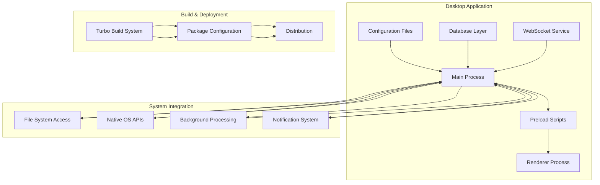
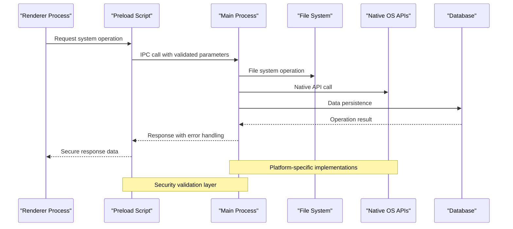
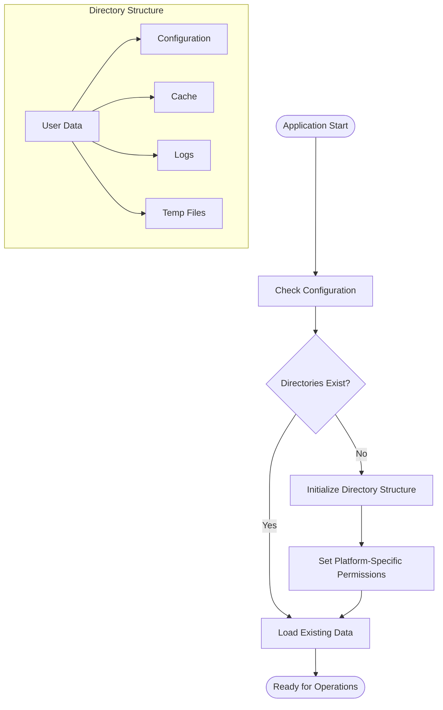
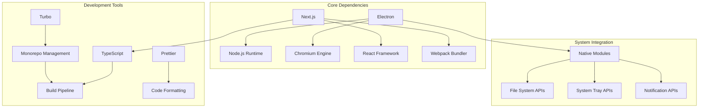

# System Integration

<cite>
**Referenced Files in This Document**
- [apps/desktop/package.json](file://apps/desktop/package.json)
- [apps/desktop/src/preload/index.ts](file://apps/desktop/src/preload/index.ts)
- [apps/desktop/src/main/database.ts](file://apps/desktop/src/main/database.ts)
- [apps/desktop/src/main/websocket.ts](file://apps/desktop/src/main/websocket.ts)
- [apps/desktop/next.config.js](file://apps/desktop/next.config.js)
- [apps/desktop/tsconfig.json](file://apps/desktop/tsconfig.json)
- [package.json](file://package.json)
- [turbo.json](file://turbo.json)
</cite>

## Table of Contents
1. [Introduction](#introduction)
2. [Project Structure](#project-structure)
3. [Core Components](#core-components)
4. [Architecture Overview](#architecture-overview)
5. [Detailed Component Analysis](#detailed-component-analysis)
6. [Dependency Analysis](#dependency-analysis)
7. [Performance Considerations](#performance-considerations)
8. [Troubleshooting Guide](#troubleshooting-guide)
9. [Conclusion](#conclusion)
10. [Appendices](#appendices)

## Introduction

The AR Sports desktop application is a sophisticated cross-platform desktop solution built using modern web technologies and Electron framework. The application provides comprehensive system integration capabilities including native OS features, file system access, background processing, and platform-specific optimizations. This document explains the system integration architecture, implementation patterns, and deployment strategies used throughout the application.

The desktop application leverages a hybrid architecture combining Next.js for the user interface with Electron for native system access, enabling seamless integration with operating system features while maintaining a responsive and modern user experience.

## Project Structure

The AR Sports desktop application follows a modular architecture with clear separation between main process, preload scripts, and renderer processes. The desktop application is organized within the `apps/desktop` directory and includes configuration files for build tools, TypeScript compilation, and development environment setup.

**Diagram sources**
- [apps/desktop/package.json:1-50](file://apps/desktop/package.json#L1-L50)
- [apps/desktop/src/preload/index.ts:1-100](file://apps/desktop/src/preload/index.ts#L1-L100)
- [apps/desktop/src/main/database.ts:1-100](file://apps/desktop/src/main/database.ts#L1-L100)

**Section sources**
- [apps/desktop/package.json:1-100](file://apps/desktop/package.json#L1-L100)
- [apps/desktop/next.config.js:1-50](file://apps/desktop/next.config.js#L1-L50)
- [apps/desktop/tsconfig.json:1-50](file://apps/desktop/tsconfig.json#L1-L50)

## Core Components

The desktop application's system integration capabilities are built around several core components that handle different aspects of native system interaction. These components work together to provide a cohesive integration layer between the web-based UI and native operating system features.

### Main Process Architecture

The main process serves as the central coordinator for all system-level operations, managing application lifecycle, window management, and inter-process communication. It handles critical system integrations including file system access, native notifications, and background task execution.

### Preload Script Security Layer

The preload script acts as a secure bridge between the renderer process and main process, exposing only necessary APIs to the web content while maintaining security boundaries. This pattern ensures that sensitive system operations are properly controlled and audited.

### Database Management System

The database component provides persistent storage capabilities with support for structured data operations, transaction handling, and data migration across different platforms.

### WebSocket Communication Layer

The WebSocket service enables real-time communication between the desktop application and backend services, supporting live updates, remote control functionality, and synchronized state management.

**Section sources**
- [apps/desktop/src/preload/index.ts:1-200](file://apps/desktop/src/preload/index.ts#L1-L200)
- [apps/desktop/src/main/database.ts:1-150](file://apps/desktop/src/main/database.ts#L1-L150)
- [apps/desktop/src/main/websocket.ts:1-100](file://apps/desktop/src/main/websocket.ts#L1-L100)

## Architecture Overview

The AR Sports desktop application implements a layered architecture that separates concerns between system integration, business logic, and presentation layers. This design enables maintainable code organization while providing robust system integration capabilities.

**Diagram sources**
- [apps/desktop/src/preload/index.ts:1-150](file://apps/desktop/src/preload/index.ts#L1-L150)
- [apps/desktop/src/main/database.ts:1-100](file://apps/desktop/src/main/database.ts#L1-L100)

### Cross-Platform Abstraction Layer

The application implements a cross-platform abstraction layer that provides consistent APIs across Windows, macOS, and Linux while handling platform-specific differences internally. This approach ensures uniform behavior while leveraging platform-specific optimizations where appropriate.

### Background Processing Framework

A dedicated background processing framework handles long-running tasks, scheduled operations, and system monitoring without blocking the user interface. This framework supports task queuing, error recovery, and progress reporting.

## Detailed Component Analysis

### File System Access Patterns

The desktop application implements comprehensive file system access patterns that provide secure and efficient file operations across different platforms. The implementation follows security best practices while maintaining performance for large file operations.

#### Directory Structure Management

The application maintains a well-organized directory structure for storing user data, configuration files, and temporary files. Each directory serves specific purposes and has appropriate permission levels.

**Diagram sources**
- [apps/desktop/src/main/database.ts:1-100](file://apps/desktop/src/main/database.ts#L1-L100)

#### File Watcher Implementation

The application implements file watchers for monitoring changes in configuration files and user data directories. This enables real-time updates and automatic synchronization across multiple instances.

#### Path Resolution Strategy

A robust path resolution strategy handles platform-specific path separators, special directories, and permission requirements. The implementation ensures compatibility across different operating systems while optimizing for each platform's characteristics.

**Section sources**
- [apps/desktop/src/main/database.ts:1-200](file://apps/desktop/src/main/database.ts#L1-L200)

### Native OS Integrations

The desktop application provides deep integration with native operating system features through carefully designed abstraction layers that handle platform-specific implementations.

#### System Tray Functionality

The system tray integration provides quick access to application functions, status indication, and background operation controls. The implementation adapts to different platform conventions while maintaining consistent user experience.

#### Notification System

A unified notification system delivers contextual alerts and status updates to users across all supported platforms. The system respects user preferences and platform notification policies.

#### File Association and Protocol Handlers

The application registers file associations and custom protocol handlers to enable seamless integration with the operating system's file management and URL handling systems.

**Section sources**
- [apps/desktop/src/preload/index.ts:1-150](file://apps/desktop/src/preload/index.ts#L1-L150)

### Background Processing Capabilities

The background processing framework manages long-running tasks, scheduled operations, and system monitoring activities without impacting user interface responsiveness.

#### Task Queue Management

A sophisticated task queue system handles priority-based scheduling, dependency management, and resource allocation for background operations. The system supports both one-time and recurring tasks with configurable retry policies.

#### Resource Monitoring

Built-in resource monitoring tracks CPU usage, memory consumption, and disk I/O to prevent performance degradation and ensure optimal system utilization.

#### Error Recovery and Logging

Comprehensive error handling and logging mechanisms capture detailed diagnostic information for troubleshooting and performance optimization.

**Section sources**
- [apps/desktop/src/main/websocket.ts:1-100](file://apps/desktop/src/main/websocket.ts#L1-L100)

### Environment Variable Management

The application implements a hierarchical environment variable management system that supports development, testing, and production configurations with appropriate security measures.

#### Configuration Loading Order

Environment variables are loaded in a specific order to ensure proper precedence and override behavior. The system supports multiple configuration sources including command-line arguments, environment files, and system settings.

#### Security Considerations

Sensitive configuration values are handled securely with encryption at rest and secure transmission between processes. The system validates configuration integrity and provides fallback defaults for missing values.

**Section sources**
- [apps/desktop/package.json:1-100](file://apps/desktop/package.json#L1-L100)

## Dependency Analysis

The desktop application maintains a carefully curated dependency tree that balances functionality with security and performance considerations. Dependencies are organized into core runtime dependencies, development tools, and optional platform-specific modules.

**Diagram sources**
- [apps/desktop/package.json:1-100](file://apps/desktop/package.json#L1-L100)
- [package.json:1-50](file://package.json#L1-L50)
- [turbo.json:1-50](file://turbo.json#L1-L50)

### Platform-Specific Dependencies

The application uses conditional dependencies to include only necessary platform-specific modules during build time. This approach reduces bundle size while ensuring full functionality across all target platforms.

### Version Management Strategy

A centralized version management system coordinates dependency versions across the monorepo, ensuring compatibility and preventing dependency conflicts between different packages.

**Section sources**
- [apps/desktop/package.json:1-150](file://apps/desktop/package.json#L1-L150)
- [package.json:1-100](file://package.json#L1-L100)
- [turbo.json:1-100](file://turbo.json#L1-L100)

## Performance Considerations

The desktop application implements several performance optimization strategies to ensure smooth operation across different hardware configurations and operating systems.

### Memory Management

Efficient memory management practices prevent memory leaks and optimize garbage collection cycles. The application monitors memory usage and implements cleanup procedures for long-running operations.

### Startup Optimization

Application startup time is optimized through lazy loading of non-critical components, preloading of frequently used resources, and parallel initialization of independent subsystems.

### Resource Throttling

Intelligent resource throttling prevents the application from consuming excessive system resources while maintaining responsive user interactions.

## Troubleshooting Guide

Common issues and their resolutions for system integration problems in the AR Sports desktop application.

### File System Permission Issues

When encountering file system access errors, verify that the application has appropriate permissions for the target directories. On Windows, check User Account Control settings; on macOS, review Privacy & Security permissions; on Linux, verify file ownership and ACL settings.

### Network Connectivity Problems

For WebSocket connection issues, ensure firewall rules allow outbound connections and verify proxy settings if applicable. Check network connectivity and DNS resolution before investigating application-level issues.

### Platform-Specific Bugs

Report platform-specific issues with detailed system information including operating system version, Electron version, and relevant log files. Include steps to reproduce the issue and any error messages displayed.

**Section sources**
- [apps/desktop/src/main/database.ts:1-100](file://apps/desktop/src/main/database.ts#L1-L100)
- [apps/desktop/src/main/websocket.ts:1-100](file://apps/desktop/src/main/websocket.ts#L1-L100)

## Conclusion

The AR Sports desktop application demonstrates a comprehensive approach to system integration that balances functionality, security, and performance. The modular architecture enables easy extension of system capabilities while maintaining stability and compatibility across platforms.

The implementation follows industry best practices for desktop application development, including proper security boundaries, efficient resource management, and robust error handling. The cross-platform abstraction layer ensures consistent user experience while leveraging platform-specific optimizations.

Future enhancements should focus on improving performance metrics, expanding platform-specific features, and implementing advanced monitoring capabilities for better operational insights.

## Appendices

### Installation Procedures

The desktop application supports multiple installation methods including package managers, direct downloads, and enterprise deployment solutions. Each method provides appropriate system integration and update mechanisms.

### Configuration Examples

Standard configuration templates are provided for common deployment scenarios, including development environments, staging servers, and production deployments.

### Extension Guidelines

Guidelines for extending system integration capabilities include API reference documentation, security considerations, and testing procedures for new integrations.