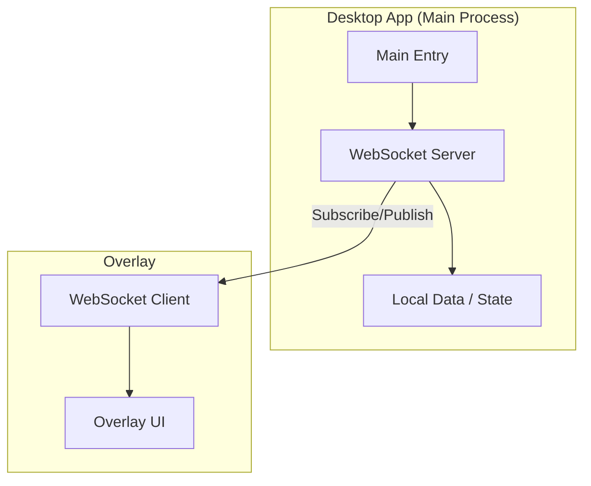
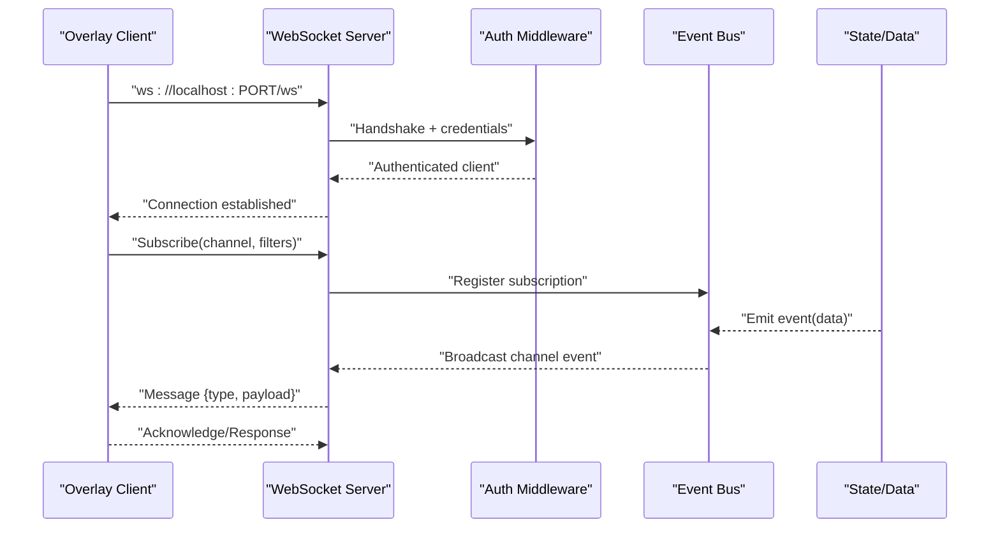
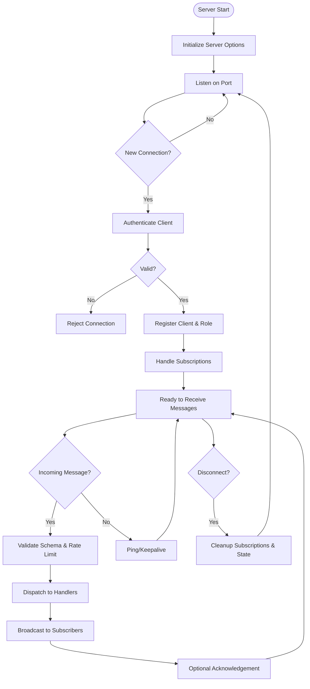
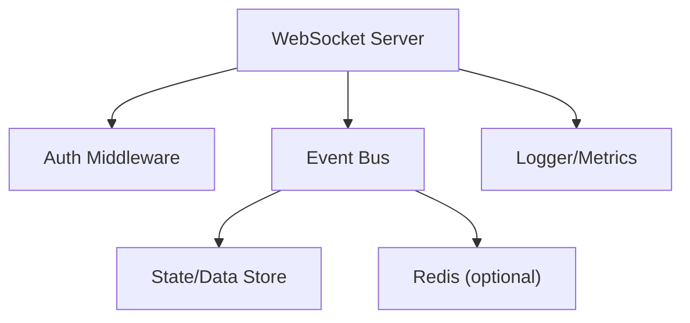

# WebSocket Server

<cite>
**Referenced Files in This Document**
- [websocket.ts](file://apps/desktop/src/main/websocket.ts)
- [index.ts](file://apps/desktop/src/main/index.ts)
- [overlay page.tsx](file://apps/overlay/src/app/overlay/page.tsx)
- [desktop package.json](file://apps/desktop/package.json)
- [overlay package.json](file://apps/overlay/package.json)
</cite>

## Table of Contents
1. [Introduction](#introduction)
2. [Project Structure](#project-structure)
3. [Core Components](#core-components)
4. [Architecture Overview](#architecture-overview)
5. [Detailed Component Analysis](#detailed-component-analysis)
6. [Dependency Analysis](#dependency-analysis)
7. [Performance Considerations](#performance-considerations)
8. [Troubleshooting Guide](#troubleshooting-guide)
9. [Conclusion](#conclusion)

## Introduction
This document explains the WebSocket server implementation used by the AR Sports desktop application to enable real-time communication between the desktop app and overlay systems. It covers connection management, event broadcasting, message protocol design, authentication, error recovery, connection pooling, scaling strategies, security considerations, rate limiting, and performance optimization for high-frequency updates.

## Project Structure
The WebSocket server is implemented in the desktop app’s main process and communicates with the overlay via WebSocket connections. The overlay subscribes to events and renders live updates based on messages received from the desktop server.

[No sources needed since this diagram shows conceptual workflow, not actual code structure]

**Section sources**
- [websocket.ts](file://apps/desktop/src/main/websocket.ts)
- [index.ts](file://apps/desktop/src/main/index.ts)
- [overlay page.tsx](file://apps/overlay/src/app/overlay/page.tsx)

## Core Components
- WebSocket server instance managing connections and rooms/channels
- Connection lifecycle handlers (connect, message, close, error)
- Event bus for internal messaging and broadcasting
- Message serializer/deserializer for consistent payloads
- Authentication middleware for secure client registration
- Rate limiter and throttling utilities for high-frequency updates
- Error handling and reconnection logic

Key responsibilities:
- Accept and validate incoming WebSocket connections
- Maintain active connection registry and per-client state
- Broadcast events to targeted clients or groups
- Persist and recover connection state when possible
- Enforce rate limits and message size constraints
- Provide health checks and metrics hooks

**Section sources**
- [websocket.ts](file://apps/desktop/src/main/websocket.ts)
- [index.ts](file://apps/desktop/src/main/index.ts)

## Architecture Overview
The desktop app runs a local WebSocket server that the overlay connects to over localhost. The server authenticates clients, assigns roles (e.g., overlay, admin), and routes messages accordingly. Events are published to channels; subscribers receive only relevant updates.

**Diagram sources**
- [websocket.ts](file://apps/desktop/src/main/websocket.ts)
- [index.ts](file://apps/desktop/src/main/index.ts)
- [overlay page.tsx](file://apps/overlay/src/app/overlay/page.tsx)

## Detailed Component Analysis

### WebSocket Server Lifecycle
- Initialization: create server, bind to port, configure options (ping interval, max payload, compression)
- Connection handling: accept handshake, authenticate, assign client ID, set role, store metadata
- Subscription model: channels/topics, filters, QoS hints
- Broadcasting: fan-out to subscribers, deduplicate, batch where appropriate
- Cleanup: handle disconnects, remove subscriptions, release resources

**Diagram sources**
- [websocket.ts](file://apps/desktop/src/main/websocket.ts)
- [index.ts](file://apps/desktop/src/main/index.ts)

**Section sources**
- [websocket.ts](file://apps/desktop/src/main/websocket.ts)
- [index.ts](file://apps/desktop/src/main/index.ts)

### Message Protocol and Event Types
- Transport: JSON over WebSocket
- Base envelope:
  - type: string event name
  - id: unique message id
  - ts: timestamp
  - payload: object specific to event
- Common events:
  - match.update: match state changes
  - team.score: score updates
  - overlay.render: rendering instructions
  - system.health: heartbeat/health check
  - auth.request/auth.response: authentication flow
- Optional fields:
  - ack: boolean to request acknowledgement
  - retry: number of retries allowed
  - ttl: time-to-live for transient events

Best practices:
- Use stable event names and versioned payloads
- Validate all incoming messages against schemas
- Include correlation ids for request/response pairing
- Avoid large payloads; prefer incremental updates

**Section sources**
- [websocket.ts](file://apps/desktop/src/main/websocket.ts)
- [overlay page.tsx](file://apps/overlay/src/app/overlay/page.tsx)

### Client Connection Handling and Authentication
- Localhost-only binding recommended for desktop-to-overlay communication
- Token-based or session-based authentication at connect time
- Role assignment: overlay, admin, viewer
- Per-client rate limits and quotas
- Reconnection support with exponential backoff and jitter

Security considerations:
- Restrict origin and host headers
- Validate client capabilities and permissions
- Sanitize and limit payload sizes
- Log connection events without sensitive data

**Section sources**
- [websocket.ts](file://apps/desktop/src/main/websocket.ts)
- [index.ts](file://apps/desktop/src/main/index.ts)

### Event Broadcasting and Channels
- Channel model: topic-based routing with optional filters
- Subscriber management: add/remove, filter expressions, priority
- Delivery guarantees: at-least-once with acknowledgements where needed
- Batching and coalescing for high-frequency updates
- Dead-lettering for failed deliveries

Scaling strategies:
- In-process event bus for single-desktop deployments
- Horizontal scaling across multiple desktop instances using a broker (Redis Pub/Sub)
- Partition channels by match/team to reduce contention

**Section sources**
- [websocket.ts](file://apps/desktop/src/main/websocket.ts)

### Error Recovery and Disconnection Handling
- Detect network errors and client timeouts
- Graceful degradation: cache last known state, replay on reconnect
- Retry policies with backoff and jitter
- Idempotent operations to avoid duplicate effects
- Health checks and liveness probes

Operational tips:
- Track per-client latency and drop rates
- Alert on abnormal disconnection spikes
- Provide manual reconnect triggers in UI

**Section sources**
- [websocket.ts](file://apps/desktop/src/main/websocket.ts)

### Custom Events Implementation
Steps to implement custom events:
- Define event schema and validation rules
- Emit event from source component with required fields
- Subscribe overlay clients to the new channel/topic
- Handle event in overlay renderer and update UI
- Add tests for serialization, validation, and round-trip

Example pattern:
- Source emits event -> Server validates -> Bus broadcasts -> Overlay receives -> UI updates

**Section sources**
- [websocket.ts](file://apps/desktop/src/main/websocket.ts)
- [overlay page.tsx](file://apps/overlay/src/app/overlay/page.tsx)

### Connection Pooling Strategies
- Maintain a pool of reusable connections per overlay instance
- Pre-warm connections during startup
- Rotate connections periodically to mitigate memory leaks
- Monitor pool metrics: active, idle, queue length, error rate

When to use pooling:
- Multiple overlay windows or components
- High-throughput scenarios requiring low-latency handshakes

**Section sources**
- [websocket.ts](file://apps/desktop/src/main/websocket.ts)

## Dependency Analysis
The WebSocket server depends on:
- Node.js net/http modules for transport
- Serialization/validation libraries for payloads
- Optional Redis for cross-process/pub-sub scaling
- Logging and metrics libraries for observability

**Diagram sources**
- [websocket.ts](file://apps/desktop/src/main/websocket.ts)
- [index.ts](file://apps/desktop/src/main/index.ts)

**Section sources**
- [websocket.ts](file://apps/desktop/src/main/websocket.ts)
- [index.ts](file://apps/desktop/src/main/index.ts)

## Performance Considerations
- Minimize payload size: send deltas, compress if needed
- Batch updates: aggregate frequent events into bursts
- Throttle high-frequency streams: adaptive rate limiting
- Use efficient serialization: avoid unnecessary conversions
- Offload heavy processing: worker threads or separate processes
- Monitor CPU, memory, and network usage; tune buffer sizes

Optimization checklist:
- Profile hot paths in message handlers
- Reduce synchronous blocking operations
- Prefer streaming for large payloads
- Cache frequently accessed data near the server

[No sources needed since this section provides general guidance]

## Troubleshooting Guide
Common issues and resolutions:
- Connection refused: verify port availability and firewall settings
- Authentication failures: inspect token validity and permissions
- Message drops: check rate limits and subscriber capacity
- High latency: analyze network path and server load
- Memory growth: review connection cleanup and subscription leaks

Debugging steps:
- Enable verbose logging for WebSocket frames
- Inspect client-side logs and reconnection attempts
- Use health endpoints to verify server status
- Replay captured traffic to reproduce issues

**Section sources**
- [websocket.ts](file://apps/desktop/src/main/websocket.ts)
- [index.ts](file://apps/desktop/src/main/index.ts)

## Conclusion
The WebSocket server in the AR Sports desktop application provides robust real-time communication between the desktop app and overlay systems. By following the outlined architecture, protocol design, and operational practices, teams can build scalable, secure, and performant live update pipelines. Adopting batching, throttling, and proper error recovery ensures smooth user experiences even under high-frequency update loads.

[No sources needed since this section summarizes without analyzing specific files]