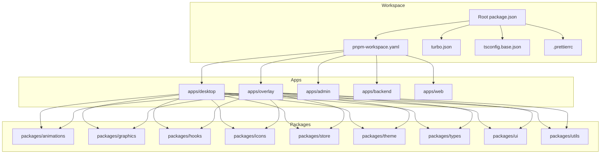
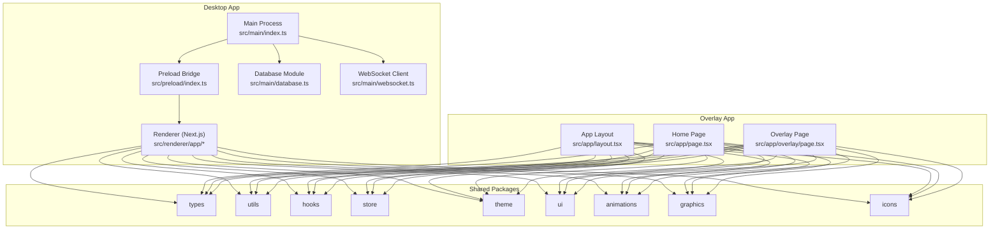
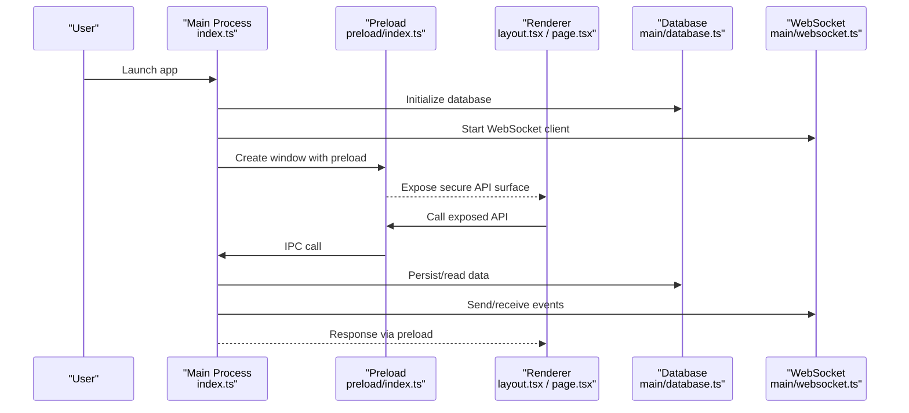
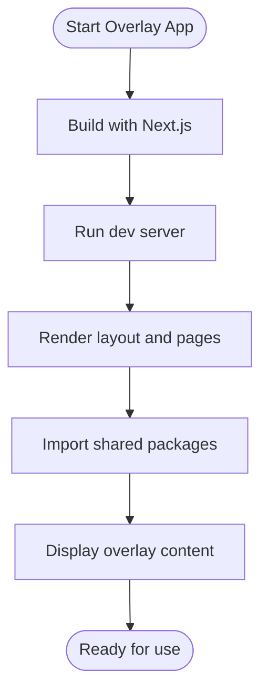
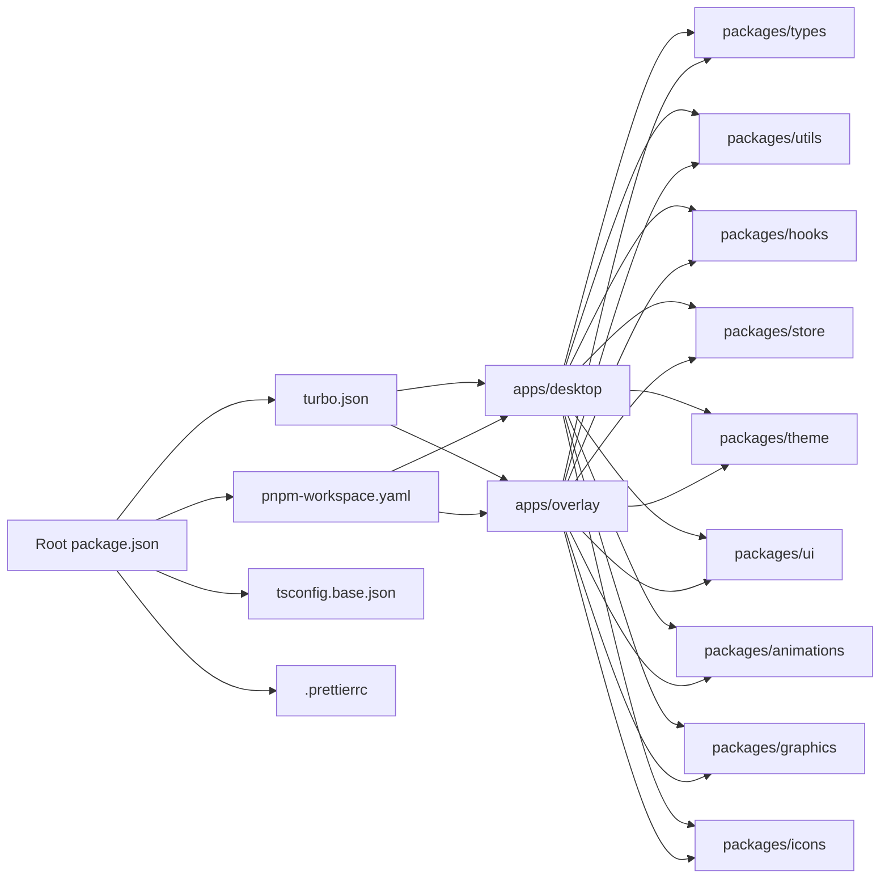

# Development Guide

<cite>
**Referenced Files in This Document**
- [package.json](file://package.json)
- [pnpm-workspace.yaml](file://pnpm-workspace.yaml)
- [turbo.json](file://turbo.json)
- [tsconfig.base.json](file://tsconfig.base.json)
- [.prettierrc](file://.prettierrc)
- [apps/desktop/package.json](file://apps/desktop/package.json)
- [apps/desktop/tsconfig.json](file://apps/desktop/tsconfig.json)
- [apps/desktop/next.config.js](file://apps/desktop/next.config.js)
- [apps/desktop/postcss.config.js](file://apps/desktop/postcss.config.js)
- [apps/desktop/tailwind.config.js](file://apps/desktop/tailwind.config.js)
- [apps/desktop/src/main/index.ts](file://apps/desktop/src/main/index.ts)
- [apps/desktop/src/preload/index.ts](file://apps/desktop/src/preload/index.ts)
- [apps/desktop/src/renderer/app/layout.tsx](file://apps/desktop/src/renderer/app/layout.tsx)
- [apps/desktop/src/renderer/app/page.tsx](file://apps/desktop/src/renderer/app/page.tsx)
- [apps/desktop/src/main/database.ts](file://apps/desktop/src/main/database.ts)
- [apps/desktop/src/main/websocket.ts](file://apps/desktop/src/main/websocket.ts)
- [apps/overlay/package.json](file://apps/overlay/package.json)
- [apps/overlay/tsconfig.json](file://apps/overlay/tsconfig.json)
- [apps/overlay/next.config.js](file://apps/overlay/next.config.js)
- [apps/overlay/postcss.config.js](file://apps/overlay/postcss.config.js)
- [apps/overlay/tailwind.config.js](file://apps/overlay/tailwind.config.js)
- [apps/overlay/src/app/layout.tsx](file://apps/overlay/src/app/layout.tsx)
- [apps/overlay/src/app/page.tsx](file://apps/overlay/src/app/page.tsx)
- [apps/overlay/src/app/overlay/page.tsx](file://apps/overlay/src/app/overlay/page.tsx)
</cite>

## Table of Contents
1. Introduction
2. Project Structure
3. Core Components
4. Architecture Overview
5. Detailed Component Analysis
6. Dependency Analysis
7. Performance Considerations
8. Troubleshooting Guide
9. Conclusion
10. Appendices

## Introduction
This guide provides a comprehensive development workflow for the AR Sports monorepo. It covers workspace setup with pnpm, package and dependency management, build pipeline using Turborepo, TypeScript configuration, Prettier coding standards, and best practices for organizing code across shared packages and applications. It also includes guidance on debugging across multiple apps, testing strategies for shared packages, Git workflows, branching and release processes, adding new packages and applications, integrating third-party libraries, and performance optimization techniques for both desktop and web targets.

## Project Structure
The repository is organized as a pnpm workspace with two top-level directories:
- apps: Application targets (desktop, overlay, admin, backend, web). Each app is an independent Next.js-based application or Electron-based desktop app.
- packages: Shared libraries (animations, graphics, hooks, icons, store, theme, types, ui, utils).

Key root configuration files:
- pnpm-workspace.yaml: Declares workspace packages and apps.
- turbo.json: Defines tasks, caching, and parallelization for builds and scripts.
- tsconfig.base.json: Base TypeScript settings shared by all projects.
- .prettierrc: Formatting rules enforced across the repo.
- package.json: Root scripts and workspace metadata.

**Diagram sources**
- [package.json](file://package.json)
- [pnpm-workspace.yaml](file://pnpm-workspace.yaml)
- [turbo.json](file://turbo.json)
- [tsconfig.base.json](file://tsconfig.base.json)
- [.prettierrc](file://.prettierrc)
- [apps/desktop/package.json](file://apps/desktop/package.json)
- [apps/overlay/package.json](file://apps/overlay/package.json)

**Section sources**
- [package.json](file://package.json)
- [pnpm-workspace.yaml](file://pnpm-workspace.yaml)
- [turbo.json](file://turbo.json)
- [tsconfig.base.json](file://tsconfig.base.json)
- [.prettierrc](file://.prettierrc)

## Core Components
- Workspace manager: pnpm enforces strict dependency hoisting and link resolution across apps and packages.
- Task runner: Turborepo orchestrates build, lint, test, and dev tasks with caching and parallel execution.
- TypeScript: Shared base config ensures consistent compiler options; each project can extend it.
- Code style: Prettier standardizes formatting across the entire workspace.
- Applications:
  - Desktop app: Electron + Next.js renderer, preload bridge, main process utilities (database, websocket).
  - Overlay app: Standalone Next.js app for overlay rendering.
- Shared packages: UI primitives, animations, graphics, hooks, store, theme, types, and utilities.

**Section sources**
- [pnpm-workspace.yaml](file://pnpm-workspace.yaml)
- [turbo.json](file://turbo.json)
- [tsconfig.base.json](file://tsconfig.base.json)
- [.prettierrc](file://.prettierrc)
- [apps/desktop/package.json](file://apps/desktop/package.json)
- [apps/overlay/package.json](file://apps/overlay/package.json)

## Architecture Overview
High-level architecture:
- The root orchestrates workspace and task definitions.
- Apps depend on shared packages for UI, state, and domain logic.
- Desktop app uses Electron main process to manage native features and IPC via a preload script.
- Overlay app runs independently and communicates with other components through network or IPC depending on deployment.

**Diagram sources**
- [apps/desktop/src/main/index.ts](file://apps/desktop/src/main/index.ts)
- [apps/desktop/src/preload/index.ts](file://apps/desktop/src/preload/index.ts)
- [apps/desktop/src/renderer/app/layout.tsx](file://apps/desktop/src/renderer/app/layout.tsx)
- [apps/desktop/src/renderer/app/page.tsx](file://apps/desktop/src/renderer/app/page.tsx)
- [apps/desktop/src/main/database.ts](file://apps/desktop/src/main/database.ts)
- [apps/desktop/src/main/websocket.ts](file://apps/desktop/src/main/websocket.ts)
- [apps/overlay/src/app/layout.tsx](file://apps/overlay/src/app/layout.tsx)
- [apps/overlay/src/app/page.tsx](file://apps/overlay/src/app/page.tsx)
- [apps/overlay/src/app/overlay/page.tsx](file://apps/overlay/src/app/overlay/page.tsx)

## Detailed Component Analysis

### Desktop App (Electron + Next.js)
Responsibilities:
- Main process initializes the Electron window and manages native resources.
- Preload script exposes safe APIs to the renderer via contextBridge.
- Renderer is a Next.js app that consumes shared packages for UI and business logic.
- Database and WebSocket modules provide persistence and real-time communication.

**Diagram sources**
- [apps/desktop/src/main/index.ts](file://apps/desktop/src/main/index.ts)
- [apps/desktop/src/preload/index.ts](file://apps/desktop/src/preload/index.ts)
- [apps/desktop/src/renderer/app/layout.tsx](file://apps/desktop/src/renderer/app/layout.tsx)
- [apps/desktop/src/renderer/app/page.tsx](file://apps/desktop/src/renderer/app/page.tsx)
- [apps/desktop/src/main/database.ts](file://apps/desktop/src/main/database.ts)
- [apps/desktop/src/main/websocket.ts](file://apps/desktop/src/main/websocket.ts)

**Section sources**
- [apps/desktop/package.json](file://apps/desktop/package.json)
- [apps/desktop/tsconfig.json](file://apps/desktop/tsconfig.json)
- [apps/desktop/next.config.js](file://apps/desktop/next.config.js)
- [apps/desktop/postcss.config.js](file://apps/desktop/postcss.config.js)
- [apps/desktop/tailwind.config.js](file://apps/desktop/tailwind.config.js)
- [apps/desktop/src/main/index.ts](file://apps/desktop/src/main/index.ts)
- [apps/desktop/src/preload/index.ts](file://apps/desktop/src/preload/index.ts)
- [apps/desktop/src/renderer/app/layout.tsx](file://apps/desktop/src/renderer/app/layout.tsx)
- [apps/desktop/src/renderer/app/page.tsx](file://apps/desktop/src/renderer/app/page.tsx)
- [apps/desktop/src/main/database.ts](file://apps/desktop/src/main/database.ts)
- [apps/desktop/src/main/websocket.ts](file://apps/desktop/src/main/websocket.ts)

### Overlay App (Next.js)
Responsibilities:
- Provides a lightweight overlay interface for display purposes.
- Uses shared packages for UI, animations, and state.
- Configured with Tailwind and PostCSS similar to other apps.

**Diagram sources**
- [apps/overlay/package.json](file://apps/overlay/package.json)
- [apps/overlay/tsconfig.json](file://apps/overlay/tsconfig.json)
- [apps/overlay/next.config.js](file://apps/overlay/next.config.js)
- [apps/overlay/postcss.config.js](file://apps/overlay/postcss.config.js)
- [apps/overlay/tailwind.config.js](file://apps/overlay/tailwind.config.js)
- [apps/overlay/src/app/layout.tsx](file://apps/overlay/src/app/layout.tsx)
- [apps/overlay/src/app/page.tsx](file://apps/overlay/src/app/page.tsx)
- [apps/overlay/src/app/overlay/page.tsx](file://apps/overlay/src/app/overlay/page.tsx)

**Section sources**
- [apps/overlay/package.json](file://apps/overlay/package.json)
- [apps/overlay/tsconfig.json](file://apps/overlay/tsconfig.json)
- [apps/overlay/next.config.js](file://apps/overlay/next.config.js)
- [apps/overlay/postcss.config.js](file://apps/overlay/postcss.config.js)
- [apps/overlay/tailwind.config.js](file://apps/overlay/tailwind.config.js)
- [apps/overlay/src/app/layout.tsx](file://apps/overlay/src/app/layout.tsx)
- [apps/overlay/src/app/page.tsx](file://apps/overlay/src/app/page.tsx)
- [apps/overlay/src/app/overlay/page.tsx](file://apps/overlay/src/app/overlay/page.tsx)

### Shared Packages Organization
Guidelines:
- Keep packages focused and small (single responsibility).
- Prefer explicit exports and stable public APIs.
- Use shared types from packages/types to ensure consistency.
- Centralize UI components in packages/ui and reuse across apps.
- Encapsulate animations and graphics in dedicated packages to avoid coupling.

Best practices:
- Version packages carefully and document breaking changes.
- Provide minimal examples in READMEs within each package.
- Avoid importing apps into packages to maintain unidirectional dependencies.

[No sources needed since this section doesn't analyze specific files]

## Dependency Analysis
- Workspace linking: pnpm resolves local packages automatically based on workspace declarations.
- Turborepo tasks: Define build, dev, lint, and test tasks at the root and per-package to enable caching and parallel execution.
- Cross-app dependencies: Apps import from packages; packages must not depend on apps.

**Diagram sources**
- [package.json](file://package.json)
- [turbo.json](file://turbo.json)
- [pnpm-workspace.yaml](file://pnpm-workworkspace.yaml)
- [tsconfig.base.json](file://tsconfig.base.json)
- [.prettierrc](file://.prettierrc)
- [apps/desktop/package.json](file://apps/desktop/package.json)
- [apps/overlay/package.json](file://apps/overlay/package.json)

**Section sources**
- [package.json](file://package.json)
- [turbo.json](file://turbo.json)
- [pnpm-workspace.yaml](file://pnpm-workspace.yaml)
- [tsconfig.base.json](file://tsconfig.base.json)
- [.prettierrc](file://.prettierrc)

## Performance Considerations
General recommendations:
- Enable Turborepo caching to speed up repeated builds and tests.
- Use tree-shaking-friendly imports in shared packages; prefer named exports.
- Minimize bundle size by lazy-loading heavy components and routes.
- Profile memory usage in Electron main and renderer processes; avoid long-lived references to large objects.
- For web overlays, leverage static generation where possible and minimize runtime overhead.
- Use efficient data structures in shared packages and avoid unnecessary re-renders in React components.

[No sources needed since this section provides general guidance]

## Troubleshooting Guide
Common issues and resolutions:
- Workspace linking errors: Ensure pnpm-workspace.yaml includes all apps and packages; run install again after adding new entries.
- Turborepo cache misses: Clear cache if necessary and verify task definitions in turbo.json.
- TypeScript path resolution: Confirm tsconfig.base.json and per-project tsconfig.json extend the base correctly.
- Prettier formatting conflicts: Run formatter across the workspace and commit standardized files.
- Electron IPC failures: Validate preload exposure and ensure main process handlers are registered before IPC calls.
- Overlay networking: Check CORS and port bindings when overlay communicates with other services.

**Section sources**
- [pnpm-workspace.yaml](file://pnpm-workspace.yaml)
- [turbo.json](file://turbo.json)
- [tsconfig.base.json](file://tsconfig.base.json)
- [.prettierrc](file://.prettierrc)
- [apps/desktop/src/preload/index.ts](file://apps/desktop/src/preload/index.ts)
- [apps/desktop/src/main/index.ts](file://apps/desktop/src/main/index.ts)

## Conclusion
This guide outlines the structure, conventions, and workflows for developing within the AR Sports monorepo. By leveraging pnpm workspaces, Turborepo, shared packages, and consistent TypeScript and Prettier configurations, teams can collaborate efficiently, maintain high code quality, and deliver performant desktop and web experiences. Follow the recommended patterns for debugging, testing, and performance optimization to keep the system robust and scalable.

[No sources needed since this section summarizes without analyzing specific files]

## Appendices

### Workspace Setup and Development Workflow
- Install dependencies: Use pnpm at the repository root to install all workspace packages.
- Run tasks: Use Turborepo commands to build, lint, test, and start dev servers across apps and packages.
- Local development: Start individual apps with their respective dev scripts; Turborepo will handle dependency graph and caching.

**Section sources**
- [package.json](file://package.json)
- [turbo.json](file://turbo.json)
- [pnpm-workspace.yaml](file://pnpm-workspace.yaml)

### Adding a New Package
Steps:
- Create a new directory under packages with a focused purpose.
- Add a package.json defining exports and dependencies.
- Extend tsconfig.base.json if needed and create a project-specific tsconfig.json.
- Reference the package from apps or other packages using workspace protocol.
- Add tasks in turbo.json if the package has build or test steps.

**Section sources**
- [turbo.json](file://turbo.json)
- [tsconfig.base.json](file://tsconfig.base.json)
- [pnpm-workspace.yaml](file://pnpm-workspace.yaml)

### Creating a New Application
Steps:
- Create a new directory under apps.
- Add package.json with app-specific scripts and dependencies.
- Configure Next.js, Tailwind, and PostCSS as seen in existing apps.
- Set up tsconfig.json extending the base configuration.
- Register the app in pnpm-workspace.yaml and add tasks in turbo.json.

**Section sources**
- [apps/desktop/package.json](file://apps/desktop/package.json)
- [apps/desktop/tsconfig.json](file://apps/desktop/tsconfig.json)
- [apps/desktop/next.config.js](file://apps/desktop/next.config.js)
- [apps/desktop/postcss.config.js](file://apps/desktop/postcss.config.js)
- [apps/desktop/tailwind.config.js](file://apps/desktop/tailwind.config.js)
- [apps/overlay/package.json](file://apps/overlay/package.json)
- [apps/overlay/tsconfig.json](file://apps/overlay/tsconfig.json)
- [apps/overlay/next.config.js](file://apps/overlay/next.config.js)
- [apps/overlay/postcss.config.js](file://apps/overlay/postcss.config.js)
- [apps/overlay/tailwind.config.js](file://apps/overlay/tailwind.config.js)

### Integrating Third-Party Libraries
Guidelines:
- Prefer installing dependencies at the app level unless the library is truly shared.
- For shared libraries, publish them to packages and consume via workspace links.
- Ensure compatibility with TypeScript and bundler configurations.
- Document integration steps and required environment variables in package READMEs.

[No sources needed since this section provides general guidance]

### Debugging Across Multiple Applications
Recommendations:
- Use separate terminals or Turborepo pipelines to run multiple apps concurrently.
- For Electron, attach Chrome DevTools to the renderer and inspect main process logs.
- Leverage logging utilities in shared packages to trace data flow.
- Use browser/network tools for overlay app debugging and API interactions.

**Section sources**
- [apps/desktop/src/main/index.ts](file://apps/desktop/src/main/index.ts)
- [apps/desktop/src/preload/index.ts](file://apps/desktop/src/preload/index.ts)
- [apps/overlay/src/app/layout.tsx](file://apps/overlay/src/app/layout.tsx)

### Testing Strategies for Shared Packages
Approach:
- Write unit tests for pure functions and utilities in packages.
- Use component testing for UI primitives to ensure visual stability.
- Mock external dependencies and isolate tests for reproducibility.
- Integrate tests into Turborepo tasks to run consistently across the workspace.

[No sources needed since this section provides general guidance]

### Git Workflow, Branching, and Releases
Practices:
- Use feature branches for new functionality and bug fixes.
- Maintain a main branch protected with CI checks (lint, type-check, tests).
- Tag releases for packages and apps; document changelogs and migration notes.
- Coordinate versioning across packages to avoid breaking changes.

[No sources needed since this section provides general guidance]