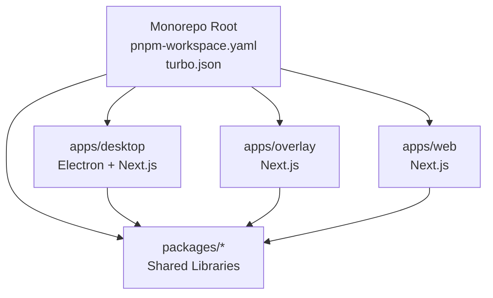
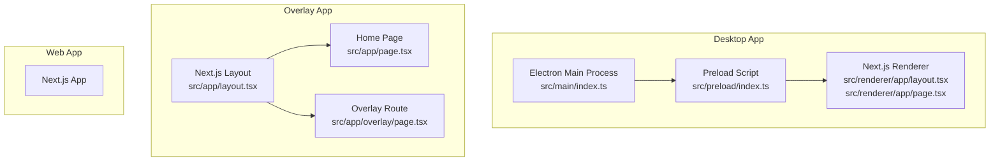
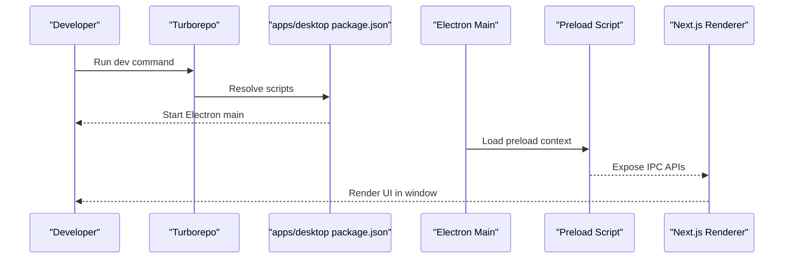
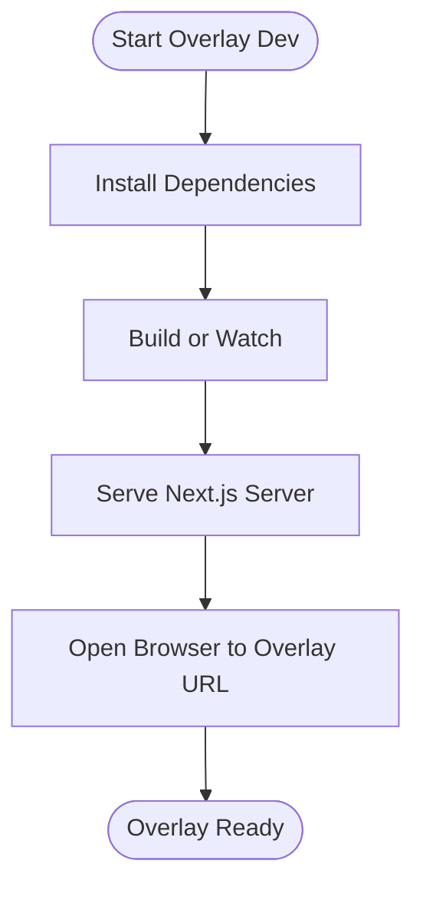
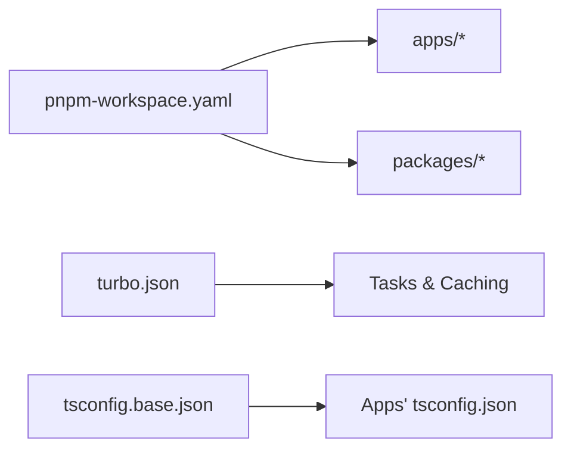

# Getting Started

<cite>
**Referenced Files in This Document**
- [package.json](file://package.json)
- [pnpm-workspace.yaml](file://pnpm-workspace.yaml)
- [turbo.json](file://turbo.json)
- [tsconfig.base.json](file://tsconfig.base.json)
- [apps/desktop/package.json](file://apps/desktop/package.json)
- [apps/desktop/next.config.js](file://apps/desktop/next.config.js)
- [apps/desktop/tailwind.config.js](file://apps/desktop/tailwind.config.js)
- [apps/desktop/postcss.config.js](file://apps/desktop/postcss.config.js)
- [apps/desktop/tsconfig.json](file://apps/desktop/tsconfig.json)
- [apps/desktop/src/main/index.ts](file://apps/desktop/src/main/index.ts)
- [apps/desktop/src/preload/index.ts](file://apps/desktop/src/preload/index.ts)
- [apps/desktop/src/renderer/app/layout.tsx](file://apps/desktop/src/renderer/app/layout.tsx)
- [apps/desktop/src/renderer/app/page.tsx](file://apps/desktop/src/renderer/app/page.tsx)
- [apps/overlay/package.json](file://apps/overlay/package.json)
- [apps/overlay/next.config.js](file://apps/overlay/next.config.js)
- [apps/overlay/tailwind.config.js](file://apps/overlay/tailwind.config.js)
- [apps/overlay/postcss.config.js](file://apps/overlay/postcss.config.js)
- [apps/overlay/tsconfig.json](file://apps/overlay/tsconfig.json)
- [apps/overlay/src/app/layout.tsx](file://apps/overlay/src/app/layout.tsx)
- [apps/overlay/src/app/page.tsx](file://apps/overlay/src/app/page.tsx)
- [apps/overlay/src/app/overlay/page.tsx](file://apps/overlay/src/app/overlay/page.tsx)
</cite>

## Table of Contents
1. Introduction
2. Project Structure
3. Core Components
4. Architecture Overview
5. Detailed Component Analysis
6. Dependency Analysis
7. Performance Considerations
8. Troubleshooting Guide
9. Conclusion

## Introduction
This guide helps you set up and run AR Sports locally. You will learn the monorepo structure, installation requirements, development environment setup, and how to run the desktop application, overlay renderer, and web interfaces. It also covers common workflows with Turborepo and pnpm, debugging techniques, and platform-specific considerations for Windows, macOS, and Linux.

## Project Structure
AR Sports is a monorepo managed by pnpm workspaces and Turborepo. The top-level configuration defines shared tooling and workspace packages, while apps contain the runnable products:
- apps/desktop: Electron-based desktop app using Next.js for the renderer process
- apps/overlay: Standalone overlay renderer (Next.js)
- apps/web: Web interface (Next.js)
- packages: Shared libraries (animations, graphics, hooks, icons, store, theme, types, ui, utils)

**Diagram sources**
- [pnpm-workspace.yaml](file://pnpm-workspace.yaml)
- [turbo.json](file://turbo.json)
- [apps/desktop/package.json](file://apps/desktop/package.json)
- [apps/overlay/package.json](file://apps/overlay/package.json)

**Section sources**
- [pnpm-workspace.yaml](file://pnpm-workspace.yaml)
- [turbo.json](file://turbo.json)
- [package.json](file://package.json)

## Core Components
- Desktop App (Electron + Next.js): Combines an Electron main process with a Next.js renderer. Configuration files include Next.js, Tailwind CSS, PostCSS, and TypeScript settings.
- Overlay Renderer: A lightweight Next.js app designed to render overlays.
- Web Interface: A standard Next.js web app.
- Shared Packages: Reusable UI, animations, graphics, hooks, store, theme, types, and utilities consumed by apps.

Key technology stack:
- Electron for the desktop shell
- Next.js for React-based UIs
- TypeScript for type safety
- Tailwind CSS for styling
- pnpm workspaces for dependency management
- Turborepo for task orchestration and caching

**Section sources**
- [apps/desktop/package.json](file://apps/desktop/package.json)
- [apps/desktop/next.config.js](file://apps/desktop/next.config.js)
- [apps/desktop/tailwind.config.js](file://apps/desktop/tailwind.config.js)
- [apps/desktop/postcss.config.js](file://apps/desktop/postcss.config.js)
- [apps/desktop/tsconfig.json](file://apps/desktop/tsconfig.json)
- [apps/overlay/package.json](file://apps/overlay/package.json)
- [apps/overlay/next.config.js](file://apps/overlay/next.config.js)
- [apps/overlay/tailwind.config.js](file://apps/overlay/tailwind.config.js)
- [apps/overlay/postcss.config.js](file://apps/overlay/postcss.config.js)
- [apps/overlay/tsconfig.json](file://apps/overlay/tsconfig.json)
- [tsconfig.base.json](file://tsconfig.base.json)

## Architecture Overview
The desktop app uses Electron’s main process to launch a browser window that renders the Next.js app. The overlay and web apps are independent Next.js applications that can be developed and run separately.

**Diagram sources**
- [apps/desktop/src/main/index.ts](file://apps/desktop/src/main/index.ts)
- [apps/desktop/src/preload/index.ts](file://apps/desktop/src/preload/index.ts)
- [apps/desktop/src/renderer/app/layout.tsx](file://apps/desktop/src/renderer/app/layout.tsx)
- [apps/desktop/src/renderer/app/page.tsx](file://apps/desktop/src/renderer/app/page.tsx)
- [apps/overlay/src/app/layout.tsx](file://apps/overlay/src/app/layout.tsx)
- [apps/overlay/src/app/page.tsx](file://apps/overlay/src/app/page.tsx)
- [apps/overlay/src/app/overlay/page.tsx](file://apps/overlay/src/app/overlay/page.tsx)

## Detailed Component Analysis

### Desktop Application Setup and Run
- Purpose: Provides the Electron shell and hosts the Next.js renderer.
- Key configuration:
  - Next.js config for the renderer
  - Tailwind and PostCSS configs for styling
  - TypeScript config extending base TS settings
- Entry points:
  - Electron main process entry
  - Preload script for secure IPC bridge
  - Next.js pages for the renderer UI

**Diagram sources**
- [apps/desktop/package.json](file://apps/desktop/package.json)
- [apps/desktop/src/main/index.ts](file://apps/desktop/src/main/index.ts)
- [apps/desktop/src/preload/index.ts](file://apps/desktop/src/preload/index.ts)
- [apps/desktop/src/renderer/app/layout.tsx](file://apps/desktop/src/renderer/app/layout.tsx)
- [apps/desktop/src/renderer/app/page.tsx](file://apps/desktop/src/renderer/app/page.tsx)

**Section sources**
- [apps/desktop/package.json](file://apps/desktop/package.json)
- [apps/desktop/next.config.js](file://apps/desktop/next.config.js)
- [apps/desktop/tailwind.config.js](file://apps/desktop/tailwind.config.js)
- [apps/desktop/postcss.config.js](file://apps/desktop/postcss.config.js)
- [apps/desktop/tsconfig.json](file://apps/desktop/tsconfig.json)
- [apps/desktop/src/main/index.ts](file://apps/desktop/src/main/index.ts)
- [apps/desktop/src/preload/index.ts](file://apps/desktop/src/preload/index.ts)
- [apps/desktop/src/renderer/app/layout.tsx](file://apps/desktop/src/renderer/app/layout.tsx)
- [apps/desktop/src/renderer/app/page.tsx](file://apps/desktop/src/renderer/app/page.tsx)

### Overlay Renderer Setup and Run
- Purpose: Renders overlays independently via a Next.js server.
- Key configuration:
  - Next.js, Tailwind, PostCSS, and TypeScript configs
- Pages:
  - Layout and home page
  - Dedicated overlay route

**Diagram sources**
- [apps/overlay/package.json](file://apps/overlay/package.json)
- [apps/overlay/next.config.js](file://apps/overlay/next.config.js)
- [apps/overlay/tailwind.config.js](file://apps/overlay/tailwind.config.js)
- [apps/overlay/postcss.config.js](file://apps/overlay/postcss.config.js)
- [apps/overlay/tsconfig.json](file://apps/overlay/tsconfig.json)
- [apps/overlay/src/app/layout.tsx](file://apps/overlay/src/app/layout.tsx)
- [apps/overlay/src/app/page.tsx](file://apps/overlay/src/app/page.tsx)
- [apps/overlay/src/app/overlay/page.tsx](file://apps/overlay/src/app/overlay/page.tsx)

**Section sources**
- [apps/overlay/package.json](file://apps/overlay/package.json)
- [apps/overlay/next.config.js](file://apps/overlay/next.config.js)
- [apps/overlay/tailwind.config.js](file://apps/overlay/tailwind.config.js)
- [apps/overlay/postcss.config.js](file://apps/overlay/postcss.config.js)
- [apps/overlay/tsconfig.json](file://apps/overlay/tsconfig.json)
- [apps/overlay/src/app/layout.tsx](file://apps/overlay/src/app/layout.tsx)
- [apps/overlay/src/app/page.tsx](file://apps/overlay/src/app/page.tsx)
- [apps/overlay/src/app/overlay/page.tsx](file://apps/overlay/src/app/overlay/page.tsx)

### Web Interface Setup and Run
- Purpose: Standard Next.js web application.
- Development workflow mirrors other Next.js apps in the monorepo.

[No sources needed since this section doesn't analyze specific files]

## Dependency Analysis
- Workspace definition: pnpm-workspace.yaml lists all apps and packages included in the monorepo.
- Task orchestration: turbo.json defines tasks and caching across apps and packages.
- Shared TypeScript configuration: tsconfig.base.json provides base compiler options extended by each app.

**Diagram sources**
- [pnpm-workspace.yaml](file://pnpm-workspace.yaml)
- [turbo.json](file://turbo.json)
- [tsconfig.base.json](file://tsconfig.base.json)

**Section sources**
- [pnpm-workspace.yaml](file://pnpm-workspace.yaml)
- [turbo.json](file://turbo.json)
- [tsconfig.base.json](file://tsconfig.base.json)

## Performance Considerations
- Use Turborepo caching to speed up builds and dev iterations across apps and packages.
- Keep dependencies scoped to where they are used; prefer workspace packages for shared logic.
- For large assets in overlays or desktop renderer, consider code splitting and lazy loading within Next.js.
- Avoid unnecessary rebuilds by running targeted commands per app when possible.

[No sources needed since this section provides general guidance]

## Troubleshooting Guide
- Node.js version mismatch: Ensure your Node.js version matches the project’s requirement defined at the repository root.
- pnpm not installed: Install pnpm globally before running any commands.
- Port conflicts: If the overlay or desktop renderer fails to start, check for existing processes on the same port and stop them.
- Electron build issues on some platforms: Install required system dependencies for your OS as documented by Electron.
- TypeScript errors: Verify that each app’s tsconfig extends the base configuration and that paths are correct.

**Section sources**
- [package.json](file://package.json)
- [apps/desktop/tsconfig.json](file://apps/desktop/tsconfig.json)
- [apps/overlay/tsconfig.json](file://apps/overlay/tsconfig.json)
- [tsconfig.base.json](file://tsconfig.base.json)

## Conclusion
You now have the essentials to set up AR Sports locally, understand its monorepo architecture, and run the desktop app, overlay, and web interfaces. Use pnpm workspaces and Turborepo to streamline development, and follow the troubleshooting tips to resolve common issues quickly.