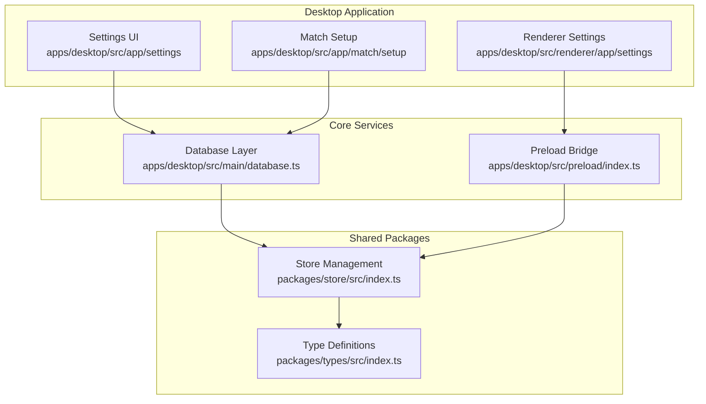
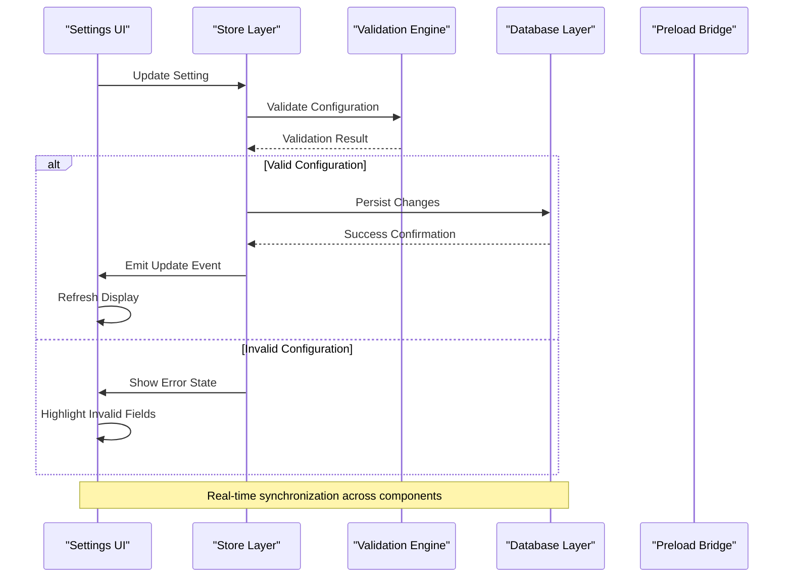
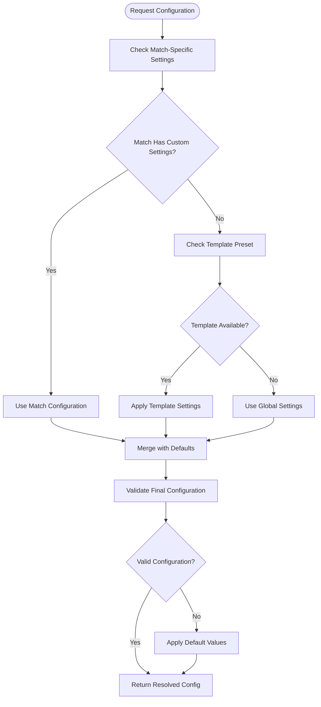
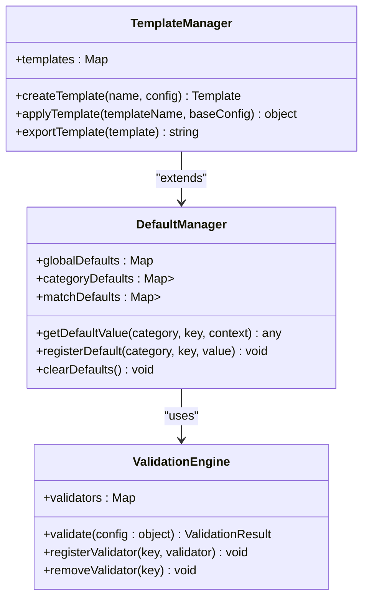
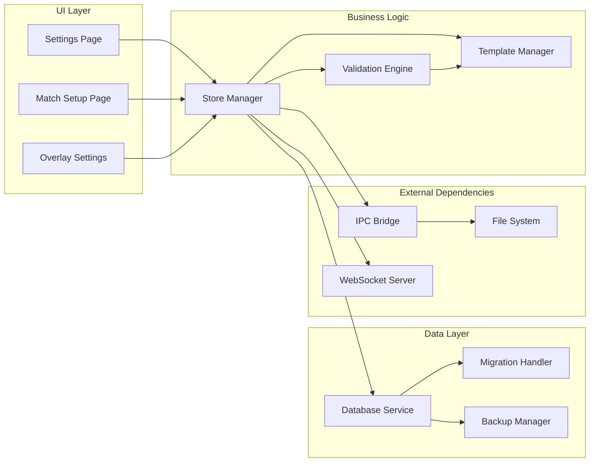

# Match Configuration and Settings

<cite>
**Referenced Files in This Document**
- [apps/desktop/src/app/settings/page.tsx](file://apps/desktop/src/app/settings/page.tsx)
- [apps/desktop/src/renderer/app/settings/page.tsx](file://apps/desktop/src/renderer/app/settings/page.tsx)
- [apps/desktop/src/app/match/setup/page.tsx](file://apps/desktop/src/app/match/setup/page.tsx)
- [apps/desktop/src/main/database.ts](file://apps/desktop/src/main/database.ts)
- [packages/store/src/index.ts](file://packages/store/src/index.ts)
- [packages/types/src/index.ts](file://packages/types/src/index.ts)
- [apps/desktop/src/preload/index.ts](file://apps/desktop/src/preload/index.ts)
</cite>

## Table of Contents
1. [Introduction](#introduction)
2. [Project Structure](#project-structure)
3. [Core Components](#core-components)
4. [Architecture Overview](#architecture-overview)
5. [Detailed Component Analysis](#detailed-component-analysis)
6. [Dependency Analysis](#dependency-analysis)
7. [Performance Considerations](#performance-considerations)
8. [Troubleshooting Guide](#troubleshooting-guide)
9. [Conclusion](#conclusion)
10. [Appendices](#appendices)

## Introduction

This document provides comprehensive documentation for the match configuration and settings management system in AR Sports. The system implements a hierarchical configuration architecture that supports global application settings, match-specific configurations, and template-based presets. It includes robust validation mechanisms, default value management, and configuration export/import functionality to ensure consistency and flexibility across different deployment environments.

The settings system is designed to handle game rules, display preferences, broadcast settings, and notification behaviors while providing an intuitive user interface with search capabilities and integrated help documentation.

## Project Structure

The match configuration and settings system is distributed across multiple layers of the application architecture:

**Diagram sources**
- [apps/desktop/src/app/settings/page.tsx](file://apps/desktop/src/app/settings/page.tsx)
- [apps/desktop/src/app/match/setup/page.tsx](file://apps/desktop/src/app/match/setup/page.tsx)
- [apps/desktop/src/main/database.ts](file://apps/desktop/src/main/database.ts)
- [packages/store/src/index.ts](file://packages/store/src/index.ts)

**Section sources**
- [apps/desktop/src/app/settings/page.tsx](file://apps/desktop/src/app/settings/page.tsx)
- [apps/desktop/src/renderer/app/settings/page.tsx](file://apps/desktop/src/renderer/app/settings/page.tsx)
- [apps/desktop/src/app/match/setup/page.tsx](file://apps/desktop/src/app/match/setup/page.tsx)

## Core Components

### Settings Hierarchy Architecture

The configuration system implements a three-tier hierarchy:

1. **Global Application Settings**: Base configuration applied to all matches
2. **Match-Specific Configurations**: Overrides and customizations for individual matches
3. **Template-Based Presets**: Reusable configuration templates for common scenarios

### Configuration Categories

The system manages several categories of settings:

- **Game Rules**: Scoring systems, time limits, team sizes, and gameplay mechanics
- **Display Preferences**: Visual themes, layout options, and rendering quality
- **Broadcast Settings**: Streaming parameters, overlay configurations, and output formats
- **Notification Behaviors**: Alert types, timing, and delivery methods

### Data Persistence Layer

Configuration data is managed through a centralized database layer that handles:
- Local storage persistence
- Cross-process synchronization
- Version migration support
- Backup and restore functionality

**Section sources**
- [apps/desktop/src/main/database.ts](file://apps/desktop/src/main/database.ts)
- [packages/store/src/index.ts](file://packages/store/src/index.ts)
- [packages/types/src/index.ts](file://packages/types/src/index.ts)

## Architecture Overview

The settings management system follows a layered architecture pattern with clear separation of concerns:

**Diagram sources**
- [apps/desktop/src/app/settings/page.tsx](file://apps/desktop/src/app/settings/page.tsx)
- [packages/store/src/index.ts](file://packages/store/src/index.ts)
- [apps/desktop/src/preload/index.ts](file://apps/desktop/src/preload/index.ts)

### Configuration Resolution Algorithm

The system resolves final configuration values using a priority-based resolution algorithm:

**Diagram sources**
- [packages/store/src/index.ts](file://packages/store/src/index.ts)
- [packages/types/src/index.ts](file://packages/types/src/index.ts)

## Detailed Component Analysis

### Settings Validation System

The validation engine ensures configuration integrity through multiple validation layers:

#### Schema Validation
- Type checking for all configuration properties
- Range validation for numeric values
- Format validation for structured data
- Dependency validation between related settings

#### Business Logic Validation
- Game rule consistency checks
- Performance constraint validation
- Compatibility verification across components

#### User Experience Validation
- Real-time field validation
- Contextual error messages
- Suggested corrections for invalid values

### Default Value Management

The system maintains a comprehensive default value hierarchy:

**Diagram sources**
- [packages/store/src/index.ts](file://packages/store/src/index.ts)
- [packages/types/src/index.ts](file://packages/types/src/index.ts)

### Configuration Export/Import System

The export/import functionality supports multiple formats and includes version compatibility:

#### Supported Formats
- JSON for programmatic access
- YAML for human-readable configuration
- Binary format for optimized storage
- Migration-aware format for version upgrades

#### Import Process
1. Format detection and parsing
2. Schema validation against current version
3. Automatic migration for older versions
4. Conflict resolution for duplicate entries
5. Rollback capability for failed imports

**Section sources**
- [apps/desktop/src/main/database.ts](file://apps/desktop/src/main/database.ts)
- [packages/store/src/index.ts](file://packages/store/src/index.ts)

### User Interface Components

The settings interface provides comprehensive management capabilities:

#### Search and Filtering
- Full-text search across all setting descriptions
- Category-based filtering
- Advanced search with operators
- Saved search queries

#### Help Documentation Integration
- Context-sensitive help tooltips
- Inline documentation panels
- Video tutorials for complex settings
- Link to external documentation resources

#### Batch Operations
- Bulk setting updates
- Configuration comparison tools
- Preview changes before applying
- Undo/redo functionality

**Section sources**
- [apps/desktop/src/app/settings/page.tsx](file://apps/desktop/src/app/settings/page.tsx)
- [apps/desktop/src/renderer/app/settings/page.tsx](file://apps/desktop/src/renderer/app/settings/page.tsx)

## Dependency Analysis

The settings system has well-defined dependencies and clear separation of concerns:

**Diagram sources**
- [apps/desktop/src/app/settings/page.tsx](file://apps/desktop/src/app/settings/page.tsx)
- [packages/store/src/index.ts](file://packages/store/src/index.ts)
- [apps/desktop/src/main/database.ts](file://apps/desktop/src/main/database.ts)

### Circular Dependency Prevention

The architecture prevents circular dependencies through:
- Clear interface boundaries between layers
- Event-driven communication patterns
- Dependency injection for testability
- Modular package structure

**Section sources**
- [packages/store/src/index.ts](file://packages/store/src/index.ts)
- [apps/desktop/src/preload/index.ts](file://apps/desktop/src/preload/index.ts)

## Performance Considerations

### Configuration Loading Optimization
- Lazy loading of configuration sections
- Caching of frequently accessed settings
- Background loading of large configuration files
- Incremental updates instead of full reloads

### Memory Management
- Efficient data structures for large configuration sets
- Garbage collection optimization for temporary objects
- Memory leak prevention in long-running processes
- Resource cleanup on application shutdown

### Database Performance
- Indexed queries for fast configuration retrieval
- Connection pooling for concurrent access
- Transaction batching for bulk operations
- Optimized serialization/deserialization

## Troubleshooting Guide

### Common Configuration Issues

#### Validation Errors
- Check schema definitions for required fields
- Verify data type compatibility
- Review business logic constraints
- Examine dependency relationships between settings

#### Performance Problems
- Monitor configuration load times
- Identify memory usage patterns
- Check for excessive re-renders
- Analyze database query performance

#### Synchronization Issues
- Verify IPC communication channels
- Check for race conditions in concurrent updates
- Validate event listener cleanup
- Monitor WebSocket connection status

### Debug Tools

#### Configuration Inspector
- Real-time configuration viewer
- Change history tracking
- Performance metrics dashboard
- Error log aggregation

#### Testing Utilities
- Mock configuration providers
- Validation test suites
- Performance benchmarking tools
- Integration test helpers

**Section sources**
- [apps/desktop/src/main/database.ts](file://apps/desktop/src/main/database.ts)
- [packages/store/src/index.ts](file://packages/store/src/index.ts)

## Conclusion

The match configuration and settings management system provides a robust, scalable foundation for managing complex application settings across multiple contexts. The hierarchical architecture ensures flexibility while maintaining consistency, and the comprehensive validation system guarantees data integrity.

Key strengths include:
- Flexible configuration hierarchy supporting global, match-specific, and template-based settings
- Robust validation engine with real-time feedback
- Comprehensive export/import functionality with version compatibility
- Intuitive user interface with advanced search and help integration
- Performance-optimized data access patterns

The system is designed for extensibility, allowing easy addition of new configuration categories and validation rules while maintaining backward compatibility.

## Appendices

### Programmatic Configuration Access Examples

#### Basic Configuration Retrieval
Access configuration values programmatically through the store interface, supporting both synchronous and asynchronous operations.

#### Environment-Specific Settings
Configure different behavior for development, staging, and production environments using environment variables and conditional logic.

#### Migration Strategies
Implement configuration migrations for version upgrades, ensuring smooth transitions between different schema versions while preserving user data.

### Best Practices

#### Configuration Organization
- Group related settings logically
- Use descriptive naming conventions
- Provide meaningful defaults
- Document configuration purposes

#### Validation Design
- Fail fast with clear error messages
- Provide actionable suggestions
- Support partial validation
- Maintain validation performance

#### User Experience
- Progressive disclosure of complex options
- Contextual help and examples
- Visual indicators for important settings
- Consistent interaction patterns