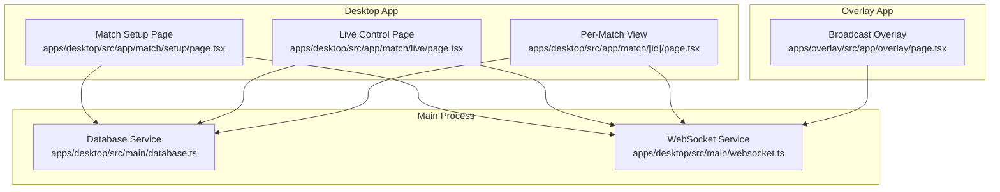
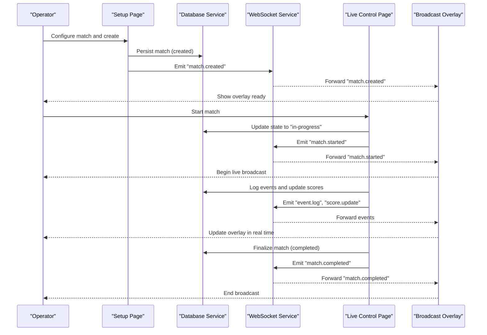
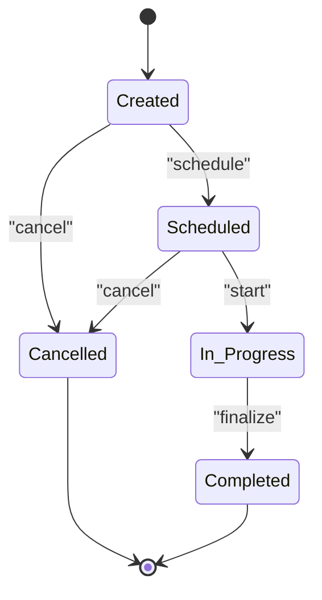
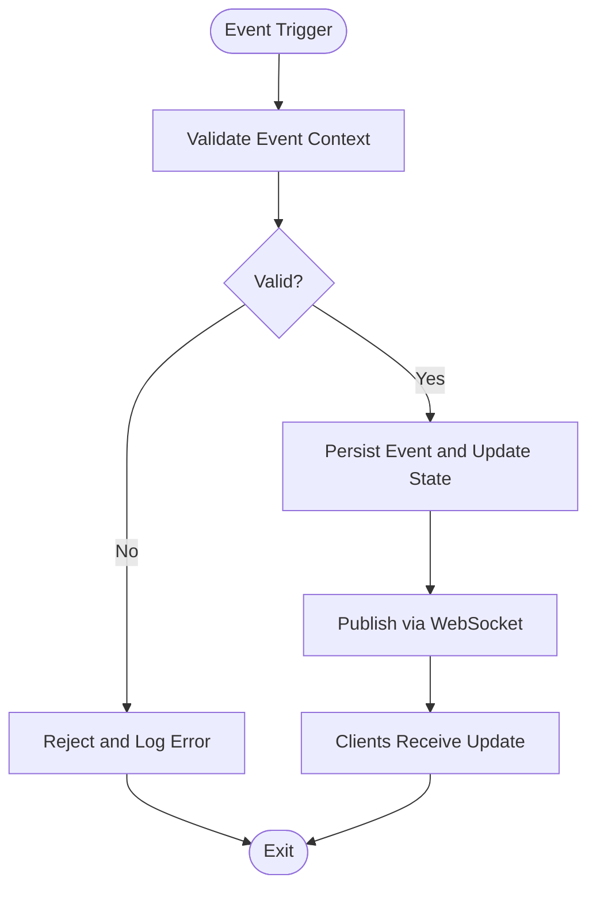
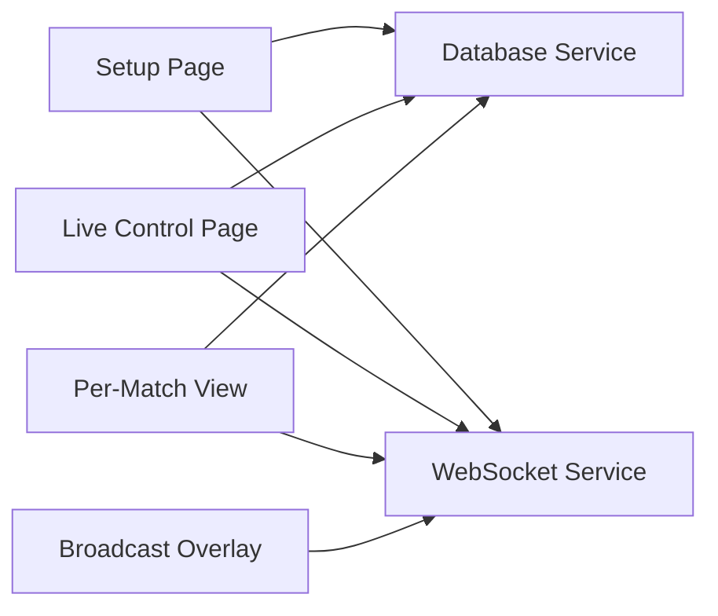

# Match Lifecycle Management

<cite>
**Referenced Files in This Document**
- [apps/desktop/src/app/match/[id]/page.tsx](file://apps/desktop/src/app/match/[id]/page.tsx)
- [apps/desktop/src/app/match/live/page.tsx](file://apps/desktop/src/app/match/live/page.tsx)
- [apps/desktop/src/app/match/setup/page.tsx](file://apps/desktop/src/app/match/setup/page.tsx)
- [apps/desktop/src/main/database.ts](file://apps/desktop/src/main/database.ts)
- [apps/desktop/src/main/websocket.ts](file://apps/desktop/src/main/websocket.ts)
- [apps/overlay/src/app/overlay/page.tsx](file://apps/overlay/src/app/overlay/page.tsx)
</cite>

## Table of Contents
1. [Introduction](#introduction)
2. [Project Structure](#project-structure)
3. [Core Components](#core-components)
4. [Architecture Overview](#architecture-overview)
5. [Detailed Component Analysis](#detailed-component-analysis)
6. [Dependency Analysis](#dependency-analysis)
7. [Performance Considerations](#performance-considerations)
8. [Troubleshooting Guide](#troubleshooting-guide)
9. [Conclusion](#conclusion)

## Introduction
This document explains the match lifecycle management system across the desktop and overlay applications. It covers the end-to-end workflow from match creation and setup through live broadcasting to results recording, including state definitions, transitions, configuration options, timeline tracking, event scheduling, automation hooks, programmatic controls, custom handlers, external integrations, error handling, and recovery mechanisms.

## Project Structure
The match lifecycle spans several UI pages and core runtime modules:
- Desktop app provides match setup, live control, and per-match views.
- Overlay app renders broadcast overlays for live matches.
- Main process manages persistence (database) and real-time communication (WebSocket).

**Diagram sources**
- [apps/desktop/src/app/match/setup/page.tsx](file://apps/desktop/src/app/match/setup/page.tsx)
- [apps/desktop/src/app/match/live/page.tsx](file://apps/desktop/src/app/match/live/page.tsx)
- [apps/desktop/src/app/match/[id]/page.tsx](file://apps/desktop/src/app/match/[id]/page.tsx)
- [apps/overlay/src/app/overlay/page.tsx](file://apps/overlay/src/app/overlay/page.tsx)
- [apps/desktop/src/main/database.ts](file://apps/desktop/src/main/database.ts)
- [apps/desktop/src/main/websocket.ts](file://apps/desktop/src/main/websocket.ts)

**Section sources**
- [apps/desktop/src/app/match/setup/page.tsx](file://apps/desktop/src/app/match/setup/page.tsx)
- [apps/desktop/src/app/match/live/page.tsx](file://apps/desktop/src/app/match/live/page.tsx)
- [apps/desktop/src/app/match/[id]/page.tsx](file://apps/desktop/src/app/match/[id]/page.tsx)
- [apps/overlay/src/app/overlay/page.tsx](file://apps/overlay/src/app/overlay/page.tsx)
- [apps/desktop/src/main/database.ts](file://apps/desktop/src/main/database.ts)
- [apps/desktop/src/main/websocket.ts](file://apps/desktop/src/main/websocket.ts)

## Core Components
- Match Setup Page: Initializes a new match with configuration such as tournament structure, teams, scoring rules, and broadcast settings. Persists the initial record and emits a created event.
- Per-Match View: Displays match details, timeline, and allows administrative actions like scheduling or starting the match.
- Live Control Page: Manages in-progress operations, updates scores, logs events, and coordinates broadcast state.
- Broadcast Overlay: Consumes live data via WebSocket to render overlays for viewers.
- Database Service: Provides persistent storage for matches, events, and results.
- WebSocket Service: Publishes and subscribes to match events for real-time synchronization between desktop and overlay.

Key responsibilities:
- State machine enforcement for match states.
- Event-driven updates for timeline and broadcast.
- Persistence of all state changes and events.
- Error boundaries and retry/recovery logic around critical transitions.

**Section sources**
- [apps/desktop/src/app/match/setup/page.tsx](file://apps/desktop/src/app/match/setup/page.tsx)
- [apps/desktop/src/app/match/[id]/page.tsx](file://apps/desktop/src/app/match/[id]/page.tsx)
- [apps/desktop/src/app/match/live/page.tsx](file://apps/desktop/src/app/match/live/page.tsx)
- [apps/overlay/src/app/overlay/page.tsx](file://apps/overlay/src/app/overlay/page.tsx)
- [apps/desktop/src/main/database.ts](file://apps/desktop/src/main/database.ts)
- [apps/desktop/src/main/websocket.ts](file://apps/desktop/src/main/websocket.ts)

## Architecture Overview
The system follows an event-driven architecture with a clear separation between UI orchestration, persistence, and real-time distribution.

**Diagram sources**
- [apps/desktop/src/app/match/setup/page.tsx](file://apps/desktop/src/app/match/setup/page.tsx)
- [apps/desktop/src/app/match/live/page.tsx](file://apps/desktop/src/app/match/live/page.tsx)
- [apps/desktop/src/app/match/[id]/page.tsx](file://apps/desktop/src/app/match/[id]/page.tsx)
- [apps/overlay/src/app/overlay/page.tsx](file://apps/overlay/src/app/overlay/page.tsx)
- [apps/desktop/src/main/database.ts](file://apps/desktop/src/main/database.ts)
- [apps/desktop/src/main/websocket.ts](file://apps/desktop/src/main/websocket.ts)

## Detailed Component Analysis

### Match States and Transitions
States:
- Created: Initial persisted state after setup.
- Scheduled: Match is queued for future start; may include scheduled_at metadata.
- In-Progress: Active match with live events and score updates.
- Completed: Finalized with recorded results.

Transitions:
- Created → Scheduled: Operator schedules the match.
- Scheduled → In-Progress: Operator starts the match at the scheduled time or manually.
- In-Progress → Completed: Operator finalizes the match after play concludes.
- Created/Scheduled → Cancelled (optional): Operator cancels before start.

Error handling and recovery:
- Validate preconditions before each transition (e.g., cannot start if not scheduled).
- Persist state atomically with event log entries.
- On failure, roll back partial writes and emit a recovery event to re-sync clients.

[No diagram sources since this diagram shows conceptual state transitions without mapping to specific code lines]

**Section sources**
- [apps/desktop/src/app/match/setup/page.tsx](file://apps/desktop/src/app/match/setup/page.tsx)
- [apps/desktop/src/app/match/live/page.tsx](file://apps/desktop/src/app/match/live/page.tsx)
- [apps/desktop/src/app/match/[id]/page.tsx](file://apps/desktop/src/app/match/[id]/page.tsx)

### Match Configuration Options
Configuration areas:
- Tournament structure: single elimination, round robin, group stage, etc.
- Team assignments: roster composition, seeding, home/away flags.
- Scoring rules: point values, tiebreakers, overtime rules.
- Broadcast settings: overlay layout, graphics assets, stream targets.

These are captured during setup and stored persistently. The overlay consumes broadcast settings to render appropriate visuals.

**Section sources**
- [apps/desktop/src/app/match/setup/page.tsx](file://apps/desktop/src/app/match/setup/page.tsx)
- [apps/overlay/src/app/overlay/page.tsx](file://apps/overlay/src/app/overlay/page.tsx)

### Timeline Tracking and Event Scheduling
Timeline features:
- Timestamped event log for key moments (goals, fouls, timeouts).
- Score updates propagated in real time.
- Scheduled tasks for automated workflows (e.g., auto-start at scheduled time, post-match result processing).

Event flow:
- UI triggers an event.
- Database records the event and updates match state if needed.
- WebSocket broadcasts the event to subscribers (overlay and other clients).

[No diagram sources since this diagram shows conceptual event flow without mapping to specific code lines]

**Section sources**
- [apps/desktop/src/app/match/live/page.tsx](file://apps/desktop/src/app/match/live/page.tsx)
- [apps/desktop/src/main/database.ts](file://apps/desktop/src/main/database.ts)
- [apps/desktop/src/main/websocket.ts](file://apps/desktop/src/main/websocket.ts)

### Programmatic Match Control
Programmatic interfaces typically exposed by the main process:
- Create match with configuration payload.
- Schedule match with timestamp.
- Start match (transition to in-progress).
- Log events and update scores.
- Finalize match (transition to completed).
- Query match status and timeline.

These functions should be idempotent where possible and return consistent error codes for invalid transitions.

**Section sources**
- [apps/desktop/src/main/database.ts](file://apps/desktop/src/main/database.ts)
- [apps/desktop/src/main/websocket.ts](file://apps/desktop/src/main/websocket.ts)

### Custom State Handlers
Custom handlers allow extending behavior on state transitions:
- Pre-transition hooks to validate prerequisites.
- Post-transition hooks to trigger side effects (e.g., notify external systems, generate reports).
- Retry and compensation logic for failed side effects.

Implementations can be registered against state transition names and executed in order.

**Section sources**
- [apps/desktop/src/app/match/live/page.tsx](file://apps/desktop/src/app/match/live/page.tsx)
- [apps/desktop/src/main/database.ts](file://apps/desktop/src/main/database.ts)

### Integration with External Scheduling Systems
Integration points:
- Export scheduled matches to external calendars or job queues.
- Subscribe to external scheduler callbacks to auto-trigger start/finalize.
- Sync timestamps and statuses bidirectionally.

Recommended approach:
- Use webhook endpoints or message queues.
- Maintain reconciliation jobs to detect drift and correct state.

**Section sources**
- [apps/desktop/src/app/match/setup/page.tsx](file://apps/desktop/src/app/match/setup/page.tsx)
- [apps/desktop/src/main/websocket.ts](file://apps/desktop/src/main/websocket.ts)

### Broadcast Settings and Overlay Rendering
Overlay rendering depends on broadcast settings:
- Layout selection and asset paths.
- Real-time data subscriptions for live updates.
- Graceful degradation when data is unavailable.

The overlay subscribes to WebSocket channels and reacts to match state and event streams.

**Section sources**
- [apps/overlay/src/app/overlay/page.tsx](file://apps/overlay/src/app/overlay/page.tsx)
- [apps/desktop/src/main/websocket.ts](file://apps/desktop/src/main/websocket.ts)

## Dependency Analysis
High-level dependencies:
- UI pages depend on database and websocket services for state and real-time updates.
- Overlay depends on websocket service for live data.
- Database service persists all match-related entities and events.
- WebSocket service distributes events to subscribers.

**Diagram sources**
- [apps/desktop/src/app/match/setup/page.tsx](file://apps/desktop/src/app/match/setup/page.tsx)
- [apps/desktop/src/app/match/live/page.tsx](file://apps/desktop/src/app/match/live/page.tsx)
- [apps/desktop/src/app/match/[id]/page.tsx](file://apps/desktop/src/app/match/[id]/page.tsx)
- [apps/overlay/src/app/overlay/page.tsx](file://apps/overlay/src/app/overlay/page.tsx)
- [apps/desktop/src/main/database.ts](file://apps/desktop/src/main/database.ts)
- [apps/desktop/src/main/websocket.ts](file://apps/desktop/src/main/websocket.ts)

**Section sources**
- [apps/desktop/src/app/match/setup/page.tsx](file://apps/desktop/src/app/match/setup/page.tsx)
- [apps/desktop/src/app/match/live/page.tsx](file://apps/desktop/src/app/match/live/page.tsx)
- [apps/desktop/src/app/match/[id]/page.tsx](file://apps/desktop/src/app/match/[id]/page.tsx)
- [apps/overlay/src/app/overlay/page.tsx](file://apps/overlay/src/app/overlay/page.tsx)
- [apps/desktop/src/main/database.ts](file://apps/desktop/src/main/database.ts)
- [apps/desktop/src/main/websocket.ts](file://apps/desktop/src/main/websocket.ts)

## Performance Considerations
- Batch event logging to reduce write amplification.
- Debounce frequent score updates to minimize network traffic.
- Use optimistic UI updates with server reconciliation.
- Partition large timelines for efficient rendering.
- Ensure WebSocket connections are resilient with reconnect logic.

[No sources needed since this section provides general guidance]

## Troubleshooting Guide
Common issues and resolutions:
- Invalid state transitions: Verify current state and allowed transitions before applying changes.
- Missing events: Check event persistence and WebSocket delivery logs.
- Overlay not updating: Confirm subscription channels and data availability.
- Recovery after crash: Reconcile persisted state with last known good snapshot and replay pending events.

Operational checks:
- Inspect database integrity for match and event tables.
- Monitor WebSocket connection health and message throughput.
- Validate broadcast settings and asset paths.

**Section sources**
- [apps/desktop/src/main/database.ts](file://apps/desktop/src/main/database.ts)
- [apps/desktop/src/main/websocket.ts](file://apps/desktop/src/main/websocket.ts)
- [apps/overlay/src/app/overlay/page.tsx](file://apps/overlay/src/app/overlay/page.tsx)

## Conclusion
The match lifecycle management system provides a robust, event-driven framework for managing matches from creation through completion. Clear state definitions, strong persistence, and real-time distribution enable reliable operation and seamless integration with external schedulers and broadcast tools. Proper error handling and recovery ensure resilience under operational stress.

[No sources needed since this section summarizes without analyzing specific files]