# Match Management System

<cite>
**Referenced Files in This Document**
- [package.json](file://package.json)
- [pnpm-workspace.yaml](file://pnpm-workspace.yaml)
- [turbo.json](file://turbo.json)
- [tsconfig.base.json](file://tsconfig.base.json)
- [apps/desktop/src/main/index.ts](file://apps/desktop/src/main/index.ts)
- [apps/desktop/src/main/database.ts](file://apps/desktop/src/main/database.ts)
- [apps/desktop/src/main/websocket.ts](file://apps/desktop/src/main/websocket.ts)
- [apps/desktop/src/preload/index.ts](file://apps/desktop/src/preload/index.ts)
- [apps/desktop/src/renderer/app/layout.tsx](file://apps/desktop/src/renderer/app/layout.tsx)
- [apps/desktop/src/renderer/app/page.tsx](file://apps/desktop/src/renderer/app/page.tsx)
- [apps/desktop/src/renderer/app/match/[id]/page.tsx](file://apps/desktop/src/renderer/app/match/[id]/page.tsx)
- [apps/desktop/src/renderer/app/match/setup/page.tsx](file://apps/desktop/src/renderer/app/match/setup/page.tsx)
- [apps/desktop/src/renderer/app/match/live/page.tsx](file://apps/desktop/src/renderer/app/match/live/page.tsx)
- [apps/desktop/src/renderer/app/teams/page.tsx](file://apps/desktop/src/renderer/app/teams/page.tsx)
- [apps/desktop/src/renderer/app/settings/page.tsx](file://apps/desktop/src/renderer/app/settings/page.tsx)
- [apps/overlay/src/app/overlay/page.tsx](file://apps/overlay/src/app/overlay/page.tsx)
- [packages/store/src/index.ts](file://packages/store/src/index.ts)
- [packages/types/src/index.ts](file://packages/types/src/index.ts)
- [packages/hooks/src/index.ts](file://packages/hooks/src/index.ts)
- [packages/ui/src/index.ts](file://packages/ui/src/index.ts)
</cite>

## Table of Contents
1. [Introduction](#introduction)
2. [Project Structure](#project-structure)
3. [Core Components](#core-components)
4. [Architecture Overview](#architecture-overview)
5. [Detailed Component Analysis](#detailed-component-analysis)
6. [Dependency Analysis](#dependency-analysis)
7. [Performance Considerations](#performance-considerations)
8. [Troubleshooting Guide](#troubleshooting-guide)
9. [Conclusion](#conclusion)
10. [Appendices](#appendices)

## Introduction
This document provides comprehensive documentation for the AR Sports match management system. It explains the complete match lifecycle from creation and setup through live broadcasting to results recording. It covers team configuration, player roster management, scoring systems, timeline tracking, event handling, statistics collection, user interface components for administration and settings, data models, programmatic controls, custom event handling, integration with external scoring systems, and real-time synchronization across multiple clients and broadcast endpoints.

## Project Structure
The repository is a monorepo managed with pnpm workspaces and Turborepo. The desktop application uses a hybrid architecture combining a Next.js renderer with an Electron main process. Shared packages provide types, UI components, hooks, store, animations, graphics, icons, theme, and utilities.

Key directories:
- apps/desktop: Electron + Next.js app for match administration, setup, live control, teams, and settings.
- apps/overlay: Overlay application for broadcast overlays.
- packages: Shared libraries (store, types, hooks, ui, etc.).

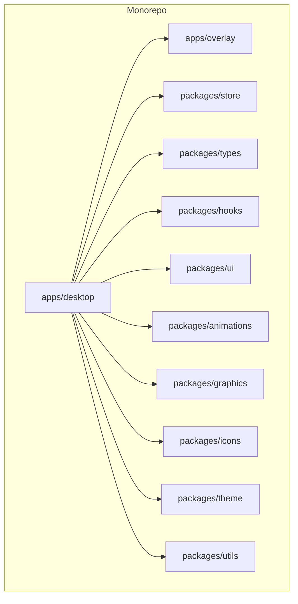

**Section sources**
- [package.json](file://package.json)
- [pnpm-workspace.yaml](file://pnpm-workspace.yaml)
- [turbo.json](file://turbo.json)
- [tsconfig.base.json](file://tsconfig.base.json)

## Core Components
- Desktop Main Process: Initializes the Electron main process, manages database persistence, and exposes IPC channels for the renderer.
- Database Layer: Provides persistent storage for matches, teams, players, events, and settings.
- WebSocket Server: Manages real-time communication between clients and broadcasts updates to overlay and other consumers.
- Renderer App (Next.js): Provides UI for match setup, live control, teams, and settings.
- Overlay App: Consumes real-time updates to render broadcast overlays.
- Shared Packages: Types, store state, hooks, UI primitives, animations, graphics, icons, theme, and utilities.

**Section sources**
- [apps/desktop/src/main/index.ts](file://apps/desktop/src/main/index.ts)
- [apps/desktop/src/main/database.ts](file://apps/desktop/src/main/database.ts)
- [apps/desktop/src/main/websocket.ts](file://apps/desktop/src/main/websocket.ts)
- [apps/desktop/src/renderer/app/layout.tsx](file://apps/desktop/src/renderer/app/layout.tsx)
- [apps/desktop/src/renderer/app/page.tsx](file://apps/desktop/src/renderer/app/page.tsx)
- [apps/overlay/src/app/overlay/page.tsx](file://apps/overlay/src/app/overlay/page.tsx)
- [packages/store/src/index.ts](file://packages/store/src/index.ts)
- [packages/types/src/index.ts](file://packages/types/src/index.ts)

## Architecture Overview
The system follows a client-server architecture with real-time synchronization:
- The Electron main process hosts the database and WebSocket server.
- The Next.js renderer communicates via IPC to perform operations and subscribe to updates.
- The overlay app subscribes to WebSocket events to render live overlays.
- Shared packages define data models and provide reusable logic and UI.

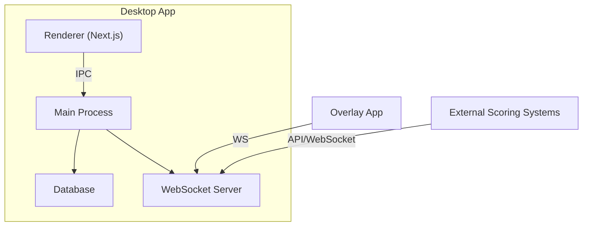

**Diagram sources**
- [apps/desktop/src/main/index.ts](file://apps/desktop/src/main/index.ts)
- [apps/desktop/src/main/database.ts](file://apps/desktop/src/main/database.ts)
- [apps/desktop/src/main/websocket.ts](file://apps/desktop/src/main/websocket.ts)
- [apps/desktop/src/renderer/app/layout.tsx](file://apps/desktop/src/renderer/app/layout.tsx)
- [apps/overlay/src/app/overlay/page.tsx](file://apps/overlay/src/app/overlay/page.tsx)

## Detailed Component Analysis

### Match Lifecycle
The match lifecycle includes creation, setup, live broadcasting, and results recording.

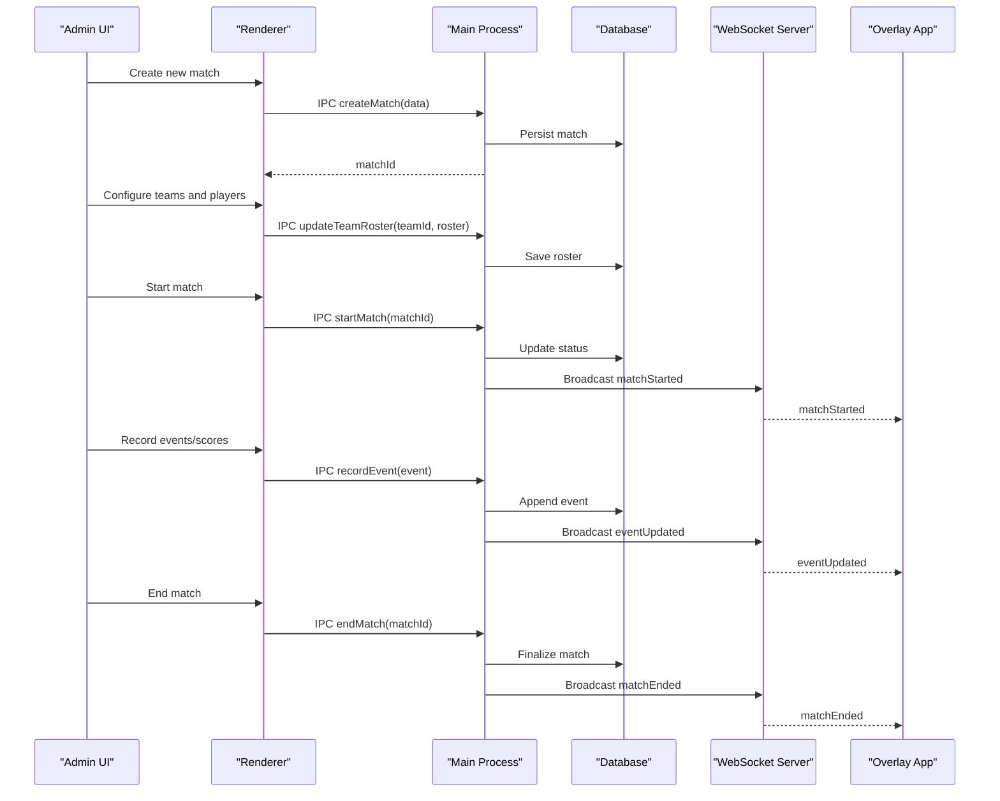

**Diagram sources**
- [apps/desktop/src/renderer/app/match/setup/page.tsx](file://apps/desktop/src/renderer/app/match/setup/page.tsx)
- [apps/desktop/src/renderer/app/match/live/page.tsx](file://apps/desktop/src/renderer/app/match/live/page.tsx)
- [apps/desktop/src/main/index.ts](file://apps/desktop/src/main/index.ts)
- [apps/desktop/src/main/database.ts](file://apps/desktop/src/main/database.ts)
- [apps/desktop/src/main/websocket.ts](file://apps/desktop/src/main/websocket.ts)
- [apps/overlay/src/app/overlay/page.tsx](file://apps/overlay/src/app/overlay/page.tsx)

**Section sources**
- [apps/desktop/src/renderer/app/match/setup/page.tsx](file://apps/desktop/src/renderer/app/match/setup/page.tsx)
- [apps/desktop/src/renderer/app/match/live/page.tsx](file://apps/desktop/src/renderer/app/match/live/page.tsx)
- [apps/desktop/src/main/index.ts](file://apps/desktop/src/main/index.ts)
- [apps/desktop/src/main/database.ts](file://apps/desktop/src/main/database.ts)
- [apps/desktop/src/main/websocket.ts](file://apps/desktop/src/main/websocket.ts)
- [apps/overlay/src/app/overlay/page.tsx](file://apps/overlay/src/app/overlay/page.tsx)

### Team Configuration and Player Roster Management
Teams are configured with metadata and rosters including player details. The UI allows adding/removing players, setting roles, and managing availability.

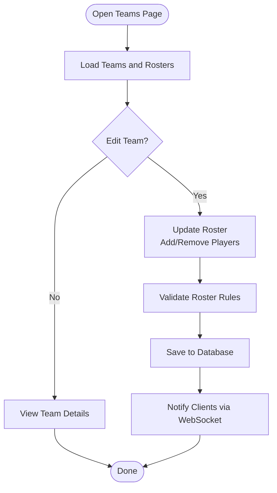

**Diagram sources**
- [apps/desktop/src/renderer/app/teams/page.tsx](file://apps/desktop/src/renderer/app/teams/page.tsx)
- [apps/desktop/src/main/database.ts](file://apps/desktop/src/main/database.ts)
- [apps/desktop/src/main/websocket.ts](file://apps/desktop/src/main/websocket.ts)

**Section sources**
- [apps/desktop/src/renderer/app/teams/page.tsx](file://apps/desktop/src/renderer/app/teams/page.tsx)
- [apps/desktop/src/main/database.ts](file://apps/desktop/src/main/database.ts)
- [apps/desktop/src/main/websocket.ts](file://apps/desktop/src/main/websocket.ts)

### Scoring Systems and Timeline Tracking
Scoring systems support point increments, penalties, timeouts, and period transitions. Timeline tracks chronological events with timestamps and metadata.

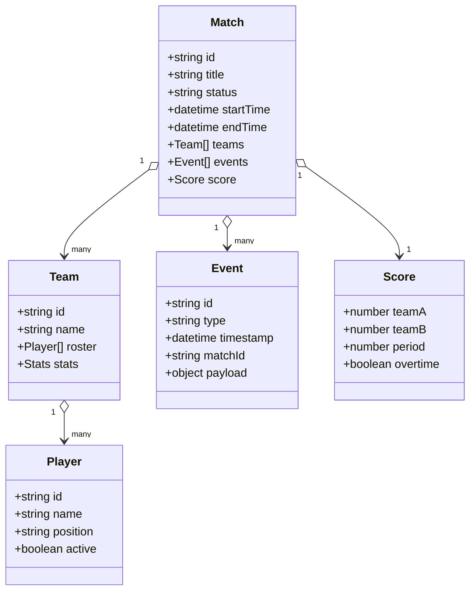

**Diagram sources**
- [packages/types/src/index.ts](file://packages/types/src/index.ts)
- [apps/desktop/src/main/database.ts](file://apps/desktop/src/main/database.ts)

**Section sources**
- [packages/types/src/index.ts](file://packages/types/src/index.ts)
- [apps/desktop/src/main/database.ts](file://apps/desktop/src/main/database.ts)

### Real-Time Synchronization
Real-time synchronization ensures all clients receive consistent updates. The WebSocket server broadcasts events such as matchStarted, eventUpdated, and matchEnded.

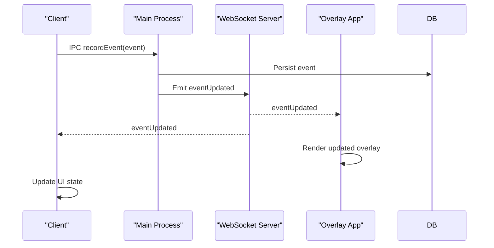

**Diagram sources**
- [apps/desktop/src/main/websocket.ts](file://apps/desktop/src/main/websocket.ts)
- [apps/desktop/src/main/database.ts](file://apps/desktop/src/main/database.ts)
- [apps/overlay/src/app/overlay/page.tsx](file://apps/overlay/src/app/overlay/page.tsx)

**Section sources**
- [apps/desktop/src/main/websocket.ts](file://apps/desktop/src/main/websocket.ts)
- [apps/desktop/src/main/database.ts](file://apps/desktop/src/main/database.ts)
- [apps/overlay/src/app/overlay/page.tsx](file://apps/overlay/src/app/overlay/page.tsx)

### User Interface Components
- Match Setup: Create and configure matches, set rules, periods, and initial scores.
- Live Control: Manage ongoing matches, record events, adjust scores, and handle timeouts.
- Teams: Manage team configurations and player rosters.
- Settings: Configure application preferences and integrations.

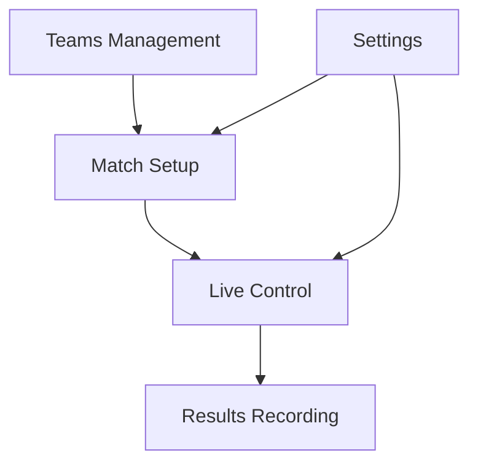

**Diagram sources**
- [apps/desktop/src/renderer/app/match/setup/page.tsx](file://apps/desktop/src/renderer/app/match/setup/page.tsx)
- [apps/desktop/src/renderer/app/match/live/page.tsx](file://apps/desktop/src/renderer/app/match/live/page.tsx)
- [apps/desktop/src/renderer/app/teams/page.tsx](file://apps/desktop/src/renderer/app/teams/page.tsx)
- [apps/desktop/src/renderer/app/settings/page.tsx](file://apps/desktop/src/renderer/app/settings/page.tsx)

**Section sources**
- [apps/desktop/src/renderer/app/match/setup/page.tsx](file://apps/desktop/src/renderer/app/match/setup/page.tsx)
- [apps/desktop/src/renderer/app/match/live/page.tsx](file://apps/desktop/src/renderer/app/match/live/page.tsx)
- [apps/desktop/src/renderer/app/teams/page.tsx](file://apps/desktop/src/renderer/app/teams/page.tsx)
- [apps/desktop/src/renderer/app/settings/page.tsx](file://apps/desktop/src/renderer/app/settings/page.tsx)

### Programmatic Match Control
Programmatic control allows automation of match operations via IPC calls. Examples include creating matches, updating rosters, starting matches, recording events, and ending matches.

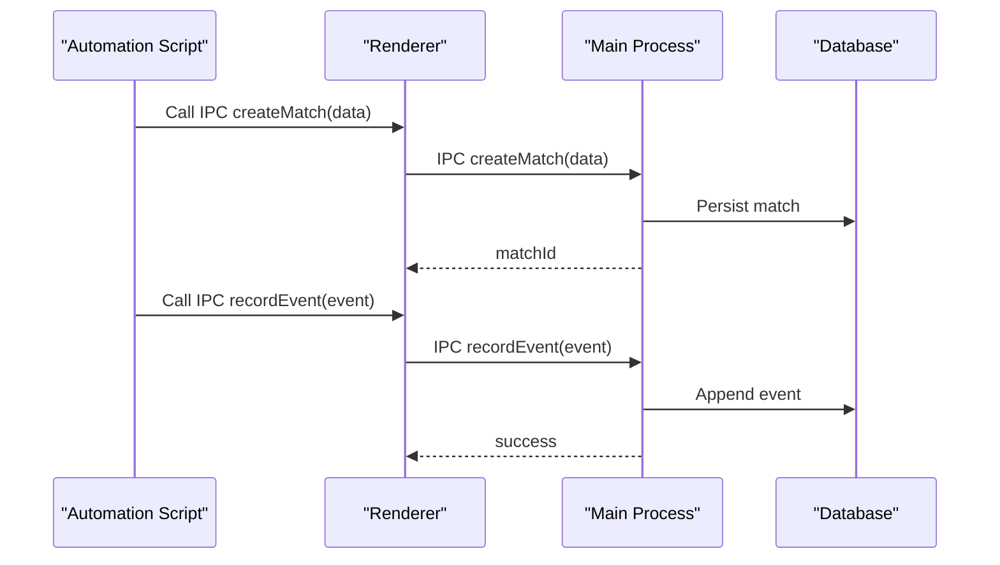

**Diagram sources**
- [apps/desktop/src/renderer/app/match/setup/page.tsx](file://apps/desktop/src/renderer/app/match/setup/page.tsx)
- [apps/desktop/src/renderer/app/match/live/page.tsx](file://apps/desktop/src/renderer/app/match/live/page.tsx)
- [apps/desktop/src/main/index.ts](file://apps/desktop/src/main/index.ts)
- [apps/desktop/src/main/database.ts](file://apps/desktop/src/main/database.ts)

**Section sources**
- [apps/desktop/src/renderer/app/match/setup/page.tsx](file://apps/desktop/src/renderer/app/match/setup/page.tsx)
- [apps/desktop/src/renderer/app/match/live/page.tsx](file://apps/desktop/src/renderer/app/match/live/page.tsx)
- [apps/desktop/src/main/index.ts](file://apps/desktop/src/main/index.ts)
- [apps/desktop/src/main/database.ts](file://apps/desktop/src/main/database.ts)

### Custom Event Handling
Custom events allow extending the system with domain-specific logic. Events are persisted and broadcasted to all connected clients.

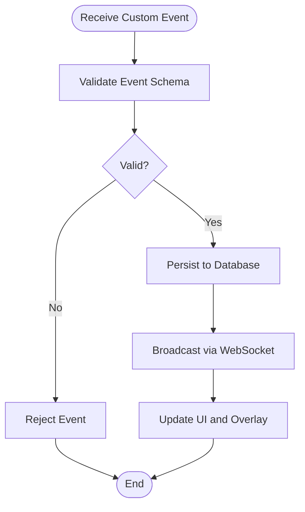

**Diagram sources**
- [apps/desktop/src/main/websocket.ts](file://apps/desktop/src/main/websocket.ts)
- [apps/desktop/src/main/database.ts](file://apps/desktop/src/main/database.ts)

**Section sources**
- [apps/desktop/src/main/websocket.ts](file://apps/desktop/src/main/websocket.ts)
- [apps/desktop/src/main/database.ts](file://apps/desktop/src/main/database.ts)

### Integration with External Scoring Systems
Integration points allow connecting external scoring systems via API or WebSocket. Data is normalized and synchronized with internal state.

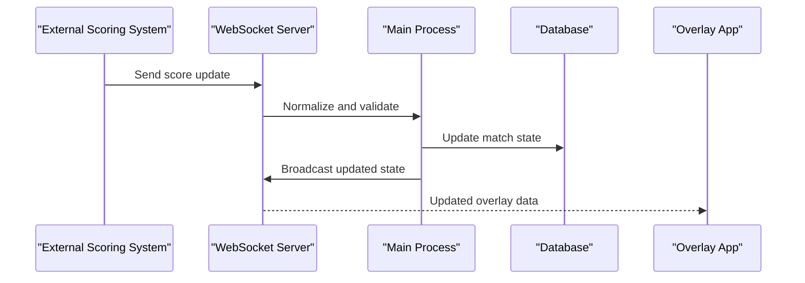

**Diagram sources**
- [apps/desktop/src/main/websocket.ts](file://apps/desktop/src/main/websocket.ts)
- [apps/desktop/src/main/database.ts](file://apps/desktop/src/main/database.ts)
- [apps/overlay/src/app/overlay/page.tsx](file://apps/overlay/src/app/overlay/page.tsx)

**Section sources**
- [apps/desktop/src/main/websocket.ts](file://apps/desktop/src/main/websocket.ts)
- [apps/desktop/src/main/database.ts](file://apps/desktop/src/main/database.ts)
- [apps/overlay/src/app/overlay/page.tsx](file://apps/overlay/src/app/overlay/page.tsx)

## Dependency Analysis
The system relies on shared packages for types, store, hooks, UI, animations, graphics, icons, theme, and utilities. The desktop app integrates these packages to provide a cohesive experience.

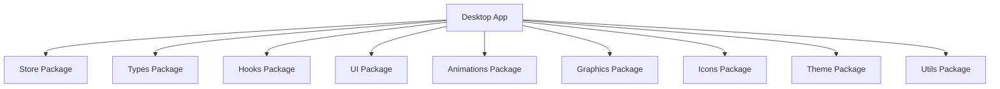

**Diagram sources**
- [package.json](file://package.json)
- [pnpm-workspace.yaml](file://pnpm-workspace.yaml)
- [turbo.json](file://turbo.json)

**Section sources**
- [package.json](file://package.json)
- [pnpm-workspace.yaml](file://pnpm-workspace.yaml)
- [turbo.json](file://turbo.json)

## Performance Considerations
- Use efficient database queries and indexing for large datasets.
- Implement batching for event updates to reduce WebSocket traffic.
- Optimize UI rendering by leveraging React best practices and memoization.
- Consider caching frequently accessed data in memory for faster access.
- Monitor WebSocket connections and implement reconnection logic for resilience.

## Troubleshooting Guide
Common issues and solutions:
- Database connection errors: Check database file permissions and path configuration.
- WebSocket connection failures: Verify server port availability and firewall settings.
- IPC communication errors: Ensure preload script is correctly configured and IPC channels are defined.
- Overlay not updating: Confirm WebSocket subscription and event broadcasting.

**Section sources**
- [apps/desktop/src/main/database.ts](file://apps/desktop/src/main/database.ts)
- [apps/desktop/src/main/websocket.ts](file://apps/desktop/src/main/websocket.ts)
- [apps/desktop/src/preload/index.ts](file://apps/desktop/src/preload/index.ts)

## Conclusion
The AR Sports match management system provides a robust platform for managing sports matches with real-time synchronization, comprehensive team and player management, flexible scoring systems, and extensible event handling. The modular architecture and shared packages enable scalability and maintainability.

## Appendices
- Installation and setup instructions for development and production environments.
- API documentation for IPC channels and WebSocket events.
- Examples of custom event definitions and integration patterns.