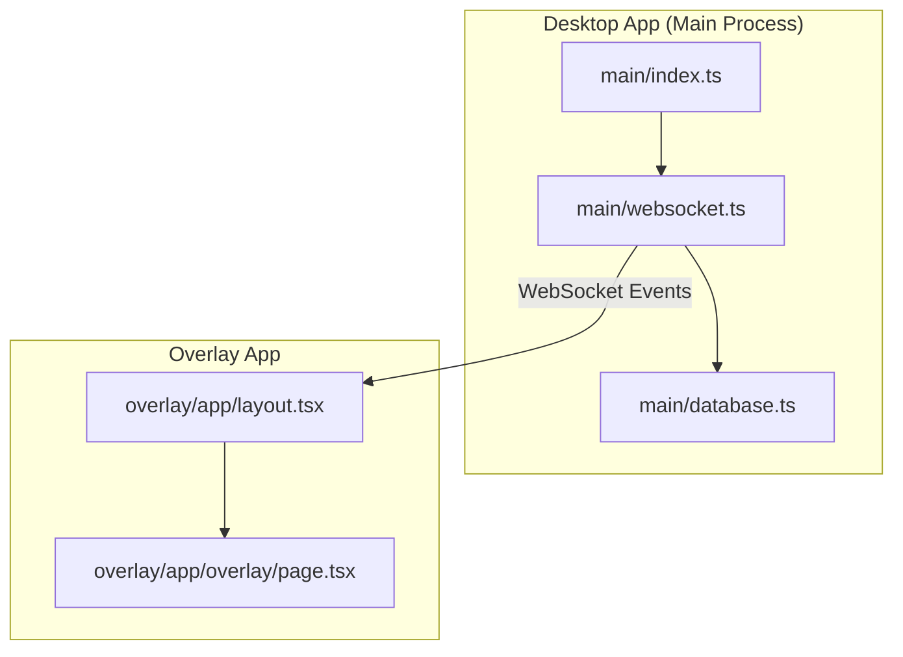
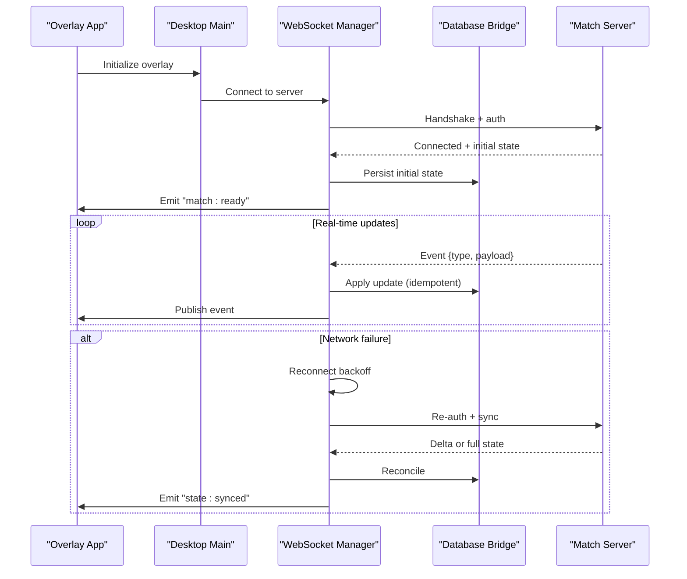
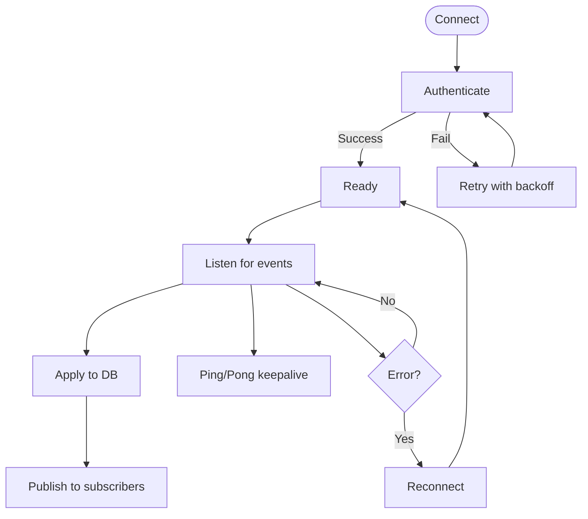
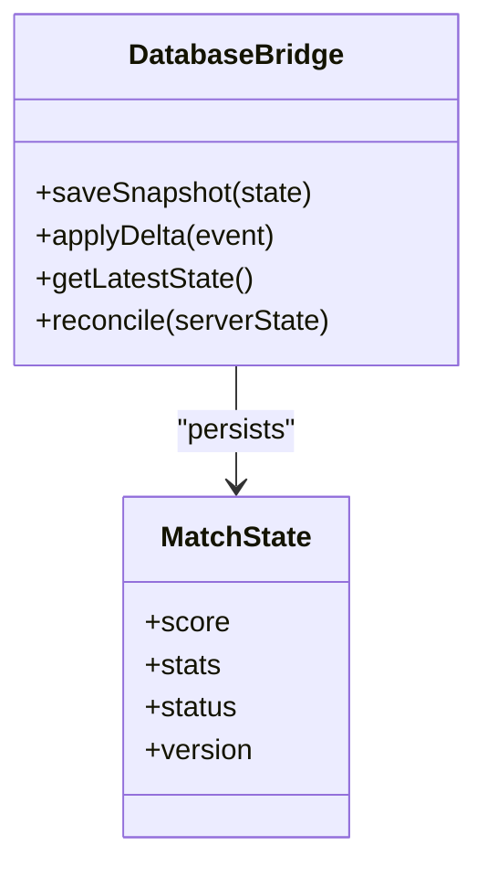
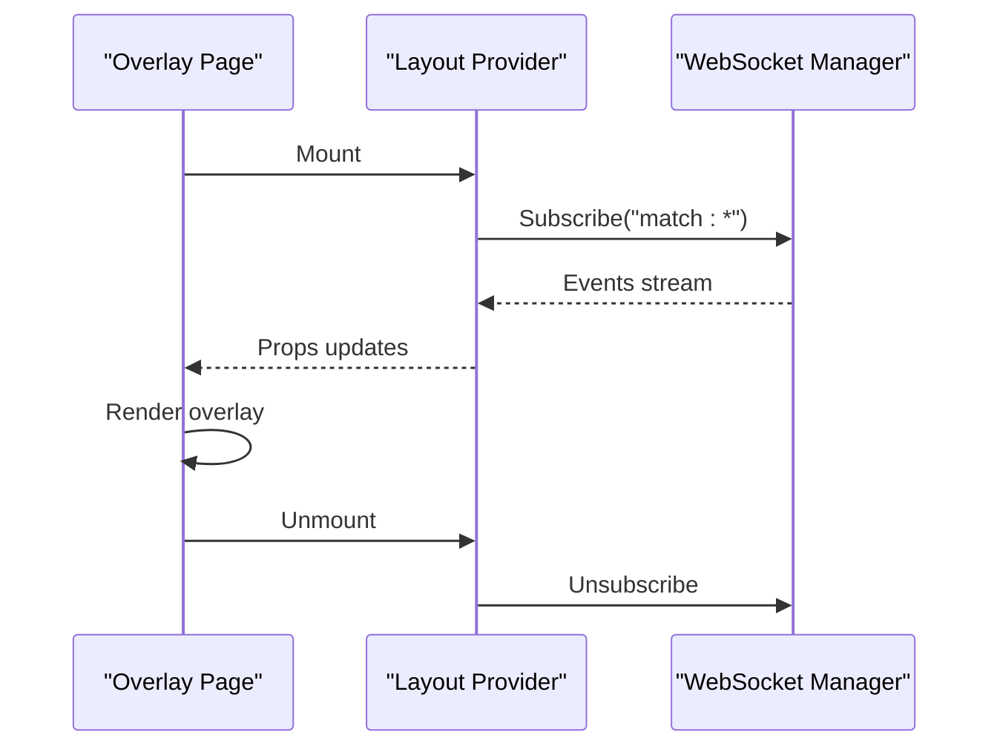
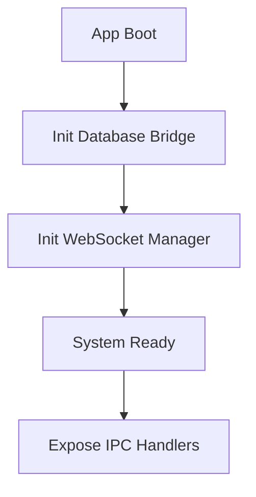
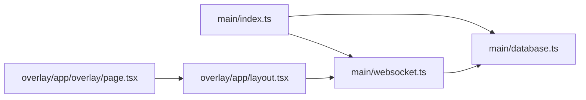

# Real-time Data Synchronization

<cite>
**Referenced Files in This Document**
- [websocket.ts](file://apps/desktop/src/main/websocket.ts)
- [database.ts](file://apps/desktop/src/main/database.ts)
- [index.ts](file://apps/desktop/src/main/index.ts)
- [page.tsx](file://apps/overlay/src/app/overlay/page.tsx)
- [layout.tsx](file://apps/overlay/src/app/layout.tsx)
- [package.json](file://apps/desktop/package.json)
- [package.json](file://apps/overlay/package.json)
</cite>

## Table of Contents
1. [Introduction](#introduction)
2. [Project Structure](#project-structure)
3. [Core Components](#core-components)
4. [Architecture Overview](#architecture-overview)
5. [Detailed Component Analysis](#detailed-component-analysis)
6. [Dependency Analysis](#dependency-analysis)
7. [Performance Considerations](#performance-considerations)
8. [Troubleshooting Guide](#troubleshooting-guide)
9. [Conclusion](#conclusion)
10. [Appendices](#appendices)

## Introduction
This document explains the real-time data synchronization architecture for the match management system, focusing on WebSocket-based communication, connection management, and message protocols. It covers event-driven updates for scores, statistics, and match status changes; client-server synchronization strategies; conflict resolution; offline support; broadcast integration for overlay updates; multi-client coordination; custom event handling; subscription patterns; error recovery; performance optimization; scaling considerations; and debugging techniques.

## Project Structure
The desktop application hosts the main process that manages WebSocket connections and local persistence. The overlay app consumes real-time events to render live overlays. Key files:
- Desktop main process: WebSocket manager, database bridge, and entry point
- Overlay app: Next.js pages consuming real-time updates

**Diagram sources**
- [index.ts](file://apps/desktop/src/main/index.ts)
- [websocket.ts](file://apps/desktop/src/main/websocket.ts)
- [database.ts](file://apps/desktop/src/main/database.ts)
- [layout.tsx](file://apps/overlay/src/app/layout.tsx)
- [page.tsx](file://apps/overlay/src/app/overlay/page.tsx)

**Section sources**
- [index.ts](file://apps/desktop/src/main/index.ts)
- [websocket.ts](file://apps/desktop/src/main/websocket.ts)
- [database.ts](file://apps/desktop/src/main/database.ts)
- [layout.tsx](file://apps/overlay/src/app/layout.tsx)
- [page.tsx](file://apps/overlay/src/app/overlay/page.tsx)

## Core Components
- WebSocket Manager: Establishes and maintains a persistent connection to the server, handles reconnection, heartbeat, and routing of incoming messages to subscribers.
- Database Bridge: Persists match state locally, applies incremental updates from the server, and reconciles conflicts when reconnecting.
- Overlay Consumer: Subscribes to real-time events and renders live overlays with minimal latency.

Responsibilities:
- Connection lifecycle: connect, authenticate, subscribe, ping/pong, reconnect
- Message protocol: typed events for scores, stats, match status, and custom events
- Event bus: publish/subscribe model for decoupled components
- Persistence: write-ahead or snapshot-based storage with conflict resolution
- Broadcast: fan-out to multiple clients (overlays, admin panels)

**Section sources**
- [websocket.ts](file://apps/desktop/src/main/websocket.ts)
- [database.ts](file://apps/desktop/src/main/database.ts)
- [index.ts](file://apps/desktop/src/main/index.ts)

## Architecture Overview
The system uses a central WebSocket channel managed by the desktop main process. The overlay app subscribes to events via IPC or direct WebSocket if applicable. Updates are published as typed events and consumed by UI layers.

**Diagram sources**
- [websocket.ts](file://apps/desktop/src/main/websocket.ts)
- [database.ts](file://apps/desktop/src/main/database.ts)
- [index.ts](file://apps/desktop/src/main/index.ts)
- [page.tsx](file://apps/overlay/src/app/overlay/page.tsx)

## Detailed Component Analysis

### WebSocket Manager
- Responsibilities:
  - Manage connection lifecycle (connect, reconnect, close)
  - Heartbeat/ping-pong to detect liveness
  - Subscribe/unsubscribe to channels or topics
  - Route messages to subscribers based on event types
  - Queue outgoing messages during transient failures
- Key behaviors:
  - Exponential backoff with jitter on reconnect
  - Idempotent apply of server events using sequence numbers or timestamps
  - Graceful degradation when server is unavailable

**Diagram sources**
- [websocket.ts](file://apps/desktop/src/main/websocket.ts)

**Section sources**
- [websocket.ts](file://apps/desktop/src/main/websocket.ts)

### Database Bridge
- Responsibilities:
  - Persist match state snapshots and incremental deltas
  - Resolve conflicts using last-writer-wins or vector clocks
  - Provide consistent reads for UI consumers
- Key behaviors:
  - Transactional writes for atomicity
  - Checkpointing to avoid large WAL growth
  - Snapshot restore on first boot after crash

**Diagram sources**
- [database.ts](file://apps/desktop/src/main/database.ts)

**Section sources**
- [database.ts](file://apps/desktop/src/main/database.ts)

### Overlay Consumer
- Responsibilities:
  - Subscribe to relevant events (scores, stats, status)
  - Render live overlays with minimal layout thrash
  - Handle offline states and fallbacks
- Key behaviors:
  - Debounced rendering for high-frequency updates
  - Optimistic UI updates with rollback on errors
  - Subscription lifecycle tied to page visibility

**Diagram sources**
- [page.tsx](file://apps/overlay/src/app/overlay/page.tsx)
- [layout.tsx](file://apps/overlay/src/app/layout.tsx)
- [websocket.ts](file://apps/desktop/src/main/websocket.ts)

**Section sources**
- [page.tsx](file://apps/overlay/src/app/overlay/page.tsx)
- [layout.tsx](file://apps/overlay/src/app/layout.tsx)
- [websocket.ts](file://apps/desktop/src/main/websocket.ts)

### Entry Point and Initialization
- Responsibilities:
  - Bootstrap WebSocket manager and database bridge
  - Register global event handlers
  - Expose IPC interfaces for renderer processes
- Key behaviors:
  - Ensure single instance of WebSocket manager
  - Initialize logging and metrics hooks

**Diagram sources**
- [index.ts](file://apps/desktop/src/main/index.ts)
- [websocket.ts](file://apps/desktop/src/main/websocket.ts)
- [database.ts](file://apps/desktop/src/main/database.ts)

**Section sources**
- [index.ts](file://apps/desktop/src/main/index.ts)

## Dependency Analysis
- Desktop main depends on WebSocket manager and database bridge
- Overlay app depends on layout provider which wires into WebSocket events
- External dependencies include WebSocket libraries and persistence layer

**Diagram sources**
- [index.ts](file://apps/desktop/src/main/index.ts)
- [websocket.ts](file://apps/desktop/src/main/websocket.ts)
- [database.ts](file://apps/desktop/src/main/database.ts)
- [layout.tsx](file://apps/overlay/src/app/layout.tsx)
- [page.tsx](file://apps/overlay/src/app/overlay/page.tsx)

**Section sources**
- [index.ts](file://apps/desktop/src/main/index.ts)
- [websocket.ts](file://apps/desktop/src/main/websocket.ts)
- [database.ts](file://apps/desktop/src/main/database.ts)
- [layout.tsx](file://apps/overlay/src/app/layout.tsx)
- [page.tsx](file://apps/overlay/src/app/overlay/page.tsx)

## Performance Considerations
- Minimize payload size: send only changed fields and use compact encodings
- Batch updates: coalesce frequent stat updates into periodic snapshots
- Backpressure: throttle subscriber queues and drop stale events beyond a time window
- Rendering efficiency: memoize derived values and avoid unnecessary re-renders
- Connection resilience: exponential backoff with jitter; limit max retries before alerting
- Memory management: clear subscriptions on unmount; prune old snapshots

[No sources needed since this section provides general guidance]

## Troubleshooting Guide
Common issues and remedies:
- Frequent disconnects: verify network stability, server health, and heartbeat intervals
- Stale overlays: ensure idempotent apply and version checks; force full sync on mismatch
- High CPU usage: reduce event frequency, debounce UI updates, and profile rendering
- Data divergence: inspect reconciliation logs and compare server vs local versions
- Missing events: check subscription scopes and event filters; validate topic names

Operational tips:
- Enable verbose logs around connect/reconnect and event apply
- Add metrics for event throughput, latency, and error rates
- Use deterministic IDs and timestamps for conflict detection

**Section sources**
- [websocket.ts](file://apps/desktop/src/main/websocket.ts)
- [database.ts](file://apps/desktop/src/main/database.ts)

## Conclusion
The real-time synchronization layer combines a robust WebSocket manager, an idempotent database bridge, and efficient overlay consumers to deliver low-latency match updates. By emphasizing idempotency, backpressure, and careful subscription management, the system scales across multiple clients while maintaining consistency and resilience under adverse conditions.

[No sources needed since this section summarizes without analyzing specific files]

## Appendices

### Message Protocol Overview
- Event categories:
  - Scores: team points, period scores, game clock
  - Statistics: player/team stats, play-by-play entries
  - Status: match start, pause, end, timeouts
  - Custom: user-defined overlays or annotations
- Payload structure:
  - Type identifier
  - Version or sequence number
  - Timestamp
  - Payload object
- Ordering guarantees:
  - Per-match ordering enforced by server
  - Clients reconcile out-of-order events using sequence numbers

[No sources needed since this section provides general guidance]

### Subscription Patterns
- Topic-based: subscribe to "match.{id}.scores", "match.{id}.stats", "match.{id}.status"
- Wildcard: subscribe to "match.*" and filter client-side
- Conditional: subscribe only when overlay is visible or active

[No sources needed since this section provides general guidance]

### Conflict Resolution Strategies
- Last-writer-wins with monotonic timestamps
- Vector clocks for causal ordering
- Snapshot reconciliation on reconnect with delta application

[No sources needed since this section provides general guidance]

### Offline Support
- Cache latest snapshot locally
- Queue user actions and replay upon reconnection
- Show offline indicator and disable write operations

[No sources needed since this section provides general guidance]

### Broadcasting and Multi-client Coordination
- Fan-out server events to all connected overlays
- Coordinate overlays to avoid redundant work (e.g., one overlay per match)
- Use presence tracking to manage resource allocation

[No sources needed since this section provides general guidance]

### Debugging Techniques
- Log event flow end-to-end with correlation IDs
- Capture payloads for reproduction
- Visualize subscription tree and event rates
- Simulate network partitions and server restarts

[No sources needed since this section provides general guidance]

### Scaling Considerations
- Horizontal scaling of WebSocket servers behind a load balancer
- Shard matches across workers and route by match ID
- Use pub/sub backbone (e.g., Redis) for cross-process fan-out
- Monitor memory and GC pressure under high event rates

[No sources needed since this section provides general guidance]

### Package Dependencies
- Desktop app dependencies include runtime packages for networking and persistence
- Overlay app dependencies include UI and real-time consumption libraries

**Section sources**
- [package.json](file://apps/desktop/package.json)
- [package.json](file://apps/overlay/package.json)