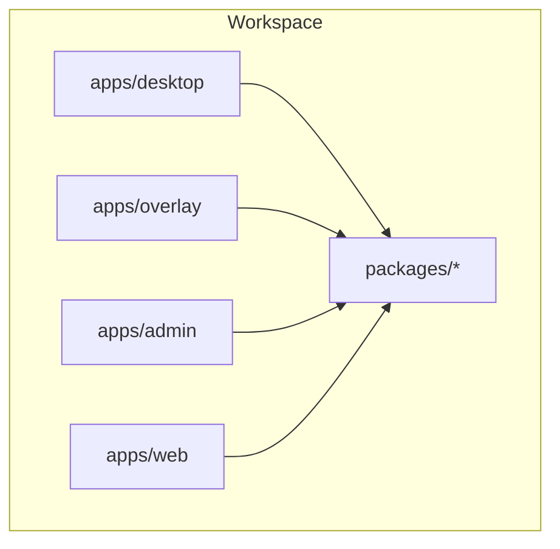
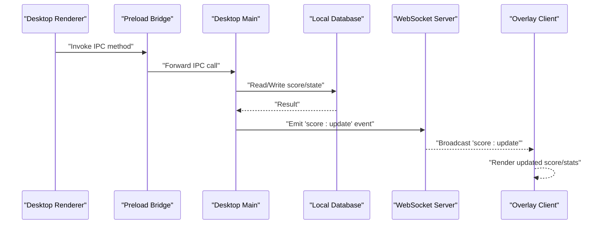
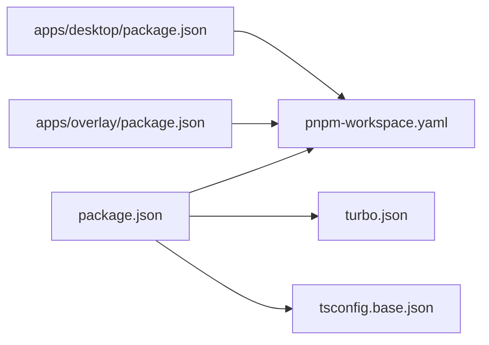

# Scoring and Statistics Engine

<cite>
**Referenced Files in This Document**
- [package.json](file://package.json)
- [pnpm-workspace.yaml](file://pnpm-workspace.yaml)
- [turbo.json](file://turbo.json)
- [tsconfig.base.json](file://tsconfig.base.json)
- [apps/desktop/src/main/database.ts](file://apps/desktop/src/main/database.ts)
- [apps/desktop/src/main/websocket.ts](file://apps/desktop/src/main/websocket.ts)
- [apps/desktop/src/preload/index.ts](file://apps/desktop/src/preload/index.ts)
- [apps/desktop/next.config.js](file://apps/desktop/next.config.js)
- [apps/desktop/package.json](file://apps/desktop/package.json)
- [apps/desktop/tsconfig.json](file://apps/desktop/tsconfig.json)
- [apps/overlay/src/app/overlay/page.tsx](file://apps/overlay/src/app/overlay/page.tsx)
- [apps/overlay/next.config.js](file://apps/overlay/next.config.js)
- [apps/overlay/package.json](file://apps/overlay/package.json)
</cite>

## Table of Contents
1. [Introduction](#introduction)
2. [Project Structure](#project-structure)
3. [Core Components](#core-components)
4. [Architecture Overview](#architecture-overview)
5. [Detailed Component Analysis](#detailed-component-analysis)
6. [Dependency Analysis](#dependency-analysis)
7. [Performance Considerations](#performance-considerations)
8. [Troubleshooting Guide](#troubleshooting-guide)
9. [Conclusion](#conclusion)
10. [Appendices](#appendices)

## Introduction
This document describes the scoring and statistics engine for real-time match scoring, including architecture, data flows, supported scoring types, automatic statistics generation, performance metrics, historical tracking, user interface components, keyboard shortcuts, accessibility features, custom rules, integration points, consistency and conflict resolution strategies, and audit trails. The goal is to provide a comprehensive reference for developers and operators integrating or extending the scoring system across desktop, overlay, and web applications.

## Project Structure
The repository is a multi-app workspace with shared packages and multiple application targets:
- apps/desktop: Desktop application entrypoint with main process utilities (database and WebSocket), preload bridge, and Next.js renderer.
- apps/overlay: Overlay application for displaying live scores and stats.
- apps/admin, apps/web: Additional interfaces (not analyzed here).
- packages: Shared libraries (animations, graphics, hooks, icons, store, theme, types, ui, utils).

**Diagram sources**
- [pnpm-workspace.yaml](file://pnpm-workspace.yaml)
- [turbo.json](file://turbo.json)

**Section sources**
- [pnpm-workspace.yaml](file://pnpm-workspace.yaml)
- [turbo.json](file://turbo.json)
- [tsconfig.base.json](file://tsconfig.base.json)

## Core Components
The scoring and statistics engine spans several layers:
- Real-time transport: WebSocket-based communication between desktop and overlay/renderer processes.
- Persistence: Local database access from the desktop main process.
- UI integration: Overlay page rendering live score and stats; desktop renderer pages for controls.
- Shared types and utilities: Centralized type definitions and helpers used by both desktop and overlay.

Key responsibilities:
- Score updates are published via WebSocket events.
- Persisted state is managed in the desktop main process and exposed through IPC.
- Overlay consumes events to render live visuals.
- Statistics are computed on the server side (desktop main) and broadcast to clients.

**Section sources**
- [apps/desktop/src/main/websocket.ts](file://apps/desktop/src/main/websocket.ts)
- [apps/desktop/src/main/database.ts](file://apps/desktop/src/main/database.ts)
- [apps/desktop/src/preload/index.ts](file://apps/desktop/src/preload/index.ts)
- [apps/overlay/src/app/overlay/page.tsx](file://apps/overlay/src/app/overlay/page.tsx)

## Architecture Overview
The scoring engine follows an event-driven architecture:
- Desktop main process owns authoritative state and persistence.
- Overlay and renderer subscribe to events for display and control.
- IPC bridges expose database operations securely to the renderer.

**Diagram sources**
- [apps/desktop/src/preload/index.ts](file://apps/desktop/src/preload/index.ts)
- [apps/desktop/src/main/websocket.ts](file://apps/desktop/src/main/websocket.ts)
- [apps/desktop/src/main/database.ts](file://apps/desktop/src/main/database.ts)
- [apps/overlay/src/app/overlay/page.tsx](file://apps/overlay/src/app/overlay/page.tsx)

## Detailed Component Analysis

### Real-Time Transport Layer
Responsibilities:
- Establish and manage WebSocket connections.
- Emit and handle domain events such as score updates, set changes, and statistics snapshots.
- Provide connection lifecycle management and reconnection logic.

Operational notes:
- Events should be idempotent and include versioning or timestamps to support conflict resolution.
- Use typed payloads aligned with shared types to ensure consistency across processes.

**Section sources**
- [apps/desktop/src/main/websocket.ts](file://apps/desktop/src/main/websocket.ts)

### Persistence Layer
Responsibilities:
- Manage local storage of matches, teams, scores, sets, and statistics.
- Provide transactional writes where applicable.
- Expose queries for current state and historical records.

Operational notes:
- Ensure schema migrations are handled before runtime.
- Maintain indexes for frequent queries (e.g., latest score per match).

**Section sources**
- [apps/desktop/src/main/database.ts](file://apps/desktop/src/main/database.ts)

### IPC Bridge (Preload)
Responsibilities:
- Securely expose selected database and scoring methods to the renderer.
- Validate inputs and sanitize outputs.
- Map renderer calls to main process handlers.

Operational notes:
- Keep the surface area minimal to reduce attack surface.
- Return structured results with error codes and messages.

**Section sources**
- [apps/desktop/src/preload/index.ts](file://apps/desktop/src/preload/index.ts)

### Overlay Rendering
Responsibilities:
- Subscribe to WebSocket events and update the DOM efficiently.
- Render live scores, sets, goals, and statistical summaries.
- Support high refresh rates without layout thrashing.

Operational notes:
- Debounce or throttle heavy computations if needed.
- Use requestAnimationFrame for smooth visual updates.

**Section sources**
- [apps/overlay/src/app/overlay/page.tsx](file://apps/overlay/src/app/overlay/page.tsx)

### Scoring Types and Rules
Supported scoring types:
- Points: Incremental numeric values applied to team totals.
- Goals: Event-scoped increments typically tied to specific periods or phases.
- Sets: Match structure units that can influence win conditions and tiebreakers.
- Custom scoring methods: Pluggable rules defined via configuration or scripts.

Implementation guidance:
- Define a canonical event schema for all scoring actions.
- Normalize inputs into a unified representation before applying rules.
- Apply scoring rules in a deterministic order to avoid ambiguity.

Examples of rule patterns:
- Conditional point multipliers based on game phase or period.
- Goal-to-point conversion tables for different sports.
- Set-based win conditions with tiebreaker logic.

**Section sources**
- [apps/desktop/src/main/websocket.ts](file://apps/desktop/src/main/websocket.ts)
- [apps/desktop/src/main/database.ts](file://apps/desktop/src/main/database.ts)

### Automatic Statistics Generation
Statistics categories:
- Aggregate counts (goals, points, fouls, timeouts).
- Derived metrics (win probability, possession estimates, efficiency ratios).
- Time-based series (momentum over time, streaks).

Computation model:
- Compute on write when feasible to keep reads O(1).
- Batch recomputation for expensive metrics after major events.
- Snapshot periodic aggregates for fast dashboard loads.

Storage strategy:
- Store raw events and derived metrics separately.
- Maintain indexes on frequently filtered fields (matchId, timestamp, teamId).

**Section sources**
- [apps/desktop/src/main/database.ts](file://apps/desktop/src/main/database.ts)
- [apps/desktop/src/main/websocket.ts](file://apps/desktop/src/main/websocket.ts)

### Historical Data Tracking
Capabilities:
- Immutable event log for auditability.
- Versioned snapshots of match state at key milestones.
- Exportable history for reporting and replay.

Design considerations:
- Append-only event store with optional compaction.
- Deterministic replay from events to reconstruct state.

**Section sources**
- [apps/desktop/src/main/database.ts](file://apps/desktop/src/main/database.ts)

### Scoring Interface Components
Components:
- Control panel for adding points, goals, and managing sets.
- Live scoreboard overlay with animated transitions.
- Settings for configuring scoring rules and thresholds.

Keyboard shortcuts:
- Assign short keys for common actions (e.g., add point, toggle set).
- Ensure focus management and screen reader announcements.

Accessibility:
- ARIA labels for dynamic regions.
- High contrast themes and scalable text.
- Keyboard navigation and focus trapping within modals.

**Section sources**
- [apps/overlay/src/app/overlay/page.tsx](file://apps/overlay/src/app/overlay/page.tsx)
- [apps/desktop/src/preload/index.ts](file://apps/desktop/src/preload/index.ts)

### Integration with External Scoring APIs
Integration points:
- Outbound HTTP/WebSocket clients to push events to external systems.
- Inbound adapters to receive events from third-party scoring services.
- Mapping layer to normalize external schemas to internal event models.

Reliability:
- Retry policies with exponential backoff.
- Idempotency keys to prevent duplicate processing.
- Dead-letter queues for failed payloads.

**Section sources**
- [apps/desktop/src/main/websocket.ts](file://apps/desktop/src/main/websocket.ts)
- [apps/desktop/src/main/database.ts](file://apps/desktop/src/main/database.ts)

### Data Consistency and Conflict Resolution
Consistency guarantees:
- Single source of truth in desktop main process.
- Optimistic UI updates with server reconciliation.
- Event ordering using monotonic sequence numbers or timestamps.

Conflict resolution:
- Last-write-wins with vector clocks or logical timestamps.
- Merge strategies for non-conflicting fields.
- Rollback on validation failure with user feedback.

Audit trails:
- Record who changed what and when.
- Immutable logs with cryptographic hashes for tamper evidence.

**Section sources**
- [apps/desktop/src/main/websocket.ts](file://apps/desktop/src/main/websocket.ts)
- [apps/desktop/src/main/database.ts](file://apps/desktop/src/main/database.ts)

## Dependency Analysis
The workspace uses pnpm workspaces and Turborepo for build orchestration. Desktop and overlay depend on shared packages for types, UI, and utilities.

**Diagram sources**
- [pnpm-workspace.yaml](file://pnpm-workspace.yaml)
- [turbo.json](file://turbo.json)
- [tsconfig.base.json](file://tsconfig.base.json)
- [apps/desktop/package.json](file://apps/desktop/package.json)
- [apps/overlay/package.json](file://apps/overlay/package.json)
- [package.json](file://package.json)

**Section sources**
- [pnpm-workspace.yaml](file://pnpm-workspace.yaml)
- [turbo.json](file://turbo.json)
- [tsconfig.base.json](file://tsconfig.base.json)
- [apps/desktop/package.json](file://apps/desktop/package.json)
- [apps/overlay/package.json](file://apps/overlay/package.json)
- [package.json](file://package.json)

## Performance Considerations
- Prefer server-side computation for heavy statistics to minimize client overhead.
- Use incremental updates and diffing to reduce re-renders in the overlay.
- Cache frequently accessed aggregates and invalidate on relevant events.
- Limit payload sizes by sending only necessary fields over WebSocket.
- Profile hot paths in the main process to avoid blocking event loops.

[No sources needed since this section provides general guidance]

## Troubleshooting Guide
Common issues and resolutions:
- WebSocket disconnects: Implement reconnection with jitter and verify server availability.
- Duplicate events: Enforce idempotency keys and deduplicate on the consumer side.
- Stale overlays: Add heartbeat checks and force refresh on reconnect.
- Database errors: Wrap I/O in try/catch with meaningful error codes and retry where safe.
- Audit gaps: Ensure every mutation emits an audit event and persists it atomically.

**Section sources**
- [apps/desktop/src/main/websocket.ts](file://apps/desktop/src/main/websocket.ts)
- [apps/desktop/src/main/database.ts](file://apps/desktop/src/main/database.ts)

## Conclusion
The scoring and statistics engine combines a robust real-time transport, reliable persistence, and efficient rendering to deliver accurate, low-latency score updates and rich analytics. By following the patterns outlined above—event-driven design, deterministic rule application, strong consistency, and comprehensive auditing—you can extend the system to support new scoring types, integrate with external platforms, and maintain high reliability under pressure.

[No sources needed since this section summarizes without analyzing specific files]

## Appendices

### Configuration and Build Notes
- Workspace and build tooling are configured via pnpm and Turborepo.
- TypeScript base configuration ensures consistent compilation across apps.
- Application-specific configs reside in each app’s package and config files.

**Section sources**
- [pnpm-workspace.yaml](file://pnpm-workspace.yaml)
- [turbo.json](file://turbo.json)
- [tsconfig.base.json](file://tsconfig.base.json)
- [apps/desktop/next.config.js](file://apps/desktop/next.config.js)
- [apps/overlay/next.config.js](file://apps/overlay/next.config.js)
- [apps/desktop/package.json](file://apps/desktop/package.json)
- [apps/overlay/package.json](file://apps/overlay/package.json)
- [apps/desktop/tsconfig.json](file://apps/desktop/tsconfig.json)