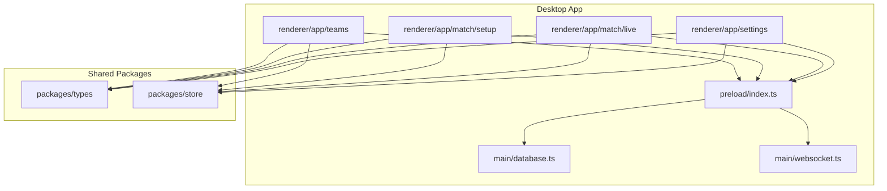
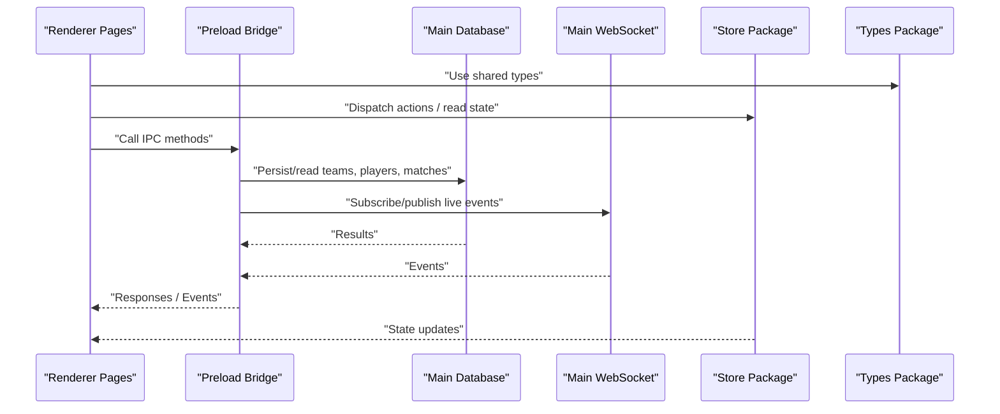
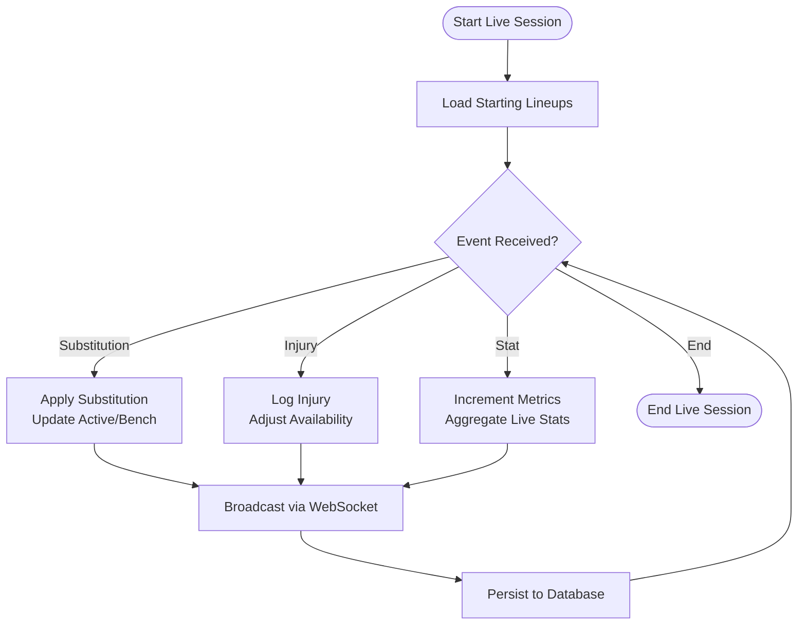
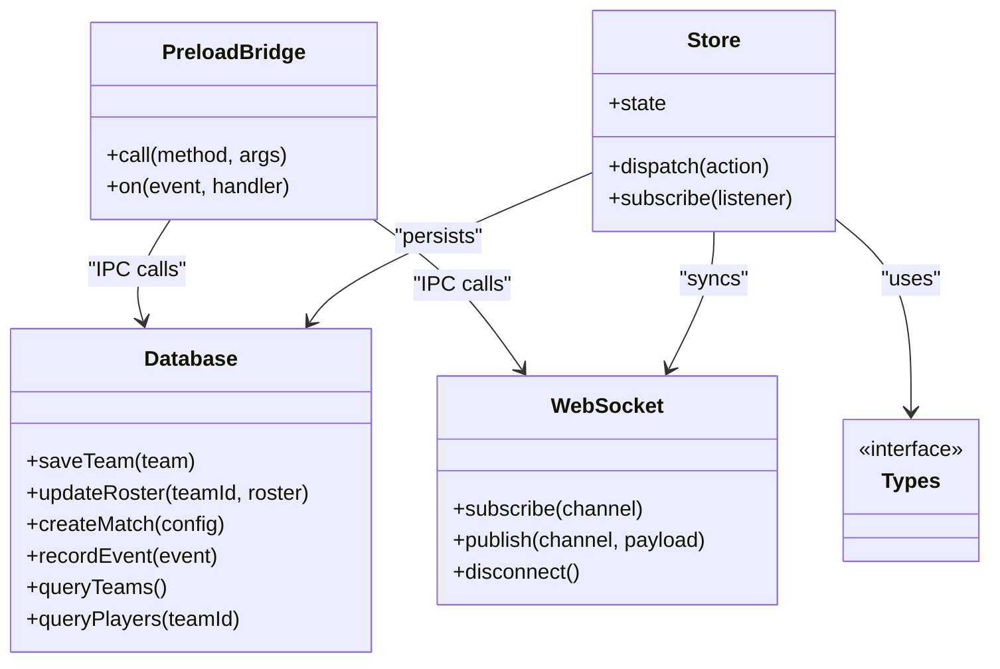
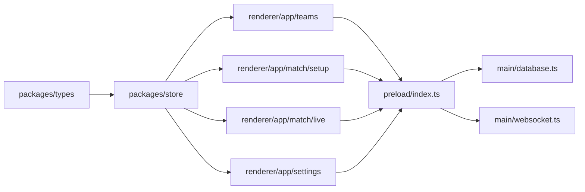

# Team and Player Management

<cite>
**Referenced Files in This Document**
- [package.json](file://package.json)
- [pnpm-workspace.yaml](file://pnpm-workspace.yaml)
- [turbo.json](file://turbo.json)
- [desktop/src/main/database.ts](file://apps/desktop/src/main/database.ts)
- [desktop/src/main/websocket.ts](file://apps/desktop/src/main/websocket.ts)
- [desktop/src/preload/index.ts](file://apps/desktop/src/preload/index.ts)
- [desktop/src/renderer/app/teams/page.tsx](file://apps/desktop/src/renderer/app/teams/page.tsx)
- [desktop/src/renderer/app/match/setup/page.tsx](file://apps/desktop/src/renderer/app/match/setup/page.tsx)
- [desktop/src/renderer/app/match/live/page.tsx](file://apps/desktop/src/renderer/app/match/live/page.tsx)
- [desktop/src/renderer/app/settings/page.tsx](file://apps/desktop/src/renderer/app/settings/page.tsx)
- [packages/types/src/index.ts](file://packages/types/src/index.ts)
- [packages/store/src/index.ts](file://packages/store/src/index.ts)
</cite>

## Table of Contents
1. [Introduction](#introduction)
2. [Project Structure](#project-structure)
3. [Core Components](#core-components)
4. [Architecture Overview](#architecture-overview)
5. [Detailed Component Analysis](#detailed-component-analysis)
6. [Dependency Analysis](#dependency-analysis)
7. [Performance Considerations](#performance-considerations)
8. [Troubleshooting Guide](#troubleshooting-guide)
9. [Conclusion](#conclusion)
10. [Appendices](#appendices)

## Introduction
This document explains the team and player management functionality across the desktop application, covering:
- Team creation and configuration (colors, logos, abbreviations, branding)
- Roster management and player assignment workflows
- Player data models (personal information, statistics, jersey numbers, positions)
- Substitution systems, injury tracking, and performance metrics collection
- Bulk operations, team templates, and integration with external player databases
- Validation rules, data relationships, and synchronization across matches and tournaments

The goal is to provide a clear, progressive understanding for both technical and non-technical readers.

## Project Structure
At a high level, the workspace includes multiple apps and shared packages. The desktop app contains renderer pages for teams, match setup, live match, and settings, along with main process utilities for database and WebSocket communication. Shared types and store logic are provided by packages.

**Diagram sources**
- [desktop/src/renderer/app/teams/page.tsx](file://apps/desktop/src/renderer/app/teams/page.tsx)
- [desktop/src/renderer/app/match/setup/page.tsx](file://apps/desktop/src/renderer/app/match/setup/page.tsx)
- [desktop/src/renderer/app/match/live/page.tsx](file://apps/desktop/src/renderer/app/match/live/page.tsx)
- [desktop/src/renderer/app/settings/page.tsx](file://apps/desktop/src/renderer/app/settings/page.tsx)
- [desktop/src/main/database.ts](file://apps/desktop/src/main/database.ts)
- [desktop/src/main/websocket.ts](file://apps/desktop/src/main/websocket.ts)
- [desktop/src/preload/index.ts](file://apps/desktop/src/preload/index.ts)
- [packages/types/src/index.ts](file://packages/types/src/index.ts)
- [packages/store/src/index.ts](file://packages/store/src/index.ts)

**Section sources**
- [package.json](file://package.json)
- [pnpm-workspace.yaml](file://pnpm-workspace.yaml)
- [turbo.json](file://turbo.json)

## Core Components
- Teams UI: Provides team creation, editing, and roster management from the renderer.
- Match Setup UI: Configures teams for a match, including starting lineups and bench players.
- Live Match UI: Manages substitutions, tracks injuries, and records performance events during play.
- Settings UI: Manages global preferences and integrations such as external player databases.
- Database layer: Persists teams, rosters, players, and match-related state.
- WebSocket layer: Synchronizes live updates across clients or processes.
- Types package: Defines shared data models for teams, players, and match entities.
- Store package: Holds application state and exposes actions for mutations and queries.

Key responsibilities:
- Data modeling and validation at the type layer
- State management and persistence via store and database
- User workflows for team and player operations in renderer pages
- Real-time sync through WebSocket for live scenarios

**Section sources**
- [desktop/src/renderer/app/teams/page.tsx](file://apps/desktop/src/renderer/app/teams/page.tsx)
- [desktop/src/renderer/app/match/setup/page.tsx](file://apps/desktop/src/renderer/app/match/setup/page.tsx)
- [desktop/src/renderer/app/match/live/page.tsx](file://apps/desktop/src/renderer/app/match/live/page.tsx)
- [desktop/src/renderer/app/settings/page.tsx](file://apps/desktop/src/renderer/app/settings/page.tsx)
- [desktop/src/main/database.ts](file://apps/desktop/src/main/database.ts)
- [desktop/src/main/websocket.ts](file://apps/desktop/src/main/websocket.ts)
- [packages/types/src/index.ts](file://packages/types/src/index.ts)
- [packages/store/src/index.ts](file://packages/store/src/index.ts)

## Architecture Overview
The system follows a layered architecture:
- Renderer pages implement user flows for teams, match setup, live match, and settings.
- Preload bridges renderer calls to main process services.
- Main process provides database access and WebSocket communication.
- Shared packages define types and manage application state.

**Diagram sources**
- [desktop/src/renderer/app/teams/page.tsx](file://apps/desktop/src/renderer/app/teams/page.tsx)
- [desktop/src/renderer/app/match/setup/page.tsx](file://apps/desktop/src/renderer/app/match/setup/page.tsx)
- [desktop/src/renderer/app/match/live/page.tsx](file://apps/desktop/src/renderer/app/match/live/page.tsx)
- [desktop/src/renderer/app/settings/page.tsx](file://apps/desktop/src/renderer/app/settings/page.tsx)
- [desktop/src/preload/index.ts](file://apps/desktop/src/preload/index.ts)
- [desktop/src/main/database.ts](file://apps/desktop/src/main/database.ts)
- [desktop/src/main/websocket.ts](file://apps/desktop/src/main/websocket.ts)
- [packages/store/src/index.ts](file://packages/store/src/index.ts)
- [packages/types/src/index.ts](file://packages/types/src/index.ts)

## Detailed Component Analysis

### Team Creation and Configuration
Team creation involves defining identity and branding elements:
- Identity: name, abbreviation, city/region
- Branding: primary and secondary colors, logo asset reference
- Metadata: conference/division, season tags, template references

Roster management allows adding/removing players, setting roles, and assigning jersey numbers and positions.

Validation considerations:
- Unique abbreviations per organization
- Jersey number ranges and uniqueness within a team
- Position assignments must be valid for the sport’s ruleset
- Required fields for team identity and branding assets

Bulk operations:
- Import rosters from CSV/JSON
- Apply template-based defaults (positions, numbering scheme)
- Batch update branding across multiple teams

Integration points:
- External player database connectors via settings
- Template registry for reusable team configurations

**Section sources**
- [desktop/src/renderer/app/teams/page.tsx](file://apps/desktop/src/renderer/app/teams/page.tsx)
- [desktop/src/renderer/app/settings/page.tsx](file://apps/desktop/src/renderer/app/settings/page.tsx)
- [packages/types/src/index.ts](file://packages/types/src/index.ts)
- [packages/store/src/index.ts](file://packages/store/src/index.ts)

### Player Data Models
Player entities include:
- Personal information: full name, date of birth, nationality, contact details
- Physical attributes: height, weight, preferred hand/side
- Role: position(s), role type (starter/bench), captaincy flags
- Identification: jersey number, unique ID, status (active/injured/reserve)
- Statistics: cumulative and per-match metrics (points, assists, rebounds, etc.)
- Media: photo/avatar, signature image

Relationships:
- Players belong to one or more teams over time
- Players participate in matches and accumulate stats
- Injuries and substitutions are tied to specific match instances

Complexity notes:
- Stats aggregation should be computed efficiently using indexed fields
- Historical snapshots preserve past values when attributes change

**Section sources**
- [packages/types/src/index.ts](file://packages/types/src/index.ts)
- [packages/store/src/index.ts](file://packages/store/src/index.ts)

### Roster Management and Player Assignment
Workflows:
- Add players to a team roster with required fields validated
- Assign jersey numbers ensuring uniqueness and compliance
- Set initial positions and roles; allow multiple positions per player
- Mark starters vs. bench for upcoming matches

Data integrity:
- Enforce constraints on jersey numbers and positions
- Prevent duplicate entries by unique identifiers
- Maintain audit trails for changes

**Section sources**
- [desktop/src/renderer/app/teams/page.tsx](file://apps/desktop/src/renderer/app/teams/page.tsx)
- [packages/types/src/index.ts](file://packages/types/src/index.ts)

### Match Setup and Starting Lineups
Match setup configures:
- Selected teams and match metadata
- Starting lineup selection and order
- Bench composition and substitution readiness
- Team-specific settings (colors, logos) applied to broadcast overlays

Validation:
- Ensure correct number of starters
- Validate that all selected players are on the team roster
- Confirm jersey numbers are assigned and valid

**Section sources**
- [desktop/src/renderer/app/match/setup/page.tsx](file://apps/desktop/src/renderer/app/match/setup/page.tsx)
- [packages/types/src/index.ts](file://packages/types/src/index.ts)

### Live Match: Substitutions, Injury Tracking, Performance Metrics
Substitution system:
- Swap active players with bench players
- Record substitution timestamps and reasons
- Update live stats and display overlays

Injury tracking:
- Log injury events with severity and estimated return
- Adjust availability and auto-remove from active lineup if needed

Performance metrics:
- Increment counters for key events (scoring, assists, turnovers)
- Aggregate real-time stats for broadcast and analytics

Synchronization:
- Use WebSocket to propagate live events to other clients
- Persist event logs to database for post-match analysis

**Diagram sources**
- [desktop/src/renderer/app/match/live/page.tsx](file://apps/desktop/src/renderer/app/match/live/page.tsx)
- [desktop/src/main/websocket.ts](file://apps/desktop/src/main/websocket.ts)
- [desktop/src/main/database.ts](file://apps/desktop/src/main/database.ts)

**Section sources**
- [desktop/src/renderer/app/match/live/page.tsx](file://apps/desktop/src/renderer/app/match/live/page.tsx)
- [desktop/src/main/websocket.ts](file://apps/desktop/src/main/websocket.ts)
- [desktop/src/main/database.ts](file://apps/desktop/src/main/database.ts)

### Settings and Integrations
Settings cover:
- Global preferences (theme, language, default team template)
- External player database connections (API keys, endpoints, sync schedules)
- Data import/export tools for bulk operations

Integration patterns:
- Fetch player profiles and stats from external sources
- Map external fields to internal models
- Handle conflicts and deduplication strategies

**Section sources**
- [desktop/src/renderer/app/settings/page.tsx](file://apps/desktop/src/renderer/app/settings/page.tsx)
- [packages/types/src/index.ts](file://packages/types/src/index.ts)

### Persistence and Real-Time Sync
Database layer:
- Stores teams, players, rosters, match configurations, and live events
- Supports transactions for consistency during bulk operations

WebSocket layer:
- Publishes live events (substitutions, injuries, stats)
- Subscribes to updates for synchronized views across clients

Preload bridge:
- Exposes safe IPC methods for renderer to call main process services
- Marshals requests and responses securely

**Diagram sources**
- [desktop/src/main/database.ts](file://apps/desktop/src/main/database.ts)
- [desktop/src/main/websocket.ts](file://apps/desktop/src/main/websocket.ts)
- [desktop/src/preload/index.ts](file://apps/desktop/src/preload/index.ts)
- [packages/store/src/index.ts](file://packages/store/src/index.ts)
- [packages/types/src/index.ts](file://packages/types/src/index.ts)

**Section sources**
- [desktop/src/main/database.ts](file://apps/desktop/src/main/database.ts)
- [desktop/src/main/websocket.ts](file://apps/desktop/src/main/websocket.ts)
- [desktop/src/preload/index.ts](file://apps/desktop/src/preload/index.ts)
- [packages/store/src/index.ts](file://packages/store/src/index.ts)
- [packages/types/src/index.ts](file://packages/types/src/index.ts)

## Dependency Analysis
High-level dependencies:
- Renderer pages depend on shared types and store for state and validation
- Preload depends on main process modules for persistence and networking
- Main process modules encapsulate external concerns (database, WebSocket)
- Store coordinates state changes and triggers persistence/sync

**Diagram sources**
- [packages/types/src/index.ts](file://packages/types/src/index.ts)
- [packages/store/src/index.ts](file://packages/store/src/index.ts)
- [desktop/src/renderer/app/teams/page.tsx](file://apps/desktop/src/renderer/app/teams/page.tsx)
- [desktop/src/renderer/app/match/setup/page.tsx](file://apps/desktop/src/renderer/app/match/setup/page.tsx)
- [desktop/src/renderer/app/match/live/page.tsx](file://apps/desktop/src/renderer/app/match/live/page.tsx)
- [desktop/src/renderer/app/settings/page.tsx](file://apps/desktop/src/renderer/app/settings/page.tsx)
- [desktop/src/preload/index.ts](file://apps/desktop/src/preload/index.ts)
- [desktop/src/main/database.ts](file://apps/desktop/src/main/database.ts)
- [desktop/src/main/websocket.ts](file://apps/desktop/src/main/websocket.ts)

**Section sources**
- [packages/types/src/index.ts](file://packages/types/src/index.ts)
- [packages/store/src/index.ts](file://packages/store/src/index.ts)
- [desktop/src/preload/index.ts](file://apps/desktop/src/preload/index.ts)
- [desktop/src/main/database.ts](file://apps/desktop/src/main/database.ts)
- [desktop/src/main/websocket.ts](file://apps/desktop/src/main/websocket.ts)

## Performance Considerations
- Efficient indexing on frequently queried fields (team IDs, player IDs, match IDs)
- Batched writes for bulk operations to reduce transaction overhead
- Debounced live updates to avoid excessive re-renders
- Lazy loading of heavy assets (logos, photos)
- Caching of static team configurations and templates

[No sources needed since this section provides general guidance]

## Troubleshooting Guide
Common issues and resolutions:
- Duplicate jersey numbers: ensure uniqueness checks run before save
- Invalid positions: validate against allowed sets per sport/ruleset
- Missing required fields: enforce mandatory fields in forms and API payloads
- Sync failures: check WebSocket connection status and retry logic
- Data inconsistencies: verify transaction boundaries and rollback behavior

Operational tips:
- Inspect IPC method calls and error responses via preload logs
- Review persisted events for discrepancies in live sessions
- Re-run validation suites after schema changes

**Section sources**
- [desktop/src/preload/index.ts](file://apps/desktop/src/preload/index.ts)
- [desktop/src/main/database.ts](file://apps/desktop/src/main/database.ts)
- [desktop/src/main/websocket.ts](file://apps/desktop/src/main/websocket.ts)

## Conclusion
The team and player management system integrates robust data modeling, state management, persistence, and real-time synchronization. By leveraging shared types and a well-structured store, the renderer pages deliver intuitive workflows for team creation, roster management, and live match operations. Proper validation, bulk operation support, and external integrations enable scalable and reliable operations across matches and tournaments.

[No sources needed since this section summarizes without analyzing specific files]

## Appendices

### Example Workflows

#### Team Creation and Branding
- Define team identity and branding
- Upload logo and set color schemes
- Save team and create initial roster template

**Section sources**
- [desktop/src/renderer/app/teams/page.tsx](file://apps/desktop/src/renderer/app/teams/page.tsx)
- [desktop/src/renderer/app/settings/page.tsx](file://apps/desktop/src/renderer/app/settings/page.tsx)

#### Roster Management and Player Assignment
- Add players with personal info and physical attributes
- Assign jersey numbers and positions
- Validate constraints and persist changes

**Section sources**
- [desktop/src/renderer/app/teams/page.tsx](file://apps/desktop/src/renderer/app/teams/page.tsx)
- [packages/types/src/index.ts](file://packages/types/src/index.ts)

#### Match Setup and Starting Lineups
- Select teams and configure match metadata
- Choose starters and bench players
- Validate lineup sizes and jersey assignments

**Section sources**
- [desktop/src/renderer/app/match/setup/page.tsx](file://apps/desktop/src/renderer/app/match/setup/page.tsx)
- [packages/types/src/index.ts](file://packages/types/src/index.ts)

#### Live Match Operations
- Apply substitutions and log reasons
- Track injuries and adjust availability
- Record performance metrics and broadcast updates

**Section sources**
- [desktop/src/renderer/app/match/live/page.tsx](file://apps/desktop/src/renderer/app/match/live/page.tsx)
- [desktop/src/main/websocket.ts](file://apps/desktop/src/main/websocket.ts)
- [desktop/src/main/database.ts](file://apps/desktop/src/main/database.ts)

#### Bulk Operations and Templates
- Import rosters from CSV/JSON
- Apply team templates to standardize branding and numbering
- Sync with external player databases

**Section sources**
- [desktop/src/renderer/app/settings/page.tsx](file://apps/desktop/src/renderer/app/settings/page.tsx)
- [packages/types/src/index.ts](file://packages/types/src/index.ts)