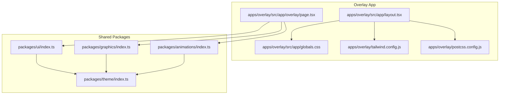
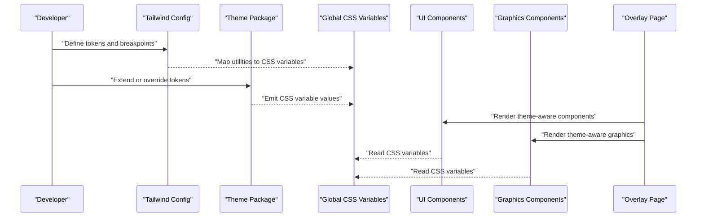
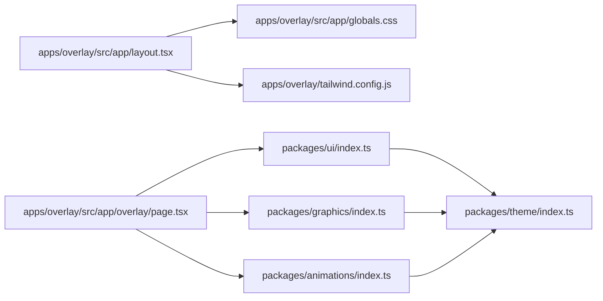

# Customization and Theming

<cite>
**Referenced Files in This Document**
- [globals.css](file://apps/overlay/src/app/globals.css)
- [layout.tsx](file://apps/overlay/src/app/layout.tsx)
- [page.tsx](file://apps/overlay/src/app/overlay/page.tsx)
- [tailwind.config.js](file://apps/overlay/tailwind.config.js)
- [postcss.config.js](file://apps/overlay/postcss.config.js)
- [theme/index.ts](file://packages/theme/index.ts)
- [ui/index.ts](file://packages/ui/index.ts)
- [graphics/index.ts](file://packages/graphics/index.ts)
- [animations/index.ts](file://packages/animations/index.ts)
</cite>

## Table of Contents
1. [Introduction](#introduction)
2. [Project Structure](#project-structure)
3. [Core Components](#core-components)
4. [Architecture Overview](#architecture-overview)
5. [Detailed Component Analysis](#detailed-component-analysis)
6. [Dependency Analysis](#dependency-analysis)
7. [Performance Considerations](#performance-considerations)
8. [Troubleshooting Guide](#troubleshooting-guide)
9. [Conclusion](#conclusion)
10. [Appendices](#appendices)

## Introduction
This document explains how to customize and theme the overlay application, focusing on the theme system architecture, color schemes, typography options, and branding customization. It covers CSS variables, component styling overrides, responsive design patterns, and the process for creating custom themes. You will learn how to integrate brand assets (logos, fonts), implement team-specific themes, and maintain visual consistency across different overlay configurations used in professional broadcast presentations.

## Project Structure
The overlay app is a Next.js application with shared packages for theming, UI components, graphics, and animations. The key areas for customization are:
- Global styles and CSS variables in the overlay app’s global stylesheet
- Tailwind configuration for tokens and responsive scales
- Shared theme package that centralizes design tokens and theme resolution
- UI and graphics packages that consume theme tokens for consistent rendering

**Diagram sources**
- [layout.tsx](file://apps/overlay/src/app/layout.tsx)
- [page.tsx](file://apps/overlay/src/app/overlay/page.tsx)
- [globals.css](file://apps/overlay/src/app/globals.css)
- [tailwind.config.js](file://apps/overlay/tailwind.config.js)
- [postcss.config.js](file://apps/overlay/postcss.config.js)
- [theme/index.ts](file://packages/theme/index.ts)
- [ui/index.ts](file://packages/ui/index.ts)
- [graphics/index.ts](file://packages/graphics/index.ts)
- [animations/index.ts](file://packages/animations/index.ts)

**Section sources**
- [layout.tsx](file://apps/overlay/src/app/layout.tsx)
- [page.tsx](file://apps/overlay/src/app/overlay/page.tsx)
- [globals.css](file://apps/overlay/src/app/globals.css)
- [tailwind.config.js](file://apps/overlay/tailwind.config.js)
- [postcss.config.js](file://apps/overlay/postcss.config.js)
- [theme/index.ts](file://packages/theme/index.ts)
- [ui/index.ts](file://packages/ui/index.ts)
- [graphics/index.ts](file://packages/graphics/index.ts)
- [animations/index.ts](file://packages/animations/index.ts)

## Core Components
- Theme registry and token definitions: Centralized design tokens (colors, typography, spacing, radii, shadows) are provided by the theme package and consumed by UI and graphics components.
- Global CSS variables: Root-level CSS variables expose tokens to the DOM for runtime overrides and per-theme switching.
- Tailwind integration: Tailwind configuration maps utility classes to tokens and defines breakpoints and animation primitives.
- Overlay page composition: The overlay page composes UI and graphics components, applying theme-aware styles and responsive behavior.

Key responsibilities:
- Theme package: Define default tokens, provide APIs to resolve or extend themes, and export typed tokens.
- UI package: Consume tokens for layout, typography, colors, and motion; ensure consistent component appearance.
- Graphics package: Render broadcast-ready visuals using theme tokens for colors, fonts, and sizing.
- Animations package: Provide motion primitives driven by tokens such as durations and easing curves.

**Section sources**
- [theme/index.ts](file://packages/theme/index.ts)
- [ui/index.ts](file://packages/ui/index.ts)
- [graphics/index.ts](file://packages/graphics/index.ts)
- [animations/index.ts](file://packages/animations/index.ts)
- [globals.css](file://apps/overlay/src/app/globals.css)
- [tailwind.config.js](file://apps/overlay/tailwind.config.js)

## Architecture Overview
The theme system follows a layered approach:
- Design tokens are defined centrally and exposed via CSS variables.
- Tailwind utilities reference these tokens for consistent styling.
- UI and graphics components consume tokens programmatically and through CSS variables.
- The overlay page orchestrates components and applies responsive rules.

**Diagram sources**
- [tailwind.config.js](file://apps/overlay/tailwind.config.js)
- [theme/index.ts](file://packages/theme/index.ts)
- [globals.css](file://apps/overlay/src/app/globals.css)
- [ui/index.ts](file://packages/ui/index.ts)
- [graphics/index.ts](file://packages/graphics/index.ts)
- [page.tsx](file://apps/overlay/src/app/overlay/page.tsx)

## Detailed Component Analysis

### Theme System and Tokens
- Token categories include colors (brand, semantic, neutral), typography (font families, sizes, weights, line heights), spacing, radii, shadows, and motion (durations, easings).
- The theme package provides functions to resolve tokens based on context (e.g., light/dark mode, team context).
- Tokens are emitted as CSS variables at the root level for runtime overrides.

Implementation guidance:
- Extend the default theme by adding new tokens or overriding existing ones.
- Use the theme API to access tokens within components and graphics.
- Ensure all tokens have sensible defaults and fallbacks.

**Section sources**
- [theme/index.ts](file://packages/theme/index.ts)
- [globals.css](file://apps/overlay/src/app/globals.css)

### Global Styles and CSS Variables
- Root-level CSS variables define the active theme instance.
- Utilities and components read these variables to render consistently.
- Overrides can be applied at runtime by updating CSS variables on the document root or specific containers.

Best practices:
- Group related variables under logical namespaces (e.g., colors, typography).
- Provide clear naming conventions for tokens.
- Keep critical overrides minimal and scoped to avoid conflicts.

**Section sources**
- [globals.css](file://apps/overlay/src/app/globals.css)

### Tailwind Configuration and Responsive Patterns
- Tailwind config maps tokens to utility classes and defines breakpoints for responsive layouts.
- Animation utilities are configured to use token-driven durations and easings.
- Custom plugins or presets can be added to support broadcast-safe scaling and safe-area insets.

Responsive strategy:
- Use small-to-large breakpoint progression for overlays.
- Prefer relative units and tokens for font sizes and spacing.
- Test at common broadcast resolutions and aspect ratios.

**Section sources**
- [tailwind.config.js](file://apps/overlay/tailwind.config.js)
- [postcss.config.js](file://apps/overlay/postcss.config.js)

### Overlay Page Composition
- The overlay page composes UI and graphics components, applying theme-aware styles and responsive behavior.
- It sets up any necessary providers or contexts for theme resolution.
- It ensures that assets (logos, fonts) are loaded and available to components.

Operational notes:
- Load brand assets early to prevent layout shifts.
- Apply theme context before rendering components.
- Validate asset paths and formats for broadcast environments.

**Section sources**
- [layout.tsx](file://apps/overlay/src/app/layout.tsx)
- [page.tsx](file://apps/overlay/src/app/overlay/page.tsx)

### UI Components and Styling Overrides
- UI components consume tokens from the theme package and CSS variables.
- They provide props to adjust appearance while preserving token-based consistency.
- Overrides should be done via theme extensions rather than ad-hoc CSS where possible.

Guidelines:
- Prefer token-driven props over inline styles.
- Use component variants sparingly; prefer theme tokens for variations.
- Maintain accessibility by ensuring sufficient contrast and scalable text.

**Section sources**
- [ui/index.ts](file://packages/ui/index.ts)
- [globals.css](file://apps/overlay/src/app/globals.css)

### Graphics and Broadcast Visuals
- Graphics components render overlays, lower thirds, score bugs, and other broadcast elements.
- They rely on theme tokens for colors, typography, and sizing.
- Motion primitives from the animations package drive transitions and reveals.

Production considerations:
- Optimize asset sizes and formats for real-time rendering.
- Avoid heavy filters or effects that may impact performance.
- Ensure legibility at various screen sizes and compression levels.

**Section sources**
- [graphics/index.ts](file://packages/graphics/index.ts)
- [animations/index.ts](file://packages/animations/index.ts)
- [theme/index.ts](file://packages/theme/index.ts)

### Creating Custom Themes
Steps:
- Define a theme object extending the default tokens (colors, typography, spacing, motion).
- Register the theme with the theme registry or provider.
- Update CSS variables if needed for runtime overrides.
- Verify components and graphics reflect the new tokens.

Team-specific example workflow:
- Create a team theme with brand colors and logo references.
- Configure typography to match brand guidelines.
- Apply the theme context in the overlay page.
- Test across multiple screens and capture outputs for QA.

**Section sources**
- [theme/index.ts](file://packages/theme/index.ts)
- [layout.tsx](file://apps/overlay/src/app/layout.tsx)
- [page.tsx](file://apps/overlay/src/app/overlay/page.tsx)
- [globals.css](file://apps/overlay/src/app/globals.css)

### Integrating Brand Assets
Fonts:
- Add custom font files and declare them in the theme or layout.
- Reference font families via tokens to keep usage consistent.

Logos and images:
- Place assets in an accessible path and reference them via tokens or configuration.
- Ensure proper caching and preloading for smooth playback.

Accessibility and quality:
- Provide alt text and labels where applicable.
- Use high-resolution assets suitable for broadcast.

**Section sources**
- [layout.tsx](file://apps/overlay/src/app/layout.tsx)
- [theme/index.ts](file://packages/theme/index.ts)

### Maintaining Visual Consistency
- Centralize tokens and avoid hard-coded values in components.
- Use Tailwind utilities mapped to tokens for consistent spacing and sizing.
- Establish review criteria for theme changes (contrast, readability, brand alignment).
- Automate checks for token usage and accessibility constraints.

**Section sources**
- [tailwind.config.js](file://apps/overlay/tailwind.config.js)
- [globals.css](file://apps/overlay/src/app/globals.css)
- [theme/index.ts](file://packages/theme/index.ts)

## Dependency Analysis
The overlay app depends on shared packages for theming, UI, graphics, and animations. Tailwind and PostCSS configure the build pipeline for tokens and utilities.

**Diagram sources**
- [layout.tsx](file://apps/overlay/src/app/layout.tsx)
- [globals.css](file://apps/overlay/src/app/globals.css)
- [tailwind.config.js](file://apps/overlay/tailwind.config.js)
- [page.tsx](file://apps/overlay/src/app/overlay/page.tsx)
- [ui/index.ts](file://packages/ui/index.ts)
- [graphics/index.ts](file://packages/graphics/index.ts)
- [animations/index.ts](file://packages/animations/index.ts)
- [theme/index.ts](file://packages/theme/index.ts)

**Section sources**
- [layout.tsx](file://apps/overlay/src/app/layout.tsx)
- [page.tsx](file://apps/overlay/src/app/overlay/page.tsx)
- [globals.css](file://apps/overlay/src/app/globals.css)
- [tailwind.config.js](file://apps/overlay/tailwind.config.js)
- [ui/index.ts](file://packages/ui/index.ts)
- [graphics/index.ts](file://packages/graphics/index.ts)
- [animations/index.ts](file://packages/animations/index.ts)
- [theme/index.ts](file://packages/theme/index.ts)

## Performance Considerations
- Minimize runtime theme switches; prefer static theme selection when possible.
- Preload critical assets (fonts, logos) to avoid layout shifts.
- Use token-driven utilities to reduce CSS bloat and improve rendering speed.
- Avoid excessive animations; leverage hardware-accelerated properties.
- Profile overlay rendering at target resolutions and frame rates.

[No sources needed since this section provides general guidance]

## Troubleshooting Guide
Common issues and resolutions:
- Colors not reflecting theme changes:
  - Verify CSS variables are updated at the correct scope.
  - Ensure components read tokens from the theme and not hard-coded values.
- Fonts not loading:
  - Confirm font declarations and file paths.
  - Check browser/network logs for missing resources.
- Layout shifts during asset load:
  - Preload assets and reserve space with placeholders.
- Inconsistent spacing or sizing:
  - Audit Tailwind mappings and token usage.
  - Replace ad-hoc values with tokens.

**Section sources**
- [globals.css](file://apps/overlay/src/app/globals.css)
- [tailwind.config.js](file://apps/overlay/tailwind.config.js)
- [theme/index.ts](file://packages/theme/index.ts)

## Conclusion
By centralizing design tokens, exposing them via CSS variables, and integrating with Tailwind and component libraries, the overlay system enables robust customization and theming. Teams can create distinct brand experiences while maintaining consistency and performance. Follow the outlined processes for theme creation, asset integration, and responsive design to deliver professional broadcast-quality overlays.

[No sources needed since this section summarizes without analyzing specific files]

## Appendices

### Quick Start: Team-Specific Theme
- Define team tokens (colors, typography, spacing).
- Register the theme and apply it in the overlay layout.
- Update global CSS variables if runtime overrides are required.
- Validate across devices and capture sample renders.

**Section sources**
- [theme/index.ts](file://packages/theme/index.ts)
- [layout.tsx](file://apps/overlay/src/app/layout.tsx)
- [globals.css](file://apps/overlay/src/app/globals.css)

### Example Workflows
- Implementing custom fonts:
  - Declare font families in the theme and layout.
  - Reference tokens in components and graphics.
- Adding brand logos:
  - Place assets in the public directory.
  - Reference via configuration or tokens in graphics components.
- Applying visual styles:
  - Adjust tokens for radii, shadows, and motion.
  - Use Tailwind utilities mapped to tokens for consistent styling.

**Section sources**
- [layout.tsx](file://apps/overlay/src/app/layout.tsx)
- [theme/index.ts](file://packages/theme/index.ts)
- [graphics/index.ts](file://packages/graphics/index.ts)
- [tailwind.config.js](file://apps/overlay/tailwind.config.js)