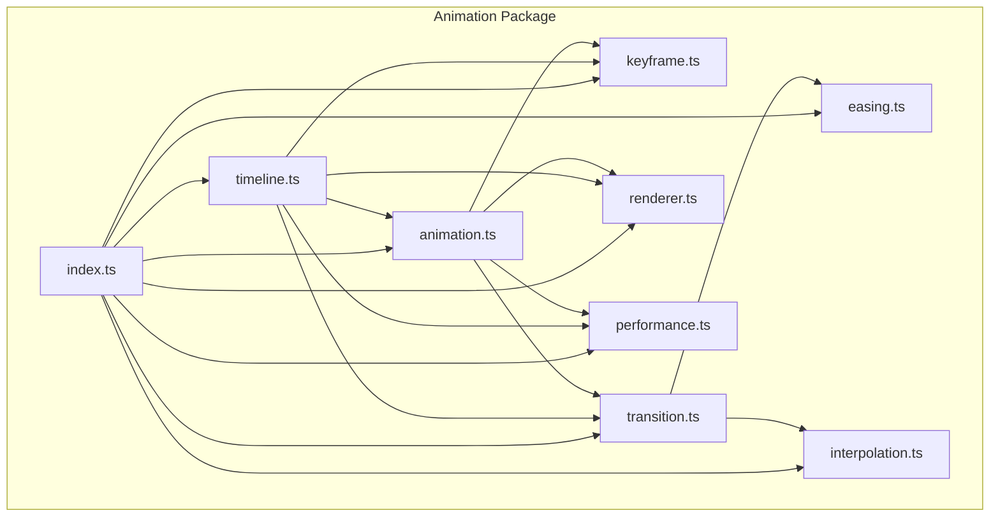
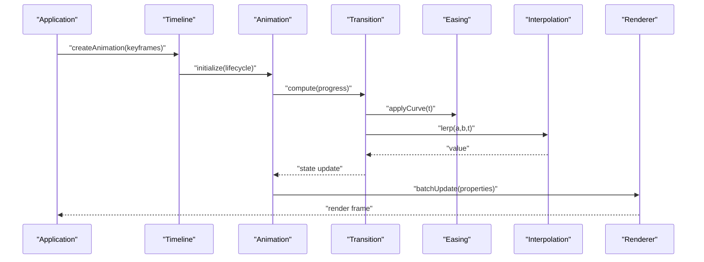
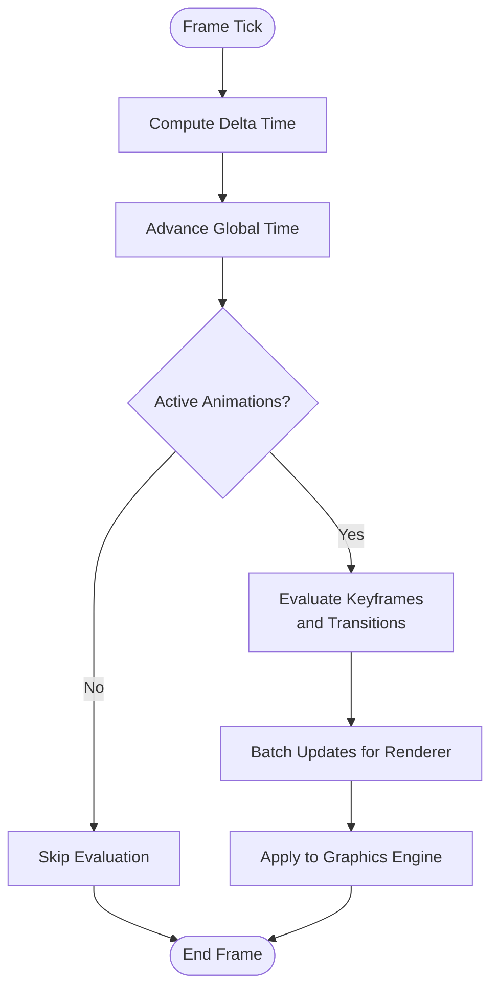
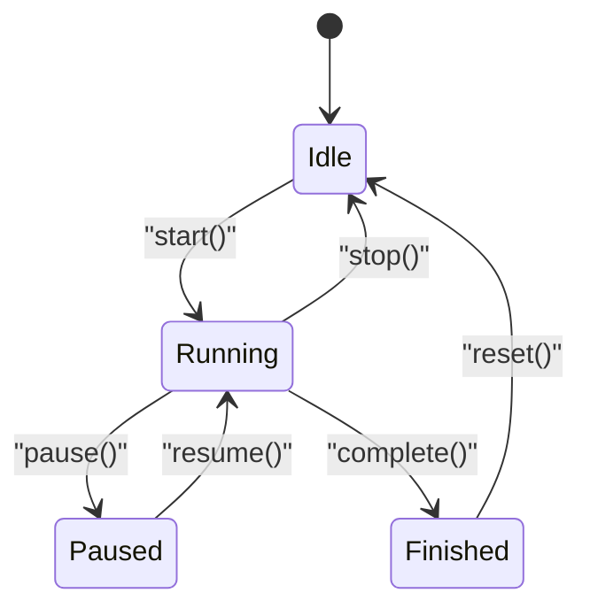
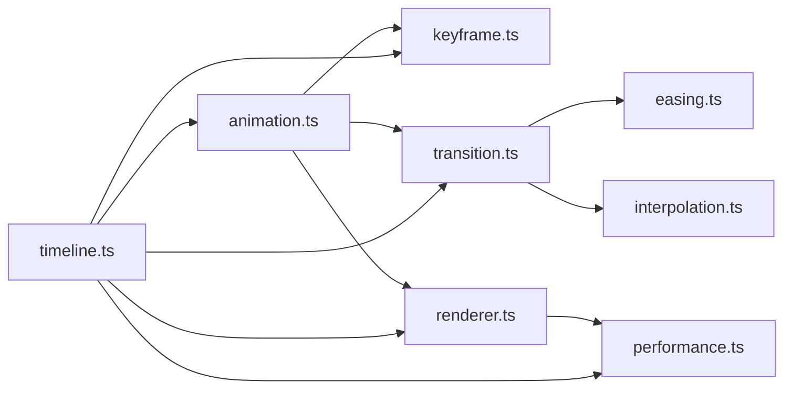

# Animation Framework

<cite>
**Referenced Files in This Document**
- [package.json](file://packages/animations/package.json)
- [index.ts](file://packages/animations/src/index.ts)
- [timeline.ts](file://packages/animations/src/timeline.ts)
- [easing.ts](file://packages/animations/src/easing.ts)
- [interpolation.ts](file://packages/animations/src/interpolation.ts)
- [animation.ts](file://packages/animations/src/animation.ts)
- [keyframe.ts](file://packages/animations/src/keyframe.ts)
- [transition.ts](file://packages/animations/src/transition.ts)
- [renderer.ts](file://packages/animations/src/renderer.ts)
- [performance.ts](file://packages/animations/src/performance.ts)
</cite>

## Table of Contents
1. [Introduction](#introduction)
2. [Project Structure](#project-structure)
3. [Core Components](#core-components)
4. [Architecture Overview](#architecture-overview)
5. [Detailed Component Analysis](#detailed-component-analysis)
6. [Dependency Analysis](#dependency-analysis)
7. [Performance Considerations](#performance-considerations)
8. [Troubleshooting Guide](#troubleshooting-guide)
9. [Conclusion](#conclusion)
10. [Appendices](#appendices)

## Introduction
This document describes the animation framework integrated with the graphics engine. It explains the timeline system, easing functions, and interpolation methods; the animation lifecycle and keyframe management; transition effects; and performance strategies for smooth 60fps output using requestAnimationFrame, batching, and GPU acceleration. It also provides examples for building complex motion sequences, handling animation events, and optimizing for broadcast-quality results.

## Project Structure
The animation framework is implemented as a dedicated package within the workspace. The core modules include:
- Timeline orchestration and scheduling
- Easing function registry and composition
- Interpolation utilities for numeric, vector, color, and custom types
- Animation lifecycle and state machine
- Keyframe definition and management
- Transition effect definitions and application
- Rendering integration and batched updates
- Performance helpers for frame pacing and throttling

**Diagram sources**
- [index.ts](file://packages/animations/src/index.ts)
- [timeline.ts](file://packages/animations/src/timeline.ts)
- [easing.ts](file://packages/animations/src/easing.ts)
- [interpolation.ts](file://packages/animations/src/interpolation.ts)
- [animation.ts](file://packages/animations/src/animation.ts)
- [keyframe.ts](file://packages/animations/src/keyframe.ts)
- [transition.ts](file://packages/animations/src/transition.ts)
- [renderer.ts](file://packages/animations/src/renderer.ts)
- [performance.ts](file://packages/animations/src/performance.ts)

**Section sources**
- [package.json](file://packages/animations/package.json)
- [index.ts](file://packages/animations/src/index.ts)

## Core Components
- Timeline: Central scheduler that drives time progression, manages active animations, and coordinates transitions and keyframes.
- Animation: Encapsulates lifecycle states (idle, running, paused, finished), progress tracking, and event dispatching.
- Keyframe: Defines discrete values at specific times and supports per-property overrides.
- Transition: Applies easing and interpolation between keyframes to produce smooth value changes over time.
- Easing: Provides standard and custom easing curves, including composition and inversion utilities.
- Interpolation: Supplies linear, spline, and color interpolation across scalar, vector, and typed data.
- Renderer: Integrates with the graphics engine, batching updates and leveraging GPU-friendly operations.
- Performance: Utilities for frame pacing, requestAnimationFrame scheduling, and throttling to maintain stable 60fps.

**Section sources**
- [timeline.ts](file://packages/animations/src/timeline.ts)
- [animation.ts](file://packages/animations/src/animation.ts)
- [keyframe.ts](file://packages/animations/src/keyframe.ts)
- [transition.ts](file://packages/animations/src/transition.ts)
- [easing.ts](file://packages/animations/src/easing.ts)
- [interpolation.ts](file://packages/animations/src/interpolation.ts)
- [renderer.ts](file://packages/animations/src/renderer.ts)
- [performance.ts](file://packages/animations/src/performance.ts)

## Architecture Overview
The framework follows a layered architecture:
- Orchestration Layer: Timeline controls scheduling and sequencing.
- State Layer: Animation maintains lifecycle and progress.
- Data Layer: Keyframes define target values and timing.
- Computation Layer: Transitions compute eased values via easing and interpolation.
- Integration Layer: Renderer applies computed values to the graphics engine efficiently.
- Performance Layer: Ensures consistent frame pacing and minimizes CPU/GPU overhead.

**Diagram sources**
- [timeline.ts](file://packages/animations/src/timeline.ts)
- [animation.ts](file://packages/animations/src/animation.ts)
- [transition.ts](file://packages/animations/src/transition.ts)
- [easing.ts](file://packages/animations/src/easing.ts)
- [interpolation.ts](file://packages/animations/src/interpolation.ts)
- [renderer.ts](file://packages/animations/src/renderer.ts)

## Detailed Component Analysis

### Timeline System
Responsibilities:
- Maintain global time and delta calculations
- Schedule animations by start time, duration, and delay
- Manage playback control (play, pause, seek, stop)
- Coordinate transitions and keyframe evaluation order
- Dispatch timeline-level events (start, tick, end)

Key behaviors:
- Frame-driven loop using requestAnimationFrame
- Batched evaluation of active animations per frame
- Priority-based ordering for overlapping animations
- Time clamping and overflow handling

**Diagram sources**
- [timeline.ts](file://packages/animations/src/timeline.ts)
- [performance.ts](file://packages/animations/src/performance.ts)
- [renderer.ts](file://packages/animations/src/renderer.ts)

**Section sources**
- [timeline.ts](file://packages/animations/src/timeline.ts)
- [performance.ts](file://packages/animations/src/performance.ts)

### Easing Functions
Capabilities:
- Standard curves (linear, ease-in, ease-out, ease-in-out)
- Custom curve registration and lookup
- Composition (chain multiple easings)
- Inversion and scaling utilities

Usage patterns:
- Per-transition easing selection
- Property-specific easing overrides
- Dynamic easing based on runtime conditions

**Section sources**
- [easing.ts](file://packages/animations/src/easing.ts)

### Interpolation Methods
Supported types:
- Scalar numbers
- Vectors (2D, 3D, 4D)
- Colors (RGB, RGBA, HSL)
- Custom interpolators via registered handlers

Features:
- Linear interpolation and spline-based smoothing
- Clamping and wrapping modes
- Multi-property interpolation in a single pass

**Section sources**
- [interpolation.ts](file://packages/animations/src/interpolation.ts)

### Animation Lifecycle
States:
- Idle: Initialized but not started
- Running: Actively progressing
- Paused: Progress frozen
- Finished: Completed or stopped

Controls:
- Play/Pause toggles
- Seek to arbitrary time
- Stop and reset
- Event hooks for lifecycle transitions

**Diagram sources**
- [animation.ts](file://packages/animations/src/animation.ts)

**Section sources**
- [animation.ts](file://packages/animations/src/animation.ts)

### Keyframe Management
Structure:
- Keyframe entries with time offsets and property values
- Per-keyframe easing overrides
- Grouped keyframes for multi-property sequences

Operations:
- Add/remove keyframes dynamically
- Merge keyframes from multiple sources
- Validate timing and resolve conflicts

**Section sources**
- [keyframe.ts](file://packages/animations/src/keyframe.ts)

### Transition Effects
Definition:
- Transition objects map properties to easing and interpolation configurations
- Support for chained transitions and conditional branches

Application:
- Compute eased values per frame
- Apply transitions to current animation state
- Handle property blending and priority resolution

**Section sources**
- [transition.ts](file://packages/animations/src/transition.ts)

### Renderer Integration
Integration points:
- Batched updates to minimize draw calls
- GPU-friendly transformations (matrix, uniforms)
- Layered compositing for overlays and effects

Optimizations:
- Coalesce property writes
- Avoid redundant computations
- Use object pooling where applicable

**Section sources**
- [renderer.ts](file://packages/animations/src/renderer.ts)

## Dependency Analysis
Internal dependencies:
- Timeline depends on Animation, Keyframe, Transition, Renderer, and Performance
- Animation depends on Keyframe, Transition, and Renderer
- Transition depends on Easing and Interpolation
- Renderer depends on Performance for frame pacing

External dependencies:
- Graphics engine APIs for rendering
- Browser APIs (requestAnimationFrame) for scheduling

**Diagram sources**
- [timeline.ts](file://packages/animations/src/timeline.ts)
- [animation.ts](file://packages/animations/src/animation.ts)
- [keyframe.ts](file://packages/animations/src/keyframe.ts)
- [transition.ts](file://packages/animations/src/transition.ts)
- [easing.ts](file://packages/animations/src/easing.ts)
- [interpolation.ts](file://packages/animations/src/interpolation.ts)
- [renderer.ts](file://packages/animations/src/renderer.ts)
- [performance.ts](file://packages/animations/src/performance.ts)

**Section sources**
- [index.ts](file://packages/animations/src/index.ts)

## Performance Considerations
Strategies for smooth 60fps:
- Use requestAnimationFrame for frame scheduling
- Batch property updates to reduce renderer overhead
- Prefer GPU-accelerated transforms (position, scale, rotation, opacity)
- Minimize allocations during frame loops; reuse objects
- Limit expensive computations; cache intermediate results
- Throttle heavy tasks outside the main thread when possible

Practical tips:
- Keep keyframe counts reasonable; prefer fewer, well-spaced keyframes
- Use simple easing curves for high-frequency animations
- Avoid frequent re-layouts; batch DOM or canvas updates
- Monitor frame time budgets and drop non-critical work under load

[No sources needed since this section provides general guidance]

## Troubleshooting Guide
Common issues and resolutions:
- Jittery animations: Ensure consistent delta time and avoid blocking the main thread
- Stutter on start: Pre-warm transitions and precompute easing tables if necessary
- Overdraw or lag: Reduce number of animated properties; leverage GPU paths
- Incorrect easing: Verify easing curve parameters and composition order
- Missed events: Check lifecycle state transitions and event subscription scope

Diagnostic steps:
- Log timeline ticks and per-animation progress
- Inspect renderer batch sizes and update frequency
- Profile frame times to identify hotspots

**Section sources**
- [performance.ts](file://packages/animations/src/performance.ts)
- [renderer.ts](file://packages/animations/src/renderer.ts)

## Conclusion
The animation framework provides a robust, modular system for orchestrating complex motion sequences with precise control over timing, easing, and interpolation. By adhering to performance best practices—such as batching, GPU acceleration, and careful keyframe design—you can achieve broadcast-quality animations at a steady 60fps. The timeline and lifecycle abstractions simplify event handling and state management, while the renderer integration ensures efficient updates to the graphics engine.

[No sources needed since this section summarizes without analyzing specific files]

## Appendices

### Example: Creating Complex Motion Sequences
- Define keyframes for position, scale, and opacity
- Assign per-property easing and interpolation types
- Chain transitions with delays and overlaps
- Subscribe to lifecycle events for synchronization

Example references:
- [timeline.ts](file://packages/animations/src/timeline.ts)
- [keyframe.ts](file://packages/animations/src/keyframe.ts)
- [transition.ts](file://packages/animations/src/transition.ts)
- [animation.ts](file://packages/animations/src/animation.ts)

### Example: Handling Animation Events
- Listen for start, tick, and end events
- React to state changes for UI feedback or logic branching
- Combine timeline-level events with per-animation events

Example references:
- [animation.ts](file://packages/animations/src/animation.ts)
- [timeline.ts](file://packages/animations/src/timeline.ts)

### Example: Optimizing for Broadcast-Quality Output
- Use GPU-friendly properties and minimal layout triggers
- Precompute and cache easing and interpolation results
- Batch updates and limit per-frame allocations
- Monitor frame pacing and adjust complexity dynamically

Example references:
- [renderer.ts](file://packages/animations/src/renderer.ts)
- [performance.ts](file://packages/animations/src/performance.ts)
- [easing.ts](file://packages/animations/src/easing.ts)
- [interpolation.ts](file://packages/animations/src/interpolation.ts)