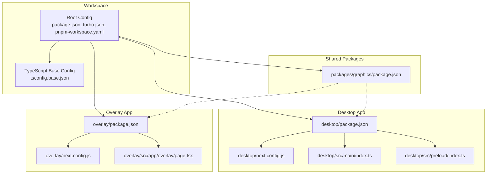
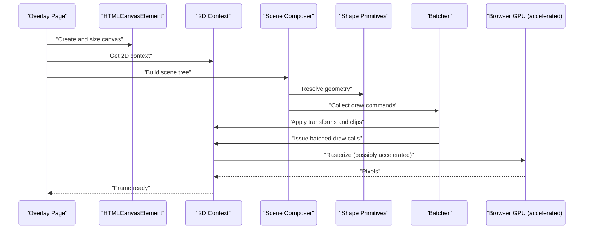
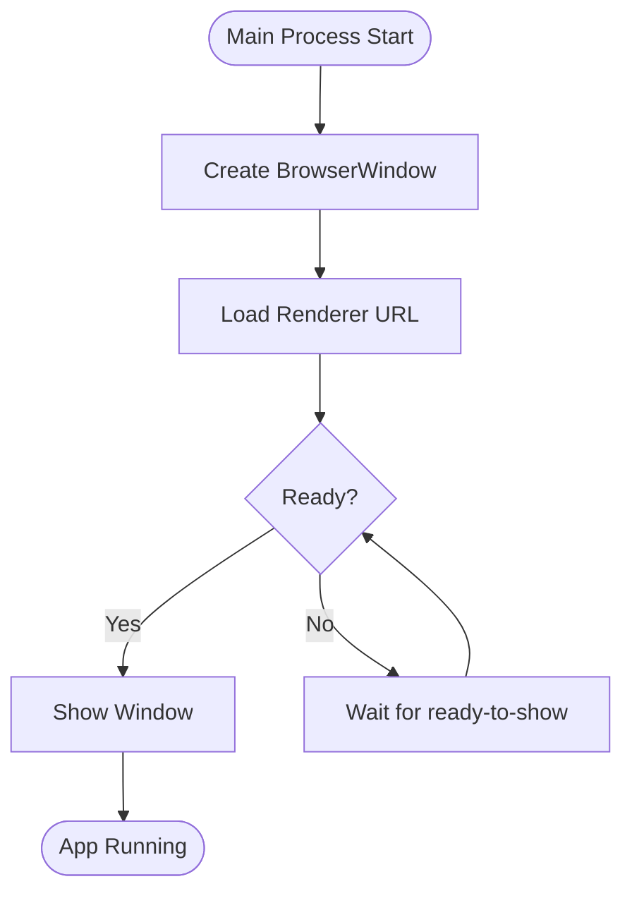
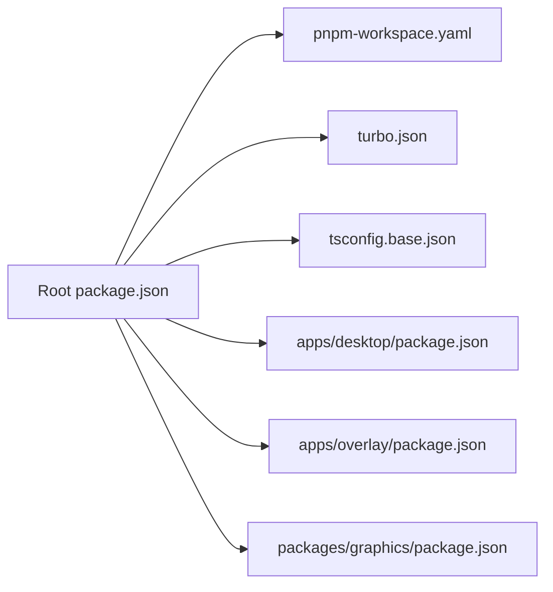

# Canvas Rendering System

<cite>
**Referenced Files in This Document**
- [package.json](file://package.json)
- [pnpm-workspace.yaml](file://pnpm-workspace.yaml)
- [turbo.json](file://turbo.json)
- [tsconfig.base.json](file://tsconfig.base.json)
- [apps/desktop/src/main/index.ts](file://apps/desktop/src/main/index.ts)
- [apps/desktop/src/preload/index.ts](file://apps/desktop/src/preload/index.ts)
- [apps/desktop/next.config.js](file://apps/desktop/next.config.js)
- [apps/desktop/package.json](file://apps/desktop/package.json)
- [apps/overlay/src/app/overlay/page.tsx](file://apps/overlay/src/app/overlay/page.tsx)
- [apps/overlay/next.config.js](file://apps/overlay/next.config.js)
- [apps/overlay/package.json](file://apps/overlay/package.json)
- [packages/graphics/package.json](file://packages/graphics/package.json)
</cite>

## Table of Contents
1. [Introduction](#introduction)
2. [Project Structure](#project-structure)
3. [Core Components](#core-components)
4. [Architecture Overview](#architecture-overview)
5. [Detailed Component Analysis](#detailed-component-analysis)
6. [Dependency Analysis](#dependency-analysis)
7. [Performance Considerations](#performance-considerations)
8. [Troubleshooting Guide](#troubleshooting-guide)
9. [Conclusion](#conclusion)
10. [Appendices](#appendices)

## Introduction
This document explains the canvas-based rendering system as implemented across the workspace, focusing on how 2D canvas drawing operations and graphics context management are organized, how the rendering pipeline composes scenes to final output, and how layering, clipping regions, and transformation matrices are handled. It also covers performance techniques such as offscreen canvases, batched drawing, and hardware acceleration, along with guidance for custom shapes, high-resolution displays, and memory-efficient real-time rendering.

The project is a multi-app monorepo using pnpm workspaces and Turborepo. The desktop app (Electron + Next.js) and overlay app (Next.js) provide the runtime environments where canvas rendering occurs. A shared graphics package is present and intended to encapsulate reusable rendering logic.

## Project Structure
At a high level:
- apps/desktop: Electron main process and preload script; Next.js renderer for UI and potential canvas usage.
- apps/overlay: Standalone Next.js app for overlays that may render via canvas.
- packages/graphics: Shared library for graphics utilities and potentially canvas abstractions.
- Root configuration files define workspace, build orchestration, and TypeScript settings.



**Diagram sources**
- [package.json](file://package.json)
- [pnpm-workspace.yaml](file://pnpm-workspace.yaml)
- [turbo.json](file://turbo.json)
- [tsconfig.base.json](file://tsconfig.base.json)
- [apps/desktop/package.json](file://apps/desktop/package.json)
- [apps/desktop/next.config.js](file://apps/desktop/next.config.js)
- [apps/desktop/src/main/index.ts](file://apps/desktop/src/main/index.ts)
- [apps/desktop/src/preload/index.ts](file://apps/desktop/src/preload/index.ts)
- [apps/overlay/package.json](file://apps/overlay/package.json)
- [apps/overlay/next.config.js](file://apps/overlay/next.config.js)
- [apps/overlay/src/app/overlay/page.tsx](file://apps/overlay/src/app/overlay/page.tsx)
- [packages/graphics/package.json](file://packages/graphics/package.json)

**Section sources**
- [package.json](file://package.json)
- [pnpm-workspace.yaml](file://pnpm-workspace.yaml)
- [turbo.json](file://turbo.json)
- [tsconfig.base.json](file://tsconfig.base.json)
- [apps/desktop/package.json](file://apps/desktop/package.json)
- [apps/desktop/next.config.js](file://apps/desktop/next.config.js)
- [apps/desktop/src/main/index.ts](file://apps/desktop/src/main/index.ts)
- [apps/desktop/src/preload/index.ts](file://apps/desktop/src/preload/index.ts)
- [apps/overlay/package.json](file://apps/overlay/package.json)
- [apps/overlay/next.config.js](file://apps/overlay/next.config.js)
- [apps/overlay/src/app/overlay/page.tsx](file://apps/overlay/src/app/overlay/page.tsx)
- [packages/graphics/package.json](file://packages/graphics/package.json)

## Core Components
- Desktop Main Process: Initializes the Electron window and can host a renderer process that renders content, including canvas elements.
- Preload Script: Bridges secure contexts between main and renderer, enabling controlled access to native features if needed.
- Overlay Page: A Next.js page that can instantiate a canvas and drive rendering loops or event-driven updates.
- Graphics Package: Intended home for reusable canvas utilities, shape definitions, batching helpers, and context management.

Key responsibilities:
- Create and manage HTMLCanvasElement instances.
- Obtain and configure 2D graphics contexts.
- Compose layered scenes with transforms and clip regions.
- Batch draw calls to reduce overhead.
- Handle device pixel ratio for crisp rendering on high-DPI displays.
- Manage memory by reusing buffers and disposing resources when no longer needed.

**Section sources**
- [apps/desktop/src/main/index.ts](file://apps/desktop/src/main/index.ts)
- [apps/desktop/src/preload/index.ts](file://apps/desktop/src/preload/index.ts)
- [apps/overlay/src/app/overlay/page.tsx](file://apps/overlay/src/app/overlay/page.tsx)
- [packages/graphics/package.json](file://packages/graphics/package.json)

## Architecture Overview
The rendering architecture spans multiple layers:
- Application Layer: Desktop and Overlay apps provide the DOM and lifecycle hooks.
- Graphics Abstraction Layer: Encapsulates canvas creation, context setup, scene composition, and drawing primitives.
- Runtime Layer: Browser’s 2D canvas API performs rasterization, optionally accelerated by the GPU depending on browser implementation.



[No diagram sources since this diagram shows conceptual workflow, not actual code structure]

## Detailed Component Analysis

### Desktop Main Process and Preload Bridge
Responsibilities:
- Create the Electron BrowserWindow and load the Next.js renderer.
- Optionally expose IPC channels for controlling rendering from the main process.
- Preload script provides a safe bridge to call into native APIs if required.

Rendering implications:
- The renderer process hosts the DOM and canvas elements.
- Use preload to restrict direct Node access while allowing controlled interactions.



**Section sources**
- [apps/desktop/src/main/index.ts](file://apps/desktop/src/main/index.ts)
- [apps/desktop/src/preload/index.ts](file://apps/desktop/src/preload/index.ts)

### Overlay Page Canvas Integration
Responsibilities:
- Mount a canvas element within the Next.js page.
- Initialize the 2D context and set up a render loop or event-driven updates.
- Manage devicePixelRatio and canvas sizing for sharp visuals.

```mermaid
sequenceDiagram
participant Page as "Overlay Page"
participant DOM as "DOM Element"
participant Canvas as "HTMLCanvasElement"
participant Ctx as "2D Context"
participant Loop as "Render Loop"
Page->>DOM : "Mount component"
Page->>Canvas : "Create canvas"
Page->>Ctx : "getContext('2d')"
Page->>Page : "Set canvas size based on devicePixelRatio"
Page->>Loop : "Start requestAnimationFrame loop"
Loop->>Ctx : "Clear and draw frame"
Loop-->>Page : "Update state"
```

**Section sources**
- [apps/overlay/src/app/overlay/page.tsx](file://apps/overlay/src/app/overlay/page.tsx)

### Graphics Package (Intended Scope)
While the current repository snapshot does not include source files under packages/graphics, the package entry indicates its presence. Typical responsibilities include:
- Shape primitives and path builders.
- Transform matrix utilities.
- Clip region helpers.
- Offscreen canvas wrappers.
- Batching strategies to minimize context state changes.

Recommendation:
- Implement a thin abstraction over the 2D context to centralize transform and clip handling.
- Provide a command queue for batching draw operations.
- Expose high-level APIs for common tasks like drawing text, images, and vector paths.

**Section sources**
- [packages/graphics/package.json](file://packages/graphics/package.json)

## Dependency Analysis
The workspace uses pnpm workspaces and Turborepo to coordinate builds across apps and packages. The desktop and overlay apps depend on their respective Next.js configurations and package manifests. The graphics package is positioned as a shared dependency.



**Diagram sources**
- [package.json](file://package.json)
- [pnpm-workspace.yaml](file://pnpm-workspace.yaml)
- [turbo.json](file://turbo.json)
- [tsconfig.base.json](file://tsconfig.base.json)
- [apps/desktop/package.json](file://apps/desktop/package.json)
- [apps/overlay/package.json](file://apps/overlay/package.json)
- [packages/graphics/package.json](file://packages/graphics/package.json)

**Section sources**
- [package.json](file://package.json)
- [pnpm-workspace.yaml](file://pnpm-workspace.yaml)
- [turbo.json](file://turbo.json)
- [tsconfig.base.json](file://tsconfig.base.json)
- [apps/desktop/package.json](file://apps/desktop/package.json)
- [apps/overlay/package.json](file://apps/overlay/package.json)
- [packages/graphics/package.json](file://packages/graphics/package.json)

## Performance Considerations
- Offscreen Canvases: Render complex scenes to an offscreen canvas and blit to the visible canvas to reduce layout thrashing and repaint costs.
- Batched Drawing: Group draw calls with similar states (transforms, fills, strokes) to minimize context state changes.
- Device Pixel Ratio: Scale canvas dimensions by devicePixelRatio and adjust CSS size to ensure crisp rendering on high-DPI screens.
- Transform Matrices: Apply transformations once per layer or batch rather than per primitive.
- Clipping Regions: Use clip paths sparingly and reuse them when possible.
- Memory Management: Reuse image objects, avoid frequent allocations, and release references when frames are no longer needed.
- Hardware Acceleration: Rely on the browser’s 2D context acceleration where available; avoid heavy use of effects that force software fallbacks.

[No sources needed since this section provides general guidance]

## Troubleshooting Guide
Common issues and resolutions:
- Blurry or pixelated output: Ensure canvas width/height are set to CSS size multiplied by devicePixelRatio.
- Jittery animations: Use requestAnimationFrame and decouple update logic from rendering where appropriate.
- High CPU usage: Reduce draw call count via batching; prefer fewer large draws over many small ones.
- Memory leaks: Clear references to offscreen canvases and images; avoid retaining large textures unnecessarily.
- Cross-origin image errors: Configure CORS headers or use same-origin assets when drawing images onto canvas.

[No sources needed since this section provides general guidance]

## Conclusion
The canvas rendering system leverages standard 2D canvas APIs within the desktop and overlay applications, with a shared graphics package intended to encapsulate reusable rendering logic. By organizing scene composition, managing transforms and clipping efficiently, and applying batching and offscreen techniques, the system can achieve smooth real-time performance. Proper handling of device pixel ratios and memory ensures crisp visuals and stable operation across devices.

[No sources needed since this section summarizes without analyzing specific files]

## Appendices

### Example Workflows

#### Creating Custom Shapes
- Define vector paths using the 2D context path API.
- Build reusable shape functions that accept parameters and return path data.
- Batch shape draws to minimize state changes.

[No sources needed since this section provides general guidance]

#### Handling High-Resolution Displays
- Compute scale factor from devicePixelRatio.
- Set canvas width/height accordingly and adjust CSS size.
- Scale drawing operations to maintain consistent visual sizes.

[No sources needed since this section provides general guidance]

#### Managing Memory Efficiently
- Reuse offscreen canvases instead of creating new ones each frame.
- Cache frequently used images and gradients.
- Release references when components unmount or scenes change.

[No sources needed since this section provides general guidance]