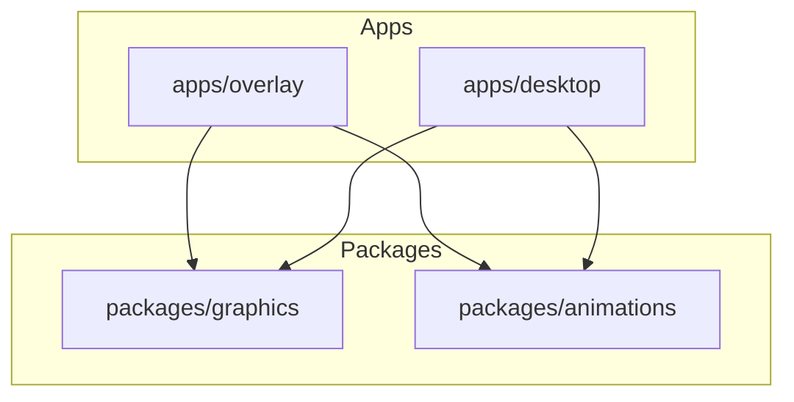
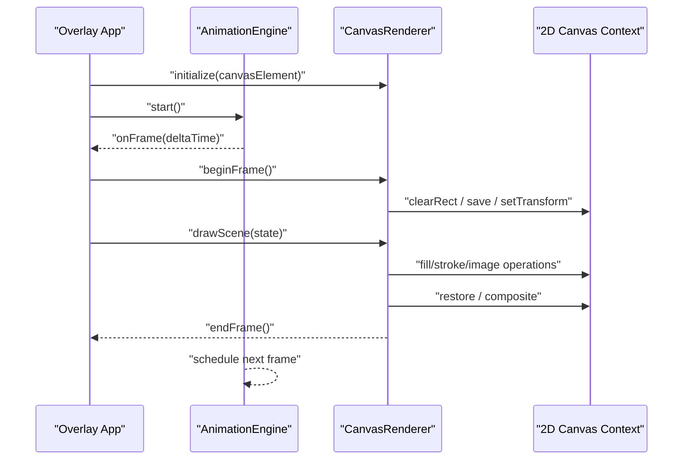
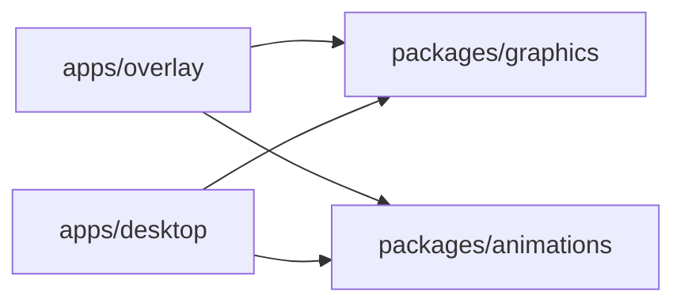

# Graphics Rendering Engine

<cite>
**Referenced Files in This Document**
- [package.json](file://packages/graphics/package.json)
- [index.ts](file://packages/graphics/src/index.ts)
- [CanvasRenderer.ts](file://packages/graphics/src/renderers/CanvasRenderer.ts)
- [AnimationEngine.ts](file://packages/animations/src/AnimationEngine.ts)
- [OverlayApp.tsx](file://apps/overlay/src/app/overlay/page.tsx)
- [main.ts](file://apps/desktop/src/main/index.ts)
- [renderer.ts](file://apps/desktop/src/preload/index.ts)
</cite>

## Table of Contents
1. [Introduction](#introduction)
2. [Project Structure](#project-structure)
3. [Core Components](#core-components)
4. [Architecture Overview](#architecture-overview)
5. [Detailed Component Analysis](#detailed-component-analysis)
6. [Dependency Analysis](#dependency-analysis)
7. [Performance Considerations](#performance-considerations)
8. [Troubleshooting Guide](#troubleshooting-guide)
9. [Conclusion](#conclusion)

## Introduction
This document describes the canvas-based graphics rendering engine used by the overlay system to deliver smooth, real-time broadcast-quality visuals. It explains the 2D canvas implementation, rendering pipeline optimizations, and integration with the animation framework. It also covers drawing operations, performance techniques for high-frequency updates, memory management, and how to create custom graphics elements.

## Project Structure
The graphics subsystem is organized as a package that exposes a renderer abstraction and integrates with an animation engine. The overlay application consumes these packages to render overlays on top of video or UI content. Desktop packaging provides a process boundary where the renderer can run efficiently.

**Diagram sources**
- [package.json](file://packages/graphics/package.json)
- [OverlayApp.tsx](file://apps/overlay/src/app/overlay/page.tsx)
- [main.ts](file://apps/desktop/src/main/index.ts)

**Section sources**
- [package.json](file://packages/graphics/package.json)
- [OverlayApp.tsx](file://apps/overlay/src/app/overlay/page.tsx)
- [main.ts](file://apps/desktop/src/main/index.ts)

## Core Components
- CanvasRenderer: Implements the 2D canvas drawing surface, manages context lifecycle, handles device pixel ratio, and batches draw calls for efficiency.
- AnimationEngine: Drives time-based animations, interpolates values, and coordinates frame scheduling to maintain consistent motion across devices.
- Overlay App Integration: Wires the renderer and animation engine into the overlay page lifecycle, ensuring proper initialization, update loops, and cleanup.

Key responsibilities:
- CanvasRenderer: Context creation, sizing, scaling, clipping, compositing, and optimized draw ordering.
- AnimationEngine: Frame timing, easing functions, transition orchestration, and synchronization with the renderer’s draw loop.
- Overlay Integration: Mounting/unmounting, event handling, and resource disposal.

**Section sources**
- [index.ts](file://packages/graphics/src/index.ts)
- [CanvasRenderer.ts](file://packages/graphics/src/renderers/CanvasRenderer.ts)
- [AnimationEngine.ts](file://packages/animations/src/AnimationEngine.ts)
- [OverlayApp.tsx](file://apps/overlay/src/app/overlay/page.tsx)

## Architecture Overview
The rendering architecture separates concerns between drawing (CanvasRenderer), animation (AnimationEngine), and application wiring (Overlay app). The renderer exposes a minimal API to schedule frames and draw scenes; the animation engine updates state at a stable cadence and triggers redraws when needed.

**Diagram sources**
- [CanvasRenderer.ts](file://packages/graphics/src/renderers/CanvasRenderer.ts)
- [AnimationEngine.ts](file://packages/animations/src/AnimationEngine.ts)
- [OverlayApp.tsx](file://apps/overlay/src/app/overlay/page.tsx)

## Detailed Component Analysis

### CanvasRenderer
Responsibilities:
- Manage the HTMLCanvasElement and its 2D context.
- Handle devicePixelRatio scaling for crisp output on high-DPI displays.
- Provide begin/end frame methods to batch operations and minimize state changes.
- Offer primitives for shapes, text, images, gradients, and masks.

Optimization strategies:
- Minimize context state changes by grouping similar draw calls.
- Use offscreen canvases for static or rarely changing layers.
- Apply clipping regions to avoid redundant draws outside visible areas.
- Prefer transform batching and reuse of paths/gradients where possible.

Common operations:
- Clear and reset transforms each frame.
- Draw background, then midground, then foreground layers.
- Composite overlays with appropriate globalAlpha and blend modes.

Memory considerations:
- Reuse image objects and textures.
- Release large bitmaps when no longer needed.
- Avoid creating temporary objects inside hot loops.

**Section sources**
- [CanvasRenderer.ts](file://packages/graphics/src/renderers/CanvasRenderer.ts)
- [index.ts](file://packages/graphics/src/index.ts)

### AnimationEngine
Responsibilities:
- Drive time-based updates using requestAnimationFrame.
- Interpolate values with easing functions for smooth transitions.
- Expose hooks for components to subscribe to animated values.
- Coordinate with the renderer to trigger redraws only when necessary.

Transition effects:
- Support common transitions such as fade-in/out, slide, scale, and rotate.
- Compose multiple animations with chaining and parallel execution.
- Allow dynamic reconfiguration of duration and easing per instance.

Frame rate optimization:
- Throttle updates to reduce work when not visible.
- Merge small state changes into single draw calls.
- Use delta time to ensure consistent motion regardless of FPS.

**Section sources**
- [AnimationEngine.ts](file://packages/animations/src/AnimationEngine.ts)

### Overlay Integration
Responsibilities:
- Initialize the renderer and animation engine on mount.
- Bind user interactions and external data to animated state.
- Ensure proper teardown to prevent leaks and free resources.

Integration points:
- Subscribe to animation events to update scene state.
- Call renderer draw methods within the animation frame callback.
- Handle visibility changes to pause/resume animation loops.

**Section sources**
- [OverlayApp.tsx](file://apps/overlay/src/app/overlay/page.tsx)

### Desktop Packaging Integration
Responsibilities:
- Provide a process boundary for efficient rendering.
- Bridge between main and renderer processes if applicable.
- Ensure the canvas runs in a dedicated thread/process for performance.

**Section sources**
- [main.ts](file://apps/desktop/src/main/index.ts)
- [renderer.ts](file://apps/desktop/src/preload/index.ts)

## Dependency Analysis
The graphics package depends on the animation package for time-driven updates. The overlay app depends on both to compose final visuals. Desktop packaging may add additional dependencies for process management.

**Diagram sources**
- [package.json](file://packages/graphics/package.json)
- [OverlayApp.tsx](file://apps/overlay/src/app/overlay/page.tsx)
- [main.ts](file://apps/desktop/src/main/index.ts)

**Section sources**
- [package.json](file://packages/graphics/package.json)
- [OverlayApp.tsx](file://apps/overlay/src/app/overlay/page.tsx)
- [main.ts](file://apps/desktop/src/main/index.ts)

## Performance Considerations
- Batch draw calls: Group similar operations to reduce context state changes.
- Offscreen canvases: Pre-render complex static layers once and reuse them.
- Clipping and culling: Only draw what is visible; use clip regions and bounds checks.
- Transform reuse: Cache computed transforms and reuse paths/gradients.
- Delta-time animations: Ensure consistent motion across varying frame rates.
- Visibility awareness: Pause or throttle animations when overlays are hidden.
- Memory hygiene: Reuse buffers, release large assets, and avoid allocations in hot loops.

[No sources needed since this section provides general guidance]

## Troubleshooting Guide
Common issues and resolutions:
- Blurry or low-resolution output: Verify devicePixelRatio scaling and canvas size calculations.
- Stuttering or dropped frames: Reduce per-frame allocations, batch operations, and check for heavy synchronous work.
- Memory growth over time: Ensure images and offscreen canvases are released; avoid retaining references after unmount.
- Inconsistent animation speed: Confirm delta-time usage and that the animation loop is not blocked by long tasks.
- Incorrect layering: Review draw order and composite settings; validate clipping regions.

**Section sources**
- [CanvasRenderer.ts](file://packages/graphics/src/renderers/CanvasRenderer.ts)
- [AnimationEngine.ts](file://packages/animations/src/AnimationEngine.ts)
- [OverlayApp.tsx](file://apps/overlay/src/app/overlay/page.tsx)

## Conclusion
The graphics rendering engine combines a focused 2D canvas renderer with a robust animation framework to deliver smooth, real-time overlays suitable for professional broadcast environments. By following the optimization strategies and patterns outlined here—batching draw calls, leveraging offscreen canvases, managing memory carefully, and integrating tightly with the animation loop—you can build high-performance custom graphics elements and maintain consistent frame rates under demanding conditions.