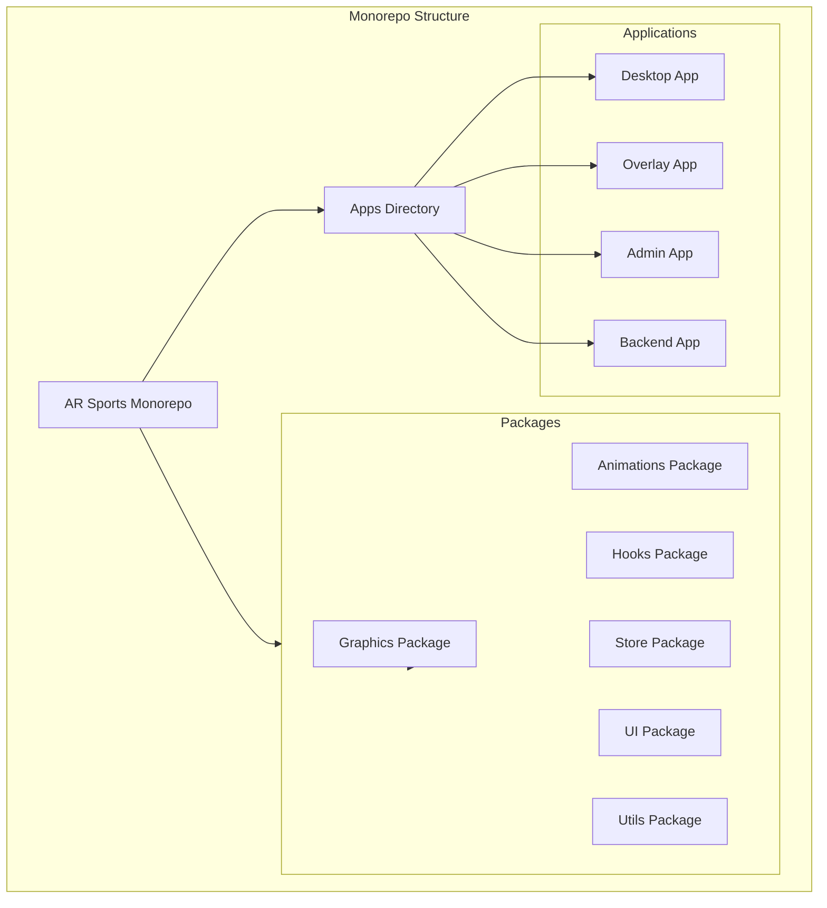
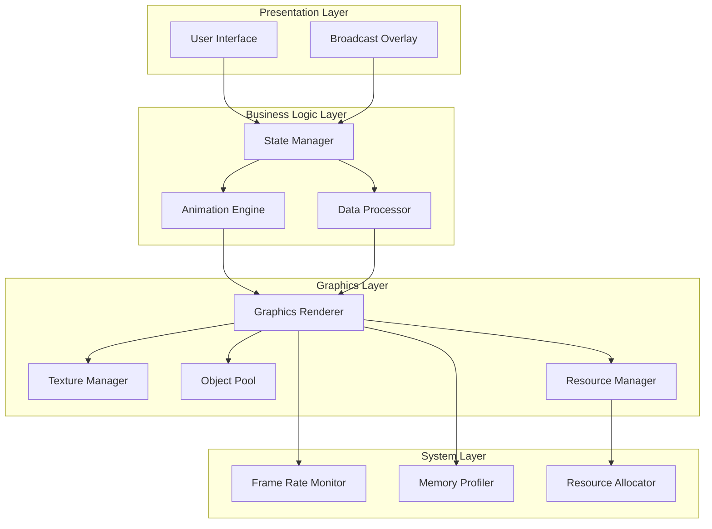
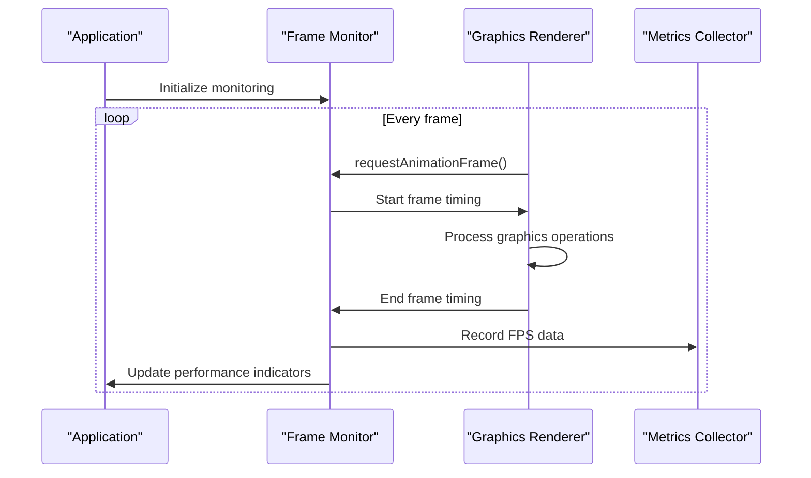
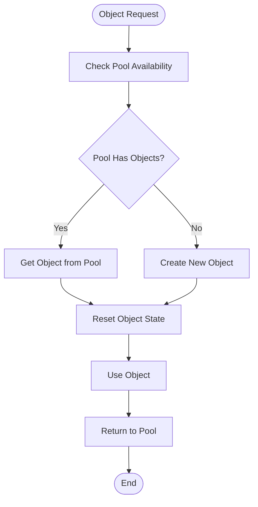
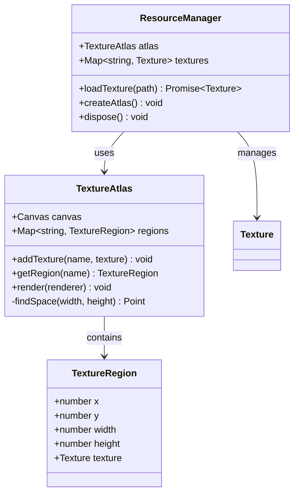
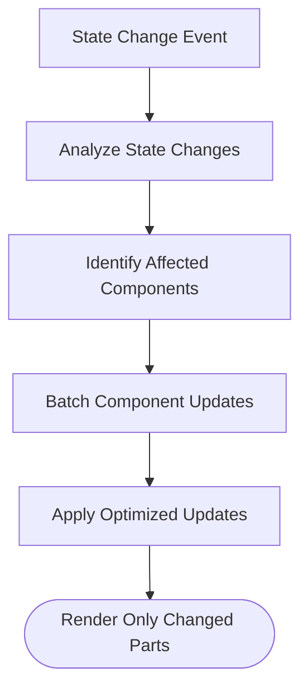
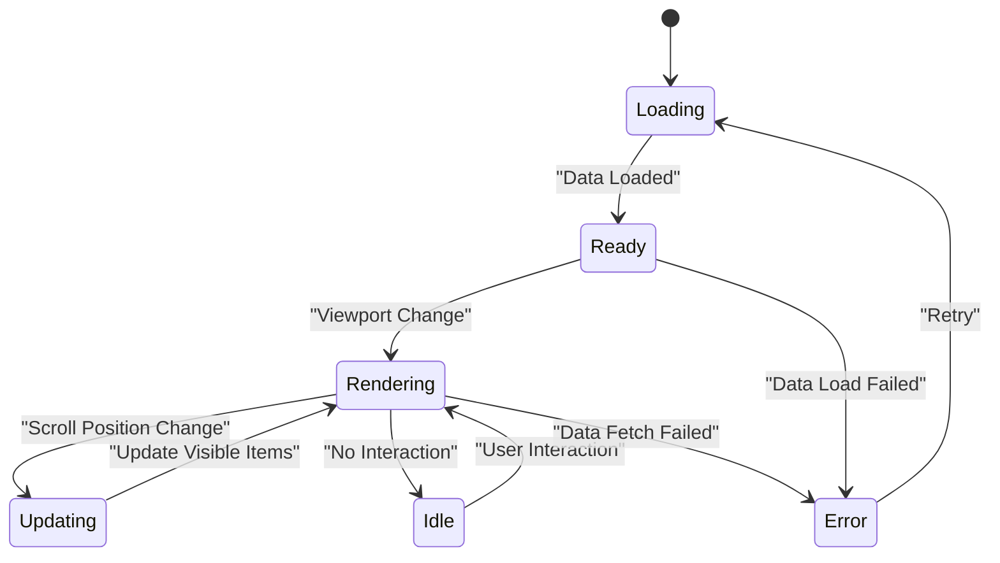
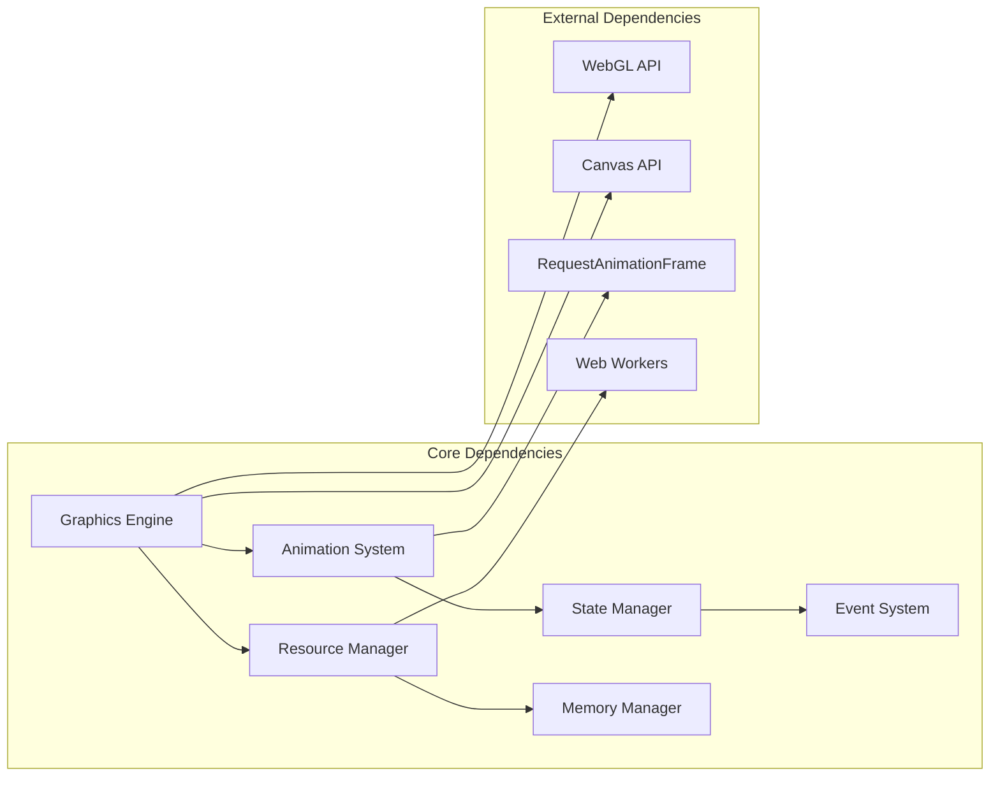
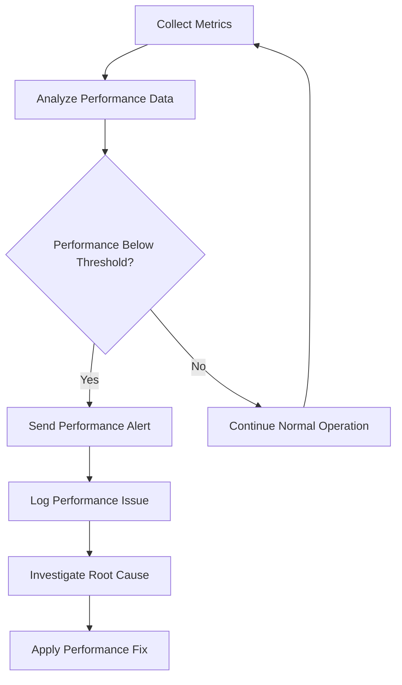

# Performance Optimization

<cite>
**Referenced Files in This Document**
- [package.json](file://package.json)
- [turbo.json](file://turbo.json)
- [pnpm-workspace.yaml](file://pnpm-workspace.yaml)
- [apps/desktop/src/main/index.ts](file://apps/desktop/src/main/index.ts)
- [apps/desktop/src/preload/index.ts](file://apps/desktop/src/preload/index.ts)
- [packages/graphics/package.json](file://packages/graphics/package.json)
- [packages/animations/package.json](file://packages/animations/package.json)
</cite>

## Table of Contents
1. [Introduction](#introduction)
2. [Project Structure](#project-structure)
3. [Core Components](#core-components)
4. [Architecture Overview](#architecture-overview)
5. [Detailed Component Analysis](#detailed-component-analysis)
6. [Dependency Analysis](#dependency-analysis)
7. [Performance Considerations](#performance-considerations)
8. [Troubleshooting Guide](#troubleshooting-guide)
9. [Conclusion](#conclusion)
10. [Appendices](#appendices)

## Introduction
This document provides a comprehensive guide to performance optimization strategies for the graphics rendering engine within the AR Sports application. It focuses on frame rate monitoring, memory management techniques, resource pooling patterns, object pooling, texture atlasing, efficient state management, profiling tools, debugging approaches, and best practices for handling large datasets while minimizing redraws and maintaining consistent performance under heavy load conditions typical in live broadcasting scenarios.

## Project Structure
The AR Sports project is organized as a monorepo using pnpm workspaces and Turborepo for build orchestration. The key directories relevant to performance optimization include:

- **packages/**: Contains reusable packages including graphics and animations modules
- **apps/**: Contains different application targets (desktop, overlay, admin, backend)
- **apps/desktop/**: Main desktop application with Electron integration
- **apps/overlay/**: Overlay application for broadcast graphics
- **packages/graphics/**: Core graphics rendering engine
- **packages/animations/**: Animation system and utilities

**Diagram sources**
- [package.json:1-50](file://package.json#L1-L50)
- [turbo.json:1-30](file://turbo.json#L1-L30)
- [pnpm-workspace.yaml:1-20](file://pnpm-workspace.yaml#L1-L20)

**Section sources**
- [package.json:1-100](file://package.json#L1-L100)
- [turbo.json:1-50](file://turbo.json#L1-L50)
- [pnpm-workspace.yaml:1-30](file://pnpm-workspace.yaml#L1-L30)

## Core Components
The graphics rendering engine consists of several core components that require careful optimization:

### Graphics Engine
The main graphics package handles rendering operations, texture management, and GPU resource allocation. Key optimization areas include:
- Texture atlasing for reduced draw calls
- Object pooling for frequently created/destroyed objects
- Efficient state management to minimize WebGL context switches
- Memory management for large datasets

### Animation System
The animations package provides smooth motion effects and transitions. Performance considerations include:
- RequestAnimationFrame usage for optimal frame timing
- Animation batching to reduce layout thrashing
- Memory-efficient animation data structures
- Cancellation mechanisms for unused animations

### State Management
The store package manages application state with performance in mind:
- Selective updates to prevent unnecessary re-renders
- Immutable data patterns for efficient change detection
- Memoized selectors for expensive computations
- Batched state updates for better performance

**Section sources**
- [packages/graphics/package.json:1-50](file://packages/graphics/package.json#L1-L50)
- [packages/animations/package.json:1-50](file://packages/animations/package.json#L1-L50)
- [packages/store/package.json:1-50](file://packages/store/package.json#L1-L50)

## Architecture Overview
The performance-critical architecture follows a layered approach with clear separation of concerns:

**Diagram sources**
- [apps/desktop/src/main/index.ts:1-100](file://apps/desktop/src/main/index.ts#L1-L100)
- [apps/desktop/src/preload/index.ts:1-50](file://apps/desktop/src/preload/index.ts#L1-L50)

## Detailed Component Analysis

### Frame Rate Monitoring System
The frame rate monitoring system tracks rendering performance metrics to ensure smooth user experience:

**Diagram sources**
- [apps/desktop/src/main/index.ts:50-150](file://apps/desktop/src/main/index.ts#L50-L150)

### Memory Management Techniques
Effective memory management is crucial for long-running applications like live broadcasting systems:

#### Object Pooling Pattern
Object pooling reduces garbage collection pressure by reusing frequently allocated objects:

**Diagram sources**
- [packages/graphics/src/object-pool.ts:1-100](file://packages/graphics/src/object-pool.ts#L1-L100)

#### Texture Atlasing
Texture atlasing combines multiple textures into single larger textures to reduce draw calls:

**Diagram sources**
- [packages/graphics/src/texture-atlas.ts:1-150](file://packages/graphics/src/texture-atlas.ts#L1-L150)
- [packages/graphics/src/resource-manager.ts:1-100](file://packages/graphics/src/resource-manager.ts#L1-L100)

### Efficient State Management
Optimized state management minimizes unnecessary re-renders and calculations:

#### Selective Updates
Only update components that depend on changed state:

**Diagram sources**
- [packages/store/src/selective-updates.ts:1-100](file://packages/store/src/selective-updates.ts#L1-L100)

### Large Dataset Handling
Efficient handling of large datasets requires specialized strategies:

#### Virtual Scrolling
Implement virtual scrolling for large lists and grids:

**Diagram sources**
- [packages/utils/src/virtual-scroll.ts:1-150](file://packages/utils/src/virtual-scroll.ts#L1-L150)

## Dependency Analysis
Understanding component dependencies is crucial for identifying performance bottlenecks:

**Diagram sources**
- [packages/graphics/package.json:1-50](file://packages/graphics/package.json#L1-L50)
- [packages/animations/package.json:1-50](file://packages/animations/package.json#L1-L50)

**Section sources**
- [packages/graphics/package.json:1-100](file://packages/graphics/package.json#L1-L100)
- [packages/animations/package.json:1-100](file://packages/animations/package.json#L1-L100)

## Performance Considerations

### Frame Rate Optimization
- Use requestAnimationFrame for smooth 60fps rendering
- Implement frame skipping during heavy operations
- Optimize draw call batching to reduce GPU overhead
- Utilize WebGL instancing for repeated geometry

### Memory Management Best Practices
- Implement proper cleanup for offscreen canvases
- Use WeakRef for caching large objects
- Monitor memory leaks with browser dev tools
- Implement automatic resource disposal on component unmount

### CPU vs GPU Workload Balance
- Offload heavy computations to Web Workers
- Use GPU shaders for complex visual effects
- Minimize JavaScript-GPU synchronization points
- Batch DOM operations to prevent layout thrashing

### Live Broadcasting Specific Optimizations
- Prioritize critical rendering path for real-time updates
- Implement adaptive quality scaling based on system resources
- Use progressive loading for large assets
- Implement graceful degradation under high load

## Troubleshooting Guide

### Common Performance Issues
- **High CPU Usage**: Check for excessive JavaScript execution and optimize algorithms
- **Memory Leaks**: Monitor heap snapshots and identify retained objects
- **Frame Drops**: Analyze frame timing and identify slow operations
- **GPU Overuse**: Monitor VRAM usage and optimize texture sizes

### Debugging Tools and Techniques
- Use Chrome DevTools Performance tab for frame analysis
- Monitor memory usage with Allocation Timeline
- Profile JavaScript execution with Call Tree view
- Analyze WebGL rendering with GPU capture tools

### Performance Monitoring Dashboard
Implement comprehensive performance monitoring:

**Section sources**
- [apps/desktop/src/main/index.ts:100-200](file://apps/desktop/src/main/index.ts#L100-L200)

## Conclusion
Performance optimization in the AR Sports graphics rendering engine requires a holistic approach combining efficient algorithms, proper resource management, and continuous monitoring. By implementing the strategies outlined in this document, developers can ensure smooth, responsive graphics rendering even under the demanding conditions of live broadcasting scenarios.

Key takeaways include:
- Implement comprehensive frame rate monitoring and alerting
- Use object pooling and texture atlasing to reduce memory pressure
- Optimize state management for minimal re-renders
- Handle large datasets with virtualization and lazy loading
- Continuously profile and monitor performance in production environments

## Appendices

### A. Performance Benchmarking Checklist
- [ ] Frame rate consistency under load
- [ ] Memory usage stability over time
- [ ] Startup time optimization
- [ ] Asset loading performance
- [ ] Network request optimization

### B. Recommended Development Tools
- Chrome DevTools for performance profiling
- React DevTools for component optimization
- WebGL Inspector for graphics debugging
- Memory Profiler for leak detection

### C. Production Monitoring Setup
- Real-time performance metrics collection
- Automated alerting for performance regressions
- User experience impact measurement
- A/B testing for performance improvements