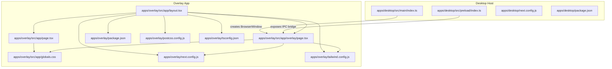
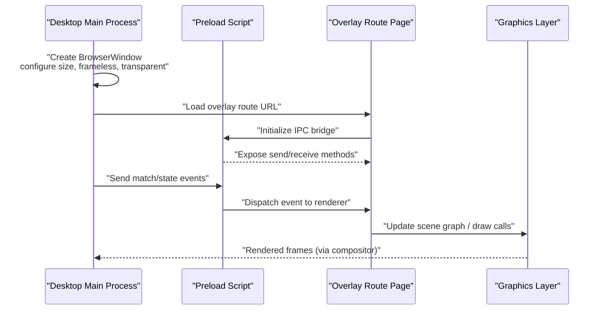
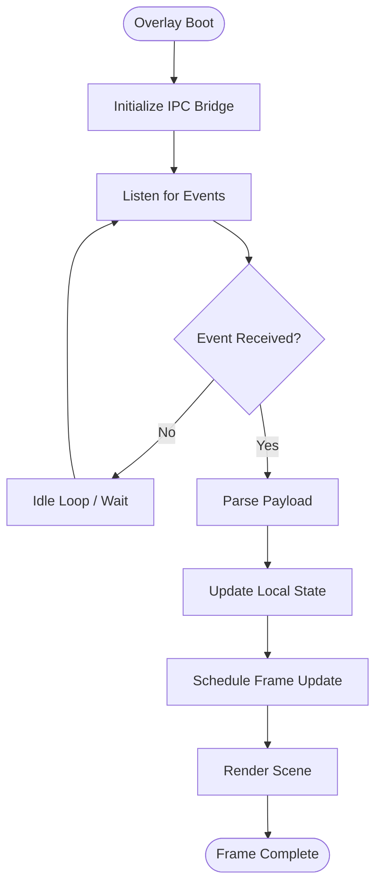
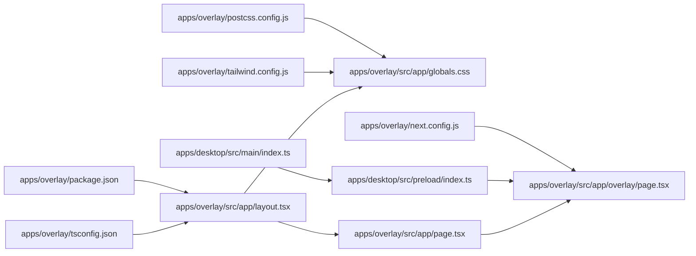

# Overlay Architecture

<cite>
**Referenced Files in This Document**
- [apps/overlay/src/app/layout.tsx](file://apps/overlay/src/app/layout.tsx)
- [apps/overlay/src/app/page.tsx](file://apps/overlay/src/app/page.tsx)
- [apps/overlay/src/app/overlay/page.tsx](file://apps/overlay/src/app/overlay/page.tsx)
- [apps/overlay/src/app/globals.css](file://apps/overlay/src/app/globals.css)
- [apps/overlay/next.config.js](file://apps/overlay/next.config.js)
- [apps/overlay/package.json](file://apps/overlay/package.json)
- [apps/overlay/tailwind.config.js](file://apps/overlay/tailwind.config.js)
- [apps/overlay/postcss.config.js](file://apps/overlay/postcss.config.js)
- [apps/overlay/tsconfig.json](file://apps/overlay/tsconfig.json)
- [apps/desktop/src/main/index.ts](file://apps/desktop/src/main/index.ts)
- [apps/desktop/src/preload/index.ts](file://apps/desktop/src/preload/index.ts)
- [apps/desktop/next.config.js](file://apps/desktop/next.config.js)
- [apps/desktop/package.json](file://apps/desktop/package.json)
</cite>

## Table of Contents
1. [Introduction](#introduction)
2. [Project Structure](#project-structure)
3. [Core Components](#core-components)
4. [Architecture Overview](#architecture-overview)
5. [Detailed Component Analysis](#detailed-component-analysis)
6. [Dependency Analysis](#dependency-analysis)
7. [Performance Considerations](#performance-considerations)
8. [Troubleshooting Guide](#troubleshooting-guide)
9. [Conclusion](#conclusion)

## Introduction
This document explains the overlay system architecture designed for broadcast graphics rendering. The overlay is implemented as a dedicated Next.js application optimized for low-latency, high-fidelity visual output. It is decoupled from the main application logic and managed by a desktop host process that controls window lifecycle, resource allocation, and communication channels. The design emphasizes deterministic layout, minimal runtime overhead, and predictable asset handling to meet broadcast-grade performance requirements.

## Project Structure
The overlay is a standalone Next.js app under apps/overlay with its own configuration files and source tree. The desktop host (Electron-based) manages overlay windows and coordinates data exchange via IPC. Shared packages provide animations, graphics primitives, UI components, and utilities used across apps.

**Diagram sources**
- [apps/overlay/src/app/layout.tsx](file://apps/overlay/src/app/layout.tsx)
- [apps/overlay/src/app/page.tsx](file://apps/overlay/src/app/page.tsx)
- [apps/overlay/src/app/overlay/page.tsx](file://apps/overlay/src/app/overlay/page.tsx)
- [apps/overlay/src/app/globals.css](file://apps/overlay/src/app/globals.css)
- [apps/overlay/next.config.js](file://apps/overlay/next.config.js)
- [apps/overlay/tailwind.config.js](file://apps/overlay/tailwind.config.js)
- [apps/overlay/postcss.config.js](file://apps/overlay/postcss.config.js)
- [apps/overlay/tsconfig.json](file://apps/overlay/tsconfig.json)
- [apps/overlay/package.json](file://apps/overlay/package.json)
- [apps/desktop/src/main/index.ts](file://apps/desktop/src/main/index.ts)
- [apps/desktop/src/preload/index.ts](file://apps/desktop/src/preload/index.ts)
- [apps/desktop/next.config.js](file://apps/desktop/next.config.js)
- [apps/desktop/package.json](file://apps/desktop/package.json)

**Section sources**
- [apps/overlay/src/app/layout.tsx](file://apps/overlay/src/app/layout.tsx)
- [apps/overlay/src/app/page.tsx](file://apps/overlay/src/app/page.tsx)
- [apps/overlay/src/app/overlay/page.tsx](file://apps/overlay/src/app/overlay/page.tsx)
- [apps/overlay/src/app/globals.css](file://apps/overlay/src/app/globals.css)
- [apps/overlay/next.config.js](file://apps/overlay/next.config.js)
- [apps/overlay/tailwind.config.js](file://apps/overlay/tailwind.config.js)
- [apps/overlay/postcss.config.js](file://apps/overlay/postcss.config.js)
- [apps/overlay/tsconfig.json](file://apps/overlay/tsconfig.json)
- [apps/overlay/package.json](file://apps/overlay/package.json)
- [apps/desktop/src/main/index.ts](file://apps/desktop/src/main/index.ts)
- [apps/desktop/src/preload/index.ts](file://apps/desktop/src/preload/index.ts)
- [apps/desktop/next.config.js](file://apps/desktop/next.config.js)
- [apps/desktop/package.json](file://apps/desktop/package.json)

## Core Components
- Overlay root layout: Provides global CSS, font loading strategy, and base HTML structure tailored for full-screen, borderless rendering.
- Overlay page: Entry point for the overlay route; initializes state and renders the primary overlay canvas or DOM composition.
- Overlay route page: Dedicated route for the broadcast overlay view, isolated from other pages to minimize bundle size and startup time.
- Global styles: Minimal CSS reset and variables for consistent rendering across displays and capture software.
- Desktop host integration: Electron main process creates and manages overlay windows; preload script exposes a secure IPC bridge for real-time updates.

Key responsibilities:
- Layout configuration for fixed resolution and aspect ratio.
- Build optimizations to reduce payload and startup latency.
- Window management strategies for multi-monitor setups and capture compatibility.
- Resource allocation patterns for GPU-accelerated rendering paths.

**Section sources**
- [apps/overlay/src/app/layout.tsx](file://apps/overlay/src/app/layout.tsx)
- [apps/overlay/src/app/page.tsx](file://apps/overlay/src/app/page.tsx)
- [apps/overlay/src/app/overlay/page.tsx](file://apps/overlay/src/app/overlay/page.tsx)
- [apps/overlay/src/app/globals.css](file://apps/overlay/src/app/globals.css)
- [apps/desktop/src/main/index.ts](file://apps/desktop/src/main/index.ts)
- [apps/desktop/src/preload/index.ts](file://apps/desktop/src/preload/index.ts)

## Architecture Overview
The overlay runs as an independent Next.js app inside a dedicated browser window managed by the desktop host. Data flows from the host to the overlay via a lightweight IPC channel. Rendering focuses on deterministic layouts and efficient animation loops.

**Diagram sources**
- [apps/desktop/src/main/index.ts](file://apps/desktop/src/main/index.ts)
- [apps/desktop/src/preload/index.ts](file://apps/desktop/src/preload/index.ts)
- [apps/overlay/src/app/overlay/page.tsx](file://apps/overlay/src/app/overlay/page.tsx)

## Detailed Component Analysis

### Overlay Root Layout
Responsibilities:
- Define global HTML shell and meta tags suitable for broadcast overlays.
- Load fonts and assets efficiently to avoid layout shifts during live transitions.
- Apply global CSS resets and variables for consistent rendering.

Optimization considerations:
- Prefer preconnect and preload hints for critical assets.
- Minimize JavaScript execution at boot to reduce first-frame latency.
- Use CSS containment where appropriate to limit repaint areas.

**Section sources**
- [apps/overlay/src/app/layout.tsx](file://apps/overlay/src/app/layout.tsx)
- [apps/overlay/src/app/globals.css](file://apps/overlay/src/app/globals.css)

### Overlay Page and Route
Responsibilities:
- Provide the entry point for the overlay route.
- Initialize state and subscribe to IPC events for live updates.
- Render the overlay composition using DOM or Canvas/WebGL depending on complexity.

Design notes:
- Keep the route isolated to reduce initial bundle size.
- Defer non-critical initialization until after first paint.
- Use requestAnimationFrame or a game loop pattern for smooth updates.

**Section sources**
- [apps/overlay/src/app/page.tsx](file://apps/overlay/src/app/page.tsx)
- [apps/overlay/src/app/overlay/page.tsx](file://apps/overlay/src/app/overlay/page.tsx)

### Desktop Host Integration
Responsibilities:
- Create and manage overlay windows with appropriate flags (frameless, transparent, resizable).
- Handle multi-monitor placement and capture software constraints.
- Expose a typed IPC bridge through the preload script for safe communication.

Window management strategies:
- Set explicit width/height to match target resolution and pixel density.
- Disable unnecessary features (devtools, context menus) in production.
- Persist window bounds per monitor profile if needed.

IPC flow:
- Host sends structured messages (e.g., match state, team info).
- Preload forwards messages to the overlay renderer.
- Overlay acknowledges receipt and triggers minimal re-renders.

**Section sources**
- [apps/desktop/src/main/index.ts](file://apps/desktop/src/main/index.ts)
- [apps/desktop/src/preload/index.ts](file://apps/desktop/src/preload/index.ts)

### Build and Runtime Configuration
Overlay-specific Next.js configuration:
- Optimize for static or hybrid generation to reduce server-side overhead.
- Configure asset handling for large media (sprites, textures) with caching headers.
- Enable aggressive code splitting and minification for faster startup.

Tailwind and PostCSS:
- Tailwind config scoped to overlay to minimize unused styles.
- PostCSS pipeline tuned for fast builds and small CSS payloads.

TypeScript and tooling:
- Strict mode enabled for reliability.
- Target modern browsers for better performance.

**Section sources**
- [apps/overlay/next.config.js](file://apps/overlay/next.config.js)
- [apps/overlay/tailwind.config.js](file://apps/overlay/tailwind.config.js)
- [apps/overlay/postcss.config.js](file://apps/overlay/postcss.config.js)
- [apps/overlay/tsconfig.json](file://apps/overlay/tsconfig.json)
- [apps/overlay/package.json](file://apps/overlay/package.json)

### Data Flow and State Management

**Diagram sources**
- [apps/overlay/src/app/overlay/page.tsx](file://apps/overlay/src/app/overlay/page.tsx)
- [apps/desktop/src/preload/index.ts](file://apps/desktop/src/preload/index.ts)

## Dependency Analysis
The overlay depends on shared packages for animations, graphics, UI, and utilities. The desktop host orchestrates window creation and IPC. The following diagram shows key dependencies between core modules.

**Diagram sources**
- [apps/overlay/src/app/layout.tsx](file://apps/overlay/src/app/layout.tsx)
- [apps/overlay/src/app/page.tsx](file://apps/overlay/src/app/page.tsx)
- [apps/overlay/src/app/overlay/page.tsx](file://apps/overlay/src/app/overlay/page.tsx)
- [apps/overlay/src/app/globals.css](file://apps/overlay/src/app/globals.css)
- [apps/overlay/next.config.js](file://apps/overlay/next.config.js)
- [apps/overlay/tailwind.config.js](file://apps/overlay/tailwind.config.js)
- [apps/overlay/postcss.config.js](file://apps/overlay/postcss.config.js)
- [apps/overlay/tsconfig.json](file://apps/overlay/tsconfig.json)
- [apps/overlay/package.json](file://apps/overlay/package.json)
- [apps/desktop/src/main/index.ts](file://apps/desktop/src/main/index.ts)
- [apps/desktop/src/preload/index.ts](file://apps/desktop/src/preload/index.ts)

**Section sources**
- [apps/overlay/src/app/layout.tsx](file://apps/overlay/src/app/layout.tsx)
- [apps/overlay/src/app/page.tsx](file://apps/overlay/src/app/page.tsx)
- [apps/overlay/src/app/overlay/page.tsx](file://apps/overlay/src/app/overlay/page.tsx)
- [apps/overlay/src/app/globals.css](file://apps/overlay/src/app/globals.css)
- [apps/overlay/next.config.js](file://apps/overlay/next.config.js)
- [apps/overlay/tailwind.config.js](file://apps/overlay/tailwind.config.js)
- [apps/overlay/postcss.config.js](file://apps/overlay/postcss.config.js)
- [apps/overlay/tsconfig.json](file://apps/overlay/tsconfig.json)
- [apps/overlay/package.json](file://apps/overlay/package.json)
- [apps/desktop/src/main/index.ts](file://apps/desktop/src/main/index.ts)
- [apps/desktop/src/preload/index.ts](file://apps/desktop/src/preload/index.ts)

## Performance Considerations
- Startup latency:
  - Minimize JS executed before first render.
  - Defer heavy initialization until after the first frame.
- Rendering path:
  - Prefer GPU-accelerated layers (transform, opacity) for animations.
  - Avoid layout thrashing by batching DOM updates.
- Asset handling:
  - Preload critical assets; lazy-load non-critical ones.
  - Use vector formats where possible to reduce memory footprint.
- IPC efficiency:
  - Coalesce frequent updates into batched messages.
  - Use structured cloning-friendly payloads.
- Memory management:
  - Reuse buffers and textures when applicable.
  - Release resources on route unmount or window close.

[No sources needed since this section provides general guidance]

## Troubleshooting Guide
Common issues and resolutions:
- Overlay not visible in capture software:
  - Ensure window transparency and alpha blending are configured correctly.
  - Verify window size matches capture region and display scaling.
- Stuttering or dropped frames:
  - Profile the render loop and remove synchronous work.
  - Reduce overdraw and expensive filters.
- IPC message loss or delays:
  - Implement acknowledgment and retry mechanisms.
  - Validate payload schemas to prevent parsing errors.
- High CPU/GPU usage:
  - Limit update frequency for non-critical elements.
  - Offload heavy computations to background tasks where feasible.

**Section sources**
- [apps/desktop/src/main/index.ts](file://apps/desktop/src/main/index.ts)
- [apps/desktop/src/preload/index.ts](file://apps/desktop/src/preload/index.ts)
- [apps/overlay/src/app/overlay/page.tsx](file://apps/overlay/src/app/overlay/page.tsx)

## Conclusion
The overlay architecture separates broadcast rendering from the main application, leveraging a dedicated Next.js app managed by a desktop host. This separation enables precise control over window behavior, resource allocation, and rendering performance. With targeted build optimizations, careful asset handling, and efficient IPC, the system delivers stable, low-latency graphics suitable for professional broadcast environments.