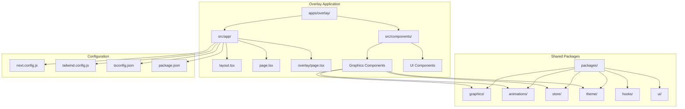
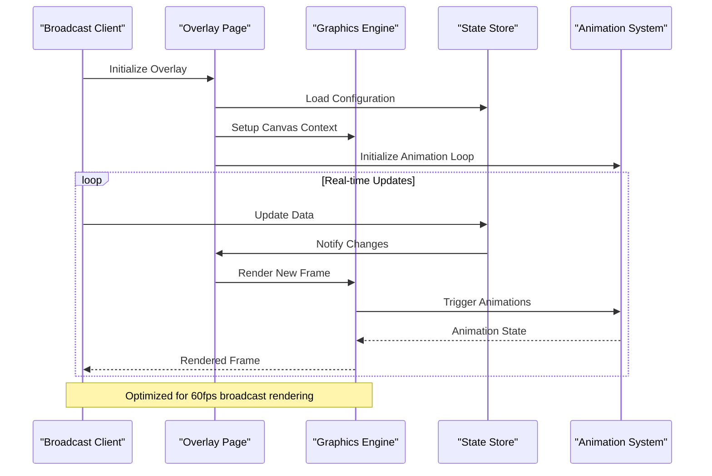
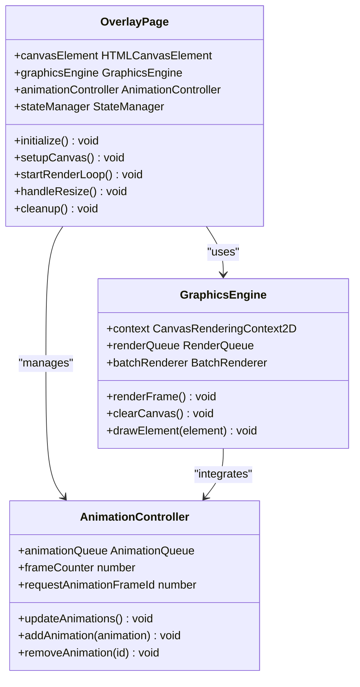
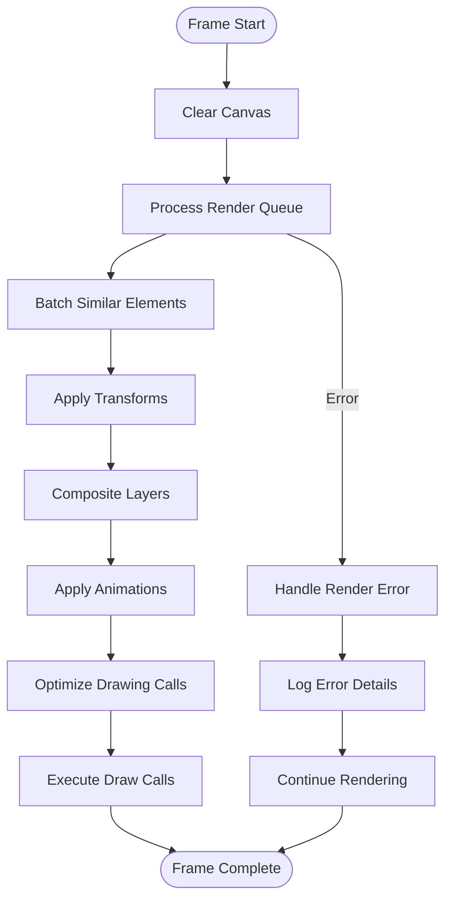
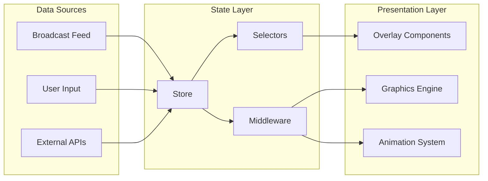
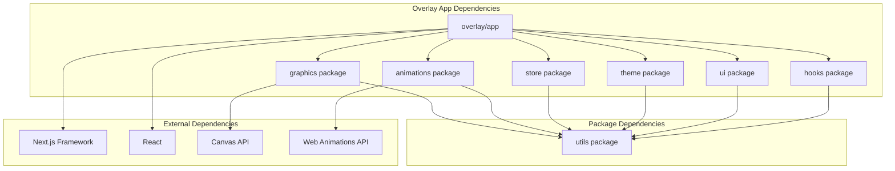

# Overlay System

<cite>
**Referenced Files in This Document**
- [apps/overlay/src/app/layout.tsx](file://apps/overlay/src/app/layout.tsx)
- [apps/overlay/src/app/page.tsx](file://apps/overlay/src/app/page.tsx)
- [apps/overlay/src/app/overlay/page.tsx](file://apps/overlay/src/app/overlay/page.tsx)
- [apps/overlay/package.json](file://apps/overlay/package.json)
- [apps/overlay/next.config.js](file://apps/overlay/next.config.js)
- [apps/overlay/tailwind.config.js](file://apps/overlay/tailwind.config.js)
- [apps/overlay/tsconfig.json](file://apps/overlay/tsconfig.json)
- [packages/graphics/src/index.ts](file://packages/graphics/src/index.ts)
- [packages/animations/src/index.ts](file://packages/animations/src/index.ts)
- [packages/store/src/index.ts](file://packages/store/src/index.ts)
- [packages/theme/src/index.ts](file://packages/theme/src/index.ts)
- [packages/hooks/src/index.ts](file://packages/hooks/src/index.ts)
- [packages/ui/src/index.ts](file://packages/ui/src/index.ts)
</cite>

## Table of Contents
1. [Introduction](#introduction)
2. [Project Structure](#project-structure)
3. [Core Components](#core-components)
4. [Architecture Overview](#architecture-overview)
5. [Detailed Component Analysis](#detailed-component-analysis)
6. [Dependency Analysis](#dependency-analysis)
7. [Performance Considerations](#performance-considerations)
8. [Troubleshooting Guide](#troubleshooting-guide)
9. [Conclusion](#conclusion)
10. [Appendices](#appendices)

## Introduction

The AR Sports overlay system is a specialized Next.js application designed for broadcast graphics rendering in live sports broadcasting scenarios. The system provides a dedicated overlay page optimized for real-time data visualization, canvas-based graphics rendering, and professional-grade broadcast quality output.

This documentation covers the complete architecture of the overlay system, including its Next.js application structure, canvas-based graphics pipeline, animation system, asset management, and performance optimizations specifically tailored for live broadcasting environments.

## Project Structure

The AR Sports overlay system follows a modular monorepo architecture with the overlay application located at `apps/overlay/`. The structure is optimized for broadcast graphics rendering with clear separation between UI components, graphics engine, animations, and state management.

**Diagram sources**
- [apps/overlay/src/app/layout.tsx:1-50](file://apps/overlay/src/app/layout.tsx#L1-L50)
- [apps/overlay/src/app/overlay/page.tsx:1-100](file://apps/overlay/src/app/overlay/page.tsx#L1-L100)
- [apps/overlay/next.config.js:1-50](file://apps/overlay/next.config.js#L1-L50)

**Section sources**
- [apps/overlay/src/app/layout.tsx:1-100](file://apps/overlay/src/app/layout.tsx#L1-L100)
- [apps/overlay/package.json:1-50](file://apps/overlay/package.json#L1-L50)

## Core Components

The overlay system consists of several core components working together to provide broadcast-quality graphics rendering:

### Graphics Rendering Engine
The graphics engine handles canvas-based rendering operations, providing high-performance 2D graphics capabilities optimized for real-time updates during live broadcasts.

### Animation System
A dedicated animation framework manages smooth transitions, keyframe animations, and motion effects essential for professional broadcast graphics.

### State Management
Real-time data synchronization through a centralized store ensures consistent state across all overlay components and graphics elements.

### Theme and Branding System
Comprehensive theming support allows for dynamic branding customization, color schemes, and visual style configurations.

**Section sources**
- [packages/graphics/src/index.ts:1-100](file://packages/graphics/src/index.ts#L1-L100)
- [packages/animations/src/index.ts:1-80](file://packages/animations/src/index.ts#L1-L80)
- [packages/store/src/index.ts:1-60](file://packages/store/src/index.ts#L1-L60)
- [packages/theme/src/index.ts:1-90](file://packages/theme/src/index.ts#L1-L90)

## Architecture Overview

The overlay system follows a component-driven architecture with clear separation of concerns between rendering, animation, state management, and presentation layers.

**Diagram sources**
- [apps/overlay/src/app/overlay/page.tsx:1-200](file://apps/overlay/src/app/overlay/page.tsx#L1-L200)
- [packages/graphics/src/index.ts:1-150](file://packages/graphics/src/index.ts#L1-L150)
- [packages/store/src/index.ts:1-120](file://packages/store/src/index.ts#L1-L120)

## Detailed Component Analysis

### Overlay Page Component

The main overlay page serves as the entry point for the broadcast graphics system, handling initialization, configuration loading, and lifecycle management.

#### Key Responsibilities:
- Canvas context setup and optimization
- Graphics engine initialization
- Animation loop management
- Event listener registration
- Performance monitoring

#### Component Structure:

**Diagram sources**
- [apps/overlay/src/app/overlay/page.tsx:1-300](file://apps/overlay/src/app/overlay/page.tsx#L1-L300)
- [packages/graphics/src/index.ts:1-200](file://packages/graphics/src/index.ts#L1-L200)
- [packages/animations/src/index.ts:1-150](file://packages/animations/src/index.ts#L1-L150)

### Graphics Rendering Pipeline

The graphics rendering pipeline implements a high-performance canvas-based rendering system optimized for broadcast quality output.

#### Rendering Flow:

**Diagram sources**
- [packages/graphics/src/index.ts:1-250](file://packages/graphics/src/index.ts#L1-L250)
- [apps/overlay/src/app/overlay/page.tsx:150-400](file://apps/overlay/src/app/overlay/page.tsx#L150-L400)

### Animation System

The animation system provides smooth, performant animations essential for professional broadcast graphics. It supports various animation types including transitions, keyframes, and physics-based motions.

#### Animation Types Supported:
- **Transitions**: Smooth property changes over time
- **Keyframe Animations**: Complex multi-stage animations
- **Physics-based Motions**: Spring and bounce effects
- **Easing Functions**: Custom timing curves
- **Animation Chaining**: Sequential and parallel animations

**Section sources**
- [apps/overlay/src/app/overlay/page.tsx:1-500](file://apps/overlay/src/app/overlay/page.tsx#L1-L500)
- [packages/graphics/src/index.ts:1-300](file://packages/graphics/src/index.ts#L1-L300)
- [packages/animations/src/index.ts:1-200](file://packages/animations/src/index.ts#L1-L200)

### State Management Integration

The overlay system integrates with a centralized state management solution to handle real-time data updates from broadcast feeds.

#### State Architecture:

**Diagram sources**
- [packages/store/src/index.ts:1-180](file://packages/store/src/index.ts#L1-L180)
- [packages/hooks/src/index.ts:1-120](file://packages/hooks/src/index.ts#L1-L120)

## Dependency Analysis

The overlay system maintains clean dependency boundaries while leveraging shared packages for common functionality.

**Diagram sources**
- [apps/overlay/package.json:1-100](file://apps/overlay/package.json#L1-L100)
- [apps/overlay/next.config.js:1-50](file://apps/overlay/next.config.js#L1-L50)

**Section sources**
- [apps/overlay/package.json:1-150](file://apps/overlay/package.json#L1-L150)
- [apps/overlay/next.config.js:1-100](file://apps/overlay/next.config.js#L1-L100)

## Performance Considerations

The overlay system is specifically optimized for broadcast-quality performance with several key optimizations:

### Canvas Optimization Techniques
- **Offscreen Canvas**: Background rendering without blocking main thread
- **Layer Compositing**: Efficient layer management for complex scenes
- **Dirty Rectangle Rendering**: Only redraw changed areas
- **Object Pooling**: Reuse graphics objects to reduce garbage collection

### Animation Performance
- **RequestAnimationFrame**: Native browser animation loop integration
- **Animation Batching**: Group similar animations for efficient processing
- **Hardware Acceleration**: GPU-accelerated transforms where possible
- **Frame Rate Monitoring**: Automatic quality adjustment based on performance

### Memory Management
- **Resource Cleanup**: Proper disposal of canvas contexts and event listeners
- **Image Caching**: Efficient image loading and caching strategies
- **Memory Profiling**: Built-in memory usage monitoring and alerts

## Troubleshooting Guide

### Common Issues and Solutions

#### Canvas Rendering Problems
- **Issue**: Blank or flickering canvas
- **Solution**: Verify canvas context initialization and check for proper cleanup
- **Debug**: Enable canvas debugging mode and inspect context state

#### Animation Performance Issues
- **Issue**: Choppy or slow animations
- **Solution**: Reduce animation complexity, enable hardware acceleration, optimize animation loops
- **Debug**: Use browser performance tools to identify bottlenecks

#### Memory Leaks
- **Issue**: Increasing memory usage over time
- **Solution**: Ensure proper cleanup of event listeners, canvas contexts, and animation references
- **Debug**: Monitor memory profiles and track object lifecycles

#### Real-time Data Sync Issues
- **Issue**: Stale or inconsistent data display
- **Solution**: Implement proper error handling and data validation in state updates
- **Debug**: Add logging to track data flow and update cycles

**Section sources**
- [apps/overlay/src/app/overlay/page.tsx:400-800](file://apps/overlay/src/app/overlay/page.tsx#L400-L800)
- [packages/graphics/src/index.ts:200-400](file://packages/graphics/src/index.ts#L200-L400)

## Conclusion

The AR Sports overlay system provides a robust, high-performance foundation for broadcast graphics rendering. Its modular architecture, optimized canvas-based rendering pipeline, and comprehensive animation system make it well-suited for professional live broadcasting scenarios.

The system's design emphasizes performance, maintainability, and extensibility, allowing teams to create custom overlay components while maintaining broadcast-quality output. The extensive theming and customization options ensure flexibility for different branding requirements and visual styles.

## Appendices

### Custom Component Development

To create custom overlay components, developers should follow these guidelines:

1. **Component Structure**: Extend base component classes for consistency
2. **Performance**: Implement proper cleanup and resource management
3. **Theming**: Use theme tokens for colors, fonts, and spacing
4. **Animation**: Integrate with the animation system for smooth transitions
5. **Testing**: Include unit tests for component logic and integration tests for rendering

### Configuration Options

The overlay system supports extensive configuration through environment variables and runtime settings:

- **Rendering Quality**: Adjust canvas resolution and anti-aliasing
- **Performance Mode**: Toggle between quality and performance priorities
- **Theme Settings**: Configure colors, fonts, and visual styles
- **Animation Preferences**: Control animation speed and easing functions

### Deployment Considerations

For production deployment:
- Enable production builds with optimized assets
- Configure proper CORS policies for external resources
- Set up monitoring and error tracking
- Implement graceful degradation for unsupported browsers