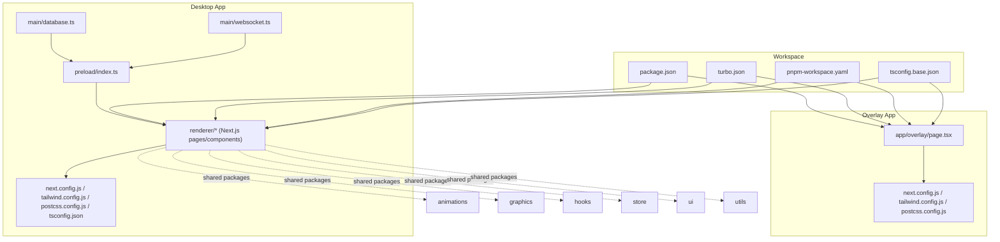
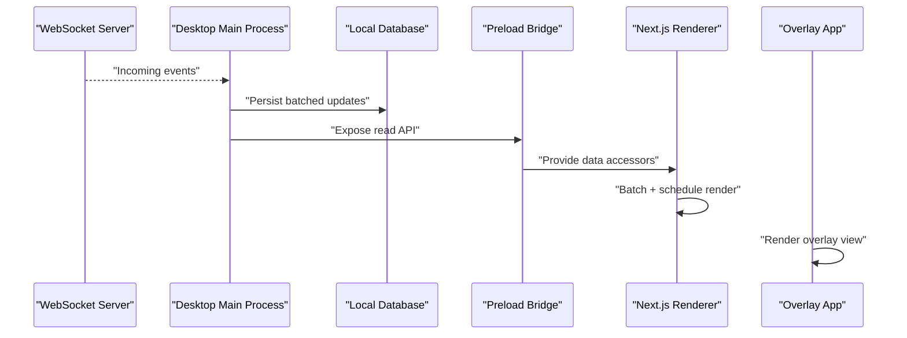
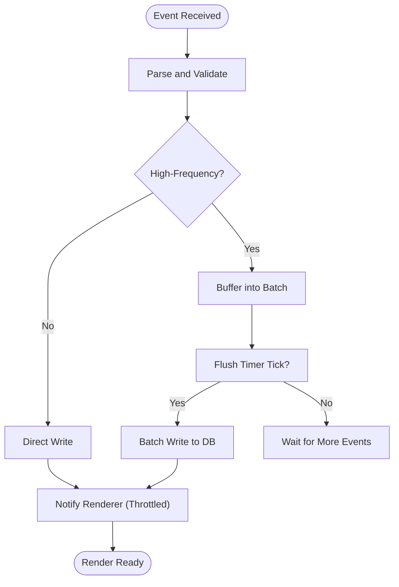
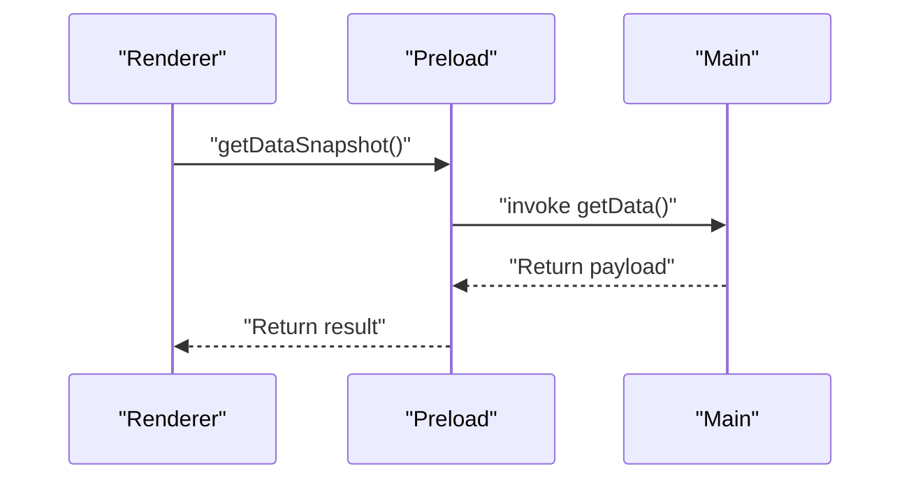
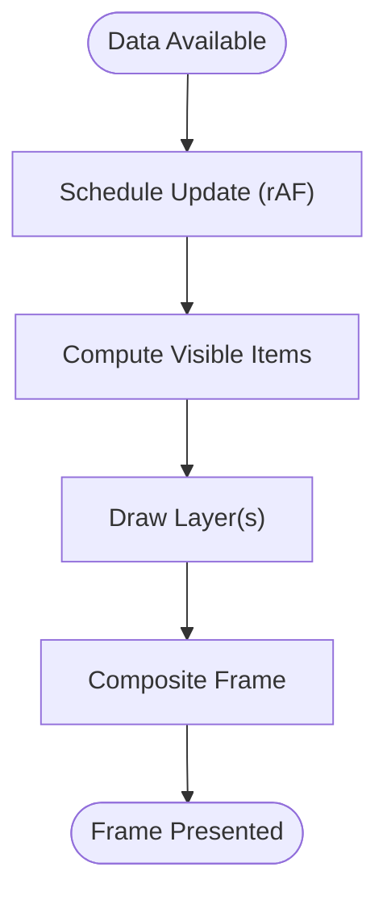
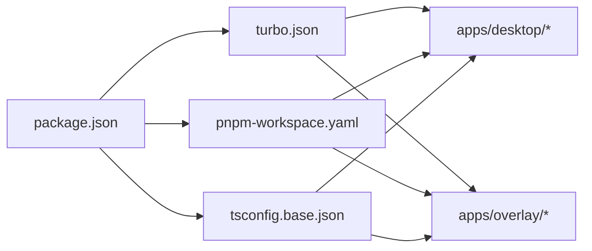

# Performance Optimization

<cite>
**Referenced Files in This Document**
- [package.json](file://package.json)
- [turbo.json](file://turbo.json)
- [pnpm-workspace.yaml](file://pnpm-workspace.yaml)
- [tsconfig.base.json](file://tsconfig.base.json)
- [apps/desktop/src/main/database.ts](file://apps/desktop/src/main/database.ts)
- [apps/desktop/src/main/websocket.ts](file://apps/desktop/src/main/websocket.ts)
- [apps/desktop/src/preload/index.ts](file://apps/desktop/src/preload/index.ts)
- [apps/desktop/next.config.js](file://apps/desktop/next.config.js)
- [apps/desktop/postcss.config.js](file://apps/desktop/postcss.config.js)
- [apps/desktop/tailwind.config.js](file://apps/desktop/tailwind.config.js)
- [apps/desktop/tsconfig.json](file://apps/desktop/tsconfig.json)
- [apps/overlay/src/app/overlay/page.tsx](file://apps/overlay/src/app/overlay/page.tsx)
- [apps/overlay/next.config.js](file://apps/overlay/next.config.js)
- [apps/overlay/postcss.config.js](file://apps/overlay/postcss.config.js)
- [apps/overlay/tailwind.config.js](file://apps/overlay/tailwind.config.js)
</cite>

## Table of Contents
1. [Introduction](#introduction)
2. [Project Structure](#project-structure)
3. [Core Components](#core-components)
4. [Architecture Overview](#architecture-overview)
5. [Detailed Component Analysis](#detailed-component-analysis)
6. [Dependency Analysis](#dependency-analysis)
7. [Performance Considerations](#performance-considerations)
8. [Troubleshooting Guide](#troubleshooting-guide)
9. [Conclusion](#conclusion)
10. [Appendices](#appendices)

## Introduction
This document provides performance optimization strategies for real-time data visualization across the project’s desktop and overlay applications. It focuses on rendering optimization, memory management, CPU usage reduction, batching frequent updates, virtual scrolling for large datasets, hardware acceleration, profiling techniques, bottleneck identification, efficient update cycles, browser-specific optimizations, mobile considerations, and monitoring performance metrics. The guidance is tailored to the repository structure and technologies used (Next.js, Tailwind CSS, PostCSS, TypeScript, and a desktop renderer with preload and main processes).

## Project Structure
The workspace includes multiple apps and shared packages:
- Desktop app: Next.js-based renderer with a main process handling database and WebSocket communication, plus a preload bridge.
- Overlay app: A lightweight Next.js app for overlay rendering.
- Shared packages: animations, graphics, hooks, icons, store, theme, types, ui, utils.

**Diagram sources**
- [apps/desktop/src/main/database.ts](file://apps/desktop/src/main/database.ts)
- [apps/desktop/src/main/websocket.ts](file://apps/desktop/src/main/websocket.ts)
- [apps/desktop/src/preload/index.ts](file://apps/desktop/src/preload/index.ts)
- [apps/desktop/next.config.js](file://apps/desktop/next.config.js)
- [apps/desktop/tailwind.config.js](file://apps/desktop/tailwind.config.js)
- [apps/desktop/postcss.config.js](file://apps/desktop/postcss.config.js)
- [apps/desktop/tsconfig.json](file://apps/desktop/tsconfig.json)
- [apps/overlay/src/app/overlay/page.tsx](file://apps/overlay/src/app/overlay/page.tsx)
- [apps/overlay/next.config.js](file://apps/overlay/next.config.js)
- [apps/overlay/tailwind.config.js](file://apps/overlay/tailwind.config.js)
- [apps/overlay/postcss.config.js](file://apps/overlay/postcss.config.js)
- [package.json](file://package.json)
- [turbo.json](file://turbo.json)
- [pnpm-workspace.yaml](file://pnpm-workspace.yaml)
- [tsconfig.base.json](file://tsconfig.base.json)

**Section sources**
- [package.json](file://package.json)
- [turbo.json](file://turbo.json)
- [pnpm-workspace.yaml](file://pnpm-workspace.yaml)
- [tsconfig.base.json](file://tsconfig.base.json)
- [apps/desktop/src/main/database.ts](file://apps/desktop/src/main/database.ts)
- [apps/desktop/src/main/websocket.ts](file://apps/desktop/src/main/websocket.ts)
- [apps/desktop/src/preload/index.ts](file://apps/desktop/src/preload/index.ts)
- [apps/desktop/next.config.js](file://apps/desktop/next.config.js)
- [apps/desktop/tailwind.config.js](file://apps/desktop/tailwind.config.js)
- [apps/desktop/postcss.config.js](file://apps/desktop/postcss.config.js)
- [apps/desktop/tsconfig.json](file://apps/desktop/tsconfig.json)
- [apps/overlay/src/app/overlay/page.tsx](file://apps/overlay/src/app/overlay/page.tsx)
- [apps/overlay/next.config.js](file://apps/overlay/next.config.js)
- [apps/overlay/tailwind.config.js](file://apps/overlay/tailwind.config.js)
- [apps/overlay/postcss.config.js](file://apps/overlay/postcss.config.js)

## Core Components
Key areas impacting performance:
- Data ingestion and transport: WebSocket stream and local database synchronization in the desktop main process.
- IPC bridge: Preload module exposing safe APIs to the renderer.
- Renderer: Next.js pages and components that render visualizations.
- Configuration: Build and styling configs that influence bundle size and runtime behavior.

Optimization priorities:
- Minimize cross-process messages and payload sizes.
- Batch and throttle incoming updates before rendering.
- Use GPU-accelerated layers and avoid layout thrashing.
- Virtualize large lists or charts where applicable.
- Profile both main and renderer processes.

**Section sources**
- [apps/desktop/src/main/websocket.ts](file://apps/desktop/src/main/websocket.ts)
- [apps/desktop/src/main/database.ts](file://apps/desktop/src/main/database.ts)
- [apps/desktop/src/preload/index.ts](file://apps/desktop/src/preload/index.ts)
- [apps/desktop/next.config.js](file://apps/desktop/next.config.js)
- [apps/desktop/tailwind.config.js](file://apps/desktop/tailwind.config.js)
- [apps/desktop/postcss.config.js](file://apps/desktop/postcss.config.js)
- [apps/desktop/tsconfig.json](file://apps/desktop/tsconfig.json)
- [apps/overlay/src/app/overlay/page.tsx](file://apps/overlay/src/app/overlay/page.tsx)
- [apps/overlay/next.config.js](file://apps/overlay/next.config.js)
- [apps/overlay/tailwind.config.js](file://apps/overlay/tailwind.config.js)
- [apps/overlay/postcss.config.js](file://apps/overlay/postcss.config.js)

## Architecture Overview
The desktop app uses a main process to receive real-time data via WebSocket, persist it locally, and expose it through a preload bridge to the renderer. The overlay app renders an independent view optimized for overlays.

**Diagram sources**
- [apps/desktop/src/main/websocket.ts](file://apps/desktop/src/main/websocket.ts)
- [apps/desktop/src/main/database.ts](file://apps/desktop/src/main/database.ts)
- [apps/desktop/src/preload/index.ts](file://apps/desktop/src/preload/index.ts)
- [apps/overlay/src/app/overlay/page.tsx](file://apps/overlay/src/app/overlay/page.tsx)

## Detailed Component Analysis

### Real-Time Data Pipeline (Desktop Main)
Responsibilities:
- Receive high-frequency events from WebSocket.
- Persist to local storage efficiently.
- Expose minimal, typed APIs to the renderer.

Optimization tactics:
- Coalesce and batch events before persistence and exposure.
- Debounce/throttle write operations to reduce disk I/O.
- Serialize compact payloads; avoid unnecessary fields.
- Use incremental updates rather than full snapshots when possible.

**Diagram sources**
- [apps/desktop/src/main/websocket.ts](file://apps/desktop/src/main/websocket.ts)
- [apps/desktop/src/main/database.ts](file://apps/desktop/src/main/database.ts)

**Section sources**
- [apps/desktop/src/main/websocket.ts](file://apps/desktop/src/main/websocket.ts)
- [apps/desktop/src/main/database.ts](file://apps/desktop/src/main/database.ts)

### IPC Bridge (Preload)
Responsibilities:
- Provide safe, limited APIs to the renderer.
- Avoid synchronous heavy work on the bridge.

Optimization tactics:
- Return promises for async operations.
- Expose getters that return stable references or snapshots only when needed.
- Keep the surface area small to reduce serialization overhead.

**Diagram sources**
- [apps/desktop/src/preload/index.ts](file://apps/desktop/src/preload/index.ts)

**Section sources**
- [apps/desktop/src/preload/index.ts](file://apps/desktop/src/preload/index.ts)

### Renderer (Next.js Pages/Components)
Responsibilities:
- Consume data from preload APIs.
- Render visualizations efficiently.

Optimization tactics:
- Batch state updates using requestAnimationFrame or microtask scheduling.
- Use memoization and selective re-renders.
- Prefer canvas/WebGL for heavy drawing; use SVG sparingly for complex scenes.
- Apply will-change and transform-based animations to leverage GPU.

[No sources needed since this diagram shows conceptual workflow, not actual code structure]

### Overlay App
Responsibilities:
- Render a focused overlay view with minimal overhead.

Optimization tactics:
- Disable unused features and minimize dependencies.
- Use static exports where possible.
- Keep DOM depth shallow; prefer flat structures.

**Section sources**
- [apps/overlay/src/app/overlay/page.tsx](file://apps/overlay/src/app/overlay/page.tsx)
- [apps/overlay/next.config.js](file://apps/overlay/next.config.js)
- [apps/overlay/tailwind.config.js](file://apps/overlay/tailwind.config.js)
- [apps/overlay/postcss.config.js](file://apps/overlay/postcss.config.js)

## Dependency Analysis
The workspace leverages Turborepo and pnpm workspaces to coordinate builds and caching across apps and packages.

**Diagram sources**
- [package.json](file://package.json)
- [turbo.json](file://turbo.json)
- [pnpm-workspace.yaml](file://pnpm-workspace.yaml)
- [tsconfig.base.json](file://tsconfig.base.json)

**Section sources**
- [package.json](file://package.json)
- [turbo.json](file://turbo.json)
- [pnpm-workspace.yaml](file://pnpm-workspace.yaml)
- [tsconfig.base.json](file://tsconfig.base.json)

## Performance Considerations

### Rendering Optimization Techniques
- Prefer GPU-accelerated properties (transform, opacity) and avoid layout-triggering changes.
- Use layered rendering: separate background, grid, and dynamic elements.
- Reduce overdraw by culling off-screen items and limiting redraw regions.
- For vector-heavy visuals, consider WebGL or Canvas instead of many DOM nodes.

### Memory Management
- Reuse buffers and textures; avoid allocating per-frame objects.
- Release references to large arrays after processing.
- Avoid long-lived closures capturing large scopes.
- Monitor heap growth during live sessions and reset caches periodically.

### CPU Usage Reduction
- Throttle event handlers and coalesce updates.
- Use Web Workers for heavy computations off the main thread.
- Memoize expensive selectors and derived data.
- Limit re-renders by stabilizing props and using fine-grained state slices.

### Batching Strategies for Frequent Updates
- Aggregate events into batches with fixed time windows.
- Merge deltas to avoid redundant writes and renders.
- Debounce user interactions; throttle telemetry and heartbeat events.

### Virtual Scrolling for Large Datasets
- Implement viewport-aware rendering to show only visible rows/items.
- Recycle item instances and reuse DOM/canvas cells.
- Maintain stable keys and indices to prevent unnecessary remounts.

### Hardware Acceleration Utilization
- Enable GPU compositing for animated layers.
- Use transform-based animations and avoid layout/paint-heavy properties.
- Profile compositor layers to ensure they are truly accelerated.

### Profiling Visualization Performance
- Use browser DevTools Performance panel to capture frames and identify long tasks.
- Measure FPS, frame duration, and paint/layout times.
- In Electron, profile both main and renderer processes.
- Instrument custom metrics around data ingestion, compute, and draw phases.

### Identifying Bottlenecks
- Look for excessive layout recalculations and forced sync reads.
- Detect large JavaScript execution blocks blocking the main thread.
- Inspect network payloads and IPC message sizes.
- Check for memory leaks via heap snapshots over time.

### Efficient Update Cycles
- Align updates with the display refresh rate using requestAnimationFrame.
- Separate data mutation from rendering; render once per frame.
- Use double-buffering patterns for canvas/WebGL to avoid tearing.

### Browser-Specific Optimizations
- Chrome/Edge: leverage Paint Timing and Layout Instability metrics.
- Firefox: use Performance Insights and repaint highlighting.
- Safari: enable Web Inspector timeline and check for layout thrashing.

### Mobile Device Considerations
- Reduce pixel density for non-critical visuals.
- Lower animation complexity and frame rates when battery is low.
- Minimize memory footprint and avoid large allocations.
- Test touch interaction responsiveness and input latency.

### Monitoring Performance Metrics
- Track FPS, frame time, GC pauses, and memory usage.
- Log throughput of data ingestion and render durations.
- Set alerts for sustained frame drops or memory growth.

[No sources needed since this section provides general guidance]

## Troubleshooting Guide
Common issues and remedies:
- Janky animations: inspect layout thrash and force reflows; switch to transform/opacity.
- High CPU: locate long-running tasks in the Performance panel; move work to workers.
- Memory spikes: take heap snapshots to find retained objects; clear caches and release references.
- Stutter on updates: increase batching window; reduce payload size; virtualize lists.
- IPC overhead: serialize fewer fields; batch messages; avoid synchronous calls.

[No sources needed since this section provides general guidance]

## Conclusion
By combining batching, virtualization, GPU acceleration, careful memory management, and disciplined profiling, you can achieve smooth, responsive real-time visualizations across desktop and overlay contexts. Focus on minimizing main-thread work, reducing payload sizes, and aligning updates with frame budgets. Continuously monitor metrics and iterate based on observed bottlenecks.

[No sources needed since this section summarizes without analyzing specific files]

## Appendices

### Configuration Levers That Impact Performance
- Next.js build settings: optimize bundles, disable dev-only features in production.
- Tailwind and PostCSS: purge unused styles to reduce CSS size.
- TypeScript config: ensure strict checks to catch costly runtime errors early.

**Section sources**
- [apps/desktop/next.config.js](file://apps/desktop/next.config.js)
- [apps/desktop/tailwind.config.js](file://apps/desktop/tailwind.config.js)
- [apps/desktop/postcss.config.js](file://apps/desktop/postcss.config.js)
- [apps/desktop/tsconfig.json](file://apps/desktop/tsconfig.json)
- [apps/overlay/next.config.js](file://apps/overlay/next.config.js)
- [apps/overlay/tailwind.config.js](file://apps/overlay/tailwind.config.js)
- [apps/overlay/postcss.config.js](file://apps/overlay/postcss.config.js)