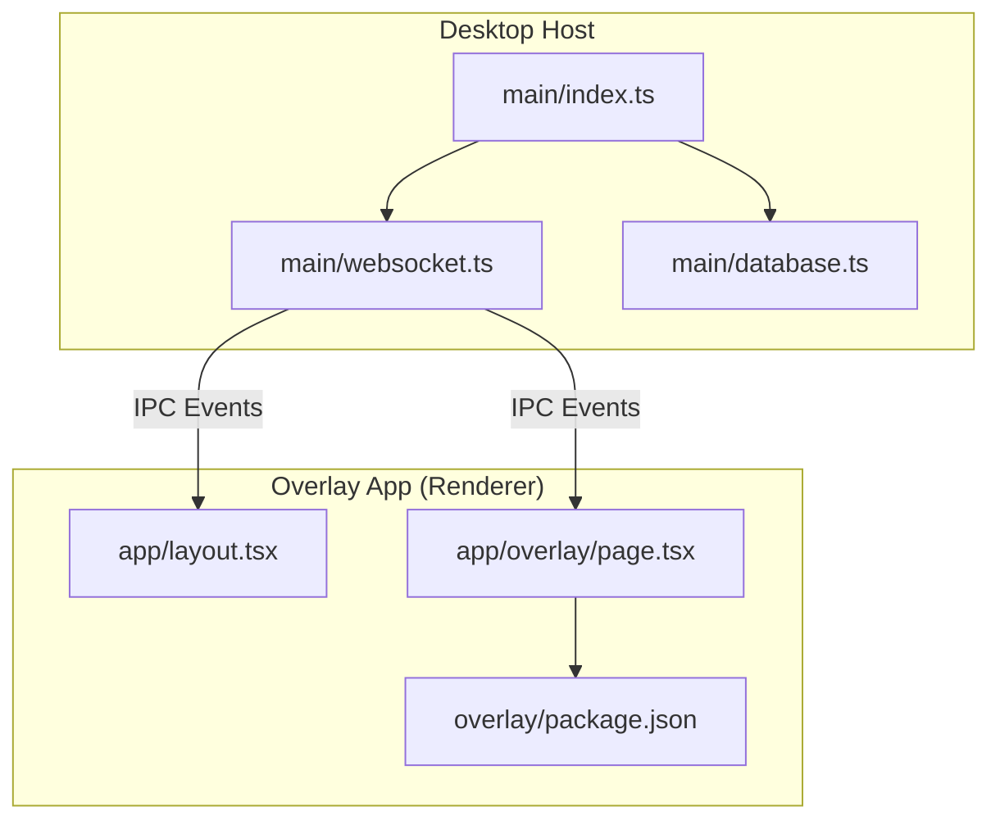
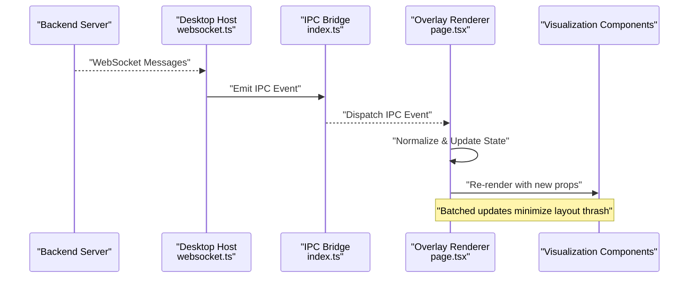
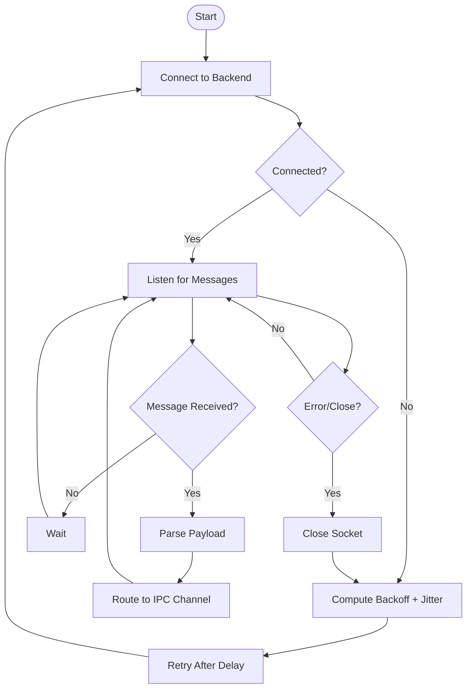
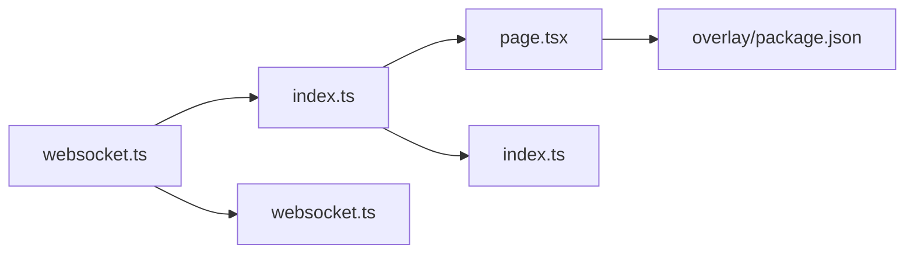

# Real-time Data Visualization

<cite>
**Referenced Files in This Document**
- [websocket.ts](file://apps/desktop/src/main/websocket.ts)
- [database.ts](file://apps/desktop/src/main/database.ts)
- [index.ts](file://apps/desktop/src/main/index.ts)
- [page.tsx](file://apps/overlay/src/app/overlay/page.tsx)
- [layout.tsx](file://apps/overlay/src/app/layout.tsx)
- [package.json](file://apps/overlay/package.json)
- [package.json](file://apps/desktop/package.json)
</cite>

## Table of Contents
1. [Introduction](#introduction)
2. [Project Structure](#project-structure)
3. [Core Components](#core-components)
4. [Architecture Overview](#architecture-overview)
5. [Detailed Component Analysis](#detailed-component-analysis)
6. [Dependency Analysis](#dependency-analysis)
7. [Performance Considerations](#performance-considerations)
8. [Troubleshooting Guide](#troubleshooting-guide)
9. [Conclusion](#conclusion)
10. [Appendices](#appendices)

## Introduction
This document explains how the overlay system provides real-time data visualization for live matches, including WebSocket integration for live streaming, state synchronization patterns, and efficient update mechanisms. It covers data binding approaches, event handling for live updates, performance optimization for high-frequency changes, and guidance for implementing custom visualizations such as scores, statistics, player information, and match events.

## Project Structure
The overlay application is a Next.js app that renders visuals in a browser context (renderer). The desktop host manages the WebSocket connection to the backend and forwards messages to the renderer via IPC. Key areas:
- Overlay UI: pages and layout under apps/overlay/src/app
- Desktop host: main process modules for IPC and WebSocket under apps/desktop/src/main
- Package configuration for dependencies and scripts under apps/overlay/package.json and apps/desktop/package.json

**Diagram sources**
- [index.ts](file://apps/desktop/src/main/index.ts)
- [websocket.ts](file://apps/desktop/src/main/websocket.ts)
- [database.ts](file://apps/desktop/src/main/database.ts)
- [layout.tsx](file://apps/overlay/src/app/layout.tsx)
- [page.tsx](file://apps/overlay/src/app/overlay/page.tsx)
- [package.json](file://apps/overlay/package.json)

**Section sources**
- [index.ts](file://apps/desktop/src/main/index.ts)
- [websocket.ts](file://apps/desktop/src/main/websocket.ts)
- [database.ts](file://apps/desktop/src/main/database.ts)
- [layout.tsx](file://apps/overlay/src/app/layout.tsx)
- [page.tsx](file://apps/overlay/src/app/overlay/page.tsx)
- [package.json](file://apps/overlay/package.json)

## Core Components
- WebSocket Manager (desktop): Establishes and maintains the WebSocket connection to the backend, handles reconnection, and relays messages to the renderer via IPC.
- IPC Bridge (desktop): Exposes typed IPC channels for the overlay to subscribe to live events and query current state.
- Overlay State Sync (renderer): Subscribes to IPC events, normalizes payloads, and exposes reactive state to components.
- Visualization Components (renderer): Present scores, statistics, player info, and match events; consume normalized state and animate transitions efficiently.

Implementation references:
- WebSocket manager and IPC wiring: [websocket.ts](file://apps/desktop/src/main/websocket.ts), [index.ts](file://apps/desktop/src/main/index.ts)
- Overlay page and layout: [page.tsx](file://apps/overlay/src/app/overlay/page.tsx), [layout.tsx](file://apps/overlay/src/app/layout.tsx)
- Dependencies and runtime config: [package.json](file://apps/overlay/package.json), [package.json](file://apps/desktop/package.json)

**Section sources**
- [websocket.ts](file://apps/desktop/src/main/websocket.ts)
- [index.ts](file://apps/desktop/src/main/index.ts)
- [page.tsx](file://apps/overlay/src/app/overlay/page.tsx)
- [layout.tsx](file://apps/overlay/src/app/layout.tsx)
- [package.json](file://apps/overlay/package.json)
- [package.json](file://apps/desktop/package.json)

## Architecture Overview
The overlay architecture separates concerns between the desktop host (networking and IPC) and the renderer (UI and rendering). The host connects to the backend over WebSocket, translates backend messages into IPC events, and the overlay subscribes to these events to update its local state and render visuals.

**Diagram sources**
- [websocket.ts](file://apps/desktop/src/main/websocket.ts)
- [index.ts](file://apps/desktop/src/main/index.ts)
- [page.tsx](file://apps/overlay/src/app/overlay/page.tsx)

## Detailed Component Analysis

### WebSocket Integration and Reconnection
Responsibilities:
- Connect to the configured backend URL
- Handle open, message, error, and close events
- Implement exponential backoff and jitter for reconnection
- Forward relevant messages to the renderer via IPC channels

Key behaviors:
- On connect: send handshake or subscription payload if required by the backend
- On message: parse and route to specific IPC channels (e.g., score, stats, events)
- On error/close: schedule reconnection attempts with backoff and jitter
- On disconnect: emit a “disconnected” IPC event so the overlay can show fallback UI

References:
- Connection lifecycle and IPC forwarding: [websocket.ts](file://apps/desktop/src/main/websocket.ts)
- IPC registration and channel names: [index.ts](file://apps/desktop/src/main/index.ts)

**Section sources**
- [websocket.ts](file://apps/desktop/src/main/websocket.ts)
- [index.ts](file://apps/desktop/src/main/index.ts)

#### WebSocket Flowchart

**Diagram sources**
- [websocket.ts](file://apps/desktop/src/main/websocket.ts)

### IPC Bridge and State Synchronization
Responsibilities:
- Define IPC channels for live events and queries
- Normalize incoming payloads into a consistent shape for the overlay
- Provide a stable API surface for the renderer to subscribe to updates

State synchronization patterns:
- Event-driven updates: overlay subscribes to IPC events and applies deltas
- Snapshot on demand: overlay requests full state snapshot when needed (e.g., after reconnect)
- Idempotent updates: ensure repeated events do not corrupt state

References:
- IPC channel definitions and handlers: [index.ts](file://apps/desktop/src/main/index.ts)
- Overlay subscription and normalization logic: [page.tsx](file://apps/overlay/src/app/overlay/page.tsx)

**Section sources**
- [index.ts](file://apps/desktop/src/main/index.ts)
- [page.tsx](file://apps/overlay/src/app/overlay/page.tsx)

### Overlay Rendering and Data Binding
Responsibilities:
- Consume IPC events and maintain a normalized store
- Bind store fields to visualization components
- Optimize rendering by minimizing re-renders and using stable keys

Data binding approaches:
- Centralized store pattern: single source of truth updated by IPC listeners
- Derived state: compute read-only views (e.g., formatted time, computed stats)
- Selectors: components subscribe only to the slices they need

Visualization components:
- Scores: display team/player scores with animated transitions
- Statistics: aggregate metrics like possession, shots, fouls
- Player information: name, number, position, status
- Match events: goals, cards, substitutions, timeouts

References:
- Overlay entry point and subscriptions: [page.tsx](file://apps/overlay/src/app/overlay/page.tsx)
- Layout-level providers and global styles: [layout.tsx](file://apps/overlay/src/app/layout.tsx)

**Section sources**
- [page.tsx](file://apps/overlay/src/app/overlay/page.tsx)
- [layout.tsx](file://apps/overlay/src/app/layout.tsx)

### Custom Visualization Implementation Guide
Steps:
1. Subscribe to the relevant IPC channel from the overlay layer
2. Normalize the payload into your component’s expected shape
3. Derive any computed values locally to avoid heavy calculations during render
4. Use stable keys and memoization to prevent unnecessary re-renders
5. Animate changes with lightweight transforms (scale, opacity) rather than layout-affecting properties

Example reference paths:
- Subscription and normalization: [page.tsx](file://apps/overlay/src/app/overlay/page.tsx)
- IPC channel usage: [index.ts](file://apps/desktop/src/main/index.ts)

**Section sources**
- [page.tsx](file://apps/overlay/src/app/overlay/page.tsx)
- [index.ts](file://apps/desktop/src/main/index.ts)

## Dependency Analysis
The overlay depends on the desktop host for networking and IPC. The desktop host depends on the backend server over WebSocket and exposes IPC channels to the renderer.

**Diagram sources**
- [websocket.ts](file://apps/desktop/src/main/websocket.ts)
- [index.ts](file://apps/desktop/src/main/index.ts)
- [page.tsx](file://apps/overlay/src/app/overlay/page.tsx)
- [package.json](file://apps/overlay/package.json)

**Section sources**
- [websocket.ts](file://apps/desktop/src/main/websocket.ts)
- [index.ts](file://apps/desktop/src/main/index.ts)
- [page.tsx](file://apps/overlay/src/app/overlay/page.tsx)
- [package.json](file://apps/overlay/package.json)

## Performance Considerations
- Batch updates: coalesce multiple IPC events into a single state update to reduce re-renders
- Prefer immutable diffs: apply minimal changes to derived state and use stable object references
- Avoid layout thrash: animate transform and opacity instead of width/height/top/left
- Memoize expensive computations: cache derived values and only recalculate when inputs change
- Limit subscriber scope: components should subscribe only to the data they need
- Debounce high-frequency events: group rapid events (e.g., tick counters) before updating UI
- Use requestAnimationFrame for smooth animations: coordinate animation frames with data updates

[No sources needed since this section provides general guidance]

## Troubleshooting Guide
Common issues and resolutions:
- No data displayed: verify IPC channels are registered and overlay is subscribed
- Stale data after reconnect: trigger a snapshot fetch and reset local state
- High CPU usage: check for excessive re-renders; add memoization and reduce subscriber scope
- Frequent disconnects: inspect backoff settings and network conditions; consider increasing retry intervals
- Out-of-order events: implement sequence numbers or timestamps to reorder or deduplicate

Reference locations:
- WebSocket lifecycle and error handling: [websocket.ts](file://apps/desktop/src/main/websocket.ts)
- IPC channel wiring: [index.ts](file://apps/desktop/src/main/index.ts)
- Overlay subscription and state updates: [page.tsx](file://apps/overlay/src/app/overlay/page.tsx)

**Section sources**
- [websocket.ts](file://apps/desktop/src/main/websocket.ts)
- [index.ts](file://apps/desktop/src/main/index.ts)
- [page.tsx](file://apps/overlay/src/app/overlay/page.tsx)

## Conclusion
The overlay system achieves smooth real-time visualization by separating networking and IPC responsibilities from rendering. The desktop host manages WebSocket connectivity and relays events to the renderer, while the overlay normalizes state and binds it to lightweight visualization components. Following the recommended patterns—event-driven updates, batching, memoization, and careful animation choices—ensures responsive visuals even under high-frequency data changes.

[No sources needed since this section summarizes without analyzing specific files]

## Appendices

### A. IPC Channels Reference
- Live Score Updates
- Live Statistics Updates
- Player Information Updates
- Match Events Feed
- Connection Status (connected/disconnected)

Channel definitions and handlers are implemented in the desktop host and consumed by the overlay.

**Section sources**
- [index.ts](file://apps/desktop/src/main/index.ts)
- [page.tsx](file://apps/overlay/src/app/overlay/page.tsx)

### B. Environment and Configuration
- Backend WebSocket URL and credentials
- Overlay window size and scaling options
- Logging levels for debugging IPC and WebSocket events

Configuration is typically loaded at startup and passed through IPC or environment variables.

**Section sources**
- [package.json](file://apps/overlay/package.json)
- [package.json](file://apps/desktop/package.json)