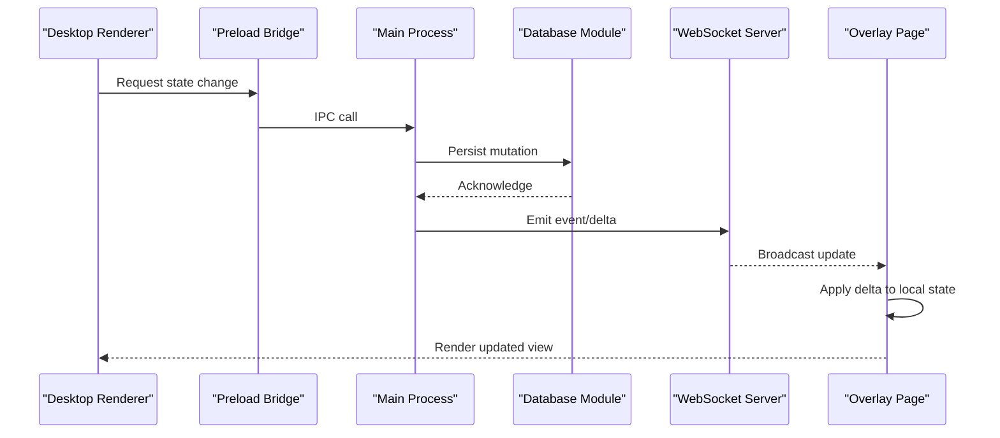
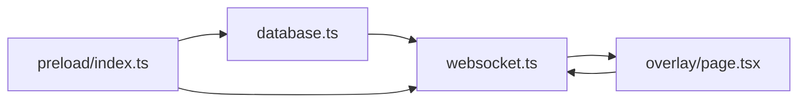
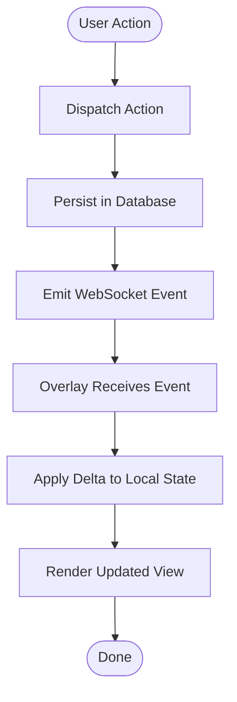

# State Synchronization

<cite>
**Referenced Files in This Document**
- [desktop/src/main/database.ts](file://apps/desktop/src/main/database.ts)
- [desktop/src/main/websocket.ts](file://apps/desktop/src/main/websocket.ts)
- [desktop/src/preload/index.ts](file://apps/desktop/src/preload/index.ts)
- [overlay/src/app/overlay/page.tsx](file://apps/overlay/src/app/overlay/page.tsx)
- [packages/store/package.json](file://packages/store/package.json)
</cite>

## Table of Contents
1. [Introduction](#introduction)
2. [Project Structure](#project-structure)
3. [Core Components](#core-components)
4. [Architecture Overview](#architecture-overview)
5. [Detailed Component Analysis](#detailed-component-analysis)
6. [Dependency Analysis](#dependency-analysis)
7. [Performance Considerations](#performance-considerations)
8. [Troubleshooting Guide](#troubleshooting-guide)
9. [Conclusion](#conclusion)
10. [Appendices](#appendices)

## Introduction
This document explains the state synchronization architecture between the desktop application and the overlay renderer. It covers centralized state management, data binding patterns, update propagation, persistence strategies, conflict resolution, efficient diffing, custom handlers, performance optimization for large datasets, versioning and rollback, and debugging techniques. The goal is to provide a clear mental model and actionable guidance for implementing robust, low-latency synchronization across processes.

## Project Structure
The relevant parts of the codebase include:
- Desktop main process: database access and WebSocket server for cross-process communication
- Preload bridge: IPC exposure from main to renderer
- Overlay app: Next.js-based overlay that consumes synchronized state
- Shared store package: intended as a common state layer (package present; implementation details are not analyzed here)

```mermaid
graph TB
subgraph "Desktop App"
Main["Main Process<br/>database.ts"]
WS["WebSocket Server<br/>websocket.ts"]
Preload["Preload Bridge<br/>preload/index.ts"]
Renderer["Renderer UI"]
end
subgraph "Overlay App"
OverlayPage["Overlay Page<br/>overlay/page.tsx"]
end
Main --> WS
Main --> Preload
Preload --> Renderer
WS < --> OverlayPage
```

**Diagram sources**
- [desktop/src/main/database.ts](file://apps/desktop/src/main/database.ts)
- [desktop/src/main/websocket.ts](file://apps/desktop/src/main/websocket.ts)
- [desktop/src/preload/index.ts](file://apps/desktop/src/preload/index.ts)
- [overlay/src/app/overlay/page.tsx](file://apps/overlay/src/app/overlay/page.tsx)

**Section sources**
- [desktop/src/main/database.ts](file://apps/desktop/src/main/database.ts)
- [desktop/src/main/websocket.ts](file://apps/desktop/src/main/websocket.ts)
- [desktop/src/preload/index.ts](file://apps/desktop/src/preload/index.ts)
- [overlay/src/app/overlay/page.tsx](file://apps/overlay/src/app/overlay/page.tsx)

## Core Components
- Centralized state source: The desktop main process owns authoritative state via the database module. All mutations originate here to ensure consistency.
- Cross-process transport: A WebSocket server in the main process broadcasts updates to connected clients, including the overlay renderer.
- IPC bridge: The preload script exposes safe APIs to the renderer for reading or requesting state changes.
- Overlay consumer: The overlay page subscribes to updates and renders the current state efficiently.

Key responsibilities:
- Database module: persists state and provides read/write operations.
- WebSocket module: serializes state deltas/events and fans out to subscribers.
- Preload: marshals calls between renderer and main safely.
- Overlay: maintains a local snapshot and applies incoming updates with minimal re-renders.

**Section sources**
- [desktop/src/main/database.ts](file://apps/desktop/src/main/database.ts)
- [desktop/src/main/websocket.ts](file://apps/desktop/src/main/websocket.ts)
- [desktop/src/preload/index.ts](file://apps/desktop/src/preload/index.ts)
- [overlay/src/app/overlay/page.tsx](file://apps/overlay/src/app/overlay/page.tsx)

## Architecture Overview
The system follows a single-writer pattern:
- Single writer: Only the desktop main process writes to the database.
- Event-driven broadcast: On each mutation, the main process emits structured events over WebSocket.
- Client reconciliation: The overlay receives events and applies them to its local state using efficient diffing.



**Diagram sources**
- [desktop/src/main/database.ts](file://apps/desktop/src/main/database.ts)
- [desktop/src/main/websocket.ts](file://apps/desktop/src/main/websocket.ts)
- [desktop/src/preload/index.ts](file://apps/desktop/src/preload/index.ts)
- [overlay/src/app/overlay/page.tsx](file://apps/overlay/src/app/overlay/page.tsx)

## Detailed Component Analysis

### Centralized State Management
- Ownership: The database module is the canonical source of truth. All mutations flow through it.
- Immutability: Prefer immutable updates to simplify diffing and enable time-travel features.
- Versioning: Each state object carries a monotonically increasing version or timestamp to support ordering and conflict resolution.

Implementation pointers:
- Define typed state schemas and validation at the boundary of persistence.
- Expose atomic transactional methods to avoid partial updates.

**Section sources**
- [desktop/src/main/database.ts](file://apps/desktop/src/main/database.ts)

### Data Binding Patterns
- One-way data flow: UI triggers actions; actions mutate state centrally; observers react to changes.
- Selectors: Derive computed values from base state to reduce redundant work.
- Fine-grained subscriptions: Subscribe only to slices of state to minimize render overhead.

Practical tips:
- Use stable references for objects and arrays to leverage shallow comparisons.
- Normalize large collections by ID to enable O(1) lookups and targeted updates.

[No sources needed since this section provides general guidance]

### Update Propagation Mechanisms
- Event schema: Define a consistent event envelope with fields such as type, version, payload, and optional metadata.
- Delta vs full snapshots: For frequent updates, prefer deltas keyed by entity IDs; fall back to snapshots on reconnect or when necessary.
- Backpressure: Implement throttling/coalescing on the server side and batching on the client side.

**Section sources**
- [desktop/src/main/websocket.ts](file://apps/desktop/src/main/websocket.ts)

### State Persistence Strategies
- Write-through: Persist immediately on mutation to guarantee durability.
- Journaling: Maintain an append-only log of changes to support replay and recovery.
- Checkpointing: Periodically serialize a compact snapshot to speed up startup and recovery.

Operational considerations:
- Ensure idempotent apply logic so repeated events do not corrupt state.
- Separate hot path (in-memory) from cold path (disk) to optimize latency.

**Section sources**
- [desktop/src/main/database.ts](file://apps/desktop/src/main/database.ts)

### Conflict Resolution Approaches
- Last-writer-wins with vector clocks or logical timestamps to order concurrent edits.
- Operational transforms or CRDTs for collaborative scenarios requiring stronger guarantees.
- Merge strategies per field: e.g., numeric counters use additive merges; lists use insert/delete ops.

Recovery:
- On overlap detection, record conflicts and prompt user or auto-resolve based on policy.

[No sources needed since this section provides general guidance]

### Efficient Diffing Algorithms
- Entity-level diffs: Track changed entities rather than whole trees.
- Structural sharing: Keep unchanged subtrees referenced directly to avoid copying.
- Batched updates: Coalesce multiple mutations into a single delta where possible.

Client-side application:
- Apply deltas incrementally and invalidate only affected components.
- Use memoization and virtualization for large lists.

[No sources needed since this section provides general guidance]

### Custom State Handlers
To implement a custom handler:
- Define a new action type and corresponding reducer/update function.
- Persist the change in the database module.
- Emit a WebSocket event describing the change.
- In the overlay, subscribe to the event and apply it to local state.

Reference points:
- Action dispatch and persistence entry points in the main process.
- WebSocket emission site for broadcasting.
- Overlay subscription and application logic.

**Section sources**
- [desktop/src/main/database.ts](file://apps/desktop/src/main/database.ts)
- [desktop/src/main/websocket.ts](file://apps/desktop/src/main/websocket.ts)
- [overlay/src/app/overlay/page.tsx](file://apps/overlay/src/app/overlay/page.tsx)

### Optimizing Update Frequency
- Debounce rapid inputs on the UI side.
- Throttle server emissions to a maximum rate.
- Coalesce multiple small changes into a single delta.
- Use requestAnimationFrame-aware rendering in the overlay to avoid unnecessary frames.

[No sources needed since this section provides general guidance]

### Managing Large Datasets
- Pagination and virtual scrolling in the overlay.
- Normalized state shape with separate entity maps and ordered lists.
- Lazy loading of heavy resources and progressive hydration.

[No sources needed since this section provides general guidance]

### State Versioning and Rollback
- Versioned snapshots: Store incremental versions with diffs.
- Rollback: Replay to a previous version or undo the last N operations.
- Migration: Provide migration functions to evolve schemas without breaking older clients.

**Section sources**
- [desktop/src/main/database.ts](file://apps/desktop/src/main/database.ts)

### Debugging Tools for State Synchronization
- Event logging: Capture outgoing and incoming events with timestamps and versions.
- State snapshots: Periodically dump current state for inspection.
- Reconciliation checks: Compare server and client states after sync to detect drift.
- Overlay diagnostics: Visual indicators for lag, missed events, or retry attempts.

[No sources needed since this section provides general guidance]

## Dependency Analysis
The following diagram shows how the core modules depend on each other for state synchronization.



**Diagram sources**
- [desktop/src/main/database.ts](file://apps/desktop/src/main/database.ts)
- [desktop/src/main/websocket.ts](file://apps/desktop/src/main/websocket.ts)
- [desktop/src/preload/index.ts](file://apps/desktop/src/preload/index.ts)
- [overlay/src/app/overlay/page.tsx](file://apps/overlay/src/app/overlay/page.tsx)

**Section sources**
- [desktop/src/main/database.ts](file://apps/desktop/src/main/database.ts)
- [desktop/src/main/websocket.ts](file://apps/desktop/src/main/websocket.ts)
- [desktop/src/preload/index.ts](file://apps/desktop/src/preload/index.ts)
- [overlay/src/app/overlay/page.tsx](file://apps/overlay/src/app/overlay/page.tsx)

## Performance Considerations
- Minimize payload size: send only changed fields and normalize entities.
- Avoid layout thrashing: batch DOM updates and use CSS containment where appropriate.
- Offload heavy work: compute derived data off the main thread if feasible.
- Monitor memory: watch for retained references and stale closures in long-running overlays.

[No sources needed since this section provides general guidance]

## Troubleshooting Guide
Common issues and remedies:
- Stale overlay state: Verify event ordering and version numbers; enforce monotonicity.
- Missed events: Implement reconnection with gap-filling using sequence numbers.
- High CPU usage: Profile overlay rendering; switch to virtualization and memoization.
- Data corruption: Validate payloads before applying; add checksums for critical structures.

Diagnostic steps:
- Enable verbose logs around persistence and WebSocket I/O.
- Capture a state snapshot before and after applying an event to isolate regressions.
- Use a deterministic seed for test fixtures to reproduce edge cases.

[No sources needed since this section provides general guidance]

## Conclusion
A robust state synchronization strategy hinges on a single authoritative source, well-defined event contracts, efficient diffing, and strong operational practices like versioning, journaling, and diagnostics. By adhering to these patterns, the desktop application and overlay can maintain consistent, responsive views even under high-frequency updates and large datasets.

## Appendices

### Appendix A: Example End-to-End Flow


[No sources needed since this diagram shows conceptual workflow, not actual code structure]

### Appendix B: Shared Store Package
The packages/store directory indicates a shared state package intended for reuse across apps. Its presence suggests a plan to centralize types and utilities related to state handling. Implementation specifics are not analyzed here.

**Section sources**
- [packages/store/package.json](file://packages/store/package.json)