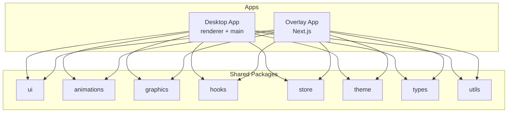
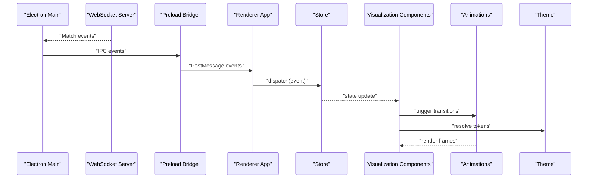
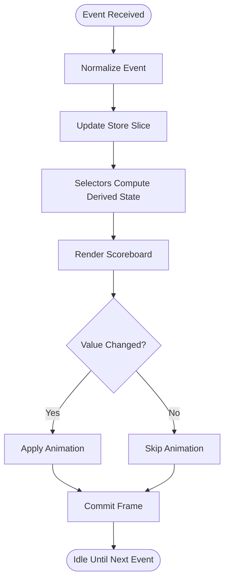
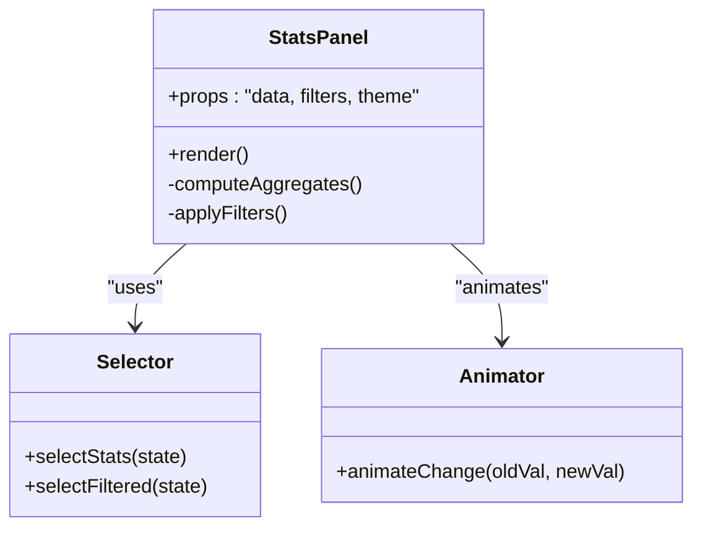
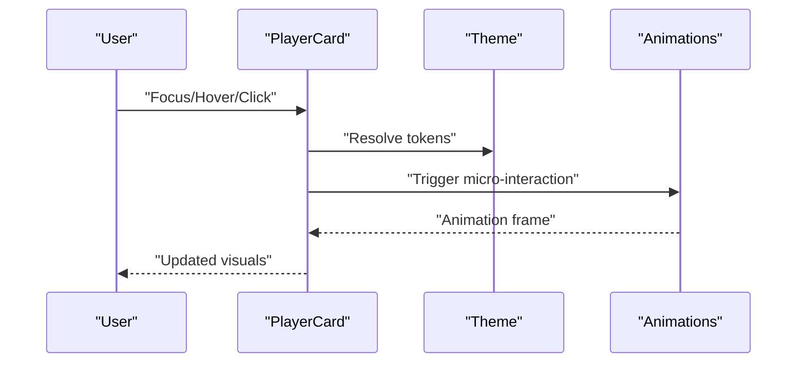
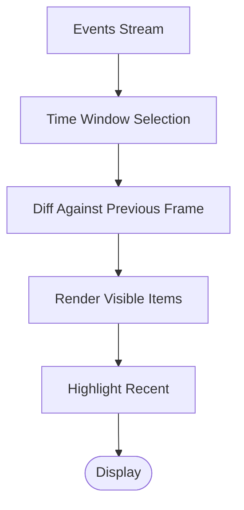
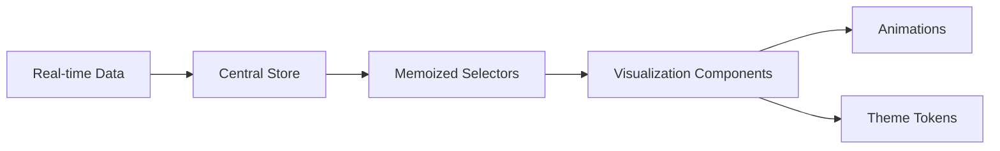

# Visualization Components

<cite>
**Referenced Files in This Document**
- [package.json](file://package.json)
- [pnpm-workspace.yaml](file://pnpm-workspace.yaml)
- [turbo.json](file://turbo.json)
- [tsconfig.base.json](file://tsconfig.base.json)
- [apps/desktop/src/main/index.ts](file://apps/desktop/src/main/index.ts)
- [apps/desktop/src/main/websocket.ts](file://apps/desktop/src/main/websocket.ts)
- [apps/desktop/src/preload/index.ts](file://apps/desktop/src/preload/index.ts)
- [apps/desktop/src/renderer/app/layout.tsx](file://apps/desktop/src/renderer/app/layout.tsx)
- [apps/desktop/src/renderer/app/page.tsx](file://apps/desktop/src/renderer/app/page.tsx)
- [apps/desktop/src/renderer/app/match/live/page.tsx](file://apps/desktop/src/renderer/app/match/live/page.tsx)
- [apps/desktop/src/renderer/app/match/[id]/page.tsx](file://apps/desktop/src/renderer/app/match/[id]/page.tsx)
- [apps/desktop/next.config.js](file://apps/desktop/next.config.js)
- [apps/desktop/tailwind.config.js](file://apps/desktop/tailwind.config.js)
- [apps/overlay/src/app/layout.tsx](file://apps/overlay/src/app/layout.tsx)
- [apps/overlay/src/app/overlay/page.tsx](file://apps/overlay/src/app/overlay/page.tsx)
- [apps/overlay/next.config.js](file://apps/overlay/next.config.js)
- [apps/overlay/tailwind.config.js](file://apps/overlay/tailwind.config.js)
- [packages/ui/package.json](file://packages/ui/package.json)
- [packages/animations/package.json](file:///packages/animations/package.json)
- [packages/graphics/package.json](file://packages/graphics/package.json)
- [packages/hooks/package.json](file://packages/hooks/package.json)
- [packages/store/package.json](file://packages/store/package.json)
- [packages/theme/package.json](file://packages/theme/package.json)
- [packages/types/package.json](file://packages/types/package.json)
- [packages/utils/package.json](file://packages/utils/package.json)
</cite>

## Table of Contents
1. [Introduction](#introduction)
2. [Project Structure](#project-structure)
3. [Core Components](#core-components)
4. [Architecture Overview](#architecture-overview)
5. [Detailed Component Analysis](#detailed-component-analysis)
6. [Dependency Analysis](#dependency-analysis)
7. [Performance Considerations](#performance-considerations)
8. [Troubleshooting Guide](#troubleshooting-guide)
9. [Conclusion](#conclusion)
10. [Appendices](#appendices)

## Introduction
This document explains the visualization components used for real-time data display across the desktop and overlay applications. It covers component architecture for scores, statistics, player information, and match events; the rendering pipeline; animation systems; performance optimization techniques; custom component creation; responsive layouts; interactive elements; theming; accessibility; and cross-browser compatibility considerations. The guidance is grounded in the repository’s structure and configuration files to ensure practical applicability.

## Project Structure
The project is a monorepo with multiple apps and shared packages:
- Apps:
  - Desktop app (Next.js renderer + Electron main process)
  - Overlay app (Next.js-based overlay UI)
- Shared packages:
  - ui, animations, graphics, hooks, store, theme, types, utils

**Diagram sources**
- [package.json](file://package.json)
- [pnpm-workspace.yaml](file://pnpm-workspace.yaml)
- [turbo.json](file://turbo.json)
- [tsconfig.base.json](file://tsconfig.base.json)
- [apps/desktop/src/main/index.ts](file://apps/desktop/src/main/index.ts)
- [apps/desktop/src/renderer/app/layout.tsx](file://apps/desktop/src/renderer/app/layout.tsx)
- [apps/overlay/src/app/layout.tsx](file://apps/overlay/src/app/layout.tsx)

**Section sources**
- [package.json](file://package.json)
- [pnpm-workspace.yaml](file://pnpm-workspace.yaml)
- [turbo.json](file://turbo.json)
- [tsconfig.base.json](file://tsconfig.base.json)

## Core Components
The visualization layer is composed of reusable components organized by domain:
- Scores: live scoreboards, team totals, period indicators
- Statistics: per-player and team stats panels
- Player Information: cards, badges, and detail overlays
- Match Events: timeline or ticker of key actions

These components are built on top of shared packages:
- ui: base primitives and layout utilities
- animations: transition and motion primitives
- graphics: canvas/SVG helpers for charts and overlays
- hooks: state synchronization and event handling
- store: centralized real-time data model
- theme: design tokens and color schemes
- types: shared TypeScript definitions
- utils: formatting, parsing, and helper functions

Implementation locations:
- Desktop renderer pages orchestrate these components for live matches and match details.
- Overlay page composes lightweight visualizations for broadcast-style overlays.

**Section sources**
- [apps/desktop/src/renderer/app/match/live/page.tsx](file://apps/desktop/src/renderer/app/match/live/page.tsx)
- [apps/desktop/src/renderer/app/match/[id]/page.tsx](file://apps/desktop/src/renderer/app/match/[id]/page.tsx)
- [apps/overlay/src/app/overlay/page.tsx](file://apps/overlay/src/app/overlay/page.tsx)

## Architecture Overview
The system follows a layered architecture:
- Data Layer: WebSocket stream from the desktop main process into the renderer and overlay via preload bridge.
- State Layer: Centralized store synchronized with incoming events.
- Presentation Layer: Domain-specific visualization components.
- Animation Layer: Motion primitives applied to updates.
- Theming Layer: Theme provider supplying tokens to all components.

**Diagram sources**
- [apps/desktop/src/main/websocket.ts](file://apps/desktop/src/main/websocket.ts)
- [apps/desktop/src/main/index.ts](file://apps/desktop/src/main/index.ts)
- [apps/desktop/src/preload/index.ts](file://apps/desktop/src/preload/index.ts)
- [apps/desktop/src/renderer/app/layout.tsx](file://apps/desktop/src/renderer/app/layout.tsx)
- [apps/overlay/src/app/layout.tsx](file://apps/overlay/src/app/layout.tsx)

## Detailed Component Analysis

### Live Scoreboard Component
Responsibilities:
- Display current score, period/time, and team identifiers
- React to high-frequency updates with minimal re-renders
- Support theme-driven colors and typography

Rendering Pipeline:
- Event ingestion via IPC/WebSocket
- Store normalization and diffing
- Selectors for scoreboard slice
- Animated transitions for score changes

**Diagram sources**
- [apps/desktop/src/main/websocket.ts](file://apps/desktop/src/main/websocket.ts)
- [apps/desktop/src/preload/index.ts](file://apps/desktop/src/preload/index.ts)
- [apps/desktop/src/renderer/app/match/live/page.tsx](file://apps/desktop/src/renderer/app/match/live/page.tsx)

**Section sources**
- [apps/desktop/src/main/websocket.ts](file://apps/desktop/src/main/websocket.ts)
- [apps/desktop/src/preload/index.ts](file://apps/desktop/src/preload/index.ts)
- [apps/desktop/src/renderer/app/match/live/page.tsx](file://apps/desktop/src/renderer/app/match/live/page.tsx)

### Statistics Panel Component
Responsibilities:
- Aggregate per-player and team metrics
- Provide sortable/filterable views
- Handle large datasets efficiently

Optimization Techniques:
- Memoized selectors for derived statistics
- Virtualization for long lists
- Debounced input handlers for search/sort

**Diagram sources**
- [apps/desktop/src/renderer/app/match/[id]/page.tsx](file://apps/desktop/src/renderer/app/match/[id]/page.tsx)

**Section sources**
- [apps/desktop/src/renderer/app/match/[id]/page.tsx](file://apps/desktop/src/renderer/app/match/[id]/page.tsx)

### Player Information Card Component
Responsibilities:
- Show player avatar, name, number, and quick stats
- Support hover/focus interactions and keyboard navigation
- Adapt to different screen sizes

Accessibility Features:
- Semantic roles and labels
- Focus management and visible focus indicators
- Screen reader-friendly text alternatives

**Diagram sources**
- [apps/desktop/src/renderer/app/match/[id]/page.tsx](file://apps/desktop/src/renderer/app/match/[id]/page.tsx)

**Section sources**
- [apps/desktop/src/renderer/app/match/[id]/page.tsx](file://apps/desktop/src/renderer/app/match/[id]/page.tsx)

### Match Events Timeline Component
Responsibilities:
- Render chronological events (goals, fouls, substitutions)
- Scroll-synchronized with video or game time
- Highlight recent events with emphasis

Performance Considerations:
- Batched updates for rapid event streams
- Time-windowed rendering to limit DOM size
- Efficient diffing and key strategies

**Diagram sources**
- [apps/desktop/src/renderer/app/match/live/page.tsx](file://apps/desktop/src/renderer/app/match/live/page.tsx)

**Section sources**
- [apps/desktop/src/renderer/app/match/live/page.tsx](file://apps/desktop/src/renderer/app/match/live/page.tsx)

### Conceptual Overview
The visualization system emphasizes decoupled data flow, efficient rendering, and consistent theming. Components subscribe to store slices, compute derived state with memoized selectors, and apply animations only when necessary.

[No sources needed since this diagram shows conceptual workflow, not actual code structure]

## Dependency Analysis
The apps depend on shared packages for UI, animations, graphics, hooks, store, theme, types, and utils. The workspace configuration centralizes build and dependency resolution.

```mermaid
graph TB
PkgJson["Root package.json"]
Workspace["pnpm-workspace.yaml"]
Turbo["turbo.json"]
TSBase["tsconfig.base.json"]
Desktop["Desktop App"]
Overlay["Overlay App"]
UI["packages/ui"]
Anim["packages/animations"]
Graph["packages/graphics"]
Hooks["packages/hooks"]
StorePkg["packages/store"]
ThemePkg["packages/theme"]
TypesPkg["packages/types"]
UtilsPkg["packages/utils"]
PkgJson --> Workspace
PkgJson --> Turbo
PkgJson --> TSBase
Desktop --> UI
Desktop --> Anim
Desktop --> Graph
Desktop --> Hooks
Desktop --> StorePkg
Desktop --> ThemePkg
Desktop --> TypesPkg
Desktop --> UtilsPkg
Overlay --> UI
Overlay --> Anim
Overlay --> Graph
Overlay --> Hooks
Overlay --> StorePkg
Overlay --> ThemePkg
Overlay --> TypesPkg
Overlay --> UtilsPkg
```

**Diagram sources**
- [package.json](file://package.json)
- [pnpm-workspace.yaml](file://pnpm-workspace.yaml)
- [turbo.json](file://turbo.json)
- [tsconfig.base.json](file://tsconfig.base.json)

**Section sources**
- [package.json](file://package.json)
- [pnpm-workspace.yaml](file://pnpm-workspace.yaml)
- [turbo.json](file://turbo.json)
- [tsconfig.base.json](file://tsconfig.base.json)

## Performance Considerations
- Minimize re-renders:
  - Use memoized selectors and stable references
  - Split components by data boundaries
- Efficient updates:
  - Batch events and coalesce state updates
  - Avoid heavy computations during render
- Rendering optimizations:
  - Virtualize long lists
  - Prefer CSS transforms over layout-triggering properties
- Memory management:
  - Unsubscribe from listeners on unmount
  - Clear timers and intervals
- GPU acceleration:
  - Favor transform and opacity animations
  - Use will-change sparingly

[No sources needed since this section provides general guidance]

## Troubleshooting Guide
Common issues and resolutions:
- No data displayed:
  - Verify WebSocket connection and IPC bridging
  - Check store subscriptions and selector outputs
- Stuttering or dropped frames:
  - Reduce animation complexity
  - Ensure heavy work is offloaded from the main thread
- Incorrect theme application:
  - Confirm theme provider wrapping and token usage
- Accessibility regressions:
  - Validate ARIA attributes and keyboard navigation
  - Test with screen readers and focus order

**Section sources**
- [apps/desktop/src/main/websocket.ts](file://apps/desktop/src/main/websocket.ts)
- [apps/desktop/src/preload/index.ts](file://apps/desktop/src/preload/index.ts)
- [apps/desktop/src/renderer/app/layout.tsx](file://apps/desktop/src/renderer/app/layout.tsx)
- [apps/overlay/src/app/layout.tsx](file://apps/overlay/src/app/layout.tsx)

## Conclusion
The visualization system combines a robust data pipeline, modular components, and performant animations to deliver real-time displays for scores, statistics, player information, and match events. By leveraging shared packages for UI, theming, and state, the apps maintain consistency and scalability. Following the recommended patterns ensures smooth performance, strong accessibility, and broad compatibility.

[No sources needed since this section summarizes without analyzing specific files]

## Appendices

### Creating Custom Visualization Components
- Define props and types using shared types package
- Subscribe to store slices via hooks
- Compute derived state with memoized selectors
- Apply animations conditionally based on value changes
- Integrate theme tokens for colors, spacing, and typography

**Section sources**
- [packages/types/package.json](file://packages/types/package.json)
- [packages/hooks/package.json](file://packages/hooks/package.json)
- [packages/store/package.json](file://packages/store/package.json)
- [packages/animations/package.json](file://packages/animations/package.json)
- [packages/theme/package.json](file://packages/theme/package.json)

### Handling Responsive Layouts
- Use fluid units and container queries where supported
- Breakpoints defined in Tailwind configurations
- Adaptive grid/flex layouts for varying screen sizes

**Section sources**
- [apps/desktop/tailwind.config.js](file://apps/desktop/tailwind.config.js)
- [apps/overlay/tailwind.config.js](file://apps/overlay/tailwind.config.js)

### Implementing Interactive Elements
- Keyboard navigation and focus management
- ARIA roles and labels for assistive technologies
- Hover/focus states driven by theme tokens

**Section sources**
- [apps/desktop/src/renderer/app/match/[id]/page.tsx](file://apps/desktop/src/renderer/app/match/[id]/page.tsx)
- [apps/overlay/src/app/overlay/page.tsx](file://apps/overlay/src/app/overlay/page.tsx)

### Theming Support
- Centralized theme provider
- Token-based styling for colors, fonts, and spacing
- Dynamic theme switching at runtime

**Section sources**
- [packages/theme/package.json](file://packages/theme/package.json)
- [apps/desktop/src/renderer/app/layout.tsx](file://apps/desktop/src/renderer/app/layout.tsx)
- [apps/overlay/src/app/layout.tsx](file://apps/overlay/src/app/layout.tsx)

### Cross-Browser Compatibility Considerations
- Feature detection for advanced CSS features
- Polyfills for older environments if required
- Consistent behavior across desktop and overlay runtimes

**Section sources**
- [apps/desktop/next.config.js](file://apps/desktop/next.config.js)
- [apps/overlay/next.config.js](file://apps/overlay/next.config.js)