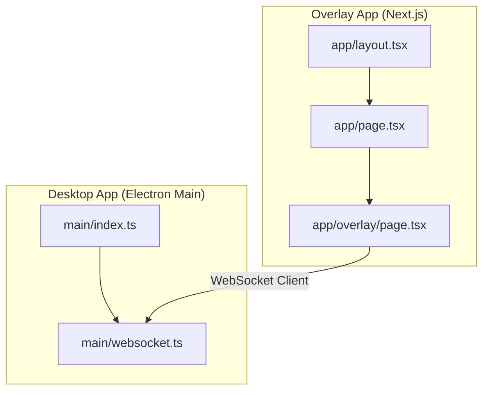
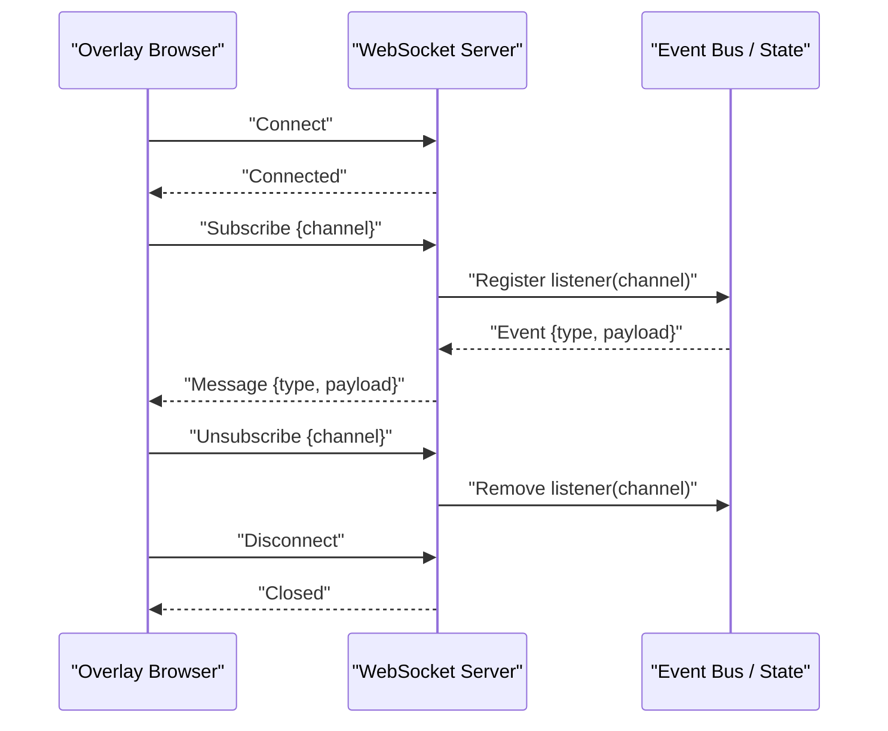
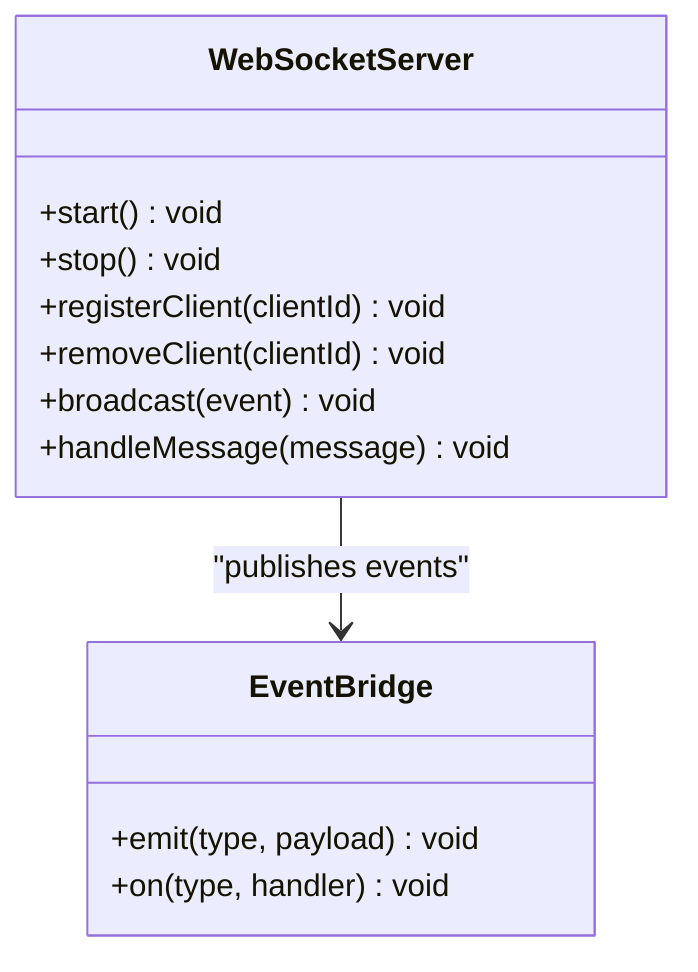
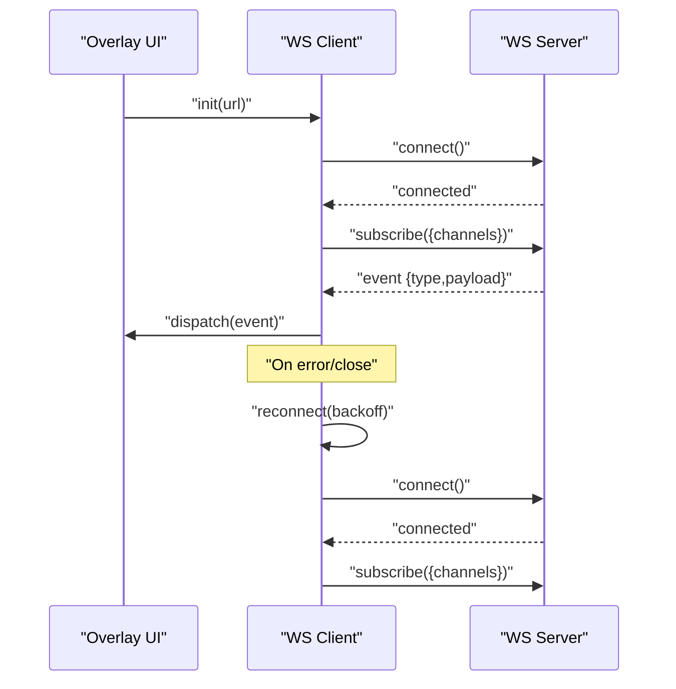
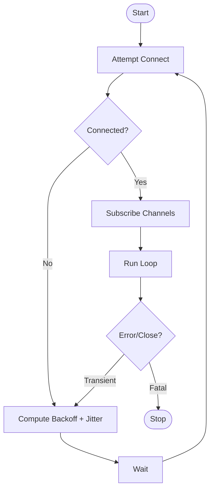
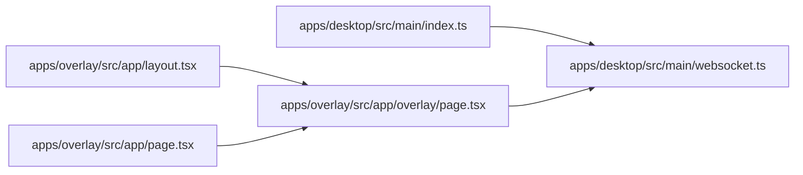

# WebSocket Integration

<cite>
**Referenced Files in This Document**
- [websocket.ts](file://apps/desktop/src/main/websocket.ts)
- [index.ts](file://apps/desktop/src/main/index.ts)
- [page.tsx](file://apps/overlay/src/app/overlay/page.tsx)
- [layout.tsx](file://apps/overlay/src/app/layout.tsx)
- [page.tsx](file://apps/overlay/src/app/page.tsx)
</cite>

## Table of Contents
1. [Introduction](#introduction)
2. [Project Structure](#project-structure)
3. [Core Components](#core-components)
4. [Architecture Overview](#architecture-overview)
5. [Detailed Component Analysis](#detailed-component-analysis)
6. [Dependency Analysis](#dependency-analysis)
7. [Performance Considerations](#performance-considerations)
8. [Troubleshooting Guide](#troubleshooting-guide)
9. [Conclusion](#conclusion)

## Introduction
This document explains how the overlay system integrates with WebSockets to deliver real-time updates from the desktop application to the browser-based overlay. It covers the server implementation, connection management, message protocols, lifecycle and error handling, reconnection strategies, security considerations, performance optimization for high-frequency updates, and debugging techniques.

## Project Structure
The WebSocket integration spans two main areas:
- Desktop backend (Electron main process): hosts a WebSocket server and bridges events to connected clients.
- Overlay frontend (Next.js app): connects to the WebSocket server and renders live data.

**Diagram sources**
- [index.ts](file://apps/desktop/src/main/index.ts)
- [websocket.ts](file://apps/desktop/src/main/websocket.ts)
- [layout.tsx](file://apps/overlay/src/app/layout.tsx)
- [page.tsx](file://apps/overlay/src/app/page.tsx)
- [page.tsx](file://apps/overlay/src/app/overlay/page.tsx)

**Section sources**
- [index.ts](file://apps/desktop/src/main/index.ts)
- [websocket.ts](file://apps/desktop/src/main/websocket.ts)
- [layout.tsx](file://apps/overlay/src/app/layout.tsx)
- [page.tsx](file://apps/overlay/src/app/page.tsx)
- [page.tsx](file://apps/overlay/src/app/overlay/page.tsx)

## Core Components
- WebSocket Server (desktop main process):
  - Initializes and manages the WebSocket server instance.
  - Accepts client connections, tracks active sessions, and routes messages.
  - Emits real-time events to subscribers based on channel/topic semantics.
- Overlay Client (browser):
  - Establishes a persistent connection to the server.
  - Subscribes to event streams and handles incoming messages.
  - Manages reconnection and error states.

Key responsibilities:
- Connection lifecycle: connect, authenticate (optional), subscribe, receive, unsubscribe, disconnect.
- Message protocol: typed payloads with action types and data fields.
- Error handling: network errors, invalid messages, server-side failures.
- Reconnection: exponential backoff with jitter and idempotent subscription restoration.

**Section sources**
- [websocket.ts](file://apps/desktop/src/main/websocket.ts)
- [index.ts](file://apps/desktop/src/main/index.ts)
- [page.tsx](file://apps/overlay/src/app/overlay/page.tsx)

## Architecture Overview
The overlay system uses a publish-subscribe model over WebSockets. The desktop app acts as the publisher; the overlay UI subscribes to specific channels.

**Diagram sources**
- [websocket.ts](file://apps/desktop/src/main/websocket.ts)
- [index.ts](file://apps/desktop/src/main/index.ts)
- [page.tsx](file://apps/overlay/src/app/overlay/page.tsx)

## Detailed Component Analysis

### WebSocket Server Implementation (Desktop Main)
Responsibilities:
- Create and start the WebSocket server.
- Maintain a registry of connected clients.
- Parse inbound messages and dispatch to handlers.
- Broadcast outbound events to relevant subscribers.
- Handle graceful shutdown and cleanup.

Operational flow:
- On connect: register client, send handshake or welcome message if required.
- On message: validate schema, route by type/action, update state or forward to bus.
- On broadcast: serialize event and push to all matching subscribers.
- On disconnect: remove client, release resources.

Error handling:
- Validate message schemas before processing.
- Log and ignore malformed messages.
- Close connections on unrecoverable errors.

Reconnection support:
- Clients should implement reconnection; server remains stateless per connection.

Security considerations:
- Restrict access to localhost when running locally.
- Optionally require an authentication token in the initial message.
- Rate-limit subscriptions and broadcasts to prevent abuse.

**Section sources**
- [websocket.ts](file://apps/desktop/src/main/websocket.ts)
- [index.ts](file://apps/desktop/src/main/index.ts)

#### Class Diagram (Server-Side)

**Diagram sources**
- [websocket.ts](file://apps/desktop/src/main/websocket.ts)

### Overlay Client Implementation (Browser)
Responsibilities:
- Connect to the WebSocket endpoint.
- Subscribe to channels/topics.
- Process incoming events and update UI state.
- Manage reconnection and error states.

Connection lifecycle:
- Initialize client with base URL.
- Attempt connection; on success, subscribe to required channels.
- On close/error, reconnect with exponential backoff and jitter.
- Restore subscriptions after reconnection.

Message handling:
- Route messages by type/action to appropriate handlers.
- Debounce or throttle high-frequency updates where needed.

Error handling:
- Distinguish between transient network errors and fatal errors.
- Provide user feedback and fallback UI states.

Security considerations:
- Validate origin and enforce HTTPS in production.
- Use tokens or session cookies for authentication if required.

**Section sources**
- [page.tsx](file://apps/overlay/src/app/overlay/page.tsx)
- [layout.tsx](file://apps/overlay/src/app/layout.tsx)
- [page.tsx](file://apps/overlay/src/app/page.tsx)

#### Sequence Diagram (Client Lifecycle)

**Diagram sources**
- [page.tsx](file://apps/overlay/src/app/overlay/page.tsx)
- [websocket.ts](file://apps/desktop/src/main/websocket.ts)

### Message Protocol
Recommended structure:
- Action/type: identifies the operation or event category.
- Payload: typed data object associated with the action.
- Optional metadata: correlation IDs, timestamps, versioning.

Examples of actions:
- Subscription control: subscribe, unsubscribe.
- Data events: match.update, score.change, timer.tick.
- Control events: pause, resume, reset.

Validation:
- Enforce strict schemas on both sides.
- Reject unknown actions or malformed payloads.

**Section sources**
- [websocket.ts](file://apps/desktop/src/main/websocket.ts)
- [page.tsx](file://apps/overlay/src/app/overlay/page.tsx)

### Connection Management
- Keepalive: optional heartbeat ping/pong to detect dead peers.
- Concurrency: limit concurrent connections per host/IP.
- Resource cleanup: ensure listeners are removed on disconnect.

**Section sources**
- [websocket.ts](file://apps/desktop/src/main/websocket.ts)

### Error Handling Strategies
- Client:
  - Network errors: retry with backoff.
  - Protocol errors: log and drop message; alert user if critical.
  - Auth failures: prompt login or show restricted UI.
- Server:
  - Validation errors: respond with structured error or close connection.
  - Internal errors: log stack traces and notify monitoring.

**Section sources**
- [websocket.ts](file://apps/desktop/src/main/websocket.ts)
- [page.tsx](file://apps/overlay/src/app/overlay/page.tsx)

### Reconnection Mechanisms
- Exponential backoff with jitter to avoid thundering herds.
- Idempotent subscription restoration after reconnect.
- Circuit breaker: stop retries after N failures within a time window.

[No sources needed since this diagram shows conceptual workflow, not actual code structure]

## Dependency Analysis
The overlay client depends on the WebSocket server for real-time data. The desktop main process initializes and owns the server lifecycle.

**Diagram sources**
- [index.ts](file://apps/desktop/src/main/index.ts)
- [websocket.ts](file://apps/desktop/src/main/websocket.ts)
- [layout.tsx](file://apps/overlay/src/app/layout.tsx)
- [page.tsx](file://apps/overlay/src/app/page.tsx)
- [page.tsx](file://apps/overlay/src/app/overlay/page.tsx)

**Section sources**
- [index.ts](file://apps/desktop/src/main/index.ts)
- [websocket.ts](file://apps/desktop/src/main/websocket.ts)
- [layout.tsx](file://apps/overlay/src/app/layout.tsx)
- [page.tsx](file://apps/overlay/src/app/page.tsx)
- [page.tsx](file://apps/overlay/src/app/overlay/page.tsx)

## Performance Considerations
- Throttle/debounce high-frequency events on the client to reduce render pressure.
- Batch multiple updates into a single message when possible.
- Use efficient serialization (e.g., avoid unnecessary deep clones).
- Limit the number of active subscriptions per client.
- Implement server-side rate limiting per client and per channel.
- Prefer incremental updates over full state snapshots.

[No sources needed since this section provides general guidance]

## Troubleshooting Guide
Common issues and resolutions:
- Connection refused: verify server is running and accessible; check firewall and port bindings.
- CORS/Origin errors: ensure overlay origin is allowed on the server.
- Authentication failures: confirm token validity and expiration handling.
- High CPU usage: add throttling and debouncing on the client; review event frequency.
- Memory leaks: ensure event listeners are removed on disconnect and component unmount.

Debugging techniques:
- Enable verbose logging on both client and server.
- Capture and replay messages for offline analysis.
- Monitor connection metrics: uptime, reconnect count, message throughput.
- Use browser DevTools Network/WebSocket panels and Electron devtools.

Monitoring approaches:
- Track active connections, message rates, and error counts.
- Alert on abnormal reconnect spikes or latency increases.
- Instrument health endpoints for liveness checks.

**Section sources**
- [websocket.ts](file://apps/desktop/src/main/websocket.ts)
- [page.tsx](file://apps/overlay/src/app/overlay/page.tsx)

## Conclusion
The overlay system’s WebSocket integration provides a robust foundation for real-time communication between the desktop application and the overlay UI. By following the recommended protocols, lifecycle management, error handling, and performance practices, teams can build responsive overlays that scale under high-frequency updates while remaining secure and maintainable.