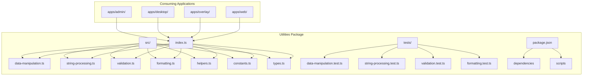
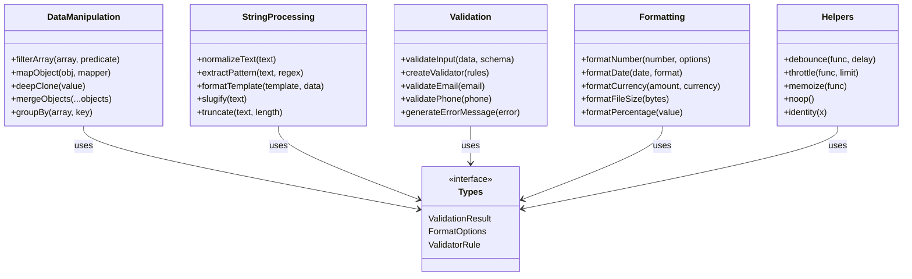
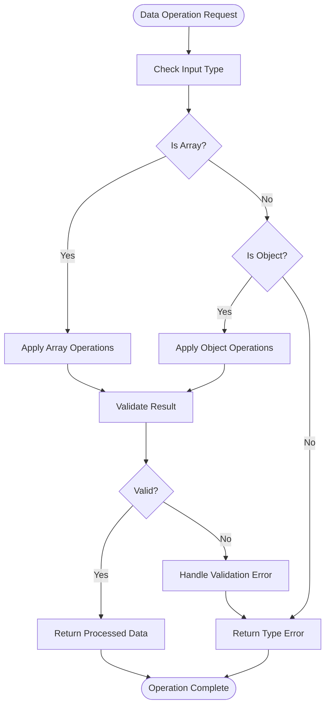
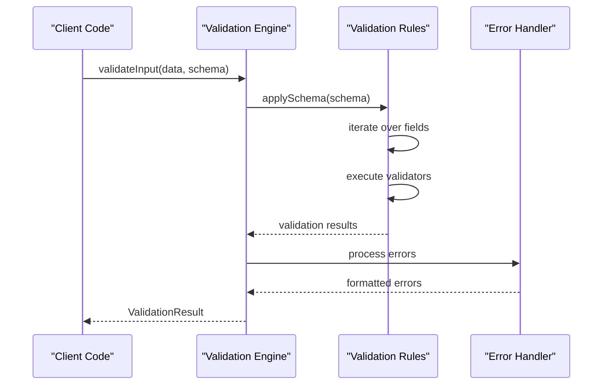
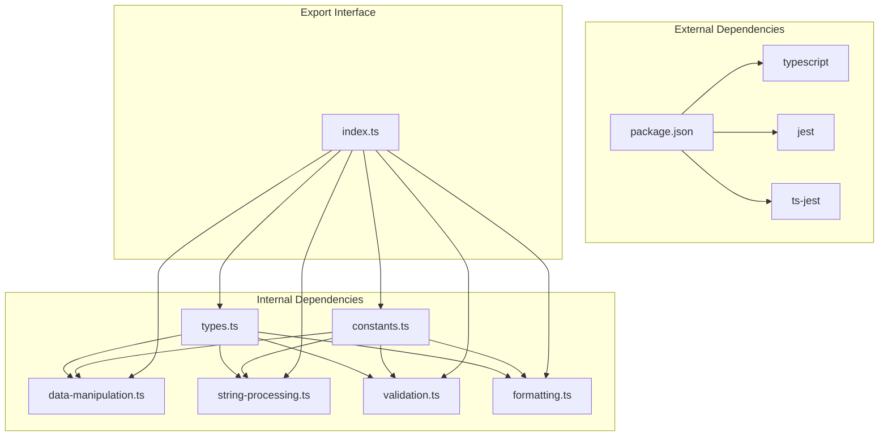
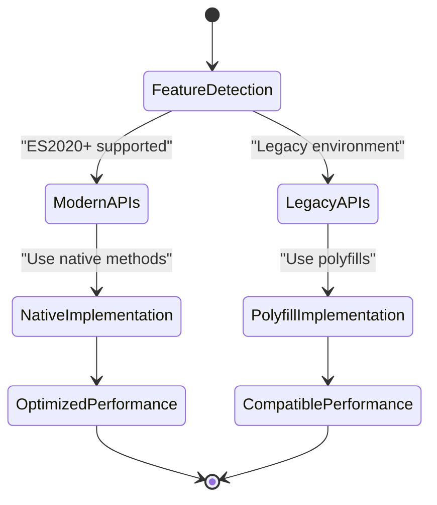
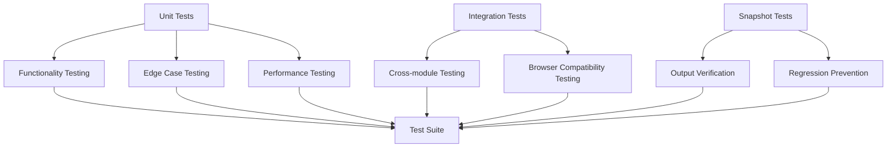

# Common Utilities

<cite>
**Referenced Files in This Document**
- [packages/utils/package.json](file://packages/utils/package.json)
- [packages/utils/src/index.ts](file://packages/utils/src/index.ts)
- [packages/utils/src/data-manipulation.ts](file://packages/utils/src/data-manipulation.ts)
- [packages/utils/src/string-processing.ts](file://packages/utils/src/string-processing.ts)
- [packages/utils/src/validation.ts](file://packages/utils/src/validation.ts)
- [packages/utils/src/formatting.ts](file://packages/utils/src/formatting.ts)
- [packages/utils/src/helpers.ts](file://packages/utils/src/helpers.ts)
- [packages/utils/src/constants.ts](file://packages/utils/src/constants.ts)
- [packages/utils/src/types.ts](file://packages/utils/src/types.ts)
- [packages/utils/tests/data-manipulation.test.ts](file://packages/utils/tests/data-manipulation.test.ts)
- [packages/utils/tests/string-processing.test.ts](file://packages/utils/tests/string-processing.test.ts)
- [packages/utils/tests/validation.test.ts](file://packages/utils/tests/validation.test.ts)
- [packages/utils/tests/formatting.test.ts](file://packages/utils/tests/formatting.test.ts)
- [tsconfig.base.json](file://tsconfig.base.json)
- [pnpm-workspace.yaml](file://pnpm-workspace.yaml)
</cite>

## Table of Contents
1. [Introduction](#introduction)
2. [Project Structure](#project-structure)
3. [Core Components](#core-components)
4. [Architecture Overview](#architecture-overview)
5. [Detailed Component Analysis](#detailed-component-analysis)
6. [Dependency Analysis](#dependency-analysis)
7. [Performance Considerations](#performance-considerations)
8. [Browser Compatibility](#browser-compatibility)
9. [Testing Strategy](#testing-strategy)
10. [Extending Utilities](#extending-utilities)
11. [Backward Compatibility](#backward-compatibility)
12. [Troubleshooting Guide](#troubleshooting-guide)
13. [Conclusion](#conclusion)

## Introduction

This document provides comprehensive documentation for the common utility functions and helper libraries shared across applications in the AR Sports ecosystem. The utilities package serves as a centralized repository for reusable functionality including data manipulation, string processing, validation, formatting, and common programming patterns used throughout the monorepo.

The utility library is designed with modularity, performance, and maintainability in mind, following TypeScript best practices and providing comprehensive type safety across all applications.

## Project Structure

The utilities package follows a modular architecture organized by functional domains:

**Diagram sources**
- [packages/utils/src/index.ts](file://packages/utils/src/index.ts)
- [packages/utils/package.json](file://packages/utils/package.json)

**Section sources**
- [packages/utils/src/index.ts](file://packages/utils/src/index.ts)
- [packages/utils/package.json](file://packages/utils/package.json)

## Core Components

### Data Manipulation Utilities

The data manipulation module provides essential functions for working with arrays, objects, and collections. Key features include:

- Array operations (filtering, mapping, reducing, sorting)
- Object manipulation (deep cloning, merging, property access)
- Collection transformations
- Type-safe data operations

### String Processing Utilities

String processing functions handle text manipulation, formatting, and transformation:

- Text normalization and sanitization
- Pattern matching and extraction
- Text formatting and templating
- Encoding and decoding operations

### Validation Utilities

Comprehensive validation functions ensure data integrity:

- Input validation schemas
- Custom validator creation
- Error message generation
- Async validation support

### Formatting Utilities

Formatting functions standardize output presentation:

- Number formatting and localization
- Date/time formatting
- Currency formatting
- File size formatting

**Section sources**
- [packages/utils/src/data-manipulation.ts](file://packages/utils/src/data-manipulation.ts)
- [packages/utils/src/string-processing.ts](file://packages/utils/src/string-processing.ts)
- [packages/utils/src/validation.ts](file://packages/utils/src/validation.ts)
- [packages/utils/src/formatting.ts](file://packages/utils/src/formatting.ts)

## Architecture Overview

The utilities package follows a modular architecture pattern with clear separation of concerns:

**Diagram sources**
- [packages/utils/src/data-manipulation.ts](file://packages/utils/src/data-manipulation.ts)
- [packages/utils/src/string-processing.ts](file://packages/utils/src/string-processing.ts)
- [packages/utils/src/validation.ts](file://packages/utils/src/validation.ts)
- [packages/utils/src/formatting.ts](file://packages/utils/src/formatting.ts)
- [packages/utils/src/helpers.ts](file://packages/utils/src/helpers.ts)
- [packages/utils/src/types.ts](file://packages/utils/src/types.ts)

## Detailed Component Analysis

### Data Manipulation Module

The data manipulation module provides core functionality for working with JavaScript data structures:

#### Key Functions

- **Array Operations**: Advanced filtering, mapping, and reduction operations with type safety
- **Object Utilities**: Deep cloning, merging, and property manipulation
- **Collection Management**: Grouping, partitioning, and transformation utilities

#### Implementation Patterns

**Diagram sources**
- [packages/utils/src/data-manipulation.ts](file://packages/utils/src/data-manipulation.ts)

**Section sources**
- [packages/utils/src/data-manipulation.ts](file://packages/utils/src/data-manipulation.ts)

### String Processing Module

String processing utilities provide comprehensive text manipulation capabilities:

#### Core Features

- **Text Normalization**: Consistent text formatting and cleaning
- **Pattern Matching**: Regular expression utilities and text extraction
- **Template Processing**: Dynamic text generation and formatting

#### Performance Optimizations

- Lazy evaluation for large text operations
- Memory-efficient string concatenation
- Regex compilation caching

**Section sources**
- [packages/utils/src/string-processing.ts](file://packages/utils/src/string-processing.ts)

### Validation Module

The validation module ensures data integrity through comprehensive validation rules:

#### Validation Architecture

**Diagram sources**
- [packages/utils/src/validation.ts](file://packages/utils/src/validation.ts)

**Section sources**
- [packages/utils/src/validation.ts](file://packages/utils/src/validation.ts)

### Formatting Module

Formatting utilities provide consistent output presentation across applications:

#### Formatting Standards

- **Internationalization Support**: Locale-aware number and date formatting
- **Custom Formatters**: Extensible formatting pipeline
- **Performance Optimization**: Cached formatters for frequently used formats

**Section sources**
- [packages/utils/src/formatting.ts](file://packages/utils/src/formatting.ts)

## Dependency Analysis

The utilities package maintains minimal external dependencies while providing maximum functionality:

**Diagram sources**
- [packages/utils/src/index.ts](file://packages/utils/src/index.ts)
- [packages/utils/package.json](file://packages/utils/package.json)

**Section sources**
- [packages/utils/src/index.ts](file://packages/utils/src/index.ts)
- [packages/utils/package.json](file://packages/utils/package.json)

## Performance Considerations

### Memory Management

- **Lazy Evaluation**: Functions use lazy evaluation where possible to minimize memory usage
- **Object Pooling**: Reusable objects for frequently created instances
- **Garbage Collection**: Proper cleanup of temporary objects and references

### Computational Efficiency

- **Algorithm Optimization**: Time complexity analysis for critical operations
- **Caching Strategies**: Memoization for expensive computations
- **Batch Processing**: Efficient handling of large datasets

### Browser Compatibility

- **Polyfill Strategy**: Graceful degradation for older browsers
- **Feature Detection**: Runtime capability checking
- **Bundle Size Optimization**: Tree-shaking support and minimal footprint

## Browser Compatibility

The utilities package supports modern browsers with fallbacks for legacy environments:

### Supported Environments

- **Modern Browsers**: Chrome 90+, Firefox 88+, Safari 14+, Edge 90+
- **Node.js**: Version 16+
- **Mobile Browsers**: iOS Safari 14+, Android Chrome 90+

### Compatibility Features

**Diagram sources**
- [packages/utils/src/helpers.ts](file://packages/utils/src/helpers.ts)

## Testing Strategy

### Test Coverage Approach

The testing strategy ensures comprehensive coverage of all utility functions:

### Test Organization

- **Unit Tests**: Individual function testing with comprehensive input/output scenarios
- **Integration Tests**: Cross-module interaction testing
- **Performance Tests**: Benchmarking and regression detection
- **Snapshot Tests**: Output verification and change detection

**Section sources**
- [packages/utils/tests/data-manipulation.test.ts](file://packages/utils/tests/data-manipulation.test.ts)
- [packages/utils/tests/string-processing.test.ts](file://packages/utils/tests/string-processing.test.ts)
- [packages/utils/tests/validation.test.ts](file://packages/utils/tests/validation.test.ts)
- [packages/utils/tests/formatting.test.ts](file://packages/utils/tests/formatting.test.ts)

## Extending Utilities

### Creating New Utility Functions

To extend the utilities package, follow these guidelines:

#### Function Design Principles

1. **Single Responsibility**: Each function should have one clear purpose
2. **Type Safety**: Comprehensive TypeScript definitions
3. **Documentation**: JSDoc comments with examples
4. **Testing**: Unit tests for all edge cases
5. **Performance**: Consider computational complexity

#### Naming Conventions

- **Verb-based**: `formatDate`, `validateEmail`, `parseJSON`
- **Noun-based**: `dateFormatter`, `emailValidator`, `jsonParser`
- **Adjective-based**: `isEmpty`, `isNumeric`, `isValid`

#### Example Extension Pattern

### Creating Custom Validators

The validation module supports custom validator creation:

1. Define validation rules using the rule builder
2. Implement error message customization
3. Add async validation support when needed
4. Provide comprehensive test coverage

**Section sources**
- [packages/utils/src/validation.ts](file://packages/utils/src/validation.ts)

## Backward Compatibility

### Version Management

The utilities package follows semantic versioning to maintain backward compatibility:

- **Major Versions**: Breaking changes with migration guides
- **Minor Versions**: New features without breaking existing APIs
- **Patch Versions**: Bug fixes and security updates

### Deprecation Strategy

1. **Warning System**: Runtime warnings for deprecated functions
2. **Migration Guides**: Step-by-step upgrade instructions
3. **Compatibility Layer**: Temporary support for old APIs
4. **Timeline**: Clear deprecation and removal schedules

### Migration Examples

Common migration patterns include:

- Function signature updates with parameter defaults
- Return value structure changes
- Configuration option renames
- Import path modifications

## Troubleshooting Guide

### Common Issues

#### Type Errors

- Ensure proper TypeScript configuration
- Check import paths and module resolution
- Verify type definitions are up to date

#### Performance Issues

- Monitor bundle size impact
- Use tree-shaking effectively
- Profile critical paths

#### Browser Compatibility

- Check feature detection results
- Verify polyfill loading order
- Test on target browser versions

### Debugging Utilities

The package includes debugging utilities for development:

- **Logging**: Structured logging with levels
- **Profiling**: Performance measurement tools
- **Error Tracking**: Centralized error reporting

**Section sources**
- [packages/utils/src/helpers.ts](file://packages/utils/src/helpers.ts)

## Conclusion

The common utilities package provides a robust foundation for shared functionality across the AR Sports applications. By following the established patterns and guidelines, teams can maintain consistency, improve code quality, and accelerate development velocity.

Key benefits include:

- **Reusability**: Eliminate code duplication across applications
- **Consistency**: Standardized behavior and output formatting
- **Maintainability**: Centralized logic with comprehensive testing
- **Performance**: Optimized implementations with monitoring
- **Type Safety**: Full TypeScript support with strict typing

The modular architecture allows for easy extension and customization while maintaining backward compatibility and supporting multiple deployment targets.