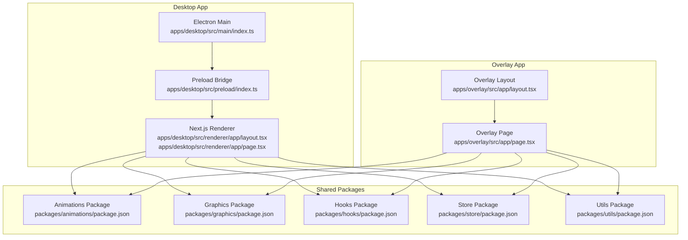
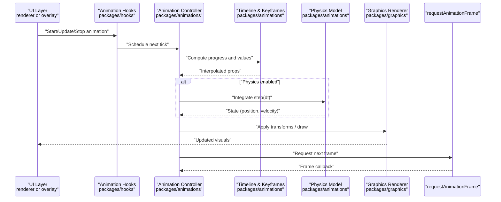
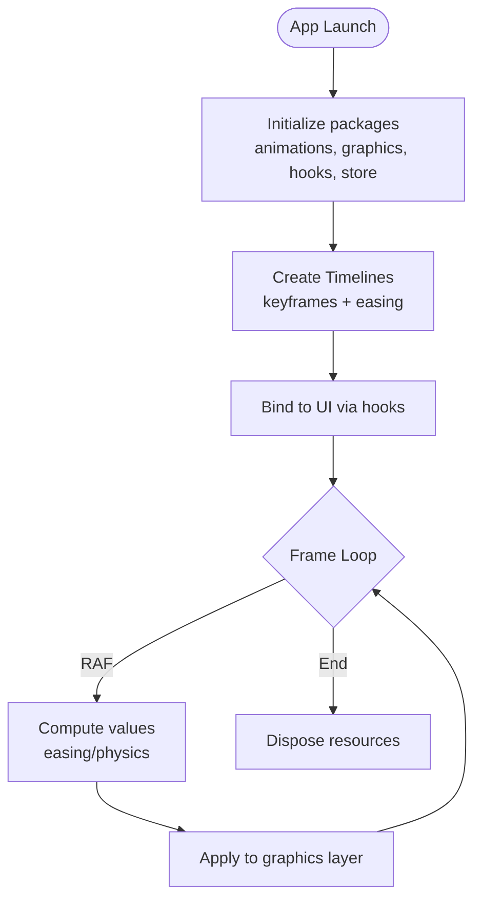
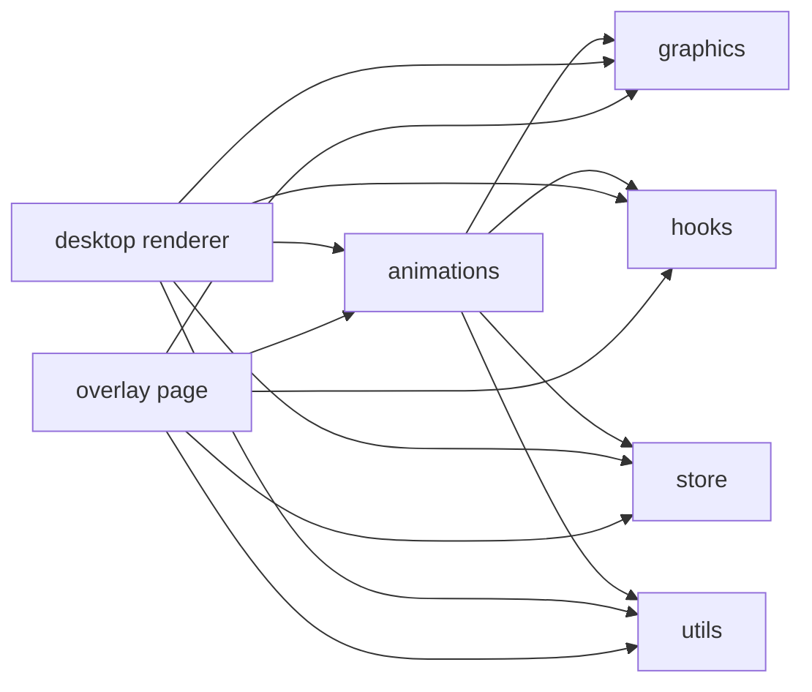

# Animation and Motion Engine

<cite>
**Referenced Files in This Document**
- [package.json](file://package.json)
- [pnpm-workspace.yaml](file://pnpm-workspace.yaml)
- [tsconfig.base.json](file://tsconfig.base.json)
- [turbo.json](file://turbo.json)
- [apps/desktop/src/main/index.ts](file://apps/desktop/src/main/index.ts)
- [apps/desktop/src/preload/index.ts](file://apps/desktop/src/preload/index.ts)
- [apps/desktop/src/renderer/app/layout.tsx](file://apps/desktop/src/renderer/app/layout.tsx)
- [apps/desktop/src/renderer/app/page.tsx](file://apps/desktop/src/renderer/app/page.tsx)
- [apps/overlay/src/app/layout.tsx](file://apps/overlay/src/app/layout.tsx)
- [apps/overlay/src/app/page.tsx](file://apps/overlay/src/app/page.tsx)
- [packages/animations/package.json](file://packages/animations/package.json)
- [packages/graphics/package.json](file://packages/graphics/package.json)
- [packages/hooks/package.json](file://packages/hooks/package.json)
- [packages/store/package.json](file://packages/store/package.json)
- [packages/utils/package.json](file://packages/utils/package.json)
</cite>

## Table of Contents
1. [Introduction](#introduction)
2. [Project Structure](#project-structure)
3. [Core Components](#core-components)
4. [Architecture Overview](#architecture-overview)
5. [Detailed Component Analysis](#detailed-component-analysis)
6. [Dependency Analysis](#dependency-analysis)
7. [Performance Considerations](#performance-considerations)
8. [Troubleshooting Guide](#troubleshooting-guide)
9. [Conclusion](#conclusion)
10. [Appendices](#appendices)

## Introduction
This document describes the animation and motion engine that powers smooth transitions and dynamic visual effects across the application suite. It focuses on:
- Animation timeline system, easing functions, keyframe animations, and physics-based motion
- Animation controller architecture and requestAnimationFrame usage
- Performance optimization strategies for real-time broadcast scenarios
- Complex sequences, chaining, and user interaction responses
- State management, cross-platform considerations, debugging, and integration with the graphics rendering system

The workspace is a multi-app monorepo with shared packages for animations, graphics, hooks, store, and utilities. The desktop app uses Electron (main + renderer), while an overlay app provides a browser-based overlay surface.

## Project Structure
At a high level:
- apps/desktop: Electron application with main process, preload bridge, and Next.js renderer
- apps/overlay: Standalone Next.js overlay app for broadcast overlays
- packages: Shared libraries including animations, graphics, hooks, store, and utils

**Diagram sources**
- [apps/desktop/src/main/index.ts](file://apps/desktop/src/main/index.ts)
- [apps/desktop/src/preload/index.ts](file://apps/desktop/src/preload/index.ts)
- [apps/desktop/src/renderer/app/layout.tsx](file://apps/desktop/src/renderer/app/layout.tsx)
- [apps/desktop/src/renderer/app/page.tsx](file://apps/desktop/src/renderer/app/page.tsx)
- [apps/overlay/src/app/layout.tsx](file://apps/overlay/src/app/layout.tsx)
- [apps/overlay/src/app/page.tsx](file://apps/overlay/src/app/page.tsx)
- [packages/animations/package.json](file://packages/animations/package.json)
- [packages/graphics/package.json](file://packages/graphics/package.json)
- [packages/hooks/package.json](file://packages/hooks/package.json)
- [packages/store/package.json](file://packages/store/package.json)
- [packages/utils/package.json](file://packages/utils/package.json)

**Section sources**
- [package.json](file://package.json)
- [pnpm-workspace.yaml](file://pnpm-workspace.yaml)
- [tsconfig.base.json](file://tsconfig.base.json)
- [turbo.json](file://turbo.json)

## Core Components
- Animations package: Provides the core animation primitives, timeline orchestration, easing utilities, keyframe definitions, and physics-based motion helpers.
- Graphics package: Supplies rendering abstractions and GPU-friendly operations used by the animation engine to update visuals efficiently.
- Hooks package: Offers React hooks for integrating the animation engine into UI components, including lifecycle and state synchronization.
- Store package: Centralized state for animation playback, timelines, and global settings consumed by both desktop and overlay apps.
- Utils package: Cross-platform helpers, timing utilities, and performance measurement tools.

These components are consumed by the desktop renderer and overlay app to drive broadcast-quality animations.

**Section sources**
- [packages/animations/package.json](file://packages/animations/package.json)
- [packages/graphics/package.json](file://packages/graphics/package.json)
- [packages/hooks/package.json](file://packages/hooks/package.json)
- [packages/store/package.json](file://packages/store/package.json)
- [packages/utils/package.json](file://packages/utils/package.json)

## Architecture Overview
The animation engine follows a layered architecture:
- Controller layer: Coordinates timelines, schedules updates, and manages lifecycle events
- Timeline layer: Defines sequences, keyframes, and easing curves; supports chaining and composition
- Physics layer: Optional spring/damping models for natural motion
- Rendering layer: Integrates with the graphics package to apply transforms and draw frames
- Platform layer: Uses requestAnimationFrame in browsers and Electron’s frame scheduling in the main process where applicable

[No diagram sources needed since this diagram shows conceptual workflow, not actual code structure]

## Detailed Component Analysis

### Animation Controller
Responsibilities:
- Manage active timelines and their states
- Schedule updates via requestAnimationFrame or platform equivalents
- Dispatch updates to the graphics layer
- Handle pause, resume, seek, and completion callbacks

Key behaviors:
- Single-frame scheduling loop with delta time computation
- Batched updates to minimize reflows and redraws
- Graceful cleanup on unmount or window blur

Integration points:
- Consumed by React hooks for declarative control
- Emits events for store synchronization

**Section sources**
- [packages/animations/package.json](file://packages/animations/package.json)
- [packages/hooks/package.json](file://packages/hooks/package.json)

### Timeline System and Keyframes
Capabilities:
- Define ordered sequences of keyframes with timestamps or percentages
- Apply easing functions between keyframes
- Chain multiple timelines with start offsets or triggers
- Support nested timelines for complex compositions

Data model highlights:
- Timeline: duration, easing, children, and playback options
- Keyframe: target property, value, and interpolation mode
- Easing: built-in curves and custom curve support

Usage patterns:
- Declarative configuration objects
- Programmatic construction for dynamic content

**Section sources**
- [packages/animations/package.json](file://packages/animations/package.json)

### Easing Functions
Features:
- Standard easings (linear, ease-in-out, bounce, elastic)
- Custom cubic-bezier support
- Time-warping utilities for advanced effects

Performance notes:
- Precomputed lookup tables for hot paths when appropriate
- Avoid recalculating per-frame when possible

**Section sources**
- [packages/animations/package.json](file://packages/animations/package.json)

### Physics-Based Motion
Models:
- Spring-damper systems for overshoot and settling behavior
- Friction and mass parameters for realistic motion
- Integration using stable numerical methods

Use cases:
- Drag-and-drop transitions
- Modal entrance/exit with natural feel
- Reactive UI feedback

**Section sources**
- [packages/animations/package.json](file://packages/animations/package.json)

### Graphics Integration
Responsibilities:
- Apply computed transforms to DOM or canvas elements
- Batch updates to reduce layout thrashing
- Provide GPU-accelerated paths when available

Cross-platform considerations:
- Detect capabilities and fallback gracefully
- Ensure consistent results across Electron and browser contexts

**Section sources**
- [packages/graphics/package.json](file://packages/graphics/package.json)

### React Hooks Integration
Provided hooks:
- useAnimationController: imperative control over timelines
- useTimeline: declarative timeline binding
- usePhysics: reactive physics-driven values

Lifecycle:
- Auto-subscribe/unsubscribe to frame loops
- Safe cancellation on component unmount

**Section sources**
- [packages/hooks/package.json](file://packages/hooks/package.json)

### Store and State Management
Scope:
- Global playback state (play, pause, seek)
- Active timeline registry
- Settings and performance flags

Synchronization:
- Updates propagated to UI layers
- Persisted preferences for replay consistency

**Section sources**
- [packages/store/package.json](file://packages/store/package.json)

### Desktop and Overlay Apps
Desktop app:
- Main process initializes Electron and loads the renderer
- Preload exposes safe IPC bridges if needed
- Renderer hosts the animation engine via Next.js pages

Overlay app:
- Lightweight overlay page consumes the same animation packages
- Optimized for low-latency rendering in broadcast pipelines

**Diagram sources**
- [apps/desktop/src/main/index.ts](file://apps/desktop/src/main/index.ts)
- [apps/desktop/src/preload/index.ts](file://apps/desktop/src/preload/index.ts)
- [apps/desktop/src/renderer/app/layout.tsx](file://apps/desktop/src/renderer/app/layout.tsx)
- [apps/desktop/src/renderer/app/page.tsx](file://apps/desktop/src/renderer/app/page.tsx)
- [apps/overlay/src/app/layout.tsx](file://apps/overlay/src/app/layout.tsx)
- [apps/overlay/src/app/page.tsx](file://apps/overlay/src/app/page.tsx)

**Section sources**
- [apps/desktop/src/main/index.ts](file://apps/desktop/src/main/index.ts)
- [apps/desktop/src/preload/index.ts](file://apps/desktop/src/preload/index.ts)
- [apps/desktop/src/renderer/app/layout.tsx](file://apps/desktop/src/renderer/app/layout.tsx)
- [apps/desktop/src/renderer/app/page.tsx](file://apps/desktop/src/renderer/app/page.tsx)
- [apps/overlay/src/app/layout.tsx](file://apps/overlay/src/app/layout.tsx)
- [apps/overlay/src/app/page.tsx](file://apps/overlay/src/app/page.tsx)

## Dependency Analysis
The animation engine depends on shared packages and is consumed by both desktop and overlay apps. The following diagram summarizes runtime dependencies:

**Diagram sources**
- [packages/animations/package.json](file://packages/animations/package.json)
- [packages/graphics/package.json](file://packages/graphics/package.json)
- [packages/hooks/package.json](file://packages/hooks/package.json)
- [packages/store/package.json](file://packages/store/package.json)
- [packages/utils/package.json](file://packages/utils/package.json)
- [apps/desktop/src/renderer/app/layout.tsx](file://apps/desktop/src/renderer/app/layout.tsx)
- [apps/desktop/src/renderer/app/page.tsx](file://apps/desktop/src/renderer/app/page.tsx)
- [apps/overlay/src/app/page.tsx](file://apps/overlay/src/app/page.tsx)

**Section sources**
- [packages/animations/package.json](file://packages/animations/package.json)
- [packages/graphics/package.json](file://packages/graphics/package.json)
- [packages/hooks/package.json](file://packages/hooks/package.json)
- [packages/store/package.json](file://packages/store/package.json)
- [packages/utils/package.json](file://packages/utils/package.json)

## Performance Considerations
- Prefer requestAnimationFrame for frame-accurate updates; avoid setInterval
- Batch DOM or canvas updates to minimize layout thrashing
- Use GPU-accelerated properties (transforms, opacity) when supported
- Debounce heavy computations and offload to Web Workers if necessary
- Throttle event handlers and user interactions to prevent jank
- Profile with browser devtools and Electron performance monitors
- Keep timeline durations reasonable and avoid excessive parallel animations
- Reuse easing lookups and precompute static data where possible

[No sources needed since this section provides general guidance]

## Troubleshooting Guide
Common issues and resolutions:
- Stuttering or dropped frames: Check for synchronous layout reads/writes; ensure only transform/opacity changes in hot path
- Memory leaks: Verify cleanup of frame loops and event listeners on unmount
- Inconsistent timing across platforms: Normalize dt calculations and account for device pixel ratio differences
- Overshoot or instability in physics: Tune damping and stiffness; clamp velocities if needed
- Broadcast latency: Reduce animation complexity, disable non-essential effects, and prefer hardware acceleration

Debugging tips:
- Log timeline progress and computed values during development
- Visualize frame times and FPS counters
- Isolate problematic animations by disabling others
- Use store snapshots to reproduce specific states

**Section sources**
- [packages/utils/package.json](file://packages/utils/package.json)

## Conclusion
The animation and motion engine provides a robust foundation for smooth, broadcast-ready visuals. Its modular design separates concerns across controller, timeline, physics, and rendering layers, enabling complex sequences, chaining, and responsive interactions. With careful attention to performance and cross-platform compatibility, it integrates seamlessly into both desktop and overlay applications.

[No sources needed since this section summarizes without analyzing specific files]

## Appendices

### Example Workflows

#### Creating a Complex Sequence
- Compose multiple timelines with staggered starts
- Combine easing and physics for varied motion styles
- Trigger sequences based on user actions or store events

#### Chaining Multiple Animations
- Use completion callbacks to start subsequent timelines
- Employ conditional logic to branch sequences
- Maintain a single controller instance to coordinate playback

#### Responding to User Interactions
- Bind input events to timeline controls (play, pause, seek)
- Map gesture inputs to physics parameters for interactive motion
- Debounce rapid inputs to maintain stability

[No sources needed since this section provides general guidance]

### Cross-Platform Compatibility
- Browser vs Electron: Ensure consistent requestAnimationFrame behavior and handle visibility changes
- Canvas vs DOM: Choose the most performant backend per platform
- Device pixel ratio: Scale coordinates and transforms appropriately

[No sources needed since this section provides general guidance]

### Real-Time Broadcast Requirements
- Minimize CPU spikes and keep frame times under display refresh budget
- Prefer lightweight effects and reuse assets
- Provide quality toggles for constrained environments

[No sources needed since this section provides general guidance]