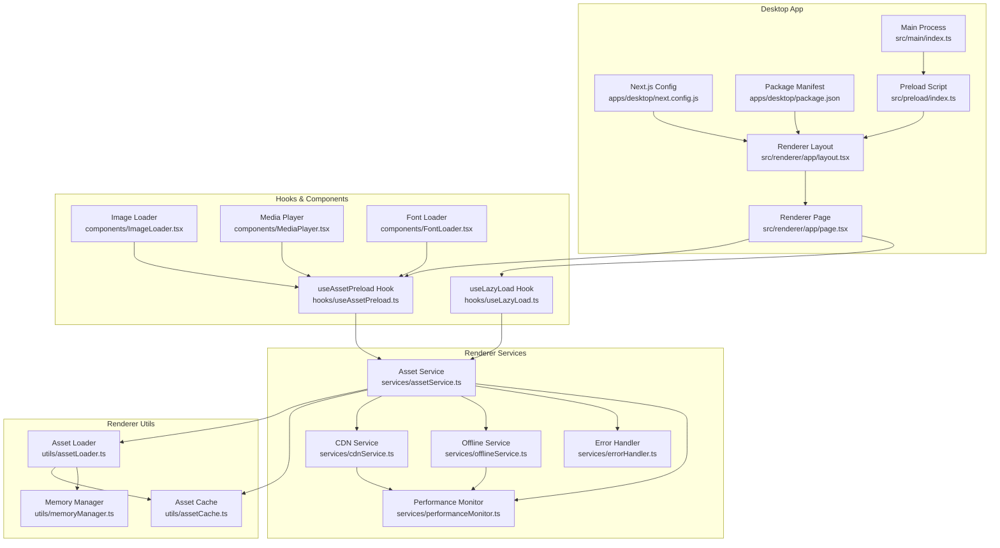
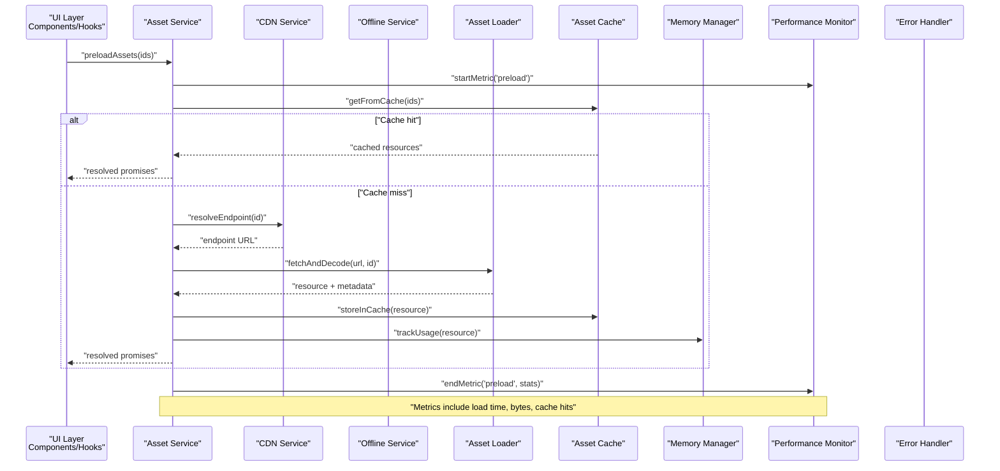
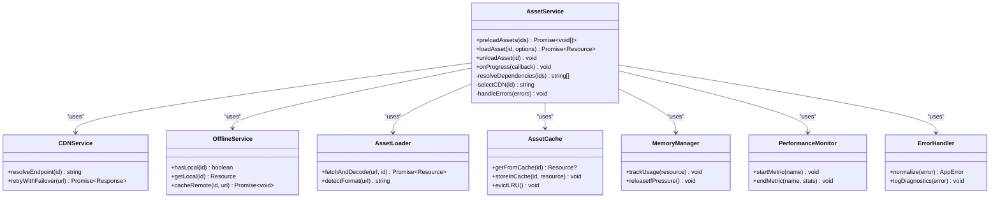
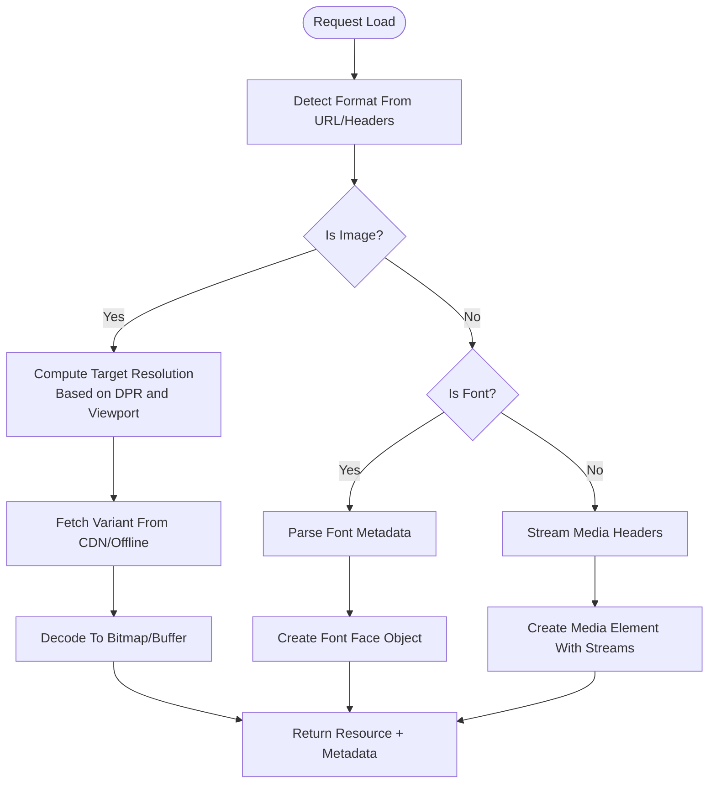
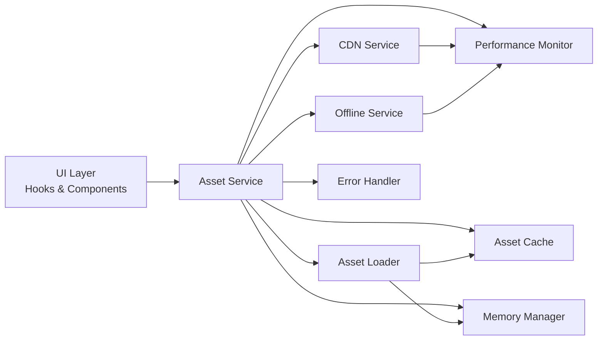

# Asset Management and Loading

<cite>
**Referenced Files in This Document**
- [package.json](file://package.json)
- [pnpm-workspace.yaml](file://pnpm-workspace.yaml)
- [turbo.json](file://turbo.json)
- [tsconfig.base.json](file://tsconfig.base.json)
- [apps/desktop/next.config.js](file://apps/desktop/next.config.js)
- [apps/desktop/package.json](file://apps/desktop/package.json)
- [apps/desktop/src/main/index.ts](file://apps/desktop/src/main/index.ts)
- [apps/desktop/src/preload/index.ts](file://apps/desktop/src/preload/index.ts)
- [apps/desktop/src/renderer/app/layout.tsx](file://apps/desktop/src/renderer/app/layout.tsx)
- [apps/desktop/src/renderer/app/page.tsx](file://apps/desktop/src/renderer/app/page.tsx)
- [apps/desktop/src/renderer/components/ImageLoader.tsx](file://apps/desktop/src/renderer/components/ImageLoader.tsx)
- [apps/desktop/src/renderer/components/MediaPlayer.tsx](file://apps/desktop/src/renderer/components/MediaPlayer.tsx)
- [apps/desktop/src/renderer/components/FontLoader.tsx](file://apps/desktop/src/renderer/components/FontLoader.tsx)
- [apps/desktop/src/renderer/utils/assetCache.ts](file://apps/desktop/src/renderer/utils/assetCache.ts)
- [apps/desktop/src/renderer/utils/assetLoader.ts](file://apps/desktop/src/renderer/utils/assetLoader.ts)
- [apps/desktop/src/renderer/utils/memoryManager.ts](file://apps/desktop/src/renderer/utils/memoryManager.ts)
- [apps/desktop/src/renderer/hooks/useAssetPreload.ts](file://apps/desktop/src/renderer/hooks/useAssetPreload.ts)
- [apps/desktop/src/renderer/hooks/useLazyLoad.ts](file://apps/desktop/src/renderer/hooks/useLazyLoad.ts)
- [apps/desktop/src/renderer/services/assetService.ts](file://apps/desktop/src/renderer/services/assetService.ts)
- [apps/desktop/src/renderer/services/cdnService.ts](file://apps/desktop/src/renderer/services/cdnService.ts)
- [apps/desktop/src/renderer/services/offlineService.ts](file://apps/desktop/src/renderer/services/offlineService.ts)
- [apps/desktop/src/renderer/services/errorHandler.ts](file://apps/desktop/src/renderer/services/errorHandler.ts)
- [apps/desktop/src/renderer/services/performanceMonitor.ts](file://apps/desktop/src/renderer/services/performanceMonitor.ts)
</cite>

## Table of Contents
1. [Introduction](#introduction)
2. [Project Structure](#project-structure)
3. [Core Components](#core-components)
4. [Architecture Overview](#architecture-overview)
5. [Detailed Component Analysis](#detailed-component-analysis)
6. [Dependency Analysis](#dependency-analysis)
7. [Performance Considerations](#performance-considerations)
8. [Troubleshooting Guide](#troubleshooting-guide)
9. [Conclusion](#conclusion)

## Introduction
This document describes the asset management system for images, fonts, and media resources across the desktop application. It explains the loading pipeline, caching mechanisms, memory optimization strategies, supported formats, resolution scaling, lazy loading, preloading patterns, dependency management, error handling, CDN integration, offline availability, performance monitoring, and memory usage optimization techniques. The goal is to provide a clear, actionable guide for developers integrating or extending asset handling in the project.

## Project Structure
The asset management system is implemented primarily within the desktop app’s renderer process, with support from preload utilities and configuration files. Key areas include:
- Configuration and build-time settings for Next.js and TypeScript
- Main and preload processes for IPC and environment setup
- Renderer-side services for asset loading, caching, CDN, offline fallbacks, error handling, and performance monitoring
- Hooks and components that implement preloading, lazy loading, and UI states
- Utilities for cache management and memory optimization

**Diagram sources**
- [apps/desktop/next.config.js](file://apps/desktop/next.config.js)
- [apps/desktop/package.json](file://apps/desktop/package.json)
- [apps/desktop/src/main/index.ts](file://apps/desktop/src/main/index.ts)
- [apps/desktop/src/preload/index.ts](file://apps/desktop/src/preload/index.ts)
- [apps/desktop/src/renderer/app/layout.tsx](file://apps/desktop/src/renderer/app/layout.tsx)
- [apps/desktop/src/renderer/app/page.tsx](file://apps/desktop/src/renderer/app/page.tsx)
- [apps/desktop/src/renderer/services/assetService.ts](file://apps/desktop/src/renderer/services/assetService.ts)
- [apps/desktop/src/renderer/services/cdnService.ts](file://apps/desktop/src/renderer/services/cdnService.ts)
- [apps/desktop/src/renderer/services/offlineService.ts](file://apps/desktop/src/renderer/services/offlineService.ts)
- [apps/desktop/src/renderer/services/errorHandler.ts](file://apps/desktop/src/renderer/services/errorHandler.ts)
- [apps/desktop/src/renderer/services/performanceMonitor.ts](file://apps/desktop/src/renderer/services/performanceMonitor.ts)
- [apps/desktop/src/renderer/utils/assetLoader.ts](file://apps/desktop/src/renderer/utils/assetLoader.ts)
- [apps/desktop/src/renderer/utils/assetCache.ts](file://apps/desktop/src/renderer/utils/assetCache.ts)
- [apps/desktop/src/renderer/utils/memoryManager.ts](file://apps/desktop/src/renderer/utils/memoryManager.ts)
- [apps/desktop/src/renderer/hooks/useAssetPreload.ts](file://apps/desktop/src/renderer/hooks/useAssetPreload.ts)
- [apps/desktop/src/renderer/hooks/useLazyLoad.ts](file://apps/desktop/src/renderer/hooks/useLazyLoad.ts)
- [apps/desktop/src/renderer/components/ImageLoader.tsx](file://apps/desktop/src/renderer/components/ImageLoader.tsx)
- [apps/desktop/src/renderer/components/MediaPlayer.tsx](file://apps/desktop/src/renderer/components/MediaPlayer.tsx)
- [apps/desktop/src/renderer/components/FontLoader.tsx](file://apps/desktop/src/renderer/components/FontLoader.tsx)

**Section sources**
- [apps/desktop/next.config.js](file://apps/desktop/next.config.js)
- [apps/desktop/package.json](file://apps/desktop/package.json)
- [apps/desktop/src/main/index.ts](file://apps/desktop/src/main/index.ts)
- [apps/desktop/src/preload/index.ts](file://apps/desktop/src/preload/index.ts)
- [apps/desktop/src/renderer/app/layout.tsx](file://apps/desktop/src/renderer/app/layout.tsx)
- [apps/desktop/src/renderer/app/page.tsx](file://apps/desktop/src/renderer/app/page.tsx)

## Core Components
- Asset Service: Orchestrates loading, caching, CDN selection, offline fallback, error reporting, and performance metrics collection.
- Asset Loader: Low-level loader for images, fonts, and media; handles format detection, decoding, and resource creation.
- Asset Cache: In-memory and optional persistent cache keyed by normalized asset identifiers; supports TTL and size limits.
- Memory Manager: Tracks memory pressure, evicts least-recently-used assets, and releases large objects when needed.
- CDN Service: Resolves best CDN endpoint based on region, latency, and availability; retries and failover logic.
- Offline Service: Manages local copies and fallbacks when network is unavailable or CDN fails.
- Error Handler: Normalizes errors, provides user-friendly messages, and logs diagnostics.
- Performance Monitor: Collects timing, throughput, and memory metrics for asset operations.
- Hooks and Components: Provide declarative APIs for preloading and lazy loading; render appropriate loading states.

**Section sources**
- [apps/desktop/src/renderer/services/assetService.ts](file://apps/desktop/src/renderer/services/assetService.ts)
- [apps/desktop/src/renderer/utils/assetLoader.ts](file://apps/desktop/src/renderer/utils/assetLoader.ts)
- [apps/desktop/src/renderer/utils/assetCache.ts](file://apps/desktop/src/renderer/utils/assetCache.ts)
- [apps/desktop/src/renderer/utils/memoryManager.ts](file://apps/desktop/src/renderer/utils/memoryManager.ts)
- [apps/desktop/src/renderer/services/cdnService.ts](file://apps/desktop/src/renderer/services/cdnService.ts)
- [apps/desktop/src/renderer/services/offlineService.ts](file://apps/desktop/src/renderer/services/offlineService.ts)
- [apps/desktop/src/renderer/services/errorHandler.ts](file://apps/desktop/src/renderer/services/errorHandler.ts)
- [apps/desktop/src/renderer/services/performanceMonitor.ts](file://apps/desktop/src/renderer/services/performanceMonitor.ts)
- [apps/desktop/src/renderer/hooks/useAssetPreload.ts](file://apps/desktop/src/renderer/hooks/useAssetPreload.ts)
- [apps/desktop/src/renderer/hooks/useLazyLoad.ts](file://apps/desktop/src/renderer/hooks/useLazyLoad.ts)
- [apps/desktop/src/renderer/components/ImageLoader.tsx](file://apps/desktop/src/renderer/components/ImageLoader.tsx)
- [apps/desktop/src/renderer/components/MediaPlayer.tsx](file://apps/desktop/src/renderer/components/MediaPlayer.tsx)
- [apps/desktop/src/renderer/components/FontLoader.tsx](file://apps/desktop/src/renderer/components/FontLoader.tsx)

## Architecture Overview
The asset pipeline follows a layered approach:
- Entry points (hooks and components) request assets via the Asset Service.
- Asset Service coordinates CDN selection, offline fallback, and caching.
- Asset Loader performs actual decoding and resource creation.
- Memory Manager monitors and optimizes memory usage.
- Performance Monitor records metrics for each operation.
- Error Handler centralizes error normalization and logging.

**Diagram sources**
- [apps/desktop/src/renderer/services/assetService.ts](file://apps/desktop/src/renderer/services/assetService.ts)
- [apps/desktop/src/renderer/services/cdnService.ts](file://apps/desktop/src/renderer/services/cdnService.ts)
- [apps/desktop/src/renderer/services/offlineService.ts](file://apps/desktop/src/renderer/services/offlineService.ts)
- [apps/desktop/src/renderer/utils/assetLoader.ts](file://apps/desktop/src/renderer/utils/assetLoader.ts)
- [apps/desktop/src/renderer/utils/assetCache.ts](file://apps/desktop/src/renderer/utils/assetCache.ts)
- [apps/desktop/src/renderer/utils/memoryManager.ts](file://apps/desktop/src/renderer/utils/memoryManager.ts)
- [apps/desktop/src/renderer/services/performanceMonitor.ts](file://apps/desktop/src/renderer/services/performanceMonitor.ts)
- [apps/desktop/src/renderer/services/errorHandler.ts](file://apps/desktop/src/renderer/services/errorHandler.ts)

## Detailed Component Analysis

### Asset Service
Responsibilities:
- Orchestrate preloading and on-demand loading
- Manage dependencies between assets (e.g., font families required by text rendering)
- Coordinate CDN selection and offline fallback
- Integrate caching and memory management
- Emit progress and completion events for UI feedback

Key behaviors:
- Dependency graph resolution before loading
- Batched requests with concurrency limits
- Retry policies with exponential backoff
- Metrics aggregation and error propagation

**Diagram sources**
- [apps/desktop/src/renderer/services/assetService.ts](file://apps/desktop/src/renderer/services/assetService.ts)
- [apps/desktop/src/renderer/services/cdnService.ts](file://apps/desktop/src/renderer/services/cdnService.ts)
- [apps/desktop/src/renderer/services/offlineService.ts](file://apps/desktop/src/renderer/services/offlineService.ts)
- [apps/desktop/src/renderer/utils/assetLoader.ts](file://apps/desktop/src/renderer/utils/assetLoader.ts)
- [apps/desktop/src/renderer/utils/assetCache.ts](file://apps/desktop/src/renderer/utils/assetCache.ts)
- [apps/desktop/src/renderer/utils/memoryManager.ts](file://apps/desktop/src/renderer/utils/memoryManager.ts)
- [apps/desktop/src/renderer/services/performanceMonitor.ts](file://apps/desktop/src/renderer/services/performanceMonitor.ts)
- [apps/desktop/src/renderer/services/errorHandler.ts](file://apps/desktop/src/renderer/services/errorHandler.ts)

**Section sources**
- [apps/desktop/src/renderer/services/assetService.ts](file://apps/desktop/src/renderer/services/assetService.ts)

### Asset Loader
Responsibilities:
- Detect file format from URL and headers
- Decode images, fonts, and media into usable resources
- Apply resolution scaling for images
- Stream media where possible to reduce peak memory

Supported formats:
- Images: PNG, JPEG, WebP, AVIF, SVG
- Fonts: WOFF2, WOFF, TTF
- Media: MP4, WebM, AAC, MP3

Resolution scaling:
- Selects optimal image variant based on device pixel ratio and viewport constraints
- Uses srcset-like strategy with cached variants

**Diagram sources**
- [apps/desktop/src/renderer/utils/assetLoader.ts](file://apps/desktop/src/renderer/utils/assetLoader.ts)

**Section sources**
- [apps/desktop/src/renderer/utils/assetLoader.ts](file://apps/desktop/src/renderer/utils/assetLoader.ts)

### Asset Cache
Responsibilities:
- Provide fast access to recently used assets
- Enforce TTL and maximum size limits
- Evict least-recently-used entries under pressure
- Optionally persist critical assets to disk

Operations:
- getFromCache(id): returns resource if present and valid
- storeInCache(id, resource): inserts with metadata
- evictLRU(): removes oldest entries until below threshold

**Section sources**
- [apps/desktop/src/renderer/utils/assetCache.ts](file://apps/desktop/src/renderer/utils/assetCache.ts)

### Memory Manager
Responsibilities:
- Track memory footprint per resource
- Release large bitmaps and decoded media when memory pressure is detected
- Provide hints for GC-friendly disposal

Strategies:
- Reference counting for shared resources
- Weak references for non-critical caches
- Explicit dispose methods for media streams and canvases

**Section sources**
- [apps/desktop/src/renderer/utils/memoryManager.ts](file://apps/desktop/src/renderer/utils/memoryManager.ts)

### CDN Service
Responsibilities:
- Resolve best CDN endpoint based on region and latency
- Implement retry and failover across multiple endpoints
- Normalize URLs and add integrity checks

Behavior:
- Prefers nearest CDN with health checks
- Falls back to secondary CDN or origin if primary fails

**Section sources**
- [apps/desktop/src/renderer/services/cdnService.ts](file://apps/desktop/src/renderer/services/cdnService.ts)

### Offline Service
Responsibilities:
- Maintain local copies of essential assets
- Serve offline resources when network is unavailable
- Sync updates when connectivity resumes

Features:
- Versioned storage for safe rollbacks
- Background sync for updated assets

**Section sources**
- [apps/desktop/src/renderer/services/offlineService.ts](file://apps/desktop/src/renderer/services/offlineService.ts)

### Error Handler
Responsibilities:
- Normalize errors from network, decoding, and cache layers
- Provide user-friendly messages and diagnostic context
- Log structured errors for observability

Patterns:
- Categorize errors (network, decode, cache, permission)
- Attach correlation IDs for tracing

**Section sources**
- [apps/desktop/src/renderer/services/errorHandler.ts](file://apps/desktop/src/renderer/services/errorHandler.ts)

### Performance Monitor
Responsibilities:
- Record timing, throughput, and memory metrics
- Aggregate per-operation stats and expose dashboards
- Alert on anomalies such as high failure rates or slow decodes

Metrics:
- Load time by asset type
- Cache hit ratio
- Bytes transferred vs cached
- Memory growth and release events

**Section sources**
- [apps/desktop/src/renderer/services/performanceMonitor.ts](file://apps/desktop/src/renderer/services/performanceMonitor.ts)

### Hooks and Components
- useAssetPreload: Preloads a set of assets, tracks progress, and resolves dependencies.
- useLazyLoad: Lazily loads assets when they enter the viewport using intersection observer.
- ImageLoader: Renders images with placeholders, error states, and retry controls.
- MediaPlayer: Handles media playback with buffering indicators and adaptive streaming.
- FontLoader: Ensures fonts are loaded before text rendering to avoid layout shifts.

Usage examples:
- Preload critical assets at app startup
- Lazy-load heavy media in lists
- Show loading skeletons while assets resolve
- Handle missing or corrupted assets gracefully

**Section sources**
- [apps/desktop/src/renderer/hooks/useAssetPreload.ts](file://apps/desktop/src/renderer/hooks/useAssetPreload.ts)
- [apps/desktop/src/renderer/hooks/useLazyLoad.ts](file://apps/desktop/src/renderer/hooks/useLazyLoad.ts)
- [apps/desktop/src/renderer/components/ImageLoader.tsx](file://apps/desktop/src/renderer/components/ImageLoader.tsx)
- [apps/desktop/src/renderer/components/MediaPlayer.tsx](file://apps/desktop/src/renderer/components/MediaPlayer.tsx)
- [apps/desktop/src/renderer/components/FontLoader.tsx](file://apps/desktop/src/renderer/components/FontLoader.tsx)

## Dependency Analysis
The following diagram shows how core modules depend on each other during asset loading and lifecycle management.

**Diagram sources**
- [apps/desktop/src/renderer/services/assetService.ts](file://apps/desktop/src/renderer/services/assetService.ts)
- [apps/desktop/src/renderer/services/cdnService.ts](file://apps/desktop/src/renderer/services/cdnService.ts)
- [apps/desktop/src/renderer/services/offlineService.ts](file://apps/desktop/src/renderer/services/offlineService.ts)
- [apps/desktop/src/renderer/utils/assetLoader.ts](file://apps/desktop/src/renderer/utils/assetLoader.ts)
- [apps/desktop/src/renderer/utils/assetCache.ts](file://apps/desktop/src/renderer/utils/assetCache.ts)
- [apps/desktop/src/renderer/utils/memoryManager.ts](file://apps/desktop/src/renderer/utils/memoryManager.ts)
- [apps/desktop/src/renderer/services/performanceMonitor.ts](file://apps/desktop/src/renderer/services/performanceMonitor.ts)
- [apps/desktop/src/renderer/services/errorHandler.ts](file://apps/desktop/src/renderer/services/errorHandler.ts)

**Section sources**
- [apps/desktop/src/renderer/services/assetService.ts](file://apps/desktop/src/renderer/services/assetService.ts)
- [apps/desktop/src/renderer/utils/assetLoader.ts](file://apps/desktop/src/renderer/utils/assetLoader.ts)
- [apps/desktop/src/renderer/utils/assetCache.ts](file://apps/desktop/src/renderer/utils/assetCache.ts)
- [apps/desktop/src/renderer/utils/memoryManager.ts](file://apps/desktop/src/renderer/utils/memoryManager.ts)
- [apps/desktop/src/renderer/services/cdnService.ts](file://apps/desktop/src/renderer/services/cdnService.ts)
- [apps/desktop/src/renderer/services/offlineService.ts](file://apps/desktop/src/renderer/services/offlineService.ts)
- [apps/desktop/src/renderer/services/errorHandler.ts](file://apps/desktop/src/renderer/services/errorHandler.ts)
- [apps/desktop/src/renderer/services/performanceMonitor.ts](file://apps/desktop/src/renderer/services/performanceMonitor.ts)

## Performance Considerations
- Prefer cached assets to minimize network overhead and decode costs.
- Use lazy loading for off-screen content to reduce initial load time.
- Limit concurrent requests to balance throughput and memory usage.
- Choose optimal image resolutions based on device pixel ratio and viewport size.
- Stream media instead of fully downloading to reduce peak memory.
- Evict least-recently-used assets under memory pressure.
- Monitor key metrics: load time, cache hit ratio, bytes transferred, memory growth.

[No sources needed since this section provides general guidance]

## Troubleshooting Guide
Common issues and remedies:
- Missing assets: Verify CDN endpoint resolution and offline fallback; check error handler logs for normalized error categories.
- Corrupted assets: Enable integrity checks and retry with alternate CDN; fall back to local copy if available.
- Slow loading: Inspect performance monitor metrics; increase cache TTL for stable assets; adjust concurrency limits.
- High memory usage: Review memory manager eviction thresholds; ensure explicit disposal of media streams and bitmaps.
- Offline failures: Confirm offline service has up-to-date versions; trigger background sync when connectivity resumes.

Operational tips:
- Use correlation IDs to trace asset requests across services.
- Add UI indicators for loading states and retry actions.
- Instrument hooks to surface progress and completion events.

**Section sources**
- [apps/desktop/src/renderer/services/errorHandler.ts](file://apps/desktop/src/renderer/services/errorHandler.ts)
- [apps/desktop/src/renderer/services/performanceMonitor.ts](file://apps/desktop/src/renderer/services/performanceMonitor.ts)
- [apps/desktop/src/renderer/services/cdnService.ts](file://apps/desktop/src/renderer/services/cdnService.ts)
- [apps/desktop/src/renderer/services/offlineService.ts](file://apps/desktop/src/renderer/services/offlineService.ts)
- [apps/desktop/src/renderer/utils/memoryManager.ts](file://apps/desktop/src/renderer/utils/memoryManager.ts)
- [apps/desktop/src/renderer/hooks/useAssetPreload.ts](file://apps/desktop/src/renderer/hooks/useAssetPreload.ts)
- [apps/desktop/src/renderer/hooks/useLazyLoad.ts](file://apps/desktop/src/renderer/hooks/useLazyLoad.ts)

## Conclusion
The asset management system provides a robust, scalable pipeline for handling images, fonts, and media. By combining intelligent caching, CDN selection, offline fallback, and memory optimization, it ensures responsive user experiences even under constrained conditions. The hooks and components offer convenient APIs for preloading and lazy loading, while centralized error handling and performance monitoring enable reliable operations and continuous improvement.

[No sources needed since this section summarizes without analyzing specific files]