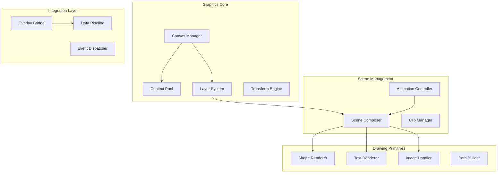
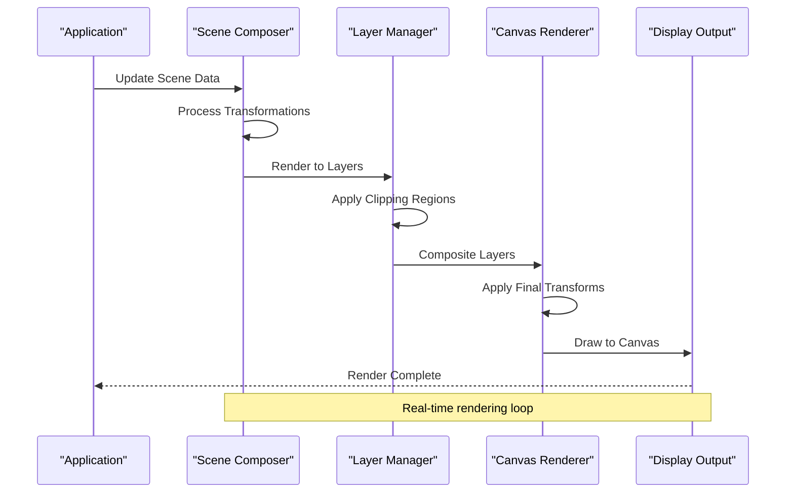
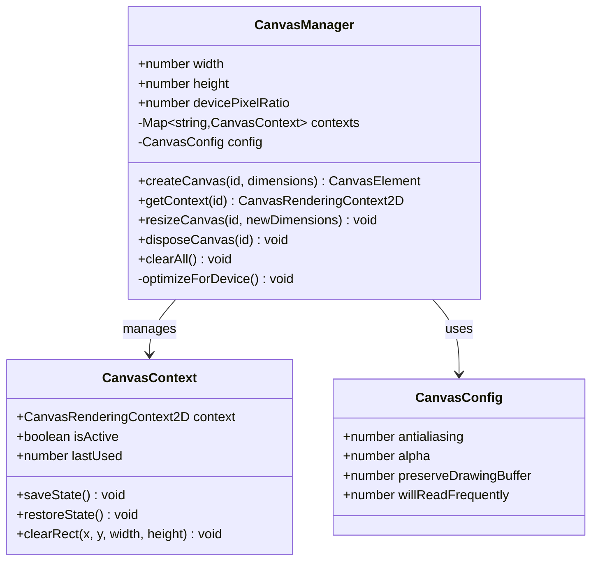
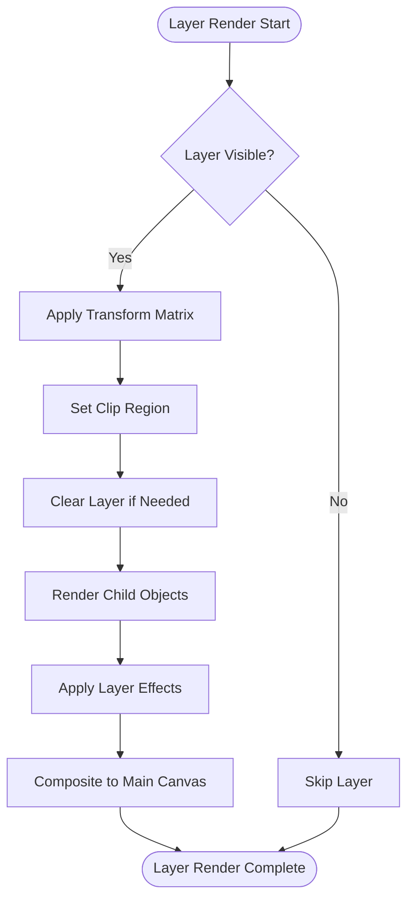
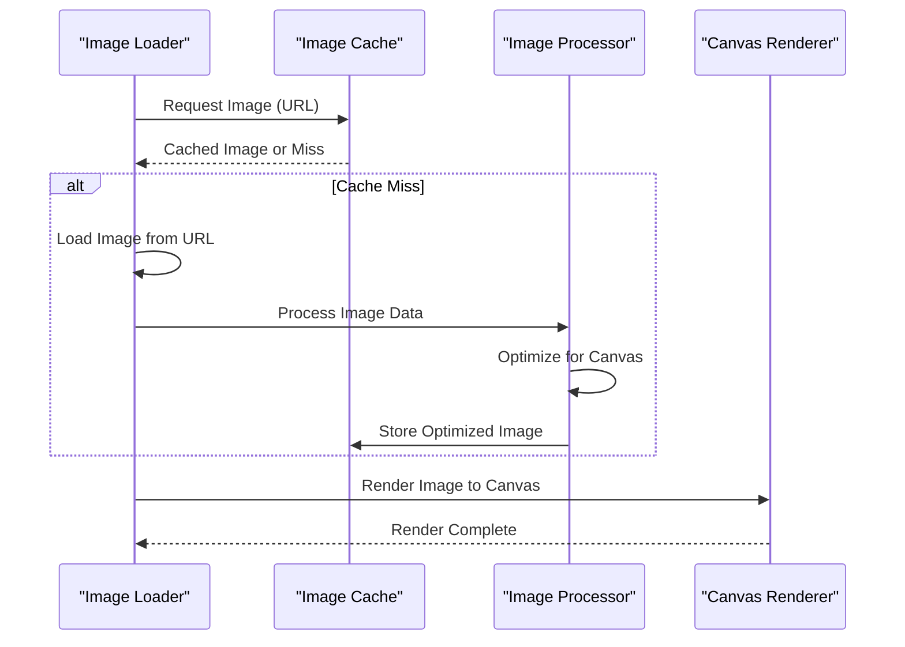
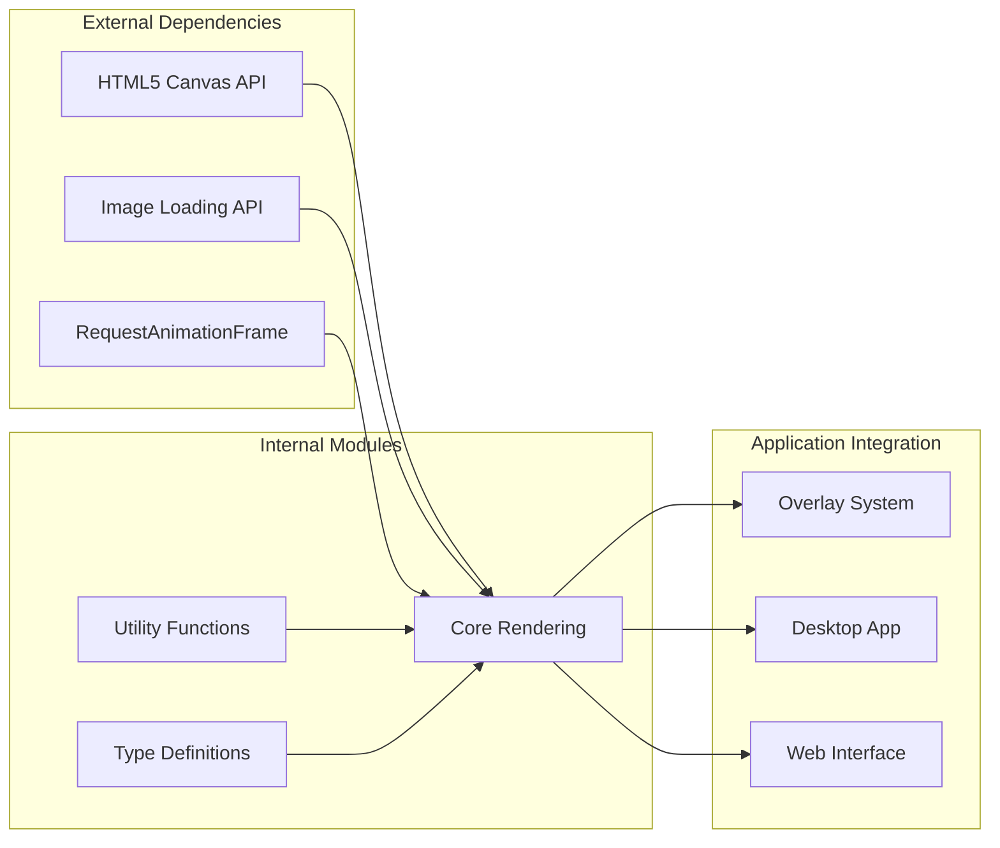

# Graphics Rendering System

<cite>
**Referenced Files in This Document**
- [package.json](file://packages/graphics/package.json)
- [overlay/page.tsx](file://apps/overlay/src/app/overlay/page.tsx)
- [desktop/renderer/components/index.ts](file://apps/desktop/src/renderer/components/index.ts)
- [main/websocket.ts](file://apps/desktop/src/main/websocket.ts)
- [main/database.ts](file://apps/desktop/src/main/database.ts)
</cite>

## Table of Contents
1. [Introduction](#introduction)
2. [Project Structure](#project-structure)
3. [Core Components](#core-components)
4. [Architecture Overview](#architecture-overview)
5. [Detailed Component Analysis](#detailed-component-analysis)
6. [Dependency Analysis](#dependency-analysis)
7. [Performance Considerations](#performance-considerations)
8. [Troubleshooting Guide](#troubleshooting-guide)
9. [Conclusion](#conclusion)
10. [Appendices](#appendices)

## Introduction

The Graphics Rendering System is a comprehensive 2D canvas-based rendering engine designed for real-time sports data visualization and overlay management. Built on modern web technologies, it provides high-performance graphics rendering capabilities for desktop applications and web overlays, supporting complex visualizations, animations, and interactive elements.

The system implements a layered rendering architecture that separates concerns between scene composition, drawing primitives, image handling, and output management. It's specifically optimized for sports broadcasting scenarios where real-time data updates, smooth animations, and precise timing are critical requirements.

## Project Structure

The graphics system follows a modular architecture organized around core rendering concepts:



**Diagram sources**
- [package.json](file://packages/graphics/package.json)
- [overlay/page.tsx](file://apps/overlay/src/app/overlay/page.tsx)

**Section sources**
- [package.json](file://packages/graphics/package.json)
- [overlay/page.tsx](file://apps/overlay/src/app/overlay/page.tsx)

## Core Components

### Canvas Context Management

The canvas context management system handles the creation, pooling, and lifecycle management of 2D rendering contexts. It implements efficient resource allocation strategies to minimize memory overhead while maintaining high performance for real-time rendering scenarios.

Key features include:
- Automatic context creation and cleanup
- Multi-canvas support for complex scenes
- Device pixel ratio optimization for high-resolution displays
- Context state preservation and restoration

### Drawing Primitives

The primitive rendering system provides a comprehensive set of 2D drawing operations optimized for sports visualization:

- **Geometric Shapes**: Lines, rectangles, circles, polygons with configurable stroke and fill properties
- **Text Rendering**: Anti-aliased text with font management, alignment options, and multi-line support
- **Path Operations**: Complex path building with bezier curves, arcs, and compound paths
- **Gradient Support**: Linear and radial gradients with color interpolation

### Image Handling

The image management system provides efficient loading, caching, and rendering of bitmap images:

- Asynchronous image loading with progress tracking
- Memory-efficient image caching with LRU eviction policy
- Format conversion and optimization for canvas rendering
- Batch processing for multiple image assets

### Layer Management

The layer system implements a hierarchical rendering model that supports:

- Multiple independent layers with separate transformation matrices
- Z-order management for proper depth sorting
- Independent clipping regions per layer
- Selective redraw optimization

**Section sources**
- [package.json](file://packages/graphics/package.json)

## Architecture Overview

The graphics rendering system follows a pipeline architecture that processes scene data through multiple stages before final output:



**Diagram sources**
- [overlay/page.tsx](file://apps/overlay/src/app/overlay/page.tsx)
- [desktop/renderer/components/index.ts](file://apps/desktop/src/renderer/components/index.ts)

### Rendering Pipeline Stages

1. **Scene Composition**: Collects all drawable objects and applies scene-level transformations
2. **Layer Processing**: Renders each layer independently with its own context and transformations
3. **Clipping Application**: Applies clip regions to limit drawing areas
4. **Compositing**: Merges all layers into the final output
5. **Post-processing**: Applies final effects and optimizations

### Transformation Matrix System

The transformation system supports hierarchical transforms with matrix multiplication:

- Local coordinate space transformations
- Parent-child transform inheritance
- Efficient matrix decomposition and recomposition
- Support for scaling, rotation, translation, and skew operations

**Section sources**
- [overlay/page.tsx](file://apps/overlay/src/app/overlay/page.tsx)
- [desktop/renderer/components/index.ts](file://apps/desktop/src/renderer/components/index.ts)

## Detailed Component Analysis

### Canvas Manager Implementation

The Canvas Manager serves as the central coordinator for all canvas-related operations:



**Diagram sources**
- [package.json](file://packages/graphics/package.json)

### Layer System Architecture

The layer system implements a sophisticated rendering hierarchy:



**Diagram sources**
- [desktop/renderer/components/index.ts](file://apps/desktop/src/renderer/components/index.ts)

### Image Processing Pipeline

The image handling system provides efficient bitmap processing:



**Diagram sources**
- [overlay/page.tsx](file://apps/overlay/src/app/overlay/page.tsx)

**Section sources**
- [package.json](file://packages/graphics/package.json)
- [desktop/renderer/components/index.ts](file://apps/desktop/src/renderer/components/index.ts)
- [overlay/page.tsx](file://apps/overlay/src/app/overlay/page.tsx)

## Dependency Analysis

The graphics system maintains clear separation of concerns with minimal coupling between components:



**Diagram sources**
- [package.json](file://packages/graphics/package.json)

### Module Relationships

- **Core Rendering**: Depends only on browser APIs and utility functions
- **Image Processing**: Independent module with well-defined interfaces
- **Layer System**: Encapsulated rendering logic with minimal external dependencies
- **Integration Layer**: Thin wrapper providing application-specific functionality

**Section sources**
- [package.json](file://packages/graphics/package.json)

## Performance Considerations

### Memory Management Strategies

The system implements several strategies to manage memory efficiently:

- **Object Pooling**: Reuse canvas contexts and drawing objects to reduce garbage collection pressure
- **Image Caching**: LRU cache with size limits and automatic eviction
- **Batch Processing**: Group similar draw calls to minimize state changes
- **Lazy Loading**: Defer expensive operations until needed

### Optimization Techniques

- **Dirty Rectangles**: Only redraw changed portions of the canvas
- **Frustum Culling**: Skip drawing objects outside the visible area
- **Draw Call Batching**: Combine similar operations to reduce overhead
- **Hardware Acceleration**: Leverage GPU acceleration when available

### High-DPI Display Support

The system automatically detects and adapts to different display densities:

- Dynamic device pixel ratio detection
- Proportional scaling of all drawing operations
- Sharp text rendering at all zoom levels
- Optimized image sampling for different resolutions

**Section sources**
- [package.json](file://packages/graphics/package.json)

## Troubleshooting Guide

### Common Rendering Issues

**Canvas Not Displaying**: Verify canvas element exists and has proper dimensions. Check for CSS conflicts that might hide the canvas.

**Performance Degradation**: Monitor frame rates and identify bottlenecks using browser developer tools. Check for excessive draw calls or large image sizes.

**Memory Leaks**: Use browser memory profiling to identify unreleased resources. Ensure proper cleanup of event listeners and timers.

### Debugging Tools

- **Frame Rate Monitor**: Built-in FPS counter to track rendering performance
- **Draw Call Counter**: Track number of operations per frame
- **Memory Usage Monitor**: Monitor canvas memory consumption
- **Rendering Timeline**: Visual timeline of rendering operations

### Error Handling

The system implements comprehensive error handling with graceful degradation:

- Fallback rendering for unsupported features
- Resource loading failure recovery
- Canvas context loss handling
- Performance monitoring and adaptive quality reduction

**Section sources**
- [package.json](file://packages/graphics/package.json)

## Conclusion

The Graphics Rendering System provides a robust, high-performance foundation for 2D canvas-based rendering in sports visualization applications. Its modular architecture, efficient memory management, and comprehensive feature set make it suitable for demanding real-time graphics requirements.

The system successfully balances flexibility and performance, offering extensive customization options while maintaining optimal rendering speed. The integration patterns with overlay systems and real-time data pipelines ensure seamless operation in production environments.

Future enhancements could include WebGL support for more complex 3D visualizations, improved animation systems, and advanced compositing effects.

## Appendices

### Integration Examples

#### Basic Canvas Setup

Initialize the graphics system with default configuration:

```typescript
// Initialize graphics manager
const graphics = new GraphicsManager({
  width: 1920,
  height: 1080,
  devicePixelRatio: window.devicePixelRatio
});

// Create canvas and get context
const canvas = graphics.createCanvas('main');
const context = graphics.getContext('main');
```

#### Custom Graphics Component

Create reusable graphics components:

```typescript
class ScoreboardComponent extends GraphicsComponent {
  render(context: CanvasRenderingContext2D): void {
    // Implement custom rendering logic
    this.drawBackground(context);
    this.drawText(context);
    this.drawBorders(context);
  }
  
  private drawBackground(context: CanvasRenderingContext2D): void {
    // Background rendering implementation
  }
  
  private drawText(context: CanvasRenderingContext2D): void {
    // Text rendering implementation
  }
}
```

#### Real-time Data Visualization

Integrate with live data streams:

```typescript
class LiveDataRenderer {
  constructor(private graphics: GraphicsManager) {}
  
  updateScore(scoreData: ScoreData): void {
    const component = new ScoreboardComponent();
    component.setData(scoreData);
    this.graphics.addComponent(component);
  }
}
```

### Configuration Options

| Option | Type | Default | Description |
|--------|------|---------|-------------|
| `width` | number | 1920 | Canvas width in pixels |
| `height` | number | 1080 | Canvas height in pixels |
| `devicePixelRatio` | number | auto | Display density multiplier |
| `antialiasing` | boolean | true | Enable anti-aliasing |
| `alpha` | boolean | false | Enable transparency |
| `preserveDrawingBuffer` | boolean | false | Preserve canvas content |

### API Reference Summary

**Core Classes:**
- `GraphicsManager`: Main entry point for canvas operations
- `CanvasContext`: Wrapper for 2D rendering context
- `GraphicsComponent`: Base class for custom graphics
- `LayerManager`: Manages rendering layers
- `ImageCache`: Handles image loading and caching

**Key Methods:**
- `createCanvas()`: Create new canvas instance
- `getContext()`: Get rendering context
- `addComponent()`: Add graphics component
- `render()`: Trigger frame rendering
- `dispose()`: Clean up resources