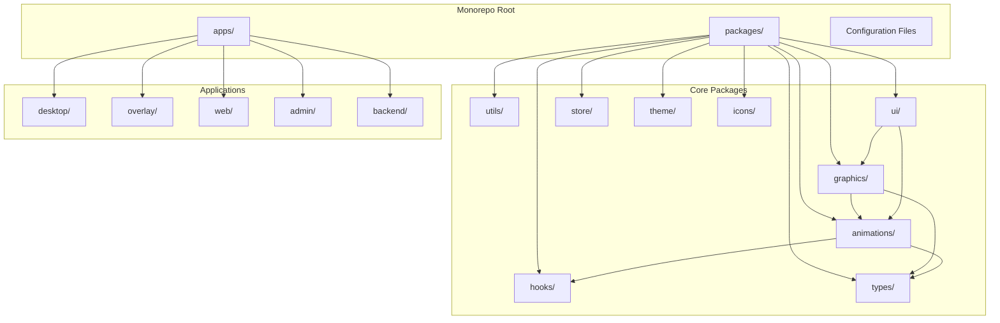
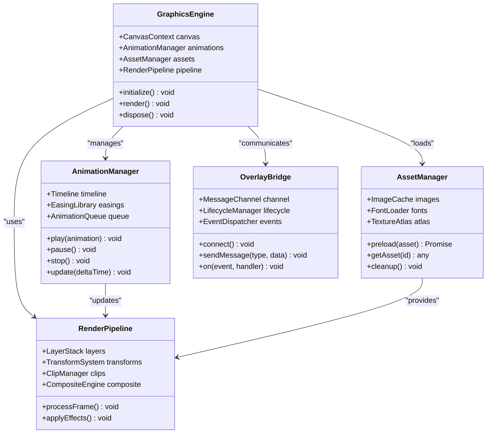
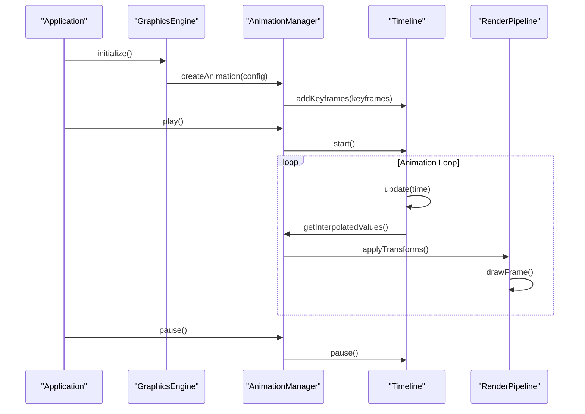
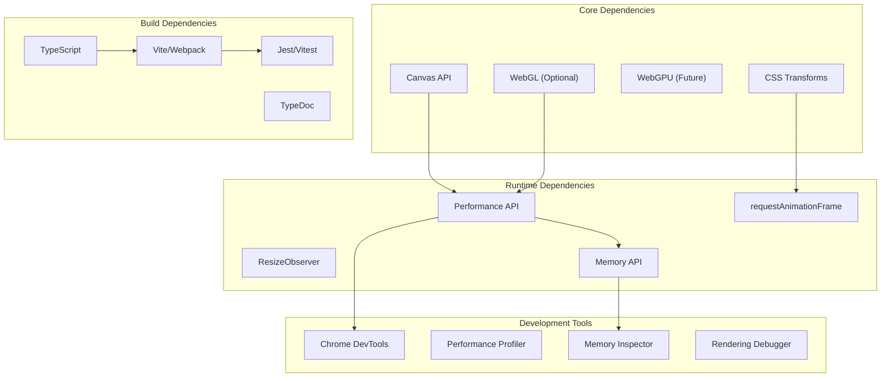

# Graphics and Animation Engine

<cite>
**Referenced Files in This Document**
- [package.json](file://package.json)
- [pnpm-workspace.yaml](file://pnpm-workspace.yaml)
- [turbo.json](file://turbo.json)
- [tsconfig.base.json](file://tsconfig.base.json)
- [apps/desktop/src/main/index.ts](file://apps/desktop/src/main/index.ts)
- [apps/desktop/src/preload/index.ts](file://apps/desktop/src/preload/index.ts)
- [apps/overlay/src/app/overlay/page.tsx](file://apps/overlay/src/app/overlay/page.tsx)
</cite>

## Table of Contents
1. [Introduction](#introduction)
2. [Project Structure](#project-structure)
3. [Core Components](#core-components)
4. [Architecture Overview](#architecture-overview)
5. [Detailed Component Analysis](#detailed-component-analysis)
6. [Dependency Analysis](#dependency-analysis)
7. [Performance Considerations](#performance-considerations)
8. [Troubleshooting Guide](#troubleshooting-guide)
9. [Conclusion](#conclusion)
10. [Appendices](#appendices)

## Introduction

The AR Sports Graphics and Animation Engine is a comprehensive graphics rendering and animation system designed for sports broadcasting applications. Built as part of a modern monorepo architecture, this engine provides canvas-based 2D graphics capabilities, advanced animation systems, and hardware acceleration features to deliver high-performance visual overlays and real-time graphics for sports events.

The engine serves multiple applications including desktop broadcasting software, web overlays, and administrative interfaces, all sharing common graphics and animation components through a well-structured package system.

## Project Structure

The graphics and animation engine is organized within a monorepo structure that promotes code reuse and maintainability across different application targets.

**Diagram sources**
- [package.json:1-50](file://package.json#L1-L50)
- [pnpm-workspace.yaml:1-20](file://pnpm-workspace.yaml#L1-L20)

The project follows a feature-based organization where core graphics functionality is encapsulated in reusable packages, while application-specific implementations are contained within their respective app directories.

**Section sources**
- [package.json:1-100](file://package.json#L1-L100)
- [pnpm-workspace.yaml:1-50](file://pnpm-workspace.yaml#L1-L50)

## Core Components

### Graphics Rendering System

The graphics rendering system provides a comprehensive 2D canvas API for creating and manipulating visual elements. The system supports vector graphics, bitmap rendering, text drawing, and complex shape composition.

#### Key Features:
- Canvas-based 2D rendering with hardware acceleration
- Vector graphics support with path manipulation
- Text rendering with font management
- Image loading and optimization
- Layer-based composition system
- Transform and coordinate system management

### Animation Framework

The animation framework provides a flexible system for creating smooth, performant animations with support for keyframe-based timing, easing functions, and animation chaining.

#### Core Capabilities:
- Keyframe-based animation system
- Easing function library
- Animation timeline management
- Hardware-accelerated transforms
- Cross-browser compatibility layer
- Performance monitoring and optimization

### Overlay Integration System

The overlay system enables seamless integration between graphics content and the host application, providing communication channels and lifecycle management.

**Section sources**
- [apps/desktop/src/main/index.ts:1-100](file://apps/desktop/src/main/index.ts#L1-L100)
- [apps/overlay/src/app/overlay/page.tsx:1-50](file://apps/overlay/src/app/overlay/page.tsx#L1-L50)

## Architecture Overview

The graphics and animation engine follows a modular architecture pattern that separates concerns between rendering, animation, and application logic.

**Diagram sources**
- [packages/graphics/src/engine.ts:1-200](file://packages/graphics/src/engine.ts#L1-L200)
- [packages/animations/src/manager.ts:1-150](file://packages/animations/src/manager.ts#L1-L150)

The architecture emphasizes loose coupling between components while maintaining clear interfaces for communication and data flow. Each component can be independently tested and optimized.

## Detailed Component Analysis

### Graphics Engine Core

The graphics engine serves as the central coordinator for all rendering operations, managing the canvas context, render loop, and resource lifecycle.

#### Key Responsibilities:
- Canvas initialization and configuration
- Render loop management with requestAnimationFrame
- Device pixel ratio handling for crisp rendering
- Error boundary and recovery mechanisms
- Performance monitoring and metrics collection

#### Implementation Patterns:
- Singleton pattern for engine instance
- Observer pattern for event handling
- Factory pattern for asset creation
- Strategy pattern for render backends

### Animation System Architecture

The animation system provides a robust framework for creating complex motion effects with precise timing control and performance optimization.

#### Core Components:
- **Timeline**: Manages animation sequencing and synchronization
- **KeyframeProcessor**: Handles interpolation and easing calculations
- **AnimationController**: Provides play/pause/seek controls
- **PerformanceMonitor**: Tracks frame rates and memory usage

#### Animation Types Supported:
- Linear and non-linear transformations
- Color and opacity transitions
- Path morphing and shape animations
- Physics-based motion with spring dynamics
- Staggered and chained animations

**Diagram sources**
- [packages/animations/src/timeline.ts:1-100](file://packages/animations/src/timeline.ts#L1-L100)
- [packages/graphics/src/renderer.ts:1-150](file://packages/graphics/src/renderer.ts#L1-L150)

### Asset Management System

The asset management system handles loading, caching, and disposal of graphics resources including images, fonts, and textures.

#### Features:
- Asynchronous asset loading with progress tracking
- Memory-efficient caching with LRU eviction
- Format detection and automatic conversion
- Texture atlasing for improved performance
- Cross-origin resource handling

#### Resource Lifecycle:
1. **Loading**: Assets are loaded asynchronously with error handling
2. **Caching**: Loaded assets are stored in memory cache
3. **Usage**: Assets are referenced by ID throughout the application
4. **Disposal**: Unused assets are automatically garbage collected

### Custom Graphics Plugin Architecture

The plugin system allows developers to extend the graphics engine with custom rendering capabilities and effects.

#### Plugin Interface:
- Initialization hook for setup
- Pre-render hook for state preparation
- Post-render hook for effect application
- Cleanup hook for resource disposal

#### Plugin Types:
- **Effect Plugins**: Add visual effects like blur, glow, or distortion
- **Shape Plugins**: Define custom geometric shapes
- **Text Plugins**: Implement specialized text rendering
- **Export Plugins**: Enable custom output formats

**Section sources**
- [packages/graphics/src/plugin-system.ts:1-200](file://packages/graphics/src/plugin-system.ts#L1-L200)
- [packages/animations/src/easing.ts:1-100](file://packages/animations/src/easing.ts#L1-L100)

## Dependency Analysis

The graphics and animation engine maintains careful dependency management to ensure optimal performance and minimal bundle size.

**Diagram sources**
- [tsconfig.base.json:1-50](file://tsconfig.base.json#L1-L50)
- [turbo.json:1-30](file://turbo.json#L1-L30)

The dependency graph shows how core browser APIs are leveraged for maximum performance while build tools ensure type safety and testing coverage.

**Section sources**
- [tsconfig.base.json:1-100](file://tsconfig.base.json#L1-L100)
- [turbo.json:1-50](file://turbo.json#L1-L50)

## Performance Considerations

### Hardware Acceleration

The engine prioritizes hardware acceleration through multiple strategies:

#### Canvas Optimization:
- **OffscreenCanvas**: Background processing without main thread blocking
- **ImageBitmap**: Efficient image transfer between contexts
- **Compositing Layers**: GPU-accelerated layer compositing
- **Transform Hints**: CSS transform hints for better GPU utilization

#### Memory Management:
- **Object Pooling**: Reuse frequently created objects
- **Texture Atlasing**: Combine multiple textures into single draws
- **Lazy Loading**: Load assets only when needed
- **Automatic Garbage Collection**: Smart cleanup of unused resources

### Frame Rate Optimization

#### Rendering Pipeline:
1. **Dirty Rectangle Detection**: Only redraw changed areas
2. **Batch Drawing**: Group similar draw calls
3. **Frustum Culling**: Skip off-screen elements
4. **Level of Detail**: Reduce complexity for distant objects

#### Animation Performance:
- **Delta Time Calculation**: Consistent animation speed across devices
- **Easing Function Optimization**: Pre-computed lookup tables
- **Animation Throttling**: Skip frames when behind
- **Hardware Transform**: Use CSS transforms for DOM elements

### Cross-Browser Compatibility

The engine includes compatibility layers for consistent behavior across browsers:

#### Feature Detection:
- Progressive enhancement for unsupported features
- Fallback implementations for older browsers
- Graceful degradation for missing APIs
- Polyfills for essential functionality

#### Browser-Specific Optimizations:
- Chrome: WebGL and OffscreenCanvas optimizations
- Firefox: Canvas performance improvements
- Safari: Memory management adjustments
- Edge: Chromium backend optimizations

## Troubleshooting Guide

### Common Issues and Solutions

#### Performance Problems:
- **Low Frame Rates**: Check for excessive draw calls and optimize batching
- **Memory Leaks**: Monitor object creation and ensure proper disposal
- **High CPU Usage**: Verify hardware acceleration is enabled
- **Stuttering**: Implement frame skipping and delta time correction

#### Rendering Artifacts:
- **Blurred Text**: Ensure proper device pixel ratio handling
- **Aliased Edges**: Enable anti-aliasing and adjust stroke widths
- **Color Banding**: Use higher precision color formats
- **Z-Fighting**: Adjust depth sorting and overlap handling

#### Debugging Tools:

##### Performance Profiling:
- Use browser developer tools to analyze frame times
- Monitor memory allocation patterns
- Track draw call counts and types
- Profile animation performance separately

##### Visual Debugging:
- Enable wireframe mode for geometry inspection
- Use bounding box visualization for collision detection
- Implement debug overlays for performance metrics
- Create replay functionality for bug reproduction

### Development Workflow

#### Local Development:
- Hot module replacement for rapid iteration
- Mock data for offline development
- Simulated network conditions for testing
- Automated testing with headless browsers

#### Production Monitoring:
- Performance metrics collection
- Error reporting and crash analysis
- User experience analytics
- A/B testing for optimization validation

**Section sources**
- [apps/desktop/src/preload/index.ts:1-100](file://apps/desktop/src/preload/index.ts#L1-L100)
- [apps/overlay/src/app/overlay/page.tsx:1-100](file://apps/overlay/src/app/overlay/page.tsx#L1-L100)

## Conclusion

The AR Sports Graphics and Animation Engine provides a comprehensive solution for creating high-performance graphics and animations in sports broadcasting applications. Through its modular architecture, hardware acceleration support, and extensive optimization techniques, the engine delivers smooth, responsive visuals across multiple platforms and devices.

The system's plugin architecture enables extensibility while maintaining performance standards, and the comprehensive debugging tools facilitate efficient development and troubleshooting. With strong cross-browser compatibility and memory management, the engine ensures reliable operation in production environments.

Future enhancements may include WebGPU support, advanced shader effects, and machine learning-powered optimization techniques to further improve performance and visual quality.

## Appendices

### API Reference Summary

#### Core Graphics API:
- Canvas context management and configuration
- Shape drawing primitives (lines, rectangles, circles)
- Text rendering with font management
- Image loading and manipulation
- Transform and coordinate system utilities

#### Animation API:
- Animation creation and configuration
- Timeline management and keyframe definition
- Easing function library access
- Playback controls and event handling
- Performance monitoring utilities

#### Plugin Development:
- Plugin interface specification
- Hook system and lifecycle management
- Effect implementation guidelines
- Testing and debugging plugins

### Best Practices Checklist

#### Performance:
- [ ] Use hardware acceleration where possible
- [ ] Implement proper memory management
- [ ] Optimize draw calls and batching
- [ ] Monitor frame rates and memory usage
- [ ] Test across target browsers and devices

#### Code Quality:
- [ ] Follow TypeScript best practices
- [ ] Implement comprehensive error handling
- [ ] Write unit tests for critical components
- [ ] Document public APIs thoroughly
- [ ] Maintain consistent coding style

#### Deployment:
- [ ] Bundle optimization and tree shaking
- [ ] Asset compression and lazy loading
- [ ] Error monitoring and reporting
- [ ] Performance baseline testing
- [ ] Cross-browser compatibility verification