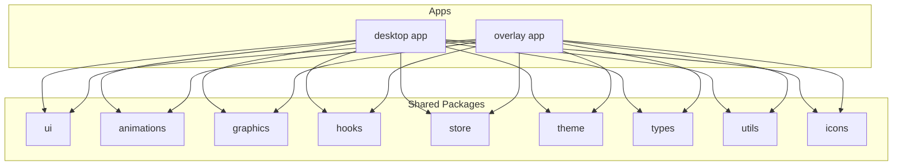
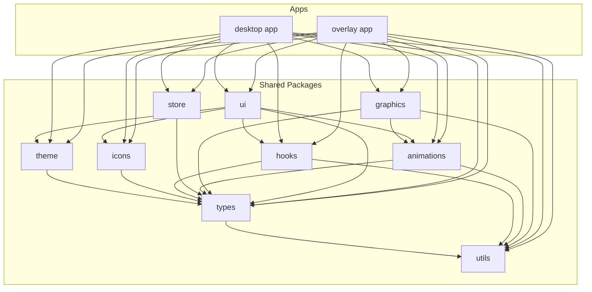
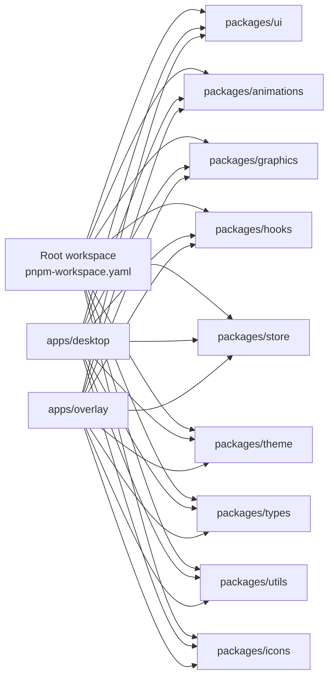

# Shared Packages Library

<cite>
**Referenced Files in This Document**
- [package.json](file://package.json)
- [pnpm-workspace.yaml](file://pnpm-workspace.yaml)
- [turbo.json](file://turbo.json)
- [tsconfig.base.json](file://tsconfig.base.json)
- [.prettierrc](file://.prettierrc)
- [apps/desktop/package.json](file://apps/desktop/package.json)
- [apps/overlay/package.json](file://apps/overlay/package.json)
- [apps/desktop/tsconfig.json](file://apps/desktop/tsconfig.json)
- [apps/overlay/tsconfig.json](file://apps/overlay/tsconfig.json)
- [packages/ui/package.json](file://packages/ui/package.json)
- [packages/animations/package.json](file://packages/animations/package.json)
- [packages/graphics/package.json](file://packages/graphics/package.json)
- [packages/hooks/package.json](file://packages/hooks/package.json)
- [packages/store/package.json](file://packages/store/package.json)
- [packages/theme/package.json](file://packages/theme/package.json)
- [packages/types/package.json](file://packages/types/package.json)
- [packages/utils/package.json](file://packages/utils/package.json)
- [packages/icons/package.json](file://packages/icons/package.json)
</cite>

## Table of Contents
1. [Introduction](#introduction)
2. [Project Structure](#project-structure)
3. [Core Components](#core-components)
4. [Architecture Overview](#architecture-overview)
5. [Detailed Component Analysis](#detailed-component-analysis)
6. [Dependency Analysis](#dependency-analysis)
7. [Performance Considerations](#performance-considerations)
8. [Troubleshooting Guide](#troubleshooting-guide)
9. [Conclusion](#conclusion)
10. [Appendices](#appendices)

## Introduction
This document describes the AR Sports shared packages library, a monorepo-based collection of reusable UI components, graphics and animation engines, centralized state management abstractions, theme system, custom React hooks, TypeScript type definitions, and common utilities. It explains how these packages are organized, versioned, and consumed by applications such as desktop and overlay apps. It also provides guidance on extending existing packages, creating new shared components, maintaining consistency, testing strategies, documentation standards, and contribution guidelines.

## Project Structure
The repository is a pnpm workspace with multiple apps and shared packages:
- Apps: desktop, overlay (and others) consume shared packages.
- Packages: ui, animations, graphics, hooks, store, theme, types, utils, icons.

Workspace configuration and tooling:
- Workspace definition and package manager settings are defined at the root.
- Build orchestration is configured for parallel tasks across packages and apps.
- Shared TypeScript base configuration ensures consistent compiler options.
- Code formatting rules are centralized via a shared Prettier config.

**Section sources**
- [pnpm-workspace.yaml](file://pnpm-workspace.yaml)
- [turbo.json](file://turbo.json)
- [tsconfig.base.json](file://tsconfig.base.json)
- [.prettierrc](file://.prettierrc)

## Core Components
This section outlines the responsibilities and boundaries of each shared package.

- ui: Reusable UI components with consistent styling and accessibility features. Designed to be consumed by apps without leaking internal implementation details.
- animations: Animation primitives and helpers used by UI and graphics layers.
- graphics: Canvas rendering engine and utilities for drawing overlays, charts, or game-like visuals.
- hooks: Custom React hooks encapsulating cross-cutting concerns (e.g., data fetching, media access, performance).
- store: Centralized state management abstractions and adapters for different backends.
- theme: Theme system providing tokens, color palettes, typography, and branding customization.
- types: Shared TypeScript type definitions and interfaces consumed across packages and apps.
- utils: Common utility functions (validation, formatting, math, etc.).
- icons: Icon assets and React icon components.

Consumption patterns:
- Apps import from package entry points rather than internal paths.
- Types are imported from the types package to ensure consistency.
- Themes are applied at the app level and consumed by UI components.

**Section sources**
- [packages/ui/package.json](file://packages/ui/package.json)
- [packages/animations/package.json](file://packages/animations/package.json)
- [packages/graphics/package.json](file://packages/graphics/package.json)
- [packages/hooks/package.json](file://packages/hooks/package.json)
- [packages/store/package.json](file://packages/store/package.json)
- [packages/theme/package.json](file://packages/theme/package.json)
- [packages/types/package.json](file://packages/types/package.json)
- [packages/utils/package.json](file://packages/utils/package.json)
- [packages/icons/package.json](file://packages/icons/package.json)

## Architecture Overview
High-level architecture shows how apps depend on shared packages and how packages may depend on one another.

**Diagram sources**
- [packages/ui/package.json](file://packages/ui/package.json)
- [packages/animations/package.json](file://packages/animations/package.json)
- [packages/graphics/package.json](file://packages/graphics/package.json)
- [packages/hooks/package.json](file://packages/hooks/package.json)
- [packages/store/package.json](file://packages/store/package.json)
- [packages/theme/package.json](file://packages/theme/package.json)
- [packages/types/package.json](file://packages/types/package.json)
- [packages/utils/package.json](file://packages/utils/package.json)
- [packages/icons/package.json](file://packages/icons/package.json)

## Detailed Component Analysis

### UI Package
Responsibilities:
- Provide accessible, themed, and styled components.
- Expose stable APIs for props, events, and variants.
- Integrate with theme tokens and icons.

Design principles:
- Composition over configuration.
- Accessibility-first defaults.
- Consistent naming and behavior across components.

Extending UI components:
- Create new components under the package’s component directory.
- Use shared theme tokens and icons.
- Export through the package entry point.

Testing strategy:
- Unit tests for component logic and prop validation.
- Visual regression tests for appearance.
- Accessibility audits using automated tools.

**Section sources**
- [packages/ui/package.json](file://packages/ui/package.json)

### Graphics and Animation Engines
Responsibilities:
- Graphics: Canvas rendering pipeline, drawing primitives, and performance optimizations.
- Animations: Easing functions, keyframe utilities, and animation controllers.

Integration:
- UI components can embed graphics canvases for overlays or live views.
- Animations drive transitions in UI and graphics layers.

Performance considerations:
- Batch draw calls and minimize layout thrashing.
- Use requestAnimationFrame for smooth updates.
- Debounce or throttle input-driven updates.

**Section sources**
- [packages/graphics/package.json](file://packages/graphics/package.json)
- [packages/animations/package.json](file://packages/animations/package.json)

### State Management Abstractions (Store)
Responsibilities:
- Define typed stores and actions.
- Provide adapters for different data sources.
- Ensure predictable state updates and debugging support.

Usage patterns:
- Apps subscribe to store slices.
- Actions dispatch mutations; selectors compute derived state.

**Section sources**
- [packages/store/package.json](file://packages/store/package.json)

### Theme System
Responsibilities:
- Centralize design tokens (colors, spacing, typography).
- Provide APIs to extend themes per brand or app context.
- Ensure consistent application of styles across UI components.

Customization:
- Override tokens at app level.
- Compose multiple themes if needed.

**Section sources**
- [packages/theme/package.json](file://packages/theme/package.json)

### Custom React Hooks
Responsibilities:
- Encapsulate side effects and reusable logic.
- Provide typed APIs aligned with store and utilities.

Examples:
- Data fetching hooks.
- Media device hooks.
- Performance monitoring hooks.

**Section sources**
- [packages/hooks/package.json](file://packages/hooks/package.json)

### TypeScript Type Definitions
Responsibilities:
- Centralize shared types and interfaces.
- Enforce consistency across packages and apps.

Best practices:
- Prefer explicit types over any.
- Use generics where appropriate.
- Keep types co-located with their usage when possible.

**Section sources**
- [packages/types/package.json](file://packages/types/package.json)

### Utilities
Responsibilities:
- Pure functions for validation, formatting, math, and string manipulation.
- No side effects; easy to test and reuse.

**Section sources**
- [packages/utils/package.json](file://packages/utils/package.json)

### Icons
Responsibilities:
- Provide SVG icons and React wrappers.
- Support theming and accessibility attributes.

**Section sources**
- [packages/icons/package.json](file://packages/icons/package.json)

## Dependency Analysis
Workspace and dependency management:
- The root defines the workspace and shared tooling.
- Each package declares its own dependencies and exports.
- Apps declare which shared packages they consume.

**Diagram sources**
- [pnpm-workspace.yaml](file://pnpm-workspace.yaml)
- [apps/desktop/package.json](file://apps/desktop/package.json)
- [apps/overlay/package.json](file://apps/overlay/package.json)
- [packages/ui/package.json](file://packages/ui/package.json)
- [packages/animations/package.json](file://packages/animations/package.json)
- [packages/graphics/package.json](file://packages/graphics/package.json)
- [packages/hooks/package.json](file://packages/hooks/package.json)
- [packages/store/package.json](file://packages/store/package.json)
- [packages/theme/package.json](file://packages/theme/package.json)
- [packages/types/package.json](file://packages/types/package.json)
- [packages/utils/package.json](file://packages/utils/package.json)
- [packages/icons/package.json](file://packages/icons/package.json)

Versioning strategy:
- Follow semantic versioning for all shared packages.
- Coordinate breaking changes across consumers via major versions.
- Maintain changelogs and release notes for transparency.

Consumption patterns:
- Pin package versions in app package manifests.
- Use workspace protocol for local development.
- Run build pipelines in parallel using the orchestrator.

**Section sources**
- [package.json](file://package.json)
- [pnpm-workspace.yaml](file://pnpm-workspace.yaml)
- [turbo.json](file://turbo.json)
- [apps/desktop/package.json](file://apps/desktop/package.json)
- [apps/overlay/package.json](file://apps/overlay/package.json)

## Performance Considerations
- Minimize bundle size by tree-shaking and avoiding heavy dependencies in shared packages.
- Defer non-critical imports and use dynamic loading where appropriate.
- Optimize canvas rendering by batching operations and reducing redraws.
- Leverage memoization in hooks and components to avoid unnecessary re-renders.
- Profile critical paths with browser devtools and Node profiling tools.

[No sources needed since this section provides general guidance]

## Troubleshooting Guide
Common issues and resolutions:
- Circular dependencies between packages: Refactor to break cycles by extracting shared types/utilities into lower-level packages.
- Version mismatches: Align package versions across apps and shared packages; run lockfile updates consistently.
- TypeScript errors due to missing types: Ensure types are exported from the types package and referenced correctly.
- Theming inconsistencies: Verify that theme tokens are applied at the app root and not overridden unintentionally.
- Canvas performance regressions: Check for excessive draw calls and memory leaks; profile frame times.

Build and linting:
- Use the shared Prettier configuration to maintain code style consistency.
- Validate TypeScript configurations with the shared base config.

**Section sources**
- [.prettierrc](file://.prettierrc)
- [tsconfig.base.json](file://tsconfig.base.json)

## Conclusion
The AR Sports shared packages library provides a cohesive set of UI, graphics, animation, state, theme, hooks, types, utilities, and icons designed for reuse across applications. By following the documented consumption patterns, versioning strategy, and contribution guidelines, teams can maintain consistency, improve productivity, and deliver high-quality experiences.

[No sources needed since this section summarizes without analyzing specific files]

## Appendices

### Extending Existing Packages
- Add new functionality under the relevant package directory.
- Update the package’s public API surface (exports) and types.
- Include tests and update documentation.
- Bump version according to semantic versioning and communicate changes to consumers.

### Creating New Shared Components
- Start with clear requirements and user stories.
- Design accessible defaults and keyboard navigation.
- Implement unit and visual tests.
- Document usage examples and integration steps.

### Maintaining Consistency Across the Codebase
- Adhere to shared TypeScript and Prettier configs.
- Use theme tokens and icon components consistently.
- Follow established naming conventions and folder structures.

### Testing Strategies
- Unit tests for pure functions and component logic.
- Integration tests for hooks and store interactions.
- Visual regression tests for UI components.
- Accessibility audits to ensure inclusive experiences.

### Documentation Standards
- Provide README sections for each package covering purpose, installation, usage, and examples.
- Keep API references up-to-date with type annotations.
- Include migration guides for breaking changes.

### Contribution Guidelines
- Follow the coding standards enforced by shared configs.
- Write meaningful commit messages and PR descriptions.
- Ensure CI passes locally before submitting changes.
- Review changes for performance, accessibility, and security implications.