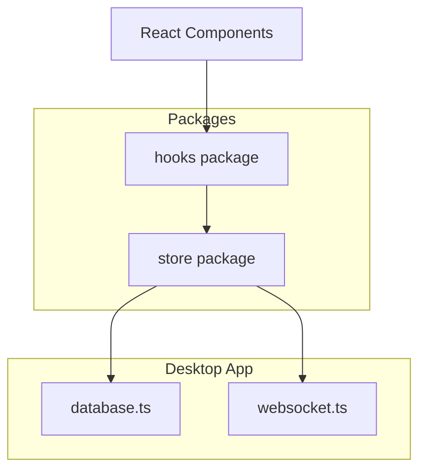
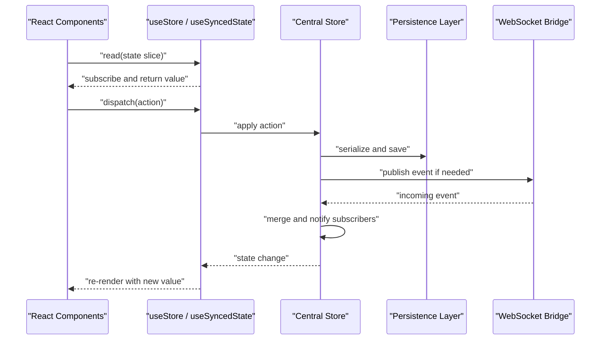
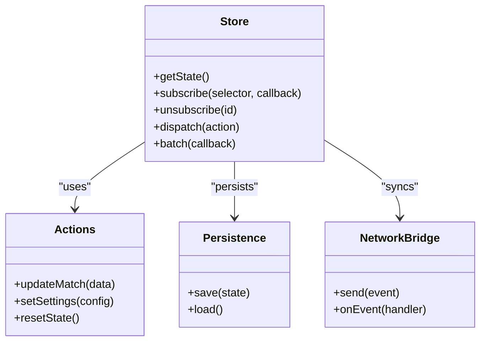
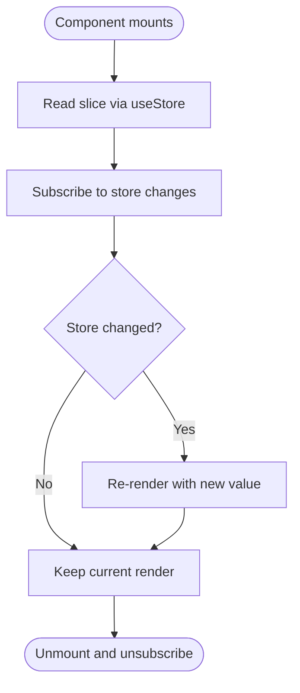
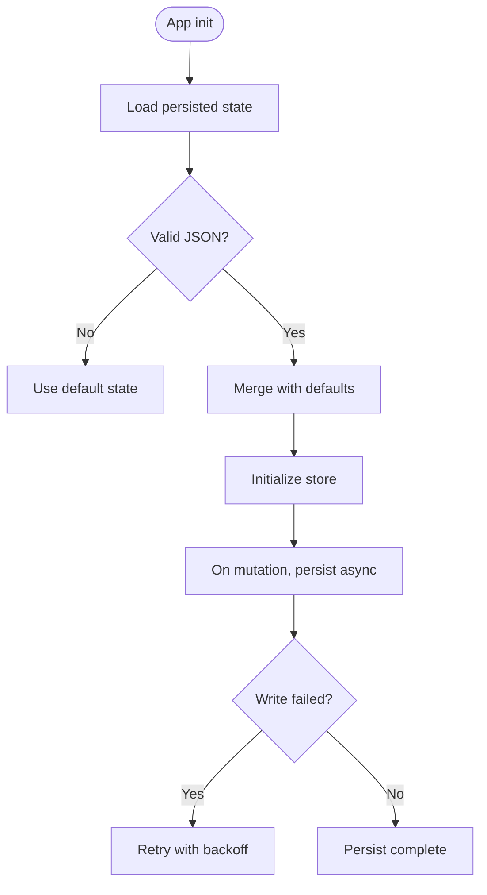
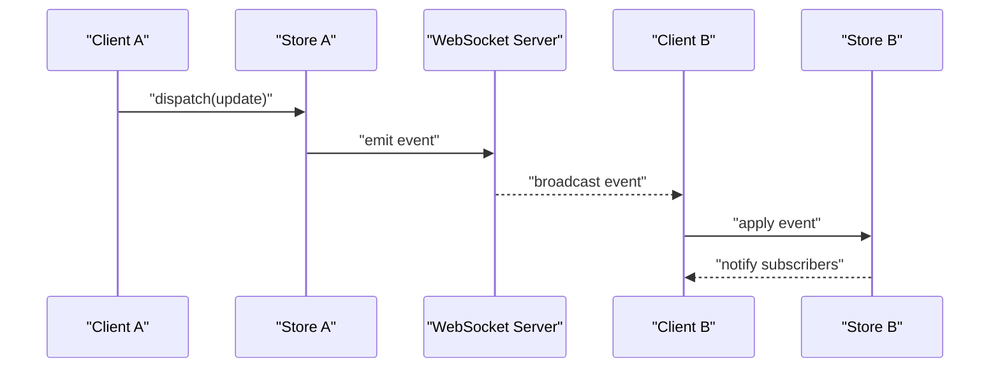
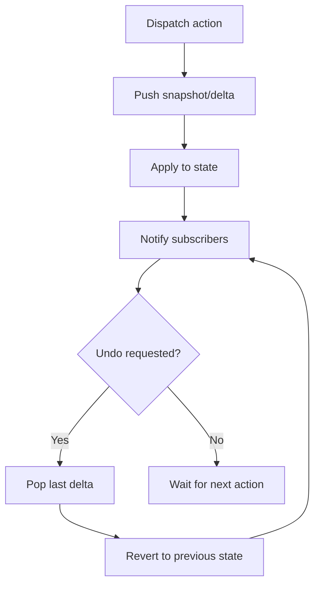
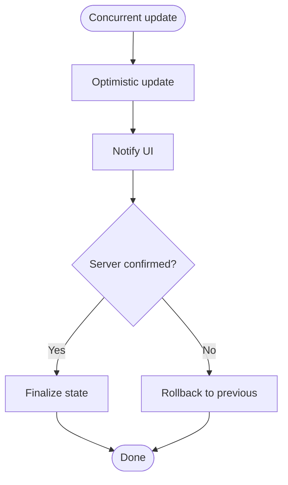
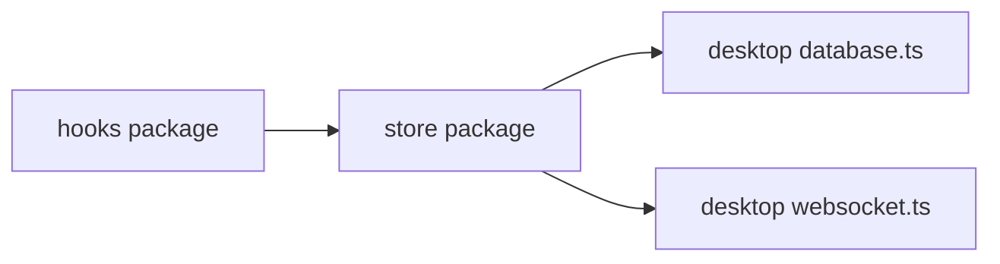

# State Management System

<cite>
**Referenced Files in This Document**
- [package.json](file://packages/store/package.json)
- [index.ts](file://packages/store/src/index.ts)
- [createStore.ts](file://packages/store/src/createStore.ts)
- [useStore.ts](file://packages/hooks/src/useStore.ts)
- [useSyncedState.ts](file://packages/hooks/src/useSyncedState.ts)
- [database.ts](file://apps/desktop/src/main/database.ts)
- [websocket.ts](file://apps/desktop/src/main/websocket.ts)
</cite>

## Table of Contents
1. [Introduction](#introduction)
2. [Project Structure](#project-structure)
3. [Core Components](#core-components)
4. [Architecture Overview](#architecture-overview)
5. [Detailed Component Analysis](#detailed-component-analysis)
6. [Dependency Analysis](#dependency-analysis)
7. [Performance Considerations](#performance-considerations)
8. [Troubleshooting Guide](#troubleshooting-guide)
9. [Conclusion](#conclusion)
10. [Appendices](#appendices)

## Introduction
This document explains the centralized state management system and custom React hooks used across the application. It covers store architecture, data flow patterns, persistence strategies, real-time synchronization mechanisms, hook implementations for common state operations, performance optimization techniques, debugging tools, examples for complex state scenarios (including undo/redo and concurrent updates), testing strategies, and integration with external data sources.

## Project Structure
The state management system is organized into a monorepo with dedicated packages:
- Store package: defines the central store and core primitives
- Hooks package: provides React hooks to consume and interact with the store
- Desktop app: integrates persistence and real-time sync via main-process modules

[No sources needed since this diagram shows conceptual workflow, not actual code structure]

## Core Components
- Centralized store: single source of truth for application state, exposing actions and selectors
- React hooks: typed accessors and dispatchers that subscribe efficiently to store slices
- Persistence layer: serializes store state to disk and restores it on startup
- Real-time synchronization: bridges WebSocket events to store updates and vice versa

Key responsibilities:
- Encapsulate state mutations behind well-defined actions
- Provide fine-grained subscriptions to avoid unnecessary re-renders
- Persist state safely and recover from failures
- Synchronize state across processes or devices using WebSockets

**Section sources**
- [index.ts](file://packages/store/src/index.ts)
- [createStore.ts](file://packages/store/src/createStore.ts)
- [useStore.ts](file://packages/hooks/src/useStore.ts)
- [useSyncedState.ts](file://packages/hooks/src/useSyncedState.ts)
- [database.ts](file://apps/desktop/src/main/database.ts)
- [websocket.ts](file://apps/desktop/src/main/websocket.ts)

## Architecture Overview
The system follows a unidirectional data flow:
- UI components call hooks to read state and dispatch actions
- The store validates and applies changes atomically
- Side effects (persistence, network) are triggered by store actions
- Real-time events update the store, which propagates changes back to the UI

**Diagram sources**
- [createStore.ts](file://packages/store/src/createStore.ts)
- [useStore.ts](file://packages/hooks/src/useStore.ts)
- [useSyncedState.ts](file://packages/hooks/src/useSyncedState.ts)
- [database.ts](file://apps/desktop/src/main/database.ts)
- [websocket.ts](file://apps/desktop/src/main/websocket.ts)

## Detailed Component Analysis

### Store Implementation
Responsibilities:
- Define initial state and action handlers
- Maintain subscription registry for efficient updates
- Expose getters and setters with type safety
- Coordinate side effects like persistence and networking

Design considerations:
- Atomic updates to prevent partial state writes
- Batched notifications to reduce re-renders
- Clear separation between pure state logic and side effects

**Diagram sources**
- [createStore.ts](file://packages/store/src/createStore.ts)
- [index.ts](file://packages/store/src/index.ts)

**Section sources**
- [createStore.ts](file://packages/store/src/createStore.ts)
- [index.ts](file://packages/store/src/index.ts)

### React Hooks
- useStore: subscribes to specific state slices and returns memoized values; exposes dispatch helpers
- useSyncedState: binds local component state to the store with automatic persistence and conflict resolution

Implementation highlights:
- Fine-grained subscriptions to minimize re-renders
- Stable references for dispatch functions
- Automatic cleanup of listeners
- Optional debouncing/throttling for high-frequency updates

**Diagram sources**
- [useStore.ts](file://packages/hooks/src/useStore.ts)
- [useSyncedState.ts](file://packages/hooks/src/useSyncedState.ts)

**Section sources**
- [useStore.ts](file://packages/hooks/src/useStore.ts)
- [useSyncedState.ts](file://packages/hooks/src/useSyncedState.ts)

### Persistence Strategy
Goals:
- Ensure state survives process restarts
- Avoid blocking UI during I/O
- Handle corruption and partial writes gracefully

Approach:
- Serialize store state to a safe format
- Write asynchronously with error handling
- On startup, load persisted state and merge with defaults
- Provide migration utilities when schema evolves

**Diagram sources**
- [database.ts](file://apps/desktop/src/main/database.ts)

**Section sources**
- [database.ts](file://apps/desktop/src/main/database.ts)

### Real-Time Synchronization
Objectives:
- Keep multiple clients or processes in sync
- Resolve conflicts deterministically
- Minimize bandwidth and latency impact

Mechanism:
- Emit structured events from store actions
- Listen for incoming events and apply them idempotently
- Use versioning or timestamps to resolve conflicts
- Debounce outgoing events to coalesce rapid changes

**Diagram sources**
- [websocket.ts](file://apps/desktop/src/main/websocket.ts)
- [createStore.ts](file://packages/store/src/createStore.ts)

**Section sources**
- [websocket.ts](file://apps/desktop/src/main/websocket.ts)

### Complex State Patterns

#### Undo/Redo
- Maintain an operation stack with snapshots or deltas
- Limit history size to control memory usage
- Provide commands to step backward/forward
- Integrate with persistence to keep history consistent

[No sources needed since this diagram shows conceptual workflow, not actual code structure]

#### Concurrent Updates
- Coalesce frequent updates using batching
- Use optimistic updates with rollback on failure
- Apply server-provided authoritative state after confirmation
- Prevent race conditions with sequence numbers or timestamps

[No sources needed since this diagram shows conceptual workflow, not actual code structure]

## Dependency Analysis
The store depends on persistence and networking modules, while hooks depend on the store API. The desktop app wires these together.

**Diagram sources**
- [useStore.ts](file://packages/hooks/src/useStore.ts)
- [createStore.ts](file://packages/store/src/createStore.ts)
- [database.ts](file://apps/desktop/src/main/database.ts)
- [websocket.ts](file://apps/desktop/src/main/websocket.ts)

**Section sources**
- [package.json](file://packages/store/package.json)
- [useStore.ts](file://packages/hooks/src/useStore.ts)
- [createStore.ts](file://packages/store/src/createStore.ts)
- [database.ts](file://apps/desktop/src/main/database.ts)
- [websocket.ts](file://apps/desktop/src/main/websocket.ts)

## Performance Considerations
- Prefer selector-based subscriptions to limit re-renders
- Memoize derived data and stable dispatch references
- Batch multiple updates to reduce notification overhead
- Debounce high-frequency events before persistence or network emission
- Use immutable updates to enable fast equality checks
- Profile large state trees and split into focused slices

[No sources needed since this section provides general guidance]

## Troubleshooting Guide
Common issues and resolutions:
- Stale state in UI: ensure correct selector usage and stable references
- Missing persistence: verify write permissions and handle parse errors
- Sync conflicts: check event ordering and implement deterministic merges
- Memory growth: cap history size and clear unused subscriptions
- Network failures: implement retries and fallback states

Debugging tips:
- Log action payloads and resulting state diffs
- Add time-travel capabilities for undo/redo inspection
- Instrument WebSocket messages to trace sync flows
- Use development-only middleware to capture store snapshots

**Section sources**
- [useStore.ts](file://packages/hooks/src/useStore.ts)
- [useSyncedState.ts](file://packages/hooks/src/useSyncedState.ts)
- [database.ts](file://apps/desktop/src/main/database.ts)
- [websocket.ts](file://apps/desktop/src/main/websocket.ts)

## Conclusion
The centralized state management system provides a robust foundation for predictable state updates, efficient UI rendering, reliable persistence, and real-time synchronization. By following the patterns outlined here—atomic actions, fine-grained subscriptions, safe persistence, and deterministic sync—you can build scalable applications that remain responsive and maintainable.

## Appendices

### Testing Strategies
- Unit test actions and reducers in isolation
- Mock persistence and network layers for deterministic tests
- Assert store state transitions and subscriber notifications
- Simulate concurrent updates and conflict scenarios
- Validate undo/redo sequences and history limits

### Integration with External Data Sources
- Wrap external APIs in actions that emit normalized events
- Cache responses in the store with invalidation strategies
- Handle offline-first behavior with queued mutations
- Ensure idempotent operations to support retries and sync

[No sources needed since this section provides general guidance]