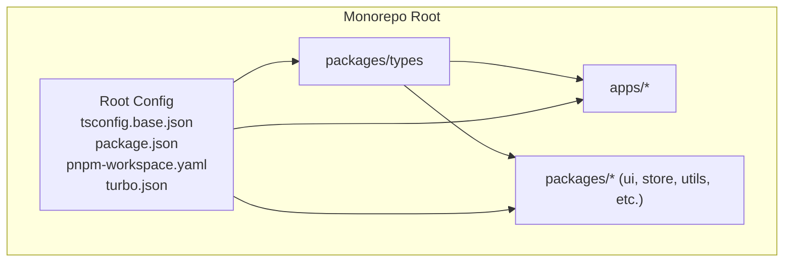
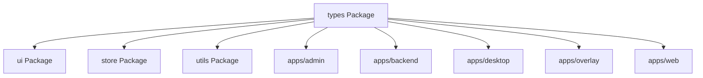
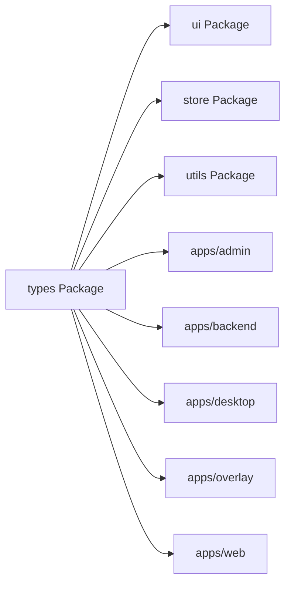

# TypeScript Type Definitions

<cite>
**Referenced Files in This Document**
- [tsconfig.base.json](file://tsconfig.base.json)
- [package.json](file://package.json)
- [pnpm-workspace.yaml](file://pnpm-workspace.yaml)
- [turbo.json](file://turbo.json)
</cite>

## Table of Contents
1. [Introduction](#introduction)
2. [Project Structure](#project-structure)
3. [Core Components](#core-components)
4. [Architecture Overview](#architecture-overview)
5. [Detailed Component Analysis](#detailed-component-analysis)
6. [Dependency Analysis](#dependency-analysis)
7. [Performance Considerations](#performance-considerations)
8. [Troubleshooting Guide](#troubleshooting-guide)
9. [Conclusion](#conclusion)
10. [Appendices](#appendices)

## Introduction
This document describes the shared TypeScript type definitions used across all applications in the AR Sports monorepo. It focuses on core domain models, interface contracts, utility types, and generic patterns that ensure type safety and consistency between packages and apps. It also explains strategies for conditional types, advanced TypeScript features, extending existing types, creating new domain models, maintaining cross-package consistency, testing types, and migrating type updates safely.

## Project Structure
The repository is a pnpm-based monorepo with multiple apps and shared packages. The shared type definitions are centralized under the packages/types directory and consumed by apps (admin, backend, desktop, overlay, web) and other packages (animations, graphics, hooks, icons, store, theme, ui, utils).

**Diagram sources**
- [tsconfig.base.json](file://tsconfig.base.json)
- [package.json](file://package.json)
- [pnpm-workspace.yaml](file://pnpm-workspace.yaml)
- [turbo.json](file://turbo.json)

**Section sources**
- [tsconfig.base.json](file://tsconfig.base.json)
- [package.json](file://package.json)
- [pnpm-workspace.yaml](file://pnpm-workspace.yaml)
- [turbo.json](file://turbo.json)

## Core Components
This section outlines the foundational elements of the shared type system:

- Centralized type package: A dedicated package exposes domain models, interfaces, and utility types for reuse across apps and packages.
- Shared configuration: Root-level tsconfig settings enforce consistent compiler options across the workspace.
- Workspace integration: The workspace manifest defines how packages and apps depend on each other, including the types package.
- Build orchestration: The task runner config ensures consistent builds and type checks across packages.

Key responsibilities:
- Define canonical domain models (e.g., entities, enums, DTOs).
- Provide reusable utility types (e.g., optionality helpers, discriminated unions, branded types).
- Establish interface contracts for inter-app communication (e.g., API payloads, event shapes).
- Enforce strictness via root tsconfig to prevent accidental any usage and ensure uniform behavior.

**Section sources**
- [tsconfig.base.json](file://tsconfig.base.json)
- [package.json](file://package.json)
- [pnpm-workspace.yaml](file://pnpm-workspace.yaml)
- [turbo.json](file://turbo.json)

## Architecture Overview
The type architecture follows a hub-and-spoke model where the types package acts as the single source of truth for shared types. Apps and other packages import from this package rather than duplicating definitions.

[No sources needed since this diagram shows conceptual workflow, not actual code structure]

## Detailed Component Analysis

### Domain Models
Domain models represent core entities such as matches, teams, players, and events. They should be defined once in the types package and imported everywhere else.

Guidelines:
- Prefer explicit interfaces or readonly types for immutable data.
- Use discriminated unions for stateful entities (e.g., loading/success/error variants).
- Keep field names stable; prefer adding optional fields over renaming.

Extending existing models:
- Create derived types using intersection or mapped types when you need app-specific extensions without altering the base model.

Creating new models:
- Start from existing primitives and compose them into higher-level types.
- Validate at runtime with a schema library if necessary, but keep the TS types authoritative.

**Section sources**
- [tsconfig.base.json](file://tsconfig.base.json)
- [package.json](file://package.json)
- [pnpm-workspace.yaml](file://pnpm-workspace.yaml)
- [turbo.json](file://turbo.json)

### Interface Contracts
Interface contracts define the shape of data exchanged between services, stores, and UI layers.

Best practices:
- Separate request/response types from internal state types.
- Use branded types for IDs and tokens to avoid accidental misuse.
- Prefer exhaustive checks with discriminated unions to catch missing cases.

Examples of contract areas:
- API payloads and headers
- WebSocket messages and events
- Configuration objects passed between packages

**Section sources**
- [tsconfig.base.json](file://tsconfig.base.json)
- [package.json](file://package.json)
- [pnpm-workspace.yaml](file://pnpm-workspace.yaml)
- [turbo.json](file://turbo.json)

### Utility Types and Generic Patterns
Utility types encapsulate common transformations and constraints:

- Optionality helpers: Make fields required/optional conditionally.
- Partial/DeepPartial: For nested configuration objects.
- Pick/Omit: For slicing entity shapes.
- Branded types: For safe IDs, currencies, and units.
- Discriminated unions: For variant-rich data (e.g., result types).
- Conditional types: To branch based on input types.

Generic patterns:
- Repository-style generics for typed collections.
- Event emitter patterns with typed payloads.
- Factory functions returning strongly-typed instances.

**Section sources**
- [tsconfig.base.json](file://tsconfig.base.json)
- [package.json](file://package.json)
- [pnpm-workspace.yaml](file://pnpm-workspace.yaml)
- [turbo.json](file://turbo.json)

### Advanced TypeScript Features
Leverage advanced features to improve safety and ergonomics:

- Template literal types for constrained strings (e.g., route segments, status codes).
- Key remapping in mapped types to normalize keys.
- Extract/Exclude/Parameters/ReturnType for deriving types from existing ones.
- const assertions for literal inference in configs and fixtures.
- Index signatures only when necessary; prefer explicit keys.

**Section sources**
- [tsconfig.base.json](file://tsconfig.base.json)
- [package.json](file://package.json)
- [pnpm-workspace.yaml](file://pnpm-workspace.yaml)
- [turbo.json](file://turbo.json)

### Type Safety Strategies
Enforce strong typing across the workspace:

- Enable strict mode in root tsconfig to catch unsafe patterns early.
- Avoid any; use unknown for untyped inputs and narrow explicitly.
- Prefer readonly properties for immutable data.
- Use exhaustive switch statements with never checks to detect missing branches.
- Centralize error types and result wrappers to standardize handling.

**Section sources**
- [tsconfig.base.json](file://tsconfig.base.json)
- [package.json](file://package.json)
- [pnpm-workspace.yaml](file://pnpm-workspace.yaml)
- [turbo.json](file://turbo.json)

### Maintaining Consistency Across Packages
- Export only public APIs from the types package; keep internals private.
- Version types coherently with consumers; bump major versions for breaking changes.
- Use workspace protocols to reference local packages consistently.
- Add lint rules to prevent importing non-public symbols.

**Section sources**
- [tsconfig.base.json](file://tsconfig.base.json)
- [package.json](file://package.json)
- [pnpm-workspace.yaml](file://pnpm-workspace.yaml)
- [turbo.json](file://turbo.json)

### Type Testing Strategies
Adopt tests to validate type contracts and guard against regressions:

- Compile-only tests: Ensure expected types compile and invalid usages fail.
- Exhaustiveness tests: Assert never branches are unreachable.
- Snapshot-like expectations: Use helper functions to assert inferred types.
- CI enforcement: Run type checks and tests on pull requests.

**Section sources**
- [tsconfig.base.json](file://tsconfig.base.json)
- [package.json](file://package.json)
- [pnpm-workspace.yaml](file://pnpm-workspace.yaml)
- [turbo.json](file://turbo.json)

### Migration Guides for Type Updates
When evolving shared types:

- Plan breaking changes carefully; provide migration notes and codemods if possible.
- Introduce deprecations gradually; mark old types as deprecated before removal.
- Update consumers incrementally; leverage IDE hints and incremental builds.
- Verify with full workspace type checks and tests before publishing.

**Section sources**
- [tsconfig.base.json](file://tsconfig.base.json)
- [package.json](file://package.json)
- [pnpm-workspace.yaml](file://pnpm-workspace.yaml)
- [turbo.json](file://turbo.json)

## Dependency Analysis
The types package is a dependency for both apps and other packages. The workspace manifest and build tooling coordinate these relationships.

**Diagram sources**
- [pnpm-workspace.yaml](file://pnpm-workspace.yaml)
- [package.json](file://package.json)

**Section sources**
- [pnpm-workspace.yaml](file://pnpm-workspace.yaml)
- [package.json](file://package.json)

## Performance Considerations
- Minimize circular dependencies between packages to speed up type checking.
- Prefer precise imports and avoid re-exporting large modules unnecessarily.
- Leverage incremental builds and caching configured by the task runner.
- Keep type computations simple; heavy conditional types can slow down the compiler.

[No sources needed since this section provides general guidance]

## Troubleshooting Guide
Common issues and resolutions:

- Circular dependency errors: Break cycles by extracting shared types into the types package and ensuring one-way dependencies.
- Incompatible versions: Align package versions across the workspace and run a clean install.
- Strict mode violations: Fix implicit any, unused variables, and unsafe casts surfaced by the compiler.
- Slow type checks: Reduce unnecessary re-exports and simplify complex conditional types.

**Section sources**
- [tsconfig.base.json](file://tsconfig.base.json)
- [package.json](file://package.json)
- [pnpm-workspace.yaml](file://pnpm-workspace.yaml)
- [turbo.json](file://turbo.json)

## Conclusion
A well-structured shared type system improves developer experience, reduces bugs, and accelerates iteration across the monorepo. By centralizing domain models, enforcing strictness, and adopting robust testing and migration practices, the team can maintain high-quality type contracts that scale with the product.

[No sources needed since this section summarizes without analyzing specific files]

## Appendices

### Appendix A: Example Workflows

#### Extending an Existing Type
- Derive a new type by intersecting the base model with additional fields.
- Use utility types to adjust optionality or key sets.

#### Creating a New Domain Model
- Define the base shape with explicit fields.
- Compose it into larger structures (lists, maps, results).
- Add validation helpers if needed.

#### Maintaining Cross-Package Consistency
- Publish a new version of the types package.
- Update consumer packages to the new version.
- Run workspace-wide type checks and tests.

[No sources needed since this section doesn't analyze specific files]