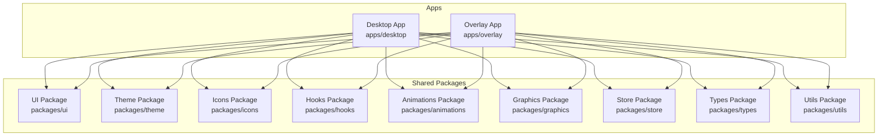
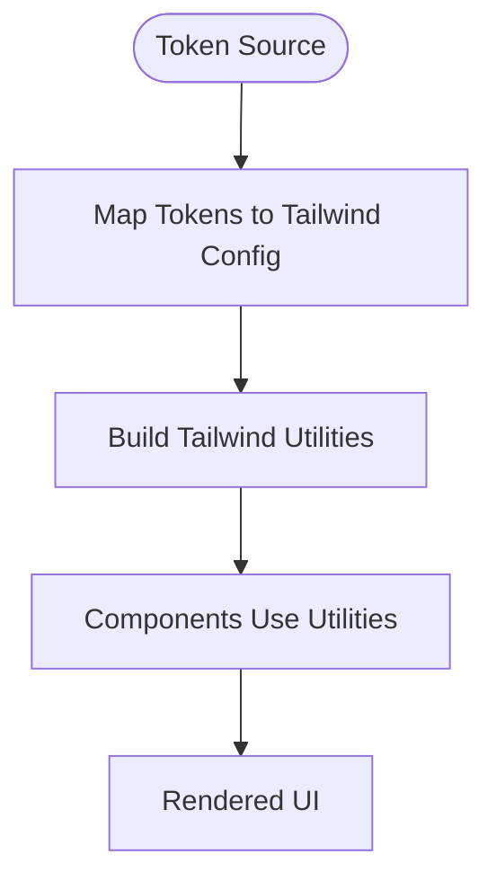
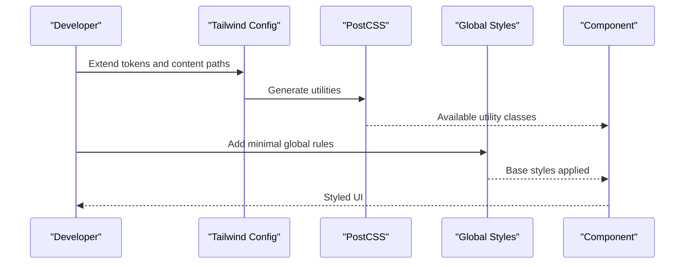
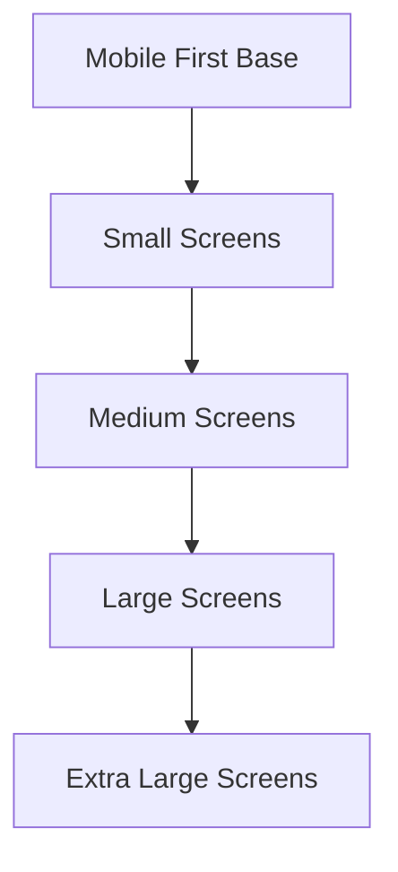
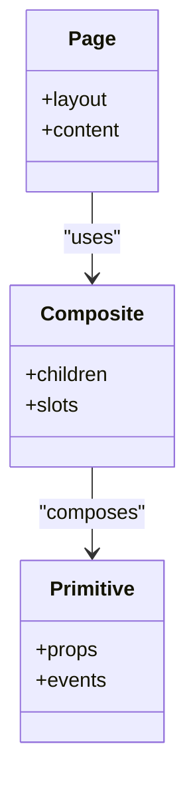
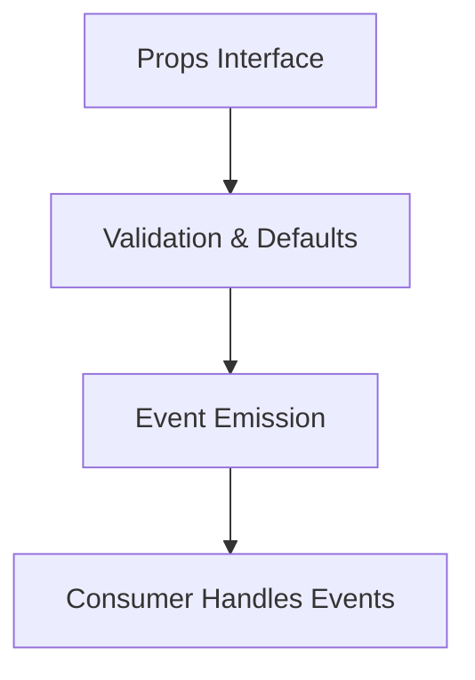
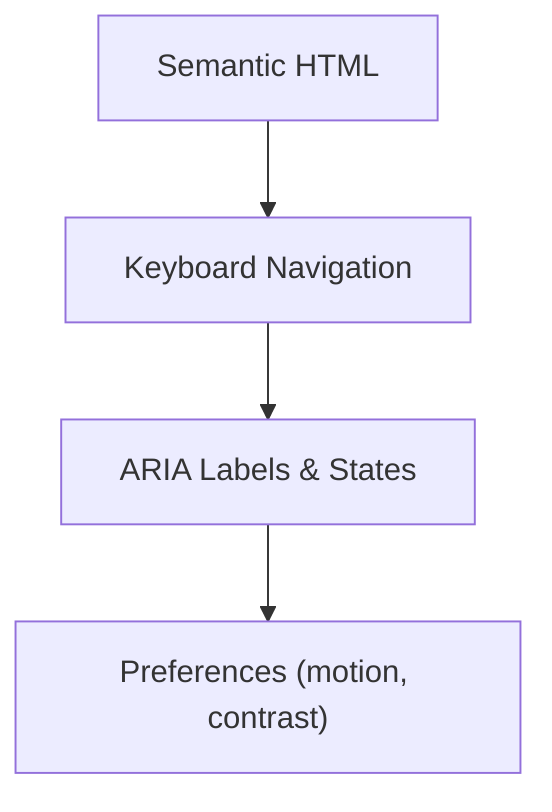
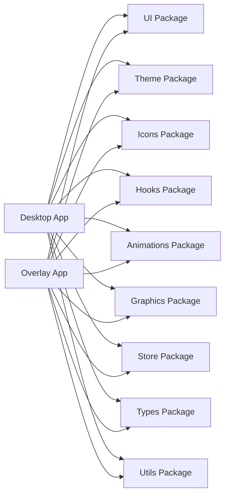

# Component Fundamentals

<cite>
**Referenced Files in This Document**
- [package.json](file://package.json)
- [pnpm-workspace.yaml](file://pnpm-workspace.yaml)
- [turbo.json](file://turbo.json)
- [tsconfig.base.json](file://tsconfig.base.json)
- [apps/desktop/tailwind.config.js](file://apps/desktop/tailwind.config.js)
- [apps/overlay/tailwind.config.js](file://apps/overlay/tailwind.config.js)
- [apps/desktop/postcss.config.js](file://apps/desktop/postcss.config.js)
- [apps/overlay/postcss.config.js](file://apps/overlay/postcss.config.js)
- [apps/desktop/src/app/globals.css](file://apps/desktop/src/app/globals.css)
- [apps/overlay/src/app/globals.css](file://apps/overlay/src/app/globals.css)
- [apps/desktop/src/app/layout.tsx](file://apps/desktop/src/app/layout.tsx)
- [apps/overlay/src/app/layout.tsx](file://apps/overlay/src/app/layout.tsx)
- [packages/ui/package.json](file://packages/ui/package.json)
- [packages/theme/package.json](file://packages/theme/package.json)
- [packages/icons/package.json](file://packages/icons/package.json)
- [packages/hooks/package.json](file://packages/hooks/package.json)
- [packages/animations/package.json](file://packages/animations/package.json)
- [packages/graphics/package.json](file://packages/graphics/package.json)
- [packages/store/package.json](file://packages/store/package.json)
- [packages/types/package.json](file://packages/types/package.json)
- [packages/utils/package.json](file://packages/utils/package.json)
</cite>

## Table of Contents
1. [Introduction](#introduction)
2. [Project Structure](#project-structure)
3. [Core Components](#core-components)
4. [Architecture Overview](#architecture-overview)
5. [Detailed Component Analysis](#detailed-component-analysis)
6. [Dependency Analysis](#dependency-analysis)
7. [Performance Considerations](#performance-considerations)
8. [Troubleshooting Guide](#troubleshooting-guide)
9. [Conclusion](#conclusion)
10. [Appendices](#appendices)

## Introduction
This document defines the fundamentals for building UI components across the workspace. It focuses on design system principles, component architecture patterns, composition model, prop interfaces, event handling, accessibility standards, theme integration, styling with Tailwind CSS, responsive design, and best practices for maintainable code. The guidance is grounded in the repository’s multi-app and multi-package structure, including shared packages for UI, theme, icons, hooks, animations, graphics, store, types, and utilities.

## Project Structure
The repository uses a monorepo layout with multiple apps (desktop, overlay, admin, backend, web) and shared packages under packages/. Apps consume shared packages to build consistent UI experiences. Styling is configured per app using Tailwind CSS and PostCSS. Global styles are defined at the app level.

**Diagram sources**
- [pnpm-workspace.yaml](file://pnpm-workspace.yaml)
- [turbo.json](file://turbo.json)
- [apps/desktop/tailwind.config.js](file://apps/desktop/tailwind.config.js)
- [apps/overlay/tailwind.config.js](file://apps/overlay/tailwind.config.js)

**Section sources**
- [package.json](file://package.json)
- [pnpm-workspace.yaml](file://pnpm-workspace.yaml)
- [turbo.json](file://turbo.json)
- [tsconfig.base.json](file://tsconfig.base.json)

## Core Components
This section outlines the foundational concepts that guide all UI components in the workspace:

- Composition Model
  - Favor small, focused primitives over large monolithic components.
  - Compose complex UI by combining primitives through children, slots, or render props.
  - Keep side effects out of presentational components; isolate them in hooks or services.

- Prop Interfaces
  - Define explicit TypeScript interfaces for props.
  - Provide sensible defaults and derive values when possible.
  - Use discriminated unions for variant-based props.
  - Prefer boolean flags for simple toggles and enums for constrained sets.

- Event Handling Patterns
  - Expose stable event names and typed payloads.
  - Avoid leaking internal state via events; emit normalized data.
  - Coalesce rapid events where appropriate and debounce/throttle as needed.

- Accessibility Standards
  - Ensure semantic HTML and keyboard navigation.
  - Provide accessible labels, roles, and states.
  - Respect reduced motion preferences and high contrast modes.

- Theme Integration
  - Centralize tokens (colors, spacing, typography, radii, shadows) in the theme package.
  - Map tokens to Tailwind configuration for consistent usage across apps.
  - Allow runtime overrides only when necessary and documented.

- Styling with Tailwind CSS
  - Use utility classes for layout and presentation.
  - Encapsulate reusable style logic in components or custom utilities.
  - Keep global styles minimal; prefer scoped or component-level styles.

- Responsive Design Patterns
  - Design mobile-first and scale up with breakpoints.
  - Use fluid spacing and typography where appropriate.
  - Test critical flows at common viewport sizes.

[No sources needed since this section provides general guidance]

## Architecture Overview
The UI layer is composed of shared packages consumed by each app. Apps configure Tailwind and PostCSS, define global styles, and compose pages from shared components.

```mermaid
graph TB
subgraph "App Layer"
DL["Desktop Layout<br/>apps/desktop/src/app/layout.tsx"]
OL["Overlay Layout<br/>apps/overlay/src/app/layout.tsx"]
DG["Desktop Globals<br/>apps/desktop/src/app/globals.css"]
OG["Overlay Globals<br/>apps/overlay/src/app/globals.css"]
end
subgraph "Styling Config"
DTW["Desktop Tailwind<br/>apps/desktop/tailwind.config.js"]
OTW["Overlay Tailwind<br/>apps/overlay/tailwind.config.js"]
DPC["Desktop PostCSS<br/>apps/desktop/postcss.config.js"]
OPC["Overlay PostCSS<br/>apps/overlay/postcss.config.js"]
end
subgraph "Shared Packages"
U["UI Package<br/>packages/ui"]
T["Theme Package<br/>packages/theme"]
I["Icons Package<br/>packages/icons"]
H["Hooks Package<br/>packages/hooks"]
A["Animations Package<br/>packages/animations"]
G["Graphics Package<br/>packages/graphics"]
S["Store Package<br/>packages/store"]
Ty["Types Package<br/>packages/types"]
Ut["Utils Package<br/>packages/utils"]
end
DL --> U
OL --> U
DL --> T
OL --> T
DL --> I
OL --> I
DL --> H
OL --> H
DL --> A
OL --> A
DL --> G
OL --> G
DL --> S
OL --> S
DL --> Ty
OL --> Ty
DL --> Ut
OL --> Ut
DL --> DTW
OL --> OTW
DL --> DPC
OL --> OPC
DL --> DG
OL --> OG
```

**Diagram sources**
- [apps/desktop/src/app/layout.tsx](file://apps/desktop/src/app/layout.tsx)
- [apps/overlay/src/app/layout.tsx](file://apps/overlay/src/app/layout.tsx)
- [apps/desktop/src/app/globals.css](file://apps/desktop/src/app/globals.css)
- [apps/overlay/src/app/globals.css](file://apps/overlay/src/app/globals.css)
- [apps/desktop/tailwind.config.js](file://apps/desktop/tailwind.config.js)
- [apps/overlay/tailwind.config.js](file://apps/overlay/tailwind.config.js)
- [apps/desktop/postcss.config.js](file://apps/desktop/postcss.config.js)
- [apps/overlay/postcss.config.js](file://apps/overlay/postcss.config.js)
- [packages/ui/package.json](file://packages/ui/package.json)
- [packages/theme/package.json](file://packages/theme/package.json)
- [packages/icons/package.json](file://packages/icons/package.json)
- [packages/hooks/package.json](file://packages/hooks/package.json)
- [packages/animations/package.json](file://packages/animations/package.json)
- [packages/graphics/package.json](file://packages/graphics/package.json)
- [packages/store/package.json](file://packages/store/package.json)
- [packages/types/package.json](file://packages/types/package.json)
- [packages/utils/package.json](file://packages/utils/package.json)

## Detailed Component Analysis

### Theme Integration System
- Centralize design tokens in the theme package and expose them to Tailwind via its configuration in each app.
- Maintain a single source of truth for colors, spacing, typography, radii, and shadows.
- Provide helpers or utilities to map tokens to class names or CSS variables when needed.

**Diagram sources**
- [packages/theme/package.json](file://packages/theme/package.json)
- [apps/desktop/tailwind.config.js](file://apps/desktop/tailwind.config.js)
- [apps/overlay/tailwind.config.js](file://apps/overlay/tailwind.config.js)

**Section sources**
- [packages/theme/package.json](file://packages/theme/package.json)
- [apps/desktop/tailwind.config.js](file://apps/desktop/tailwind.config.js)
- [apps/overlay/tailwind.config.js](file://apps/overlay/tailwind.config.js)

### Styling Approaches Using Tailwind CSS
- Configure Tailwind per app to include shared content paths and extend tokens.
- Use PostCSS to process styles consistently across apps.
- Keep global styles minimal and scoped; prefer component-level utilities.

**Diagram sources**
- [apps/desktop/tailwind.config.js](file://apps/desktop/tailwind.config.js)
- [apps/overlay/tailwind.config.js](file://apps/overlay/tailwind.config.js)
- [apps/desktop/postcss.config.js](file://apps/desktop/postcss.config.js)
- [apps/overlay/postcss.config.js](file://apps/overlay/postcss.config.js)
- [apps/desktop/src/app/globals.css](file://apps/desktop/src/app/globals.css)
- [apps/overlay/src/app/globals.css](file://apps/overlay/src/app/globals.css)

**Section sources**
- [apps/desktop/tailwind.config.js](file://apps/desktop/tailwind.config.js)
- [apps/overlay/tailwind.config.js](file://apps/overlay/tailwind.config.js)
- [apps/desktop/postcss.config.js](file://apps/desktop/postcss.config.js)
- [apps/overlay/postcss.config.js](file://apps/overlay/postcss.config.js)
- [apps/desktop/src/app/globals.css](file://apps/desktop/src/app/globals.css)
- [apps/overlay/src/app/globals.css](file://apps/overlay/src/app/globals.css)

### Responsive Design Patterns
- Adopt a mobile-first approach and progressively enhance layouts.
- Use consistent breakpoints aligned with token definitions.
- Validate critical flows across viewport sizes and device orientations.

[No sources needed since this diagram shows conceptual workflow, not actual code structure]

### Component Composition Model
- Build primitives (e.g., Button, Input, Card) with clear responsibilities.
- Compose higher-level components by combining primitives.
- Use children and optional slot props to keep APIs flexible.

[No sources needed since this diagram shows conceptual workflow, not actual code structure]

### Prop Interfaces and Event Handling
- Define strict TypeScript interfaces for props and events.
- Normalize event payloads and avoid exposing internal implementation details.
- Provide default behaviors and allow overrides via props.

[No sources needed since this diagram shows conceptual workflow, not actual code structure]

### Accessibility Standards
- Enforce semantic markup and keyboard support.
- Provide accessible labels, roles, and states.
- Honor user preferences such as reduced motion and high contrast.

[No sources needed since this diagram shows conceptual workflow, not actual code structure]

### Naming Conventions and Best Practices
- Use descriptive, domain-aligned names for components and files.
- Keep one component per file and colocate related assets.
- Prefer composition over inheritance and avoid deep nesting.

[No sources needed since this section provides general guidance]

## Dependency Analysis
The apps depend on shared packages for UI, theme, icons, hooks, animations, graphics, store, types, and utils. This separation promotes reuse and consistency across desktop and overlay applications.

**Diagram sources**
- [packages/ui/package.json](file://packages/ui/package.json)
- [packages/theme/package.json](file://packages/theme/package.json)
- [packages/icons/package.json](file://packages/icons/package.json)
- [packages/hooks/package.json](file://packages/hooks/package.json)
- [packages/animations/package.json](file://packages/animations/package.json)
- [packages/graphics/package.json](file://packages/graphics/package.json)
- [packages/store/package.json](file://packages/store/package.json)
- [packages/types/package.json](file://packages/types/package.json)
- [packages/utils/package.json](file://packages/utils/package.json)

**Section sources**
- [packages/ui/package.json](file://packages/ui/package.json)
- [packages/theme/package.json](file://packages/theme/package.json)
- [packages/icons/package.json](file://packages/icons/package.json)
- [packages/hooks/package.json](file://packages/hooks/package.json)
- [packages/animations/package.json](file://packages/animations/package.json)
- [packages/graphics/package.json](file://packages/graphics/package.json)
- [packages/store/package.json](file://packages/store/package.json)
- [packages/types/package.json](file://packages/types/package.json)
- [packages/utils/package.json](file://packages/utils/package.json)

## Performance Considerations
- Minimize re-renders by memoizing expensive computations and stabilizing props.
- Defer heavy work to Web Workers or background threads where applicable.
- Optimize asset delivery and lazy-load non-critical resources.
- Profile rendering and interactions to identify bottlenecks.

[No sources needed since this section provides general guidance]

## Troubleshooting Guide
- Verify Tailwind configuration includes correct content paths so utilities are generated.
- Ensure PostCSS is configured to process styles consistently across apps.
- Check global styles for unintended overrides and scope issues.
- Confirm shared packages are built and linked correctly within the monorepo.

**Section sources**
- [apps/desktop/tailwind.config.js](file://apps/desktop/tailwind.config.js)
- [apps/overlay/tailwind.config.js](file://apps/overlay/tailwind.config.js)
- [apps/desktop/postcss.config.js](file://apps/desktop/postcss.config.js)
- [apps/overlay/postcss.config.js](file://apps/overlay/postcss.config.js)
- [apps/desktop/src/app/globals.css](file://apps/desktop/src/app/globals.css)
- [apps/overlay/src/app/globals.css](file://apps/overlay/src/app/globals.css)

## Conclusion
By centralizing design tokens, standardizing Tailwind configuration, and composing UI from small, well-defined primitives, the workspace achieves consistency and scalability across apps. Adhering to the outlined patterns for props, events, accessibility, and responsiveness ensures maintainable and inclusive UI code.

[No sources needed since this section summarizes without analyzing specific files]

## Appendices

### Monorepo Configuration References
- Workspace definition and task orchestration settings provide the foundation for building and running apps and packages consistently.

**Section sources**
- [package.json](file://package.json)
- [pnpm-workspace.yaml](file://pnpm-workspace.yaml)
- [turbo.json](file://turbo.json)
- [tsconfig.base.json](file://tsconfig.base.json)