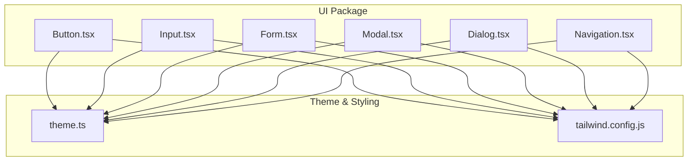
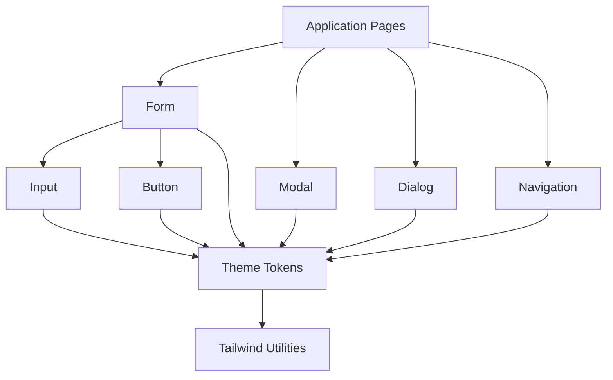
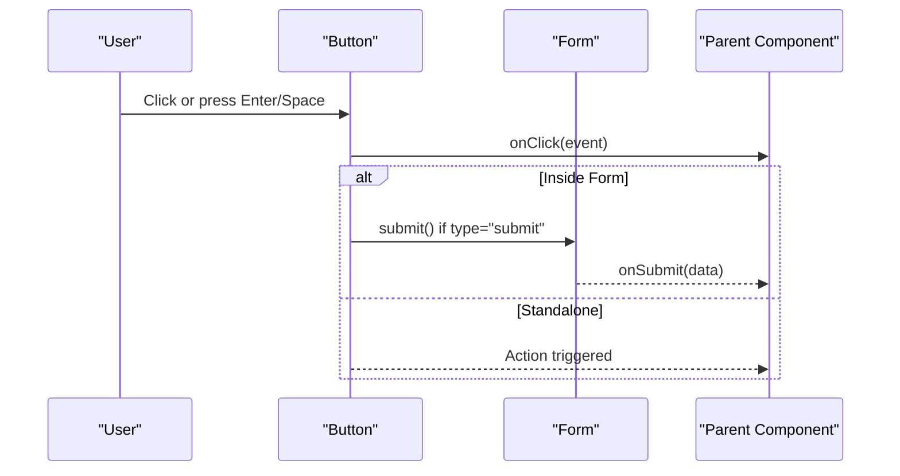
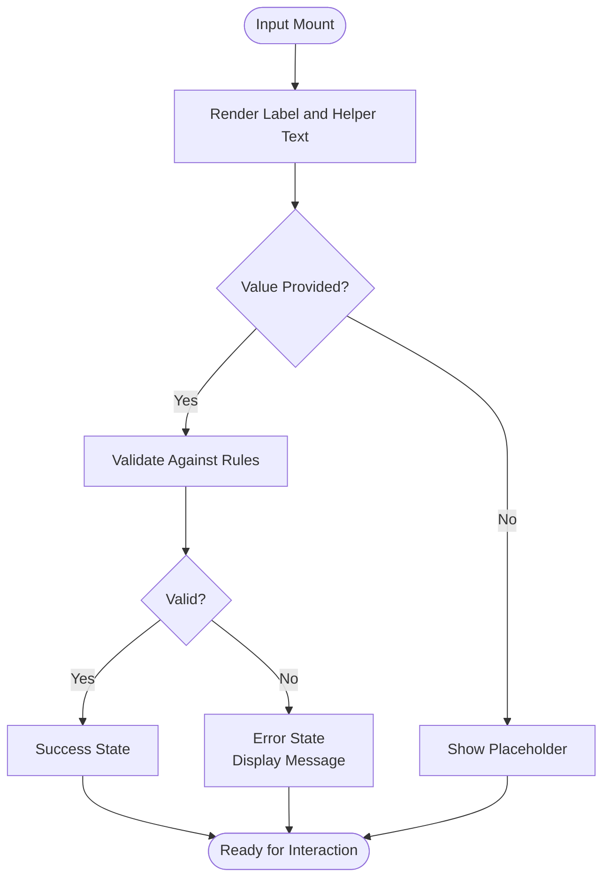
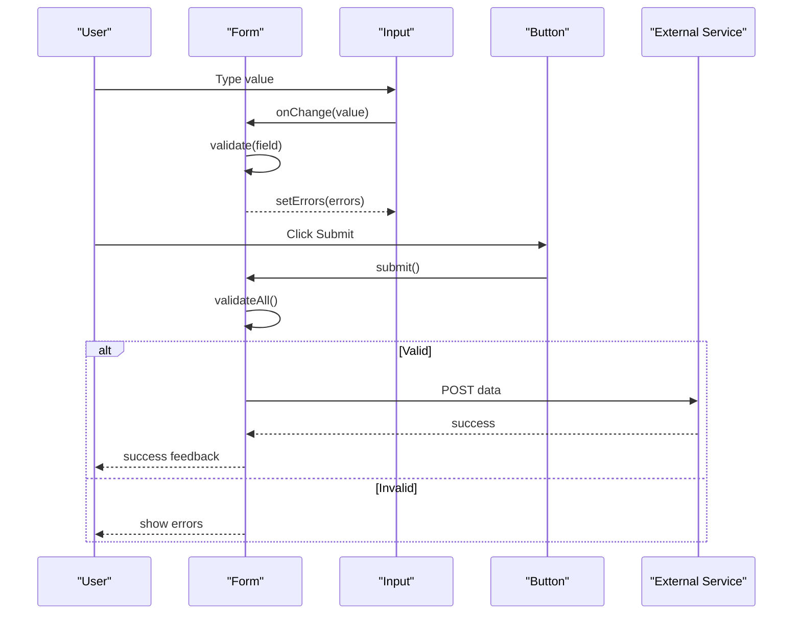
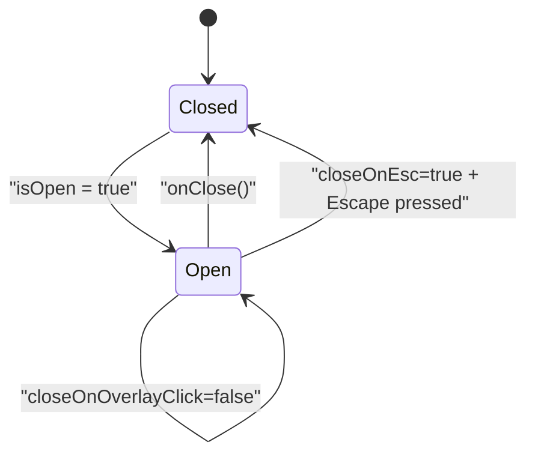
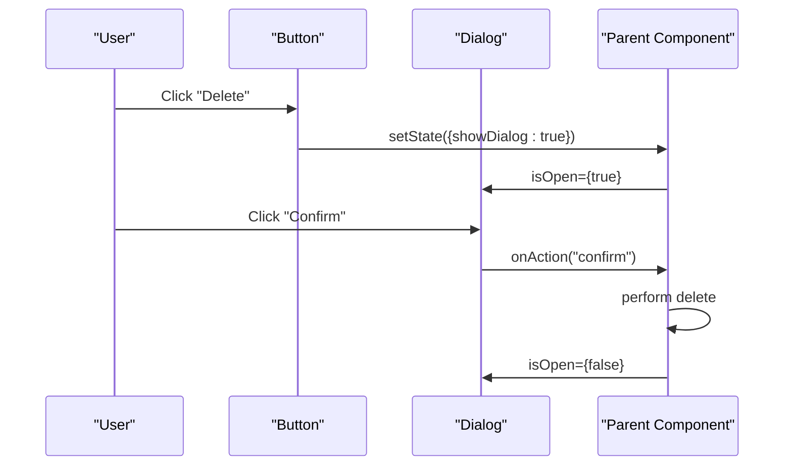
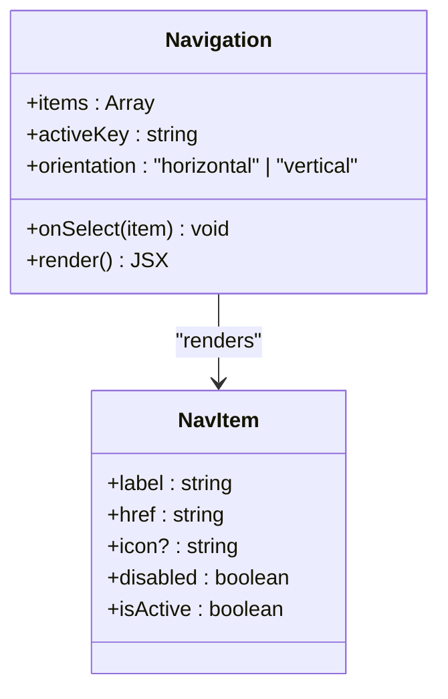
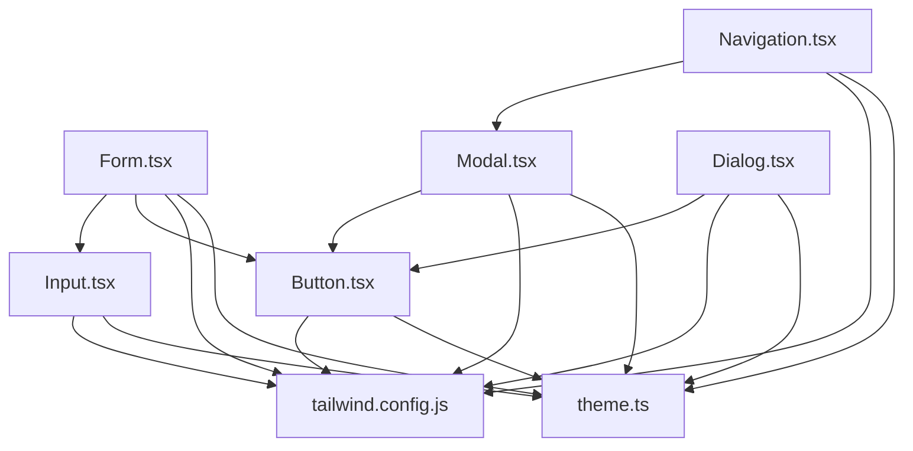

# Core Components

<cite>
**Referenced Files in This Document**
- [package.json](file://packages/ui/package.json)
- [Button.tsx](file://packages/ui/src/components/Button/Button.tsx)
- [Input.tsx](file://packages/ui/src/components/Input/Input.tsx)
- [Form.tsx](file://packages/ui/src/components/Form/Form.tsx)
- [Modal.tsx](file://packages/ui/src/components/Modal/Modal.tsx)
- [Dialog.tsx](file://packages/ui/src/components/Dialog/Dialog.tsx)
- [Navigation.tsx](file://packages/ui/src/components/Navigation/Navigation.tsx)
- [theme.ts](file://packages/theme/src/index.ts)
- [tailwind.config.js](file://apps/desktop/tailwind.config.js)
</cite>

## Table of Contents
1. [Introduction](#introduction)
2. [Project Structure](#project-structure)
3. [Core Components](#core-components)
4. [Architecture Overview](#architecture-overview)
5. [Detailed Component Analysis](#detailed-component-analysis)
6. [Dependency Analysis](#dependency-analysis)
7. [Performance Considerations](#performance-considerations)
8. [Troubleshooting Guide](#troubleshooting-guide)
9. [Conclusion](#conclusion)
10. [Appendices](#appendices)

## Introduction
This document provides comprehensive documentation for the core UI components used across the application, including buttons, inputs, forms, modals, dialogs, and navigation elements. It covers available props, events, variants, customization options through themes, accessibility features, common use cases, error and loading states, and integration patterns with other components. The goal is to enable both new and experienced developers to implement consistent, accessible, and customizable user interfaces efficiently.

## Project Structure
The UI components are organized under a dedicated package within the monorepo. Each component resides in its own directory with a primary implementation file. Theming and styling configuration are provided via a theme package and Tailwind configuration files.

**Diagram sources**
- [Button.tsx](file://packages/ui/src/components/Button/Button.tsx)
- [Input.tsx](file://packages/ui/src/components/Input/Input.tsx)
- [Form.tsx](file://packages/ui/src/components/Form/Form.tsx)
- [Modal.tsx](file://packages/ui/src/components/Modal/Modal.tsx)
- [Dialog.tsx](file://packages/ui/src/components/Dialog/Dialog.tsx)
- [Navigation.tsx](file://packages/ui/src/components/Navigation/Navigation.tsx)
- [theme.ts](file://packages/theme/src/index.ts)
- [tailwind.config.js](file://apps/desktop/tailwind.config.js)

**Section sources**
- [package.json](file://packages/ui/package.json)
- [tailwind.config.js](file://apps/desktop/tailwind.config.js)

## Core Components
This section summarizes the core UI components and their responsibilities:
- Button: Primary interactive element for actions and commands. Supports multiple variants, sizes, disabled/loading states, and keyboard accessibility.
- Input: Text input field with validation, helper text, error messaging, and focus management.
- Form: Container that manages form state, validation, submission, and integrates with Input and other fields.
- Modal: Overlay dialog that traps focus and requires explicit dismissal.
- Dialog: Lightweight confirmation or informational dialog with optional actions.
- Navigation: Structural component for app navigation, supporting active states and keyboard navigation.

Each component is designed to be themeable and accessible by default, with clear prop contracts and event hooks for integration.

[No sources needed since this section provides a high-level overview]

## Architecture Overview
The UI components follow a layered architecture:
- Presentation Layer: Individual components (Button, Input, etc.) render UI and handle local interactions.
- State Management Layer: Forms manage composite state and validation; components emit events for parent handling.
- Theming Layer: Centralized theme definitions provide tokens for colors, typography, spacing, and radii.
- Styling Layer: Tailwind utilities compose design tokens into final styles.

**Diagram sources**
- [Form.tsx](file://packages/ui/src/components/Form/Form.tsx)
- [Input.tsx](file://packages/ui/src/components/Input/Input.tsx)
- [Button.tsx](file://packages/ui/src/components/Button/Button.tsx)
- [Modal.tsx](file://packages/ui/src/components/Modal/Modal.tsx)
- [Dialog.tsx](file://packages/ui/src/components/Dialog/Dialog.tsx)
- [Navigation.tsx](file://packages/ui/src/components/Navigation/Navigation.tsx)
- [theme.ts](file://packages/theme/src/index.ts)
- [tailwind.config.js](file://apps/desktop/tailwind.config.js)

## Detailed Component Analysis

### Button
Purpose:
- Triggers actions such as submitting forms, toggling states, or navigating.

Props:
- variant: visual style (e.g., primary, secondary, ghost).
- size: small, medium, large.
- disabled: boolean to disable interaction.
- loading: boolean to show spinner and prevent clicks.
- icon: optional icon slot or name.
- onClick: handler invoked on click.
- type: button, submit, reset when used inside forms.
- aria-* attributes: for accessibility enhancements.

Events:
- onClick: standard click event.
- onKeyDown: supports Enter and Space activation.

Variants:
- primary: emphasized action.
- secondary: less prominent action.
- ghost: minimal visual weight.

Customization:
- Use theme tokens for color, typography, and spacing.
- Tailwind classes can override defaults where necessary.

Accessibility:
- Focusable and keyboard operable.
- Disabled state prevents focus and announces status.
- Loading state conveys progress without blocking screen readers.

Common Use Cases:
- Submitting forms.
- Toggling modal/dialog visibility.
- Triggering destructive actions with confirmation.

Error States:
- Typically handled at the form level; Button remains neutral unless explicitly styled for errors.

Loading States:
- When loading is true, Button shows a spinner and disables further clicks.

Integration Patterns:
- Used within Form for submission.
- Controls Modal/Dialog visibility via state.

**Diagram sources**
- [Button.tsx](file://packages/ui/src/components/Button/Button.tsx)
- [Form.tsx](file://packages/ui/src/components/Form/Form.tsx)

**Section sources**
- [Button.tsx](file://packages/ui/src/components/Button/Button.tsx)
- [theme.ts](file://packages/theme/src/index.ts)
- [tailwind.config.js](file://apps/desktop/tailwind.config.js)

### Input
Purpose:
- Captures text input from users with built-in validation support and feedback.

Props:
- value: controlled value.
- onChange: handler for value changes.
- placeholder: hint text.
- label: accessible label.
- helperText: additional guidance.
- error: boolean or string for error state.
- disabled: boolean to disable input.
- readOnly: boolean to prevent editing.
- type: text, email, password, number, etc.
- maxLength/minLength: constraints.
- required: marks field as required.
- autoFocus: focuses input on mount.
- onBlur/onFocus: lifecycle events.
- aria-describedby: links to helper/error messages.

Events:
- onChange: fires on input changes.
- onBlur/onFocus: focus lifecycle.
- onKeyDown: supports Enter submission when appropriate.

Validation:
- Integrates with Form for aggregated validation.
- Displays inline errors and helper text.

Customization:
- Theme tokens define border radius, font sizes, and focus rings.
- Tailwind utilities allow overrides for specific contexts.

Accessibility:
- Proper labeling via label and aria attributes.
- Error announcements via aria-invalid and aria-describedby.
- Keyboard navigation and focus management.

Common Use Cases:
- Collecting user data in forms.
- Search bars and filters.
- Settings panels.

Error States:
- Visual error styling and message display.
- Screen reader announcements for invalid fields.

Loading States:
- Typically not applied directly to Input; loading is managed at the form or parent level.

Integration Patterns:
- Used within Form for state and validation.
- Can trigger real-time validation and suggestions.

**Diagram sources**
- [Input.tsx](file://packages/ui/src/components/Input/Input.tsx)
- [Form.tsx](file://packages/ui/src/components/Form/Form.tsx)

**Section sources**
- [Input.tsx](file://packages/ui/src/components/Input/Input.tsx)
- [theme.ts](file://packages/theme/src/index.ts)
- [tailwind.config.js](file://apps/desktop/tailwind.config.js)

### Form
Purpose:
- Manages composite form state, validation, and submission while coordinating child components like Input and Button.

Props:
- initialValues: starting values for fields.
- onSubmit: handler invoked with validated data.
- validate: validation function or schema.
- children: form fields and actions.
- noValidate: bypasses browser validation.
- className: custom class names.

State:
- Values: current field values.
- Errors: per-field error messages.
- Touched: tracks which fields have been interacted with.
- Submitting: indicates ongoing submission.

Events:
- onSubmit: called after successful validation.
- onChange: field change propagation.
- onBlur: field blur propagation.

Validation:
- Supports synchronous and asynchronous validation.
- Aggregates errors and displays them per field.

Customization:
- Theme tokens for layout, spacing, and typography.
- Tailwind utilities for responsive layouts.

Accessibility:
- Uses fieldset/legend for grouping.
- Announces errors and success states.
- Ensures proper tab order and focus management.

Common Use Cases:
- Multi-step forms.
- Settings pages.
- Data entry screens.

Error States:
- Inline field errors and summary messages.
- Non-blocking validation feedback.

Loading States:
- Submitting state disables actions and shows global feedback.

Integration Patterns:
- Wraps Input and other fields.
- Coordinates with Modal/Dialog for confirmations.

**Diagram sources**
- [Form.tsx](file://packages/ui/src/components/Form/Form.tsx)
- [Input.tsx](file://packages/ui/src/components/Input/Input.tsx)
- [Button.tsx](file://packages/ui/src/components/Button/Button.tsx)

**Section sources**
- [Form.tsx](file://packages/ui/src/components/Form/Form.tsx)
- [theme.ts](file://packages/theme/src/index.ts)
- [tailwind.config.js](file://apps/desktop/tailwind.config.js)

### Modal
Purpose:
- Presents content in an overlay that requires explicit dismissal, focusing attention on critical tasks.

Props:
- isOpen: controls visibility.
- onClose: handler to dismiss.
- title: accessible title.
- children: modal content.
- size: small, medium, large.
- closeOnOverlayClick: boolean.
- closeOnEsc: boolean.
- aria-labelledby: references title element.

Events:
- onClose: invoked on dismiss triggers.
- onOpenChange: lifecycle hook for open/close transitions.

Customization:
- Theme tokens for backdrop opacity, z-index, and container padding.
- Tailwind utilities for responsive sizing.

Accessibility:
- Focus trap within modal.
- Restores focus on close.
- ARIA roles and labels for screen readers.

Common Use Cases:
- Confirmations and warnings.
- Complex wizards or multi-section content.
- Media previews.

Error States:
- Content-driven; Modal itself remains neutral.

Loading States:
- Can wrap content with a loading indicator while fetching data.

Integration Patterns:
- Controlled by parent state.
- Often paired with Button to toggle visibility.

**Diagram sources**
- [Modal.tsx](file://packages/ui/src/components/Modal/Modal.tsx)

**Section sources**
- [Modal.tsx](file://packages/ui/src/components/Modal/Modal.tsx)
- [theme.ts](file://packages/theme/src/index.ts)
- [tailwind.config.js](file://apps/desktop/tailwind.config.js)

### Dialog
Purpose:
- Lightweight confirmation or informational dialog with optional actions.

Props:
- isOpen: controls visibility.
- onClose: handler to dismiss.
- title: accessible title.
- description: contextual information.
- actions: array of action objects (label, onClick, variant).
- cancelLabel: label for cancel action.
- confirmLabel: label for confirm action.
- variant: info, warning, danger.

Events:
- onClose: invoked on dismiss.
- onAction: invoked when an action is clicked.

Customization:
- Theme tokens for colors and typography.
- Tailwind utilities for layout and spacing.

Accessibility:
- Role dialog with aria-modal.
- Focus management and keyboard navigation.
- Clear labeling for actions.

Common Use Cases:
- Delete confirmations.
- Simple alerts and notices.
- Quick settings toggles.

Error States:
- Danger variant highlights destructive actions.

Loading States:
- Actions can be disabled during async operations.

Integration Patterns:
- Triggered by Button clicks.
- Used for non-blocking confirmations.

**Diagram sources**
- [Dialog.tsx](file://packages/ui/src/components/Dialog/Dialog.tsx)
- [Button.tsx](file://packages/ui/src/components/Button/Button.tsx)

**Section sources**
- [Dialog.tsx](file://packages/ui/src/components/Dialog/Dialog.tsx)
- [theme.ts](file://packages/theme/src/index.ts)
- [tailwind.config.js](file://apps/desktop/tailwind.config.js)

### Navigation
Purpose:
- Provides structural navigation elements for app sections, supporting active states and keyboard navigation.

Props:
- items: array of navigation entries (label, href, icon, disabled).
- activeKey: key of the currently active item.
- onSelect: handler for selection changes.
- orientation: horizontal or vertical.
- role: navigation or list.

Events:
- onSelect: invoked when an item is selected.
- onNavigate: invoked with navigation details.

Customization:
- Theme tokens for active indicators and hover states.
- Tailwind utilities for layout and spacing.

Accessibility:
- Uses nav landmark and list semantics.
- Keyboard navigation with arrow keys.
- Active item announced to screen readers.

Common Use Cases:
- Sidebar menus.
- Top navigation bars.
- Tab-like interfaces.

Error States:
- Disabled items indicate unavailable routes.

Loading States:
- Not typically applicable; consider skeleton loaders for dynamic lists.

Integration Patterns:
- Works with routing libraries for navigation.
- Can be combined with Modal/Dialog for nested navigation flows.

**Diagram sources**
- [Navigation.tsx](file://packages/ui/src/components/Navigation/Navigation.tsx)

**Section sources**
- [Navigation.tsx](file://packages/ui/src/components/Navigation/Navigation.tsx)
- [theme.ts](file://packages/theme/src/index.ts)
- [tailwind.config.js](file://apps/desktop/tailwind.config.js)

## Dependency Analysis
Components depend on the theme layer for design tokens and Tailwind utilities for composition. Forms coordinate multiple components and external services.

**Diagram sources**
- [Button.tsx](file://packages/ui/src/components/Button/Button.tsx)
- [Input.tsx](file://packages/ui/src/components/Input/Input.tsx)
- [Form.tsx](file://packages/ui/src/components/Form/Form.tsx)
- [Modal.tsx](file://packages/ui/src/components/Modal/Modal.tsx)
- [Dialog.tsx](file://packages/ui/src/components/Dialog/Dialog.tsx)
- [Navigation.tsx](file://packages/ui/src/components/Navigation/Navigation.tsx)
- [theme.ts](file://packages/theme/src/index.ts)
- [tailwind.config.js](file://apps/desktop/tailwind.config.js)

**Section sources**
- [theme.ts](file://packages/theme/src/index.ts)
- [tailwind.config.js](file://apps/desktop/tailwind.config.js)

## Performance Considerations
- Prefer controlled components only when necessary; uncontrolled inputs can reduce re-renders.
- Debounce heavy validation or API calls triggered by Input onChange.
- Memoize expensive computations in Form validation functions.
- Avoid unnecessary re-renders by stabilizing props and using React.memo where appropriate.
- Lazy-load Modal/Dialog content when possible to improve initial load times.

[No sources needed since this section provides general guidance]

## Troubleshooting Guide
Common issues and resolutions:
- Focus not trapped in Modal: Ensure focus trap is enabled and overlay click behavior is configured correctly.
- Form validation not triggering: Verify that onChange and onBlur handlers are wired and that validation rules are defined.
- Accessibility warnings: Check that all inputs have associated labels and that ARIA attributes are present for errors and descriptions.
- Theme overrides not applying: Confirm Tailwind configuration includes component classes and that theme tokens are correctly referenced.

**Section sources**
- [Modal.tsx](file://packages/ui/src/components/Modal/Modal.tsx)
- [Form.tsx](file://packages/ui/src/components/Form/Form.tsx)
- [Input.tsx](file://packages/ui/src/components/Input/Input.tsx)
- [theme.ts](file://packages/theme/src/index.ts)
- [tailwind.config.js](file://apps/desktop/tailwind.config.js)

## Conclusion
The core UI components provide a cohesive, themeable, and accessible foundation for building user interfaces. By leveraging standardized props, events, and variants, teams can maintain consistency across applications while enabling customization through themes and Tailwind utilities. Following the integration patterns and accessibility guidelines ensures robust, user-friendly experiences.

[No sources needed since this section summarizes without analyzing specific files]

## Appendices

### Accessibility Checklist
- All interactive elements are keyboard operable.
- Labels and descriptions are provided for inputs and actions.
- Error states are announced to assistive technologies.
- Focus management is implemented for overlays and dialogs.

### Theming Best Practices
- Define semantic tokens for colors, typography, and spacing.
- Use Tailwind utilities to compose token-based styles.
- Keep overrides minimal and scoped to specific contexts.

[No sources needed since this section provides general guidance]