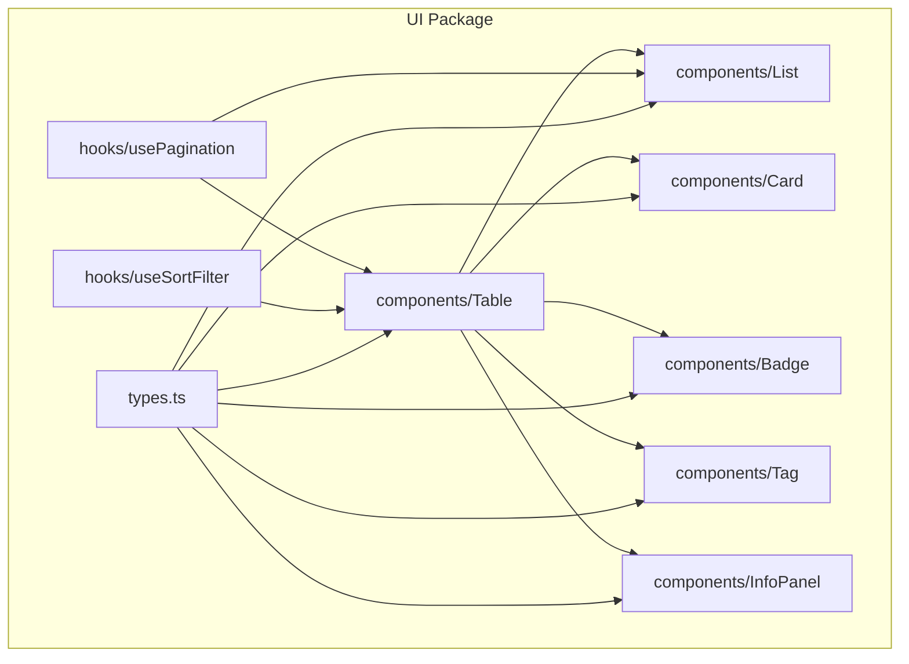
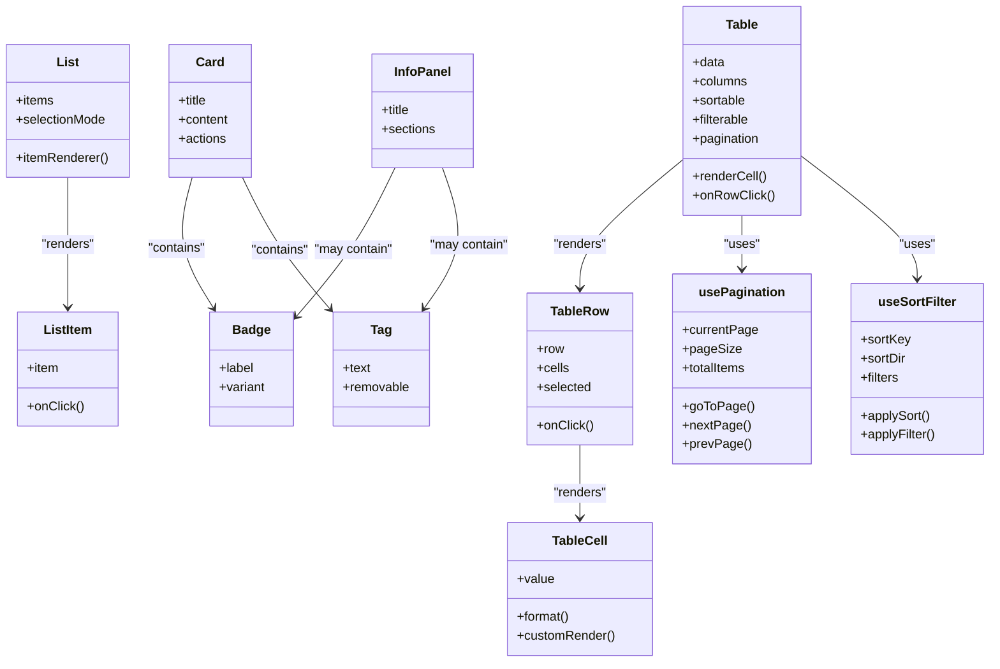
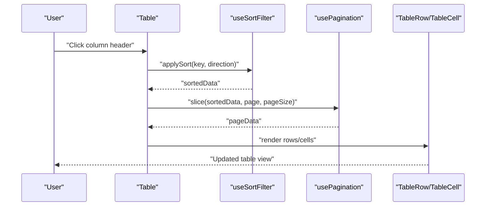
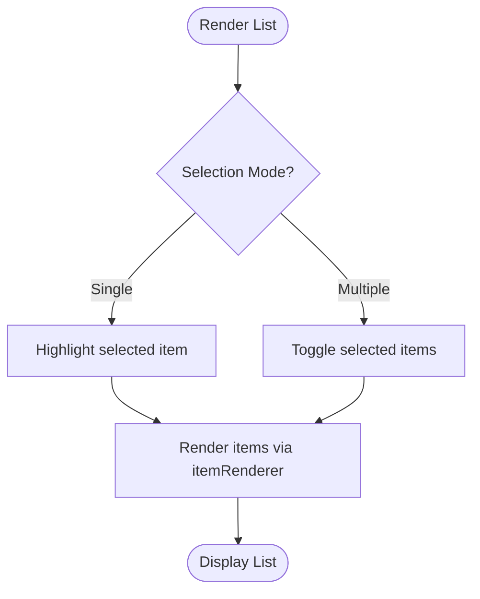
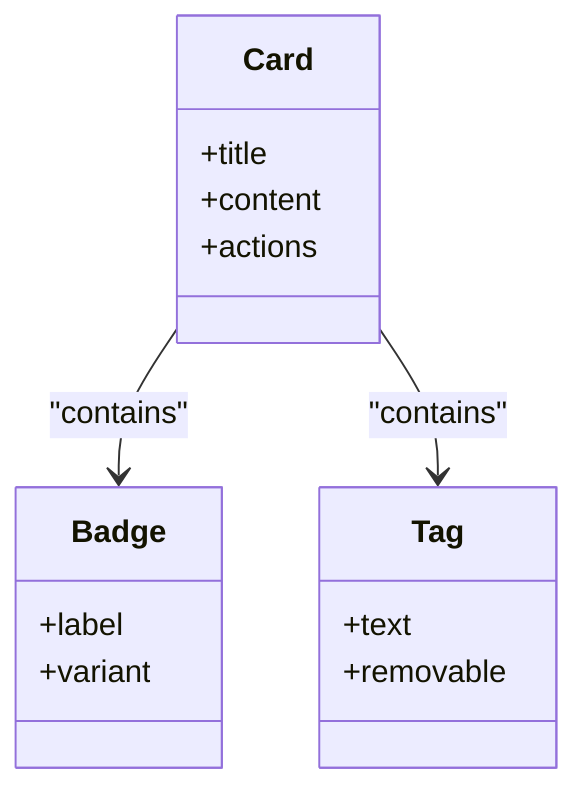
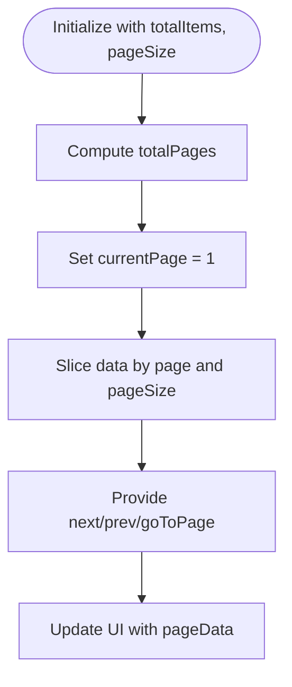
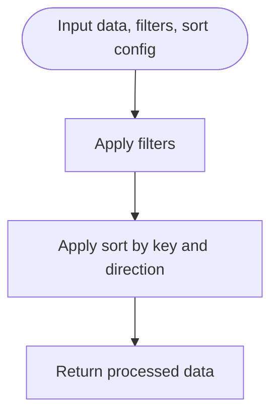
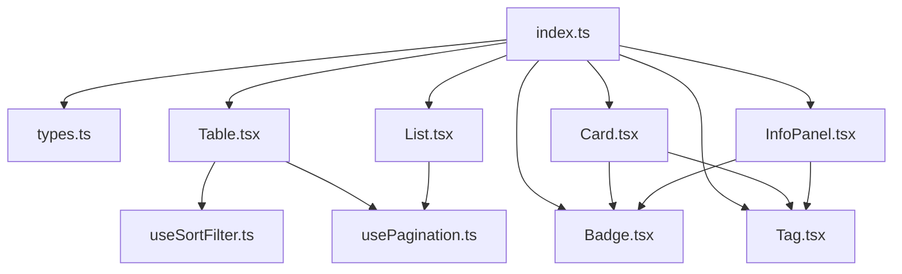

# Data Display Components

<cite>
**Referenced Files in This Document**
- [package.json](file://packages/ui/package.json)
- [index.ts](file://packages/ui/src/index.ts)
- [Table.tsx](file://packages/ui/src/components/Table/Table.tsx)
- [TableRow.tsx](file://packages/ui/src/components/Table/TableRow.tsx)
- [TableCell.tsx](file://packages/ui/src/components/Table/TableCell.tsx)
- [List.tsx](file://packages/ui/src/components/List/List.tsx)
- [ListItem.tsx](file://packages/ui/src/components/List/ListItem.tsx)
- [Card.tsx](file://packages/ui/src/components/Card/Card.tsx)
- [Badge.tsx](file://packages/ui/src/components/Badge/Badge.tsx)
- [Tag.tsx](file://packages/ui/src/components/Tag/Tag.tsx)
- [InfoPanel.tsx](file://packages/ui/src/components/InfoPanel/InfoPanel.tsx)
- [usePagination.ts](file://packages/ui/src/hooks/usePagination.ts)
- [useSortFilter.ts](file://packages/ui/src/hooks/useSortFilter.ts)
- [types.ts](file://packages/ui/src/types.ts)
</cite>

## Table of Contents
1. [Introduction](#introduction)
2. [Project Structure](#project-structure)
3. [Core Components](#core-components)
4. [Architecture Overview](#architecture-overview)
5. [Detailed Component Analysis](#detailed-component-analysis)
6. [Dependency Analysis](#dependency-analysis)
7. [Performance Considerations](#performance-considerations)
8. [Troubleshooting Guide](#troubleshooting-guide)
9. [Conclusion](#conclusion)
10. [Appendices](#appendices)

## Introduction
This document explains how to present structured data effectively using the UI package’s data display components: tables, lists, cards, badges, tags, and information panels. It covers best practices for handling large datasets, implementing sorting and filtering, managing pagination, custom rendering, cell formatting, row interactions, and accessibility considerations for data-heavy interfaces.

## Project Structure
The data display components are organized under the UI package with a feature-based layout. Each component has its own directory containing implementation files and styles. Shared hooks provide reusable logic for pagination and sort/filter operations. Types define common interfaces used across components.

[No sources needed since this diagram shows conceptual structure]

## Core Components
- Table: Renders tabular data with support for headers, rows, cells, sorting, filtering, and pagination integration.
- List: Presents linear collections with customizable items and selection behaviors.
- Card: Displays grouped content and actions within a bounded container.
- Badge: Shows small status or count indicators.
- Tag: Represents metadata or categorization labels.
- InfoPanel: Provides contextual information panels for summaries and details.

These components share common types and can be composed to build complex data views.

**Section sources**
- [index.ts](file://packages/ui/src/index.ts)
- [types.ts](file://packages/ui/src/types.ts)

## Architecture Overview
The data display architecture separates presentation from behavior:
- Presentation components (Table, List, Card, Badge, Tag, InfoPanel) focus on rendering and styling.
- Behavior hooks (usePagination, useSortFilter) encapsulate stateful logic for navigation and data manipulation.
- Shared types ensure consistent contracts between components and hooks.

**Diagram sources**
- [Table.tsx](file://packages/ui/src/components/Table/Table.tsx)
- [TableRow.tsx](file://packages/ui/src/components/Table/TableRow.tsx)
- [TableCell.tsx](file://packages/ui/src/components/Table/TableCell.tsx)
- [List.tsx](file://packages/ui/src/components/List/List.tsx)
- [ListItem.tsx](file://packages/ui/src/components/List/ListItem.tsx)
- [Card.tsx](file://packages/ui/src/components/Card/Card.tsx)
- [Badge.tsx](file://packages/ui/src/components/Badge/Badge.tsx)
- [Tag.tsx](file://packages/ui/src/components/Tag/Tag.tsx)
- [InfoPanel.tsx](file://packages/ui/src/components/InfoPanel/InfoPanel.tsx)
- [usePagination.ts](file://packages/ui/src/hooks/usePagination.ts)
- [useSortFilter.ts](file://packages/ui/src/hooks/useSortFilter.ts)

## Detailed Component Analysis

### Table
The Table component is designed for structured data presentation with advanced capabilities:
- Sorting: Column headers trigger ascending/descending order changes via shared hook.
- Filtering: Input fields or external filters update the dataset before rendering.
- Pagination: Integrates with usePagination to slice and render page-sized subsets.
- Custom Rendering: Cells accept render functions to format values or embed interactive elements.
- Row Interactions: Click handlers enable selection, navigation, or detail expansion.

**Diagram sources**
- [Table.tsx](file://packages/ui/src/components/Table/Table.tsx)
- [TableRow.tsx](file://packages/ui/src/components/Table/TableRow.tsx)
- [TableCell.tsx](file://packages/ui/src/components/Table/TableCell.tsx)
- [useSortFilter.ts](file://packages/ui/src/hooks/useSortFilter.ts)
- [usePagination.ts](file://packages/ui/src/hooks/usePagination.ts)

Best practices:
- Use stable keys for rows to optimize re-renders.
- Debounce filter inputs to reduce computation overhead.
- Provide aria-labels and roles for screen readers.
- Implement keyboard navigation for sortable columns and paginated controls.

**Section sources**
- [Table.tsx](file://packages/ui/src/components/Table/Table.tsx)
- [TableRow.tsx](file://packages/ui/src/components/Table/TableRow.tsx)
- [TableCell.tsx](file://packages/ui/src/components/Table/TableCell.tsx)
- [useSortFilter.ts](file://packages/ui/src/hooks/useSortFilter.ts)
- [usePagination.ts](file://packages/ui/src/hooks/usePagination.ts)

### List
The List component renders collections with flexible item rendering and selection modes:
- Item renderer function allows custom layouts per item.
- Selection mode supports single or multiple selections.
- Virtualization-friendly design encourages efficient rendering for large lists.

**Diagram sources**
- [List.tsx](file://packages/ui/src/components/List/List.tsx)
- [ListItem.tsx](file://packages/ui/src/components/List/ListItem.tsx)

Accessibility:
- Ensure each item has an accessible name and role.
- Provide keyboard shortcuts for selection and navigation.
- Announce selection changes to assistive technologies.

**Section sources**
- [List.tsx](file://packages/ui/src/components/List/List.tsx)
- [ListItem.tsx](file://packages/ui/src/components/List/ListItem.tsx)

### Card
Cards group related content and actions into a cohesive unit:
- Title and content sections provide clear hierarchy.
- Actions area supports buttons, badges, and tags.
- Suitable for dashboards, summaries, and quick-glance views.

**Diagram sources**
- [Card.tsx](file://packages/ui/src/components/Card/Card.tsx)
- [Badge.tsx](file://packages/ui/src/components/Badge/Badge.tsx)
- [Tag.tsx](file://packages/ui/src/components/Tag/Tag.tsx)

**Section sources**
- [Card.tsx](file://packages/ui/src/components/Card/Card.tsx)
- [Badge.tsx](file://packages/ui/src/components/Badge/Badge.tsx)
- [Tag.tsx](file://packages/ui/src/components/Tag/Tag.tsx)

### Badge
Badges communicate status or counts succinctly:
- Variants indicate semantic meaning (e.g., success, warning).
- Can be combined with other components for rich context.

**Section sources**
- [Badge.tsx](file://packages/ui/src/components/Badge/Badge.tsx)

### Tag
Tags represent categorical metadata:
- Removable tags allow dynamic filtering or tagging workflows.
- Useful for facets, filters, and attribute displays.

**Section sources**
- [Tag.tsx](file://packages/ui/src/components/Tag/Tag.tsx)

### InfoPanel
Information panels summarize key metrics and details:
- Sections organize content logically.
- Often includes badges and tags for visual cues.

**Section sources**
- [InfoPanel.tsx](file://packages/ui/src/components/InfoPanel/InfoPanel.tsx)

### Pagination Hook
The usePagination hook manages page state and navigation:
- Tracks current page, page size, and total items.
- Provides methods to navigate pages and compute slices.

**Diagram sources**
- [usePagination.ts](file://packages/ui/src/hooks/usePagination.ts)

**Section sources**
- [usePagination.ts](file://packages/ui/src/hooks/usePagination.ts)

### Sort and Filter Hook
The useSortFilter hook centralizes sorting and filtering logic:
- Maintains sort key and direction.
- Applies filters based on criteria and returns filtered/sorted data.

**Diagram sources**
- [useSortFilter.ts](file://packages/ui/src/hooks/useSortFilter.ts)

**Section sources**
- [useSortFilter.ts](file://packages/ui/src/hooks/useSortFilter.ts)

## Dependency Analysis
Components depend on shared hooks and types to maintain consistency and reduce duplication. The UI package exposes a unified entry point for importing components and utilities.

**Diagram sources**
- [index.ts](file://packages/ui/src/index.ts)
- [types.ts](file://packages/ui/src/types.ts)
- [Table.tsx](file://packages/ui/src/components/Table/Table.tsx)
- [List.tsx](file://packages/ui/src/components/List/List.tsx)
- [Card.tsx](file://packages/ui/src/components/Card/Card.tsx)
- [Badge.tsx](file://packages/ui/src/components/Badge/Badge.tsx)
- [Tag.tsx](file://packages/ui/src/components/Tag/Tag.tsx)
- [InfoPanel.tsx](file://packages/ui/src/components/InfoPanel/InfoPanel.tsx)
- [useSortFilter.ts](file://packages/ui/src/hooks/useSortFilter.ts)
- [usePagination.ts](file://packages/ui/src/hooks/usePagination.ts)

**Section sources**
- [index.ts](file://packages/ui/src/index.ts)
- [types.ts](file://packages/ui/src/types.ts)

## Performance Considerations
- Virtualization: For very large lists or tables, consider virtual scrolling libraries to render only visible items.
- Memoization: Memoize expensive computations in custom cell renderers and list item renderers.
- Debouncing: Debounce filter inputs to avoid excessive re-renders during typing.
- Stable Keys: Use unique, stable identifiers for rows and items to improve reconciliation performance.
- Lazy Loading: Load additional pages or details on demand to minimize initial payload.

[No sources needed since this section provides general guidance]

## Troubleshooting Guide
Common issues and resolutions:
- Incorrect sorting results: Verify that sort keys match data shape and that numeric strings are coerced properly.
- Pagination misalignment: Ensure totalItems reflects the filtered dataset when combining filters and pagination.
- Cell rendering errors: Validate custom render functions handle null/undefined values gracefully.
- Accessibility warnings: Confirm all interactive elements have appropriate roles, labels, and keyboard support.

**Section sources**
- [useSortFilter.ts](file://packages/ui/src/hooks/useSortFilter.ts)
- [usePagination.ts](file://packages/ui/src/hooks/usePagination.ts)
- [TableCell.tsx](file://packages/ui/src/components/Table/TableCell.tsx)

## Conclusion
The UI package provides robust, composable data display components suitable for complex data interfaces. By leveraging shared hooks for pagination and sorting/filtering, developers can implement efficient, accessible, and user-friendly data views. Follow the best practices outlined here to handle large datasets, customize rendering, and ensure high-quality user experiences.

[No sources needed since this section summarizes without analyzing specific files]

## Appendices

### API Reference Summary
- Table props: data, columns, sortable, filterable, pagination, renderCell, onRowClick.
- List props: items, itemRenderer, selectionMode.
- Card props: title, content, actions.
- Badge props: label, variant.
- Tag props: text, removable.
- InfoPanel props: title, sections.
- usePagination: currentPage, pageSize, totalItems, goToPage, nextPage, prevPage.
- useSortFilter: sortKey, sortDir, filters, applySort, applyFilter.

**Section sources**
- [Table.tsx](file://packages/ui/src/components/Table/Table.tsx)
- [List.tsx](file://packages/ui/src/components/List/List.tsx)
- [Card.tsx](file://packages/ui/src/components/Card/Card.tsx)
- [Badge.tsx](file://packages/ui/src/components/Badge/Badge.tsx)
- [Tag.tsx](file://packages/ui/src/components/Tag/Tag.tsx)
- [InfoPanel.tsx](file://packages/ui/src/components/InfoPanel/InfoPanel.tsx)
- [usePagination.ts](file://packages/ui/src/hooks/usePagination.ts)
- [useSortFilter.ts](file://packages/ui/src/hooks/useSortFilter.ts)