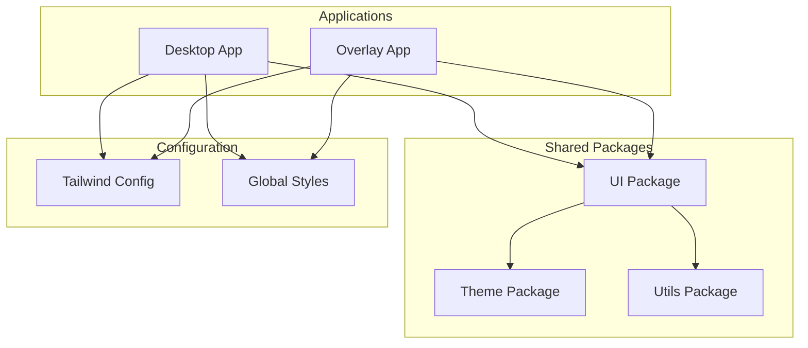
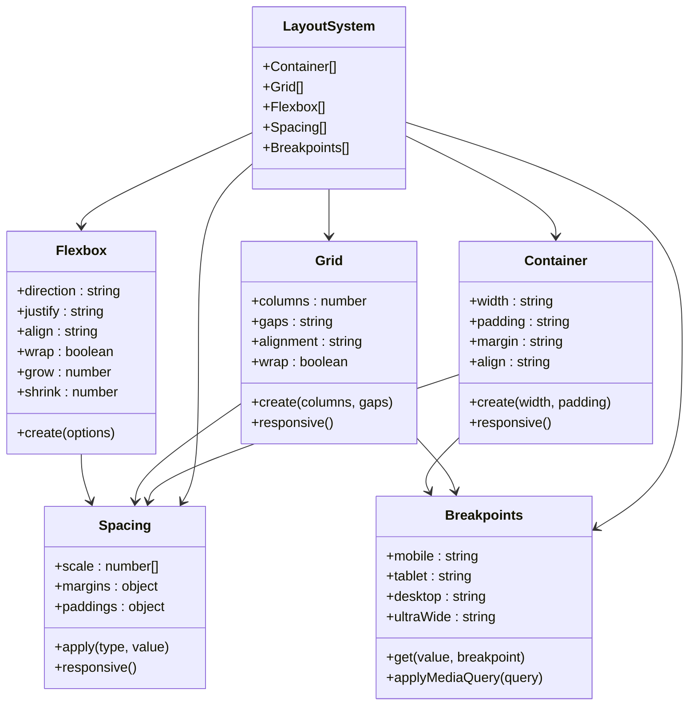
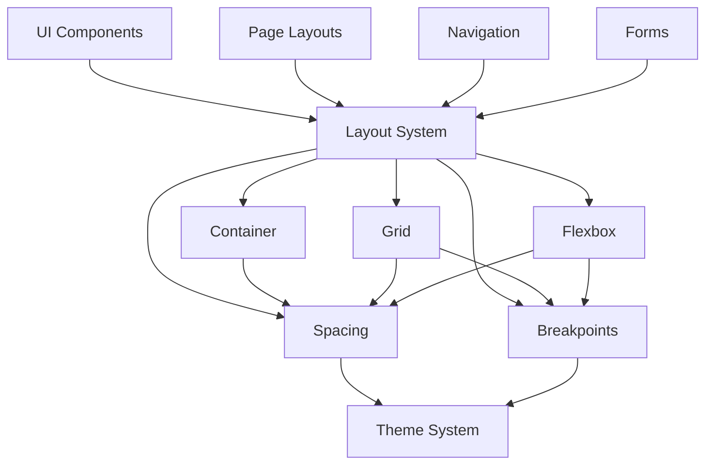

# Layout Components

<cite>
**Referenced Files in This Document**
- [desktop/tailwind.config.js](file://apps/desktop/tailwind.config.js)
- [overlay/tailwind.config.js](file://apps/overlay/tailwind.config.js)
- [desktop/src/app/layout.tsx](file://apps/desktop/src/app/layout.tsx)
- [overlay/src/app/layout.tsx](file://apps/overlay/src/app/layout.tsx)
- [desktop/src/app/globals.css](file://apps/desktop/src/app/globals.css)
- [overlay/src/app/globals.css](file://apps/overlay/src/app/globals.css)
- [packages/ui](file://packages/ui)
- [packages/theme](file://packages/theme)
</cite>

## Table of Contents
1. [Introduction](#introduction)
2. [Project Structure](#project-structure)
3. [Core Components](#core-components)
4. [Architecture Overview](#architecture-overview)
5. [Detailed Component Analysis](#detailed-component-analysis)
6. [Dependency Analysis](#dependency-analysis)
7. [Performance Considerations](#performance-considerations)
8. [Troubleshooting Guide](#troubleshooting-guide)
9. [Conclusion](#conclusion)

## Introduction

This document provides comprehensive documentation for layout-related components in the AR Sports application, focusing on containers, grids, flexbox utilities, spacing systems, and responsive breakpoints. The application uses a modern React-based architecture with Tailwind CSS for styling, implementing flexible layouts that adapt to different screen sizes while maintaining consistent spacing patterns across all components.

The layout system is designed to support both desktop and overlay applications, providing a unified approach to responsive design and component composition. This documentation covers implementation patterns, best practices, and performance considerations for creating complex, maintainable layouts.

## Project Structure

The layout system is organized across multiple packages and applications:

**Diagram sources**
- [desktop/tailwind.config.js](file://apps/desktop/tailwind.config.js)
- [overlay/tailwind.config.js](file://apps/overlay/tailwind.config.js)
- [packages/ui](file://packages/ui)
- [packages/theme](file://packages/theme)

**Section sources**
- [desktop/src/app/layout.tsx](file://apps/desktop/src/app/layout.tsx)
- [overlay/src/app/layout.tsx](file://apps/overlay/src/app/layout.tsx)

## Core Components

### Container System

The container system provides consistent width constraints and centering across different screen sizes. Containers are implemented using utility classes that respond to viewport changes.

#### Key Features:
- **Responsive Width Constraints**: Maximum widths that scale appropriately across devices
- **Centering Support**: Automatic horizontal centering within parent containers
- **Padding Management**: Consistent internal spacing for content areas
- **Nested Container Support**: Proper handling of nested container hierarchies

### Grid System

The grid system enables complex two-dimensional layouts with consistent spacing and alignment. It supports both fixed and fluid grid patterns.

#### Grid Capabilities:
- **Column-Based Layouts**: Flexible column definitions with automatic wrapping
- **Gap Control**: Consistent spacing between grid items
- **Alignment Options**: Vertical and horizontal alignment controls
- **Responsive Breakpoints**: Column behavior changes at defined breakpoints

### Flexbox Utilities

Flexbox utilities provide one-dimensional layout capabilities with powerful alignment and distribution options.

#### Flexbox Features:
- **Direction Control**: Row and column layout directions
- **Justification**: Content distribution along the main axis
- **Alignment**: Cross-axis alignment and baseline alignment
- **Wrapping**: Flexible item wrapping behavior
- **Growth and Shrinkage**: Dynamic sizing based on available space

### Spacing System

The spacing system ensures consistent margins and padding throughout the application using a standardized scale.

#### Spacing Principles:
- **Consistent Scale**: Mathematical progression of spacing values
- **Semantic Naming**: Meaningful class names for different spacing contexts
- **Responsive Spacing**: Spacing adjustments based on screen size
- **Inheritance Support**: Proper spacing inheritance in nested components

### Responsive Breakpoints

Breakpoints define the transition points where layout behavior changes to accommodate different screen sizes.

#### Breakpoint Strategy:
- **Mobile-First Approach**: Base styles target mobile devices
- **Progressive Enhancement**: Additional features for larger screens
- **Consistent Scaling**: Proportional scaling across all breakpoints
- **Custom Breakpoints**: Application-specific breakpoint definitions

**Section sources**
- [desktop/tailwind.config.js](file://apps/desktop/tailwind.config.js)
- [overlay/tailwind.config.js](file://apps/overlay/tailwind.config.js)

## Architecture Overview

The layout architecture follows a layered approach with clear separation of concerns:

**Diagram sources**
- [packages/ui](file://packages/ui)
- [packages/theme](file://packages/theme)

## Detailed Component Analysis

### Container Component

The container component provides consistent width constraints and centering for content sections.

#### Implementation Pattern:
- **Base Container**: Foundation class with core container functionality
- **Responsive Variants**: Different container behaviors at various breakpoints
- **Fluid Containers**: Percentage-based width containers for full-width layouts
- **Fixed Containers**: Pixel-based width containers for specific use cases

#### Usage Examples:
- Page-level containers for main content areas
- Section containers for grouped content
- Card containers for modular components
- Sidebar containers for navigation elements

### Grid Component

The grid component enables complex two-dimensional layouts with consistent spacing.

#### Grid Types:
- **Auto Grid**: Automatic column creation based on content
- **Manual Grid**: Explicit column definitions for precise control
- **Responsive Grid**: Column behavior changes at breakpoints
- **Nested Grid**: Grid components within grid items

#### Grid Properties:
- **Columns**: Number of columns or custom column definitions
- **Gaps**: Spacing between grid items (horizontal and vertical)
- **Alignment**: Vertical and horizontal alignment options
- **Distribution**: Content distribution when items don't fill the grid

### Flexbox Component

The flexbox component provides one-dimensional layout capabilities with powerful alignment options.

#### Flexbox Properties:
- **Direction**: Row or column layout direction
- **Justify**: Horizontal content distribution
- **Align**: Vertical content alignment
- **Wrap**: Item wrapping behavior
- **Grow/Shrink**: Dynamic sizing based on available space

#### Common Flexbox Patterns:
- Navigation bars with centered or spaced items
- Card layouts with equal-height items
- Form layouts with aligned labels and inputs
- Button groups with consistent spacing

### Spacing System

The spacing system provides consistent margin and padding values throughout the application.

#### Spacing Scale:
- **Micro Spacing**: Tight spacing for inline elements
- **Small Spacing**: Compact spacing for related content
- **Medium Spacing**: Standard spacing for most layouts
- **Large Spacing**: Generous spacing for major sections
- **XL Spacing**: Extra large spacing for hero sections

#### Spacing Classes:
- **Margin Classes**: mt, mb, ml, mr, mx, my for directional margins
- **Padding Classes**: pt, pb, pl, pr, px, py for directional padding
- **Responsive Variants**: sm:, md:, lg: prefixes for breakpoint-specific spacing

### Responsive Breakpoints

Breakpoints define the transition points for responsive behavior changes.

#### Standard Breakpoints:
- **Mobile**: 0px - 640px (base styles)
- **Tablet**: 640px - 1024px (small screens)
- **Desktop**: 1024px - 1280px (medium screens)
- **Large Desktop**: 1280px+ (large screens)

#### Breakpoint Usage:
- **Utility Classes**: sm:, md:, lg: prefixes for responsive utilities
- **Component Props**: Responsive prop values for component behavior
- **Media Queries**: Custom media queries for advanced scenarios

**Section sources**
- [desktop/src/app/globals.css](file://apps/desktop/src/app/globals.css)
- [overlay/src/app/globals.css](file://apps/overlay/src/app/globals.css)

## Dependency Analysis

The layout system has clear dependency relationships between components:

**Diagram sources**
- [packages/ui](file://packages/ui)
- [packages/theme](file://packages/theme)

**Section sources**
- [packages/ui](file://packages/ui)
- [packages/theme](file://packages/theme)

## Performance Considerations

### Layout Performance Best Practices

1. **Minimize DOM Depth**: Keep component hierarchies shallow to reduce reflow calculations
2. **Use CSS Grid for Complex Layouts**: Grid performs better than flexbox for two-dimensional layouts
3. **Avoid Expensive Animations**: Use transform and opacity for smooth animations
4. **Lazy Load Heavy Components**: Defer loading of non-critical layout components
5. **Optimize Image Loading**: Use appropriate image sizes and formats for different breakpoints

### Memory Management

1. **Clean Up Event Listeners**: Remove resize listeners and other event handlers when components unmount
2. **Use Memoization**: Implement useMemo and useCallback for expensive calculations
3. **Avoid Memory Leaks**: Ensure proper cleanup of intervals, timeouts, and subscriptions

### Rendering Optimization

1. **Batch Updates**: Group state updates to minimize re-renders
2. **Virtualize Long Lists**: Use virtual scrolling for large datasets
3. **Debounce Resize Handlers**: Prevent excessive recalculation during window resizing
4. **Use CSS Containment**: Apply contain property to isolate layout calculations

## Troubleshooting Guide

### Common Layout Issues

1. **Content Overflow**: 
   - Check for fixed widths that exceed container bounds
   - Verify flex-wrap properties for responsive layouts
   - Ensure proper box-sizing settings

2. **Alignment Problems**:
   - Verify justify-content and align-items properties
   - Check for conflicting alignment rules
   - Ensure proper flex-direction settings

3. **Spacing Inconsistencies**:
   - Use consistent spacing units (rem/em vs px)
   - Verify margin collapsing behavior
   - Check for inherited spacing from parent components

4. **Responsive Issues**:
   - Verify breakpoint definitions match intended behavior
   - Check for conflicting media queries
   - Ensure proper mobile-first approach

### Debugging Techniques

1. **Browser DevTools**: Use layout inspection tools to visualize component structure
2. **Console Logging**: Log computed styles and layout dimensions
3. **Visual Regression Testing**: Compare layouts across different screen sizes
4. **Performance Profiling**: Identify layout thrashing and reflow issues

**Section sources**
- [desktop/src/app/globals.css](file://apps/desktop/src/app/globals.css)
- [overlay/src/app/globals.css](file://apps/overlay/src/app/globals.css)

## Conclusion

The layout system in AR Sports provides a comprehensive foundation for building responsive, flexible user interfaces. By following the established patterns and best practices outlined in this documentation, developers can create consistent, performant layouts that work seamlessly across different devices and screen sizes.

Key takeaways include:
- Use the container system for consistent width constraints
- Leverage grid layouts for complex two-dimensional arrangements
- Apply flexbox utilities for one-dimensional layouts and alignment
- Maintain consistent spacing using the standardized spacing system
- Implement responsive behavior through well-defined breakpoints
- Follow performance best practices for optimal user experience

The modular architecture allows for easy extension and customization while maintaining consistency across the entire application. Regular maintenance and adherence to these guidelines will ensure the layout system remains robust and scalable as the application grows.