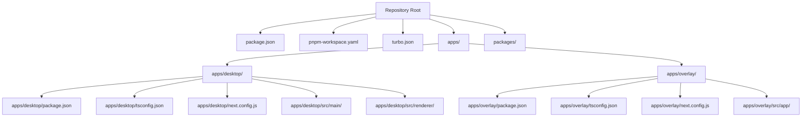
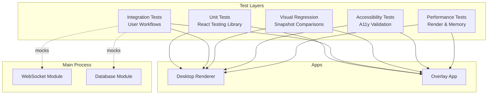
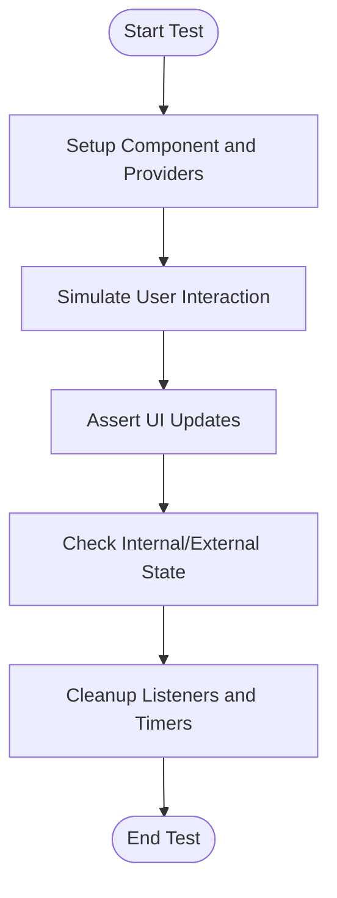
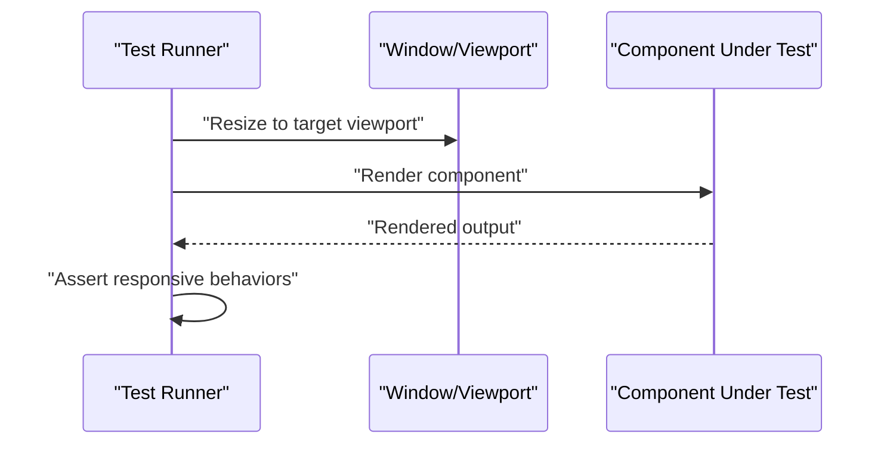
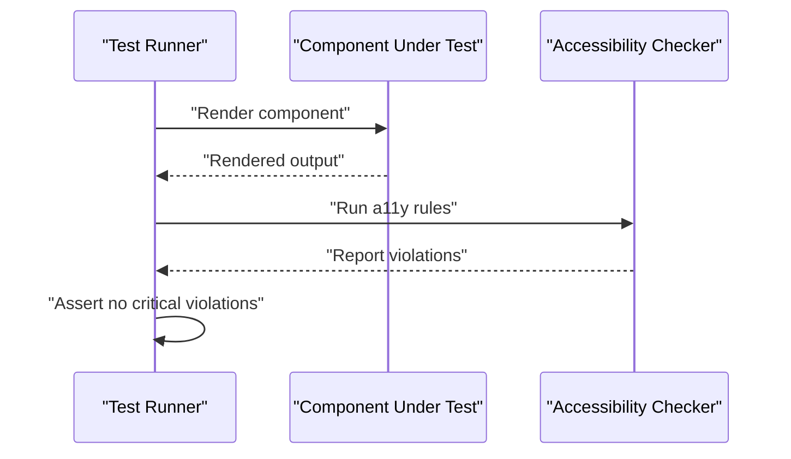
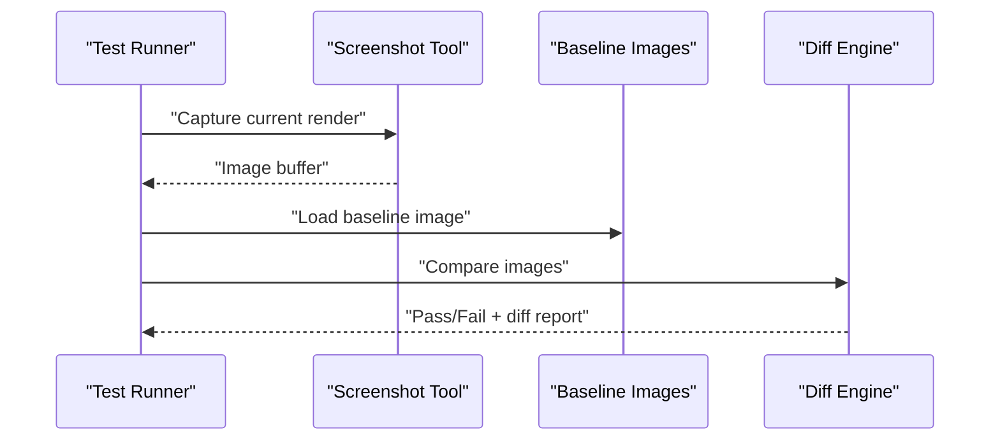
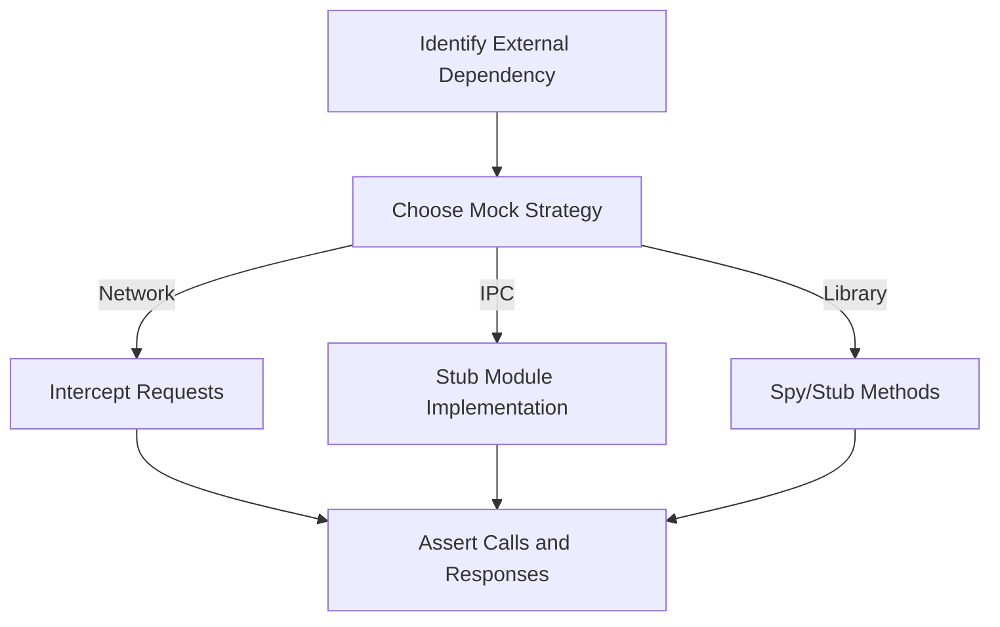
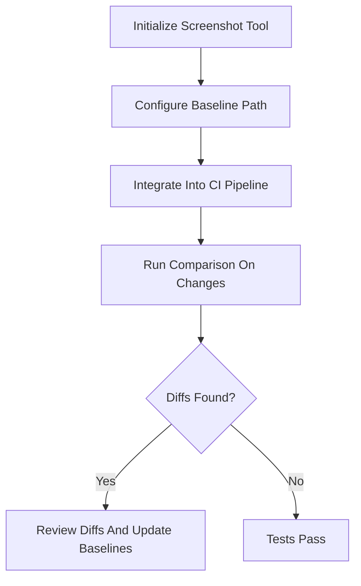
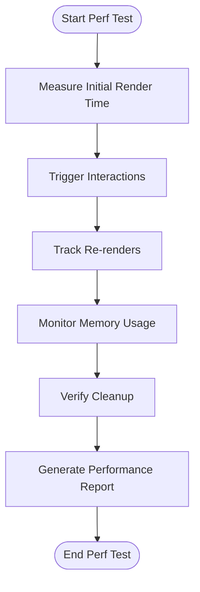
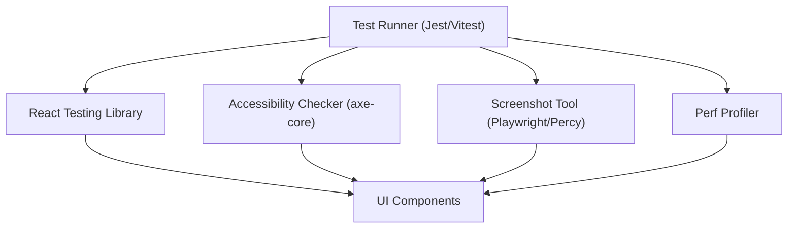

# Testing Strategies

<cite>
**Referenced Files in This Document**
- [package.json](file://package.json)
- [pnpm-workspace.yaml](file://pnpm-workspace.yaml)
- [turbo.json](file://turbo.json)
- [desktop/package.json](file://apps/desktop/package.json)
- [overlay/package.json](file://apps/overlay/package.json)
- [desktop/tsconfig.json](file://apps/desktop/tsconfig.json)
- [overlay/tsconfig.json](file://apps/overlay/tsconfig.json)
- [desktop/next.config.js](file://apps/desktop/next.config.js)
- [overlay/next.config.js](file://apps/overlay/next.config.js)
- [desktop/src/main/websocket.ts](file://apps/desktop/src/main/websocket.ts)
- [desktop/src/main/database.ts](file://apps/desktop/src/main/database.ts)
- [desktop/src/renderer/app/layout.tsx](file://apps/desktop/src/renderer/app/layout.tsx)
- [desktop/src/renderer/app/page.tsx](file://apps/desktop/src/renderer/app/page.tsx)
- [overlay/src/app/layout.tsx](file://apps/overlay/src/app/layout.tsx)
- [overlay/src/app/page.tsx](file://apps/overlay/src/app/page.tsx)
</cite>

## Table of Contents
1. [Introduction](#introduction)
2. [Project Structure](#project-structure)
3. [Core Components](#core-components)
4. [Architecture Overview](#architecture-overview)
5. [Detailed Component Analysis](#detailed-component-analysis)
6. [Dependency Analysis](#dependency-analysis)
7. [Performance Considerations](#performance-considerations)
8. [Troubleshooting Guide](#troubleshooting-guide)
9. [Conclusion](#conclusion)
10. [Appendices](#appendices)

## Introduction
This document provides a comprehensive testing strategy for UI components across the project’s apps and packages. It covers unit testing with React Testing Library, visual regression testing, accessibility testing, interaction and state management testing, mocking external dependencies, responsive behavior testing, automated visual comparisons, performance testing, and memory leak detection. The guidance is tailored to the repository structure and existing configuration files, ensuring practical applicability without requiring code changes beyond what is necessary for robust test coverage.

## Project Structure
The repository is a monorepo using pnpm workspaces and Turborepo. UI applications are located under apps (desktop, overlay), while shared logic and UI primitives may be organized under packages. Configuration files such as package.json, pnpm-workspace.yaml, and turbo.json define workspace boundaries and task orchestration.

**Diagram sources**
- [package.json:1-200](file://package.json#L1-L200)
- [pnpm-workspace.yaml:1-200](file://pnpm-workspace.yaml#L1-L200)
- [turbo.json:1-200](file://turbo.json#L1-L200)
- [desktop/package.json:1-200](file://apps/desktop/package.json#L1-L200)
- [overlay/package.json:1-200](file://apps/overlay/package.json#L1-L200)
- [desktop/tsconfig.json:1-200](file://apps/desktop/tsconfig.json#L1-L200)
- [overlay/tsconfig.json:1-200](file://apps/overlay/tsconfig.json#L1-L200)
- [desktop/next.config.js:1-200](file://apps/desktop/next.config.js#L1-L200)
- [overlay/next.config.js:1-200](file://apps/overlay/next.config.js#L1-L200)

**Section sources**
- [package.json:1-200](file://package.json#L1-L200)
- [pnpm-workspace.yaml:1-200](file://pnpm-workspace.yaml#L1-L200)
- [turbo.json:1-200](file://turbo.json#L1-L200)
- [desktop/package.json:1-200](file://apps/desktop/package.json#L1-L200)
- [overlay/package.json:1-200](file://apps/overlay/package.json#L1-L200)
- [desktop/tsconfig.json:1-200](file://apps/desktop/tsconfig.json#L1-L200)
- [overlay/tsconfig.json:1-200](file://apps/overlay/tsconfig.json#L1-L200)
- [desktop/next.config.js:1-200](file://apps/desktop/next.config.js#L1-L200)
- [overlay/next.config.js:1-200](file://apps/overlay/next.config.js#L1-L200)

## Core Components
This section outlines the primary areas where UI testing should focus:
- Desktop renderer app pages and layout
- Overlay app pages and layout
- Main process utilities (e.g., WebSocket, database) that may be mocked during tests
- Shared packages (if present) for reusable UI or logic

Key entry points and modules relevant to testing:
- Renderer layout and page components in the desktop app
- App layout and page components in the overlay app
- Main process modules for IPC/WebSocket interactions that can be stubbed or mocked

**Section sources**
- [desktop/src/renderer/app/layout.tsx:1-200](file://apps/desktop/src/renderer/app/layout.tsx#L1-L200)
- [desktop/src/renderer/app/page.tsx:1-200](file://apps/desktop/src/renderer/app/page.tsx#L1-L200)
- [overlay/src/app/layout.tsx:1-200](file://apps/overlay/src/app/layout.tsx#L1-L200)
- [overlay/src/app/page.tsx:1-200](file://apps/overlay/src/app/page.tsx#L1-L200)
- [desktop/src/main/websocket.ts:1-200](file://apps/desktop/src/main/websocket.ts#L1-L200)
- [desktop/src/main/database.ts:1-200](file://apps/desktop/src/main/database.ts#L1-L200)

## Architecture Overview
The testing architecture spans multiple layers:
- Unit tests for components and hooks using React Testing Library
- Integration tests for user workflows across pages and layouts
- Visual regression tests comparing rendered snapshots across environments
- Accessibility tests validating semantic markup and keyboard navigation
- Performance tests measuring render times and memory usage
- Mocking strategies for main process modules (WebSocket, database)

[No sources needed since this diagram shows conceptual workflow, not actual code structure]

## Detailed Component Analysis

### Desktop Renderer: Layout and Page
Focus on testing the desktop renderer’s layout and page components:
- Verify layout composition and global providers
- Assert page content renders correctly under different states
- Simulate user interactions and validate UI updates
- Test responsive behavior by changing viewport size
- Validate accessibility attributes and keyboard navigation

Recommended approach:
- Use React Testing Library queries to assert presence and visibility
- Wrap components with necessary providers (theme, router, store)
- Mock external dependencies (e.g., WebSocket, database) when needed
- Use snapshot testing sparingly; prefer explicit assertions for stability

**Section sources**
- [desktop/src/renderer/app/layout.tsx:1-200](file://apps/desktop/src/renderer/app/layout.tsx#L1-L200)
- [desktop/src/renderer/app/page.tsx:1-200](file://apps/desktop/src/renderer/app/page.tsx#L1-L200)

### Overlay App: Layout and Page
Focus on testing the overlay app’s layout and page components:
- Ensure overlay-specific UI renders correctly
- Validate interactions within constrained overlays
- Test responsive behavior and scaling
- Confirm accessibility compliance for overlay elements

Recommended approach:
- Isolate overlay components from global app context if possible
- Mock any IPC or main-process integrations
- Use viewport resizing to simulate different display scenarios

**Section sources**
- [overlay/src/app/layout.tsx:1-200](file://apps/overlay/src/app/layout.tsx#L1-L200)
- [overlay/src/app/page.tsx:1-200](file://apps/overlay/src/app/page.tsx#L1-L200)

### Main Process Modules: WebSocket and Database
These modules often interact with the renderer via IPC or direct calls. For UI tests:
- Mock WebSocket connections and events
- Stub database operations to return deterministic data
- Validate UI reactions to network and storage events

Mocking strategy:
- Replace real implementations with test doubles
- Emit controlled events to simulate incoming data
- Assert UI updates based on mocked responses

**Section sources**
- [desktop/src/main/websocket.ts:1-200](file://apps/desktop/src/main/websocket.ts#L1-L200)
- [desktop/src/main/database.ts:1-200](file://apps/desktop/src/main/database.ts#L1-L200)

### Interaction and State Management Testing
For complex components with internal state or external stores:
- Initialize component state deterministically
- Trigger user actions and assert state-driven UI changes
- Validate side effects (e.g., API calls, local storage) via spies or mocks
- Ensure cleanup prevents memory leaks (event listeners, timers)

Flowchart for interaction testing:

[No sources needed since this diagram shows conceptual workflow, not actual code structure]

### Responsive Behavior Testing
To ensure components adapt to different screen sizes:
- Resize viewport before rendering or during tests
- Assert layout changes and hidden/shown elements
- Validate touch targets and font scaling

Sequence diagram for responsive testing:

[No sources needed since this diagram shows conceptual workflow, not actual code structure]

### Accessibility Testing
Ensure components meet accessibility standards:
- Validate semantic HTML and ARIA attributes
- Test keyboard navigation and focus management
- Run automated a11y checks against rendered output

Sequence diagram for accessibility testing:

[No sources needed since this diagram shows conceptual workflow, not actual code structure]

### Visual Regression Testing
Automate visual comparisons to detect unintended UI changes:
- Capture baseline screenshots for key screens
- Compare new renders against baselines
- Review diffs and update baselines when changes are intentional

Sequence diagram for visual regression:

[No sources needed since this diagram shows conceptual workflow, not actual code structure]

### Mocking External Dependencies
Common patterns for mocking:
- Network requests: intercept fetch/XHR or mock APIs
- IPC and main process: replace WebSocket and database modules
- Third-party libraries: stub methods and return predictable values

Flowchart for mocking setup:

[No sources needed since this diagram shows conceptual workflow, not actual code structure]

### Automated Visual Comparisons Setup
Steps to set up automated visual comparisons:
- Configure screenshot tool and baseline directory
- Integrate comparison into CI pipeline
- Fail builds on unexpected diffs and allow manual baseline updates

Flowchart for setup:

[No sources needed since this diagram shows conceptual workflow, not actual code structure]

### Performance Testing and Memory Leak Detection
For complex components:
- Measure render time and re-render frequency
- Track memory usage over time to detect leaks
- Ensure event listeners and timers are cleaned up

Flowchart for performance testing:

[No sources needed since this diagram shows conceptual workflow, not actual code structure]

## Dependency Analysis
Testing dependencies include:
- React Testing Library for DOM queries and interactions
- Jest or Vitest for test runners and assertions
- Visual regression tools (e.g., Playwright, Percy) for screenshot comparisons
- Accessibility checkers (e.g., axe-core) for a11y validation
- Performance profiling tools (e.g., Chrome DevTools, Jest performance hooks)

[No sources needed since this diagram shows conceptual workflow, not actual code structure]

**Section sources**
- [package.json:1-200](file://package.json#L1-L200)
- [turbo.json:1-200](file://turbo.json#L1-L200)

## Performance Considerations
Guidance for performance-focused testing:
- Prefer shallow or isolated renders for unit tests to reduce overhead
- Batch interactions and avoid unnecessary re-renders in integration tests
- Use memory snapshots to detect leaks in long-running flows
- Profile critical paths and optimize heavy computations or large lists

[No sources needed since this section provides general guidance]

## Troubleshooting Guide
Common issues and resolutions:
- Flaky tests due to async timing: use waitFor and proper assertions
- Inconsistent visuals across environments: lock screenshot tool versions and fonts
- Accessibility false positives: configure rule exclusions judiciously and add manual checks
- Memory leaks: verify cleanup in useEffect and event listeners; run heap snapshots

**Section sources**
- [desktop/src/main/websocket.ts:1-200](file://apps/desktop/src/main/websocket.ts#L1-L200)
- [desktop/src/main/database.ts:1-200](file://apps/desktop/src/main/database.ts#L1-L200)

## Conclusion
Adopt a layered testing strategy combining unit, integration, visual regression, accessibility, and performance tests. Tailor mocks to external dependencies, enforce consistent baselines, and integrate checks into CI. Focus on deterministic interactions, clear assertions, and proactive leak detection to maintain UI quality and reliability.

[No sources needed since this section summarizes without analyzing specific files]

## Appendices

### Example Test Scenarios
- Desktop renderer page: render, assert content, simulate input, validate updates
- Overlay page: render, assert overlay visibility, test dismiss behavior
- WebSocket-driven UI: mock connection, emit events, assert UI reaction
- Database-backed UI: stub queries, assert list rendering and pagination
- Accessibility: run a11y rules, fix violations, confirm keyboard navigation
- Visual regression: capture baselines, compare diffs, update intentionally changed assets
- Performance: measure render times, track re-renders, monitor memory growth

[No sources needed since this section provides general guidance]